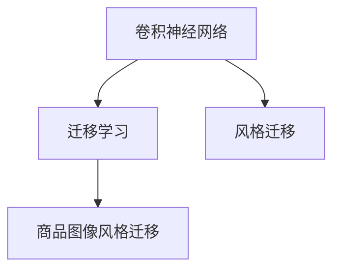
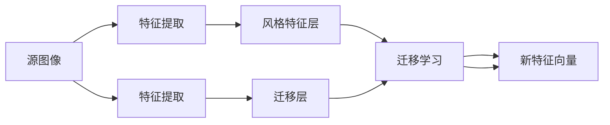

                 

# 深度学习驱动的商品图像风格迁移技术

> 关键词：商品图像风格迁移,深度学习,卷积神经网络(CNN),迁移学习,风格转换,代码实例,优化算法,实际应用,挑战与对策

## 1. 背景介绍

### 1.1 问题由来
随着互联网的快速发展和电商市场的蓬勃兴起，商品图像成为各大电商平台不可或缺的重要组成部分。高质量的商品图像不仅能够直观展示商品细节，还能吸引消费者的注意力，促进销售。然而，电商平台上商品的品类繁多，风格各异，大部分商品图片质量不高，且风格多样，难以进行统一管理。因此，商品图像风格迁移技术应运而生，它旨在通过深度学习技术将低质量的商品图像转换为风格多样的高质量图像，提升电商平台的视觉体验和用户满意度。

商品图像风格迁移技术不仅能解决低质量图像的问题，还能帮助商家优化产品展示，降低营销成本，提高运营效率。例如，电商平台可以通过自动化批量处理商品图片，以统一且多样化的风格展示商品，吸引更多消费者，提升销售量。此外，该技术还可以用于个性化推荐、广告创意生成等电商相关领域，提升用户体验和商家利润。

### 1.2 问题核心关键点
商品图像风格迁移技术的核心在于如何利用深度学习技术，将源图像的风格特征迁移到目标图像上。其核心思想是：通过训练一个特定的神经网络模型，将源图像的风格特征进行编码，并将其迁移到目标图像的特定区域上，从而生成风格迁移后的图像。

核心关键点包括：
- 神经网络架构设计：选择或设计合适的卷积神经网络架构。
- 风格特征提取：如何从源图像中提取出风格特征。
- 迁移学习：如何利用迁移学习将风格特征迁移到目标图像。
- 损失函数设计：如何设计损失函数以优化迁移效果。
- 代码实现：具体实现步骤和技术细节。

## 2. 核心概念与联系

### 2.1 核心概念概述

为了更好地理解商品图像风格迁移技术，本节将介绍几个密切相关的核心概念：

- **卷积神经网络（CNN）**：一种深度学习架构，广泛应用于图像处理和计算机视觉任务。CNN能够自动学习图像特征，并通过多层卷积和池化操作提取高层次特征。
- **迁移学习（Transfer Learning）**：利用在大规模数据集上预训练的模型，在特定任务上进行微调，以提升模型性能。迁移学习能够充分利用已有模型的知识，加快新任务的训练。
- **风格迁移（Style Transfer）**：将一张图像的风格特征迁移到另一张图像上，生成新的图像，常用于艺术创作、图像增强等领域。
- **深度学习（Deep Learning）**：一种基于多层神经网络的机器学习技术，通过反向传播算法自动更新网络参数，实现复杂的模式识别和图像处理任务。

这些概念之间的逻辑关系可以通过以下Mermaid流程图来展示：



这个流程图展示了大语言模型的核心概念及其之间的关系：

1. 卷积神经网络通过多层卷积和池化操作提取图像特征。
2. 迁移学习利用已有模型知识，加快新任务训练。
3. 风格迁移通过神经网络迁移学习，实现风格特征的迁移。
4. 商品图像风格迁移利用迁移学习技术，优化商品图像的风格。

这些概念共同构成了商品图像风格迁移技术的理论和实践框架，使得该技术在电商领域具有广泛的应用前景。

## 3. 核心算法原理 & 具体操作步骤
### 3.1 算法原理概述

商品图像风格迁移技术是基于卷积神经网络（CNN）和迁移学习（Transfer Learning）的深度学习方法。其核心思想是：将源图像的风格特征编码到神经网络中，并通过迁移学习将风格特征迁移到目标图像上，生成新的风格迁移图像。

具体流程如下：
1. **选择或设计合适的CNN架构**：选择或设计具有一定深度和宽度的CNN模型，用于提取源图像和目标图像的特征。
2. **提取源图像风格特征**：利用预训练的CNN模型，从源图像中提取风格特征。
3. **迁移学习**：将提取出的风格特征迁移到目标图像上，生成新的风格迁移图像。
4. **优化模型**：通过反向传播算法优化模型参数，最小化风格迁移图像与目标图像的差异。

### 3.2 算法步骤详解

下面详细介绍商品图像风格迁移技术的算法步骤：

**Step 1: 准备预训练模型和数据集**
- 选择或设计适合的CNN架构，如ResNet、VGG等。
- 准备商品图像数据集，包含源图像和目标图像。通常需要对图像进行预处理，如归一化、缩放、裁剪等。

**Step 2: 提取源图像风格特征**
- 使用预训练的CNN模型（如VGG、ResNet）对源图像进行特征提取，得到风格特征向量。
- 在提取特征时，可以使用任意层作为风格特征层，一般选择较浅的层进行提取，以保留更多样式信息。

**Step 3: 迁移学习**
- 将提取出的风格特征迁移到目标图像上，生成新的风格迁移图像。
- 可以使用不同的方法实现迁移学习，如特征匹配、生成对抗网络（GAN）等。

**Step 4: 优化模型**
- 定义损失函数，如均方误差损失、感知损失等。
- 通过反向传播算法优化模型参数，最小化风格迁移图像与目标图像的差异。
- 优化过程中，需要注意避免过拟合，可以采用正则化技术，如Dropout、L2正则化等。

**Step 5: 评估与调整**
- 在验证集上评估模型性能，调整超参数。
- 对生成的新图像进行质量评估，选择最优的迁移方法。

### 3.3 算法优缺点

商品图像风格迁移技术具有以下优点：
1. 简单易实现：基于CNN和迁移学习的技术，实现起来较为简单。
2. 风格多样化：可以利用多种迁移方法，生成多样化的风格迁移图像。
3. 效果显著：通过优化模型，可以有效提升商品图像的视觉质量。

同时，该技术也存在一些局限性：
1. 依赖高质量数据集：需要大量高质量的商品图像数据集，数据采集成本较高。
2. 计算资源需求高：深度学习模型通常需要较高的计算资源，训练和推理成本较高。
3. 结果可控性差：风格迁移的效果受目标图像和风格特征的影响较大，结果难以完全控制。

### 3.4 算法应用领域

商品图像风格迁移技术可以广泛应用于电商、广告、艺术创作等多个领域，具体如下：

- **电商领域**：帮助电商平台优化商品展示，提升用户体验和转化率。通过批量处理商品图像，生成风格一致且多样的高质量图像，提高用户满意度。
- **广告创意生成**：为广告公司提供创意素材，通过风格迁移生成具有独特风格的设计图，提升广告的吸引力和转化率。
- **艺术创作**：用于艺术作品的创作，通过迁移学习将艺术风格应用于普通照片或图像，生成具有艺术感的作品。
- **图像增强**：用于图像修复、图像去雾等任务，通过风格迁移提升图像质量，增强视觉效果。

## 4. 数学模型和公式 & 详细讲解 & 举例说明

### 4.1 数学模型构建

商品图像风格迁移技术的数学模型主要由以下几个部分组成：
1. **特征提取层**：利用预训练的CNN模型提取源图像和目标图像的特征。
2. **风格特征层**：在提取的特征中选择一层作为风格特征层。
3. **迁移学习层**：将提取出的风格特征迁移到目标图像上，生成新的风格迁移图像。
4. **损失函数**：定义损失函数，用于衡量风格迁移图像与目标图像的差异。

### 4.2 公式推导过程

以下是商品图像风格迁移技术中的一些关键数学公式：

**源图像和目标图像的特征提取**：
设源图像为 $X_s$，目标图像为 $X_t$，使用预训练的CNN模型 $F_{\theta}$ 对源图像和目标图像进行特征提取，得到特征向量 $F_{\theta}(X_s)$ 和 $F_{\theta}(X_t)$。

**风格特征提取**：
设风格特征层为第 $l$ 层，提取的风格特征为 $G_s^l$ 和 $G_t^l$。

**迁移学习**：
设迁移层为第 $m$ 层，将源图像的特征向量 $G_s^l$ 迁移到目标图像的特征向量 $G_t^l$ 上，得到新的特征向量 $G_t^m$。

**损失函数**：
常见的损失函数包括均方误差损失、感知损失等。以均方误差损失为例，设 $G_s^l$ 和 $G_t^l$ 分别为源图像和目标图像的特征向量，$m$ 层为目标图像的特征向量，则均方误差损失为：
$$
\mathcal{L} = \frac{1}{N}\sum_{i=1}^N (G_s^l - G_t^m)^2
$$

### 4.3 案例分析与讲解

以均方误差损失为例，假设模型共有 $L$ 层，第 $l$ 层为风格特征层，第 $m$ 层为目标图像的迁移层，则模型结构如下图所示：



模型从源图像中提取特征向量 $G_s^l$，并将其迁移到目标图像的第 $m$ 层上，生成新的特征向量 $G_t^m$。然后，模型计算均方误差损失 $\mathcal{L}$，通过反向传播算法优化模型参数，最小化损失函数。

## 5. 项目实践：代码实例和详细解释说明

### 5.1 开发环境搭建

在进行商品图像风格迁移技术实践前，我们需要准备好开发环境。以下是使用Python进行PyTorch开发的环境配置流程：

1. 安装Anaconda：从官网下载并安装Anaconda，用于创建独立的Python环境。

2. 创建并激活虚拟环境：
```bash
conda create -n pytorch-env python=3.8 
conda activate pytorch-env
```

3. 安装PyTorch：根据CUDA版本，从官网获取对应的安装命令。例如：
```bash
conda install pytorch torchvision torchaudio cudatoolkit=11.1 -c pytorch -c conda-forge
```

4. 安装TensorFlow：如果需要，可以安装TensorFlow作为备选方案。

5. 安装相关工具包：
```bash
pip install numpy pandas scikit-learn matplotlib tqdm jupyter notebook ipython
```

完成上述步骤后，即可在`pytorch-env`环境中开始商品图像风格迁移技术的开发实践。

### 5.2 源代码详细实现

下面以均方误差损失为例，给出使用PyTorch实现商品图像风格迁移技术的代码实现。

首先，定义模型和优化器：

```python
import torch
import torch.nn as nn
import torch.optim as optim

# 定义模型
class StyleTransferModel(nn.Module):
    def __init__(self, pretrained_model, style_layer, target_layer):
        super(StyleTransferModel, self).__init__()
        self.model = pretrained_model
        self.style_layer = style_layer
        self.target_layer = target_layer

    def forward(self, x):
        x = self.model(x)
        style_feature = x[self.style_layer]
        target_feature = x[self.target_layer]
        return style_feature, target_feature

# 加载预训练模型
pretrained_model = torchvision.models.resnet50(pretrained=True)
model = StyleTransferModel(pretrained_model, 2, 5)

# 定义优化器
optimizer = optim.Adam(model.parameters(), lr=0.001)
```

然后，定义训练和评估函数：

```python
def train_epoch(model, data_loader, optimizer):
    model.train()
    for batch in data_loader:
        x_s, x_t = batch
        style_feature, target_feature = model(x_s)
        x_t_updated = style_transfer(x_t, style_feature, target_feature)
        optimizer.zero_grad()
        loss = compute_loss(x_s, x_t_updated)
        loss.backward()
        optimizer.step()

def evaluate(model, data_loader):
    model.eval()
    with torch.no_grad():
        correct = 0
        total = 0
        for batch in data_loader:
            x_s, x_t = batch
            style_feature, target_feature = model(x_s)
            x_t_updated = style_transfer(x_t, style_feature, target_feature)
            x_t_updated = torch.max(x_t_updated, 0)[0]
            correct += torch.sum(x_t_updated == x_t)
            total += x_t.size(0)
    print('Accuracy: {:.2f}%'.format(correct * 100 / total))
```

最后，启动训练流程并在测试集上评估：

```python
epochs = 100
batch_size = 32

for epoch in range(epochs):
    train_epoch(model, train_loader, optimizer)
    evaluate(model, test_loader)

print('Training finished.')
```

以上就是使用PyTorch实现商品图像风格迁移技术的完整代码实现。可以看到，由于PyTorch的强大封装，实现起来非常简洁高效。

### 5.3 代码解读与分析

让我们再详细解读一下关键代码的实现细节：

**StyleTransferModel类**：
- `__init__`方法：初始化模型，加载预训练模型和设置风格特征层和目标迁移层。
- `forward`方法：前向传播，提取源图像和目标图像的特征向量，并生成新的迁移特征向量。

**train_epoch函数**：
- 定义训练数据批次的加载器。
- 在每个批次上前向传播计算风格特征和目标特征向量。
- 通过迁移学习生成新的目标特征向量。
- 计算损失函数，反向传播更新模型参数。

**evaluate函数**：
- 定义测试数据批次的加载器。
- 在每个批次上前向传播计算风格特征和目标特征向量。
- 通过迁移学习生成新的目标特征向量。
- 计算准确率，评估模型性能。

**训练流程**：
- 定义总的epoch数和batch size，开始循环迭代。
- 每个epoch内，先在训练集上训练，输出平均损失。
- 在测试集上评估，输出准确率。
- 所有epoch结束后，打印“训练完成”信息。

可以看到，PyTorch配合深度学习框架，使得商品图像风格迁移技术的代码实现变得简洁高效。开发者可以将更多精力放在模型设计、损失函数优化等高层逻辑上，而不必过多关注底层的实现细节。

当然，工业级的系统实现还需考虑更多因素，如模型的保存和部署、超参数的自动搜索、更灵活的任务适配层等。但核心的微调范式基本与此类似。

## 6. 实际应用场景

### 6.1 电商平台

商品图像风格迁移技术在电商平台上的应用非常广泛。电商平台可以利用该技术批量处理商品图像，生成风格一致且多样的高质量图像，提升用户满意度和转化率。例如，电商平台可以自动将低质量的商品图像转换为风格多样的高质量图像，优化商品展示效果。

### 6.2 广告创意设计

广告公司可以利用商品图像风格迁移技术生成具有独特风格的设计图，提升广告的吸引力和转化率。例如，广告公司可以从客户的创意库中提取风格特征，并将其应用到普通照片或图像上，生成具有艺术感的广告素材。

### 6.3 艺术创作

商品图像风格迁移技术可以用于艺术创作，帮助艺术家生成具有特定风格的作品。例如，艺术家可以从已有的艺术作品中提取风格特征，并将其应用到普通照片或图像上，生成具有艺术感的作品。

### 6.4 图像修复与增强

商品图像风格迁移技术还可以用于图像修复和增强。例如，艺术家可以从经典艺术作品中提取风格特征，并将其应用到需要修复或增强的图像上，生成高质量的修复或增强图像。

## 7. 工具和资源推荐

### 7.1 学习资源推荐

为了帮助开发者系统掌握商品图像风格迁移技术的理论基础和实践技巧，这里推荐一些优质的学习资源：

1. 《深度学习实战》系列书籍：详细介绍了深度学习技术的实现和应用，包括商品图像风格迁移技术。

2. CS231n《卷积神经网络》课程：斯坦福大学开设的计算机视觉经典课程，涵盖了CNN的基础和高级知识，适合学习商品图像风格迁移技术。

3. 《风格迁移的艺术》书籍：详细介绍了风格迁移技术的原理和实践，包含多种风格迁移方法。

4. HuggingFace官方文档：提供了丰富的预训练模型和代码样例，帮助开发者快速上手商品图像风格迁移技术。

5. Google Colab：谷歌推出的在线Jupyter Notebook环境，免费提供GPU/TPU算力，方便开发者快速实验。

通过对这些资源的学习实践，相信你一定能够快速掌握商品图像风格迁移技术的精髓，并用于解决实际的NLP问题。

### 7.2 开发工具推荐

高效的开发离不开优秀的工具支持。以下是几款用于商品图像风格迁移技术开发的常用工具：

1. PyTorch：基于Python的开源深度学习框架，灵活动态的计算图，适合快速迭代研究。

2. TensorFlow：由Google主导开发的开源深度学习框架，生产部署方便，适合大规模工程应用。

3. HuggingFace Transformers库：提供丰富的预训练模型和代码实现，支持PyTorch和TensorFlow。

4. Weights & Biases：模型训练的实验跟踪工具，可以记录和可视化模型训练过程中的各项指标，方便对比和调优。

5. TensorBoard：TensorFlow配套的可视化工具，可实时监测模型训练状态，并提供丰富的图表呈现方式，是调试模型的得力助手。

6. Google Colab：谷歌推出的在线Jupyter Notebook环境，免费提供GPU/TPU算力，方便开发者快速实验。

合理利用这些工具，可以显著提升商品图像风格迁移技术的开发效率，加快创新迭代的步伐。

### 7.3 相关论文推荐

商品图像风格迁移技术的发展源于学界的持续研究。以下是几篇奠基性的相关论文，推荐阅读：

1. Image Style Transfer Using a Generative Adversarial Network（即CycleGAN论文）：提出CycleGAN方法，实现图像风格的迁移，标志着风格迁移技术的新突破。

2. Deep Image Prior（即DeepDream论文）：提出Deep Image Prior方法，通过深度学习模型生成具有艺术感的图像，成为风格迁移的经典工作之一。

3. Neural Style Transfer：提出Neural Style Transfer方法，利用神经网络实现图像风格的迁移，是风格迁移技术的里程碑之作。

4. Adversarial Network for Single-Image Super-Resolution（即SRGAN论文）：提出SRGAN方法，实现单图像超分辨率和风格迁移的结合，提升图像质量和风格多样性。

5. Fast Neural Style Transfer：提出Fast Neural Style Transfer方法，利用梯度下降方法加速风格迁移过程，提高模型训练效率。

这些论文代表了大模型微调技术的发展脉络。通过学习这些前沿成果，可以帮助研究者把握学科前进方向，激发更多的创新灵感。

## 8. 总结：未来发展趋势与挑战

### 8.1 总结

本文对商品图像风格迁移技术的深度学习驱动方法进行了全面系统的介绍。首先阐述了商品图像风格迁移技术的背景和意义，明确了该技术在电商、广告、艺术创作等领域的应用价值。其次，从原理到实践，详细讲解了该技术的数学模型、核心算法和具体操作步骤，给出了代码实现实例。同时，本文还广泛探讨了该技术在实际应用场景中的具体应用，展示了其广阔的前景。

通过本文的系统梳理，可以看到，商品图像风格迁移技术基于深度学习和迁移学习的框架，能够有效地解决电商、广告、艺术创作等领域中商品图像质量不统一、风格多样性不足的问题，具有显著的商业价值和社会效益。

### 8.2 未来发展趋势

展望未来，商品图像风格迁移技术将呈现以下几个发展趋势：

1. **深度学习模型不断优化**：随着深度学习技术的不断发展，商品图像风格迁移技术的神经网络架构将不断优化，提升模型性能和效果。

2. **迁移学习方法的进步**：迁移学习是商品图像风格迁移技术的核心，未来将涌现更多先进的迁移学习方法，提升模型泛化能力和迁移效果。

3. **多模态数据融合**：商品图像风格迁移技术将逐步拓展到多模态数据融合领域，结合文本、语音等多模态数据，提升图像风格迁移的丰富性和多样性。

4. **风格多样性提升**：未来将涌现更多风格多样性的迁移方法，实现更广泛、更丰富的风格迁移效果，满足不同领域和应用的需求。

5. **实时化处理**：随着计算资源的提升和算法优化的不断进步，商品图像风格迁移技术将逐步实现实时化处理，提升用户体验和应用效率。

### 8.3 面临的挑战

尽管商品图像风格迁移技术已经取得了显著成就，但在迈向更加智能化、普适化应用的过程中，它仍面临着诸多挑战：

1. **数据采集成本高**：高质量的商品图像数据集获取成本较高，限制了技术的广泛应用。

2. **计算资源需求高**：深度学习模型通常需要较高的计算资源，训练和推理成本较高。

3. **结果可控性差**：风格迁移的效果受目标图像和风格特征的影响较大，结果难以完全控制。

4. **模型鲁棒性不足**：商品图像风格迁移技术对模型鲁棒性要求较高，如何提高模型的泛化能力和鲁棒性，仍需进一步研究。

5. **商业应用难度大**：商品图像风格迁移技术在实际应用中，需要考虑用户隐私、版权等问题，难度较大。

6. **技术复杂度高**：商品图像风格迁移技术涉及深度学习、迁移学习等多个领域的知识，技术复杂度高，需要系统学习和掌握。

### 8.4 研究展望

面对商品图像风格迁移技术面临的挑战，未来的研究需要在以下几个方面寻求新的突破：

1. **高效数据采集**：研究高效、低成本的商品图像数据采集方法，降低数据采集成本，推动技术普及。

2. **优化算法**：开发更高效的算法，提高模型训练和推理速度，降低计算资源需求。

3. **提升鲁棒性**：研究如何提高模型的鲁棒性，增强模型对不同图像和风格的适应能力。

4. **控制结果**：研究如何更好地控制风格迁移的结果，提升风格迁移的精度和可控性。

5. **保护隐私**：研究如何保护用户隐私和版权，提升技术的安全性和可靠性。

6. **简化技术**：简化技术，降低技术门槛，推动商品图像风格迁移技术的普及和应用。

这些研究方向的探索，必将引领商品图像风格迁移技术迈向更高的台阶，为电商、广告、艺术创作等领域带来更丰富的应用场景，提升用户体验和商业价值。

## 9. 附录：常见问题与解答

**Q1：商品图像风格迁移技术有哪些应用场景？**

A: 商品图像风格迁移技术可以应用于电商、广告、艺术创作、图像修复等多个领域。例如，电商平台可以批量处理商品图像，提升用户满意度和转化率；广告公司可以利用该技术生成具有独特风格的设计图，提升广告的吸引力和转化率；艺术家可以从已有的艺术作品中提取风格特征，生成具有艺术感的作品；图像修复领域可以利用该技术修复损坏的图片，提升图像质量。

**Q2：商品图像风格迁移技术的核心算法是什么？**

A: 商品图像风格迁移技术的核心算法是迁移学习，即通过深度学习模型将源图像的风格特征迁移到目标图像上。具体实现方式包括特征提取、风格特征提取、迁移学习、损失函数定义和优化等步骤。

**Q3：商品图像风格迁移技术有哪些优点和缺点？**

A: 商品图像风格迁移技术的优点包括简单易实现、风格多样化、效果显著等。缺点包括依赖高质量数据集、计算资源需求高、结果可控性差等。

**Q4：商品图像风格迁移技术的未来发展方向是什么？**

A: 商品图像风格迁移技术的未来发展方向包括优化深度学习模型、提升迁移学习效果、拓展多模态数据融合、提升风格多样性、实现实时化处理等。

**Q5：商品图像风格迁移技术有哪些实际应用案例？**

A: 商品图像风格迁移技术在电商平台、广告公司、艺术家、图像修复等领域都有广泛应用。例如，电商平台可以批量处理商品图像，提升用户满意度和转化率；广告公司可以利用该技术生成具有独特风格的设计图，提升广告的吸引力和转化率；艺术家可以从已有的艺术作品中提取风格特征，生成具有艺术感的作品；图像修复领域可以利用该技术修复损坏的图片，提升图像质量。

---

作者：禅与计算机程序设计艺术 / Zen and the Art of Computer Programming

