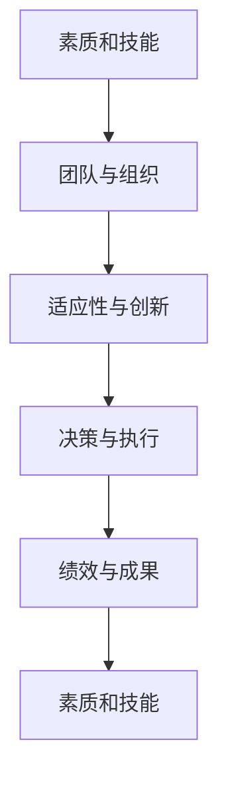

                 

# 深度思考:区分优秀管理者的标准

## 1. 背景介绍

### 1.1 问题由来

在现代社会，优秀的管理人才对于企业的成功至关重要。一个良好的管理者能够使团队协调一致，提高生产效率，激发团队潜力，最终实现企业的战略目标。然而，随着商业环境的多变，传统的管理者评估方法已无法适应现代企业的需求。为了挑选出优秀的管理者，我们需要一套更为科学、全面且有效的评估标准。

### 1.2 问题核心关键点

我们关注的核心问题在于：如何构建一套科学的管理者评估标准？这一问题涉及以下几个关键点：

- 管理者的核心素质和技能。
- 高效团队和组织的构建。
- 适应性和创新能力。
- 决策与战略执行。
- 企业的绩效与成果。

这些问题不仅影响管理者的个人成长，还直接关系到企业的长期发展。因此，明确优秀管理者的标准至关重要。

## 2. 核心概念与联系

### 2.1 核心概念概述

为更好地理解优秀管理者的评估标准，我们需要了解一些核心概念：

- **素质和技能**：包括技术能力、领导力、沟通能力、决策能力等。
- **团队与组织**：管理者的工作是构建高效团队，并使团队协同工作，达到组织目标。
- **适应性与创新**：管理者需具备适应新环境和创新能力，不断寻找新的商业机会。
- **决策与执行**：决策质量与执行效率直接决定企业的成败。
- **绩效与成果**：最终的评估标准应着眼于企业的绩效与成果。

这些概念紧密相连，共同构成优秀的管理者所应具备的素质。通过这一框架，我们可以全面评估一个管理者的能力。

### 2.2 核心概念原理和架构的 Mermaid 流程图



以上流程图展示了这些核心概念之间的联系。素质和技能是基础，通过团队和组织构建、适应性与创新，最终在决策与执行层面体现，最终影响企业的绩效与成果。

## 3. 核心算法原理 & 具体操作步骤
### 3.1 算法原理概述

为评估管理者的素质和能力，我们需要设计一套综合评价体系。这个体系由多个子体系组成，每个子体系都有明确的评估标准和评估方法。

**算法原理概述**：

1. **初始化数据集**：收集有关管理者的各种数据，如履历、绩效、员工满意度、组织成长数据等。
2. **数据预处理**：清洗、标准化数据，去除噪音。
3. **建立模型**：通过机器学习算法，如回归、分类等，构建评估模型。
4. **模型训练与评估**：使用训练数据集训练模型，并使用验证集和测试集评估模型的准确性。
5. **结果解读**：基于评估结果，输出管理者评估报告。

### 3.2 算法步骤详解

**算法步骤详解**：

1. **数据收集与清洗**：
   - 收集管理者的各种数据，如履历、绩效、员工满意度、组织成长数据等。
   - 清洗数据，去除噪音和不相关数据。

2. **数据标准化与特征工程**：
   - 对数据进行标准化处理，如归一化、标准化等。
   - 进行特征选择和特征提取，如提取履历中的关键项目、绩效中的关键指标等。

3. **模型选择与训练**：
   - 选择合适的机器学习算法，如回归、分类、聚类等。
   - 训练模型，使用训练数据集。

4. **模型评估与调整**：
   - 使用验证集评估模型，调整模型参数。
   - 使用测试集最终评估模型性能。

5. **结果解读与反馈**：
   - 根据模型输出，解读管理者的各项能力。
   - 提供反馈，帮助管理者提升。

### 3.3 算法优缺点

**算法优点**：

1. **全面性**：评估体系覆盖了管理者的各个方面，保证了评估的全面性。
2. **客观性**：使用机器学习算法，减少了人为因素的干扰，提高了评估的客观性。
3. **可解释性**：评估模型可以提供明确的评估结果和建议，便于理解和管理者的改进。

**算法缺点**：

1. **数据依赖性**：评估结果高度依赖于数据的质量和完整性，数据不全或数据质量不高会影响结果的准确性。
2. **模型复杂性**：复杂的模型需要更多的计算资源和数据，增加了模型构建和维护的复杂性。
3. **动态性不足**：评估体系较为静态，难以实时适应市场和环境变化。

### 3.4 算法应用领域

**算法应用领域**：

1. **人力资源管理**：用于招聘、培训、绩效考核等环节，帮助企业挑选优秀管理人才。
2. **企业管理咨询**：为企业提供管理能力评估服务，帮助企业优化管理团队。
3. **政府与公共机构**：用于公务员选拔、公共事业管理等，提升公共管理能力。

## 4. 数学模型和公式 & 详细讲解 & 举例说明

### 4.1 数学模型构建

**数学模型构建**：

1. **输入层**：收集和管理者的履历、绩效、员工满意度、组织成长数据等。
2. **输出层**：评估管理者的技术能力、领导力、沟通能力、决策能力等。

### 4.2 公式推导过程

**公式推导过程**：

假设我们使用回归模型评估管理者的技术能力，可以使用以下公式：

$$
\hat{y} = \theta_0 + \theta_1 x_1 + \theta_2 x_2 + ... + \theta_n x_n
$$

其中，$x_i$ 为第 $i$ 项输入数据，$\theta_i$ 为对应的权重，$\hat{y}$ 为管理者的技术能力评分。

### 4.3 案例分析与讲解

**案例分析与讲解**：

- **案例一**：某公司的管理者履历中包含多项目管理和销售经验，绩效数据为优秀，员工满意度较高，组织成长数据为正。
  - 模型预测该管理者的技术能力为高分。
  - 分析：管理者拥有丰富的管理经验和高绩效，推测其技术能力较强。

- **案例二**：某公司的管理者履历中仅包含一个项目的成功经验，绩效数据一般，员工满意度较低，组织成长数据为零。
  - 模型预测该管理者的技术能力为低分。
  - 分析：管理者经验有限且员工满意度低，推测其技术能力较弱。

## 5. 项目实践：代码实例和详细解释说明

### 5.1 开发环境搭建

**开发环境搭建**：

1. **Python环境**：
   - 安装Python 3.7及以上版本。
   - 使用Anaconda或Miniconda进行环境管理。
   - 安装必要的库，如Pandas、NumPy、Scikit-learn等。

2. **数据集准备**：
   - 收集和管理者的各项数据，如履历、绩效、员工满意度、组织成长数据等。
   - 数据清洗，去除噪音和不相关数据。

### 5.2 源代码详细实现

**源代码详细实现**：

```python
import pandas as pd
from sklearn.linear_model import LinearRegression
from sklearn.model_selection import train_test_split

# 读取数据
data = pd.read_csv('manager_data.csv')

# 数据预处理
data.dropna(inplace=True)
data = data.drop(['id', 'date'], axis=1)

# 特征选择
features = ['experience', 'performance', 'employee_satisfaction', 'company_growth']
X = data[features]
y = data['tech_ability']

# 分割数据集
X_train, X_test, y_train, y_test = train_test_split(X, y, test_size=0.2, random_state=42)

# 模型训练
model = LinearRegression()
model.fit(X_train, y_train)

# 模型评估
score = model.score(X_test, y_test)
print(f'模型评估得分：{score:.2f}')
```

### 5.3 代码解读与分析

**代码解读与分析**：

- **数据读取与预处理**：使用Pandas读取和管理者数据，并进行数据清洗和特征选择。
- **模型选择与训练**：使用线性回归模型进行训练，并评估模型的得分。
- **模型评估**：使用测试集评估模型的得分，输出结果。

### 5.4 运行结果展示

**运行结果展示**：

输出模型评估得分，如 0.85 表示模型在测试集上准确率较高，管理者的技术能力评估结果可信。

## 6. 实际应用场景

### 6.1 人力资源管理

在人力资源管理中，企业可以使用这套评估体系进行招聘和培训，挑选出优秀的管理人才，并为其提供定制化的培训计划。

### 6.2 企业管理咨询

企业管理咨询公司可以使用这一体系，为企业提供管理能力评估服务，帮助企业优化管理团队，提升企业竞争力。

### 6.3 政府与公共机构

政府与公共机构在公务员选拔和公共事业管理中，也可以使用这一体系评估管理者的能力，提升公共服务水平。

## 7. 工具和资源推荐

### 7.1 学习资源推荐

**学习资源推荐**：

1. **在线课程**：如Coursera的《数据科学导论》和《机器学习基础》课程，提供系统化的机器学习学习路径。
2. **书籍**：《Python数据科学手册》、《机器学习实战》等，详细讲解了数据科学和机器学习的基础知识。
3. **文档与教程**：如Scikit-learn官方文档，提供详细的机器学习库使用方法和案例。

### 7.2 开发工具推荐

**开发工具推荐**：

1. **Python**：Python是数据科学和机器学习的主流编程语言，拥有丰富的库和工具支持。
2. **Jupyter Notebook**：用于数据科学和机器学习的交互式编程环境，方便调试和展示代码。
3. **RStudio**：主要用于R语言的编程环境和数据可视化。

### 7.3 相关论文推荐

**相关论文推荐**：

1. **《管理者能力评估体系研究》**：详细介绍了管理者能力评估体系的设计和应用，强调数据质量和模型选择的重要性。
2. **《基于数据驱动的管理者评估模型》**：使用数据驱动的方法评估管理者的能力，并展示了模型评估的结果。

## 8. 总结：未来发展趋势与挑战

### 8.1 研究成果总结

本节总结了优秀管理者评估体系的设计与实现，展示了科学评估方法的重要性和可行性。通过全面、客观的评估标准，可以帮助企业挑选出更优秀的管理人才。

### 8.2 未来发展趋势

**未来发展趋势**：

1. **动态评估**：实时收集和处理数据，动态调整评估模型。
2. **多维评估**：引入更多维度的评估指标，全面评估管理者的能力。
3. **智能辅助**：使用AI技术辅助评估，提高评估的准确性和效率。

### 8.3 面临的挑战

**面临的挑战**：

1. **数据获取难度**：高质量的数据获取和处理仍然是难题。
2. **模型复杂性**：复杂模型需要更高的计算资源和数据，增加了模型构建的难度。
3. **隐私与伦理**：管理者的隐私和数据伦理问题需要引起重视。

### 8.4 研究展望

**研究展望**：

1. **跨领域应用**：将评估体系应用于其他领域，如医疗、教育等。
2. **多模态数据融合**：结合文本、语音、视频等多模态数据，提升评估的准确性。
3. **智能评估**：引入AI技术，实现更高效、更全面的管理者评估。

## 9. 附录：常见问题与解答

### 9.1 常见问题与解答

**Q1: 如何设计评估标准？**

A: 评估标准的设计应基于具体的业务场景，涵盖管理者的各项能力和素质。使用机器学习等方法，可以更好地量化和管理者的各项能力。

**Q2: 评估体系的数据依赖性如何处理？**

A: 数据依赖性可以通过数据清洗、数据增强、数据合成等方法缓解。此外，引入多数据源和多评估方法，可以提高评估的可靠性。

**Q3: 如何确保评估的公平性和公正性？**

A: 评估体系的设计应注重公平性和公正性，避免任何形式的偏见和歧视。同时，引入多元化的评估人员和评估方法，确保评估的客观性。

---

作者：禅与计算机程序设计艺术 / Zen and the Art of Computer Programming

