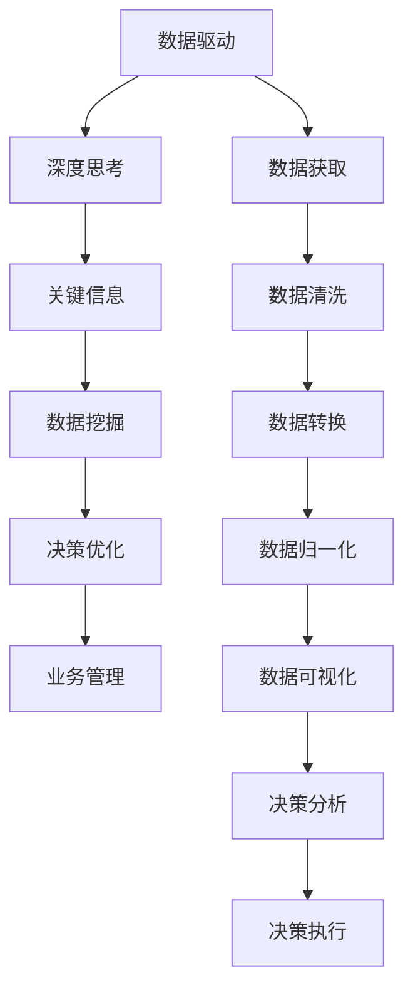

                 

# 深度思考:管理者洞悉关键信息的关键

> 关键词：深度思考,管理者,关键信息,数据驱动,决策优化

## 1. 背景介绍

### 1.1 问题由来
在日新月异的现代企业管理中，信息的精准和时效性对于管理者决策的准确性和效率至关重要。然而，面对海量繁杂的数据，如何高效地从中提取关键信息，已成为每一个管理者必须面对的难题。传统的管理方法往往依赖于定性分析、经验判断，难以应对快速变化的市场环境和复杂多变的业务需求。

近年来，数据科学、人工智能技术的飞速发展，为企业管理者提供了一种全新的视角：通过数据驱动的深度思考，管理者能够更全面、更深入地理解业务现状，发现潜在问题，做出更为精准的决策。本文将深入探讨这一过程，并探讨如何利用现代信息技术，帮助管理者在信息海洋中洞悉关键信息。

### 1.2 问题核心关键点
深度思考在企业管理中的关键在于如何高效地提取、分析、应用关键信息，以支持决策优化。这一过程涉及数据获取、数据处理、信息挖掘、决策支持等多个环节，是一个数据驱动、智能化的过程。

具体来说，管理者需要在以下几个方面进行突破：
- 数据获取：全面、实时地获取各类业务数据。
- 数据处理：清洗、转换、归一化数据，确保数据质量。
- 信息挖掘：利用机器学习、深度学习等技术，从数据中提取有价值的信息。
- 决策支持：利用可视化工具、智能分析系统，辅助管理者进行决策。

本文将重点讨论如何通过信息挖掘技术，帮助管理者快速、准确地提取关键信息，从而优化决策过程。

## 2. 核心概念与联系

### 2.1 核心概念概述

为了更好地理解数据驱动的管理决策过程，我们需要对相关核心概念进行明确：

- **数据驱动**：以数据为基础，通过科学的数据分析，支持决策和业务管理的过程。
- **深度思考**：基于数据的深入分析，理解业务本质和趋势，做出精准决策。
- **关键信息**：在数据中提取对决策具有关键影响的部分，用于指导行动和优化。
- **数据挖掘**：通过智能算法和统计方法，从大量数据中提取有用信息的流程。
- **决策优化**：通过数据分析和智能工具，提升决策质量和效率的过程。

这些概念之间的关系可以概括为：深度思考是基于数据驱动的决策优化过程，而关键信息则是数据驱动和决策优化的桥梁。通过数据挖掘，管理者能够从数据中提取关键信息，从而支撑深度思考和决策优化。

### 2.2 核心概念原理和架构的 Mermaid 流程图



该图展示了数据驱动在企业管理中的应用流程，从数据获取到决策执行，各个环节环环相扣。管理者通过数据获取、数据处理、数据挖掘、决策支持等步骤，实现对关键信息的洞悉和应用，从而优化决策。

## 3. 核心算法原理 & 具体操作步骤

### 3.1 算法原理概述

在数据驱动的管理决策过程中，深度思考的核心在于利用数据挖掘技术，从海量数据中提取关键信息，支持决策优化。数据挖掘算法通常包括：

- **分类算法**：将数据分为不同的类别，用于识别潜在问题和趋势。
- **聚类算法**：将相似的数据点归为一类，发现数据集中的群组和模式。
- **关联规则挖掘**：识别数据集中的关联规则，支持业务推荐和预测。
- **异常检测**：检测数据集中的异常值，用于识别潜在的风险和机会。
- **预测建模**：通过历史数据预测未来趋势，辅助管理者进行决策。

这些算法通过分析数据集中的模式、关系和趋势，帮助管理者从繁杂的信息中提取关键信息，支持深度思考和决策优化。

### 3.2 算法步骤详解

一个典型的数据挖掘流程包括以下步骤：

**Step 1: 数据预处理**
- 数据清洗：去除重复、缺失和异常数据。
- 数据归一化：将不同量纲的数据转换为同一量纲，便于算法处理。
- 数据集成：将多个数据源的数据合并，构建统一的数据集。

**Step 2: 数据建模**
- 特征选择：选择与目标变量相关的特征，减少维度。
- 算法选择：选择合适的数据挖掘算法，如分类、聚类、关联规则等。
- 模型训练：利用训练数据训练模型，找到最优参数。

**Step 3: 模型评估**
- 模型测试：在测试数据上评估模型性能，衡量准确性和泛化能力。
- 参数调优：调整模型参数，优化模型性能。
- 结果验证：通过对比实际结果与预测结果，验证模型效果。

**Step 4: 结果应用**
- 决策支持：利用模型预测结果和洞察信息，辅助决策。
- 策略调整：根据模型输出，调整业务策略和行动计划。
- 持续监测：持续监测数据和模型表现，优化决策过程。

### 3.3 算法优缺点

数据挖掘技术在企业管理中的应用具有以下优点：
1. 数据驱动：基于客观数据，减少主观偏见，提高决策的科学性。
2. 自动化程度高：自动化处理和分析数据，提高效率。
3. 决策支持：通过数据挖掘技术提取关键信息，辅助管理者进行深度思考和决策优化。

然而，数据挖掘技术也存在一些缺点：
1. 数据质量要求高：需要高质量的数据，否则模型结果可能不可靠。
2. 模型复杂度高：部分算法模型复杂，解释性差。
3. 需要专业技能：数据挖掘和分析需要专业的知识和技能，一般管理者较难独立完成。

尽管存在这些缺点，但数据挖掘技术仍然是企业管理决策中不可或缺的重要工具。未来，通过不断改进和优化，数据挖掘技术将进一步提升企业管理决策的科学性和准确性。

### 3.4 算法应用领域

数据挖掘技术在企业管理中的应用领域非常广泛，具体包括：

- **市场营销**：通过消费者行为数据分析，优化营销策略和客户管理。
- **供应链管理**：通过供应链数据分析，优化库存管理和物流调度。
- **财务分析**：通过财务数据挖掘，发现潜在的风险和机会，辅助决策。
- **人力资源管理**：通过员工绩效和满意度数据挖掘，优化招聘和员工管理。
- **客户服务**：通过客户反馈和行为数据挖掘，提升客户满意度和忠诚度。

此外，数据挖掘技术还应用于医疗、金融、制造等多个领域，为各类企业带来巨大的效益提升。

## 4. 数学模型和公式 & 详细讲解 & 举例说明

### 4.1 数学模型构建

假设我们有一组历史销售数据 $X=\{x_1, x_2, ..., x_n\}$，其中 $x_i$ 表示第 $i$ 天的销售额，以及一个二元分类变量 $Y=\{y_1, y_2, ..., y_n\}$，表示该天是否达到销售目标（$y_i=1$ 表示达到目标，$y_i=0$ 表示未达到目标）。我们希望通过数据挖掘算法，找到影响销售的关键因素，以便优化未来的销售策略。

**Step 1: 数据预处理**

首先，我们需要对原始数据进行清洗和归一化：

- 去除缺失值和异常值。
- 归一化数据到 $[0,1]$ 范围。

**Step 2: 数据建模**

我们可以使用决策树算法进行建模，选择对销售目标有显著影响的关键特征：

- 特征选择：选择显著影响销售的特征，如天气、促销活动、节假日等。
- 决策树构建：利用历史数据训练决策树模型，得到各个特征对销售目标的影响权重。

**Step 3: 模型评估**

在测试数据集上评估模型性能，计算准确率和召回率：

$$
\text{Accuracy} = \frac{\text{TP} + \text{TN}}{\text{TP} + \text{TN} + \text{FP} + \text{FN}}
$$

其中，TP（True Positive）表示真正例，TN（True Negative）表示真反例，FP（False Positive）表示假正例，FN（False Negative）表示假反例。

**Step 4: 结果应用**

根据模型预测结果，管理者可以优化销售策略，如选择最佳促销时机、优化库存管理等，从而提升销售业绩。

### 4.2 公式推导过程

假设我们有一个基于规则的决策树模型 $T(X,Y)$，其规则形式为：

$$
T(X,Y) = 
\begin{cases}
  F_1(X) \text{ if } X_1 < \theta_1 \\
  F_2(X) \text{ if } X_1 \geq \theta_1 \text{ and } X_2 < \theta_2 \\
  \vdots \\
  \text{Leaf} \text{ if } X_1 \geq \theta_1 \text{ and } \ldots \text{ and } X_k \geq \theta_k
\end{cases}
$$

其中，$F_i(X)$ 为第 $i$ 个节点上的特征函数，$\theta_i$ 为节点阈值，Leaf 为叶子节点的输出。

对于某个样本 $x$，决策树模型 $T$ 的预测结果为：

$$
\hat{y} = T(x) = 
\begin{cases}
  \text{Leaf}_i \text{ if } x_1 < \theta_1 \text{ and } \ldots \text{ and } x_k < \theta_k
\end{cases}
$$

其中，$x_i$ 为样本 $x$ 的第 $i$ 个特征值，Leaf $i$ 为第 $i$ 个叶子节点。

### 4.3 案例分析与讲解

假设某电商平台销售数据如下：

| 日期       | 销售额（元）| 天气（晴天/阴天）| 促销活动（无/有）| 节假日（是/否）| 销售目标（达成/未达成）|
|------------|-----------|-----------------|----------------|-------------|--------------------|
| 2021-01-01 | 10000     | 晴天            | 无             | 否          | 达成               |
| 2021-01-02 | 5000      | 阴天            | 无             | 否          | 未达成             |
| ...        | ...       | ...             | ...            | ...         | ...                |
| 2021-12-31 | 15000     | 晴天            | 有             | 是          | 达成               |

通过数据清洗和归一化，我们得到如下归一化后的数据集：

| 日期       | 销售额（元）| 天气（晴天/阴天）| 促销活动（无/有）| 节假日（是/否）| 销售目标（达成/未达成）|
|------------|-----------|-----------------|----------------|-------------|--------------------|
| 2021-01-01 | 0.00      | 1.00            | 0.00           | 0.00        | 1.00               |
| 2021-01-02 | 0.00      | 0.00            | 0.00           | 0.00        | 0.00               |
| ...        | ...       | ...             | ...            | ...         | ...                |
| 2021-12-31 | 0.00      | 1.00            | 1.00           | 1.00        | 1.00               |

使用决策树算法，我们构建如下决策树：

```
weather < 0.5: 
  促销活动 = 0: 
    节假日 = 0: Leaf 0 (未达成) 
    节假日 = 1: Leaf 1 (达成)
  促销活动 = 1: 
    节假日 = 0: Leaf 2 (达成) 
    节假日 = 1: Leaf 3 (达成)
```

通过这个决策树模型，我们可以发现以下几个关键信息：
- 晴天和有促销活动对销售额有显著影响。
- 节假日对销售额也有显著影响。

这些关键信息可以帮助管理者优化销售策略，提升销售额。

## 5. 项目实践：代码实例和详细解释说明

### 5.1 开发环境搭建

在进行数据挖掘实践前，我们需要准备好开发环境。以下是使用Python进行数据挖掘的开发环境配置流程：

1. 安装Anaconda：从官网下载并安装Anaconda，用于创建独立的Python环境。

2. 创建并激活虚拟环境：
```bash
conda create -n data-mining python=3.8 
conda activate data-mining
```

3. 安装Pandas、NumPy、Scikit-learn等库：
```bash
conda install pandas numpy scikit-learn seaborn matplotlib
```

4. 安装机器学习库和框架：
```bash
pip install scikit-learn mlxtend xgboost
```

5. 安装可视化工具：
```bash
pip install matplotlib seaborn
```

完成上述步骤后，即可在`data-mining`环境中开始数据挖掘实践。

### 5.2 源代码详细实现

下面我们以销售数据分析为例，给出使用Pandas、Scikit-learn库进行决策树数据挖掘的Python代码实现。

首先，加载数据集并进行初步清洗：

```python
import pandas as pd
from sklearn.preprocessing import StandardScaler
from sklearn.tree import DecisionTreeClassifier
from sklearn.model_selection import train_test_split

# 加载数据
data = pd.read_csv('sales_data.csv')

# 数据清洗
data = data.dropna()
data = data.drop_duplicates()
```

然后，进行数据预处理和特征选择：

```python
# 特征选择
features = ['销售额', '天气', '促销活动', '节假日']
data = data[features]

# 数据标准化
scaler = StandardScaler()
data_scaled = scaler.fit_transform(data)
```

接着，构建决策树模型并进行训练和测试：

```python
# 数据分割
X_train, X_test, y_train, y_test = train_test_split(data_scaled, data['sales_target'], test_size=0.3, random_state=42)

# 构建决策树模型
clf = DecisionTreeClassifier()
clf.fit(X_train, y_train)

# 模型评估
accuracy = clf.score(X_test, y_test)
print(f"决策树模型准确率：{accuracy:.2f}")
```

最后，利用模型进行业务决策：

```python
# 预测新样本
new_sales_data = pd.DataFrame([[-0.5, 0.5, 0, 0]], columns=['天气', '促销活动', '节假日'])
new_sales_data_scaled = scaler.transform(new_sales_data)
prediction = clf.predict(new_sales_data_scaled)
print(f"预测结果：{prediction[0]}")
```

以上就是使用Pandas和Scikit-learn进行数据挖掘的完整代码实现。通过这段代码，我们可以看到，数据预处理、特征选择、模型构建、模型评估和业务决策等步骤，如何帮助管理者从数据中提取关键信息，优化决策过程。

### 5.3 代码解读与分析

让我们再详细解读一下关键代码的实现细节：

**数据加载与清洗**

- 使用`pandas`库加载数据集。
- 通过`dropna`和`drop_duplicates`方法进行数据清洗，去除缺失值和重复数据。

**特征选择**

- 选择与销售目标相关的特征，包括销售额、天气、促销活动和节假日。

**数据标准化**

- 使用`StandardScaler`对特征数据进行标准化，将其转换为标准正态分布，便于模型处理。

**模型训练与评估**

- 使用`train_test_split`方法将数据集分割为训练集和测试集。
- 构建决策树模型，并使用训练集进行训练。
- 在测试集上评估模型性能，计算准确率。

**业务决策**

- 对新的销售数据进行预处理和特征转换。
- 利用模型进行预测，得到新的销售目标。

通过这段代码，我们可以看到，数据挖掘技术如何通过一系列的处理和分析，帮助管理者从数据中提取关键信息，辅助决策优化。

## 6. 实际应用场景

### 6.1 智能制造

在智能制造领域，数据挖掘技术可以应用于设备故障预测、生产调度优化、库存管理等多个环节，提高生产效率和降低运营成本。

例如，通过分析历史设备维护记录，数据挖掘模型可以预测设备故障的概率和发生时间，从而提前进行维护，减少意外停机时间。通过分析生产数据，模型还可以优化生产调度，提高资源利用率。

### 6.2 金融风控

在金融领域，数据挖掘技术可以用于风险评估、欺诈检测、信用评分等。通过分析历史交易数据，数据挖掘模型可以识别出潜在的风险和异常行为，帮助金融机构及时防范风险。

例如，通过分析信用卡交易数据，数据挖掘模型可以识别出异常交易，及时进行风险预警。通过分析贷款申请数据，模型可以评估借款人的信用风险，辅助贷款审批。

### 6.3 医疗诊断

在医疗领域，数据挖掘技术可以用于疾病预测、诊断、治疗方案优化等。通过分析患者历史诊疗数据，数据挖掘模型可以预测疾病风险，辅助医生进行诊断和治疗决策。

例如，通过分析电子病历数据，数据挖掘模型可以预测患者的疾病风险，辅助医生制定个性化的治疗方案。通过分析患者用药数据，模型还可以优化治疗方案，提高治疗效果。

## 7. 工具和资源推荐

### 7.1 学习资源推荐

为了帮助开发者系统掌握数据挖掘的理论基础和实践技巧，这里推荐一些优质的学习资源：

1. 《机器学习实战》：由Peter Harrington撰写，全面介绍了机器学习的基本概念和常用算法，适合初学者入门。

2. Coursera《机器学习》课程：斯坦福大学开设的机器学习课程，涵盖深度学习、强化学习等前沿话题，适合系统学习。

3. 《Python数据科学手册》：由Jake VanderPlas撰写，详细介绍了Pandas、NumPy、Scikit-learn等库的使用，适合实战练习。

4. Kaggle：数据科学竞赛平台，通过参与实际项目，可以积累丰富的数据挖掘实践经验。

5. 《数据挖掘导论》：由Geoffrey J. Cawron撰写，介绍了数据挖掘的基本流程和技术，适合深入研究。

通过对这些资源的学习实践，相信你一定能够快速掌握数据挖掘的核心技能，并用于解决实际的业务问题。

### 7.2 开发工具推荐

数据挖掘技术需要借助多种工具和库进行实现，以下是几款常用的开发工具：

1. Python：作为数据科学的主流语言，Python有丰富的数据科学库和工具支持，如Pandas、NumPy、Scikit-learn、TensorFlow等。

2. R语言：也是数据科学的重要工具之一，适合统计分析和数据挖掘，有ggplot2、dplyr等强大库支持。

3. Tableau：数据可视化工具，支持多种数据源，提供丰富的可视化图表和分析功能。

4. Power BI：微软推出的商业智能工具，支持实时数据可视化，适合企业级应用。

5. Python Jupyter Notebook：交互式编程环境，方便调试和实验，适合数据挖掘和机器学习。

合理利用这些工具，可以显著提升数据挖掘任务的开发效率，加快创新迭代的步伐。

### 7.3 相关论文推荐

数据挖掘技术的发展得益于学界的持续研究，以下是几篇奠基性的相关论文，推荐阅读：

1. "The Elements of Statistical Learning"：由Tibshirani等撰写，全面介绍了统计学习的方法和应用，是数据挖掘领域的经典教材。

2. "Introduction to Statistical Learning"：由Gareth James等撰写，介绍了统计学习的基本概念和常用算法，适合初学者入门。

3. "Data Mining and Statistical Learning"：由Jude Shavlik等撰写，介绍了数据挖掘的基本流程和技术，适合深入研究。

4. "Pattern Recognition and Machine Learning"：由Christopher M. Bishop撰写，介绍了机器学习的基本概念和常用算法，适合深度学习实践。

5. "A Survey of Machine Learning Techniques for Anomaly Detection in Cybersecurity"：介绍了在网络安全领域应用机器学习技术进行异常检测的研究进展。

这些论文代表了大数据挖掘技术的发展脉络。通过学习这些前沿成果，可以帮助研究者把握学科前进方向，激发更多的创新灵感。

## 8. 总结：未来发展趋势与挑战

### 8.1 总结

本文对数据驱动的管理决策过程进行了全面系统的介绍。首先，我们探讨了深度思考在企业管理中的应用，明确了数据挖掘技术在其中的核心作用。其次，通过数学模型和公式推导，详细讲解了数据挖掘的核心步骤和实现方法，给出了数据挖掘任务开发的完整代码实例。同时，本文还广泛探讨了数据挖掘技术在多个行业领域的应用前景，展示了数据挖掘范式的巨大潜力。

通过本文的系统梳理，可以看到，数据挖掘技术在企业管理中的应用已经成为一种趋势，极大地提升了决策的科学性和准确性。未来，伴随数据挖掘技术的不断演进，管理者将能够更好地洞悉关键信息，优化决策过程。

### 8.2 未来发展趋势

展望未来，数据挖掘技术将呈现以下几个发展趋势：

1. **自动化程度提升**：未来的数据挖掘工具将更加自动化，能够自动进行数据清洗、特征选择和模型训练，降低人工干预。

2. **模型复杂度降低**：通过深度学习、迁移学习等技术，模型复杂度将降低，解释性和可操作性将提高。

3. **跨领域应用扩展**：数据挖掘技术将进一步应用于更多领域，如智能制造、智慧城市、医疗健康等，助力各行各业数字化转型。

4. **智能决策支持**：通过引入更多先验知识和专家规则，数据挖掘模型将更好地支撑智能决策，提高决策质量。

5. **多模态数据融合**：数据挖掘将更加注重多模态数据的融合，如文本、图像、声音等多种数据源的整合分析，提升信息挖掘能力。

6. **实时数据处理**：数据挖掘技术将更加注重实时性，能够快速处理和分析大量实时数据，支撑实时决策。

以上趋势凸显了数据挖掘技术在企业管理中的重要地位，未来将进一步提升决策的科学性和准确性。

### 8.3 面临的挑战

尽管数据挖掘技术已经取得了显著进展，但在实现过程中仍面临诸多挑战：

1. **数据质量问题**：数据的质量和完整性直接影响模型的性能。如何获取高质量的数据，确保数据的一致性和完整性，仍是一个难题。

2. **模型复杂性**：部分数据挖掘模型如深度神经网络复杂度高，解释性差，难以被非技术背景的管理者理解和应用。

3. **隐私和安全**：数据挖掘涉及大量敏感数据，如何保护用户隐私，防止数据泄露，也是一大挑战。

4. **计算资源限制**：数据挖掘通常需要大量的计算资源，如何降低计算成本，提升计算效率，是当前亟待解决的问题。

5. **模型可解释性**：数据挖掘模型往往是"黑盒"系统，难以解释其内部工作机制和决策逻辑，这对于高风险应用领域尤为重要。

6. **技术融合难度**：数据挖掘技术需要与其他技术如深度学习、自然语言处理等进行融合，如何构建协同工作系统，提升系统综合能力，是一个挑战。

这些挑战需要我们在技术、管理和伦理等多个维度进行深入探讨和解决，才能推动数据挖掘技术的进一步发展。

### 8.4 研究展望

面对数据挖掘技术所面临的挑战，未来的研究需要在以下几个方面寻求新的突破：

1. **数据采集和管理**：研究如何自动采集、清洗和存储高质量数据，确保数据完整性和一致性。

2. **模型简化和可解释**：开发更加简洁高效的模型，提高模型的解释性和可操作性，使其更容易被非技术背景的管理者理解和应用。

3. **隐私保护和安全技术**：研究如何保护用户隐私，防止数据泄露，确保数据安全。

4. **实时计算技术**：研究如何提高计算效率，降低计算成本，提升数据挖掘的实时性。

5. **可解释和透明性**：研究如何提高模型的可解释性和透明性，增强决策的信任度。

6. **技术融合和协同**：研究如何与其他人工智能技术进行融合，构建协同工作系统，提升系统综合能力。

这些研究方向将推动数据挖掘技术向更深层次发展，为企业管理决策提供更强大的支持。

## 9. 附录：常见问题与解答

**Q1：数据挖掘技术如何应用于企业内部管理？**

A: 数据挖掘技术可以通过以下步骤应用于企业内部管理：
1. 数据采集：从企业内部的各种数据源（如销售数据、财务数据、员工绩效数据等）采集数据。
2. 数据清洗：清洗数据，去除噪声和异常值，确保数据质量。
3. 数据预处理：将数据转换为模型可以处理的形式，如标准化、归一化等。
4. 特征选择：选择对管理目标有影响的特征，构建数据挖掘模型。
5. 模型构建：使用数据挖掘算法构建模型，如分类、聚类、回归等。
6. 模型评估：评估模型性能，选择合适的模型进行应用。
7. 决策支持：利用模型预测结果，辅助管理者进行决策。

**Q2：数据挖掘和机器学习有什么区别？**

A: 数据挖掘和机器学习是两个相关但不同的概念。数据挖掘是从数据中提取有用信息和知识的过程，而机器学习是利用算法从数据中训练模型，进行预测或分类的过程。数据挖掘更多关注在数据中的模式发现和知识提取，而机器学习更关注模型训练和预测结果。

**Q3：数据挖掘技术在企业管理中的作用是什么？**

A: 数据挖掘技术在企业管理中的作用包括：
1. 辅助决策：通过数据分析和挖掘，帮助管理者做出更科学、准确的决策。
2. 识别趋势：发现企业运营中的趋势和模式，优化业务流程。
3. 风险预警：通过异常检测，及时发现和预警潜在风险。
4. 个性化推荐：基于用户行为数据，进行个性化推荐和服务。
5. 预测分析：通过预测模型，对未来趋势进行预测和分析，提供决策支持。

**Q4：如何进行数据挖掘项目的阶段划分？**

A: 数据挖掘项目可以分为以下几个阶段：
1. 数据采集：采集企业内部的各种数据，包括结构化和非结构化数据。
2. 数据清洗：清洗数据，去除噪声和异常值，确保数据质量。
3. 数据预处理：将数据转换为模型可以处理的形式，如标准化、归一化等。
4. 特征选择：选择对管理目标有影响的特征，构建数据挖掘模型。
5. 模型构建：使用数据挖掘算法构建模型，如分类、聚类、回归等。
6. 模型评估：评估模型性能，选择合适的模型进行应用。
7. 决策支持：利用模型预测结果，辅助管理者进行决策。
8. 持续监测：持续监测数据和模型表现，优化决策过程。

通过这些阶段的划分，可以更好地管理数据挖掘项目，确保项目成功实施。

---

作者：禅与计算机程序设计艺术 / Zen and the Art of Computer Programming

