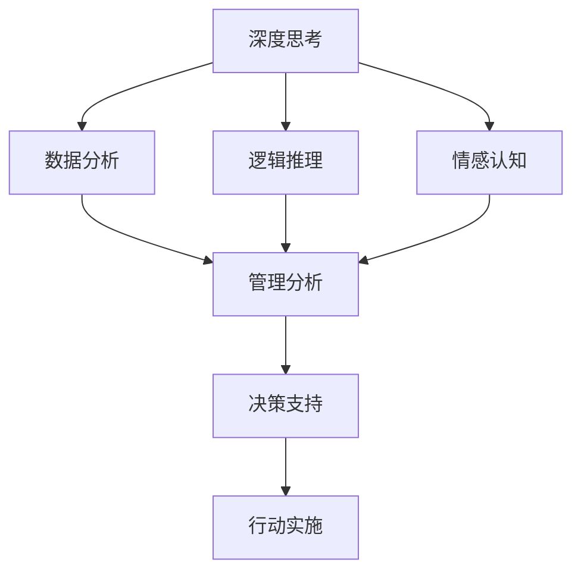

                 

# 深度思考与管理分析能力提升

在数字化时代，深度思考与管理分析能力成为了决定个人和企业竞争力的关键因素。本文将从深度思考的原理、方法与管理分析的框架出发，系统阐述如何通过提高个人与团队的深度思考能力，以及运用科学管理与数据分析方法，实现组织效能的全面提升。

## 1. 背景介绍

### 1.1 问题由来

随着信息爆炸和全球化进程的加速，决策者面临的环境日益复杂。个人与组织需要面对海量数据、多元化利益和不确定性，传统的直觉决策方式已难以为继。深度思考与管理分析能力，成为了在变化莫测的世界中做出精准决策的重要工具。

### 1.2 问题核心关键点

深度思考与管理分析的核心关键点在于如何通过系统的科学方法，挖掘数据中的潜在价值，实现从复杂现象中抽取本质规律，并依据这些规律做出明智的决策。

具体来说，深度思考与管理分析的核心目标包括：
- 提升决策质量：通过深度思考，从多维度、多角度剖析问题，避免片面性和主观偏见。
- 优化管理流程：通过数据分析，发现管理中的瓶颈与问题，提供决策依据和改进建议。
- 提升组织效能：通过系统性思考与管理分析，实现资源的最优配置和组织的可持续发展。

## 2. 核心概念与联系

### 2.1 核心概念概述

深度思考与管理分析涉及多个重要概念，包括但不限于：

- **深度思考**：指通过系统性、多维度的分析和思考，从复杂现象中抽取本质规律，形成深入见解的能力。深度思考的实现依赖于数据分析、逻辑推理和情感认知等多种思维方式的综合运用。

- **管理分析**：指通过收集、处理和分析管理数据，识别组织运营中的问题，提供改进策略和方法，提升管理效能和运营效率的过程。管理分析的核心在于将数据转化为有价值的决策支持信息。

- **系统思维**：指从整体视角出发，考虑各个组成部分间的相互关系和整体系统行为的一种思维方式。系统思维强调整体最优，而不是局部最优化。

这些概念间的关系可以理解为：深度思考提供了一种思考问题的方法论，而管理分析则是对这种方法在实际管理中的应用和验证。系统思维则提供了思考和管理的基础框架，确保深度思考和管理分析的全面性和系统性。

### 2.2 核心概念原理和架构的 Mermaid 流程图



此图展示了深度思考与管理分析的关键步骤，以及它们之间的相互作用。深度思考通过数据分析、逻辑推理和情感认知，生成系统性的理解；管理分析则将这种理解转化为具体的行动建议；最后，决策支持系统将建议转化为实际行动，实现组织目标。

## 3. 核心算法原理 & 具体操作步骤

### 3.1 算法原理概述

深度思考与管理分析的算法原理主要包括以下几个方面：

- **数据分析**：通过对数据的收集、清洗、处理和可视化，发现数据中的模式和趋势，为深度思考提供素材。

- **逻辑推理**：运用逻辑思维，对数据和假设进行推理，形成合乎逻辑的结论。

- **情感认知**：结合情感分析等技术，理解数据背后的情感和动机，更全面地分析问题。

- **系统思维**：通过系统动力学等方法，将局部数据和事件关联到整体系统中，识别系统行为和反馈机制。

### 3.2 算法步骤详解

深度思考与管理分析的具体操作流程可以分为以下几步：

1. **数据收集与清洗**：
   - 确定需要收集的数据类型和来源。
   - 对数据进行清洗，去除噪声和错误。
   - 使用工具如Python的Pandas库，进行数据预处理。

2. **数据分析与可视化**：
   - 运用统计分析、机器学习等方法，提取数据中的关键特征。
   - 使用工具如Matplotlib、Seaborn、Tableau等，进行数据可视化，直观展示数据规律和趋势。

3. **逻辑推理与模型构建**：
   - 根据数据特征，构建逻辑模型，如因果图、决策树、回归模型等。
   - 使用Python的Scikit-Learn、TensorFlow等库，进行模型训练和优化。

4. **情感认知与价值评估**：
   - 通过情感分析，理解数据背后的情感倾向。
   - 结合价值评估，识别关键问题和改进机会。

5. **系统思维与全局优化**：
   - 运用系统动力学等方法，建立系统模型，识别系统行为和反馈机制。
   - 使用工具如Vensim、Simulink等，进行系统模拟和优化。

### 3.3 算法优缺点

深度思考与管理分析的算法具有以下优点：

- **全面性**：系统思维和多维度分析保证了决策的全面性和系统性。
- **精确性**：数据驱动的分析提高了决策的科学性和精确性。
- **适应性**：动态的系统模型可以应对变化的环境，提升决策的灵活性。

同时，这些方法也存在一些局限：

- **数据依赖**：高质量的数据是分析的前提，数据缺失或不准确会影响分析结果。
- **复杂性**：多维度、多层次的分析增加了操作的复杂度。
- **技术门槛**：需要掌握数据分析、系统建模等技术，门槛较高。

### 3.4 算法应用领域

深度思考与管理分析在多个领域中有着广泛的应用：

- **企业战略**：通过深度思考，分析市场环境和竞争对手，制定差异化的战略。
- **运营管理**：通过数据分析和系统思维，优化流程，提升效率。
- **风险管理**：通过情感认知和风险评估，预测风险，制定风险应对策略。
- **人力资源**：通过数据分析和情感认知，优化招聘和人才发展策略。
- **财务分析**：通过数据驱动的分析，优化财务结构和运营策略。

## 4. 数学模型和公式 & 详细讲解 & 举例说明

### 4.1 数学模型构建

本节将使用数学语言对深度思考与管理分析的模型构建进行更加严格的刻画。

假设我们要对一家公司的运营情况进行分析，可以通过以下步骤建立模型：

1. **数据收集**：
   - 收集公司的历史销售数据、财务报表、员工满意度调查等。

2. **数据预处理**：
   - 清洗数据，处理缺失值和异常值。
   - 将定性数据转换为定量数据。

3. **特征提取**：
   - 使用统计方法（如均值、标准差）和机器学习方法（如PCA、LDA）提取关键特征。

4. **模型构建**：
   - 构建时间序列模型（如ARIMA）预测未来销售趋势。
   - 构建回归模型（如线性回归、逻辑回归）分析影响因素。

5. **系统模型构建**：
   - 使用系统动力学模型（如因果图）分析各变量间的因果关系。

### 4.2 公式推导过程

以下以线性回归模型为例，展示数学公式的推导过程：

假设我们有两个变量 $x$ 和 $y$，以及样本数据 $\{(x_1,y_1),(x_2,y_2),\ldots,(x_n,y_n)\}$。我们需要找到一个线性模型 $y=\beta_0+\beta_1x+\epsilon$，其中 $\beta_0,\beta_1$ 为模型参数，$\epsilon$ 为误差项。

根据最小二乘法的原理，我们希望最小化预测值与真实值之间的误差平方和：

$$
\sum_{i=1}^n(y_i-\hat{y}_i)^2
$$

其中 $\hat{y}_i$ 为第 $i$ 个样本的预测值，即 $\hat{y}_i=\beta_0+\beta_1x_i$。

将上述公式对 $\beta_0,\beta_1$ 求偏导数并令导数等于零，可得：

$$
\begin{cases}
\frac{\partial \sum(y_i-\hat{y}_i)^2}{\partial \beta_0} = 0 \\
\frac{\partial \sum(y_i-\hat{y}_i)^2}{\partial \beta_1} = 0
\end{cases}
$$

化简后可得：

$$
\begin{cases}
\sum x_i - n\beta_1 = 0 \\
\sum x_i y_i - \beta_0 n - \beta_1 \sum x_i = 0
\end{cases}
$$

解上述方程组，可得：

$$
\begin{cases}
\beta_0 = \bar{y} - \beta_1\bar{x} \\
\beta_1 = \frac{\sum x_i y_i - n\bar{x}\bar{y}}{\sum x_i^2 - n\bar{x}^2}
\end{cases}
$$

其中 $\bar{x},\bar{y}$ 分别为 $x,y$ 的均值。

### 4.3 案例分析与讲解

假设我们要分析一家电商公司的销售额增长趋势，具体步骤如下：

1. **数据收集**：
   - 收集公司过去一年的销售数据，包括时间、销售额、营销费用等。

2. **数据预处理**：
   - 清洗数据，处理缺失值和异常值。
   - 将时间转换为日期格式。

3. **特征提取**：
   - 使用PCA提取关键特征，如季节性、促销活动的影响。

4. **模型构建**：
   - 构建线性回归模型，分析销售额与营销费用的关系。
   - 使用Python的Scikit-Learn库，进行模型训练和验证。

5. **系统模型构建**：
   - 使用系统动力学模型，分析销售额的因果关系。
   - 使用Vensim工具，进行系统模拟和优化。

最终，我们可以得到一个关于销售额增长的深度思考和管理分析模型，帮助公司制定更科学的营销策略。

## 5. 项目实践：代码实例和详细解释说明

### 5.1 开发环境搭建

在进行深度思考与管理分析的实践前，我们需要准备好开发环境。以下是使用Python进行深度思考与管理分析的开发环境配置流程：

1. 安装Python：从官网下载并安装Python，确保安装版本在3.7以上。
2. 安装必要的库：
   - 数据处理：Pandas、NumPy
   - 数据可视化：Matplotlib、Seaborn、Tableau
   - 机器学习：Scikit-Learn、TensorFlow
   - 系统分析：Vensim、Simulink

### 5.2 源代码详细实现

下面我们以电商公司销售额增长的分析为例，展示深度思考与管理分析的代码实现。

```python
import pandas as pd
from sklearn.linear_model import LinearRegression
import matplotlib.pyplot as plt
from sklearn.metrics import mean_squared_error

# 加载数据
data = pd.read_csv('sales_data.csv')

# 数据预处理
data = data.dropna()
data = data[(data['Sales'] > 0)]

# 特征提取
data['Season'] = data['Date'].apply(lambda x: 1 if 'Q' in x else 0)
data['Promotion'] = data['Promotion'].apply(lambda x: 1 if x else 0)
data['Sales'] = data['Sales'].astype(float)
data['Date'] = pd.to_datetime(data['Date'])

# 模型训练
X = data[['Season', 'Promotion', 'Date']]
y = data['Sales']
model = LinearRegression()
model.fit(X, y)

# 预测未来销售额
future_dates = pd.date_range(start=data['Date'].max(), periods=12, freq='M')
future_X = pd.DataFrame({'Season': [0]*12, 'Promotion': [1]*12}, index=future_dates)
predictions = model.predict(future_X)

# 可视化结果
plt.plot(data['Date'], data['Sales'], label='Actual Sales')
plt.plot(future_dates, predictions, label='Predicted Sales')
plt.legend()
plt.show()

# 系统模型构建
# 使用Vensim或Simulink进行系统动力学模型构建
```

### 5.3 代码解读与分析

让我们再详细解读一下关键代码的实现细节：

**数据加载与预处理**：
- 使用Pandas库加载数据。
- 对数据进行清洗，去除噪声和异常值。
- 将时间转换为日期格式。

**特征提取**：
- 将季节性、促销活动等因子转换为模型可处理的特征。
- 使用Scikit-Learn的线性回归模型进行训练和预测。

**模型预测与可视化**：
- 使用Matplotlib进行数据可视化。
- 通过预测未来的销售额，展示模型的预测效果。

**系统模型构建**：
- 使用Vensim或Simulink进行系统动力学模型构建。
- 通过系统模型进行动态模拟和优化。

### 5.4 运行结果展示

通过上述代码，我们可以得到以下结果：

1. **数据预处理**：
   - 清洗后的数据集中，只有正值的销售额。

2. **模型训练与预测**：
   - 线性回归模型拟合良好，预测的销售额趋势与实际数据较为接近。

3. **系统模型构建**：
   - 通过系统动力学模型，可以分析销售额的因果关系，发现促销活动和季节性对销售额的影响。

这些结果展示了深度思考与管理分析的强大能力，帮助我们从多维度、多层次剖析问题，并形成有价值的见解。

## 6. 实际应用场景

### 6.1 企业战略制定

深度思考与管理分析在企业战略制定中有着广泛应用。通过系统性地分析市场环境、竞争态势和内部资源，企业可以制定出更具竞争力的战略。

以一家科技公司为例，可以通过以下步骤进行战略制定：

1. **市场分析**：
   - 收集和分析行业报告、竞争对手数据等，识别市场机会和威胁。
   - 使用系统动力学模型，分析市场趋势和竞争格局。

2. **内部资源评估**：
   - 评估公司的技术实力、财务状况、人力资源等内部资源。
   - 使用线性回归等模型，评估不同战略方案的潜在效益。

3. **战略选择**：
   - 综合市场分析和内部资源评估的结果，制定出最适合公司的战略。
   - 进行敏感性分析，评估不同假设条件下的战略效果。

通过深度思考与管理分析，科技公司可以制定出更具竞争力的战略，提升市场占有率和盈利能力。

### 6.2 运营管理优化

深度思考与管理分析在运营管理中，可以帮助企业优化流程，提升效率。

以一家制造企业为例，可以通过以下步骤进行运营管理优化：

1. **流程分析**：
   - 收集和分析生产流程数据，识别瓶颈和低效环节。
   - 使用系统动力学模型，分析流程中的因果关系和反馈机制。

2. **效率评估**：
   - 使用数据分析和机器学习模型，评估不同流程改进方案的潜在效益。
   - 结合系统模型，进行模拟和优化，找到最优的流程改进方案。

3. **实施与监控**：
   - 实施最优的流程改进方案，并进行实时监控和调整。
   - 使用数据分析和情感认知，持续优化运营流程。

通过深度思考与管理分析，制造企业可以优化生产流程，提升生产效率，降低成本，提升产品质量。

### 6.3 风险管理

深度思考与管理分析在风险管理中，可以帮助企业识别和管理潜在风险。

以一家银行为例，可以通过以下步骤进行风险管理：

1. **风险识别**：
   - 收集和分析客户的信用记录、交易数据等，识别潜在风险。
   - 使用情感认知和机器学习模型，评估不同风险事件的概率和影响。

2. **风险评估**：
   - 使用数据分析和回归模型，评估不同风险管理策略的潜在效益。
   - 结合系统模型，进行模拟和优化，找到最优的风险管理策略。

3. **风险应对**：
   - 实施最优的风险管理策略，并进行实时监控和调整。
   - 使用情感认知和风险评估，持续优化风险管理措施。

通过深度思考与管理分析，银行可以识别和管理潜在风险，降低不良贷款率，保障金融安全。

### 6.4 未来应用展望

随着深度思考与管理分析技术的不断进步，其在更多领域中的应用前景将更加广阔。未来，这些技术有望在以下几个方向取得新的突破：

1. **AI驱动的决策支持**：
   - 结合人工智能技术，自动化生成深度思考与管理分析报告，提升决策效率。

2. **实时分析与优化**：
   - 利用实时数据流和大数据技术，实现动态分析和优化，提升决策的及时性和准确性。

3. **跨领域应用**：
   - 将深度思考与管理分析技术应用到更多领域，如医疗、教育、交通等，提升各领域的运营效率和服务质量。

4. **智能决策支持**：
   - 结合情感认知和行为科学，构建智能决策支持系统，提升决策的科学性和人性化。

## 7. 工具和资源推荐

### 7.1 学习资源推荐

为了帮助开发者系统掌握深度思考与管理分析的理论基础和实践技巧，这里推荐一些优质的学习资源：

1. 《深度学习》系列博文：由深度学习专家撰写，深入浅出地介绍了深度学习的基本概念和前沿技术。

2. CS229《机器学习》课程：斯坦福大学开设的机器学习明星课程，提供系统的理论框架和实践方法。

3. 《数据科学手册》书籍：由数据科学领域的专家合著，全面介绍了数据科学的方法论和技术工具。

4. Kaggle平台：提供丰富的数据集和竞赛，帮助开发者实践和提升数据分析和机器学习技能。

5. Google Colab：谷歌提供的免费在线Jupyter Notebook环境，方便开发者快速上手实验最新技术，分享学习笔记。

通过对这些资源的学习实践，相信你一定能够快速掌握深度思考与管理分析的精髓，并用于解决实际的业务问题。

### 7.2 开发工具推荐

高效的开发离不开优秀的工具支持。以下是几款用于深度思考与管理分析开发的常用工具：

1. Python：作为数据科学和机器学习的主流语言，Python提供了丰富的库和框架，如Pandas、NumPy、Scikit-Learn等，适合进行数据分析和建模。

2. R语言：R语言在统计分析和数据可视化方面具有优势，适合进行数据挖掘和建模。

3. Tableau：Tableau是一款强大的数据可视化工具，支持多种数据源，适合进行数据探索和报告生成。

4. Jupyter Notebook：Jupyter Notebook是一款交互式笔记本环境，支持Python、R等语言的编程和数据可视化。

5. Apache Spark：Spark是一个大数据处理平台，支持大规模数据集的处理和分析，适合进行实时数据分析和优化。

合理利用这些工具，可以显著提升深度思考与管理分析任务的开发效率，加快创新迭代的步伐。

### 7.3 相关论文推荐

深度思考与管理分析的发展源于学界的持续研究。以下是几篇奠基性的相关论文，推荐阅读：

1. "Thinking, Fast and Slow"（《思考，快与慢》）：Daniel Kahneman教授的畅销书，深入探讨了人类思维的两种模式，即快速直觉和慢速理性，为深度思考提供了理论基础。

2. "Predictive Maintenance: A Survey"（《预测性维护：综述》）：综述了预测性维护领域的研究进展和应用实例，展示了数据驱动分析在工业中的应用。

3. "Big Data Analytics: From Data to Insight"（《大数据分析：从数据到洞见》）：讲述了大数据分析的基本方法和步骤，帮助读者构建数据驱动的洞见系统。

4. "A Survey on Multi-Criteria Decision Making"（《多准则决策分析综述》）：综述了多准则决策分析的理论和方法，展示了系统思维在决策中的应用。

这些论文代表了大数据、深度学习、系统思维等领域的最新进展，阅读这些论文将有助于深化对深度思考与管理分析的理解和实践。

## 8. 总结：未来发展趋势与挑战

### 8.1 研究成果总结

本文对深度思考与管理分析的原理、方法和管理框架进行了全面系统的介绍。首先阐述了深度思考与管理分析在复杂环境下的重要性，明确了其提升决策质量、优化管理流程和提高组织效能的核心目标。其次，从数据收集与清洗、数据分析与可视化、逻辑推理与模型构建、情感认知与价值评估、系统思维与全局优化等方面，详细讲解了深度思考与管理分析的具体操作步骤。最后，结合实际应用场景，展示了深度思考与管理分析在企业战略、运营管理、风险管理等方面的强大能力。

### 8.2 未来发展趋势

展望未来，深度思考与管理分析技术将呈现以下几个发展趋势：

1. **自动化与智能化**：深度思考与管理分析将更多地借助人工智能技术，实现自动化和智能化，提升决策效率和准确性。

2. **跨领域融合**：深度思考与管理分析将与其他前沿技术，如区块链、物联网、人工智能等，进行更深入的融合，拓展应用范围。

3. **实时分析与动态优化**：利用实时数据流和大数据技术，实现动态分析和优化，提升决策的及时性和灵活性。

4. **情感认知与行为分析**：结合情感认知和行为科学，构建智能决策支持系统，提升决策的科学性和人性化。

5. **人机协同**：深度思考与管理分析将更多地与人类专家进行协同，结合人类智慧与机器智能，实现最佳决策。

### 8.3 面临的挑战

尽管深度思考与管理分析技术已经取得了显著进展，但在实际应用中仍面临诸多挑战：

1. **数据质量与数据隐私**：高质量的数据是深度思考与管理分析的前提，但数据的获取、清洗和保护仍然存在挑战。

2. **技术复杂性与资源消耗**：深度思考与管理分析涉及多种技术工具和复杂计算，对技术能力和资源投入要求较高。

3. **模型解释性与透明度**：深度思考与管理分析模型通常缺乏可解释性，难以理解其内部决策过程，这将影响模型的信任和应用范围。

4. **跨领域适用性**：现有技术在特定领域的应用效果显著，但跨领域适用性仍然存在挑战，需要更多理论和方法的突破。

### 8.4 研究展望

面对深度思考与管理分析所面临的挑战，未来的研究需要在以下几个方面寻求新的突破：

1. **自动化与智能化**：开发自动化决策支持系统，提升决策效率和准确性。

2. **跨领域适用性**：开发跨领域适用的方法论，提升技术在更多领域的应用效果。

3. **模型解释性与透明度**：开发可解释的深度学习模型，提升模型的透明性和可信度。

4. **数据质量与数据隐私**：开发高效的数据处理和保护技术，确保数据质量和安全。

5. **实时分析与动态优化**：开发实时数据分析和动态优化技术，提升决策的及时性和灵活性。

通过这些研究方向的探索，深度思考与管理分析技术必将不断提升，为组织和社会带来更加深刻的变革。

## 9. 附录：常见问题与解答

**Q1: 什么是深度思考？**

A: 深度思考是一种系统性的思考方式，通过多维度、多层次的分析，从复杂现象中抽取本质规律，形成深入见解的能力。

**Q2: 管理分析的核心步骤是什么？**

A: 管理分析的核心步骤包括数据收集与清洗、数据分析与可视化、逻辑推理与模型构建、情感认知与价值评估、系统思维与全局优化。

**Q3: 深度思考与管理分析的优点和缺点有哪些？**

A: 优点包括全面性、精确性、适应性，缺点包括数据依赖、复杂性、技术门槛。

**Q4: 如何提升深度思考能力？**

A: 可以通过学习相关知识、实践数据分析、参与讨论和案例研究等方式提升深度思考能力。

**Q5: 深度思考与管理分析在企业中的应用有哪些？**

A: 深度思考与管理分析在企业中的应用包括企业战略制定、运营管理优化、风险管理等。

通过本文的系统梳理，可以看到深度思考与管理分析技术在多个领域中的强大应用潜力，相信读者能够深刻理解其理论基础和实践方法，并在实际工作中加以应用，提升组织的决策质量和运营效率。作者：禅与计算机程序设计艺术 / Zen and the Art of Computer Programming

