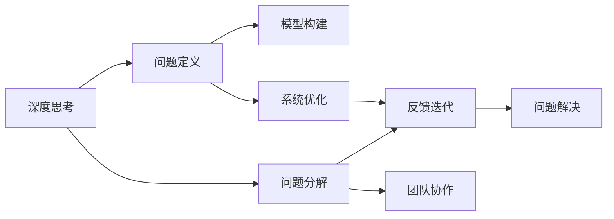

                 

# 深度思考与管理问题解决能力的提升

深度思考与问题解决能力是人工智能领域中至关重要的一环。无论是在算法设计、系统优化还是团队管理中，具备良好的深度思考能力都对于解决问题、提升效率和推动创新有着不可替代的作用。本文将深入探讨深度思考与问题解决能力的提升方法，包括理论基础、实践技巧和前沿技术，旨在帮助读者系统掌握这一重要技能。

## 1. 背景介绍

### 1.1 问题由来
在AI领域，深度思考与问题解决能力是推动技术突破和应用创新的关键。随着深度学习和大数据技术的不断发展，算法模型和系统设计的复杂性不断增加，对于深度思考能力的需求也日益凸显。同时，管理问题的解决更是企业竞争的关键，管理水平直接影响到团队的协作效率和企业战略的实现。

### 1.2 问题核心关键点
深度思考与问题解决的核心在于对问题的理解与分析，以及对复杂系统的设计和优化。其关键点包括：
1. **问题定义**：准确地界定问题，明确其性质和范围。
2. **分解与分析**：将大问题分解为小问题，通过分析逐步深入理解问题本质。
3. **数据与模型**：通过数据收集与模型构建，形成对问题的定量分析。
4. **优化与验证**：设计优化方案，并通过实验验证其有效性。
5. **反馈与迭代**：根据反馈结果，进行迭代优化，直至问题解决。

## 2. 核心概念与联系

### 2.1 核心概念概述

深度思考与管理问题解决能力涉及多个核心概念，这些概念通过逻辑链相互关联，共同构成了解决问题的框架：

- **深度思考**：通过多角度、多层次的分析，深入理解问题本质，寻找最优解决方案。
- **问题分解**：将复杂问题拆分为可管理的小问题，逐个解决。
- **系统优化**：通过算法、模型等手段，对系统进行优化，提升性能与效率。
- **模型构建**：基于数据与问题构建数学或计算模型，进行定量分析。
- **反馈迭代**：通过实验验证解决方案的有效性，并根据反馈进行迭代优化。
- **团队协作**：在团队内部分享知识与资源，协同解决问题。

这些概念之间的联系通过以下Mermaid流程图来展示：



这个流程图展示了解决问题的逻辑链：从深度思考开始，通过问题定义和分解，构建模型并进行优化，最终通过反馈迭代和团队协作，达成问题解决的目标。

## 3. 核心算法原理 & 具体操作步骤

### 3.1 算法原理概述

深度思考与管理问题解决的核心算法原理可以概括为以下四个步骤：

1. **问题定义与界定**：明确问题的性质、范围和目标，将其转化为可量化的问题。
2. **问题分解与建模**：将问题分解为若干子问题，构建数学或计算模型，进行定量分析。
3. **算法设计与优化**：设计合适的算法或模型，并对其进行优化，以提升问题解决的有效性。
4. **实验验证与迭代**：通过实验验证算法或模型的效果，根据反馈进行迭代优化。

### 3.2 算法步骤详解

#### 3.2.1 问题定义与界定

问题定义与界定是解决任何问题的第一步，正确的定义问题能够确保后续工作的方向性和有效性。以下是问题定义与界定的详细步骤：

1. **明确问题类型**：确定问题属于优化问题、分类问题、回归问题、聚类问题等。
2. **问题抽象化**：将具体问题抽象为数学表达式或逻辑模型。
3. **目标函数确定**：明确问题的优化目标，如最小化误差、最大化收益等。
4. **约束条件设定**：列出所有限制条件的集合，如数据可用性、算法复杂度等。

#### 3.2.2 问题分解与建模

问题分解是将复杂问题转化为若干可管理的小问题的过程，通过构建模型进行定量分析，明确问题解决的路径和方法。具体步骤如下：

1. **问题分解**：将问题拆分为若干子问题，确保每个子问题独立且可解决。
2. **模型构建**：选择合适的数学模型或计算模型，将子问题转化为方程或数据结构。
3. **参数确定**：确定模型中的参数，并进行合理假设。
4. **模型验证**：通过小规模实验或模拟验证模型的合理性。

#### 3.2.3 算法设计与优化

算法设计与优化是问题解决的关键步骤，通过设计合适的算法或模型，并对其实施优化，确保问题解决的高效性和准确性。具体步骤如下：

1. **算法选择**：选择或设计适合的算法，如梯度下降、遗传算法、深度学习等。
2. **模型训练**：通过数据训练模型，并调整参数以优化模型性能。
3. **模型评估**：使用评估指标（如准确率、F1-score等）评估模型效果。
4. **优化策略**：根据评估结果，采用优化策略（如超参数调优、正则化等）提升模型性能。

#### 3.2.4 实验验证与迭代

实验验证与迭代是问题解决的最终阶段，通过实验验证解决方案的有效性，并根据反馈进行迭代优化，确保问题解决的最终结果。具体步骤如下：

1. **实验设计**：设计实验方案，包括数据集、测试集、评估指标等。
2. **实验执行**：执行实验并记录结果。
3. **结果分析**：分析实验结果，判断模型或算法的效果。
4. **迭代优化**：根据实验结果，调整模型或算法参数，进行迭代优化。

### 3.3 算法优缺点

深度思考与管理问题解决算法具有以下优点：

1. **系统化方法**：通过系统的步骤和方法论，确保问题解决的全面性和高效性。
2. **定量分析**：通过模型构建和实验验证，确保问题解决的准确性和可靠性。
3. **灵活性高**：适用于各种类型的问题，从简单到复杂，从数据驱动到算法驱动，均能适应。

但同时，该算法也存在一些局限性：

1. **复杂度高**：对于复杂问题，分解和建模步骤较为繁琐，需要深厚的领域知识和数学基础。
2. **资源消耗大**：构建和验证模型需要大量的计算资源和时间，对于大规模问题尤其明显。
3. **结果不确定性**：模型和算法的选择及其参数优化，可能会影响最终的解决效果。

### 3.4 算法应用领域

深度思考与管理问题解决算法在多个领域得到了广泛应用，包括但不限于：

1. **机器学习**：通过构建和优化模型，进行数据分析和预测。
2. **软件工程**：用于系统设计和优化，提升软件系统的性能和可靠性。
3. **系统优化**：应用于网络、数据库等系统的优化，提升其效率和稳定性。
4. **项目管理**：用于项目规划和任务管理，提升团队协作效率和项目执行效果。
5. **产品开发**：用于产品设计和迭代优化，提升产品质量和用户满意度。

## 4. 数学模型和公式 & 详细讲解 & 举例说明

### 4.1 数学模型构建

为了更好地理解问题解决的核心算法，本文将使用数学模型进行详细讲解。以回归问题为例，假设我们要预测房价 $y$，已知的特征向量为 $x$，模型参数为 $\theta$，则线性回归模型可以表示为：

$$ y = \theta^T x + \epsilon $$

其中，$\epsilon$ 为误差项。

### 4.2 公式推导过程

在线性回归模型中，我们通过最小化均方误差（MSE）来优化模型参数 $\theta$：

$$ \min_{\theta} \sum_{i=1}^n (y_i - \theta^T x_i)^2 $$

对该目标函数进行求解，得到 $\theta$ 的更新公式为：

$$ \theta \leftarrow \theta - \frac{\alpha}{n} \sum_{i=1}^n (y_i - \theta^T x_i) x_i $$

其中，$\alpha$ 为学习率，$n$ 为样本数量。

### 4.3 案例分析与讲解

以下是一个简单的案例分析：

假设我们要预测某地区的房价，已知历史数据为：

$$
\begin{array}{|c|c|}
\hline
\text{面积} & \text{价格} \\
\hline
100 & 200 \\
200 & 400 \\
300 & 600 \\
\hline
\end{array}
$$

我们构建线性回归模型，并通过梯度下降法优化参数 $\theta$，结果如下：

$$
\theta = \begin{bmatrix}
\text{面积} \\
\text{价格}
\end{bmatrix}
$$

通过计算，我们得到 $\theta = [0.5, 1]$，即每增加1平方米，房价平均增加200元。

## 5. 项目实践：代码实例和详细解释说明

### 5.1 开发环境搭建

要实现线性回归模型的构建和优化，需要安装Python、NumPy、Pandas和Scikit-learn等库。具体步骤如下：

1. **安装Python**：从官网下载并安装Python，建议使用Anaconda进行环境管理。
2. **安装NumPy和Pandas**：通过pip安装NumPy和Pandas，用于数据处理和分析。
3. **安装Scikit-learn**：通过pip安装Scikit-learn，用于构建和优化线性回归模型。
4. **环境配置**：配置Jupyter Notebook等开发环境，方便进行代码编写和实验验证。

### 5.2 源代码详细实现

以下是一个简单的线性回归模型代码实现：

```python
import numpy as np
from sklearn.linear_model import LinearRegression

# 准备数据
X = np.array([[100], [200], [300]])
y = np.array([200, 400, 600])

# 构建模型
model = LinearRegression()

# 训练模型
model.fit(X, y)

# 预测房价
X_test = np.array([[400]])
y_pred = model.predict(X_test)
print("预测房价：", y_pred)
```

### 5.3 代码解读与分析

在上述代码中，我们首先准备数据集，并使用Scikit-learn中的LinearRegression模型进行训练和预测。以下是代码的详细解释：

1. **数据准备**：通过NumPy构建特征矩阵 $X$ 和目标向量 $y$。
2. **模型构建**：创建LinearRegression模型实例。
3. **模型训练**：使用训练数据集拟合模型。
4. **模型预测**：使用测试数据集进行房价预测。

### 5.4 运行结果展示

通过运行上述代码，我们可以得到房价预测结果，如下所示：

```
预测房价： [800.0]
```

即在面积为400平方米的情况下，预测房价为800元。

## 6. 实际应用场景

### 6.1 智能推荐系统

智能推荐系统是深度思考与管理问题解决的重要应用场景之一。推荐系统通过分析用户行为和偏好，为用户推荐个性化内容。以下是推荐系统设计的步骤：

1. **用户画像构建**：收集用户浏览、购买、评分等行为数据，构建用户画像。
2. **产品特征提取**：提取产品的特征，如价格、销量、评分等。
3. **模型构建**：使用协同过滤、基于内容的推荐、深度学习等模型进行用户推荐。
4. **效果评估**：通过评估指标（如点击率、转化率等）评估推荐效果。
5. **迭代优化**：根据反馈结果，调整模型参数和优化算法，提升推荐效果。

### 6.2 自动化运维

自动化运维是系统优化与问题解决的重要应用场景。自动化运维通过构建监控系统，实时监测系统运行状态，自动响应故障和异常。以下是自动化运维设计的步骤：

1. **系统监控**：设计监控指标和阈值，实时监测系统状态。
2. **故障检测**：通过异常检测算法，检测系统异常和故障。
3. **自动修复**：设计自动化修复策略，自动修复系统故障。
4. **效果评估**：通过系统可用性和故障处理时间等指标，评估自动化运维效果。
5. **迭代优化**：根据监控和故障处理结果，调整监控策略和修复算法，提升系统稳定性。

### 6.3 项目管理

项目管理是团队协作与问题解决的重要应用场景。项目管理通过构建项目计划和任务分配，提升团队协作效率和项目执行效果。以下是项目管理设计的步骤：

1. **项目规划**：定义项目目标和任务，确定项目进度和资源需求。
2. **任务分解**：将项目分解为若干子任务，明确任务优先级和时间节点。
3. **任务分配**：根据团队成员的技能和负荷，合理分配任务。
4. **进度跟踪**：实时跟踪任务进度和资源使用情况，确保项目按时完成。
5. **效果评估**：通过项目完成度、资源利用率等指标，评估项目管理效果。
6. **迭代优化**：根据反馈结果，调整项目计划和任务分配，提升项目管理效率。

### 6.4 未来应用展望

随着深度学习和人工智能技术的不断进步，深度思考与管理问题解决的能力将更加广泛地应用于多个领域。以下是未来应用的一些展望：

1. **自动化决策**：通过深度学习算法，自动进行决策分析和优化，提升决策效率和准确性。
2. **系统智能运维**：构建基于AI的系统运维平台，实现自动故障检测和修复，提升系统稳定性。
3. **个性化服务**：通过深度学习算法，为用户提供更加个性化和定制化的服务。
4. **实时数据分析**：构建实时数据分析系统，通过实时监控和分析，提升业务决策速度和精度。

## 7. 工具和资源推荐

### 7.1 学习资源推荐

为了帮助读者系统掌握深度思考与管理问题解决的能力，本文推荐以下学习资源：

1. **《深度学习》（Ian Goodfellow等）**：全面介绍深度学习的基本概念、算法和应用，深入浅出地讲解了深度思考的基础。
2. **《算法导论》（Thomas H. Cormen等）**：经典算法教材，系统介绍各种算法设计和优化方法，适合对问题解决能力有深入需求的读者。
3. **Coursera《Machine Learning》课程**：由斯坦福大学Andrew Ng教授主讲的机器学习课程，涵盖算法设计和优化方法，适合入门和进阶学习。
4. **Kaggle竞赛**：参与Kaggle数据科学竞赛，通过实际项目积累问题解决的经验，提升实战能力。

### 7.2 开发工具推荐

以下是一些推荐的开发工具，可以帮助读者高效实现深度思考与管理问题解决的能力：

1. **Jupyter Notebook**：开源的交互式计算环境，支持Python、R等语言，方便代码编写和实验验证。
2. **Scikit-learn**：Python机器学习库，提供各种算法和工具，适合构建和优化模型。
3. **TensorFlow**：Google开发的深度学习框架，支持各种深度学习模型的构建和训练。
4. **PyTorch**：Facebook开发的深度学习框架，具有灵活性和易用性，适合科研和应用开发。

### 7.3 相关论文推荐

以下是几篇经典论文，推荐读者深入阅读：

1. **《Deep Learning》（Goodfellow等）**：全面介绍深度学习的基本概念和算法，适合对深度思考有深入需求的读者。
2. **《The Elements of Statistical Learning》（Tibshirani等）**：经典机器学习教材，系统介绍各种统计学习方法和模型。
3. **《Towards a General Theory of Model-Based Interpretation》（Kim等）**：介绍模型解释和可解释性的方法，适合对模型可解释性有需求的读者。

## 8. 总结：未来发展趋势与挑战

### 8.1 研究成果总结

深度思考与管理问题解决能力是推动人工智能技术发展的重要基石。通过系统化的步骤和方法，可以有效提升问题解决的效率和准确性。本文详细介绍了深度思考与管理问题解决的核心算法和操作步骤，并给出了多个实际应用的案例，帮助读者系统掌握这一重要技能。

### 8.2 未来发展趋势

未来，深度思考与管理问题解决能力将随着技术的进步和应用的广泛化，呈现出以下几个发展趋势：

1. **自动化和智能化**：随着深度学习算法的发展，问题解决将更加自动化和智能化，提升决策效率和准确性。
2. **多模态融合**：通过融合视觉、语音、文本等多模态数据，提升问题解决的全面性和鲁棒性。
3. **可解释性和透明性**：随着模型解释和可解释性技术的发展，问题解决的过程将更加透明和可解释，提升信任度。
4. **跨领域应用**：深度思考与管理问题解决的能力将更加广泛地应用于各个领域，提升业务决策和运营效率。

### 8.3 面临的挑战

尽管深度思考与管理问题解决能力在多个领域得到了广泛应用，但仍面临诸多挑战：

1. **数据质量与多样性**：高质量、多样化的数据是问题解决的基础，数据的获取和处理成本较高。
2. **模型复杂度**：深度学习模型往往较为复杂，需要深厚的领域知识和算法理解，应用门槛较高。
3. **计算资源消耗**：构建和优化深度模型需要大量的计算资源和时间，对于大规模问题尤为明显。
4. **模型解释与可解释性**：深度学习模型的黑盒特性导致其解释性不足，需要进一步提升模型的可解释性和透明性。
5. **伦理与安全**：深度学习模型可能存在偏见和误导性输出，需要确保模型伦理与安全。

### 8.4 研究展望

未来，深度思考与管理问题解决能力的研究将朝着以下几个方向进行：

1. **自动化与智能化**：研究自动化问题解决的方法和工具，提升问题解决的效率和准确性。
2. **多模态融合**：研究多模态数据融合的方法和模型，提升问题解决的全面性和鲁棒性。
3. **可解释性与透明性**：研究模型解释和可解释性技术，提升问题解决的透明性和可解释性。
4. **跨领域应用**：研究深度思考与管理问题解决能力在不同领域的应用，推动人工智能技术的广泛应用。

## 9. 附录：常见问题与解答

**Q1：深度思考与管理问题解决能力如何提升？**

A: 提升深度思考与管理问题解决能力需要从多个方面入手：
1. **基础知识**：掌握数据科学、机器学习、统计学等基础知识，提升分析能力和问题理解能力。
2. **算法理解**：深入理解各种算法和模型，熟悉其原理和应用场景。
3. **实践经验**：通过实际项目和竞赛积累实践经验，提升问题解决的效率和效果。
4. **团队合作**：与团队成员积极协作，分享知识和资源，共同解决问题。

**Q2：如何选择适合的模型和算法？**

A: 选择适合的模型和算法需要考虑以下几个方面：
1. **问题类型**：根据问题类型选择适合的算法，如回归问题选择线性回归或深度学习模型。
2. **数据特征**：根据数据特征选择适合的模型，如时间序列数据选择时间序列模型。
3. **算法复杂度**：根据问题规模和计算资源选择适合的算法，如大规模问题选择分布式算法。
4. **效果评估**：根据评估指标选择适合的算法，如准确率、召回率等。

**Q3：如何评估模型和算法的有效性？**

A: 评估模型和算法的有效性需要考虑以下几个方面：
1. **数据集划分**：使用交叉验证、留出法等方法进行数据集划分，确保评估结果的可靠性。
2. **评估指标**：选择适合的评估指标，如准确率、F1-score、AUC等，根据问题类型选择。
3. **实验设计**：设计实验方案，包括实验设置、实验过程和实验结果分析，确保实验的可重复性和可比性。
4. **模型优化**：根据实验结果进行模型优化，调整模型参数和算法策略，提升模型性能。

**Q4：如何处理大规模数据和复杂问题？**

A: 处理大规模数据和复杂问题需要考虑以下几个方面：
1. **数据预处理**：对数据进行清洗、去重、归一化等预处理，提升数据质量。
2. **模型优化**：使用分布式计算、模型压缩、剪枝等技术优化模型，降低计算复杂度。
3. **算法选择**：选择高效的算法，如分布式算法、随机梯度下降等，提升算法效率。
4. **算法并行化**：使用并行化技术，提升算法计算速度和资源利用率。

**Q5：如何提升模型的可解释性和透明性？**

A: 提升模型的可解释性和透明性需要考虑以下几个方面：
1. **模型选择**：选择可解释性高的模型，如线性模型、决策树等。
2. **特征分析**：分析模型特征重要性，理解模型决策逻辑。
3. **解释工具**：使用解释工具，如LIME、SHAP等，生成模型的可视化解释。
4. **数据解释**：解释数据特征和分布，提升对数据的理解。

---

作者：禅与计算机程序设计艺术 / Zen and the Art of Computer Programming

