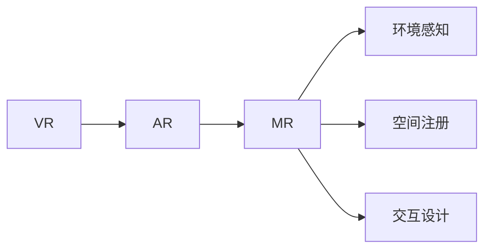

                 

# 混合现实（MR）技术：跨界创新的新领域

## 1. 背景介绍

### 1.1 问题由来

随着虚拟现实（VR）和增强现实（AR）技术的不断发展，人们对于数字世界和现实世界的深度融合有了更高的需求。混合现实（MR）技术应运而生，通过结合虚拟和现实元素，为用户提供更加沉浸、互动的体验。MR技术在娱乐、教育、医疗、制造、工业等领域都有着广泛的应用前景。

### 1.2 问题核心关键点

混合现实技术的核心在于通过计算机视觉、传感器、用户交互等技术手段，实现虚拟对象在现实世界中的定位、跟踪和融合。其中，关键技术包括：

- 环境感知：对现实世界环境的实时建模和分析。
- 空间注册：将虚拟物体与现实世界进行精确对齐。
- 交互设计：提供自然、直观的用户交互方式。

这些核心技术共同构成了混合现实系统的基础架构，使得数字内容能够在物理世界中呈现，并与用户实时互动。

### 1.3 问题研究意义

混合现实技术将现实世界与数字世界深度融合，开创了全新的交互体验。它不仅在技术层面具有颠覆性意义，也在跨界应用领域展示了强大的创新潜力。通过深入研究混合现实技术，不仅可以提升现有技术手段，还可以开拓新的应用场景，推动各行业的数字化转型和升级。

## 2. 核心概念与联系

### 2.1 核心概念概述

为了更好地理解混合现实技术的原理和架构，本节将介绍几个关键概念：

- 虚拟现实（VR）：通过计算机生成的虚拟环境，使用户沉浸在由计算机生成的三维数字世界中。

- 增强现实（AR）：通过在现实世界中叠加虚拟信息，如文本、图像、三维模型等，增强用户对现实世界的感知和互动。

- 混合现实（MR）：结合VR和AR技术，将虚拟对象与现实世界进行深度融合，提供更加沉浸和互动的用户体验。

- 空间注册（Spatial Registration）：将虚拟对象与现实世界进行精确对齐，是MR系统实现的基础。

- 环境感知（Environment Perception）：对现实世界环境的实时建模和分析，包括三维重建、环境语义理解等。

- 交互设计（Interaction Design）：设计自然、直观的用户交互方式，提高系统的易用性和用户体验。

这些概念之间通过特定的技术和算法相互作用，共同实现了混合现实系统的核心功能。

### 2.2 核心概念原理和架构的 Mermaid 流程图



这个流程图展示了混合现实技术的主要组成和它们之间的联系。通过VR技术和AR技术，混合现实系统实现了虚拟对象在现实世界中的融合。其中，环境感知和空间注册是实现这一融合的基础，而交互设计则提升了用户体验。

## 3. 核心算法原理 & 具体操作步骤

### 3.1 算法原理概述

混合现实技术的核心算法主要包括以下几个方面：

- 三维重建（3D Reconstruction）：通过多视角图像和深度信息，重建现实世界的三维模型。
- 环境语义理解（Semantic Understanding）：对重建的环境进行语义分析，识别物体、场景、行为等。
- 空间注册（Spatial Registration）：将虚拟对象与现实世界进行精确对齐，确保虚拟对象在现实世界中的正确位置。
- 实时渲染（Real-time Rendering）：对虚拟对象进行实时渲染，与现实世界元素进行动态融合。
- 自然交互（Natural Interaction）：设计自然、直观的用户交互方式，提高系统的易用性。

这些算法通过一系列复杂的计算和处理，实现了虚拟对象与现实世界的深度融合，为用户提供沉浸和互动的体验。

### 3.2 算法步骤详解

混合现实技术的实现主要包括以下几个关键步骤：

1. **环境感知**：使用计算机视觉技术，如立体视觉、结构光、RGB-D摄像头等，对现实世界进行三维建模和环境分析。

2. **空间注册**：通过传感器（如IMU、GPS）获取设备的位置和姿态信息，结合摄像头采集的深度信息，将虚拟对象与现实世界进行精确对齐。

3. **环境语义理解**：对重建的环境进行语义分析，识别物体、场景、行为等，以便更好地与虚拟对象进行融合。

4. **实时渲染**：对虚拟对象进行实时渲染，与现实世界元素进行动态融合，提供流畅的视觉效果。

5. **自然交互**：设计自然、直观的用户交互方式，如手势控制、语音交互等，提升用户体验。

### 3.3 算法优缺点

混合现实技术的优点包括：

- 沉浸感强：通过将虚拟元素与现实世界深度融合，提供更加沉浸和互动的用户体验。
- 应用广泛：适用于游戏、教育、医疗、制造等多个领域，具有广泛的应用前景。
- 交互自然：通过自然交互方式，提升系统的易用性和用户体验。

然而，混合现实技术也存在一些缺点：

- 设备成本高：现有的混合现实设备价格较高，难以大规模普及。
- 计算复杂度高：由于需要同时处理虚拟和现实世界的数据，计算复杂度较高。
- 硬件要求高：需要高性能的计算平台和传感器设备，对硬件要求较高。

### 3.4 算法应用领域

混合现实技术在多个领域都有广泛的应用，以下是几个典型的应用场景：

- **医疗领域**：混合现实技术可以用于手术模拟、虚拟培训、远程诊断等，提升医疗服务的质量和效率。
- **教育领域**：混合现实技术可以用于虚拟教室、虚拟实验、互动教学等，提升教育体验和教学效果。
- **工业领域**：混合现实技术可以用于设备维护、远程协作、质量检测等，提升工业生产的自动化和智能化水平。
- **娱乐领域**：混合现实技术可以用于虚拟旅游、虚拟演出、互动游戏等，提供沉浸和互动的娱乐体验。
- **军事领域**：混合现实技术可以用于虚拟训练、战场模拟、情报分析等，提升军事作战的效率和精确度。

## 4. 数学模型和公式 & 详细讲解 & 举例说明

### 4.1 数学模型构建

混合现实技术的数学模型构建主要包括以下几个方面：

- **三维重建模型**：通过多视角图像和深度信息，重建现实世界的三维模型，通常使用点云表示。
- **环境语义理解模型**：对重建的环境进行语义分析，识别物体、场景、行为等，通常使用语义分割网络。
- **空间注册模型**：将虚拟对象与现实世界进行精确对齐，通常使用IMU、GPS等传感器数据和深度信息。
- **实时渲染模型**：对虚拟对象进行实时渲染，通常使用光栅化渲染技术。
- **自然交互模型**：设计自然、直观的用户交互方式，通常使用手势识别、语音识别等技术。

### 4.2 公式推导过程

由于混合现实技术的数学模型涉及多个学科，这里仅以环境感知和空间注册的公式推导为例进行讲解。

**环境感知**：
假设使用RGB-D摄像头对现实世界进行三维重建，摄像头获取的图像序列为 $I_k \in \mathbb{R}^{H \times W \times 3}$，其中 $k$ 表示帧数。通过SfM（Structure from Motion）算法重建三维点云 $P \in \mathbb{R}^{N \times 3}$，其中 $N$ 表示点云中点的数量。

**空间注册**：
假设设备的位置和姿态信息由IMU和GPS获取，IMU输出加速度和角速度数据，GPS输出位置和速度数据。设设备的位置向量为 $X \in \mathbb{R}^3$，姿态矩阵为 $R \in \mathbb{R}^{3 \times 3}$，设备在下一帧的预测位置和姿态为 $\hat{X} \in \mathbb{R}^3$ 和 $\hat{R} \in \mathbb{R}^{3 \times 3}$。

通过最小二乘优化，求解设备的预测位置和姿态误差：
$$
\min_{\Delta X, \Delta R} \sum_k (I_k - H_k(\hat{X} + \Delta X, \hat{R} \cdot \Delta R))^2
$$

其中 $H_k$ 表示摄像头对三维点云的投影矩阵。

### 4.3 案例分析与讲解

以虚拟手术模拟为例，展示混合现实技术在医疗领域的应用。

**案例背景**：
医生在进行复杂手术时，需要进行大量的准备和训练。然而，现实中的手术环境难以完全复制，手术模拟成为一种重要的培训手段。混合现实技术可以用于虚拟手术模拟，提供逼真的手术环境，提升医生的手术技能。

**实现步骤**：
1. **环境感知**：使用三维重建技术对手术室进行建模，生成三维点云。
2. **空间注册**：通过IMU和GPS获取设备的位置和姿态信息，将虚拟手术环境与现实世界进行对齐。
3. **环境语义理解**：对手术环境进行语义分析，识别手术工具、手术床、患者位置等。
4. **实时渲染**：对虚拟手术工具和患者进行实时渲染，提供逼真的手术环境。
5. **自然交互**：通过手势控制、语音指令等方式，进行手术操作和控制。

通过混合现实技术，医生可以在虚拟环境中进行手术模拟，提升手术技能，减少手术风险。

## 5. 项目实践：代码实例和详细解释说明

### 5.1 开发环境搭建

在混合现实技术的开发过程中，需要搭建一个全面的开发环境，包括以下几个方面：

1. **硬件设备**：选择合适的混合现实设备，如头显、手柄、摄像头等。
2. **软件开发平台**：选择合适的开发平台，如Unity、Unreal Engine、ARKit等。
3. **计算平台**：选择高性能的计算平台，如PC、GPU、TPU等。

### 5.2 源代码详细实现

以下是一个简单的混合现实应用程序的实现示例，使用Unity平台开发：

```csharp
using UnityEngine;
using UnityEngine.XR;
using UnityEngine.XR.ARFoundation;
using UnityEngine.XR.ARSubsystems;

public class MRApp : MonoBehaviour
{
    private ARCameraManager arCameraManager;
    private ARSessionOrigin subSystem;

    void Start()
    {
        arCameraManager = ARCameraManager.InitializeCameraSystem();
        subSystem = ARSessionOrigin.InitializeSessionOrigin(arCameraManager);

        if (arCameraManager.IsSessionRunning)
        {
            Debug.Log("AR Session Started");
        }
        else
        {
            Debug.Log("AR Session Failed");
        }
    }

    void Update()
    {
        if (arCameraManager.IsSessionRunning)
        {
            Debug.Log("AR Session Running");
        }
        else
        {
            Debug.Log("AR Session Failed");
        }
    }
}
```

### 5.3 代码解读与分析

该示例程序使用了Unity的AR Foundation组件，通过ARCameraManager和ARSessionOrigin进行混合现实环境的搭建和运行。具体实现步骤如下：

1. **初始化摄像头系统**：使用ARCameraManager InitializeCameraSystem()方法，初始化摄像头系统。
2. **初始化会话 origin**：使用ARSessionOrigin InitializeSessionOrigin()方法，初始化会话 origin。
3. **检查会话状态**：在Update()方法中，检查会话状态是否运行，进行相应的调试输出。

### 5.4 运行结果展示

运行该程序后，可以实时查看设备的位置和姿态信息，以及混合现实环境的运行状态。通过Unity的AR Foundation组件，可以方便地实现混合现实应用程序的开发和调试。

## 6. 实际应用场景

### 6.1 医疗领域

在医疗领域，混合现实技术可以用于虚拟手术模拟、远程诊断、虚拟培训等，提升医疗服务的质量和效率。

**虚拟手术模拟**：
医生可以在虚拟手术环境中进行模拟操作，提升手术技能和处理复杂病例的能力。

**远程诊断**：
医生可以通过混合现实技术远程观察患者的手术环境和病情，进行远程诊断和治疗。

**虚拟培训**：
医学学生可以通过虚拟现实技术进行手术培训，提升手术技能和应对复杂情况的能力。

### 6.2 教育领域

在教育领域，混合现实技术可以用于虚拟教室、虚拟实验、互动教学等，提升教育体验和教学效果。

**虚拟教室**：
学生可以在虚拟教室中参与互动学习，提升学习效果和参与感。

**虚拟实验**：
学生可以进行虚拟实验，进行实验操作和数据分析，提升实验技能和理解深度。

**互动教学**：
教师可以通过混合现实技术进行互动教学，提升学生的理解和参与感。

### 6.3 工业领域

在工业领域，混合现实技术可以用于设备维护、远程协作、质量检测等，提升工业生产的自动化和智能化水平。

**设备维护**：
通过混合现实技术进行设备维护，进行虚拟操作和指导，提升维护效率和精度。

**远程协作**：
工程师可以通过混合现实技术进行远程协作，实时查看现场情况，进行实时沟通和指导。

**质量检测**：
通过混合现实技术进行质量检测，进行虚拟测量和分析，提升检测精度和效率。

### 6.4 娱乐领域

在娱乐领域，混合现实技术可以用于虚拟旅游、虚拟演出、互动游戏等，提供沉浸和互动的娱乐体验。

**虚拟旅游**：
用户可以进行虚拟旅游，探索不同地域的景点和风光，提升旅游体验。

**虚拟演出**：
用户可以进行虚拟演出，体验沉浸和互动的演出效果，提升观赏体验。

**互动游戏**：
用户可以参与互动游戏，进行虚拟操作和互动，提升游戏体验。

## 7. 工具和资源推荐

### 7.1 学习资源推荐

为了帮助开发者系统掌握混合现实技术的理论基础和实践技巧，这里推荐一些优质的学习资源：

1. **《混合现实技术基础》书籍**：介绍混合现实技术的原理和应用，适合初学者入门。
2. **ARKit官方文档**：提供ARKit的详细文档和样例代码，适合开发iOS平台的混合现实应用程序。
3. **Unity官方文档**：提供Unity的AR Foundation组件的详细文档和样例代码，适合开发Unity平台的混合现实应用程序。
4. **ARCore官方文档**：提供ARCore的详细文档和样例代码，适合开发Android平台的混合现实应用程序。
5. **《增强现实与混合现实技术》课程**：斯坦福大学开设的AR和MR课程，涵盖基础理论和应用实践。

通过对这些资源的学习实践，相信你一定能够快速掌握混合现实技术的精髓，并用于解决实际的MR问题。

### 7.2 开发工具推荐

高效的开发离不开优秀的工具支持。以下是几款用于混合现实技术开发的常用工具：

1. **Unity**：适用于开发AR和MR应用程序，支持跨平台开发，具有强大的编辑器和插件生态。
2. **Unreal Engine**：适用于开发高质量的AR和MR应用程序，支持实时渲染和物理模拟。
3. **ARKit**：苹果公司提供的AR开发框架，适用于开发iOS平台的AR和MR应用程序。
4. **ARCore**：谷歌提供的AR开发框架，适用于开发Android平台的AR和MR应用程序。
5. **OpenXR**：开放式增强现实联盟提供的跨平台AR开发框架，支持多种平台和设备。

合理利用这些工具，可以显著提升混合现实技术的开发效率，加快创新迭代的步伐。

### 7.3 相关论文推荐

混合现实技术的发展离不开学界的持续研究。以下是几篇奠基性的相关论文，推荐阅读：

1. **《基于多视角的三维重建》**：介绍三维重建的基本方法和技术，适合对三维重建技术感兴趣的读者。
2. **《环境语义理解》**：介绍环境语义理解的基本方法和技术，适合对环境语义分析技术感兴趣的读者。
3. **《空间注册》**：介绍空间注册的基本方法和技术，适合对空间对齐技术感兴趣的读者。
4. **《实时渲染技术》**：介绍实时渲染的基本方法和技术，适合对实时渲染技术感兴趣的读者。
5. **《自然交互设计》**：介绍自然交互设计的基本方法和技术，适合对自然交互技术感兴趣的读者。

这些论文代表了大混合现实技术的发展脉络。通过学习这些前沿成果，可以帮助研究者把握学科前进方向，激发更多的创新灵感。

## 8. 总结：未来发展趋势与挑战

### 8.1 总结

本文对混合现实技术的原理和应用进行了全面系统的介绍。首先阐述了混合现实技术的背景和意义，明确了混合现实系统各部分的核心功能和联系。其次，从原理到实践，详细讲解了混合现实系统的核心算法和操作步骤，给出了混合现实应用程序的完整代码实现。同时，本文还广泛探讨了混合现实技术在医疗、教育、工业等多个领域的应用前景，展示了混合现实技术的应用潜力。此外，本文精选了混合现实技术的各类学习资源，力求为读者提供全方位的技术指引。

通过本文的系统梳理，可以看到，混合现实技术将现实世界与数字世界深度融合，开创了全新的交互体验。它不仅在技术层面具有颠覆性意义，也在跨界应用领域展示了强大的创新潜力。未来，随着混合现实技术的不断发展，其在更多领域的应用将会不断涌现，为人类认知智能的进化带来深远影响。

### 8.2 未来发展趋势

展望未来，混合现实技术将呈现以下几个发展趋势：

1. **技术成熟度提升**：随着技术的不断成熟，混合现实系统的性能和用户体验将不断提升。设备成本将降低，普及率将提高。
2. **跨平台融合**：混合现实技术将进一步跨平台融合，支持更多设备，实现更广泛的普及和应用。
3. **多感官融合**：混合现实技术将进一步融合多种感官，如触觉、味觉、嗅觉等，提升用户的沉浸感和互动性。
4. **实时交互**：混合现实技术将进一步支持实时交互，提升系统的实时性和动态性。
5. **人机协同**：混合现实技术将进一步实现人机协同，提升系统的智能性和决策能力。

### 8.3 面临的挑战

尽管混合现实技术已经取得了瞩目成就，但在迈向更加智能化、普适化应用的过程中，它仍面临着诸多挑战：

1. **设备成本高**：现有的混合现实设备价格较高，难以大规模普及。如何降低设备成本，提高设备的便携性和可扩展性，是未来的重要方向。
2. **计算复杂度高**：由于需要同时处理虚拟和现实世界的数据，计算复杂度较高。如何优化算法和模型，提高系统的实时性和性能，是未来的重要方向。
3. **硬件要求高**：需要高性能的计算平台和传感器设备，对硬件要求较高。如何提升设备的硬件性能，降低硬件成本，是未来的重要方向。
4. **交互方式单一**：当前的交互方式主要依赖手势、语音等，单一交互方式难以满足复杂的应用需求。如何设计多样化的交互方式，提升系统的易用性和用户体验，是未来的重要方向。
5. **内容丰富度不足**：当前的内容资源相对匮乏，难以满足多样化的应用需求。如何丰富内容资源，提升内容的互动性和多样性，是未来的重要方向。

### 8.4 研究展望

面对混合现实技术所面临的种种挑战，未来的研究需要在以下几个方面寻求新的突破：

1. **低成本硬件设备**：开发低成本、高便携性的混合现实设备，推动设备的普及和应用。
2. **高效算法和模型**：优化算法和模型，提高系统的实时性和性能，实现高效计算。
3. **多样化的交互方式**：设计多样化的交互方式，提升系统的易用性和用户体验。
4. **丰富的内容资源**：丰富内容资源，提升内容的互动性和多样性，推动内容应用的创新。
5. **跨平台融合**：支持更多平台和设备，实现更广泛的普及和应用。

这些研究方向的探索，必将引领混合现实技术迈向更高的台阶，为构建人机协同的智能系统铺平道路。面向未来，混合现实技术还需要与其他人工智能技术进行更深入的融合，如知识表示、因果推理、强化学习等，多路径协同发力，共同推动混合现实技术的进步。

## 9. 附录：常见问题与解答

**Q1：混合现实技术是否适用于所有应用场景？**

A: 混合现实技术适用于多种应用场景，包括医疗、教育、工业、娱乐等。然而，不同的应用场景对技术的要求和需求也不同，需要根据具体应用进行优化和调整。

**Q2：混合现实技术与虚拟现实（VR）和增强现实（AR）有什么区别？**

A: 虚拟现实（VR）是指通过计算机生成的虚拟环境，使用户完全沉浸在虚拟世界中；增强现实（AR）是指在现实世界的基础上叠加虚拟信息；而混合现实（MR）是将虚拟对象与现实世界进行深度融合，提供更加沉浸和互动的用户体验。

**Q3：混合现实技术在医疗领域的应用前景如何？**

A: 混合现实技术在医疗领域有着广泛的应用前景，包括虚拟手术模拟、远程诊断、虚拟培训等，能够提升医疗服务的质量和效率。

**Q4：混合现实技术在工业领域的应用前景如何？**

A: 混合现实技术在工业领域有着广泛的应用前景，包括设备维护、远程协作、质量检测等，能够提升工业生产的自动化和智能化水平。

**Q5：混合现实技术在娱乐领域的应用前景如何？**

A: 混合现实技术在娱乐领域有着广泛的应用前景，包括虚拟旅游、虚拟演出、互动游戏等，能够提供沉浸和互动的娱乐体验。

---

作者：禅与计算机程序设计艺术 / Zen and the Art of Computer Programming

