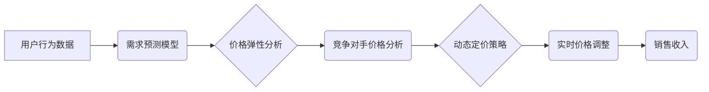

> 动态定价、AI优化、机器学习、需求预测、价格弹性、收益最大化、电商平台、市场竞争

## 1. 背景介绍

在当今数据爆炸的时代，企业拥有海量用户行为数据，这为基于人工智能（AI）的动态定价策略提供了无限可能。传统的定价策略往往依赖于经验和市场调研，缺乏灵活性，难以适应瞬息万变的市场环境。而动态定价策略则通过分析用户行为、市场趋势和竞争对手信息，实时调整价格，以实现最大化收益的目标。

随着电商平台的蓬勃发展，动态定价策略已成为许多企业的重要竞争优势。例如，在线旅行社（OTA）会根据航班剩余座位、用户搜索历史和竞争对手价格等因素，动态调整机票价格；电商平台会根据商品热度、用户购买意愿和促销活动等因素，动态调整商品价格。

## 2. 核心概念与联系

**2.1 动态定价策略**

动态定价策略是指根据实时市场变化，动态调整产品或服务的定价策略。其核心目标是根据市场需求和竞争环境，找到最优价格，以实现最大化收益。

**2.2 AI优化**

人工智能（AI）技术可以帮助企业更智能地制定动态定价策略。通过机器学习算法，AI可以分析海量用户行为数据，识别出价格变化对用户购买行为的影响，并预测未来市场需求。

**2.3 核心概念架构**



## 3. 核心算法原理 & 具体操作步骤

**3.1 算法原理概述**

动态定价策略的核心算法通常基于以下几个方面：

* **需求预测模型:** 利用历史数据和用户行为特征，预测未来产品的需求量。
* **价格弹性分析:** 分析价格变化对需求量的影响程度，即价格弹性。
* **竞争对手价格分析:** 收集和分析竞争对手的价格信息，了解市场竞争格局。
* **收益最大化模型:** 基于需求预测、价格弹性分析和竞争对手价格分析，制定最优价格策略，以最大化收益。

**3.2 算法步骤详解**

1. **数据收集:** 收集用户行为数据、市场数据和竞争对手价格数据。
2. **数据预处理:** 对收集到的数据进行清洗、转换和特征工程，以便于模型训练。
3. **模型训练:** 利用机器学习算法，训练需求预测模型、价格弹性模型和收益最大化模型。
4. **模型评估:** 对训练好的模型进行评估，验证其预测精度和收益最大化能力。
5. **实时价格调整:** 根据模型预测结果和实时市场变化，动态调整产品或服务的定价。

**3.3 算法优缺点**

**优点:**

* **灵活性:** 可以根据实时市场变化动态调整价格。
* **精准度:** 利用机器学习算法，可以更精准地预测需求和价格弹性。
* **收益最大化:** 可以帮助企业找到最优价格策略，最大化收益。

**缺点:**

* **数据依赖:** 需要大量高质量的数据进行模型训练。
* **算法复杂:** 需要专业的技术人员进行模型开发和维护。
* **伦理风险:** 动态定价策略可能会被用于价格歧视或其他不公平行为。

**3.4 算法应用领域**

* **电商平台:** 动态调整商品价格，提高销售收入。
* **在线旅行社:** 动态调整机票价格，优化航班收益。
* **共享经济平台:** 动态调整服务价格，提高平台效率。
* **金融服务:** 动态调整贷款利率，降低风险。

## 4. 数学模型和公式 & 详细讲解 & 举例说明

**4.1 数学模型构建**

假设一个产品的需求量为 $Q(p)$，价格为 $p$，则需求函数可以表示为：

$$Q(p) = a - bp$$

其中，$a$ 是需求量在价格为零时的水平，$b$ 是价格弹性系数。

**4.2 公式推导过程**

价格弹性系数 $b$ 可以通过以下公式计算：

$$b = \frac{\% \Delta Q}{\% \Delta p}$$

其中，$\% \Delta Q$ 是需求量变化的百分比，$\% \Delta p$ 是价格变化的百分比。

**4.3 案例分析与讲解**

假设一个产品的需求量在价格为 $10$ 元时为 $100$ 件，当价格上涨到 $12$ 元时，需求量下降到 $80$ 件。则价格弹性系数为：

$$b = \frac{\frac{80-100}{100} \times 100}{\frac{12-10}{10} \times 100} = \frac{-20}{2} = -10$$

该产品的价格弹性系数为 $-10$，表示价格每上涨 $1\%$，需求量就会下降 $10\%$。

## 5. 项目实践：代码实例和详细解释说明

**5.1 开发环境搭建**

* Python 3.7+
* Jupyter Notebook
* scikit-learn
* pandas
* matplotlib

**5.2 源代码详细实现**

```python
import pandas as pd
from sklearn.linear_model import LinearRegression

# 加载数据
data = pd.read_csv('price_demand_data.csv')

# 数据预处理
X = data[['price']]
y = data['demand']

# 训练模型
model = LinearRegression()
model.fit(X, y)

# 预测需求量
new_price = 12
predicted_demand = model.predict([[new_price]])

# 打印预测结果
print(f'预测需求量: {predicted_demand[0]}')
```

**5.3 代码解读与分析**

* 该代码首先加载价格和需求量数据，然后进行数据预处理，将价格作为特征，需求量作为目标变量。
* 接着，使用线性回归模型训练模型，并预测在给定价格下的需求量。
* 最后，打印预测结果。

**5.4 运行结果展示**

运行该代码后，会输出预测的需求量。

## 6. 实际应用场景

**6.1 电商平台**

电商平台可以利用动态定价策略，根据商品热度、用户购买意愿和促销活动等因素，动态调整商品价格，以提高销售收入。例如，在双十一购物节期间，电商平台可以根据商品的热度和用户搜索量，动态提高商品价格，以获得更高的利润。

**6.2 在线旅行社**

在线旅行社可以利用动态定价策略，根据航班剩余座位、用户搜索历史和竞争对手价格等因素，动态调整机票价格，以优化航班收益。例如，当航班剩余座位较少时，在线旅行社可以提高机票价格，以吸引更多用户购买。

**6.3 共享经济平台**

共享经济平台可以利用动态定价策略，根据服务需求、用户评分和竞争对手价格等因素，动态调整服务价格，以提高平台效率。例如，当用户对某项服务的需求量较高时，共享经济平台可以提高服务价格，以平衡供需关系。

**6.4 未来应用展望**

随着人工智能技术的不断发展，动态定价策略将应用于更多领域，例如：

* **医疗保健:** 根据患者病情、治疗方案和医院竞争环境，动态调整医疗服务价格。
* **教育培训:** 根据课程受欢迎程度、学生学习进度和市场竞争环境，动态调整课程价格。
* **金融服务:** 根据客户风险偏好、投资目标和市场波动情况，动态调整投资产品价格。

## 7. 工具和资源推荐

**7.1 学习资源推荐**

* **书籍:**
    * 《机器学习》 - 周志华
    * 《深度学习》 - Ian Goodfellow
* **在线课程:**
    * Coursera: Machine Learning
    * edX: Artificial Intelligence

**7.2 开发工具推荐**

* **Python:** 
    * scikit-learn
    * pandas
    * matplotlib
* **云平台:**
    * AWS
    * Azure
    * Google Cloud

**7.3 相关论文推荐**

* **Dynamic Pricing with Machine Learning:** https://arxiv.org/abs/1706.03762
* **A Survey of Dynamic Pricing Strategies:** https://www.researchgate.net/publication/329973504_A_Survey_of_Dynamic_Pricing_Strategies

## 8. 总结：未来发展趋势与挑战

**8.1 研究成果总结**

动态定价策略是人工智能技术在商业领域的应用之一，它可以帮助企业更智能地制定价格策略，提高收益。

**8.2 未来发展趋势**

* **更精准的预测模型:** 利用更先进的机器学习算法，开发更精准的预测模型，能够更准确地预测用户需求和市场变化。
* **更个性化的定价策略:** 基于用户画像和行为数据，制定更个性化的定价策略，满足不同用户的需求。
* **更智能的自动化决策:** 利用人工智能技术，实现更智能的自动化决策，减少人工干预，提高效率。

**8.3 面临的挑战**

* **数据安全和隐私保护:** 动态定价策略需要收集和分析大量用户数据，因此需要加强数据安全和隐私保护措施。
* **算法解释性和可信度:** 许多机器学习算法是黑箱模型，难以解释其决策过程，这可能会降低用户的信任度。
* **伦理风险:** 动态定价策略可能会被用于价格歧视或其他不公平行为，需要制定相应的伦理规范和监管机制。

**8.4 研究展望**

未来，动态定价策略的研究将更加注重以下几个方面：

* **开发更透明、可解释的机器学习算法。**
* **研究动态定价策略的伦理问题，并制定相应的规范和监管机制。**
* **探索动态定价策略在更多领域的应用，例如医疗保健、教育培训和金融服务。**

## 9. 附录：常见问题与解答

**9.1 如何选择合适的动态定价策略？**

选择合适的动态定价策略需要根据企业的具体情况，例如产品的特性、市场竞争环境和目标客户群体等因素进行综合考虑。

**9.2 动态定价策略会影响用户体验吗？**

如果动态定价策略没有合理设计，可能会影响用户的体验，例如用户可能会感到价格不透明或被歧视。因此，企业需要在制定动态定价策略时，充分考虑用户的感受，并采取措施确保公平性和透明度。

**9.3 动态定价策略的实施需要哪些技术支持？**

实施动态定价策略需要以下技术支持：

* **数据采集和处理:** 收集和处理海量用户行为数据。
* **机器学习模型训练:** 训练需求预测、价格弹性分析和收益最大化模型。
* **实时价格调整系统:** 开发实时价格调整系统，根据模型预测结果和市场变化动态调整价格。


作者：禅与计算机程序设计艺术 / Zen and the Art of Computer Programming 
<end_of_turn>