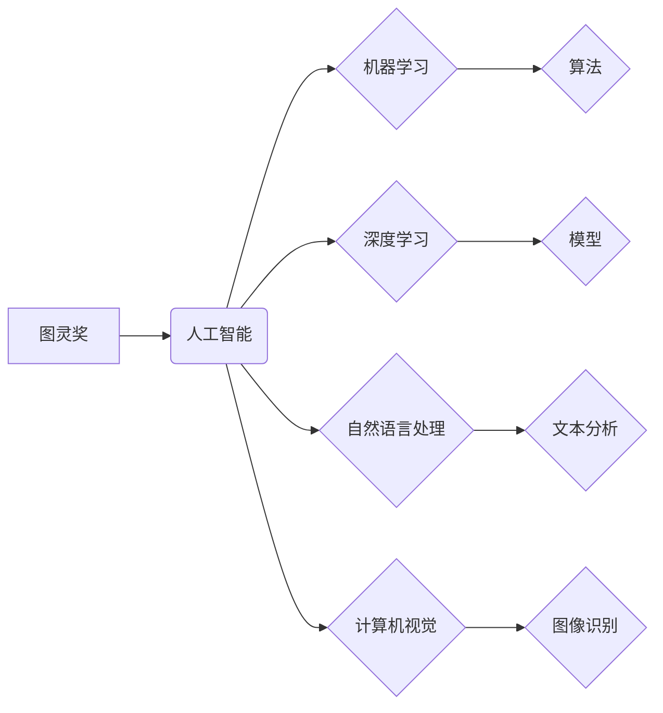

> 图灵奖，人工智能，深度学习，机器学习，自然语言处理，计算机视觉，算法，模型，应用

## 1. 背景介绍

人工智能（AI）作为科技发展的重要方向，近年来取得了令人瞩目的进展。从语音识别到图像生成，从自动驾驶到医疗诊断，AI技术正在深刻地改变着我们的生活。而图灵奖，作为计算机科学领域最高荣誉，也见证了AI技术的不断发展和突破。

图灵奖得主们，作为计算机科学领域的领军人物，他们的研究成果和思想对AI的发展产生了深远的影响。他们不仅提出了许多重要的理论和算法，也为AI技术的应用提供了新的思路和方向。

## 2. 核心概念与联系

**2.1  图灵奖与人工智能**

图灵奖设立于1966年，旨在表彰对计算机科学领域做出杰出贡献的人员。该奖项的设立，标志着计算机科学作为一门独立学科的诞生，也为人工智能的发展奠定了理论基础。

**2.2  人工智能的定义与发展**

人工智能是指模拟人类智能行为的计算机系统。它涵盖了多个领域，包括机器学习、深度学习、自然语言处理、计算机视觉等。

人工智能的发展经历了多个阶段：

* **早期阶段（1950s-1970s）：** 专家系统、符号人工智能等方法为主。
* **知识表示阶段（1980s-1990s）：** 知识图谱、逻辑推理等方法为主。
* **机器学习阶段（2000s-至今）：** 统计学习、深度学习等方法为主。

**2.3  图灵奖得主对人工智能的影响**

图灵奖得主们在人工智能领域做出了许多重要贡献，例如：

* **Alan Turing:** 提出了图灵测试，为人工智能的定义和评估提供了标准。
* **John McCarthy:** 创造了“人工智能”一词，并提出了人工智能的逻辑框架。
* **Marvin Minsky:** 奠定了神经网络理论的基础，并推动了人工智能研究的发展。
* **Geoffrey Hinton:** 深度学习领域的先驱，其研究成果推动了人工智能的快速发展。

**2.4  核心概念关系图**



## 3. 核心算法原理 & 具体操作步骤

**3.1  算法原理概述**

机器学习算法是人工智能的核心，它允许计算机从数据中学习，并做出预测或决策。常见的机器学习算法包括：

* **监督学习:** 利用标记数据训练模型，例如分类和回归。
* **无监督学习:** 从未标记数据中发现模式，例如聚类和降维。
* **强化学习:** 通过试错学习，获得最大奖励。

**3.2  算法步骤详解**

以监督学习为例，其基本步骤如下：

1. **数据收集和预处理:** 收集相关数据，并进行清洗、转换和特征工程等预处理操作。
2. **模型选择:** 根据任务需求选择合适的模型，例如线性回归、逻辑回归、决策树等。
3. **模型训练:** 利用标记数据训练模型，调整模型参数，使其能够准确地预测目标变量。
4. **模型评估:** 使用测试数据评估模型的性能，例如准确率、召回率、F1-score等。
5. **模型部署:** 将训练好的模型部署到实际应用场景中，用于预测或决策。

**3.3  算法优缺点**

不同的机器学习算法具有不同的优缺点，需要根据具体任务选择合适的算法。例如，线性回归算法简单易实现，但对非线性关系的拟合能力较弱；决策树算法可以处理非线性关系，但容易过拟合；神经网络算法可以学习复杂的非线性关系，但训练时间长，参数众多。

**3.4  算法应用领域**

机器学习算法广泛应用于各个领域，例如：

* **医疗诊断:** 利用病历数据预测疾病风险，辅助医生诊断。
* **金融风险控制:** 利用交易数据识别欺诈行为，降低金融风险。
* **推荐系统:** 利用用户行为数据推荐个性化商品或服务。
* **自然语言处理:** 利用文本数据进行文本分类、情感分析、机器翻译等任务。

## 4. 数学模型和公式 & 详细讲解 & 举例说明

**4.1  数学模型构建**

机器学习算法通常基于数学模型，例如线性回归模型、逻辑回归模型、神经网络模型等。这些模型通过数学公式来描述数据之间的关系，并利用算法进行参数优化，以实现预测或决策的目标。

**4.2  公式推导过程**

例如，线性回归模型的目标是找到一条直线，能够最佳地拟合数据点。其数学模型如下：

$$y = wx + b$$

其中，$y$ 是预测值，$x$ 是输入特征，$w$ 是权重系数，$b$ 是偏置项。

模型参数 $w$ 和 $b$ 的优化可以通过最小化均方误差来实现：

$$Loss = \frac{1}{n} \sum_{i=1}^{n} (y_i - \hat{y}_i)^2$$

其中，$n$ 是数据点的数量，$y_i$ 是真实值，$\hat{y}_i$ 是预测值。

**4.3  案例分析与讲解**

假设我们有一组数据，包含房屋面积和房屋价格的信息。我们可以使用线性回归模型来预测房屋价格。

* **输入特征:** 房屋面积
* **输出目标:** 房屋价格

通过训练线性回归模型，我们可以得到房屋面积和房屋价格之间的关系，并利用该模型预测新房子的价格。

## 5. 项目实践：代码实例和详细解释说明

**5.1  开发环境搭建**

可以使用 Python 语言和相关的机器学习库，例如 scikit-learn、TensorFlow、PyTorch 等，来实现机器学习项目。

**5.2  源代码详细实现**

```python
from sklearn.linear_model import LinearRegression
from sklearn.model_selection import train_test_split
import numpy as np

# 数据加载和预处理
# ...

# 数据分割
X_train, X_test, y_train, y_test = train_test_split(X, y, test_size=0.2, random_state=42)

# 模型训练
model = LinearRegression()
model.fit(X_train, y_train)

# 模型评估
y_pred = model.predict(X_test)
# ...

# 模型部署
# ...
```

**5.3  代码解读与分析**

* `train_test_split()` 函数将数据分割成训练集和测试集。
* `LinearRegression()` 函数创建线性回归模型。
* `fit()` 函数训练模型，利用训练数据学习模型参数。
* `predict()` 函数使用训练好的模型预测测试数据。

**5.4  运行结果展示**

可以通过评估指标，例如均方误差、R-squared 等，来评估模型的性能。

## 6. 实际应用场景

**6.1  医疗诊断**

* 利用病历数据预测疾病风险，辅助医生诊断。
* 利用医学影像数据进行肿瘤检测和分割。

**6.2  金融风险控制**

* 利用交易数据识别欺诈行为，降低金融风险。
* 利用客户数据进行信用评分，评估贷款风险。

**6.3  推荐系统**

* 利用用户行为数据推荐个性化商品或服务。
* 利用内容相似度推荐相关内容。

**6.4  未来应用展望**

人工智能技术将继续发展，并在更多领域得到应用，例如：

* 自动驾驶
* 机器人
* 个性化教育
* 智能家居

## 7. 工具和资源推荐

**7.1  学习资源推荐**

* **书籍:**
    * 《深度学习》
    * 《机器学习实战》
    * 《人工智能：一种现代方法》
* **在线课程:**
    * Coursera
    * edX
    * Udacity

**7.2  开发工具推荐**

* **Python:** 
    * scikit-learn
    * TensorFlow
    * PyTorch
* **其他工具:**
    * Jupyter Notebook
    * Git

**7.3  相关论文推荐**

* **AlphaGo论文:** https://arxiv.org/abs/1607.02886
* **BERT论文:** https://arxiv.org/abs/1810.04805
* **GPT-3论文:** https://arxiv.org/abs/2005.14165

## 8. 总结：未来发展趋势与挑战

**8.1  研究成果总结**

图灵奖得主们对人工智能的发展做出了巨大贡献，推动了人工智能技术的进步和应用。

**8.2  未来发展趋势**

人工智能技术将继续发展，朝着更智能、更安全、更可解释的方向发展。

* **更强大的计算能力:** 随着硬件技术的进步，人工智能模型将变得更大、更复杂。
* **更丰富的学习数据:** 数据是人工智能发展的关键要素，随着数据量的增加，人工智能模型将更加智能。
* **更有效的算法:** 研究人员将继续开发更有效的算法，提高人工智能模型的性能和效率。

**8.3  面临的挑战**

人工智能技术也面临着一些挑战，例如：

* **数据安全和隐私:** 人工智能模型的训练需要大量数据，如何保护数据安全和隐私是一个重要问题。
* **算法偏见:** 人工智能模型可能存在算法偏见，导致不公平的结果。
* **伦理问题:** 人工智能技术的应用可能引发一些伦理问题，例如工作岗位的替代、人工智能的控制等。

**8.4  研究展望**

未来，人工智能研究将继续探索更智能、更安全、更可解释的人工智能系统，并解决人工智能技术带来的挑战。

## 9. 附录：常见问题与解答

**9.1  什么是图灵奖？**

图灵奖是计算机科学领域最高荣誉，旨在表彰对计算机科学领域做出杰出贡献的人员。

**9.2  人工智能有哪些应用场景？**

人工智能技术广泛应用于各个领域，例如医疗诊断、金融风险控制、推荐系统、自动驾驶等。

**9.3  如何学习人工智能？**

可以通过阅读书籍、参加在线课程、参与开源项目等方式学习人工智能。

作者：禅与计算机程序设计艺术 / Zen and the Art of Computer Programming


<end_of_turn>