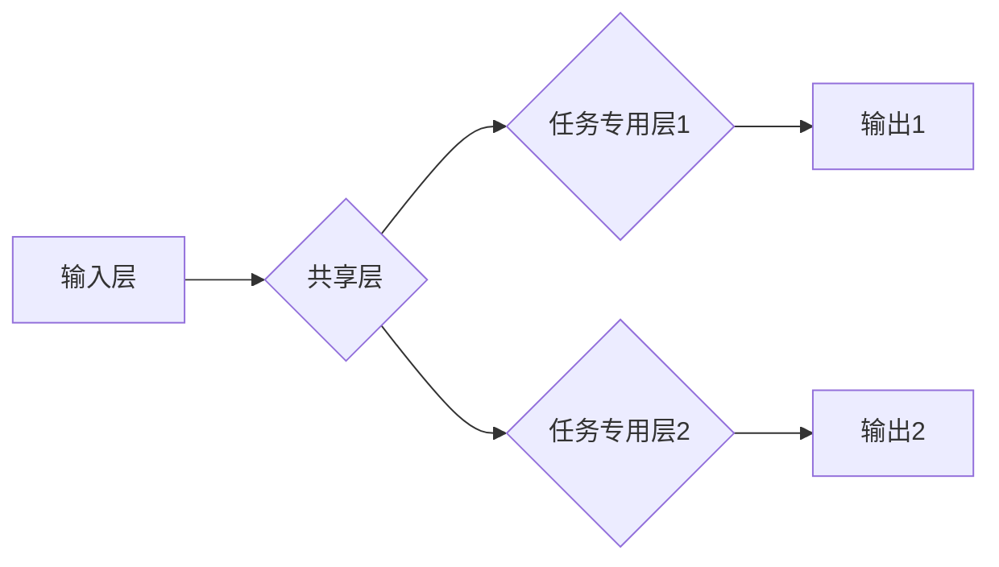

> 多任务学习，MTL，深度学习，迁移学习，模型共享，参数共享，任务相关性，任务无关性，代码实例，TensorFlow

## 1. 背景介绍

在深度学习领域，模型训练通常针对单一任务进行，例如图像分类、文本生成或语音识别。然而，现实世界中往往存在多个相关任务，例如图像分类和物体检测、机器翻译和文本摘要等。针对这种情况，多任务学习 (Multi-Task Learning，MTL) 应运而生。

多任务学习是一种机器学习范式，它训练一个共享参数的模型来同时学习多个相关任务。通过共享参数，MTL 可以利用不同任务之间的相关性，从而提高模型的泛化能力和学习效率。

## 2. 核心概念与联系

**2.1 多任务学习的优势**

* **提升泛化能力:** MTL 可以通过学习多个任务的共同特征，从而提高模型对未知数据的泛化能力。
* **提高学习效率:** MTL 可以利用不同任务之间的相关性，减少模型训练所需的样本数量和时间。
* **促进知识迁移:** MTL 可以将已学习到的知识迁移到新的任务中，从而加速新任务的学习过程。

**2.2 多任务学习的挑战**

* **任务相关性:** MTL 的效果依赖于任务之间的相关性。如果任务之间不相关，MTL 可能无法发挥优势。
* **任务权重:** 不同任务的重要性可能不同，需要合理分配任务权重，以确保模型能够有效地学习所有任务。
* **模型复杂度:** MTL 模型通常比单任务模型更复杂，需要更多的计算资源和训练时间。

**2.3 MTL 架构**



**2.4 任务相关性与任务无关性**

* **任务相关性:** 不同任务之间存在一定的联系，例如图像分类和物体检测。
* **任务无关性:** 不同任务之间没有明显的联系，例如图像分类和文本生成。

## 3. 核心算法原理 & 具体操作步骤

### 3.1  算法原理概述

多任务学习的核心思想是共享模型参数，从而利用不同任务之间的相关性。

* **共享层:** 所有任务共享的模型层，用于学习通用特征。
* **任务专用层:** 每个任务都有自己的专用层，用于学习任务特定的特征。

### 3.2  算法步骤详解

1. **数据预处理:** 对每个任务的数据进行预处理，例如图像裁剪、文本分词等。
2. **模型构建:** 建立一个多任务学习模型，包含共享层和任务专用层。
3. **参数初始化:** 初始化模型参数。
4. **训练:** 使用训练数据训练模型，并根据损失函数更新模型参数。
5. **评估:** 使用测试数据评估模型性能。

### 3.3  算法优缺点

**优点:**

* 提升泛化能力
* 提高学习效率
* 促进知识迁移

**缺点:**

* 任务相关性要求高
* 任务权重分配需要谨慎
* 模型复杂度较高

### 3.4  算法应用领域

* **计算机视觉:** 图像分类、物体检测、图像分割等
* **自然语言处理:** 机器翻译、文本摘要、情感分析等
* **语音识别:** 语音识别、语音合成等
* **医疗诊断:** 病理图像分析、疾病预测等

## 4. 数学模型和公式 & 详细讲解 & 举例说明

### 4.1  数学模型构建

假设我们有 $T$ 个任务，每个任务都有自己的输出 $y_t$ 和损失函数 $L_t(y_t, \hat{y}_t)$。模型参数为 $\theta$。

多任务学习的目标是最小化所有任务的损失函数的加权平均值：

$$
L(\theta) = \sum_{t=1}^{T} \lambda_t L_t(y_t, \hat{y}_t)
$$

其中，$\lambda_t$ 是任务 $t$ 的权重，用于平衡不同任务的重要性。

### 4.2  公式推导过程

损失函数的最小化可以通过梯度下降算法实现。对于每个参数 $\theta_i$，梯度为：

$$
\frac{\partial L(\theta)}{\partial \theta_i} = \sum_{t=1}^{T} \lambda_t \frac{\partial L_t(y_t, \hat{y}_t)}{\partial \theta_i}
$$

更新规则为：

$$
\theta_i = \theta_i - \eta \frac{\partial L(\theta)}{\partial \theta_i}
$$

其中，$\eta$ 是学习率。

### 4.3  案例分析与讲解

假设我们有两个任务：图像分类和物体检测。

* **图像分类任务:** 损失函数为交叉熵损失函数。
* **物体检测任务:** 损失函数为边界框回归损失函数和分类损失函数。

我们可以使用多任务学习模型，共享图像特征提取层，并为每个任务添加相应的专用层。

## 5. 项目实践：代码实例和详细解释说明

### 5.1  开发环境搭建

* Python 3.6+
* TensorFlow 2.0+
* Keras

### 5.2  源代码详细实现

```python
import tensorflow as tf
from tensorflow import keras

# 定义模型
model = keras.Sequential([
    keras.layers.Conv2D(32, (3, 3), activation='relu', input_shape=(28, 28, 1)),
    keras.layers.MaxPooling2D((2, 2)),
    keras.layers.Conv2D(64, (3, 3), activation='relu'),
    keras.layers.MaxPooling2D((2, 2)),
    keras.layers.Flatten(),
    keras.layers.Dense(10, activation='softmax'),  # 分类任务
    keras.layers.Dense(1, activation='sigmoid')  # 物体检测任务
])

# 定义损失函数和优化器
loss_fn = keras.losses.CategoricalCrossentropy()
optimizer = keras.optimizers.Adam()

# 编译模型
model.compile(loss=loss_fn, optimizer=optimizer)

# 训练模型
model.fit(x_train, y_train, epochs=10)

# 评估模型
loss, accuracy = model.evaluate(x_test, y_test)
print('Loss:', loss)
print('Accuracy:', accuracy)
```

### 5.3  代码解读与分析

* **模型定义:** 使用 Keras 库定义一个多任务学习模型，包含卷积层、池化层、全连接层等。
* **损失函数和优化器:** 定义分类任务和物体检测任务的损失函数，并选择 Adam 优化器。
* **模型编译:** 使用定义的损失函数和优化器编译模型。
* **模型训练:** 使用训练数据训练模型。
* **模型评估:** 使用测试数据评估模型性能。

### 5.4  运行结果展示

训练完成后，可以查看模型的损失值和准确率。

## 6. 实际应用场景

### 6.1  医疗诊断

* **病理图像分析:** 使用多任务学习模型，同时学习病理图像的分类和分割任务，提高疾病诊断的准确性。
* **疾病预测:** 使用多任务学习模型，学习患者的医疗记录和生活习惯，预测疾病的发生风险。

### 6.2  自然语言处理

* **机器翻译:** 使用多任务学习模型，同时学习不同语言之间的翻译关系和语法规则，提高翻译质量。
* **文本摘要:** 使用多任务学习模型，学习文本的主题和关键信息，生成简洁的文本摘要。

### 6.3  计算机视觉

* **图像分类和物体检测:** 使用多任务学习模型，同时学习图像的分类和物体检测任务，提高目标识别能力。
* **图像分割:** 使用多任务学习模型，学习图像的像素级分割任务，用于医学图像分析和自动驾驶等领域。

### 6.4  未来应用展望

* **个性化推荐:** 使用多任务学习模型，学习用户的兴趣和偏好，提供个性化的商品推荐。
* **智能客服:** 使用多任务学习模型，学习用户的对话内容和意图，提供更智能的客服服务。
* **自动驾驶:** 使用多任务学习模型，学习车辆周围环境的信息，提高自动驾驶的安全性。

## 7. 工具和资源推荐

### 7.1  学习资源推荐

* **书籍:**
    * Deep Learning by Ian Goodfellow, Yoshua Bengio, and Aaron Courville
    * Hands-On Machine Learning with Scikit-Learn, Keras & TensorFlow by Aurélien Géron
* **课程:**
    * Stanford CS231n: Convolutional Neural Networks for Visual Recognition
    * Deep Learning Specialization by Andrew Ng

### 7.2  开发工具推荐

* **TensorFlow:** 开源深度学习框架
* **Keras:** 高级深度学习API，可以运行在TensorFlow、Theano或CNTK上
* **PyTorch:** 开源深度学习框架

### 7.3  相关论文推荐

* **Multi-Task Learning** by Richard S. Sutton and Andrew G. Barto
* **Learning Transferable Features with Multi-Task Neural Networks** by  Ross Girshick et al.
* **Domain Adaptation for Large-Scale Image Recognition** by  Zhirong Wu et al.

## 8. 总结：未来发展趋势与挑战

### 8.1  研究成果总结

多任务学习在近年来取得了显著的进展，在多个领域取得了优异的性能。

### 8.2  未来发展趋势

* **更有效的任务相关性分析:** 研究更有效的任务相关性分析方法，以更好地选择合适的任务组合。
* **动态任务分配:** 研究动态任务分配机制，根据任务的重要性和模型性能动态调整任务权重。
* **跨模态多任务学习:** 研究跨模态多任务学习，例如图像和文本的联合学习。

### 8.3  面临的挑战

* **数据稀缺性:** 许多任务的数据都比较稀缺，这会影响多任务学习模型的训练效果。
* **任务冲突:** 不同任务之间可能存在冲突，这会影响模型的性能。
* **模型复杂度:** 多任务学习模型通常比单任务模型更复杂，需要更多的计算资源和训练时间。

### 8.4  研究展望

未来，多任务学习的研究将继续朝着更有效、更灵活、更普适的方向发展。


## 9. 附录：常见问题与解答

**1. 多任务学习和迁移学习有什么区别？**

* **多任务学习:** 在一个模型中同时学习多个任务，共享模型参数。
* **迁移学习:** 将已学习到的知识从一个任务迁移到另一个任务，通常使用预训练模型。

**2. 如何选择合适的任务组合？**

* 寻找具有相关性的任务，例如图像分类和物体检测。
* 考虑任务的重要性，并合理分配任务权重。

**3. 如何解决数据稀缺性问题？**

* 使用数据增强技术增加训练数据量。
* 使用迁移学习技术，利用预训练模型。

**4. 如何解决任务冲突问题？**

* 使用正则化技术，防止模型过拟合。
* 使用任务权重机制，平衡不同任务的影响。


作者：禅与计算机程序设计艺术 / Zen and the Art of Computer Programming 
<end_of_turn>