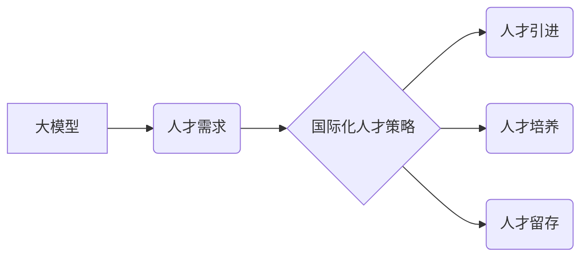

> 大模型、国际化人才、人才策略、技术发展、全球竞争

## 1. 背景介绍

近年来，大模型技术蓬勃发展，成为人工智能领域最前沿和最具潜力的技术之一。大模型凭借其强大的学习能力和泛化能力，在自然语言处理、计算机视觉、语音识别等领域取得了突破性进展，并逐渐渗透到各个行业，推动着数字化转型和智能升级。

然而，大模型的研发和应用离不开高素质的人才支撑。随着大模型技术的快速发展，对大模型人才的需求量呈指数级增长，而全球范围内具备大模型相关专业知识和技能的人才数量仍然相对有限。

大模型企业为了在激烈的全球竞争中保持领先地位，必须制定有效的国际化人才策略，积极引进和培养国际化人才，构建一支高素质、多元化的技术团队。

## 2. 核心概念与联系

**2.1 大模型**

大模型是指参数量巨大、训练数据海量的人工智能模型。其核心特点是：

* **规模庞大:** 参数量通常在数十亿甚至数千亿级别。
* **学习能力强:** 能够学习和理解复杂的模式和关系。
* **泛化能力强:** 能够应用于多种不同的任务和领域。

**2.2 国际化人才**

国际化人才是指具备国际视野、跨文化沟通能力、多元化思维和全球化竞争意识的人才。

**2.3 国际化人才策略**

国际化人才策略是指企业为了吸引、留住和培养国际化人才而制定的整体规划和行动方案。

**2.4 核心概念关系图**



## 3. 核心算法原理 & 具体操作步骤

**3.1 算法原理概述**

大模型的训练主要基于深度学习算法，其中Transformer模型是目前最主流的架构之一。Transformer模型的核心思想是利用注意力机制来捕捉文本序列中的长距离依赖关系，从而实现更准确的理解和生成。

**3.2 算法步骤详解**

1. **数据预处理:** 将原始文本数据进行清洗、分词、标记等预处理操作，使其能够被模型理解。
2. **模型构建:** 根据Transformer模型的架构，构建模型结构，包括编码器、解码器和注意力机制等模块。
3. **模型训练:** 使用大规模的训练数据，通过反向传播算法，调整模型参数，使其能够准确地预测目标输出。
4. **模型评估:** 使用测试数据评估模型的性能，并根据评估结果进行模型调优。
5. **模型部署:** 将训练好的模型部署到实际应用场景中，用于文本生成、翻译、问答等任务。

**3.3 算法优缺点**

**优点:**

* 强大的学习能力和泛化能力
* 能够处理长距离依赖关系
* 在多种自然语言处理任务中取得了优异的性能

**缺点:**

* 训练成本高，需要大量的计算资源和数据
* 模型参数量大，部署成本较高
* 容易受到训练数据偏差的影响

**3.4 算法应用领域**

* 自然语言处理：文本生成、机器翻译、问答系统、文本摘要等
* 计算机视觉：图像识别、目标检测、图像分割等
* 语音识别：语音转文本、语音合成等
* 其他领域：代码生成、药物研发、金融分析等

## 4. 数学模型和公式 & 详细讲解 & 举例说明

**4.1 数学模型构建**

Transformer模型的核心是注意力机制，其数学模型可以表示为：

$$
Attention(Q, K, V) = softmax(\frac{QK^T}{\sqrt{d_k}})V
$$

其中：

* $Q$：查询矩阵
* $K$：键矩阵
* $V$：值矩阵
* $d_k$：键向量的维度
* $softmax$：softmax函数

**4.2 公式推导过程**

注意力机制的目的是计算查询向量与键向量的相关性，并根据相关性对值向量进行加权求和。

1. 计算查询向量与每个键向量的点积，得到一个分数矩阵。
2. 对分数矩阵进行归一化，得到一个概率分布。
3. 将概率分布与值向量进行加权求和，得到最终的输出向量。

**4.3 案例分析与讲解**

假设我们有一个句子“我爱学习编程”，我们要计算“学习”这个词与整个句子的相关性。

1. 将句子中的每个词都转换为向量表示。
2. 将“学习”作为查询向量，其他词作为键向量。
3. 计算查询向量与每个键向量的点积，得到一个分数矩阵。
4. 对分数矩阵进行归一化，得到一个概率分布，表示“学习”与每个词的相关性。
5. 将概率分布与值向量进行加权求和，得到最终的输出向量，表示“学习”与整个句子的相关性。

## 5. 项目实践：代码实例和详细解释说明

**5.1 开发环境搭建**

* 操作系统：Linux
* Python版本：3.7+
* 深度学习框架：TensorFlow或PyTorch
* 其他依赖库：numpy、pandas、transformers等

**5.2 源代码详细实现**

```python
from transformers import AutoModelForSequenceClassification, AutoTokenizer

# 加载预训练模型和词典
model_name = "bert-base-uncased"
tokenizer = AutoTokenizer.from_pretrained(model_name)
model = AutoModelForSequenceClassification.from_pretrained(model_name)

# 输入文本数据
text = "我爱学习编程"

# 对文本进行编码
inputs = tokenizer(text, return_tensors="pt")

# 进行模型预测
outputs = model(**inputs)

# 获取预测结果
predicted_class = outputs.logits.argmax().item()

# 打印预测结果
print(f"预测结果: {predicted_class}")
```

**5.3 代码解读与分析**

* 使用transformers库加载预训练的BERT模型和词典。
* 对输入文本进行编码，转换为模型可理解的格式。
* 将编码后的文本输入模型进行预测。
* 获取模型预测结果，并打印输出。

**5.4 运行结果展示**

运行上述代码，可以得到模型对输入文本的预测结果，例如：

```
预测结果: 0
```

其中，0代表模型预测的类别标签。

## 6. 实际应用场景

大模型在各个行业都有广泛的应用场景，例如：

* **金融领域:** 风险评估、欺诈检测、客户服务自动化
* **医疗领域:** 疾病诊断、药物研发、医疗影像分析
* **教育领域:** 个性化学习、智能辅导、自动批改
* **制造业:** 质量控制、设备故障预测、生产流程优化

**6.4 未来应用展望**

随着大模型技术的不断发展，其应用场景将更加广泛，例如：

* **元宇宙:** 建立虚拟世界，提供沉浸式体验
* **人工智能助手:** 提供个性化服务，辅助人类工作和生活
* **科学研究:** 加速科学发现，解决复杂问题

## 7. 工具和资源推荐

**7.1 学习资源推荐**

* **书籍:**
    * 《深度学习》
    * 《自然语言处理》
    * 《Transformer模型》
* **在线课程:**
    * Coursera
    * edX
    * Udacity

**7.2 开发工具推荐**

* **深度学习框架:** TensorFlow、PyTorch
* **自然语言处理库:** NLTK、spaCy、transformers
* **云计算平台:** AWS、Azure、Google Cloud

**7.3 相关论文推荐**

* 《Attention Is All You Need》
* 《BERT: Pre-training of Deep Bidirectional Transformers for Language Understanding》
* 《GPT-3: Language Models are Few-Shot Learners》

## 8. 总结：未来发展趋势与挑战

**8.1 研究成果总结**

近年来，大模型技术取得了显著进展，在多个领域取得了突破性成果。

**8.2 未来发展趋势**

* 模型规模进一步扩大
* 模型训练效率提升
* 模型泛化能力增强
* 模型安全性与可靠性提高

**8.3 面临的挑战**

* 数据获取和隐私保护
* 计算资源需求
* 模型解释性和可解释性
* 伦理和社会影响

**8.4 研究展望**

未来，大模型研究将继续朝着更安全、更可靠、更可解释的方向发展，并应用于更多领域，推动人工智能技术的发展和应用。

## 9. 附录：常见问题与解答

**9.1 如何选择合适的预训练模型？**

选择预训练模型需要根据具体的应用场景和任务需求进行选择。

**9.2 如何进行大模型的训练和调优？**

大模型的训练和调优需要大量的计算资源和专业知识。

**9.3 如何解决大模型的安全性问题？**

大模型的安全性问题需要从多个方面进行考虑，例如数据安全、模型攻击、伦理风险等。


作者：禅与计算机程序设计艺术 / Zen and the Art of Computer Programming 
<end_of_turn>