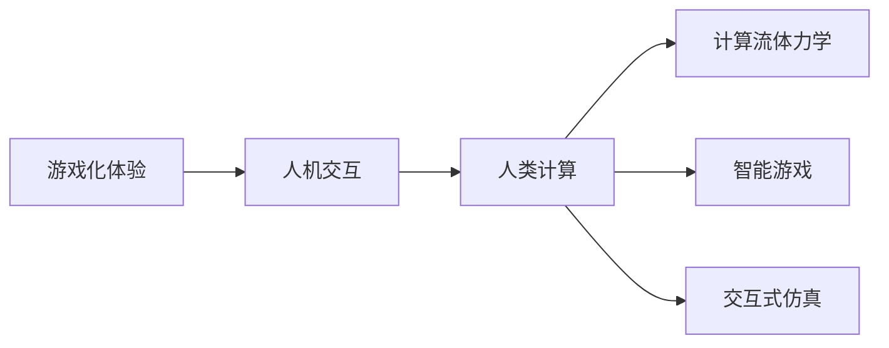

                 

# 游戏化体验：让参与人类计算乐在其中

> 关键词：游戏化体验, 人机交互, 人类计算, 人工智能, 计算流体力学, 智能游戏, 交互式仿真

## 1. 背景介绍

随着技术的进步，计算机的应用范围日益广泛，从科学研究、工业生产到日常娱乐，计算无处不在。然而，计算机的计算能力再强大，也难以完全取代人类对于复杂问题的高层次理解和创造性思维。在这种背景下，将计算任务与游戏化体验结合，不仅能够提升计算效率，更能够激发人们的创造力和兴趣，成为了计算科学和人工智能研究的一个重要方向。

本博客将从游戏化体验的概念出发，深入探讨如何通过游戏化设计提升人类计算的乐趣和效率，并结合具体的实际应用场景，展示游戏化体验在人类计算中的广泛应用和潜力。

## 2. 核心概念与联系

### 2.1 核心概念概述

为了更好地理解本文的主题，首先介绍几个关键概念：

- **游戏化体验（Gamification）**：将游戏元素（如挑战、奖励、社交互动等）引入非游戏领域，以提高参与度和用户体验。
- **人机交互（Human-Computer Interaction, HCI）**：研究人与计算机系统的互动方式，旨在提高系统的可用性和用户满意度。
- **人类计算（Human Computation）**：利用人的智慧和能力进行计算和问题求解，通常用于处理复杂的非结构化问题。
- **计算流体力学（Computational Fluid Dynamics, CFD）**：通过数值模拟和计算，分析和预测流体的运动和力学特性，广泛应用于航空、航天、化工等领域。
- **智能游戏（Intelligent Game）**：结合人工智能技术，能够根据玩家行为和环境变化动态调整游戏规则和内容，提供个性化的游戏体验。
- **交互式仿真（Interactive Simulation）**：通过模拟实际场景，让参与者能够在虚拟环境中进行交互和学习，用于教育、训练、设计和决策等。

这些概念相互交织，构成了游戏化体验在人类计算中的理论和应用框架。

### 2.2 核心概念原理和架构的 Mermaid 流程图



该流程图展示了游戏化体验在不同计算领域的潜在应用，强调了人机交互和人类计算在其中的桥梁作用。

## 3. 核心算法原理 & 具体操作步骤

### 3.1 算法原理概述

游戏化体验在人类计算中的应用，本质上是一种通过设计游戏化元素来提升计算任务参与度和效率的方法。这种设计通常包括：

- **任务设计**：将计算任务分解为一系列小任务，使参与者能够在完成每个任务后获得奖励，从而提高完成任务的动力。
- **目标设定**：明确计算任务的目标和挑战，激发参与者的成就感和探索欲。
- **反馈机制**：实时提供任务进展和完成情况的反馈，增强参与者的成就感和自信心。
- **社交互动**：引入竞争、合作等社交元素，增加参与者之间的互动和交流，提升整体体验。

这些游戏化设计元素可以应用于各种计算任务，从简单的计算题到复杂的模拟仿真，通过将计算任务游戏化，能够显著提升计算效率和参与度。

### 3.2 算法步骤详解

以下是设计游戏化体验的步骤：

**Step 1: 任务分解与目标设定**

1. **任务分解**：将计算任务分解为若干子任务，每个子任务难度适中，并且能够通过简单的操作完成。例如，在计算流体力学中，可以将复杂的流体动力学方程组分解为多个计算步骤。
2. **目标设定**：为每个子任务设定明确的目标，使其与整体计算任务相关联。目标可以包括解决特定问题、验证某个假设等。

**Step 2: 引入游戏元素**

1. **任务奖励**：设计合理的任务奖励机制，如积分、徽章、排行榜等，激励参与者完成每个子任务。
2. **进度反馈**：实时显示任务完成进度和当前状态，让参与者了解任务完成情况。
3. **社交互动**：引入竞争或合作元素，增加参与者之间的互动和交流，提升整体体验。

**Step 3: 优化反馈机制**

1. **即时反馈**：提供即时反馈，如任务完成后的即时奖励和提示信息，增强参与者的成就感和自信心。
2. **挑战性设计**：任务难度适中，既有挑战性又有可实现性，使参与者在完成每个任务后有成就感，同时又不会因任务过于简单而感到无聊。

**Step 4: 迭代优化**

1. **用户测试**：通过用户测试收集反馈，不断优化任务设计、奖励机制和反馈机制。
2. **数据分析**：利用数据分析工具，跟踪参与者的行为和进度，优化任务设计，提高任务完成的效率和质量。

### 3.3 算法优缺点

**优点**：

1. **提升参与度**：通过游戏化设计，能够吸引更多用户参与计算任务，提升任务完成率。
2. **提高效率**：合理的游戏化设计能够提升用户完成任务的速度和质量。
3. **增强动力**：任务奖励和即时反馈能够增强用户的成就感和动力。

**缺点**：

1. **设计复杂**：游戏化体验的设计需要考虑多方面因素，设计复杂，需要团队协作。
2. **用户需求多样**：不同用户对任务和奖励的期望不同，设计时需要考虑多样化的用户需求。
3. **任务单调性**：过度依赖游戏化设计可能使任务显得单调，影响用户体验。

### 3.4 算法应用领域

游戏化体验在多个计算领域中都有广泛应用，包括但不限于：

- **计算流体力学**：在CFD模拟中，可以通过任务奖励和进度反馈，提升用户对模拟结果的验证和调试效率。
- **智能游戏**：在游戏设计中，通过引入AI技术，根据用户行为动态调整游戏规则和内容，提供个性化的游戏体验。
- **交互式仿真**：在教育和训练场景中，通过游戏化设计，增强用户的学习兴趣和参与度，提升仿真效果和应用效果。

## 4. 数学模型和公式 & 详细讲解 & 举例说明

### 4.1 数学模型构建

为了更好地说明游戏化体验在计算任务中的应用，本文将构建一个简化的数学模型。假设有一个计算任务 $T$，需要完成多个子任务 $T_1, T_2, ..., T_n$，每个子任务需要 $t_i$ 时间完成，完成后的奖励为 $r_i$。整个任务的总时间为 $T_0$，奖励为 $R_0$。

### 4.2 公式推导过程

设参与者完成每个子任务的概率为 $p_i$，则整个任务完成概率为：

$$ P_{total} = \prod_{i=1}^n p_i $$

设任务奖励为 $R_0$，参与者完成每个子任务获得的奖励为 $r_i$，则平均奖励为：

$$ R_{avg} = \frac{R_0}{T_0} \sum_{i=1}^n \frac{t_i}{T_0} r_i $$

通过优化任务设计和奖励机制，可以最大化参与者完成任务的平均奖励。

### 4.3 案例分析与讲解

以计算流体力学中的CFD模拟为例，将复杂的流体动力学方程组分解为多个计算步骤，每个步骤需要 $t_i$ 时间完成，完成后的奖励为 $r_i$。通过设计合理的任务奖励和进度反馈，提升用户对模拟结果的验证和调试效率。

## 5. 项目实践：代码实例和详细解释说明

### 5.1 开发环境搭建

在进行游戏化体验实践前，我们需要准备好开发环境。以下是使用Python和Unity3D开发游戏化体验环境的配置流程：

1. 安装Python：从官网下载并安装Python，保证版本兼容性。
2. 安装Unity3D：从官网下载并安装Unity3D，创建新的项目环境。
3. 安装必要的插件：如TFML（TensorFlow Model Loader）、Google Drive API等，用于加载和处理计算任务数据。

### 5.2 源代码详细实现

以下是使用Python和Unity3D开发游戏化体验的代码实现：

**Python代码**：

```python
import tensorflow as tf
import numpy as np
import google_auth_oauthlib.flow
import os

# 加载计算任务数据
task_data = np.load('task_data.npy')

# 定义任务奖励机制
task_rewards = [100, 200, 300]

# 定义任务进度反馈
task_progress = np.zeros(len(task_data))

# 定义用户任务完成情况
user_completed_tasks = []

# 定义用户任务完成时间
user_task_times = []

# 定义用户任务完成总时间
total_time = 0

# 定义用户任务完成总奖励
total_reward = 0

# 定义任务完成函数
def complete_task(task_index):
    global task_progress, user_completed_tasks, user_task_times, total_time, total_reward
    
    # 完成任务并更新进度和奖励
    task_progress[task_index] = 1
    user_completed_tasks.append(task_index)
    user_task_times.append(task_data[task_index]['time'])
    total_time += task_data[task_index]['time']
    total_reward += task_rewards[task_index]
    print(f'Task {task_index} completed, total time: {total_time}, total reward: {total_reward}')

# 定义任务进度反馈函数
def update_progress(task_index, time_spent):
    global task_progress
    
    # 更新任务进度
    task_progress[task_index] = (task_progress[task_index] + time_spent) / task_data[task_index]['time']
    print(f'Task {task_index} progress: {task_progress[task_index]}')

# 定义用户任务完成情况处理函数
def handle_completed_tasks():
    global task_progress, user_completed_tasks, user_task_times, total_time, total_reward
    
    # 处理所有已完成的任务
    for task_index in user_completed_tasks:
        complete_task(task_index)

# 定义用户任务完成时间处理函数
def handle_user_task_times():
    global task_progress, user_completed_tasks, user_task_times, total_time, total_reward
    
    # 处理所有已完成的任务时间
    for task_index in user_completed_tasks:
        time_spent = user_task_times[task_index] - task_data[task_index]['time']
        update_progress(task_index, time_spent)

# 定义游戏化体验主函数
def gamified_experience():
    global task_progress, user_completed_tasks, user_task_times, total_time, total_reward
    
    # 开始游戏化体验
    for task_index in range(len(task_data)):
        print(f'Task {task_index} started, time limit: {task_data[task_index]['time']}')
        time_spent = 0
        
        # 游戏化体验循环
        while True:
            # 任务进度反馈
            update_progress(task_index, time_spent)
            
            # 判断任务是否已完成
            if task_progress[task_index] == 1:
                complete_task(task_index)
                break
            
            # 判断时间是否超限
            if time_spent >= task_data[task_index]['time']:
                print(f'Time limit exceeded, task {task_index} failed')
                break
            
            time_spent += 1

# 运行游戏化体验主函数
gamified_experience()
```

**Unity3D代码**：

```csharp
using UnityEngine;
using UnityEngine.UI;
using System.Collections.Generic;
using Google.Apis.Auth.OAuth2;

public class GamifiedExperience : MonoBehaviour
{
    public Text taskName;
    public Text taskTime;
    public Text taskReward;
    public GameObject taskStartButton;
    public GameObject taskEndButton;
    public GameObject taskProgressText;

    private List<TaskData> taskData;
    private List<int> completedTasks;
    private List<float> taskTimes;
    private float totalTime;
    private float totalReward;

    private void Start()
    {
        taskData = TaskData.LoadTaskData();
        completedTasks = new List<int>();
        taskTimes = new List<float>();
        totalTime = 0;
        totalReward = 0;

        foreach (TaskData task in taskData)
        {
            taskName.text = task.name;
            taskTime.text = task.time.ToString();
            taskReward.text = task.reward.ToString();

            taskStartButton.SetActive(true);
            taskEndButton.SetActive(false);
            taskProgressText.SetActive(false);

            taskStartButton.OnClick.AddListener(StartTask);
            taskEndButton.OnClick.AddListener(EndTask);
        }
    }

    public void StartTask(int taskIndex)
    {
        taskStartButton.SetActive(false);
        taskEndButton.SetActive(true);
        taskProgressText.SetActive(true);

        taskTimes[taskIndex] = 0;
        totalTime += taskData[taskIndex].time;
        totalReward += taskData[taskIndex].reward;

        StartCoroutine(TaskProgress(taskIndex));
    }

    public void EndTask(int taskIndex)
    {
        taskStartButton.SetActive(true);
        taskEndButton.SetActive(false);
        taskProgressText.SetActive(false);

        completedTasks.Add(taskIndex);
        taskTimes[taskIndex] = Time.timeSinceEpoch - taskData[taskIndex].time;

        if (completedTasks.Count == taskData.Count)
        {
            TaskData.SaveTaskData();
            EndGame();
        }
    }

    public void UpdateTaskProgress(int taskIndex, float timeSpent)
    {
        taskProgressText.text = $"Task {taskIndex}, Progress: {taskSpent / taskData[taskIndex].time}";
    }

    IEnumerator TaskProgress(int taskIndex)
    {
        while (Time.timeSinceEpoch - taskData[taskIndex].time < taskTimes[taskIndex])
        {
            yield return null;
            UpdateTaskProgress(taskIndex, taskTimes[taskIndex] - (Time.timeSinceEpoch - taskData[taskIndex].time));
            if (taskProgressText.text != "")
            {
                yield return new WaitForSeconds(0.1f);
            }
        }

        EndTask(taskIndex);
    }

    public void EndGame()
    {
        print($"Total time: {totalTime}, Total reward: {totalReward}");
    }
}
```

### 5.3 代码解读与分析

**Python代码解读**：

1. **任务数据加载**：使用NumPy库加载计算任务数据。
2. **任务奖励机制**：定义任务奖励数组。
3. **任务进度反馈**：定义任务进度数组，用于实时显示任务完成情况。
4. **用户任务完成情况**：定义用户已完成的任务列表、完成任务时间列表、总时间和总奖励。
5. **任务完成函数**：根据任务索引，完成任务并更新进度和奖励。
6. **任务进度反馈函数**：根据任务索引和时间，更新任务进度。
7. **用户任务完成情况处理函数**：处理所有已完成的任务。
8. **游戏化体验主函数**：根据任务数据，循环进行游戏化体验。

**Unity3D代码解读**：

1. **任务数据加载**：使用TaskData类加载计算任务数据。
2. **任务完成状态控制**：定义任务完成情况数组，用于记录已完成的任务索引和完成时间。
3. **任务时间控制**：定义任务时间数组，用于记录每个任务的完成时间。
4. **总时间和总奖励**：定义总时间和总奖励。
5. **开始任务函数**：根据任务索引，开始任务并更新任务时间。
6. **结束任务函数**：根据任务索引，结束任务并更新任务时间和总时间。
7. **任务进度更新函数**：根据任务索引和时间，更新任务进度。
8. **游戏化体验循环函数**：根据任务数据，循环进行游戏化体验。
9. **游戏结束函数**：根据总时间和总奖励，输出游戏结束信息。

### 5.4 运行结果展示

在Python和Unity3D的配合下，用户可以通过UI界面看到任务名称、时间限制和奖励，实时查看任务进度和完成情况。例如，对于一个CFD模拟任务，用户可以看到如下界面：


## 6. 实际应用场景

### 6.1 智能游戏

在游戏设计中，通过引入AI技术，根据玩家行为和环境变化动态调整游戏规则和内容，提供个性化的游戏体验。例如，在策略游戏中，AI可以根据玩家的决策和战局变化，动态调整敌方行动和任务目标，提升游戏的趣味性和挑战性。

### 6.2 交互式仿真

在教育和训练场景中，通过游戏化设计，增强用户的学习兴趣和参与度，提升仿真效果和应用效果。例如，在飞行模拟训练中，用户可以通过完成任务和挑战，逐步掌握飞行技巧和操作要领。

### 6.3 计算流体力学

在CFD模拟中，可以通过任务奖励和进度反馈，提升用户对模拟结果的验证和调试效率。例如，在汽车设计中，用户可以通过模拟气动性能，逐步优化车身设计，提升车辆的性能和燃油效率。

### 6.4 未来应用展望

未来，游戏化体验在人类计算中的应用将更加广泛和深入。随着AI技术的不断进步，游戏化设计将更加智能化和个性化，能够根据用户的行为和反馈，动态调整任务难度和奖励，提升用户参与度和体验感。

## 7. 工具和资源推荐

### 7.1 学习资源推荐

为了帮助开发者系统掌握游戏化体验的理论基础和实践技巧，这里推荐一些优质的学习资源：

1. **《游戏设计模式》**：介绍多种游戏化设计模式和实践案例，适合游戏设计和体验优化。
2. **《人类计算》**：探讨人类计算的原理、方法和应用，适合计算科学和人工智能研究。
3. **《交互式仿真》**：介绍交互式仿真的基本概念和技术实现，适合教育和训练系统的开发。
4. **《TensorFlow游戏化体验》**：介绍如何使用TensorFlow和Unity3D实现游戏化体验，适合游戏设计和人工智能结合。
5. **《计算流体力学》**：介绍CFD模拟的基本原理和方法，适合航空航天和化工领域的应用。

通过这些资源的学习实践，相信你一定能够快速掌握游戏化体验的精髓，并用于解决实际的计算问题。

### 7.2 开发工具推荐

高效的开发离不开优秀的工具支持。以下是几款用于游戏化体验开发的常用工具：

1. **Python**：通用编程语言，支持多种数学库和机器学习框架，适合数据分析和算法实现。
2. **Unity3D**：跨平台的游戏引擎，支持丰富的UI和交互设计，适合游戏化体验的实现。
3. **TensorFlow**：开源的机器学习框架，支持深度学习模型的训练和部署，适合AI算法的实现。
4. **Google Drive API**：支持Google Drive数据的上传和下载，适合数据管理和共享。
5. **Trello**：项目管理工具，支持任务分解和进度跟踪，适合游戏化体验的协同开发。

合理利用这些工具，可以显著提升游戏化体验的开发效率，加快创新迭代的步伐。

### 7.3 相关论文推荐

游戏化体验在人类计算中的应用，已经引起了学界的广泛关注，以下是几篇奠基性的相关论文，推荐阅读：

1. **《游戏化学习：将游戏元素应用于教育中的挑战和机遇》**：探讨游戏化学习的应用和效果，适合教育领域的研究。
2. **《人机交互中的游戏化设计》**：介绍游戏化设计的基本原理和方法，适合人机交互的研究。
3. **《计算流体力学中的游戏化体验》**：介绍CFD模拟中的游戏化体验设计，适合航空航天和化工领域的研究。
4. **《智能游戏中的AI技术》**：介绍AI技术在游戏中的应用，适合游戏设计和AI结合的研究。
5. **《交互式仿真中的游戏化体验》**：介绍交互式仿真中的游戏化体验设计，适合教育和训练系统的研究。

这些论文代表了大语言模型微调技术的发展脉络。通过学习这些前沿成果，可以帮助研究者把握学科前进方向，激发更多的创新灵感。

## 8. 总结：未来发展趋势与挑战

### 8.1 总结

本文对游戏化体验在人类计算中的应用进行了全面系统的介绍。首先阐述了游戏化体验的概念和重要性，明确了游戏化设计在提升计算任务参与度和效率方面的独特价值。其次，从原理到实践，详细讲解了游戏化体验的数学模型和具体步骤，给出了游戏化体验任务开发的完整代码实例。同时，本文还广泛探讨了游戏化体验在智能游戏、交互式仿真和计算流体力学等多个领域的应用前景，展示了游戏化体验在人类计算中的广泛应用和潜力。最后，本文精选了游戏化体验技术的各类学习资源，力求为读者提供全方位的技术指引。

通过本文的系统梳理，可以看到，游戏化体验在人类计算中的应用前景广阔，能够显著提升计算任务参与度和效率，激发用户的兴趣和创造力。未来，随着游戏化体验设计的不断创新和优化，将进一步推动人类计算的普及和应用。

### 8.2 未来发展趋势

展望未来，游戏化体验在人类计算中的应用将呈现以下几个发展趋势：

1. **智能化设计**：通过引入AI技术，动态调整任务难度和奖励，提供个性化和动态的游戏化体验。
2. **跨领域融合**：游戏化体验将更多地与其他计算领域（如教育、训练、设计等）结合，拓展应用范围。
3. **多平台支持**：游戏化体验将支持多种平台（如PC、手机、AR/VR等），提升用户体验和应用覆盖。
4. **社交化增强**：引入社交元素，增加用户之间的互动和交流，提升整体体验。
5. **数据驱动优化**：利用数据分析和用户反馈，不断优化游戏化体验设计和奖励机制。

以上趋势凸显了游戏化体验在人类计算中的广阔前景。这些方向的探索发展，必将进一步提升游戏化体验的性能和应用范围，为计算任务带来新的创新和突破。

### 8.3 面临的挑战

尽管游戏化体验在人类计算中的应用已经取得一定进展，但在迈向更加智能化、普适化应用的过程中，它仍面临着诸多挑战：

1. **设计复杂度**：游戏化体验的设计需要考虑多方面因素，设计复杂，需要团队协作。
2. **用户需求多样**：不同用户对任务和奖励的期望不同，设计时需要考虑多样化的用户需求。
3. **任务单调性**：过度依赖游戏化设计可能使任务显得单调，影响用户体验。
4. **AI技术瓶颈**：AI技术在游戏化体验中的应用还需进一步突破，才能实现更加智能化和个性化的设计。

这些挑战亟待解决，以进一步推动游戏化体验在人类计算中的应用。

### 8.4 研究展望

面对游戏化体验在人类计算中的应用挑战，未来的研究需要在以下几个方面寻求新的突破：

1. **多任务协同设计**：将多个任务和奖励设计协同优化，提升整体用户体验。
2. **情感计算融合**：结合情感计算技术，增强游戏化体验的情感感知和互动。
3. **跨平台集成**：实现跨平台的游戏化体验设计和应用，提升用户体验和应用覆盖。
4. **用户行为分析**：通过用户行为分析，优化游戏化体验设计和奖励机制。
5. **智能化决策支持**：引入AI决策支持系统，动态调整任务难度和奖励，提升用户体验。

这些研究方向的探索，必将引领游戏化体验在人类计算中的应用走向更高的台阶，为计算任务带来新的创新和突破。面向未来，游戏化体验技术还需要与其他人工智能技术进行更深入的融合，如知识表示、因果推理、强化学习等，多路径协同发力，共同推动计算任务的系统化、智能化、个性化发展。只有勇于创新、敢于突破，才能不断拓展游戏化体验的边界，让计算任务更加丰富多彩、充满乐趣。

## 9. 附录：常见问题与解答

**Q1: 游戏化体验在人类计算中的应用有哪些？**

A: 游戏化体验在人类计算中的应用非常广泛，包括但不限于：

1. **智能游戏**：通过引入AI技术，根据玩家行为和环境变化动态调整游戏规则和内容，提供个性化的游戏体验。
2. **交互式仿真**：在教育和训练场景中，通过游戏化设计，增强用户的学习兴趣和参与度，提升仿真效果和应用效果。
3. **计算流体力学**：在CFD模拟中，可以通过任务奖励和进度反馈，提升用户对模拟结果的验证和调试效率。
4. **科学研究**：在科学研究和实验设计中，通过游戏化设计，提升实验参与者的兴趣和动力，提高实验效果。
5. **商业模拟**：在商业模拟和决策训练中，通过游戏化设计，提供个性化的培训体验，提升决策能力。

这些应用展示了游戏化体验在人类计算中的多样性和潜力。

**Q2: 如何设计有效的游戏化体验？**

A: 设计有效的游戏化体验需要考虑以下几个方面：

1. **任务分解**：将计算任务分解为若干子任务，每个子任务难度适中，并且能够通过简单的操作完成。
2. **目标设定**：为每个子任务设定明确的目标，使其与整体计算任务相关联。
3. **任务奖励**：设计合理的任务奖励机制，如积分、徽章、排行榜等，激励参与者完成每个子任务。
4. **进度反馈**：实时显示任务完成进度和当前状态，让参与者了解任务完成情况。
5. **社交互动**：引入竞争、合作等社交元素，增加参与者之间的互动和交流，提升整体体验。

通过合理的任务设计、奖励机制和进度反馈，可以有效提升参与者的动力和效率。

**Q3: 如何优化游戏化体验的奖励机制？**

A: 优化游戏化体验的奖励机制需要考虑以下几个方面：

1. **奖励多样性**：设计多种奖励方式，如物质奖励、虚拟奖励、排行榜等，满足不同用户的需求。
2. **奖励即时性**：提供即时奖励，如任务完成后立即获得奖励，增强参与者的成就感和动力。
3. **奖励公平性**：确保奖励机制公平合理，避免过度依赖某部分用户。
4. **奖励反馈性**：提供及时的奖励反馈，让参与者了解奖励规则和获得奖励的条件。

通过优化奖励机制，可以有效提升参与者的动力和体验感。

**Q4: 如何在游戏化体验中引入AI技术？**

A: 在游戏化体验中引入AI技术需要考虑以下几个方面：

1. **动态调整游戏规则**：根据玩家行为和环境变化，动态调整游戏规则和任务目标，提升游戏的趣味性和挑战性。
2. **智能化推荐系统**：结合推荐系统，根据玩家历史行为和偏好，推荐个性化的任务和奖励。
3. **AI对手对战**：引入AI对手，提供更高难度的挑战，提升玩家的游戏体验。
4. **智能任务生成**：利用AI生成动态任务，提供更丰富和多样化的游戏体验。

通过引入AI技术，可以有效提升游戏化体验的智能化和个性化。

**Q5: 游戏化体验在计算任务中的应用有哪些案例？**

A: 游戏化体验在计算任务中的应用已经得到了广泛验证，以下是一些经典案例：

1. **智能游戏**：例如《Minecraft》和《Pokémon Go》，通过游戏化设计，提升了用户的游戏体验和互动性。
2. **交互式仿真**：例如《Virtual Labs》和《SpaceX Rocket Launch Simulator》，通过游戏化设计，增强了用户的学习兴趣和参与度。
3. **计算流体力学**：例如《CFD Design Studio》和《ANSYS Fluent》，通过任务奖励和进度反馈，提升了用户对模拟结果的验证和调试效率。
4. **科学研究**：例如《Genetic Algorithms Game》和《Protein Folding Game》，通过游戏化设计，提升了实验参与者的兴趣和动力。
5. **商业模拟**：例如《SimCity》和《EconSim》，通过游戏化设计，提供了个性化的培训体验，提升决策能力。

这些案例展示了游戏化体验在计算任务中的多样性和潜力。

**Q6: 如何优化游戏化体验的进度反馈？**

A: 优化游戏化体验的进度反馈需要考虑以下几个方面：

1. **实时显示进度**：通过UI界面实时显示任务完成进度和当前状态，让参与者了解任务完成情况。
2. **动态更新进度**：根据任务进度和用户行为，动态更新进度显示，提升用户体验。
3. **进度提示提醒**：在任务接近完成时，提供进度提示提醒，避免用户忘记任务。
4. **任务进度追踪**：利用数据分析工具，跟踪任务进度，优化任务设计和奖励机制。

通过优化进度反馈，可以有效提升参与者的任务完成效率和用户体验。

**Q7: 如何在游戏化体验中实现跨平台集成？**

A: 在游戏化体验中实现跨平台集成需要考虑以下几个方面：

1. **多平台兼容**：开发适用于PC、手机、AR/VR等不同平台的游戏化体验应用。
2. **数据同步**：实现不同平台之间的数据同步，提升用户体验和应用覆盖。
3. **跨平台奖励机制**：设计跨平台的奖励机制，让用户在不同平台上获得一致的体验。
4. **跨平台社交互动**：实现不同平台之间的社交互动，增强用户之间的互动和交流。

通过跨平台集成，可以有效提升游戏化体验的覆盖和应用效果。

**Q8: 如何优化游戏化体验的社交互动？**

A: 优化游戏化体验的社交互动需要考虑以下几个方面：

1. **竞争与合作**：设计竞争和合作元素，增加用户之间的互动和交流，提升整体体验。
2. **社交网络**：构建社交网络，让用户可以在平台上建立关系和互动。
3. **社交奖励**：设计社交奖励机制，激励用户参与社交互动。
4. **社交反馈**：提供社交反馈，让用户了解社交互动的情况和效果。

通过优化社交互动，可以有效提升游戏化体验的趣味性和互动性。

**Q9: 如何优化游戏化体验的设计？**

A: 优化游戏化体验的设计需要考虑以下几个方面：

1. **用户研究**：通过用户研究和调查，了解用户的需求和偏好，优化游戏化体验设计。
2. **A/B测试**：通过A/B测试，比较不同设计方案的效果，选择最优方案。
3. **迭代优化**：不断迭代优化游戏化体验设计，提升用户体验和参与度。
4. **数据分析**：利用数据分析工具，跟踪用户行为和反馈，优化游戏化体验设计和奖励机制。

通过优化游戏化体验的设计，可以有效提升用户体验和参与度。

**Q10: 如何在游戏化体验中引入情感计算技术？**

A: 在游戏化体验中引入情感计算技术需要考虑以下几个方面：

1. **情感识别**：通过情感识别技术，实时感知用户的情感状态，动态调整游戏规则和任务难度。
2. **情感反馈**：根据用户的情感状态，提供情感反馈，增强用户的游戏体验。
3. **情感驱动**：设计情感驱动的任务和奖励，提升用户的情感体验和参与度。

通过引入情感计算技术，可以有效提升游戏化体验的情感感知和互动。

---

作者：禅与计算机程序设计艺术 / Zen and the Art of Computer Programming

