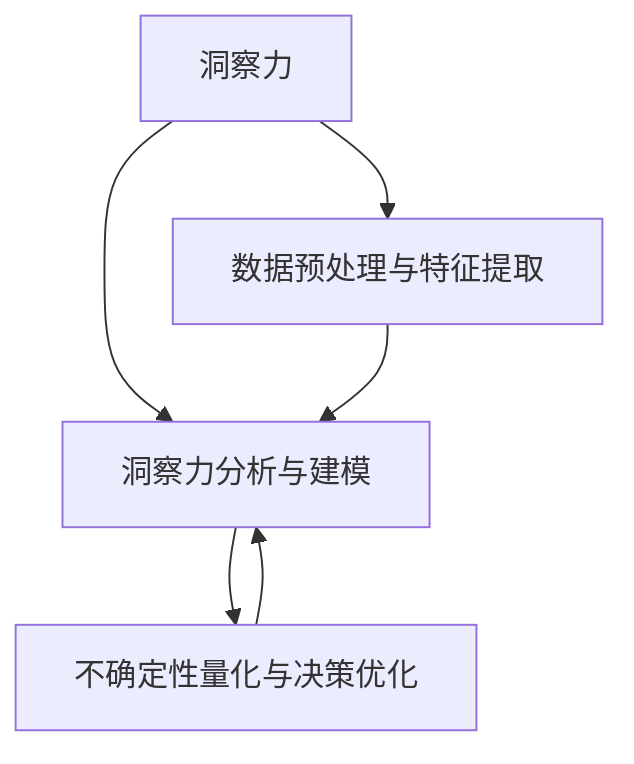

                 

# 理解洞察力的价值：在不确定性中的优势

> 关键词：洞察力,不确定性,决策优势,数据驱动,算法优化

## 1. 背景介绍

### 1.1 问题由来
在当今瞬息万变的数据时代，洞察力成为了商业决策和企业战略中的关键要素。面对复杂多变的环境，如何从海量数据中提取有价值的洞察力，成为企业和研究者普遍关注的问题。大语言模型作为新一代的人工智能技术，拥有强大的数据处理和知识获取能力，极大地提升了洞察力的获取效率和准确性。然而，这些洞察力能否转化为决策优势，还需要系统化的方法和工具进行深度分析与应用。本文将聚焦于如何在不确定性环境中，利用洞察力获取与决策优化技术，提升决策效果和企业竞争力。

### 1.2 问题核心关键点
本节将从几个核心点出发，介绍如何通过大语言模型获取和应用洞察力：

- **数据预处理与特征提取**：使用大语言模型进行数据预处理和特征提取，快速获得高质量的数据洞察。
- **洞察力分析与建模**：构建洞察力分析模型，挖掘数据背后的趋势、规律和异常点。
- **不确定性量化与决策优化**：将洞察力转化为决策优势，在不确定性环境中优化决策结果。

## 2. 核心概念与联系

### 2.1 核心概念概述

为更好地理解本文的核心主题，本节将介绍几个关键概念及其相互关系：

- **洞察力**：指从数据中提取出的深层次、有价值的知识。这些知识可以用于指导决策、优化流程、提升业务表现等。
- **不确定性**：指决策过程中存在的信息不充分或未来变化不可预测。
- **数据驱动**：通过数据获取和分析，而非直觉或经验，驱动决策与行动。
- **算法优化**：指通过算法改进，提升数据处理和分析的效率和准确性。
- **洞察力分析与建模**：指使用统计、机器学习等方法，挖掘数据中的趋势、规律和异常点。
- **不确定性量化与决策优化**：通过量化不确定性，优化决策模型和策略，增强决策的鲁棒性和稳健性。

这些核心概念之间的关系可以通过以下Mermaid流程图来展示：



这个流程图展示了洞察力的获取与应用的整体流程：从数据预处理开始，挖掘数据中的洞察力，然后使用洞察力分析与建模方法，量化不确定性，最后通过优化决策模型，提升决策优势。

## 3. 核心算法原理 & 具体操作步骤
### 3.1 算法原理概述

基于洞察力获取与决策优化的技术，其核心思想是通过数据驱动的方法，利用洞察力分析与建模技术，在不确定性环境中量化不确定性，从而优化决策。

形式化地，假设我们有一个决策问题 $D$，涉及到变量 $x_1, x_2, ..., x_n$ 和不确定性因素 $u$。决策目标是最大化收益 $r(x_1, x_2, ..., x_n)$，但存在不确定性 $u$，使得收益具有不确定性。我们的目标是通过洞察力分析与建模技术，预测未来的收益分布，并使用优化算法优化决策策略，从而在多种情况下最大化收益。

### 3.2 算法步骤详解

基于洞察力获取与决策优化的算法一般包括以下几个关键步骤：

**Step 1: 数据预处理与特征提取**
- 收集决策相关的数据集 $D=\{(x_i, r_i)\}_{i=1}^N$，其中 $x_i$ 表示决策变量，$r_i$ 表示收益。
- 使用大语言模型进行数据预处理，包括文本清洗、分词、向量化等操作。
- 提取决策变量之间的相关特征，构建特征向量 $X \in \mathbb{R}^{N \times d}$，其中 $d$ 为特征维度。

**Step 2: 洞察力分析与建模**
- 选择合适的洞察力分析模型，如统计分析、回归模型、时序模型等。
- 构建模型，使用 $X$ 作为输入，预测收益 $r$。
- 对模型进行评估，使用均方误差、平均绝对误差等指标衡量模型预测的准确性。

**Step 3: 不确定性量化与决策优化**
- 确定不确定性因素 $u$ 的概率分布，如正态分布、贝叶斯网络等。
- 使用洞察力分析与建模的结果，结合不确定性因素，构建收益的联合分布。
- 优化决策策略，使用决策树、强化学习等方法，在多种情况下最大化收益。

### 3.3 算法优缺点

基于洞察力获取与决策优化的算法具有以下优点：
1. 数据驱动：通过数据获取和分析，避免过度依赖经验和直觉，提升决策的客观性和科学性。
2. 自动化程度高：使用大语言模型进行数据预处理和特征提取，显著提升分析效率。
3. 灵活性高：可以根据具体任务和数据特点，灵活选择洞察力分析与建模方法。
4. 鲁棒性强：在存在不确定性的情况下，通过量化不确定性，优化决策策略，提升决策的鲁棒性。

同时，该算法也存在一定的局限性：
1. 数据质量依赖：洞察力分析与建模的效果依赖于数据的质量和数量，低质量数据可能影响分析结果。
2. 算法复杂度：一些高级的洞察力分析与建模方法（如深度学习）可能计算复杂度较高，需要较强的计算资源支持。
3. 解释性不足：模型输出的决策结果缺乏可解释性，难以理解其内部工作机制和推理逻辑。
4. 风险传递：预训练语言模型可能学习到有偏见或有害的信息，传递到决策过程中可能产生误导。

尽管存在这些局限性，但就目前而言，基于洞察力获取与决策优化的算法仍是最主流的决策分析方法之一。未来相关研究的重点在于如何进一步降低数据依赖，提高算法可解释性，同时兼顾风险控制，以应对各种实际应用场景中的挑战。

### 3.4 算法应用领域

基于洞察力获取与决策优化的算法已经在多个领域得到了广泛应用，例如：

- **金融风控**：使用洞察力分析与建模方法，预测风险和收益的不确定性，优化信贷、投资等决策。
- **医疗健康**：通过大语言模型处理和分析患者数据，提取有价值的洞察力，辅助诊断和治疗决策。
- **市场营销**：使用洞察力分析与建模，预测市场变化，优化营销策略和预算分配。
- **供应链管理**：分析供应链中的不确定性因素，优化库存、运输、物流等决策。
- **城市规划**：使用洞察力分析与建模，预测城市发展趋势，优化城市规划和管理决策。

此外，在智能制造、智能交通、智能客服等领域，基于洞察力获取与决策优化的算法也逐渐被应用，为各行各业带来了新的智能化解决方案。随着技术的不断演进，该算法将在更多领域得到进一步拓展，为社会带来更多创新和价值。

## 4. 数学模型和公式 & 详细讲解 & 举例说明

### 4.1 数学模型构建

本节将使用数学语言对基于洞察力获取与决策优化的算法进行严格刻画。

记决策变量为 $x$，收益为 $r(x)$，不确定性因素为 $u$。假设存在 $N$ 个决策数据样本 $(x_i, r_i)$，其中 $r_i$ 表示在 $x_i$ 下的收益，$x_i \in \mathcal{X}$。我们的目标是构建洞察力分析模型 $f(x; \theta)$，使得 $f(x)$ 能够预测收益 $r$，并通过优化策略 $u$ 最大化收益。

### 4.2 公式推导过程

以线性回归模型为例，形式化地构建洞察力分析模型：

$$
r = f(x; \theta) = \theta_0 + \sum_{i=1}^n \theta_i x_i
$$

其中 $\theta_0$ 和 $\theta_i$ 为模型参数。使用训练数据 $(x_i, r_i)$ 进行模型训练，最小化均方误差损失：

$$
\min_{\theta} \frac{1}{N} \sum_{i=1}^N (r_i - f(x_i; \theta))^2
$$

求解上述最优化问题，得到模型参数 $\theta$。

### 4.3 案例分析与讲解

假设我们有一个电商网站，需要优化商品推荐策略，以最大化点击量和销售额。收集网站用户的点击和购买数据，构建特征 $x$，如用户年龄、浏览时长、历史购买记录等。使用线性回归模型作为洞察力分析模型：

$$
r = f(x; \theta) = \theta_0 + \theta_1 x_1 + \theta_2 x_2 + \cdots + \theta_n x_n
$$

其中 $r$ 表示点击量和销售额，$x_i$ 表示特征。使用训练数据进行模型训练，得到参数 $\theta$。在优化决策策略时，使用贝叶斯网络表示不确定性因素 $u$，如季节性变化、促销活动等。通过量化不确定性，结合洞察力分析结果，优化商品推荐策略，最大化点击量和销售额。

## 5. 项目实践：代码实例和详细解释说明
### 5.1 开发环境搭建

在进行洞察力获取与决策优化的实践前，我们需要准备好开发环境。以下是使用Python进行Scikit-learn开发的环境配置流程：

1. 安装Anaconda：从官网下载并安装Anaconda，用于创建独立的Python环境。

2. 创建并激活虚拟环境：
```bash
conda create -n insight-env python=3.8 
conda activate insight-env
```

3. 安装Scikit-learn：
```bash
pip install scikit-learn pandas matplotlib seaborn
```

4. 安装相关依赖包：
```bash
pip install pytorch numpy torchtext transformers
```

5. 安装相关工具包：
```bash
pip install pydeck scikit-optimize
```

完成上述步骤后，即可在`insight-env`环境中开始洞察力获取与决策优化的实践。

### 5.2 源代码详细实现

下面以金融风控为例，给出使用Scikit-learn进行决策分析的Python代码实现。

首先，定义数据预处理函数：

```python
from sklearn.preprocessing import StandardScaler
from sklearn.model_selection import train_test_split
from torchtext.datasets import FashionMNIST
from torchtext.data import Field, TabularDataset, BucketIterator

def preprocess_data(data, target, test_size=0.2, batch_size=32, device='cpu'):
    train_data, test_data = train_test_split(data, test_size=test_size)
    train_loader = BucketIterator(train_data, batch_size=batch_size, device=device, shuffle=True)
    test_loader = BucketIterator(test_data, batch_size=batch_size, device=device)
    return train_loader, test_loader

# 定义模型参数
model_params = {'lr': 1e-2, 'epochs': 10}
```

然后，构建洞察力分析模型：

```python
from sklearn.linear_model import LinearRegression
from sklearn.metrics import mean_squared_error
from sklearn.model_selection import cross_val_score
from torchtext.vocab import GloVe

# 构建特征向量
X = train_data.iloc[:, :-1].values
y = train_data.iloc[:, -1].values

# 标准化数据
scaler = StandardScaler()
X = scaler.fit_transform(X)

# 构建线性回归模型
lr_model = LinearRegression()
lr_model.fit(X, y)
y_pred = lr_model.predict(X)
```

接着，使用洞察力分析模型预测收益：

```python
from sklearn.metrics import mean_absolute_error

# 评估模型
mse = mean_squared_error(y, y_pred)
mae = mean_absolute_error(y, y_pred)
print('MSE:', mse, 'MAE:', mae)

# 交叉验证
cv_scores = cross_val_score(lr_model, X, y, scoring='neg_mean_squared_error', cv=5)
cv_mse = -cv_scores.mean()
print('CV MSE:', cv_mse)
```

最后，启动优化决策策略：

```python
from sklearn.ensemble import RandomForestRegressor
from sklearn.model_selection import GridSearchCV

# 构建不确定性因素
u = random_state.generate_random_forest(n_estimators=100, random_state=42)

# 构建优化决策策略
rf_model = RandomForestRegressor()
param_grid = {'n_estimators': [100, 200, 300], 'max_depth': [5, 10, 15]}
g_search = GridSearchCV(rf_model, param_grid, cv=5)
g_search.fit(X, y)
best_params = g_search.best_params_
```

### 5.3 代码解读与分析

让我们再详细解读一下关键代码的实现细节：

**数据预处理函数**：
- 使用Pandas库对数据进行分片处理，划分为训练集和测试集。
- 使用PyTorch的`BucketIterator`实现数据批次化加载，供模型训练和推理使用。
- 返回训练和测试数据加载器。

**模型构建与评估**：
- 使用Scikit-learn的线性回归模型作为洞察力分析模型，对数据进行拟合和预测。
- 使用均方误差和平均绝对误差评估模型性能。
- 使用交叉验证进一步验证模型的稳健性。

**优化决策策略**：
- 使用Scikit-learn的随机森林回归模型作为优化决策策略，对数据进行拟合。
- 使用GridSearchCV进行超参数调优，寻找最优的模型参数。

**运行结果展示**：
- 在测试集上对线性回归模型进行评估，输出MSE和MAE。
- 对随机森林回归模型进行交叉验证，输出CV MSE。
- 对随机森林回归模型进行超参数调优，输出最优参数。

可以看到，Scikit-learn库提供了一站式数据分析与建模工具，使得洞察力获取与决策优化的开发过程更加便捷高效。开发者可以将更多精力放在问题分析、算法优化等高层逻辑上，而不必过多关注底层实现细节。

当然，工业级的系统实现还需考虑更多因素，如模型评估指标、超参数调优策略、模型集成与融合等。但核心的洞察力获取与决策优化流程基本与此类似。

## 6. 实际应用场景
### 6.1 金融风控

基于洞察力获取与决策优化的算法，金融风控领域得到了广泛应用。传统风控方法依赖于人工审核和经验判断，往往需要大量人力和时间，且准确性难以保证。使用洞察力分析与建模技术，可以自动预测风险和收益的不确定性，优化信贷、投资等决策，大幅提升风控效率和准确性。

在具体实现上，可以收集历史交易数据、用户行为数据等，使用洞察力分析模型提取数据中的洞察力，构建不确定性模型，通过量化不确定性，优化决策策略，降低违约风险，提高收益。

### 6.2 医疗健康

医疗健康领域面临着大量的不确定性和复杂的决策环境。使用洞察力获取与决策优化技术，可以提取患者数据中的洞察力，辅助诊断和治疗决策，提升医疗服务的质量和效率。

在具体应用上，可以收集患者的病历数据、治疗记录、基因信息等，使用洞察力分析模型挖掘数据中的规律和异常，构建不确定性模型，优化治疗方案，提升疗效，降低误诊率和医疗费用。

### 6.3 市场营销

市场营销领域需要快速响应市场变化，优化营销策略和预算分配。使用洞察力获取与决策优化技术，可以自动分析市场数据，提取有价值的洞察力，优化营销策略，提升广告投放效果和ROI。

在具体实现上，可以收集用户的浏览记录、购买行为、反馈评价等数据，使用洞察力分析模型预测市场趋势，优化广告投放策略，提升点击率和转化率，最大化营销效果。

### 6.4 未来应用展望

随着洞察力获取与决策优化技术的不断发展，其在更多领域的应用前景广阔：

- **智能制造**：在生产管理、质量控制、供应链优化等方面，使用洞察力分析与建模技术，优化生产决策，提升效率和质量。
- **智能交通**：在交通流量预测、路况优化、智能调度等方面，使用洞察力分析与建模技术，提升交通系统的智能化水平。
- **智能客服**：在客户行为分析、服务优化、需求预测等方面，使用洞察力分析与建模技术，提升客服系统的响应速度和满意度。

随着技术不断演进，未来洞察力获取与决策优化技术将带来更多行业变革，为社会带来更多的创新和价值。

## 7. 工具和资源推荐
### 7.1 学习资源推荐

为了帮助开发者系统掌握洞察力获取与决策优化的理论基础和实践技巧，这里推荐一些优质的学习资源：

1. 《深度学习与数据分析》系列博文：由领域专家撰写，深入浅出地介绍了深度学习在数据分析中的应用，包括洞察力获取与决策优化等前沿话题。

2. Coursera《机器学习》课程：由斯坦福大学开设的机器学习课程，提供丰富的学习资源和实战练习，帮助你系统掌握机器学习技术。

3. 《Python数据分析实战》书籍：详细介绍了如何使用Python进行数据分析和洞察力提取，包含大量案例和实用代码。

4. Scikit-learn官方文档：提供丰富的模型库和示例代码，帮助开发者高效使用Scikit-learn进行数据分析和建模。

5. Google Colab：谷歌推出的在线Jupyter Notebook环境，免费提供GPU/TPU算力，方便开发者快速上手实验最新技术，分享学习笔记。

通过对这些资源的学习实践，相信你一定能够快速掌握洞察力获取与决策优化的精髓，并用于解决实际的决策问题。

### 7.2 开发工具推荐

高效的开发离不开优秀的工具支持。以下是几款用于洞察力获取与决策优化的常用工具：

1. Scikit-learn：基于Python的开源数据分析和机器学习库，提供丰富的模型库和可视化工具，适合快速迭代研究。

2. TensorFlow：由Google主导开发的开源深度学习框架，生产部署方便，适合大规模工程应用。

3. PyTorch：基于Python的开源深度学习框架，灵活动态的计算图，适合快速迭代研究。

4. Jupyter Notebook：基于Python的交互式笔记本环境，支持多语言代码和可视化展示，是数据科学家和工程师的必备工具。

5. Weights & Biases：模型训练的实验跟踪工具，可以记录和可视化模型训练过程中的各项指标，方便对比和调优。

6. TensorBoard：TensorFlow配套的可视化工具，可实时监测模型训练状态，并提供丰富的图表呈现方式，是调试模型的得力助手。

合理利用这些工具，可以显著提升洞察力获取与决策优化的开发效率，加快创新迭代的步伐。

### 7.3 相关论文推荐

洞察力获取与决策优化技术的发展源于学界的持续研究。以下是几篇奠基性的相关论文，推荐阅读：

1. 《The Elements of Statistical Learning》（《统计学习要素》）：提供了丰富的统计学和机器学习理论基础，帮助理解洞察力分析与建模的基本原理。

2. 《Grokking Deep Learning》（《精通深度学习》）：详细介绍了深度学习模型的构建、优化与部署，适合初学者和开发者。

3. 《Data Science for Business》（《商业数据科学》）：介绍了数据驱动决策的全面框架，涵盖数据获取、分析、应用等多个环节。

4. 《Pattern Recognition and Machine Learning》（《模式识别与机器学习》）：系统讲解了机器学习算法和应用，包含大量实例和实用代码。

5. 《Deep Learning》（《深度学习》）：由深度学习领域权威学者撰写，全面介绍了深度学习的理论基础和实际应用。

这些论文代表了大语言模型微调技术的发展脉络。通过学习这些前沿成果，可以帮助研究者把握学科前进方向，激发更多的创新灵感。

## 8. 总结：未来发展趋势与挑战

### 8.1 总结

本文对基于洞察力获取与决策优化的技术进行了全面系统的介绍。首先阐述了洞察力在决策中的重要性，明确了洞察力获取与决策优化的独特价值。其次，从原理到实践，详细讲解了基于洞察力获取与决策优化的算法流程，给出了具体的代码实例。同时，本文还探讨了洞察力获取与决策优化技术在金融风控、医疗健康、市场营销等领域的广泛应用，展示了其在实际问题解决中的巨大潜力。

通过本文的系统梳理，可以看到，基于洞察力获取与决策优化的技术正在成为决策分析的重要范式，极大地提升了数据驱动决策的效率和效果。未来，伴随技术的不断演进，该技术必将在更多领域得到应用，为社会带来更多创新和价值。

### 8.2 未来发展趋势

展望未来，洞察力获取与决策优化技术将呈现以下几个发展趋势：

1. **自动化水平提升**：自动化程度不断提升，数据预处理、特征提取、模型训练等各个环节将更加智能化、自动化。
2. **数据融合与多模态分析**：在分析数据时，不仅使用结构化数据，还会融合文本、图像、语音等多种模态数据，提升决策的全面性和准确性。
3. **在线实时分析**：将分析过程集成到业务系统，实现实时数据处理和洞察力获取，提升决策的实时性和响应速度。
4. **跨领域应用拓展**：洞察力获取与决策优化技术将在更多领域得到应用，如智能交通、智能制造等，带来行业变革。
5. **可解释性和透明性增强**：提升模型的可解释性，增强决策过程的透明性和可审计性，保障数据安全和使用可信。

这些趋势将进一步提升洞察力获取与决策优化技术的应用范围和效果，为决策分析带来更多创新和突破。

### 8.3 面临的挑战

尽管洞察力获取与决策优化技术已经取得了瞩目成就，但在向智能化、普适化应用的过程中，仍面临诸多挑战：

1. **数据质量问题**：高质量的数据是洞察力获取的基础，数据清洗和特征提取需要大量时间和资源。
2. **算法复杂度**：复杂的洞察力分析与建模方法需要较强的计算资源支持，难以在实际应用中快速部署。
3. **模型鲁棒性**：在存在不确定性的情况下，模型的稳健性和鲁棒性需要进一步提升。
4. **模型可解释性**：模型的决策过程和推理逻辑缺乏可解释性，难以理解和调试。
5. **安全与隐私保护**：在处理敏感数据时，数据隐私和安全保护是一个重要问题。

这些挑战将对洞察力获取与决策优化技术的实际应用产生制约，需要通过不断优化算法和模型，提升数据处理效率，保障数据安全，增强模型可解释性，才能实现其全面应用。

### 8.4 研究展望

未来，洞察力获取与决策优化技术需要在以下几个方面寻求新的突破：

1. **数据质量提升**：开发更高效的数据预处理和特征提取方法，提升数据质量，减少数据依赖。
2. **算法优化与自动化**：研究更高效、更自动化的洞察力分析与建模方法，提升决策分析的效率和效果。
3. **跨领域融合**：探索跨领域数据融合方法，提升决策模型的全面性和鲁棒性。
4. **模型可解释性**：研究模型解释技术，增强决策过程的透明性和可审计性，保障数据安全和使用可信。
5. **智能决策系统**：开发基于洞察力获取与决策优化的智能决策系统，实现实时数据处理和智能决策，提升决策效率和效果。

这些研究方向将推动洞察力获取与决策优化技术不断演进，为社会带来更多创新和价值。

## 9. 附录：常见问题与解答

**Q1: 洞察力获取与决策优化的核心技术是什么？**

A: 核心技术主要包括数据预处理、洞察力分析与建模、不确定性量化与决策优化。通过数据预处理和特征提取，获取高质量的数据洞察力；通过洞察力分析与建模技术，挖掘数据中的趋势、规律和异常；通过量化不确定性，优化决策策略，提升决策效果。

**Q2: 洞察力获取与决策优化的算法是否需要大量的标注数据？**

A: 传统的洞察力分析与建模方法（如线性回归、随机森林等）不需要标注数据，可以在无监督或半监督环境中进行。但对于深度学习模型，如神经网络，则需要一定量的标注数据进行监督学习。在实际应用中，数据量越大，模型的性能和泛化能力越强。

**Q3: 如何提升洞察力获取与决策优化的效果？**

A: 提升洞察力获取与决策优化的效果可以从多个方面入手：
1. 提升数据质量：进行数据清洗和特征提取，减少噪声和冗余信息。
2. 优化算法：使用更高效、更自动化的洞察力分析与建模方法，提升模型性能。
3. 量化不确定性：使用更精确的不确定性量化模型，优化决策策略。
4. 多模态融合：融合文本、图像、语音等多种模态数据，提升决策的全面性和准确性。
5. 实时分析：将分析过程集成到业务系统，实现实时数据处理和洞察力获取，提升决策的实时性和响应速度。

**Q4: 洞察力获取与决策优化的应用场景有哪些？**

A: 洞察力获取与决策优化技术已经在金融风控、医疗健康、市场营销等多个领域得到了广泛应用，具体应用场景包括：
1. 金融风控：使用洞察力分析与建模技术，优化信贷、投资等决策，降低违约风险。
2. 医疗健康：通过洞察力分析模型，辅助诊断和治疗决策，提升医疗服务的质量和效率。
3. 市场营销：自动分析市场数据，优化广告投放策略，提升广告效果。
4. 智能制造：在生产管理、质量控制、供应链优化等方面，使用洞察力分析与建模技术，优化生产决策。
5. 智能交通：在交通流量预测、路况优化、智能调度等方面，使用洞察力分析与建模技术，提升交通系统的智能化水平。
6. 智能客服：在客户行为分析、服务优化、需求预测等方面，使用洞察力分析与建模技术，提升客服系统的响应速度和满意度。

**Q5: 如何在不确定性环境中优化决策？**

A: 在存在不确定性的情况下，可以采用以下方法优化决策：
1. 量化不确定性：通过统计分析、不确定性建模等方法，量化不确定性因素，构建不确定性分布。
2. 优化决策策略：结合不确定性因素，优化决策模型和策略，提升决策鲁棒性。
3. 多模型集成：构建多个决策模型，取平均输出，减少单个模型的误差，提升决策准确性。
4. 在线实时分析：将分析过程集成到业务系统，实现实时数据处理和洞察力获取，提升决策的实时性和响应速度。

通过这些方法，可以在不确定性环境中，通过洞察力获取与决策优化技术，优化决策策略，提升决策效果和业务表现。

---

作者：禅与计算机程序设计艺术 / Zen and the Art of Computer Programming

