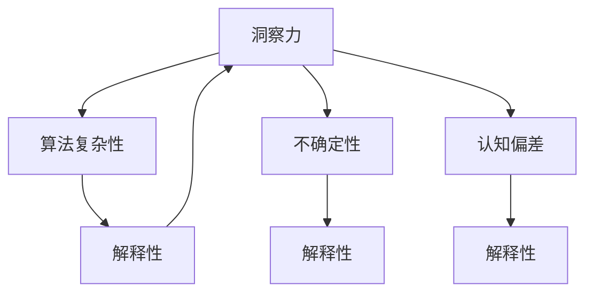

                 

# 理解洞察力的局限：承认复杂性和不确定因素

> 关键词：洞察力，复杂性，不确定性，算法局限性，认知偏差

## 1. 背景介绍

在人工智能领域，洞察力（Insight）指的是从数据中提取有用信息并理解其背后的含义。无论是机器学习模型、深度学习模型，还是自然语言处理系统，洞察力都是其核心竞争力所在。但随着技术的发展，我们也逐渐意识到，即使是强大的人工智能系统，其洞察力也并非完美无缺。理解洞察力的局限，是实现精确、可靠AI的必要前提。

本文将详细探讨洞察力的局限性，剖析算法复杂性和不确定性，从而帮助从业者更好地设计和使用AI系统，进一步提升其实际应用效能。

## 2. 核心概念与联系

### 2.1 核心概念概述

为更深入地理解洞察力的局限，本节将介绍几个关键概念及其相互关系：

- **洞察力（Insight）**：指从数据中获取有价值的知识或理解。是AI系统进行决策和预测的基础。
- **算法复杂性（Algorithmic Complexity）**：描述算法解决问题所需的时间和空间资源。算法越复杂，所需资源越多。
- **不确定性（Uncertainty）**：指由于数据噪声、模型偏见、环境变化等不确定因素，导致算法输出可能与实际情况不符。
- **认知偏差（Cognitive Bias）**：指人类和机器在进行判断和决策时，由于先入为主的观念或心理机制产生的错误。
- **解释性（Explainability）**：指AI系统输出的结果可以被人理解，解释其背后的原因和过程。

这些概念通过一个简单的Mermaid流程图（忽略括号、逗号等特殊字符）呈现它们之间的关系：



这个流程图展示了洞察力与算法复杂性、不确定性、认知偏差之间的双向联系，以及解释性在其中的关键作用。

### 2.2 核心概念原理和架构

#### 2.2.1 洞察力

洞察力来源于模型对数据的处理与分析能力。模型通过训练，学习数据的规律和模式，从而实现对未知数据的预测和决策。常见的方法包括监督学习、无监督学习、强化学习等。

- **监督学习**：使用带有标签的数据进行训练，模型学习输入与标签之间的关系。如线性回归、逻辑回归、支持向量机等。
- **无监督学习**：不使用标签数据，模型通过自学习，识别数据中的模式和结构。如聚类、降维、异常检测等。
- **强化学习**：通过与环境的交互，模型学习最优决策策略。如Q-learning、策略梯度等。

#### 2.2.2 算法复杂性

算法复杂性涉及算法所需的时间和空间资源，包括：

- **时间复杂度（Time Complexity）**：表示算法运行时间与问题规模的关系。常用大O符号表示。
- **空间复杂度（Space Complexity）**：表示算法运行所需的内存空间与问题规模的关系。

#### 2.2.3 不确定性

不确定性源于多个方面：

- **数据噪声**：数据采集或处理过程中引入的误差，如传感器噪音、测量误差等。
- **模型偏见**：模型训练数据的选择性偏差，导致模型对某些类型的数据过于敏感。
- **环境变化**：模型应用环境的变化，如市场趋势、社会事件等，导致模型输出与实际情况不符。

#### 2.2.4 认知偏差

认知偏差反映了人类和机器在信息处理中的错误倾向。常见的认知偏差包括：

- **确认偏误**：倾向于只关注支持自己假设的信息。
- **后见之明偏误**：倾向于低估偶然事件的影响。
- **自利偏误**：倾向于夸大自己的作用和决策的正确性。

## 3. 核心算法原理 & 具体操作步骤

### 3.1 算法原理概述

洞察力的获取，离不开算法的核心原理和操作步骤。本节将详细解析这一点，帮助理解洞察力的本质。

#### 3.1.1 算法原理概述

洞察力的获取主要依赖于数据处理和模型训练：

1. **数据预处理**：数据清洗、特征提取、标准化等步骤，确保数据质量。
2. **模型训练**：选择合适的模型架构，利用训练数据进行参数优化，学习数据规律。
3. **模型评估**：通过验证集和测试集评估模型性能，确保模型泛化良好。
4. **模型微调**：根据实际需求，调整模型参数或架构，提高模型适应性。

#### 3.1.2 算法步骤详解

算法步骤通常包括以下几个环节：

1. **数据采集与准备**：收集相关数据，并进行预处理，包括去重、降噪、标注等。
2. **模型选择与设计**：选择合适的算法模型，并进行结构设计。
3. **训练与优化**：使用训练数据进行模型训练，利用优化算法调整模型参数。
4. **验证与调整**：在验证集上评估模型效果，必要时进行微调。
5. **测试与部署**：在测试集上进一步评估模型性能，部署至实际应用。

### 3.3 算法优缺点

#### 3.3.1 算法优点

洞察力获取算法具备以下优点：

- **高效性**：算法通过自动学习数据规律，极大地提升了数据处理效率。
- **可解释性**：通过解释性方法，理解模型输出背后的原因和过程。
- **灵活性**：不同算法适用于不同类型的数据和任务，具有较强的适应能力。

#### 3.3.2 算法缺点

算法也存在以下局限：

- **复杂度**：一些复杂算法需要大量计算资源和时间，限制了其应用范围。
- **解释性**：部分算法如深度学习，由于其黑盒特性，难以解释模型决策过程。
- **数据依赖**：算法性能依赖于数据质量和数量，数据偏差可能影响模型效果。
- **不确定性**：在复杂和不确定环境中，算法的准确性可能下降。

### 3.4 算法应用领域

洞察力获取算法广泛应用于多个领域：

- **金融分析**：通过数据分析，预测市场趋势，指导投资决策。
- **医疗诊断**：利用患者数据，辅助医生进行疾病诊断和治疗。
- **自然语言处理**：通过文本分析，提取有用信息，如情感分析、实体识别等。
- **推荐系统**：通过用户行为数据，推荐个性化的商品和服务。
- **智能客服**：通过分析用户对话，提供精准的咨询服务。

## 4. 数学模型和公式 & 详细讲解 & 举例说明

### 4.1 数学模型构建

洞察力获取算法的数学模型构建，主要包括以下步骤：

1. **定义输入变量**：输入变量为待处理的数据集。
2. **定义输出变量**：输出变量为目标值或结果，如分类标签、回归值等。
3. **定义损失函数**：损失函数衡量模型输出与实际值之间的差异。
4. **定义优化目标**：优化目标通常为最小化损失函数。
5. **定义优化算法**：优化算法如梯度下降、Adam等，用于调整模型参数。

#### 4.1.1 数学模型示例

以线性回归为例，其数学模型构建如下：

$$
y = \theta_0 + \theta_1 x_1 + \theta_2 x_2 + \cdots + \theta_n x_n
$$

其中，$y$ 为目标值，$\theta_0$ 为截距，$\theta_1, \theta_2, \cdots, \theta_n$ 为回归系数，$x_1, x_2, \cdots, x_n$ 为输入变量。

### 4.2 公式推导过程

线性回归的公式推导如下：

1. **最小二乘法**：计算残差平方和，求解回归系数。
2. **梯度下降法**：通过反向传播，更新模型参数，最小化损失函数。

#### 4.2.1 公式推导示例

线性回归的损失函数为均方误差（Mean Squared Error, MSE）：

$$
\text{MSE} = \frac{1}{N} \sum_{i=1}^N (y_i - \hat{y_i})^2
$$

其中，$y_i$ 为实际值，$\hat{y_i}$ 为模型预测值，$N$ 为样本数量。

推导过程如下：

$$
\frac{\partial \text{MSE}}{\partial \theta_j} = \frac{-2}{N} \sum_{i=1}^N (y_i - \hat{y_i})x_{ij}
$$

利用梯度下降法，模型参数的更新公式为：

$$
\theta_j = \theta_j - \eta \frac{\partial \text{MSE}}{\partial \theta_j}
$$

其中，$\eta$ 为学习率。

### 4.3 案例分析与讲解

#### 4.3.1 案例分析

以金融预测为例，假设我们使用线性回归模型进行股票价格预测。

1. **数据准备**：收集历史股票价格数据，并进行预处理。
2. **模型设计**：选择线性回归模型，定义输入变量（如历史价格、市场指数等）。
3. **训练与优化**：使用训练数据进行模型训练，通过梯度下降法调整参数，最小化MSE损失。
4. **验证与调整**：在验证集上评估模型效果，调整模型参数或结构。
5. **测试与部署**：在测试集上进一步评估模型性能，部署至实际应用。

## 5. 项目实践：代码实例和详细解释说明

### 5.1 开发环境搭建

在进行项目实践前，需要搭建好开发环境。以下是在Python环境下使用Scikit-learn库搭建线性回归模型的示例：

1. 安装Anaconda：从官网下载并安装Anaconda，用于创建独立的Python环境。
2. 创建并激活虚拟环境：
```bash
conda create -n myenv python=3.8 
conda activate myenv
```

3. 安装Scikit-learn：
```bash
conda install scikit-learn
```

4. 安装相关依赖：
```bash
conda install numpy pandas matplotlib seaborn
```

5. 导入库并搭建模型：
```python
import pandas as pd
import numpy as np
import matplotlib.pyplot as plt
from sklearn.model_selection import train_test_split
from sklearn.linear_model import LinearRegression
from sklearn.metrics import mean_squared_error

# 读取数据
df = pd.read_csv('data.csv')

# 数据预处理
X = df[['feature_1', 'feature_2', 'feature_3']]
y = df['target']

# 划分数据集
X_train, X_test, y_train, y_test = train_test_split(X, y, test_size=0.2, random_state=42)

# 训练模型
model = LinearRegression()
model.fit(X_train, y_train)

# 预测与评估
y_pred = model.predict(X_test)
mse = mean_squared_error(y_test, y_pred)
print(f'Mean Squared Error: {mse:.2f}')

# 可视化
plt.scatter(y_test, y_pred)
plt.xlabel('True Values')
plt.ylabel('Predictions')
plt.show()
```

### 5.2 源代码详细实现

上述代码详细展示了线性回归模型的训练和评估过程。具体步骤如下：

1. **数据读取与预处理**：使用pandas库读取数据，并进行数据清洗和标准化。
2. **模型训练**：定义线性回归模型，并使用训练数据进行参数优化。
3. **预测与评估**：使用测试数据进行预测，计算MSE损失，评估模型效果。
4. **可视化**：绘制实际值与预测值的散点图，直观展示模型性能。

### 5.3 代码解读与分析

代码中的关键步骤如下：

1. **数据读取与预处理**：通过pandas库读取CSV文件，选择相关特征和目标变量，并进行预处理。
2. **模型训练**：定义线性回归模型，使用训练数据进行模型训练，并设置学习率和迭代次数。
3. **预测与评估**：使用测试数据进行预测，并计算MSE损失，评估模型效果。
4. **可视化**：绘制实际值与预测值的散点图，直观展示模型性能。

## 6. 实际应用场景

### 6.1 金融分析

金融分析是洞察力获取算法的重要应用场景之一。通过历史数据，模型可以预测股票价格、市场趋势等，辅助投资决策。

#### 6.1.1 案例分析

以股票价格预测为例，假设我们有一组历史股票价格数据，希望使用线性回归模型进行预测。

1. **数据准备**：收集历史股票价格数据，并进行预处理。
2. **模型设计**：选择线性回归模型，定义输入变量（如历史价格、市场指数等）。
3. **训练与优化**：使用训练数据进行模型训练，通过梯度下降法调整参数，最小化MSE损失。
4. **验证与调整**：在验证集上评估模型效果，调整模型参数或结构。
5. **测试与部署**：在测试集上进一步评估模型性能，部署至实际应用。

### 6.2 医疗诊断

医疗诊断是另一个洞察力获取算法的重要应用场景。通过患者数据，模型可以辅助医生进行疾病诊断和治疗。

#### 6.2.1 案例分析

以癌症诊断为例，假设我们有一组患者数据，希望使用机器学习模型进行癌症诊断。

1. **数据准备**：收集患者数据，并进行预处理，选择相关特征和标签。
2. **模型设计**：选择分类算法（如决策树、支持向量机等），并进行模型训练。
3. **训练与优化**：使用训练数据进行模型训练，通过优化算法调整模型参数，最小化损失函数。
4. **验证与调整**：在验证集上评估模型效果，调整模型参数或结构。
5. **测试与部署**：在测试集上进一步评估模型性能，部署至实际应用。

## 7. 工具和资源推荐

### 7.1 学习资源推荐

为了深入理解洞察力的局限性，并掌握如何克服这些局限，以下是一些推荐的资源：

1. **《统计学习基础》**：该书系统介绍了机器学习算法的基本原理和实现方法，是入门级必读。
2. **《深度学习》**：斯坦福大学Andrew Ng教授的在线课程，介绍了深度学习的基本概念和常用算法。
3. **《Python机器学习》**：使用Python实现机器学习算法的经典书籍，适合实战练习。
4. **Kaggle**：一个数据科学竞赛平台，可以参与实际项目，积累经验和实践能力。
5. **Coursera**：提供各类机器学习和深度学习课程，涵盖从入门到高级的各种主题。

### 7.2 开发工具推荐

使用适当的开发工具，可以显著提高洞察力获取算法的开发效率。以下是一些推荐的工具：

1. **Jupyter Notebook**：一个交互式的编程环境，适合数据分析和机器学习实验。
2. **Google Colab**：一个基于Jupyter Notebook的在线平台，免费提供GPU/TPU资源，适合高性能计算。
3. **PyTorch**：一个灵活的深度学习框架，支持GPU加速，适合动态图计算。
4. **TensorFlow**：由Google主导的深度学习框架，支持分布式计算，适合大规模部署。
5. **Scikit-learn**：一个强大的机器学习库，提供多种算法实现和工具支持。

### 7.3 相关论文推荐

为了深入理解洞察力的局限性，以下是一些推荐的相关论文：

1. **《机器学习基础》**：详细介绍了机器学习算法的理论基础和实现方法。
2. **《深度学习理论与实践》**：介绍了深度学习算法的基本原理和实践技巧。
3. **《解释性机器学习》**：探讨了如何提高机器学习模型的可解释性。
4. **《认知偏差与决策》**：研究了认知偏差对人类和机器决策的影响。

## 8. 总结：未来发展趋势与挑战

### 8.1 研究成果总结

本文对洞察力的局限性进行了全面分析，并探讨了算法复杂性、不确定性和认知偏差对AI系统的影响。通过案例分析和代码实例，帮助读者更好地理解洞察力的本质和获取过程。

### 8.2 未来发展趋势

未来洞察力获取算法的发展趋势包括以下几个方面：

1. **模型复杂度降低**：随着算法的不断优化，模型复杂度有望进一步降低，减少对计算资源的需求。
2. **解释性增强**：通过更好的解释性方法，提高模型的透明性和可解释性，增强用户信任。
3. **数据质量提升**：通过数据清洗和预处理，提高数据质量，减少数据偏差对模型效果的影响。
4. **不确定性控制**：通过引入更多先验知识和优化算法，提高模型在复杂和不确定环境中的表现。
5. **跨领域应用**：洞察力获取算法将在更多领域得到应用，如智慧医疗、智能交通等。

### 8.3 面临的挑战

尽管洞察力获取算法在许多领域取得了显著成果，但未来仍面临诸多挑战：

1. **数据质量问题**：数据偏差、缺失、噪声等问题，可能导致模型性能下降。
2. **算法复杂性**：部分复杂算法需要大量计算资源，限制了其应用范围。
3. **认知偏差**：人类和机器的认知偏差可能导致决策错误，影响模型效果。
4. **模型可解释性**：复杂模型如深度学习，其决策过程难以解释，可能导致用户信任度降低。
5. **算法鲁棒性**：模型在面对新数据和复杂环境时，可能出现灾难性遗忘，影响性能。

### 8.4 研究展望

未来研究应聚焦于以下几方面：

1. **数据增强技术**：通过数据增强方法，提升数据质量和多样性，减少数据偏差。
2. **模型压缩技术**：通过模型压缩和剪枝，降低模型复杂度，减少计算资源消耗。
3. **认知偏差分析**：研究人类和机器的认知偏差，设计更合理的模型架构和训练策略。
4. **跨领域应用研究**：研究跨领域应用场景，开发通用的洞察力获取算法。
5. **可解释性研究**：研究可解释性方法，提高模型的透明性和用户信任度。

## 9. 附录：常见问题与解答

**Q1: 如何提高模型在复杂环境下的鲁棒性？**

A: 提高模型鲁棒性的方法包括：

1. **数据增强**：通过数据增强方法，提升数据质量，减少数据偏差。
2. **正则化技术**：使用L2正则、Dropout等方法，防止过拟合。
3. **对抗训练**：引入对抗样本，提高模型鲁棒性。
4. **迁移学习**：在多个任务间进行迁移学习，增强模型的泛化能力。
5. **模型集成**：通过模型集成，提高模型的稳定性和鲁棒性。

**Q2: 如何提高模型的可解释性？**

A: 提高模型可解释性的方法包括：

1. **特征重要性分析**：通过特征重要性分析，理解模型对每个特征的依赖程度。
2. **模型可视化**：使用可视化工具，如t-SNE、LIME等，理解模型的决策过程。
3. **因果分析**：通过因果推断方法，理解模型决策背后的因果关系。
4. **符号化表示**：通过符号化表示，减少模型的黑盒特性，增强可解释性。

**Q3: 数据偏差对模型效果有什么影响？**

A: 数据偏差可能导致模型性能下降，主要体现在以下几个方面：

1. **偏差放大**：数据偏差可能导致模型对某些类型的数据过于敏感，影响模型泛化能力。
2. **模型偏见**：数据偏差可能导致模型学习到错误的规律，导致决策错误。
3. **数据不平衡**：数据偏差可能导致数据分布不平衡，影响模型在不同类别上的表现。

**Q4: 如何在实际应用中实现跨领域应用？**

A: 实现跨领域应用的方法包括：

1. **数据迁移**：通过迁移学习，将模型在不同领域间进行迁移，提升模型泛化能力。
2. **多任务学习**：通过多任务学习，让模型同时学习多个任务，提升模型在不同任务上的表现。
3. **联合学习**：通过联合学习，让多个模型同时学习，提升模型在多个任务上的表现。

**Q5: 如何应对数据质量问题？**

A: 应对数据质量问题的方法包括：

1. **数据清洗**：通过数据清洗，去除噪声、缺失值等。
2. **数据增强**：通过数据增强，提升数据质量和多样性。
3. **异常检测**：通过异常检测，发现和处理数据异常。
4. **数据标准化**：通过数据标准化，提升数据一致性和可靠性。

---

作者：禅与计算机程序设计艺术 / Zen and the Art of Computer Programming

