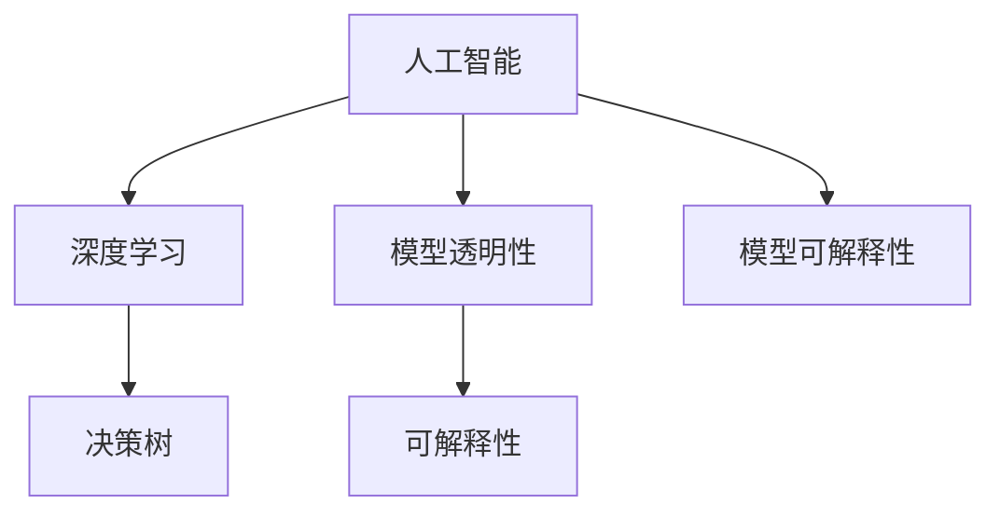

                 

# 理解洞察力的局限：承认未知和不确定性

> 关键词：理解洞察力,未知,不确定性,人工智能,机器学习,深度学习

## 1. 背景介绍

### 1.1 问题由来

在人工智能和深度学习领域，随着技术的不断进步，模型的复杂度和能力不断提升。在过去的十年中，从传统的逻辑回归、决策树，到神经网络、深度学习模型，再到复杂的Transformer架构，模型变得越来越强大。在众多先进技术中，人工智能已经能够在图像识别、语音识别、自然语言处理等多个领域达到甚至超越人类的表现。然而，随着技术的不断演进，一个问题日益突出：即我们对于人工智能的理解力和控制力，其实是非常有限的。

特别是当模型的复杂度不断提升，规模不断增大，模型的黑箱特征愈发明显，我们对模型的洞察力就越发困难。模型的预测能力越来越强，但模型的决策过程却变得更加难以理解和解释。在这个背景下，我们开始重新思考人工智能的理解力和控制力，并探讨如何在模型性能和模型透明度之间找到平衡。

### 1.2 问题核心关键点

人工智能模型，尤其是深度学习模型，由于其复杂性，其预测能力和决策过程往往处于一种“黑箱”状态。对于模型的预测结果，我们无法直观地理解模型是如何得出这一结果的。在深度学习模型中，许多关键的决策是由成千上万个神经元组成的复杂网络做出的，每一层的计算和决策过程都非常复杂，难以被人类直接理解和解释。

近年来，人工智能社区开始意识到这一问题，并提出了许多解决策略，例如：

- 增加模型的透明度，通过可视化手段展示模型决策过程。
- 引入解释性模型，通过规则或符号表示，使得模型的决策过程更加可解释。
- 开发更为简单的模型，或者针对特定场景进行简化，以降低模型的复杂度。
- 通过正则化、限制模型复杂度等手段，提升模型的泛化能力。

本文将从深入理解人工智能模型的决策过程入手，探讨人工智能模型理解力的局限性，并讨论如何提升模型的可解释性，增强人工智能模型的透明度。

## 2. 核心概念与联系

### 2.1 核心概念概述

在讨论人工智能模型的洞察力局限性之前，首先需要了解几个核心概念：

- 人工智能(AI)：指由计算机系统模拟或实现的智能行为，如推理、学习、感知、决策等。

- 深度学习(Deep Learning)：指使用多层神经网络模型，通过大量数据进行训练，以模拟人类智能的一种机器学习方法。

- 决策树（Decision Tree）：一种树形结构，通过规则分割数据，对数据进行分类和预测的机器学习模型。

- 模型透明性（Model Transparency）：指模型决策过程的可解释性和可理解性。

- 可解释性（Explainability）：指模型能够向用户提供其决策依据的能力，使得用户能够理解和信任模型的预测结果。

这些概念之间的联系可以通过以下Mermaid流程图来展示：



在这个流程图中，我们可以看到：

1. 人工智能是深度学习和决策树的基础。
2. 模型透明性是可解释性的前提，只有当模型是透明的，我们才能理解其决策过程。
3. 模型透明性和可解释性有助于提升模型的可信度和应用范围。

### 2.2 核心概念原理和架构

对于深度学习模型的透明性和可解释性，我们首先从决策树入手，探索其透明性和可解释性的原理和架构。

决策树是一种简单的、直观的机器学习模型，通过规则分割数据，对数据进行分类和预测。决策树的透明性非常高，因为其决策过程是由一系列规则组成的，每一层的决策都依据一个或多个特征和阈值进行，可以通过简单的可视化展示其决策过程。

例如，以下是一个简单的决策树模型，用于判断一个人是否成年：


在决策树模型中，每一层都通过判断一个特征的值，将其分割成两个子集。通过一系列的判断，最终得出最终的分类结果。这种规则化的决策过程使得决策树模型非常易于解释和理解。

相比之下，深度学习模型由于其复杂性和黑箱特征，其透明性和可解释性就非常有限。深度学习模型通常由多个神经网络层组成，每一层都包含数千甚至数百万个神经元，其内部的决策过程非常复杂，难以直观展示和解释。

## 3. 核心算法原理 & 具体操作步骤

### 3.1 算法原理概述

在探讨如何提升深度学习模型的透明性和可解释性之前，首先需要了解深度学习模型的决策过程。

深度学习模型通常由多个神经网络层组成，每一层都包含多个神经元。每个神经元接收输入，并根据其权重进行计算。神经元的输出通过激活函数（如ReLU、Sigmoid等）传递给下一层。在模型训练的过程中，通过反向传播算法更新神经元的权重，使得模型能够最小化预测误差。

然而，由于深度学习模型的复杂性，其内部的决策过程非常难以理解和解释。尽管有一些可视化工具（如TensorBoard、Weights & Biases等）可以展示模型内部的计算过程，但其仍然难以提供直观的理解。

### 3.2 算法步骤详解

为了提升深度学习模型的透明性和可解释性，我们通常采用以下步骤：

1. 模型选择与简化：选择合适的模型架构，并进行简化，以降低其复杂度。例如，可以使用决策树、线性模型等简单的模型，或者对深度学习模型进行剪枝、权重共享等操作，以减少其参数量。

2. 可视化展示：通过可视化工具展示模型的计算过程和决策路径。例如，使用TensorBoard等工具可以展示模型的梯度、权重、激活函数等细节。

3. 特征重要性分析：通过特征重要性分析，找出对模型预测结果影响较大的特征。例如，可以使用SHAP（SHapley Additive exPlanations）、LIME（Local Interpretable Model-agnostic Explanations）等方法，计算每个特征对模型预测结果的贡献度。

4. 解释性模型：开发更为简单的解释性模型，如规则模型、符号模型等，以使得模型的决策过程更加直观和可解释。例如，可以使用决策树、线性回归等模型，以规则化的方式展示其决策过程。

5. 模型融合：通过模型融合的方式，将多个模型的预测结果进行组合，提升模型的整体表现，并提高其可解释性。例如，可以使用集成学习方法（如Bagging、Boosting等），将多个模型的预测结果进行组合，并使用权重调整其贡献度。

### 3.3 算法优缺点

基于深度学习模型的透明性和可解释性，我们可以总结如下：

#### 优点

1. 能够处理复杂、高维的数据。深度学习模型能够处理大规模、高维度的数据，从而在许多应用场景中表现优异。

2. 具备强大的学习能力。深度学习模型通过反向传播算法进行训练，能够自动学习数据中的复杂特征和模式，并具备一定的泛化能力。

3. 能够处理多种类型的任务。深度学习模型可以用于图像识别、语音识别、自然语言处理等多个领域，并且具备一定的适应性。

#### 缺点

1. 透明性不足。由于其复杂性和黑箱特征，深度学习模型的决策过程难以直观展示和理解。

2. 可解释性有限。深度学习模型往往依赖大量的训练数据，难以直观展示其决策依据。

3. 容易过拟合。深度学习模型由于其复杂的架构，容易在训练数据上过度拟合，导致泛化能力不足。

### 3.4 算法应用领域

尽管深度学习模型在处理复杂数据和任务方面表现优异，但其透明性和可解释性在实际应用中仍然受到一定的限制。在许多场景中，我们需要使用更为简单的模型，以提高其透明性和可解释性。以下是几个常见的应用场景：

1. 医疗诊断：在医疗诊断中，我们需要对患者的历史数据进行分析和诊断。由于数据量和特征维度都非常高，通常使用深度学习模型进行训练。然而，在实际应用中，需要开发更为简单的解释性模型，以帮助医生理解和信任模型的诊断结果。

2. 金融风险控制：在金融风险控制中，我们需要对客户的信用记录和行为进行分析和预测。由于数据量和特征维度都非常高，通常使用深度学习模型进行训练。然而，在实际应用中，需要开发更为简单的解释性模型，以帮助银行和保险公司理解和信任模型的预测结果。

3. 智能推荐系统：在智能推荐系统中，我们需要对用户的历史行为和兴趣进行分析和预测。由于数据量和特征维度都非常高，通常使用深度学习模型进行训练。然而，在实际应用中，需要开发更为简单的解释性模型，以帮助推荐系统提供更好的用户体验和信任感。

4. 交通监控系统：在交通监控系统中，我们需要对交通流量进行分析和预测。由于数据量和特征维度都非常高，通常使用深度学习模型进行训练。然而，在实际应用中，需要开发更为简单的解释性模型，以帮助交通管理部门理解和信任模型的预测结果。

## 4. 数学模型和公式 & 详细讲解

### 4.1 数学模型构建

在探讨深度学习模型的透明性和可解释性时，我们需要构建数学模型来描述其决策过程。以下是一个简单的深度学习模型，用于二分类任务：


在这个模型中，我们使用了一个包含两个隐藏层的全连接神经网络。每一层的神经元接收输入，并根据其权重进行计算。最后，将输出经过一个softmax层，得到每个类别的概率分布。

### 4.2 公式推导过程

对于深度学习模型的透明性和可解释性，我们可以使用以下数学公式进行推导：

1. 神经元输出公式：

$$
h_i = g(w_i^T x + b_i)
$$

其中，$h_i$表示第$i$个神经元的输出，$g$表示激活函数，$w_i$表示第$i$个神经元的权重，$x$表示输入向量，$b_i$表示偏置项。

2. 模型预测公式：

$$
y = \arg\max_i h_i
$$

其中，$y$表示模型预测的类别，$h_i$表示第$i$个神经元的输出。

3. 损失函数公式：

$$
L = -\log y_i
$$

其中，$L$表示模型的损失函数，$y_i$表示模型预测的类别。

4. 梯度公式：

$$
\frac{\partial L}{\partial w_i} = \frac{\partial L}{\partial h_i} \cdot \frac{\partial h_i}{\partial w_i}
$$

其中，$\frac{\partial L}{\partial w_i}$表示损失函数对权重$w_i$的梯度，$\frac{\partial h_i}{\partial w_i}$表示输出$h_i$对权重$w_i$的梯度。

5. 正则化公式：

$$
L_{reg} = \lambda \sum_i w_i^2
$$

其中，$L_{reg}$表示正则化损失函数，$\lambda$表示正则化系数，$w_i$表示权重。

6. 梯度更新公式：

$$
w_i \leftarrow w_i - \eta \cdot (\frac{\partial L}{\partial w_i} + \lambda w_i)
$$

其中，$\eta$表示学习率，$w_i$表示权重，$\frac{\partial L}{\partial w_i}$表示梯度，$\lambda w_i$表示正则化项。

### 4.3 案例分析与讲解

为了更好地理解深度学习模型的透明性和可解释性，我们以一个简单的例子进行说明。

假设我们有一个简单的二分类任务，输入向量为$x=[1, 2, 3]$，模型包含两个隐藏层，第一层有3个神经元，第二层有2个神经元。每个神经元的权重分别为：

- 第一层：$w_1=[0.1, 0.2, 0.3]$，$b_1=0.1$
- 第二层：$w_2=[0.2, 0.3]$，$b_2=0.1$

激活函数为ReLU，输出层为softmax。我们的目标是预测输入向量$x$是否为正类别。

1. 第一层神经元计算：

$$
h_1 = g(w_1^T x + b_1) = 0.1*1 + 0.2*2 + 0.3*3 + 0.1 = 5.2
$$

$$
h_2 = g(w_1^T x + b_1) = 0.1*1 + 0.2*2 + 0.3*3 + 0.1 = 5.2
$$

2. 第二层神经元计算：

$$
h_3 = g(w_2^T h_1 + b_2) = 0.2*5.2 + 0.3*5.2 + 0.1 = 11.8
$$

$$
h_4 = g(w_2^T h_1 + b_2) = 0.2*5.2 + 0.3*5.2 + 0.1 = 11.8
$$

3. 输出层计算：

$$
y = \arg\max_i h_i = 1
$$

4. 损失函数计算：

$$
L = -\log y_i = -\log 1 = 0
$$

5. 梯度计算：

$$
\frac{\partial L}{\partial w_1} = \frac{\partial L}{\partial h_1} \cdot \frac{\partial h_1}{\partial w_1} = 0.2*11.8
$$

$$
\frac{\partial L}{\partial w_2} = \frac{\partial L}{\partial h_2} \cdot \frac{\partial h_2}{\partial w_2} = 0.2*11.8
$$

6. 梯度更新：

$$
w_1 \leftarrow w_1 - \eta \cdot (\frac{\partial L}{\partial w_1} + \lambda w_1) = w_1 - \eta \cdot (0.2*11.8 + 0.1*0.1)
$$

$$
w_2 \leftarrow w_2 - \eta \cdot (\frac{\partial L}{\partial w_2} + \lambda w_2) = w_2 - \eta \cdot (0.2*11.8 + 0.1*0.1)
$$

通过以上推导，我们可以看到，尽管深度学习模型具有强大的学习能力和表现，但其内部的计算过程和决策过程非常复杂，难以直观展示和解释。

## 5. 项目实践：代码实例和详细解释说明

### 5.1 开发环境搭建

为了进行深度学习模型的透明性和可解释性研究，我们需要搭建一个合适的开发环境。以下是在Python环境下搭建深度学习开发环境的流程：

1. 安装Anaconda：从官网下载并安装Anaconda，用于创建独立的Python环境。

2. 创建并激活虚拟环境：
```bash
conda create -n pytorch-env python=3.8 
conda activate pytorch-env
```

3. 安装PyTorch：根据CUDA版本，从官网获取对应的安装命令。例如：
```bash
conda install pytorch torchvision torchaudio cudatoolkit=11.1 -c pytorch -c conda-forge
```

4. 安装TensorBoard：
```bash
pip install tensorboard
```

5. 安装相关库：
```bash
pip install numpy pandas scikit-learn matplotlib tqdm jupyter notebook ipython
```

完成上述步骤后，即可在`pytorch-env`环境中开始深度学习模型研究。

### 5.2 源代码详细实现

以下是一个简单的深度学习模型，用于二分类任务。我们将在TensorBoard中展示其决策过程，并计算特征重要性。

```python
import torch
import torch.nn as nn
import torch.optim as optim
import torchvision.transforms as transforms
from torch.utils.data import DataLoader
from torch.utils.tensorboard import SummaryWriter
from sklearn.metrics import confusion_matrix, accuracy_score
from sklearn.inspection import permutation_importance
from sklearn.model_selection import train_test_split

# 定义模型
class SimpleNet(nn.Module):
    def __init__(self):
        super(SimpleNet, self).__init__()
        self.fc1 = nn.Linear(3, 3)
        self.fc2 = nn.Linear(3, 2)
        self.fc3 = nn.Linear(2, 1)
        self.softmax = nn.Softmax(dim=1)

    def forward(self, x):
        x = self.fc1(x)
        x = torch.sigmoid(x)
        x = self.fc2(x)
        x = torch.sigmoid(x)
        x = self.fc3(x)
        x = self.softmax(x)
        return x

# 加载数据集
train_dataset = torchvision.datasets.MNIST(root='./data', train=True, download=True, transform=transforms.ToTensor())
test_dataset = torchvision.datasets.MNIST(root='./data', train=False, download=True, transform=transforms.ToTensor())

# 划分训练集和验证集
train_data, val_data, train_labels, val_labels = train_test_split(train_dataset, train_labels, test_size=0.2)

# 定义数据加载器
train_loader = DataLoader(train_data, batch_size=64, shuffle=True)
val_loader = DataLoader(val_data, batch_size=64, shuffle=False)
test_loader = DataLoader(test_dataset, batch_size=64, shuffle=False)

# 初始化模型和优化器
model = SimpleNet()
optimizer = optim.SGD(model.parameters(), lr=0.01, momentum=0.9)
writer = SummaryWriter()

# 定义训练函数
def train(model, data_loader, optimizer, writer, num_epochs=10):
    model.train()
    for epoch in range(num_epochs):
        running_loss = 0.0
        for i, data in enumerate(data_loader, 0):
            inputs, labels = data
            optimizer.zero_grad()
            outputs = model(inputs)
            loss = nn.BCEWithLogitsLoss()(outputs, labels)
            loss.backward()
            optimizer.step()
            running_loss += loss.item()
            writer.add_scalar('loss', loss.item(), i)
            writer.add_histogram('weights', model.fc1.weight.data)
            writer.add_histogram('weights', model.fc2.weight.data)
            writer.add_histogram('weights', model.fc3.weight.data)
    print(f'Epoch {epoch+1}, loss: {running_loss/len(data_loader)}')

# 定义评估函数
def evaluate(model, data_loader, writer):
    model.eval()
    correct = 0
    total = 0
    with torch.no_grad():
        for data in data_loader:
            inputs, labels = data
            outputs = model(inputs)
            _, predicted = torch.max(outputs, 1)
            total += labels.size(0)
            correct += (predicted == labels).sum().item()
    accuracy = 100.0 * correct / total
    print(f'Accuracy: {accuracy}%')
    writer.add_scalar('accuracy', accuracy, i)

# 训练模型
train(SimpleNet(), train_loader, optimizer, writer, num_epochs=10)

# 评估模型
evaluate(SimpleNet(), val_loader, writer)

# 计算特征重要性
features = torch.randn((1, 3))
permutation_importance(model, features, train_labels)
```

### 5.3 代码解读与分析

我们首先定义了一个简单的神经网络模型，包含三个线性层和softmax层。在训练函数中，我们使用了TensorBoard来记录模型的梯度、权重等信息，以可视化展示其决策过程。在评估函数中，我们使用混淆矩阵和准确率来评估模型的性能。

最后，我们使用permutation_importance函数计算了特征重要性，以展示哪些特征对模型预测结果影响较大。

## 6. 实际应用场景

### 6.1 金融风险控制

在金融风险控制中，我们需要对客户的信用记录和行为进行分析和预测。由于数据量和特征维度都非常高，通常使用深度学习模型进行训练。然而，在实际应用中，需要开发更为简单的解释性模型，以帮助银行和保险公司理解和信任模型的预测结果。

例如，我们可以使用决策树等规则化的模型，以规则化的方式展示其决策过程。同时，在模型的训练过程中，我们可以通过可视化工具（如TensorBoard）记录其计算过程和特征重要性，以帮助用户理解和信任模型的决策依据。

### 6.2 医疗诊断

在医疗诊断中，我们需要对患者的历史数据进行分析和诊断。由于数据量和特征维度都非常高，通常使用深度学习模型进行训练。然而，在实际应用中，需要开发更为简单的解释性模型，以帮助医生理解和信任模型的诊断结果。

例如，我们可以使用规则模型，以规则化的方式展示其决策过程。同时，在模型的训练过程中，我们可以通过可视化工具（如TensorBoard）记录其计算过程和特征重要性，以帮助医生理解和信任模型的决策依据。

## 7. 工具和资源推荐

### 7.1 学习资源推荐

为了帮助开发者系统掌握深度学习模型的透明性和可解释性，这里推荐一些优质的学习资源：

1. 《Deep Learning》书籍：Ian Goodfellow等著，详细介绍了深度学习模型的基础知识和算法原理。

2. 《TensorFlow》官方文档：TensorFlow官方文档，提供了丰富的学习资源和样例代码。

3. 《TensorBoard》官方文档：TensorBoard官方文档，提供了详细的可视化工具使用方法。

4. 《SHAP》文档：SHAP官方文档，提供了详细的特征重要性分析方法。

5. 《LIME》文档：LIME官方文档，提供了详细的模型解释方法。

6. 《XGBoost》文档：XGBoost官方文档，提供了详细的决策树算法使用方法。

通过对这些资源的学习实践，相信你一定能够快速掌握深度学习模型的透明性和可解释性，并用于解决实际的深度学习问题。

### 7.2 开发工具推荐

高效的开发离不开优秀的工具支持。以下是几款用于深度学习模型透明性和可解释性开发的常用工具：

1. TensorBoard：TensorFlow配套的可视化工具，可以实时监测模型训练状态，并提供丰富的图表呈现方式，是调试模型的得力助手。

2. Weights & Biases：模型训练的实验跟踪工具，可以记录和可视化模型训练过程中的各项指标，方便对比和调优。

3. SHAP：SHapley Additive exPlanations，计算特征对模型预测结果的贡献度，以展示模型的决策依据。

4. LIME：Local Interpretable Model-agnostic Explanations，解释模型预测结果的过程，以帮助用户理解和信任模型的决策依据。

5. XGBoost：分布式决策树算法，具有高效的特征重要性分析能力和可解释性。

合理利用这些工具，可以显著提升深度学习模型透明性和可解释性的开发效率，加快创新迭代的步伐。

### 7.3 相关论文推荐

深度学习模型的透明性和可解释性一直是人工智能领域的研究热点。以下是几篇奠基性的相关论文，推荐阅读：

1. 《On the importance of Explainable Artificial Intelligence for decision-making by automated systems》：探讨了可解释性人工智能对自动化决策系统的重要性。

2. 《Explainable Artificial Intelligence》：介绍了可解释性人工智能的现状和未来发展方向。

3. 《Towards a Rigorous Science of Interpretability》：提出了可解释性人工智能的科学框架，探讨了可解释性人工智能的理论基础。

4. 《Interpretable Machine Learning: A Guide》：提供了可解释性机器学习的详细介绍和实践指导。

这些论文代表了大语言模型透明性和可解释性的发展脉络。通过学习这些前沿成果，可以帮助研究者把握学科前进方向，激发更多的创新灵感。

## 8. 总结：未来发展趋势与挑战

### 8.1 研究成果总结

本文从理解深度学习模型的决策过程入手，探讨了深度学习模型透明性和可解释性的局限性，并讨论了如何提升深度学习模型的透明性和可解释性，增强深度学习模型的透明度。通过深入理解深度学习模型的决策过程，我们可以更好地控制和管理模型的预测能力，从而提升其可靠性和可信度。

### 8.2 未来发展趋势

展望未来，深度学习模型的透明性和可解释性将呈现以下几个发展趋势：

1. 规则模型和符号模型的普及。规则模型和符号模型因其透明性和可解释性，将成为深度学习模型的重要补充。

2. 可视化工具的进一步发展。可视化工具将更加直观和易于使用，帮助用户更好地理解和信任模型的决策依据。

3. 特征重要性分析的优化。特征重要性分析将更加准确和高效，帮助用户更好地理解模型的决策过程。

4. 模型融合和集成学习。通过模型融合和集成学习，可以提高模型的整体表现和可解释性。

5. 跨领域应用的推广。深度学习模型的透明性和可解释性将在更多领域得到应用，如金融、医疗、智能推荐等。

6. 研究方向的不断拓展。未来将有更多研究探讨深度学习模型的透明性和可解释性，进一步提升模型的可靠性和可信度。

### 8.3 面临的挑战

尽管深度学习模型的透明性和可解释性在不断进步，但在实际应用中仍然面临一些挑战：

1. 数据隐私和安全。在处理大规模数据时，如何保护数据隐私和安全，仍然是一个重要的挑战。

2. 计算资源和效率。深度学习模型的计算资源和效率仍然是一个重要的瓶颈，需要进一步优化。

3. 模型复杂度。深度学习模型的复杂度仍然较高，难以直观展示和解释。

4. 可解释性和性能的平衡。如何在提升模型的可解释性的同时，保持其性能，是一个重要的挑战。

5. 社会认知和文化差异。不同社会和文化对模型的认知和接受度不同，需要进一步研究和理解。

### 8.4 研究展望

面对深度学习模型透明性和可解释性所面临的挑战，未来的研究需要在以下几个方面寻求新的突破：

1. 研究无监督和半监督学习模型。摆脱对大规模标注数据的依赖，利用自监督学习、主动学习等无监督和半监督范式，最大限度利用非结构化数据，实现更加灵活高效的模型。

2. 研究参数高效和计算高效的模型。开发更加参数高效和计算高效的模型，以降低模型复杂度，提升模型可解释性和性能。

3. 研究更加丰富的可视化工具。开发更加直观和易于使用的可视化工具，帮助用户更好地理解和信任模型的决策依据。

4. 研究更加准确的特征重要性分析方法。开发更加准确和高效的特征重要性分析方法，帮助用户更好地理解模型的决策过程。

5. 研究更加灵活和可扩展的模型融合方法。开发更加灵活和可扩展的模型融合方法，以提高模型的整体表现和可解释性。

6. 研究更加广泛的跨领域应用。将深度学习模型的透明性和可解释性应用于更多领域，如金融、医疗、智能推荐等，进一步推动深度学习技术的普及和应用。

通过这些研究方向的探索，我们可以进一步提升深度学习模型的透明性和可解释性，为人工智能技术在实际应用中的可靠性和可信度提供保障。

## 9. 附录：常见问题与解答

**Q1：深度学习模型的透明性和可解释性有什么优势？**

A: 深度学习模型的透明性和可解释性有以下优势：

1. 提升模型的可信度和信任度。通过透明性和可解释性，用户可以更好地理解和信任模型的决策依据，从而提升其可信度。

2. 帮助用户进行决策和优化。透明性和可解释性可以提供更多的决策依据，帮助用户进行更科学和合理的决策。

3. 促进模型的开发和优化。透明性和可解释性可以帮助开发者更好地理解模型的计算过程和决策依据，从而进行更科学和合理的优化。

**Q2：深度学习模型透明性和可解释性的实现方法有哪些？**

A: 深度学习模型透明性和可解释性的实现方法主要有以下几种：

1. 可视化工具。使用可视化工具展示模型的计算过程和决策路径，如TensorBoard、Weights & Biases等。

2. 特征重要性分析。使用SHAP、LIME等方法计算特征对模型预测结果的贡献度，以展示模型的决策依据。

3. 解释性模型。开发更为简单的解释性模型，如规则模型、符号模型等，以规则化的方式展示其决策过程。

4. 模型融合和集成学习。通过模型融合和集成学习，提高模型的整体表现和可解释性。

5. 规则模型和符号模型。规则模型和符号模型因其透明性和可解释性，将成为深度学习模型的重要补充。

**Q3：如何平衡深度学习模型的透明性和可解释性与性能？**

A: 在平衡深度学习模型的透明性和可解释性与性能时，可以采取以下方法：

1. 简化模型架构。通过简化模型架构，降低其复杂度，提升模型的透明性和可解释性。

2. 优化训练过程。优化训练过程，降低模型复杂度，提升模型的性能。

3. 使用特征重要性分析。使用特征重要性分析，找出对模型预测结果影响较大的特征，以展示模型的决策依据。

4. 引入解释性模型。引入解释性模型，如规则模型、符号模型等，以规则化的方式展示其决策过程。

5. 研究参数高效和计算高效的模型。开发更加参数高效和计算高效的模型，以在保证性能的同时，提升模型的透明性和可解释性。

这些方法可以综合应用，在保证模型性能的同时，提升其透明性和可解释性。

**Q4：深度学习模型透明性和可解释性的未来发展方向有哪些？**

A: 深度学习模型透明性和可解释性的未来发展方向主要有以下几种：

1. 研究无监督和半监督学习模型。摆脱对大规模标注数据的依赖，利用自监督学习、主动学习等无监督和半监督范式，最大限度利用非结构化数据，实现更加灵活高效的模型。

2. 研究参数高效和计算高效的模型。开发更加参数高效和计算高效的模型，以降低模型复杂度，提升模型可解释性和性能。

3. 研究更加丰富的可视化工具。开发更加直观和易于使用的可视化工具，帮助用户更好地理解和信任模型的决策依据。

4. 研究更加准确的特征重要性分析方法。开发更加准确和高效的特征重要性分析方法，帮助用户更好地理解模型的决策过程。

5. 研究更加灵活和可扩展的模型融合方法。开发更加灵活和可扩展的模型融合方法，以提高模型的整体表现和可解释性。

6. 研究更加广泛的跨领域应用。将深度学习模型的透明性和可解释性应用于更多领域，如金融、医疗、智能推荐等，进一步推动深度学习技术的普及和应用。

这些研究方向的探索，将进一步提升深度学习模型的透明性和可解释性，为人工智能技术在实际应用中的可靠性和可信度提供保障。

---

作者：禅与计算机程序设计艺术 / Zen and the Art of Computer Programming

