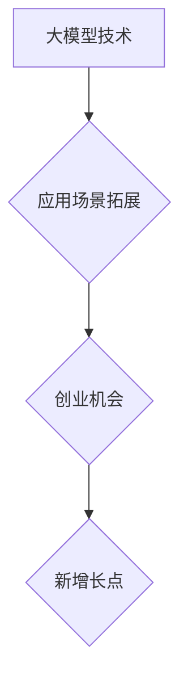

> 大模型、应用场景、创业、增长点、人工智能、深度学习、自然语言处理、计算机视觉

## 1. 背景介绍

近年来，人工智能（AI）技术取得了飞速发展，其中大模型作为AI领域的重要突破口，展现出强大的学习和推理能力，在自然语言处理、计算机视觉、语音识别等领域取得了令人瞩目的成果。大模型的涌现为各行各业带来了前所未有的机遇，也为创业者提供了广阔的市场空间。

大模型的定义通常是指参数量在数十亿甚至数千亿级别的神经网络模型。这些模型通过海量数据训练，能够学习到复杂的模式和知识，从而实现更精准、更智能的应用。例如，GPT-3、BERT、DALL-E 2 等大模型在文本生成、机器翻译、图像识别等方面展现出令人惊叹的性能。

## 2. 核心概念与联系

大模型的应用场景不断拓展，涵盖了各个领域，例如：

* **自然语言处理（NLP）：** 文本生成、机器翻译、问答系统、情感分析、代码生成等。
* **计算机视觉（CV）：** 图像识别、物体检测、图像分割、视频分析等。
* **语音识别与合成：** 语音转文本、文本转语音、语音助手等。
* **推荐系统：** 商品推荐、内容推荐、个性化服务等。
* **医疗健康：** 疾病诊断、药物研发、医疗影像分析等。
* **金融科技：** 风险评估、欺诈检测、智能客服等。

**大模型应用场景的拓宽与创业机会的产生**



## 3. 核心算法原理 & 具体操作步骤

### 3.1  算法原理概述

大模型的训练主要基于深度学习算法，特别是 Transformer 架构。Transformer 架构通过自注意力机制，能够捕捉文本序列中长距离依赖关系，从而实现更精准的理解和生成。

### 3.2  算法步骤详解

1. **数据预处理:** 收集和清洗海量文本数据，进行分词、词向量化等预处理操作。
2. **模型构建:** 根据 Transformer 架构设计模型结构，包括编码器、解码器和注意力机制等模块。
3. **模型训练:** 使用预处理后的数据训练模型，通过反向传播算法优化模型参数。
4. **模型评估:** 使用测试数据评估模型性能，例如准确率、困惑度等指标。
5. **模型部署:** 将训练好的模型部署到生产环境中，提供服务给用户。

### 3.3  算法优缺点

**优点:**

* 强大的学习能力，能够捕捉复杂的模式和知识。
* 泛化能力强，能够应用于多种任务和领域。
* 性能不断提升，模型规模和精度不断提高。

**缺点:**

* 训练成本高，需要海量数据和强大的计算资源。
* 模型解释性差，难以理解模型的决策过程。
* 存在潜在的偏见和风险，需要进行伦理和安全评估。

### 3.4  算法应用领域

大模型算法广泛应用于自然语言处理、计算机视觉、语音识别等领域，例如：

* **文本生成:** 自动写作、机器翻译、对话系统等。
* **图像识别:** 物体检测、场景理解、图像分类等。
* **语音识别:** 语音转文本、语音助手、语音搜索等。

## 4. 数学模型和公式 & 详细讲解 & 举例说明

### 4.1  数学模型构建

大模型的训练基于深度学习算法，其核心是神经网络模型。神经网络模型由多个层组成，每层包含多个神经元。神经元之间通过权重连接，传递信息。

**神经网络模型的数学表示:**

$$
y = f(W_L x_L + b_L)
$$

其中：

* $y$ 是输出值
* $x_L$ 是输入值
* $W_L$ 是第 $L$ 层的权重矩阵
* $b_L$ 是第 $L$ 层的偏置向量
* $f$ 是激活函数

### 4.2  公式推导过程

深度学习算法的核心是反向传播算法，用于优化模型参数。反向传播算法通过计算损失函数的梯度，更新模型参数，使得模型预测结果与真实值之间的误差最小化。

**损失函数:**

$$
L = \frac{1}{N} \sum_{i=1}^{N} (y_i - \hat{y}_i)^2
$$

其中：

* $L$ 是损失函数
* $N$ 是样本数量
* $y_i$ 是真实值
* $\hat{y}_i$ 是预测值

**梯度下降算法:**

$$
\theta = \theta - \alpha \nabla L(\theta)
$$

其中：

* $\theta$ 是模型参数
* $\alpha$ 是学习率
* $\nabla L(\theta)$ 是损失函数的梯度

### 4.3  案例分析与讲解

例如，在机器翻译任务中，可以使用大模型训练一个从源语言到目标语言的翻译模型。训练过程中，模型会学习到源语言和目标语言之间的语义关系，从而实现准确的翻译。

## 5. 项目实践：代码实例和详细解释说明

### 5.1  开发环境搭建

使用 Python 语言和深度学习框架 TensorFlow 或 PyTorch 开发大模型应用。

### 5.2  源代码详细实现

```python
# 使用 TensorFlow 框架实现文本生成模型

import tensorflow as tf

# 定义模型结构
model = tf.keras.Sequential([
    tf.keras.layers.Embedding(input_dim=vocab_size, output_dim=embedding_dim),
    tf.keras.layers.LSTM(units=hidden_size),
    tf.keras.layers.Dense(units=vocab_size, activation='softmax')
])

# 编译模型
model.compile(optimizer='adam', loss='sparse_categorical_crossentropy', metrics=['accuracy'])

# 训练模型
model.fit(x_train, y_train, epochs=epochs)

# 生成文本
text = model.predict(input_sequence)
```

### 5.3  代码解读与分析

* **Embedding 层:** 将单词映射到低维向量空间，捕捉单词之间的语义关系。
* **LSTM 层:** 学习文本序列中的长距离依赖关系。
* **Dense 层:** 将 LSTM 输出映射到每个单词的概率分布。
* **softmax 函数:** 将概率分布归一化，得到每个单词的预测概率。

### 5.4  运行结果展示

训练好的模型可以用于生成文本，例如诗歌、小说、代码等。

## 6. 实际应用场景

### 6.1  自然语言处理

* **聊天机器人:** 大模型可以训练出更智能、更自然的聊天机器人，能够理解用户意图，并提供更精准的回复。
* **文本摘要:** 大模型可以自动生成文本摘要，提取文本的关键信息，节省用户阅读时间。
* **机器翻译:** 大模型可以实现更高质量的机器翻译，突破语言障碍，促进跨文化交流。

### 6.2  计算机视觉

* **图像识别:** 大模型可以识别图像中的物体、场景、人物等，应用于安防监控、医疗诊断等领域。
* **图像生成:** 大模型可以生成逼真的图像，应用于艺术创作、游戏开发等领域。
* **视频分析:** 大模型可以分析视频内容，识别动作、事件等，应用于监控、体育赛事分析等领域。

### 6.3  语音识别与合成

* **语音助手:** 大模型可以训练出更智能的语音助手，能够理解用户的语音指令，并执行相应的操作。
* **语音转文本:** 大模型可以将语音转换为文本，应用于会议记录、语音搜索等领域。
* **文本转语音:** 大模型可以将文本转换为语音，应用于语音播报、语音邮件等领域。

### 6.4  未来应用展望

大模型的应用场景还在不断拓展，未来将应用于更多领域，例如：

* **个性化教育:** 根据学生的学习情况，提供个性化的学习内容和辅导。
* **精准医疗:** 根据患者的基因信息和病史，提供个性化的医疗方案。
* **自动驾驶:** 帮助自动驾驶汽车理解道路环境，做出更安全的决策。

## 7. 工具和资源推荐

### 7.1  学习资源推荐

* **书籍:**
    * 《深度学习》
    * 《自然语言处理》
    * 《计算机视觉》
* **在线课程:**
    * Coursera
    * edX
    * Udacity

### 7.2  开发工具推荐

* **深度学习框架:** TensorFlow, PyTorch
* **编程语言:** Python
* **云计算平台:** AWS, Azure, GCP

### 7.3  相关论文推荐

* **Attention Is All You Need:** https://arxiv.org/abs/1706.03762
* **BERT: Pre-training of Deep Bidirectional Transformers for Language Understanding:** https://arxiv.org/abs/1810.04805
* **DALL-E 2: Hierarchical Text-Conditional Image Generation with CLIP Latents:** https://openai.com/blog/dall-e-2/

## 8. 总结：未来发展趋势与挑战

### 8.1  研究成果总结

大模型技术取得了显著进展，在自然语言处理、计算机视觉等领域取得了突破性成果。大模型的应用场景不断拓展，为各行各业带来了新的机遇。

### 8.2  未来发展趋势

* **模型规模进一步扩大:** 模型参数量将继续增加，提升模型的学习能力和性能。
* **多模态大模型:** 将文本、图像、音频等多种模态数据融合，构建更智能、更全面的模型。
* **可解释性增强:** 研究大模型的决策过程，提高模型的透明度和可信度。
* **边缘计算部署:** 将大模型部署到边缘设备，实现更低延迟、更私密的数据处理。

### 8.3  面临的挑战

* **训练成本高:** 大模型的训练需要海量数据和强大的计算资源，成本较高。
* **模型解释性差:** 大模型的决策过程难以理解，缺乏可解释性。
* **伦理和安全风险:** 大模型可能存在偏见、歧视和安全风险，需要进行伦理和安全评估。

### 8.4  研究展望

未来，大模型技术将继续发展，为人类社会带来更多福祉。需要加强基础研究，解决大模型的挑战，并推动大模型的伦理和安全发展。

## 9. 附录：常见问题与解答

**Q1: 如何选择合适的深度学习框架？**

**A1:** TensorFlow 和 PyTorch 是两个主流的深度学习框架，各有优缺点。TensorFlow 更适合于生产环境部署，PyTorch 更灵活，更容易上手。

**Q2: 如何训练大模型？**

**A2:** 训练大模型需要海量数据、强大的计算资源和专业的技术团队。可以使用云计算平台或搭建自己的训练集群。

**Q3: 如何评估大模型的性能？**

**A3:** 大模型的性能可以通过准确率、困惑度、BLEU 等指标进行评估。

**Q4: 大模型存在哪些伦理和安全风险？**

**A4:** 大模型可能存在偏见、歧视、隐私泄露等风险，需要进行伦理和安全评估，并采取相应的措施进行mitigation。


作者：禅与计算机程序设计艺术 / Zen and the Art of Computer Programming 
<end_of_turn>