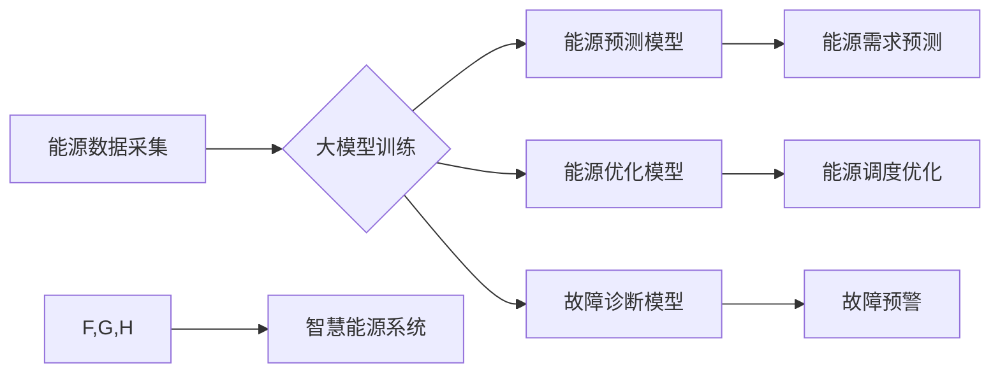

> 大模型，智慧能源，能源转型，人工智能，机器学习，深度学习，可再生能源，能源效率

## 1. 背景介绍

全球能源转型正处于关键时期。传统化石能源的枯竭和环境污染问题日益突出，迫切需要寻找可持续、清洁的能源替代方案。智慧能源作为能源转型的重要方向，旨在通过数字化、智能化手段提高能源利用效率、优化能源结构、促进能源安全。

近年来，人工智能（AI）技术，特别是大模型的快速发展，为智慧能源的建设提供了强大的技术支撑。大模型凭借其强大的学习能力和泛化能力，能够处理海量能源数据，挖掘能源隐藏的价值，为能源管理、优化、预测等方面提供智能化解决方案。

## 2. 核心概念与联系

**2.1 智慧能源**

智慧能源是指利用数字化、智能化技术，实现能源生产、传输、分配、利用的智能化管理和优化，以提高能源利用效率、降低能源成本、促进能源安全和可持续发展。

**2.2 大模型**

大模型是指在海量数据上训练的深度学习模型，拥有强大的泛化能力和学习能力，能够处理复杂的任务，例如自然语言处理、图像识别、语音合成等。

**2.3 核心概念联系**

大模型能够通过学习海量能源数据，例如能源生产、消费、价格、天气等数据，建立能源系统的智能模型，实现以下功能：

* **能源预测:** 利用历史数据和实时信息预测未来能源需求，优化能源供应和分配。
* **能源优化:** 根据实时能源需求和供给情况，优化能源调度和分配，提高能源利用效率。
* **故障诊断:** 通过分析能源系统运行数据，识别潜在故障，及时进行维护和修复。
* **能源管理:** 提供智能化的能源管理平台，帮助用户实时监控能源使用情况，优化能源消费行为。

**2.4 核心架构**



## 3. 核心算法原理 & 具体操作步骤

**3.1 算法原理概述**

大模型在智慧能源领域的应用主要基于以下核心算法：

* **机器学习:** 利用历史数据训练模型，学习能源系统运行规律，进行预测、优化和诊断。
* **深度学习:** 使用多层神经网络，提取能源数据中的复杂特征，提高模型的学习能力和预测精度。
* **强化学习:** 通过试错学习，优化能源系统运行策略，实现智能化控制。

**3.2 算法步骤详解**

以能源预测为例，大模型训练流程如下：

1. **数据采集:** 收集历史能源数据，包括能源生产、消费、价格、天气等信息。
2. **数据预处理:** 对数据进行清洗、转换、特征工程等处理，使其适合模型训练。
3. **模型选择:** 根据任务需求选择合适的机器学习或深度学习模型，例如线性回归、支持向量机、神经网络等。
4. **模型训练:** 利用训练数据训练模型，调整模型参数，使其能够准确预测未来能源需求。
5. **模型评估:** 使用测试数据评估模型的预测精度，并进行模型调优。
6. **模型部署:** 将训练好的模型部署到生产环境中，用于实时预测未来能源需求。

**3.3 算法优缺点**

* **优点:**

    * 能够处理海量数据，挖掘能源数据中的隐藏价值。
    * 学习能力强，能够准确预测未来能源需求。
    * 适应性强，能够根据实时数据动态调整预测结果。

* **缺点:**

    * 训练数据量大，需要大量的计算资源和时间。
    * 模型解释性差，难以理解模型的决策过程。
    * 对数据质量要求高，数据偏差会影响模型预测精度。

**3.4 算法应用领域**

* **能源预测:** 预测未来能源需求，优化能源供应和分配。
* **能源优化:** 优化能源调度和分配，提高能源利用效率。
* **故障诊断:** 识别潜在故障，及时进行维护和修复。
* **能源管理:** 提供智能化的能源管理平台，帮助用户实时监控能源使用情况，优化能源消费行为。

## 4. 数学模型和公式 & 详细讲解 & 举例说明

**4.1 数学模型构建**

能源预测模型可以构建为一个时间序列模型，例如ARIMA模型，其核心思想是利用历史数据中的趋势、季节性和随机波动来预测未来值。

**4.2 公式推导过程**

ARIMA模型的数学公式如下：

$$
y_t = c + \phi_1 y_{t-1} + \phi_2 y_{t-2} + ... + \phi_p y_{t-p} + \theta_1 \epsilon_{t-1} + \theta_2 \epsilon_{t-2} + ... + \theta_q \epsilon_{t-q} + \epsilon_t
$$

其中：

* $y_t$ 是时间t的预测值
* $c$ 是截距项
* $\phi_i$ 是自回归系数
* $y_{t-i}$ 是时间t-i的实际值
* $\theta_i$ 是移动平均系数
* $\epsilon_{t-i}$ 是时间t-i的随机误差项
* $p$ 是自回归阶数
* $q$ 是移动平均阶数

**4.3 案例分析与讲解**

假设我们要预测未来一周的电力需求，我们可以使用ARIMA模型。首先，我们需要收集历史电力需求数据，然后根据数据特征选择合适的p和q值。最后，利用训练数据训练模型，并使用测试数据评估模型的预测精度。

## 5. 项目实践：代码实例和详细解释说明

**5.1 开发环境搭建**

* Python 3.7+
* TensorFlow/PyTorch
* Jupyter Notebook

**5.2 源代码详细实现**

```python
# 导入必要的库
import pandas as pd
from sklearn.model_selection import train_test_split
from statsmodels.tsa.arima.model import ARIMA

# 加载数据
data = pd.read_csv('energy_data.csv', index_col='Date')

# 数据预处理
data = data['Energy Demand'].values.reshape(-1, 1)

# 将数据划分为训练集和测试集
train_data, test_data = train_test_split(data, test_size=0.2)

# 训练ARIMA模型
model = ARIMA(train_data, order=(5, 1, 0))
model_fit = model.fit()

# 预测测试集数据
predictions = model_fit.predict(start=len(train_data), end=len(data)-1)

# 评估模型性能
# ...

# 可视化预测结果
# ...
```

**5.3 代码解读与分析**

* 首先，我们导入必要的库，并加载能源数据。
* 然后，我们对数据进行预处理，将其转换为适合模型训练的格式。
* 接下来，我们将数据划分为训练集和测试集，用于训练和评估模型。
* 然后，我们使用ARIMA模型训练模型，并使用测试数据进行预测。
* 最后，我们评估模型性能，并可视化预测结果。

**5.4 运行结果展示**

运行结果将显示模型的预测精度，以及预测结果的可视化图。

## 6. 实际应用场景

**6.1 电力系统优化**

大模型可以帮助电力系统优化能源调度，提高能源利用效率。例如，可以预测未来电力需求，优化发电计划，减少弃风弃光现象。

**6.2 能源交易市场**

大模型可以帮助能源交易市场进行智能化交易，提高交易效率和透明度。例如，可以预测未来能源价格，帮助交易者制定更优的交易策略。

**6.3 智能家居**

大模型可以帮助智能家居系统实现智能化能源管理，降低能源消耗。例如，可以根据用户行为和环境条件，智能调节空调、照明等设备的运行状态。

**6.4 未来应用展望**

随着大模型技术的不断发展，其在智慧能源领域的应用将更加广泛和深入。例如，可以用于开发更精准的能源预测模型，实现更智能化的能源管理系统，促进能源转型和可持续发展。

## 7. 工具和资源推荐

**7.1 学习资源推荐**

* **书籍:**
    * 深度学习
    * 人工智能：一种现代方法
* **在线课程:**
    * Coursera: 深度学习
    * edX: 人工智能
* **开源项目:**
    * TensorFlow
    * PyTorch

**7.2 开发工具推荐**

* **Python:** 作为人工智能开发的主要语言，Python拥有丰富的库和工具，例如NumPy、Pandas、Scikit-learn等。
* **Jupyter Notebook:** 用于交互式编程和数据可视化的工具，方便进行数据分析和模型开发。
* **云计算平台:** 例如AWS、Azure、GCP等，提供强大的计算资源和服务，支持大模型的训练和部署。

**7.3 相关论文推荐**

* **BERT: Pre-training of Deep Bidirectional Transformers for Language Understanding**
* **GPT-3: Language Models are Few-Shot Learners**
* **Attention Is All You Need**

## 8. 总结：未来发展趋势与挑战

**8.1 研究成果总结**

大模型在智慧能源领域的应用取得了显著成果，例如提高了能源预测精度、优化了能源调度，为能源转型提供了技术支撑。

**8.2 未来发展趋势**

* **模型规模和能力提升:** 未来大模型将更加强大，能够处理更复杂的任务，提供更精准的预测和优化建议。
* **多模态融合:** 大模型将融合多种数据类型，例如文本、图像、传感器数据等，实现更全面的能源管理。
* **边缘计算:** 大模型将部署到边缘设备，实现更实时、更精准的能源管理。

**8.3 面临的挑战**

* **数据质量和隐私:** 大模型需要海量高质量数据，而能源数据往往存在隐私问题，需要采取有效措施保护数据安全。
* **模型解释性和可信度:** 大模型的决策过程往往难以理解，需要提高模型的解释性和可信度，才能获得用户的信任。
* **计算资源和成本:** 训练和部署大模型需要大量的计算资源和成本，需要探索更有效的计算方法和资源分配策略。

**8.4 研究展望**

未来，我们需要继续探索大模型在智慧能源领域的应用，解决面临的挑战，推动能源转型和可持续发展。


## 9. 附录：常见问题与解答

**9.1 如何选择合适的ARIMA模型参数？**

可以使用模型诊断工具和交叉验证方法来选择合适的ARIMA模型参数。

**9.2 如何处理能源数据中的缺失值？**

可以使用插值法、平均法等方法处理能源数据中的缺失值。

**9.3 如何评估大模型的预测精度？**

可以使用均方误差、平均绝对误差等指标来评估大模型的预测精度。


作者：禅与计算机程序设计艺术 / Zen and the Art of Computer Programming 
<end_of_turn>