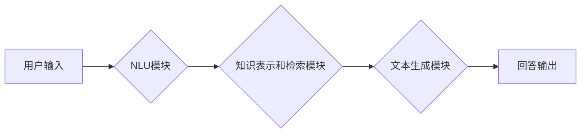

> 大模型、问答机器人、搜索推荐、自然语言处理、深度学习、Transformer、BERT、GPT、信息检索

## 1. 背景介绍

近年来，人工智能技术取得了飞速发展，特别是深度学习的兴起，为自然语言处理（NLP）领域带来了革命性的变革。大模型的出现，以其强大的语义理解和文本生成能力，在问答机器人和搜索推荐等领域展现出巨大的潜力。

问答机器人旨在通过理解用户的问题，并从知识库或文本数据中获取相关信息，以自然语言形式回答用户的问题。搜索推荐则旨在根据用户的搜索意图，从海量数据中检索出最相关的结果，并将其推荐给用户。

尽管问答机器人和搜索推荐都旨在提供信息，但它们在核心机制、数据处理方式和用户体验上存在显著差异。本文将深入探讨大模型在问答机器人和搜索推荐中的应用，并分析两者之间的异同，以期为理解大模型的应用场景和未来发展方向提供参考。

## 2. 核心概念与联系

### 2.1 问答机器人

问答机器人通常由以下几个模块组成：

* **自然语言理解（NLU）模块：**负责将用户输入的自然语言转换为机器可理解的结构化表示，例如词向量、句法树等。
* **知识表示和检索模块：**负责存储和组织知识，并根据用户问题检索相关知识。
* **文本生成模块：**负责根据检索到的知识，生成自然流畅的回答。

### 2.2 搜索推荐

搜索推荐系统通常由以下几个模块组成：

* **信息检索模块：**负责根据用户查询关键词，从海量数据中检索出相关文档。
* **排序模块：**负责对检索到的文档进行排序，并将最相关的文档排在前面。
* **推荐模块：**根据用户的历史行为和偏好，推荐用户可能感兴趣的文档或商品。

### 2.3 大模型的应用

大模型可以应用于问答机器人和搜索推荐的各个模块，例如：

* **NLU模块：**大模型可以用于词语嵌入、句法解析、情感分析等任务，提升NLU模块的准确性和效率。
* **知识表示和检索模块：**大模型可以用于知识图谱构建、关系抽取等任务，丰富知识表示和检索能力。
* **文本生成模块：**大模型可以用于文本摘要、机器翻译、对话生成等任务，提升文本生成模块的质量和多样性。
* **信息检索模块：**大模型可以用于语义搜索、文档理解等任务，提升信息检索的准确性和相关性。
* **排序模块：**大模型可以用于用户行为预测、兴趣建模等任务，提升排序模块的个性化和精准度。

**Mermaid 流程图**



## 3. 核心算法原理 & 具体操作步骤

### 3.1 算法原理概述

大模型问答机器人和搜索推荐系统通常基于深度学习算法，例如Transformer、BERT、GPT等。这些算法通过训练大量的文本数据，学习语言的语义和结构，从而实现对自然语言的理解和生成。

### 3.2 算法步骤详解

1. **数据预处理：**将原始文本数据进行清洗、分词、词向量化等预处理操作，以便模型训练。
2. **模型训练：**使用深度学习框架（例如TensorFlow、PyTorch）训练大模型，并根据预定义的损失函数和优化算法，调整模型参数，使其能够准确地理解和生成文本。
3. **模型评估：**使用测试数据集评估模型的性能，例如准确率、召回率、F1-score等指标。
4. **模型部署：**将训练好的模型部署到生产环境中，以便为用户提供服务。

### 3.3 算法优缺点

**优点：**

* **强大的语义理解能力：**大模型能够捕捉文本中的深层语义关系，理解复杂的句子结构和上下文信息。
* **灵活的文本生成能力：**大模型能够生成流畅、自然、多样化的文本，适用于各种文本生成任务。
* **持续学习能力：**大模型可以通过不断学习新的数据，不断提升其性能和知识库。

**缺点：**

* **训练成本高：**大模型的训练需要大量的计算资源和时间，成本较高。
* **数据依赖性强：**大模型的性能取决于训练数据的质量和数量，如果训练数据不足或质量低，模型性能会受到影响。
* **可解释性差：**大模型的决策过程较为复杂，难以解释其背后的逻辑，这可能会导致模型的信任度降低。

### 3.4 算法应用领域

大模型问答机器人和搜索推荐系统已广泛应用于各个领域，例如：

* **客户服务：**提供智能客服，自动回答用户常见问题。
* **教育：**提供个性化学习辅导，帮助学生理解知识点。
* **医疗保健：**辅助医生诊断疾病，提供患者健康咨询。
* **电商：**提供商品推荐，提升用户购物体验。

## 4. 数学模型和公式 & 详细讲解 & 举例说明

### 4.1 数学模型构建

大模型问答机器人和搜索推荐系统通常基于概率模型，例如贝叶斯网络、隐马尔可夫模型、条件随机场等。这些模型通过计算概率分布，预测用户问题与知识库之间的关系，或预测用户搜索意图与文档之间的相关性。

### 4.2 公式推导过程

例如，在问答机器人中，可以使用条件概率公式来计算给定用户问题，检索到的知识片段的概率：

$$P(K|Q) = \frac{P(Q|K)P(K)}{P(Q)}$$

其中：

* $P(K|Q)$ 是给定用户问题 $Q$，检索到的知识片段 $K$ 的概率。
* $P(Q|K)$ 是给定知识片段 $K$，用户问题 $Q$ 的概率。
* $P(K)$ 是知识片段 $K$ 的先验概率。
* $P(Q)$ 是用户问题 $Q$ 的先验概率。

### 4.3 案例分析与讲解

假设用户问题为“中国古代四大发明是什么？”，而知识库中包含了以下知识片段：

* “中国古代四大发明是造纸术、指南针、火药和印刷术。”

根据上述公式，我们可以计算出该知识片段给定用户问题下的概率。

## 5. 项目实践：代码实例和详细解释说明

### 5.1 开发环境搭建

* 操作系统：Ubuntu 20.04
* Python 版本：3.8
* 深度学习框架：TensorFlow 2.0

### 5.2 源代码详细实现

```python
# 导入必要的库
import tensorflow as tf

# 定义模型结构
model = tf.keras.Sequential([
    tf.keras.layers.Embedding(input_dim=vocab_size, output_dim=embedding_dim),
    tf.keras.layers.LSTM(units=hidden_units),
    tf.keras.layers.Dense(units=output_dim, activation='softmax')
])

# 编译模型
model.compile(optimizer='adam', loss='categorical_crossentropy', metrics=['accuracy'])

# 训练模型
model.fit(train_data, train_labels, epochs=epochs)

# 评估模型
loss, accuracy = model.evaluate(test_data, test_labels)
print('Loss:', loss)
print('Accuracy:', accuracy)
```

### 5.3 代码解读与分析

* **Embedding层：**将词语转换为稠密的向量表示，捕捉词语之间的语义关系。
* **LSTM层：**捕捉文本序列中的长短时依赖关系，理解文本的上下文信息。
* **Dense层：**将LSTM层的输出映射到输出类别，预测用户问题与知识片段之间的关系。

### 5.4 运行结果展示

训练完成后，可以将模型应用于实际场景，例如回答用户问题、推荐相关文档等。

## 6. 实际应用场景

### 6.1 问答机器人

大模型问答机器人已应用于多个领域，例如：

* **客服机器人：**自动回答用户常见问题，例如订单查询、退换货流程等。
* **教育机器人：**提供个性化学习辅导，帮助学生理解知识点，完成作业。
* **医疗机器人：**辅助医生诊断疾病，提供患者健康咨询。

### 6.2 搜索推荐

大模型搜索推荐系统已应用于多个领域，例如：

* **电商推荐：**根据用户的浏览历史、购买记录等信息，推荐用户可能感兴趣的商品。
* **新闻推荐：**根据用户的阅读偏好，推荐用户可能感兴趣的新闻文章。
* **社交媒体推荐：**根据用户的社交关系和兴趣爱好，推荐用户可能感兴趣的朋友、话题等。

### 6.4 未来应用展望

随着大模型技术的不断发展，其在问答机器人和搜索推荐领域的应用将更加广泛和深入。例如：

* **多模态问答：**结合文本、图像、音频等多模态数据，实现更智能、更全面的问答服务。
* **个性化推荐：**根据用户的个性化需求，提供更加精准、更加个性化的推荐服务。
* **跨语言问答：**实现跨语言的问答服务，打破语言障碍，促进全球信息交流。

## 7. 工具和资源推荐

### 7.1 学习资源推荐

* **书籍：**
    * 《深度学习》
    * 《自然语言处理》
    * 《Transformer模型》
* **在线课程：**
    * Coursera：深度学习、自然语言处理
    * edX：深度学习、机器学习
* **博客和论坛：**
    * TensorFlow博客
    * PyTorch博客
    * NLP Stack Exchange

### 7.2 开发工具推荐

* **深度学习框架：**TensorFlow、PyTorch
* **自然语言处理库：**NLTK、spaCy、Hugging Face Transformers
* **数据处理工具：**Pandas、NumPy

### 7.3 相关论文推荐

* 《Attention Is All You Need》
* 《BERT: Pre-training of Deep Bidirectional Transformers for Language Understanding》
* 《GPT-3: Language Models are Few-Shot Learners》

## 8. 总结：未来发展趋势与挑战

### 8.1 研究成果总结

大模型问答机器人和搜索推荐系统取得了显著的进展，其强大的语义理解和文本生成能力，为信息获取和知识发现带来了新的可能性。

### 8.2 未来发展趋势

* **模型规模和能力的提升：**随着计算资源的不断发展，大模型的规模和能力将不断提升，能够处理更复杂的任务，提供更精准的答案和推荐。
* **多模态融合：**大模型将融合文本、图像、音频等多模态数据，实现更全面的信息理解和交互。
* **个性化定制：**大模型将根据用户的个性化需求，提供更加精准、更加个性化的服务。

### 8.3 面临的挑战

* **数据安全和隐私保护：**大模型的训练需要大量数据，如何保证数据安全和隐私保护是一个重要的挑战。
* **模型可解释性和信任度：**大模型的决策过程较为复杂，难以解释其背后的逻辑，这可能会导致模型的信任度降低。
* **伦理和社会影响：**大模型的应用可能会带来一些伦理和社会问题，例如信息操控、算法偏见等，需要引起足够的重视。

### 8.4 研究展望

未来，大模型问答机器人和搜索推荐系统将继续朝着更智能、更安全、更可解释的方向发展，为人类社会带来更多便利和福祉。

## 9. 附录：常见问题与解答

**Q1：大模型问答机器人和搜索推荐系统有什么区别？**

**A1：**大模型问答机器人旨在回答用户的问题，而大模型搜索推荐系统旨在推荐用户可能感兴趣的内容。

**Q2：大模型的训练成本很高吗？**

**A2：**是的，大模型的训练