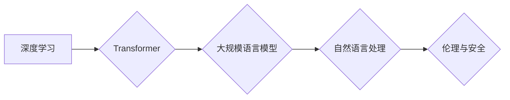

> 大规模语言模型，深度学习，Transformer，自然语言处理，伦理，安全，可解释性

## 1. 背景介绍

近年来，深度学习技术取得了飞速发展，特别是大规模语言模型（Large Language Models，LLMs）的出现，为自然语言处理（Natural Language Processing，NLP）领域带来了革命性的变革。LLMs，如GPT-3、BERT、LaMDA等，拥有数十亿甚至数千亿的参数，能够理解和生成人类语言，展现出惊人的文本生成、翻译、问答、摘要等能力。

然而，LLMs的强大能力也带来了新的挑战和伦理问题。其生成文本可能包含偏见、虚假信息和有害内容，甚至可能被用于恶意攻击和操纵舆论。因此，深入研究LLMs的理论基础、实践应用以及伦理安全问题，对于推动其健康发展至关重要。

## 2. 核心概念与联系

**2.1  深度学习与Transformer**

深度学习是机器学习的一个分支，利用多层神经网络结构学习数据特征，并进行预测或分类。Transformer是一种基于注意力机制的深度学习架构，在处理序列数据，如文本，方面表现出优异的性能。

**2.2  大规模语言模型**

LLMs是基于Transformer架构，训练于海量文本数据的大型神经网络模型。其核心特点是：

* **规模庞大:** 参数数量巨大，通常在数十亿甚至数千亿级别。
* **预训练能力:** 通过预训练学习大量的语言知识，能够在各种下游任务中进行微调。
* **多模态能力:** 一些LLMs已经开始融合图像、音频等多模态数据，实现更丰富的语义理解和生成。

**2.3  自然语言处理**

NLP是计算机科学的一个分支，致力于使计算机能够理解、处理和生成人类语言。LLMs为NLP领域带来了革命性的变革，例如：

* **文本生成:**  LLMs能够生成高质量的文本，包括文章、故事、诗歌等。
* **机器翻译:** LLMs能够实现更准确、流畅的机器翻译。
* **问答系统:** LLMs能够理解用户的问题，并给出准确的答案。
* **文本摘要:** LLMs能够自动生成文本摘要，提取关键信息。

**2.4  伦理与安全**

LLMs的强大能力也带来了新的伦理和安全挑战：

* **偏见和歧视:** LLMs可能学习到训练数据中的偏见和歧视，导致输出结果不公平。
* **虚假信息和操纵:** LLMs可以生成看似真实但实际上虚假的信息，可能被用于传播谣言和操纵舆论。
* **隐私泄露:** LLMs可能泄露训练数据中的敏感信息。
* **恶意攻击:** LLMs可以被用于进行恶意攻击，例如生成钓鱼邮件和恶意代码。

**2.5  Mermaid 流程图**



## 3. 核心算法原理 & 具体操作步骤

### 3.1  算法原理概述

LLMs的核心算法是基于Transformer架构的深度神经网络。Transformer模型的核心创新点是**注意力机制**，它能够学习文本中单词之间的关系，并赋予不同单词不同的权重，从而更好地理解文本语义。

Transformer模型由**编码器**和**解码器**两部分组成。编码器负责将输入文本序列编码成一个固定长度的向量表示，解码器则根据编码后的向量表示生成输出文本序列。

### 3.2  算法步骤详解

1. **词嵌入:** 将输入文本中的每个单词映射到一个低维向量空间中，每个单词都有一个唯一的向量表示。
2. **编码器:** 将词嵌入向量输入到编码器中，编码器通过多层Transformer模块进行处理，最终将输入文本序列编码成一个固定长度的向量表示。
3. **解码器:** 将编码后的向量表示输入到解码器中，解码器通过多层Transformer模块进行处理，并根据当前生成的文本序列和编码后的向量表示，预测下一个单词。
4. **输出:** 将解码器输出的每个单词概率最高的词作为输出文本序列的一部分。

### 3.3  算法优缺点

**优点:**

* **强大的文本理解和生成能力:** Transformer模型能够学习到复杂的文本语义关系，并生成高质量的文本。
* **并行训练效率高:** Transformer模型的注意力机制使得模型能够并行训练，提高训练效率。
* **可迁移性强:** 预训练的LLMs能够在各种下游任务中进行微调，实现跨任务的应用。

**缺点:**

* **训练成本高:** LLMs的规模庞大，训练成本很高，需要大量的计算资源和数据。
* **可解释性差:** Transformer模型的内部机制复杂，难以解释模型的决策过程。
* **潜在的偏见和风险:** LLMs可能学习到训练数据中的偏见和歧视，并产生有害的输出。

### 3.4  算法应用领域

LLMs在多个领域都有广泛的应用，例如：

* **自然语言理解:** 文本分类、情感分析、问答系统、文本摘要等。
* **自然语言生成:** 文本生成、机器翻译、对话系统、代码生成等。
* **多模态理解:** 图像字幕、视频理解、语音识别等。

## 4. 数学模型和公式 & 详细讲解 & 举例说明

### 4.1  数学模型构建

LLMs的数学模型主要基于**概率论**和**统计学**。其核心思想是学习一个概率分布，该分布能够描述文本序列的生成概率。

**4.1.1  词语概率分布:**

LLMs的目标是学习每个词语在给定上下文条件下的概率分布。例如，在句子“The cat sat on the”中，下一个词语可能是“mat”或“chair”。LLMs需要学习这两个词语在该上下文条件下的概率。

**4.1.2  Transformer模型结构:**

Transformer模型由编码器和解码器两部分组成。编码器使用多层Transformer模块处理输入文本序列，解码器则根据编码后的向量表示生成输出文本序列。

**4.1.3  注意力机制:**

Transformer模型的核心创新点是注意力机制，它能够学习文本中单词之间的关系，并赋予不同单词不同的权重。注意力机制的数学公式如下：

$$
Attention(Q, K, V) = softmax(\frac{QK^T}{\sqrt{d_k}})V
$$

其中：

* $Q$：查询矩阵
* $K$：键矩阵
* $V$：值矩阵
* $d_k$：键向量的维度
* $softmax$：softmax函数

### 4.2  公式推导过程

注意力机制的公式推导过程较为复杂，涉及到矩阵运算、线性变换和softmax函数等。

**4.2.1  查询、键和值矩阵:**

查询矩阵 $Q$、键矩阵 $K$ 和值矩阵 $V$ 是通过线性变换从输入嵌入向量中得到的。

**4.2.2  点积注意力:**

点积注意力计算查询向量 $Q$ 和键向量 $K$ 的点积，并进行归一化。

**4.2.3  softmax归一化:**

softmax函数将点积结果转换为概率分布，使得每个单词的权重之和为1。

**4.2.4  加权求和:**

将每个单词的权重与对应的值向量相乘，并求和得到最终的输出向量。

### 4.3  案例分析与讲解

**4.3.1  文本翻译:**

在机器翻译任务中，注意力机制可以帮助模型关注源语言文本中与目标语言文本相关的关键词语，从而提高翻译质量。

**4.3.2  文本摘要:**

在文本摘要任务中，注意力机制可以帮助模型识别文本中最关键的信息，并生成简洁准确的摘要。

## 5. 项目实践：代码实例和详细解释说明

### 5.1  开发环境搭建

* **操作系统:** Linux/macOS
* **编程语言:** Python
* **深度学习框架:** TensorFlow/PyTorch
* **其他工具:** Git、Jupyter Notebook

### 5.2  源代码详细实现

```python
# 使用PyTorch框架实现简单的Transformer模型

import torch
import torch.nn as nn

class Transformer(nn.Module):
    def __init__(self, vocab_size, embedding_dim, num_heads, num_layers):
        super(Transformer, self).__init__()
        self.embedding = nn.Embedding(vocab_size, embedding_dim)
        self.transformer_layers = nn.ModuleList([
            nn.TransformerEncoderLayer(embedding_dim, num_heads)
            for _ in range(num_layers)
        ])
        self.linear = nn.Linear(embedding_dim, vocab_size)

    def forward(self, x):
        x = self.embedding(x)
        for layer in self.transformer_layers:
            x = layer(x)
        x = self.linear(x)
        return x
```

### 5.3  代码解读与分析

* **embedding层:** 将输入词语映射到低维向量空间中。
* **transformer_layers:** 多层Transformer编码器，每个层包含多头注意力机制和前馈神经网络。
* **linear层:** 将编码后的向量表示映射到输出词语的概率分布。

### 5.4  运行结果展示

运行上述代码，可以训练一个简单的Transformer模型，并进行文本生成任务。

## 6. 实际应用场景

### 6.1  文本生成

LLMs可以用于生成各种类型的文本，例如：

* **小说、诗歌、剧本:**  LLMs可以根据给定的主题和风格生成创意文本。
* **新闻报道、文章:** LLMs可以根据事件信息生成新闻报道或文章。
* **对话系统:** LLMs可以与用户进行自然流畅的对话。

### 6.2  机器翻译

LLMs可以实现更高效、更准确的机器翻译，例如：

* **跨语言文本翻译:** LLMs可以将文本从一种语言翻译成另一种语言。
* **跨领域文本翻译:** LLMs可以将文本从一个领域翻译到另一个领域。

### 6.3  问答系统

LLMs可以用于构建更智能的问答系统，例如：

* **搜索引擎问答:** LLMs可以理解用户的问题，并从海量数据中找到最相关的答案。
* **聊天机器人问答:** LLMs可以与用户进行自然流畅的对话，并回答用户的各种问题。

### 6.4  未来应用展望

LLMs在未来将有更广泛的应用场景，例如：

* **个性化教育:** LLMs可以根据学生的学习进度和需求，提供个性化的学习内容和辅导。
* **医疗诊断:** LLMs可以辅助医生进行疾病诊断，并提供个性化的治疗方案。
* **法律服务:** LLMs可以帮助律师进行法律研究和案件分析。

## 7. 工具和资源推荐

### 7.1  学习资源推荐

* **书籍:**
    * 《深度学习》 by Ian Goodfellow, Yoshua Bengio, Aaron Courville
    * 《自然语言处理》 by Dan Jurafsky, James H. Martin
* **在线课程:**
    * Coursera: Deep Learning Specialization
    * Stanford CS224N: Natural Language Processing with Deep Learning
* **博客和网站:**
    * The Gradient
    * Towards Data Science
    * OpenAI Blog

### 7.2  开发工具推荐

* **深度学习框架:** TensorFlow, PyTorch
* **自然语言处理库:** NLTK, spaCy, Hugging Face Transformers
* **代码编辑器:** VS Code, Sublime Text, Atom

### 7.3  相关论文推荐

* **Attention Is All You Need:** https://arxiv.org/abs/1706.03762
* **BERT: Pre-training of Deep Bidirectional Transformers for Language Understanding:** https://arxiv.org/abs/1810.04805
* **GPT-3: Language Models are Few-Shot