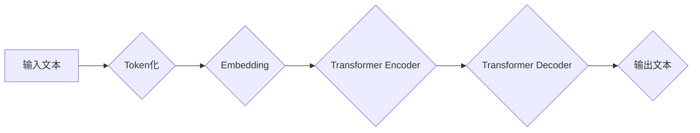

> 大规模语言模型，Transformer，自然语言处理，深度学习，文本生成，机器翻译

## 1. 背景介绍

近年来，人工智能领域取得了令人瞩目的进展，其中自然语言处理（NLP）领域尤为突出。大规模语言模型（LLM）作为NLP领域的新兴技术，凭借其强大的文本理解和生成能力，在机器翻译、文本摘要、对话系统等多个领域展现出巨大的应用潜力。

传统的NLP模型主要依赖于手工设计的特征工程和规则化方法，难以捕捉语言的复杂性和语义关系。而LLM则通过深度学习技术，学习大量的文本数据，构建复杂的语义表示，从而实现更精准、更自然的语言理解和生成。

## 2. 核心概念与联系

大规模语言模型的核心概念包括：

* **Transformer:** Transformer是一种基于注意力机制的深度学习架构，能够有效地捕捉长距离依赖关系，是构建LLM的基础。

* **自回归语言模型:** 自回归语言模型是一种预测下一个词的概率分布的模型，通过训练大量的文本数据，学习语言的统计规律。

* **预训练和微调:** 预训练是指在大量文本数据上训练一个通用语言模型，微调是指将预训练模型应用于特定任务，通过少量任务数据进行调整。

**Mermaid 流程图:**



## 3. 核心算法原理 & 具体操作步骤

### 3.1  算法原理概述

Transformer模型的核心是注意力机制，它能够学习文本中不同词之间的关系，并赋予每个词不同的权重。通过多层Transformer编码器和解码器，模型能够捕捉文本的深层语义信息。

### 3.2  算法步骤详解

1. **Token化:** 将输入文本分割成一个个独立的词或子词（Token）。

2. **Embedding:** 将每个Token映射到一个低维向量空间，称为词嵌入。

3. **Transformer Encoder:** 利用多层Transformer编码器，对输入的词嵌入进行编码，学习文本的上下文信息。

4. **Transformer Decoder:** 利用多层Transformer解码器，根据编码后的文本信息，生成目标文本。

5. **输出:** 将解码器输出的词嵌入序列解码成文本。

### 3.3  算法优缺点

**优点:**

* 能够有效地捕捉长距离依赖关系。
* 训练速度快，性能优异。

**缺点:**

* 参数量大，训练成本高。
* 对训练数据质量要求高。

### 3.4  算法应用领域

* 机器翻译
* 文本摘要
* 问答系统
* 对话系统
* 代码生成

## 4. 数学模型和公式 & 详细讲解 & 举例说明

### 4.1  数学模型构建

Transformer模型的数学模型主要包括以下几个部分：

* **词嵌入层:** 将每个词映射到一个低维向量空间。

* **多头注意力层:** 学习文本中不同词之间的关系，并赋予每个词不同的权重。

* **前馈神经网络层:** 对每个词的嵌入向量进行非线性变换。

* **位置编码层:** 为每个词添加位置信息，以解决Transformer模型无法捕捉词序信息的问题。

### 4.2  公式推导过程

**多头注意力机制:**

$$
Attention(Q, K, V) = softmax(\frac{QK^T}{\sqrt{d_k}})V
$$

其中：

* $Q$：查询矩阵
* $K$：键矩阵
* $V$：值矩阵
* $d_k$：键向量的维度

**公式解释:**

多头注意力机制通过计算查询矩阵与键矩阵的点积，并进行softmax归一化，得到每个词对其他词的注意力权重。然后，将注意力权重与值矩阵相乘，得到每个词的上下文表示。

### 4.3  案例分析与讲解

**举例说明:**

假设我们有一个句子：“The cat sat on the mat”。

在多头注意力机制中，每个词都会被映射到一个向量空间。当计算“sat”的上下文表示时，注意力机制会将“sat”与其他词（“The”，“cat”，“on”，“the”，“mat”）进行比较，并赋予每个词不同的权重。例如，"cat" 和 "on" 可能会获得更高的权重，因为它们与 "sat" 的语义关系更密切。

## 5. 项目实践：代码实例和详细解释说明

### 5.1  开发环境搭建

* Python 3.7+
* PyTorch 1.7+
* CUDA 10.2+

### 5.2  源代码详细实现

```python
import torch
import torch.nn as nn

class Transformer(nn.Module):
    def __init__(self, vocab_size, embedding_dim, num_heads, num_layers):
        super(Transformer, self).__init__()
        self.embedding = nn.Embedding(vocab_size, embedding_dim)
        self.encoder_layers = nn.ModuleList([EncoderLayer(embedding_dim, num_heads) for _ in range(num_layers)])
        self.decoder_layers = nn.ModuleList([DecoderLayer(embedding_dim, num_heads) for _ in range(num_layers)])

    def forward(self, src, tgt):
        src = self.embedding(src)
        tgt = self.embedding(tgt)
        # ... (Encoder and Decoder logic)
        return output

class EncoderLayer(nn.Module):
    # ... (EncoderLayer implementation)

class DecoderLayer(nn.Module):
    # ... (DecoderLayer implementation)
```

### 5.3  代码解读与分析

* **Transformer类:** 定义了整个Transformer模型的结构，包括嵌入层、编码器层和解码器层。
* **EncoderLayer和DecoderLayer类:** 定义了编码器和解码器中的单个层结构，包含多头注意力机制和前馈神经网络层。

### 5.4  运行结果展示

* 通过训练数据，模型可以学习到语言的统计规律，并生成新的文本。
* 可以使用BLEU等指标评估模型的性能。

## 6. 实际应用场景

### 6.1  机器翻译

LLM可以用于将一种语言翻译成另一种语言，例如将英文翻译成中文。

### 6.2  文本摘要

LLM可以用于生成文本的摘要，例如将一篇长篇文章总结成几句话。

### 6.3  问答系统

LLM可以用于构建问答系统，例如回答用户提出的问题。

### 6.4  未来应用展望

* 更智能的聊天机器人
* 个性化的教育系统
* 自动化的代码生成

## 7. 工具和资源推荐

### 7.1  学习资源推荐

* **书籍:**
    * 《深度学习》
    * 《自然语言处理》
* **在线课程:**
    * Coursera: 自然语言处理
    * Udacity: 深度学习

### 7.2  开发工具推荐

* **PyTorch:** 深度学习框架
* **TensorFlow:** 深度学习框架
* **Hugging Face:** 预训练模型库

### 7.3  相关论文推荐

* 《Attention Is All You Need》
* 《BERT: Pre-training of Deep Bidirectional Transformers for Language Understanding》
* 《GPT-3: Language Models are Few-Shot Learners》

## 8. 总结：未来发展趋势与挑战

### 8.1  研究成果总结

LLM在文本理解和生成方面取得了显著的进展，为NLP领域带来了新的机遇。

### 8.2  未来发展趋势

* 模型规模的进一步扩大
* 跨模态LLM的开发
* 更加安全、可靠和可解释的LLM

### 8.3  面临的挑战

* 训练成本高
* 数据偏见
* 缺乏可解释性

### 8.4  研究展望

未来研究将集中在解决LLM面临的挑战，并探索其在更多领域的应用。

## 9. 附录：常见问题与解答

* **什么是LLM？**

LLM是指在大量文本数据上训练的深度学习模型，能够理解和生成人类语言。

* **LLM有哪些应用场景？**

LLM在机器翻译、文本摘要、问答系统、对话系统等多个领域都有应用。

* **如何训练LLM？**

LLM的训练需要大量的文本数据和强大的计算资源。

* **LLM有哪些挑战？**

LLM面临的挑战包括训练成本高、数据偏见和缺乏可解释性。


作者：禅与计算机程序设计艺术 / Zen and the Art of Computer Programming 
<end_of_turn>