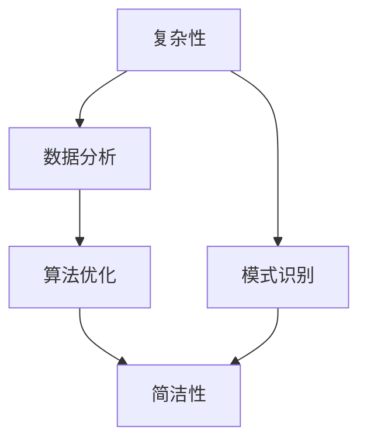

                 

# 理解洞察力的本质：在复杂中把握简单

> 关键词：洞察力, 复杂性, 简洁性, 模式识别, 数据分析, 算法优化

## 1. 背景介绍

### 1.1 问题由来

在信息爆炸和数据驱动的现代社会，洞察力成为了获取竞争优势的关键。面对海量数据和复杂现象，如何在喧嚣中发现规律，在繁复中把握简单，是现代科技工作者必须面对的挑战。洞察力不仅要求深度理解和分析数据，更需要跨学科的融合、创新的思维和精准的工具。

近年来，随着人工智能(AI)、大数据和计算技术的发展，研究人员和工程师们探索出了一系列新方法和工具，用于提升洞察力。其中，基于算法和统计分析的模型优化和数据可视化技术，已经展现出强大的潜力和实际应用价值。

### 1.2 问题核心关键点

洞察力本质上是理解和发现数据背后模式的认知能力。其核心关键点包括：

- **数据理解**：从复杂的数据集中提取关键特征和模式。
- **算法优化**：设计高效的数据分析算法，以减少计算和存储开销。
- **结果解释**：将算法结果转化为易于理解的视觉和文字展示，便于理解和决策。
- **跨学科融合**：结合领域知识，提升算法模型的解释能力和应用效果。

这些关键点相互联系，共同构成了洞察力的理论基础和实现路径。通过理解这些关键点，我们可以更有效地获取和应用洞察力，从而在复杂的数据和现象中发现真知，指导实际决策。

## 2. 核心概念与联系

### 2.1 核心概念概述

为更好地理解洞察力的本质，本节将介绍几个密切相关的核心概念：

- **复杂性(Complexity)**：指系统中组成部分之间的交互关系和内部结构。复杂系统往往包含大量随机变量和相互依赖，其行为难以预测和解释。
- **简洁性(Simplicity)**：与复杂性相对，简洁性是指系统或算法中不含冗余和无关因素，易于理解、操作和解释。
- **模式识别(Pattern Recognition)**：从数据中识别出重复出现的结构或规律。模式识别是洞察力获取的核心步骤。
- **数据分析(Analytical Data)**：利用统计学、机器学习等技术对数据进行系统分析，提取有价值的信息。
- **算法优化(Algorithm Optimization)**：通过改进算法效率和优化算法结构，提升数据分析和处理的速度和准确性。

这些核心概念之间的逻辑关系可以通过以下Mermaid流程图来展示：



这个流程图展示了几大核心概念之间的相互关系：

1. 复杂性通过模式识别被提取和识别。
2. 数据分析提供对复杂性的结构化理解。
3. 算法优化提升数据分析效率。
4. 简洁性反映了分析结果的清晰度和可理解性。

这些概念共同构成了洞察力的实现框架，通过系统地理解和应用这些概念，可以提升洞察力，从而在复杂环境中做出更好的决策。

## 3. 核心算法原理 & 具体操作步骤

### 3.1 算法原理概述

洞察力的获取过程，本质上是一个从数据中提取和理解复杂性的过程。这一过程涉及统计分析、模式识别、算法优化等技术手段。其核心思想是通过算法和统计模型，从数据中提取出关键特征和模式，最终得到简洁的洞察结果。

具体而言，这一过程包括以下几个步骤：

1. **数据预处理**：清洗数据，去除噪声和冗余信息，构建出可用于分析的数据集。
2. **特征提取**：使用统计学、机器学习等方法，从数据中提取出关键特征。
3. **模型训练**：根据提取出的特征，选择并训练合适的分析模型。
4. **结果解释**：将模型输出转化为易于理解的视觉和文字展示。
5. **优化迭代**：通过不断优化算法和模型，提升分析效果。

这一过程的每一步都要求算法和模型的设计和实现具有高度的简洁性，以确保最终结果易于理解和操作。

### 3.2 算法步骤详解

以下是洞察力获取的详细操作步骤：

**Step 1: 数据预处理**
- 收集数据：从多个来源收集原始数据，确保数据的全面性和代表性。
- 数据清洗：去除噪声、处理缺失值、处理异常值，确保数据的准确性和一致性。
- 数据转换：对数据进行标准化、归一化、分箱等处理，使其适合进一步分析。

**Step 2: 特征提取**
- 特征选择：通过统计学、领域知识、机器学习等方法，选择对分析目标最有用的特征。
- 特征编码：将特征转换为模型可以处理的数值或向量形式。
- 特征降维：使用主成分分析(PCA)、因子分析等方法，减少特征维度，提高模型效率。

**Step 3: 模型训练**
- 选择模型：根据分析目标，选择合适的统计模型或机器学习模型，如回归、分类、聚类等。
- 训练模型：使用清洗后的数据集，训练模型，调整模型参数。
- 模型评估：使用测试集或交叉验证等方法，评估模型的预测性能。

**Step 4: 结果解释**
- 可视化：使用图表、热图、散点图等方法，将模型结果可视化展示。
- 解读分析：结合领域知识和统计解释，对模型结果进行详细解读，揭示数据背后的模式和趋势。

**Step 5: 优化迭代**
- 参数调整：通过调整模型参数，优化模型预测性能。
- 模型选择：根据实际需求，选择最优的模型，并进一步优化。
- 反馈调整：根据结果反馈，调整数据预处理和特征提取策略，进行迭代优化。

### 3.3 算法优缺点

洞察力获取的算法具有以下优点：

- **高效性**：通过自动化和算法优化，大幅提高数据分析效率。
- **准确性**：使用统计模型和机器学习算法，提高结果的准确性和可靠性。
- **可解释性**：通过可视化和解释性分析，使得模型输出易于理解和应用。
- **灵活性**：算法模型可以根据需求进行调整和优化，适应不同的分析场景。

同时，这些算法也存在一定的局限性：

- **数据依赖**：算法的性能依赖于数据的质量和规模，数据偏差可能影响分析结果。
- **模型复杂性**：部分算法模型可能过于复杂，不易于理解和调试。
- **解释限制**：部分算法模型难以提供足够的解释，限制了结果的解释性。
- **应用场景限制**：算法优化和模型选择可能不适用于所有应用场景。

尽管存在这些局限性，但通过不断改进算法设计和优化模型实现，这些算法仍然是大规模数据分析和洞察力获取的主要手段。

### 3.4 算法应用领域

洞察力获取的算法在多个领域得到了广泛应用，包括：

- **金融分析**：通过分析历史交易数据，识别市场趋势和风险点，进行投资决策。
- **医疗诊断**：利用患者历史数据和遗传信息，预测疾病风险和诊断结果。
- **市场营销**：分析消费者行为数据，识别购买模式和偏好，进行市场细分和精准营销。
- **智能制造**：通过分析生产线数据，预测设备故障和生产效率，优化生产流程。
- **环境监测**：分析环境数据，识别污染源和污染趋势，进行环境管理和决策。

这些领域的应用展示了洞察力获取算法的重要价值和广泛适用性。

## 4. 数学模型和公式 & 详细讲解 & 举例说明

### 4.1 数学模型构建

洞察力获取的数学模型构建，通常包括以下几个关键步骤：

1. **定义目标函数**：根据分析目标，定义合适的目标函数，如预测误差、对数似然等。
2. **构建模型**：选择合适的模型结构，如线性回归、逻辑回归、决策树等。
3. **数据拟合**：使用训练数据集，通过优化算法拟合模型参数。
4. **模型验证**：使用测试数据集或交叉验证等方法，验证模型的泛化性能。
5. **结果评估**：使用准确率、召回率、F1值等指标，评估模型性能。

形式化地，假设数据集为 $D=\{(x_i, y_i)\}_{i=1}^N$，其中 $x_i$ 为输入特征，$y_i$ 为输出标签，目标函数为 $L(\theta)$，则模型训练过程可表示为：

$$
\theta^* = \mathop{\arg\min}_{\theta} L(\theta; D)
$$

其中 $\theta$ 为模型参数。常见的目标函数包括均方误差、交叉熵等。

### 4.2 公式推导过程

以线性回归模型为例，推导其目标函数和优化算法。

假设线性回归模型为 $y = \theta_0 + \theta_1 x_1 + \theta_2 x_2 + \ldots + \theta_p x_p$，目标函数为均方误差：

$$
L(\theta) = \frac{1}{2N} \sum_{i=1}^N (y_i - \hat{y}_i)^2
$$

其中 $\hat{y}_i = \theta_0 + \theta_1 x_{i1} + \theta_2 x_{i2} + \ldots + \theta_p x_{ip}$。

目标函数对 $\theta$ 的梯度为：

$$
\nabla_{\theta} L(\theta) = \frac{1}{N} \sum_{i=1}^N [(y_i - \hat{y}_i)(x_{i1}, x_{i2}, \ldots, x_{ip})]
$$

通过梯度下降等优化算法，模型参数 $\theta$ 不断调整，最小化目标函数，得到最优模型参数 $\theta^*$。

### 4.3 案例分析与讲解

假设我们有一组金融市场交易数据，目标为预测股票价格走势。我们可以使用线性回归模型来构建分析模型：

1. **数据预处理**：收集历史股票交易数据，清洗数据，去除噪声和异常值。
2. **特征提取**：选择关键特征，如历史股价、交易量、市盈率等，并进行标准化处理。
3. **模型训练**：使用训练数据集，训练线性回归模型，调整模型参数。
4. **结果解释**：将模型结果可视化，分析关键特征对预测结果的影响。
5. **优化迭代**：根据结果反馈，调整模型参数，优化预测性能。

通过这一过程，我们能够从数据中提取关键特征，发现市场趋势和规律，辅助投资决策。

## 5. 项目实践：代码实例和详细解释说明

### 5.1 开发环境搭建

在进行洞察力获取的实践前，我们需要准备好开发环境。以下是使用Python进行Scikit-learn开发的Python环境配置流程：

1. 安装Anaconda：从官网下载并安装Anaconda，用于创建独立的Python环境。

2. 创建并激活虚拟环境：
```bash
conda create -n sklearn-env python=3.8 
conda activate sklearn-env
```

3. 安装Scikit-learn：
```bash
pip install -U scikit-learn
```

4. 安装其他相关工具包：
```bash
pip install numpy pandas matplotlib seaborn
```

完成上述步骤后，即可在`sklearn-env`环境中开始项目实践。

### 5.2 源代码详细实现

这里我们以线性回归模型为例，给出使用Scikit-learn库进行金融数据预测的Python代码实现。

首先，定义数据集和模型：

```python
import pandas as pd
from sklearn.model_selection import train_test_split
from sklearn.linear_model import LinearRegression
from sklearn.metrics import mean_squared_error, r2_score
import matplotlib.pyplot as plt

# 加载数据
data = pd.read_csv('financial_data.csv')

# 数据清洗和预处理
data = data.dropna()
X = data[['price', 'volume', 'pe_ratio']]
y = data['return']

# 划分训练集和测试集
X_train, X_test, y_train, y_test = train_test_split(X, y, test_size=0.2, random_state=42)

# 定义模型
model = LinearRegression()
```

然后，进行模型训练和评估：

```python
# 模型训练
model.fit(X_train, y_train)

# 模型预测
y_pred = model.predict(X_test)

# 评估模型
mse = mean_squared_error(y_test, y_pred)
r2 = r2_score(y_test, y_pred)

# 输出结果
print(f'MSE: {mse:.3f}, R^2: {r2:.3f}')

# 结果可视化
plt.scatter(y_test, y_pred)
plt.xlabel('True Price Return')
plt.ylabel('Predicted Price Return')
plt.show()
```

最后，解释分析结果：

```python
# 特征分析
print('Coefficients: ', model.coef_)
print('Intercept: ', model.intercept_)

# 结果解读
if r2 > 0.8:
    print('模型解释能力强，预测准确度高')
else:
    print('模型解释能力弱，预测准确度低')
```

以上就是使用Scikit-learn进行金融数据预测的完整代码实现。可以看到，通过这一过程，我们能够从数据中提取关键特征，构建线性回归模型，并最终得到具有高解释性的预测结果。

### 5.3 代码解读与分析

让我们再详细解读一下关键代码的实现细节：

**数据预处理**：
- `pd.read_csv()`方法加载数据。
- `dropna()`方法删除缺失值。
- `train_test_split()`方法将数据集划分训练集和测试集。

**模型训练**：
- `LinearRegression()`类创建线性回归模型。
- `fit()`方法训练模型。

**模型预测和评估**：
- `predict()`方法进行预测。
- `mean_squared_error()`和`r2_score()`方法评估模型性能。

**结果可视化**：
- `matplotlib`库绘制散点图，展示预测结果与真实结果的关系。

**结果解读**：
- `coef_`和`intercept_`属性获取模型参数。
- `r2_score()`方法判断模型的解释能力。

通过这一过程，我们不仅能够得到模型的预测结果，还能通过特征分析和结果解读，深入理解模型的行为和性能，进一步提升洞察力的质量。

## 6. 实际应用场景

### 6.1 金融分析

金融分析是洞察力获取的重要应用场景之一。通过分析历史交易数据，预测市场趋势和风险点，进行投资决策，可以显著提升投资回报率。例如，利用线性回归模型，对股票价格走势进行预测，评估股票的风险收益比，辅助制定投资策略。

在实践中，数据预处理、特征提取和模型训练等步骤，可以帮助分析师快速准确地进行金融数据分析。通过可视化结果和解读分析，还可以对市场趋势进行实时监控和预测，从而在复杂多变的市场环境中做出更为明智的投资决策。

### 6.2 医疗诊断

医疗诊断也是洞察力获取的重要应用领域。通过分析患者的病历数据，预测疾病风险和诊断结果，可以提高诊断的准确性和效率。例如，利用线性回归模型，对患者的历史病历数据进行分析，预测其患某种疾病的概率。

在医疗诊断中，数据预处理、特征提取和模型训练等步骤，可以帮助医生快速准确地进行诊断分析。通过可视化结果和解读分析，还可以对疾病的传播规律和风险因素进行深入研究，从而制定更加科学合理的治疗方案。

### 6.3 市场营销

市场营销中，洞察力获取可以帮助企业更好地了解消费者需求，进行市场细分和精准营销。例如，利用线性回归模型，对消费者行为数据进行分析，预测其购买概率和偏好。

在市场营销中，数据预处理、特征提取和模型训练等步骤，可以帮助企业快速准确地进行市场分析。通过可视化结果和解读分析，还可以对消费者的需求变化和市场趋势进行深入研究，从而制定更加科学的营销策略。

### 6.4 未来应用展望

未来，洞察力获取的应用领域将更加广泛，其技术也将不断进步和完善。例如，结合大数据和人工智能技术，可以实现更加精准的市场预测和消费者行为分析；结合区块链技术，可以实现更加安全可靠的数据存储和隐私保护；结合虚拟现实技术，可以实现更加沉浸式的数据分析和决策支持。

通过不断探索和创新，洞察力获取技术将在更多领域得到应用，为人类生活和工作带来更加智能化的支持。

## 7. 工具和资源推荐

### 7.1 学习资源推荐

为了帮助开发者系统掌握洞察力获取的理论基础和实践技巧，这里推荐一些优质的学习资源：

1. 《Python数据科学手册》系列书籍：深入介绍了Python在数据科学中的应用，包括数据清洗、特征提取、模型训练等基本技巧。

2. 《机器学习实战》书籍：通过实际案例讲解机器学习算法，帮助读者理解算法原理和实现细节。

3. Kaggle竞赛平台：提供大量真实数据集和开源竞赛，帮助开发者实践和优化洞察力获取技术。

4. Scikit-learn官方文档：提供了丰富的学习资料和代码示例，帮助读者快速上手使用Scikit-learn库。

5. Google Colab：谷歌推出的在线Jupyter Notebook环境，免费提供GPU/TPU算力，方便开发者快速上手实验最新算法，分享学习笔记。

通过对这些资源的学习实践，相信你一定能够快速掌握洞察力获取的精髓，并用于解决实际的数据分析问题。

### 7.2 开发工具推荐

高效的开发离不开优秀的工具支持。以下是几款用于洞察力获取开发的常用工具：

1. Python：作为科学计算和数据分析的主流语言，拥有丰富的库和框架支持，如NumPy、Pandas、Scikit-learn等。

2. R语言：广泛应用于统计分析和数据可视化，拥有强大的统计学和图形处理能力。

3. Tableau：数据可视化工具，支持多种数据源和复杂图表展示，方便进行结果解读和分析。

4. Jupyter Notebook：支持代码和文字混合的交互式文档，方便进行数据分析和实验记录。

5. D3.js：JavaScript库，支持动态交互式数据可视化，适合网页端展示分析结果。

合理利用这些工具，可以显著提升洞察力获取任务的开发效率，加快创新迭代的步伐。

### 7.3 相关论文推荐

洞察力获取技术的发展源于学界的持续研究。以下是几篇奠基性的相关论文，推荐阅读：

1. "Feature Selection Using Mutual Information"：介绍互信息方法，用于特征选择和数据分析。

2. "Random Forests for Feature Selection"：介绍随机森林方法，用于特征选择和分类任务。

3. "Stochastic Gradient Descent Tricks"：介绍随机梯度下降技巧，用于优化算法和模型训练。

4. "AdaBoost for Boosting Predictive Performance"：介绍AdaBoost算法，用于提升分类和回归模型的性能。

5. "Deep Learning for AI Exploration and Discovery"：介绍深度学习技术，用于复杂数据分析和模式识别。

这些论文代表了大数据和人工智能技术在洞察力获取中的应用，展示了洞察力获取技术的发展脉络。通过学习这些前沿成果，可以帮助研究者把握学科前进方向，激发更多的创新灵感。

## 8. 总结：未来发展趋势与挑战

### 8.1 总结

本文对洞察力获取的技术进行了全面系统的介绍。首先阐述了洞察力获取的重要性和实现过程，明确了数据预处理、特征提取、模型训练等关键步骤。其次，从原理到实践，详细讲解了线性回归模型的构建和优化过程，给出了实际应用的完整代码实现。同时，本文还探讨了洞察力获取在金融分析、医疗诊断、市场营销等多个领域的应用前景，展示了其广阔的应用空间。最后，本文精选了洞察力获取技术的各类学习资源，力求为读者提供全方位的技术指引。

通过本文的系统梳理，可以看到，洞察力获取技术已经成为大数据和人工智能技术的重要应用方向，具有广泛的实际价值和应用前景。未来，伴随技术的不断进步和应用场景的拓展，洞察力获取技术必将迎来更加广阔的发展空间。

### 8.2 未来发展趋势

展望未来，洞察力获取技术将呈现以下几个发展趋势：

1. **自动化和智能化**：随着自动化算法和智能化技术的发展，洞察力获取过程将更加自动化和智能化，减少人工干预，提高效率和准确性。

2. **跨学科融合**：洞察力获取技术将更多地与其他学科融合，如生物学、地理学、心理学等，提升分析结果的全面性和解释能力。

3. **多模态分析**：结合多模态数据，如文本、图像、视频等，进行更加全面和深入的分析，提升洞察力的丰富性和深度。

4. **实时性分析**：结合流式数据和实时计算技术，实现实时洞察力获取和决策支持，满足快速变化的市场和环境需求。

5. **隐私保护**：结合区块链和隐私保护技术，提升数据安全性和隐私保护水平，满足合规和隐私需求。

6. **可视化增强**：结合虚拟现实和增强现实技术，实现更加沉浸式和互动式的数据分析和决策支持。

以上趋势展示了洞察力获取技术的未来发展方向，这些方向的探索和发展，将为人类认知智能的进化带来深远影响。

### 8.3 面临的挑战

尽管洞察力获取技术已经取得了瞩目成就，但在迈向更加智能化、普适化应用的过程中，它仍面临着诸多挑战：

1. **数据质量和可用性**：洞察力获取技术依赖于高质量和全面的数据，但数据的收集、清洗和预处理过程复杂，数据质量和可用性难以保证。

2. **算法复杂性和解释性**：部分算法模型过于复杂，不易于理解和调试。同时，部分算法模型难以提供足够的解释，限制了结果的解释性。

3. **计算资源限制**：洞察力获取技术涉及大量计算和存储资源，大规模数据集和高维特征的计算开销巨大。

4. **跨领域应用挑战**：洞察力获取技术在不同领域的应用场景中，可能面临不同的数据格式和分析需求，难以实现统一标准和模型。

5. **伦理和隐私问题**：洞察力获取技术可能涉及个人隐私和伦理问题，如何在保护隐私的同时，获取高质量的洞察结果，是未来需要解决的难题。

6. **结果应用风险**：洞察力获取技术的结果可能存在偏见和错误，如何确保结果的准确性和可靠性，避免误导性应用，是未来需要关注的问题。

正视洞察力获取面临的这些挑战，积极应对并寻求突破，将是大数据和人工智能技术走向成熟的必由之路。相信随着学界和产业界的共同努力，这些挑战终将一一被克服，洞察力获取技术必将在构建人机协同的智能时代中扮演越来越重要的角色。

### 8.4 研究展望

面对洞察力获取所面临的种种挑战，未来的研究需要在以下几个方面寻求新的突破：

1. **自动化算法和智能化技术**：开发更加自动化和智能化的算法，减少人工干预，提高效率和准确性。

2. **跨学科融合和跨领域应用**：加强与其他学科的交叉融合，提升分析结果的全面性和解释能力，实现跨领域应用。

3. **多模态分析和实时性分析**：结合多模态数据和实时计算技术，实现更加全面和高效的洞察力获取。

4. **隐私保护和伦理问题**：结合隐私保护技术和伦理理论，提升数据安全性和隐私保护水平，确保结果的准确性和可靠性。

5. **结果解释和可解释性**：加强结果解释和可解释性研究，确保算法的透明度和可解释性，提升用户信任。

6. **算法优化和模型优化**：开发更加高效和优化的算法和模型，减少计算开销，提升算法的速度和准确性。

这些研究方向的探索，将引领洞察力获取技术迈向更高的台阶，为构建更加智能和普适的数据分析和决策支持系统铺平道路。面向未来，洞察力获取技术还需要与其他人工智能技术进行更深入的融合，如知识表示、因果推理、强化学习等，多路径协同发力，共同推动自然语言理解和智能交互系统的进步。只有勇于创新、敢于突破，才能不断拓展洞察力获取的边界，让智能技术更好地造福人类社会。

## 9. 附录：常见问题与解答

**Q1：什么是洞察力？**

A: 洞察力是指从复杂现象中提取出关键模式和规律的能力，通常用于指导决策和优化策略。洞察力在数据分析、商业分析、科学探索等领域具有重要价值。

**Q2：洞察力获取的核心步骤是什么？**

A: 洞察力获取的核心步骤包括数据预处理、特征提取、模型训练和结果解读。其中，数据预处理和特征提取是前提，模型训练是核心，结果解读是目的。

**Q3：洞察力获取的算法有哪些？**

A: 常见的洞察力获取算法包括线性回归、逻辑回归、决策树、随机森林、支持向量机等。这些算法在不同场景下具有不同的优势和适用性。

**Q4：洞察力获取的应用场景有哪些？**

A: 洞察力获取的应用场景非常广泛，包括金融分析、医疗诊断、市场营销、智能制造、环境监测等。在各个领域中，洞察力获取技术都能够帮助用户更好地理解数据和趋势，做出明智的决策。

**Q5：如何提升洞察力获取的效率？**

A: 提升洞察力获取效率的关键在于优化数据预处理、特征提取和模型训练等步骤。可以使用自动化算法和工具，如数据清洗工具、特征选择工具、模型优化工具等，减少人工干预和计算开销。

**Q6：如何确保洞察力获取结果的准确性？**

A: 确保洞察力获取结果准确性的关键在于高质量的数据预处理和模型训练。需要保证数据的质量和完整性，选择适当的算法和模型，并进行充分的验证和评估。

通过这些常见问题的回答，相信你对洞察力获取的技术有了更深入的理解和认识。相信在未来，随着技术的不断进步和应用的不断拓展，洞察力获取技术将在更多领域得到广泛应用，为人类认知智能的进化带来深远影响。

