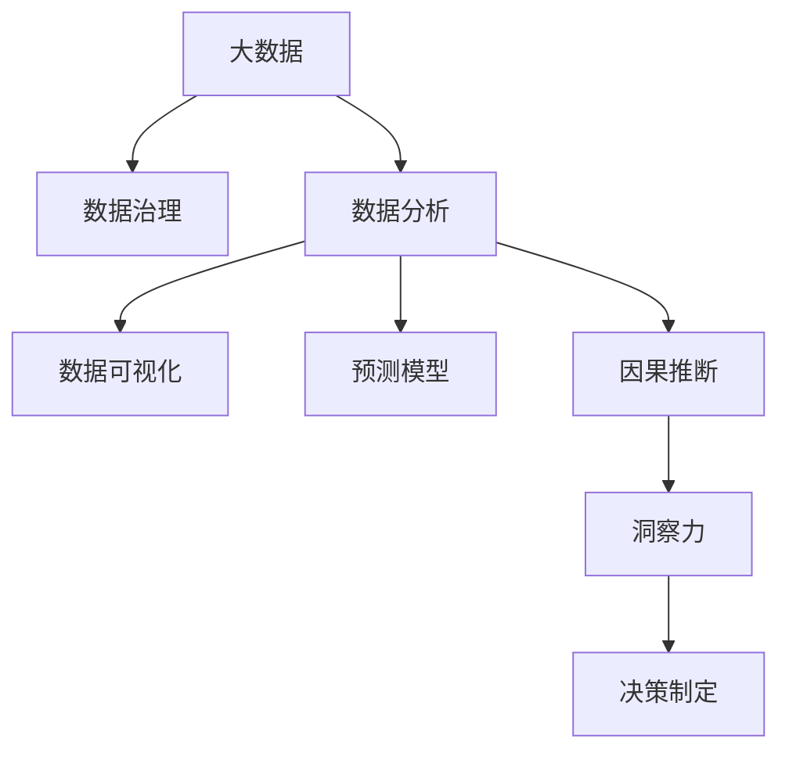

                 

# 理解洞察力的重要性：在不确定性中的价值

> 关键词：洞察力, 不确定性, 决策制定, 数据科学, 预测模型, 数据可视化

## 1. 背景介绍

### 1.1 问题由来
在当今快速变化和复杂多变的商业环境中，决策者常常面临高度不确定性和复杂性。无论是企业战略规划，还是市场趋势分析，抑或消费者行为预测，洞察力的缺失都可能带来重大的决策错误和损失。洞察力指的是通过对数据和信息深入分析，识别出有价值的模式、趋势和关联，从而做出更加准确和有依据的决策。它不仅仅是一种获取数据的能力，更是一种理解数据背后的逻辑、驱动和因果关系的能力。

### 1.2 问题核心关键点
洞察力在商业决策中的应用，主要体现在以下几个关键点上：

- **数据质量**：高质量、准确的数据是洞察力的基础，但现实中的数据往往存在噪音、偏差和不完整性。
- **分析工具**：先进的分析工具和技术是获取洞察力的手段，包括统计分析、机器学习和人工智能等。
- **人机协同**：在分析过程中，人类直觉和机器算法的有机结合才能产生更具深度的洞察力。
- **多维度分析**：结合时间、空间、行为等多个维度的数据分析，才能全面了解问题的本质。
- **预测与模拟**：通过构建预测模型和仿真环境，可以模拟未来情况，提升决策的预见性和鲁棒性。

### 1.3 问题研究意义
洞察力的重要性，在于其对于降低决策风险、优化资源配置、提高企业竞争力等方面的关键作用。具体而言，其研究意义如下：

- **风险规避**：通过洞察力，能够提前识别风险点，采取预防措施，减少潜在的损失。
- **资源优化**：洞察力能够帮助企业更有效地分配资源，提高投入产出比。
- **竞争优势**：在信息过载的时代，拥有敏锐的洞察力可以成为企业的核心竞争力。
- **创新驱动**：洞察力可以帮助企业发现新的市场机会和创新点，推动业务的持续增长。

## 2. 核心概念与联系

### 2.1 核心概念概述

为了更好地理解洞察力在商业决策中的应用，本节将介绍几个核心概念及其相互关系：

- **大数据**：指存储和处理的海量数据，是洞察力的主要数据来源。大数据的特点在于数据量大、多样性和高速流动。
- **数据治理**：指对数据进行清洗、标注、整合和保护的一系列过程，是确保数据质量的前提。
- **数据分析**：通过统计分析、机器学习和人工智能等方法，对数据进行深入挖掘和解释，是洞察力获取的主要手段。
- **可视化技术**：将数据通过图表、图形等方式直观展示，帮助决策者快速把握数据规律和趋势。
- **预测模型**：使用统计和机器学习模型，预测未来趋势和结果，为决策提供支持。
- **因果推断**：通过因果分析，识别数据背后的驱动因素和影响机制，提升洞察力的深度和可靠性。

这些概念之间的逻辑关系可以通过以下Mermaid流程图来展示：



这个流程图展示了大数据治理和数据分析与洞察力之间的联系：

1. 大数据经过数据治理，形成高质量数据集。
2. 数据分析手段将数据转化为可操作的洞察力。
3. 数据可视化将洞察力直观展示。
4. 预测模型基于洞察力进行未来预测。
5. 因果推断加深对洞察力的理解。
6. 洞察力支持决策制定，驱动实际行动。

## 3. 核心算法原理 & 具体操作步骤
### 3.1 算法原理概述

洞察力的获取，本质上是对数据和信息进行深度分析和理解的过程。其核心算法原理包括：

- **数据清洗与预处理**：通过数据清洗、特征工程等步骤，去除噪音和异常值，提取有用信息。
- **统计分析与描述性统计**：使用均值、方差、中位数等统计量，描述数据分布和特征。
- **机器学习与预测模型**：使用回归、分类、聚类等机器学习模型，预测未来趋势和结果。
- **因果推断与效果评估**：通过因果推断方法，识别因果关系，评估模型效果。
- **可视化与图表展示**：使用折线图、散点图、热力图等可视化手段，直观展示分析结果。

### 3.2 算法步骤详解

以下是获取洞察力的主要算法步骤：

**Step 1: 数据准备**
- 收集并整理数据，确保数据完整性、准确性和一致性。
- 进行数据清洗和预处理，包括去除重复值、处理缺失值、标准化数据等。
- 设计合适的数据结构，如数据表、数据框等，方便后续分析操作。

**Step 2: 数据分析**
- 进行统计分析，计算描述性统计量，理解数据基本特征。
- 使用可视化工具展示数据分布和趋势，识别异常点和关键特征。
- 应用机器学习模型进行预测和分类，构建预测模型。
- 使用因果推断方法，识别变量间的因果关系和驱动因素。

**Step 3: 洞察力提取**
- 综合分析结果，识别出关键的模式、趋势和关联，形成初步洞察力。
- 使用数据可视化技术，将洞察力结果直观展示，便于理解和沟通。
- 通过预测模型，评估洞察力对未来的影响，提供决策依据。

**Step 4: 决策制定**
- 结合洞察力和业务经验，制定决策方案。
- 进行风险评估和模拟，优化决策策略。
- 实施决策并监控效果，不断调整和优化。

### 3.3 算法优缺点

获取洞察力的算法具有以下优点：

- **全面性**：通过多种分析方法结合，能够全面理解数据特征和趋势。
- **自动化**：机器学习模型可以自动化处理大量数据，提高效率。
- **灵活性**：可以根据具体问题选择合适的算法和技术，灵活应用。

但同时，这些算法也存在一些局限性：

- **数据依赖**：依赖高质量、完整的数据集，数据质量问题可能导致洞察力失真。
- **复杂性**：算法实现复杂，需要专业知识和技能。
- **解释性不足**：部分复杂算法模型难以解释其内部工作机制，可能降低决策可信度。

### 3.4 算法应用领域

洞察力的获取方法，广泛应用于各个商业领域，包括但不限于：

- **市场分析**：通过大数据分析，识别市场趋势、消费者行为和竞争态势。
- **金融风险管理**：利用预测模型，评估金融资产的风险和收益，制定风险控制策略。
- **客户关系管理**：通过数据分析，理解客户需求和行为，提升客户满意度和忠诚度。
- **供应链优化**：通过因果推断，优化供应链流程，提高效率和降低成本。
- **产品创新**：利用数据分析和预测，发现新的产品机会和创新点。

## 4. 数学模型和公式 & 详细讲解 & 举例说明

### 4.1 数学模型构建

洞察力的获取，通常涉及以下几个数学模型：

- **回归模型**：用于预测连续型变量，如时间序列预测、销售量预测等。
- **分类模型**：用于分类问题，如客户分类、信用评分等。
- **聚类模型**：用于发现数据中的自然分组，如客户细分、产品分类等。
- **因果推断模型**：用于识别变量间的因果关系，如政策变化对业绩的影响等。

### 4.2 公式推导过程

以回归模型为例，常用的线性回归模型公式为：

$$
y = \beta_0 + \beta_1 x_1 + \beta_2 x_2 + \ldots + \beta_p x_p + \epsilon
$$

其中 $y$ 为预测变量，$\beta_0$ 为截距项，$\beta_1, \beta_2, \ldots, \beta_p$ 为回归系数，$x_1, x_2, \ldots, x_p$ 为解释变量，$\epsilon$ 为误差项。

### 4.3 案例分析与讲解

考虑一个销售数据集，目标是预测下个月销售量。可以使用线性回归模型进行预测，具体步骤如下：

1. 收集销售数据，包括时间、产品类别、销售渠道等。
2. 进行数据清洗和预处理，去除噪音和异常值，标准化数据。
3. 构建特征工程，提取时间、季节性、促销活动等解释变量。
4. 使用线性回归模型进行训练和预测，计算回归系数和截距项。
5. 进行模型评估，计算MAE、RMSE等指标，判断预测准确度。
6. 可视化预测结果，绘制时间序列图，展示销售趋势。
7. 结合业务经验，调整模型参数，优化预测结果。

## 5. 项目实践：代码实例和详细解释说明
### 5.1 开发环境搭建

在进行洞察力获取的实践前，我们需要准备好开发环境。以下是使用Python进行项目开发的流程：

1. 安装Python：从官网下载并安装Python，选择适合的操作系统版本。
2. 安装必要的库：安装NumPy、Pandas、Matplotlib、Scikit-learn等数据科学和可视化库。
3. 准备数据集：收集和整理数据集，确保数据质量。
4. 创建虚拟环境：使用Virtualenv创建独立的Python环境，避免版本冲突。
5. 启动Jupyter Notebook：使用Jupyter Notebook进行交互式开发。

### 5.2 源代码详细实现

以销售数据集为例，使用Python实现线性回归模型的代码如下：

```python
import pandas as pd
import numpy as np
import matplotlib.pyplot as plt
from sklearn.linear_model import LinearRegression
from sklearn.metrics import mean_absolute_error, mean_squared_error

# 读取数据集
data = pd.read_csv('sales_data.csv')

# 数据清洗和预处理
data = data.dropna()
X = data[['time', 'seasonality', 'promotion']]
y = data['sales']

# 特征标准化
from sklearn.preprocessing import StandardScaler
scaler = StandardScaler()
X = scaler.fit_transform(X)

# 模型训练
model = LinearRegression()
model.fit(X, y)

# 模型预测
X_test = np.array([[1, 0, 0]])
y_pred = model.predict(X_test)

# 模型评估
mae = mean_absolute_error(y, y_pred)
rmse = mean_squared_error(y, y_pred, squared=False)
print(f'MAE: {mae:.2f}, RMSE: {rmse:.2f}')

# 可视化结果
plt.plot(data['time'], y, label='Actual')
plt.plot(data['time'], y_pred, label='Predicted')
plt.legend()
plt.show()
```

### 5.3 代码解读与分析

让我们详细解读一下代码实现中的关键步骤：

**数据加载和预处理**：
- 使用Pandas加载销售数据集。
- 进行数据清洗，去除缺失值。
- 设计特征工程，提取时间、季节性、促销活动等解释变量。
- 使用StandardScaler进行特征标准化，确保模型训练的公平性。

**模型训练和预测**：
- 使用LinearRegression训练线性回归模型。
- 使用训练好的模型进行预测，得到预测值。
- 使用mean_absolute_error和mean_squared_error评估模型预测的准确度。

**可视化结果**：
- 使用Matplotlib绘制时间序列图，展示实际销售量和预测值。
- 通过图表直观展示模型的预测效果。

## 6. 实际应用场景
### 6.1 智能客服系统

通过洞察力获取技术，智能客服系统可以实时分析客户反馈，发现潜在的客户需求和满意度问题。具体实现步骤如下：

1. 收集客服对话数据，包括对话文本、客户情绪等信息。
2. 进行数据分析，提取对话中的高频问题、常见场景和情感趋势。
3. 使用可视化工具展示情感分析结果，识别负面反馈和改进点。
4. 构建预测模型，预测客户满意度和流失率。
5. 根据预测结果，制定相应的客户关怀策略，提升客户体验。

### 6.2 金融风险管理

在金融风险管理中，洞察力可以帮助识别潜在的风险点，及时预警和应对。具体实现如下：

1. 收集金融市场数据，包括股票价格、汇率、利率等。
2. 进行因果推断，识别宏观经济变量对金融市场的影响。
3. 使用可视化工具展示因果关系图，直观展示关键驱动因素。
4. 构建预测模型，评估市场风险和波动性。
5. 根据预测结果，制定相应的风险控制和资产配置策略。

### 6.3 客户关系管理

通过洞察力获取技术，客户关系管理（CRM）系统可以更好地理解客户需求和行为，提升客户满意度和忠诚度。具体实现如下：

1. 收集客户互动数据，包括购买记录、社交媒体互动等。
2. 进行数据分析，识别客户购买偏好和行为模式。
3. 使用可视化工具展示客户细分结果，理解不同客户群体的需求。
4. 构建预测模型，预测客户流失率和推荐产品。
5. 根据预测结果，制定个性化营销和客户关怀策略。

### 6.4 未来应用展望

随着数据量的不断增长和技术的不断发展，洞察力的获取方法将进一步普及和深化，未来可能的应用场景包括：

- **医疗健康**：通过洞察力分析，发现疾病传播趋势，提升公共卫生决策。
- **城市管理**：通过数据挖掘，优化城市资源配置，提高城市治理效率。
- **农业生产**：通过洞察力分析，优化种植方案，提高农作物产量和质量。
- **环境保护**：通过数据分析，监测环境变化，制定环境保护策略。
- **智能制造**：通过洞察力分析，优化生产流程，提高制造业的智能化水平。

## 7. 工具和资源推荐
### 7.1 学习资源推荐

为了帮助开发者系统掌握洞察力的获取方法，以下是一些优质的学习资源：

1. 《Python数据科学手册》：详细介绍了Python在数据科学和机器学习中的应用，包括数据清洗、特征工程、模型训练等。
2. 《数据可视化实战》：介绍了多种数据可视化工具和技术，如Matplotlib、Seaborn、Tableau等。
3. 《因果推断导论》：介绍了因果推断的基本概念和应用，适合进阶学习。
4. 《机器学习实战》：提供了大量实际案例，帮助开发者理解机器学习模型的应用和实现。
5. Kaggle平台：提供了丰富的数据集和竞赛，适合实践和提升技能。

通过学习这些资源，相信你一定能够掌握洞察力的获取方法和技术，应用到实际项目中。

### 7.2 开发工具推荐

高效的开发离不开优秀的工具支持。以下是几款用于洞察力获取开发的常用工具：

1. Jupyter Notebook：交互式开发环境，适合进行数据分析和模型训练。
2. R语言：适合进行统计分析和数据可视化，拥有强大的数据处理能力。
3. Tableau：数据可视化工具，支持复杂的数据分析和图表展示。
4. Microsoft Excel：桌面端数据处理和分析工具，适合小规模数据集。
5. Google Colab：基于Jupyter Notebook的在线开发环境，免费提供GPU资源。

合理利用这些工具，可以显著提升洞察力获取任务的开发效率，加快创新迭代的步伐。

### 7.3 相关论文推荐

洞察力获取技术的发展源于学界的持续研究。以下是几篇奠基性的相关论文，推荐阅读：

1. "Machine Learning Yearning" by Andrew Ng：提供了机器学习和人工智能的实用指南，包括数据处理、模型训练和评估等内容。
2. "Introduction to Statistical Learning" by Gareth James et al.：详细介绍了统计学习和机器学习的基本概念和方法。
3. "The Elements of Statistical Learning" by Trevor Hastie et al.：深入介绍了统计学习方法和技术，适合进阶学习。
4. "Data Science for Business" by Foster Provost et al.：介绍了数据科学在商业决策中的应用，涵盖数据收集、分析和可视化等。
5. "The Anatomy of Social Media Analytics" by Rajan Grover et al.：介绍了社交媒体数据分析的方法和应用，适合在客户关系管理中使用。

通过学习这些前沿成果，可以帮助研究者把握学科前进方向，激发更多的创新灵感。

## 8. 总结：未来发展趋势与挑战
### 8.1 研究成果总结

洞察力的获取方法，在商业决策中的应用已经得到了广泛的验证。当前的研究成果主要体现在以下几个方面：

- **数据治理**：提出了多维数据治理框架，提升数据质量。
- **机器学习**：开发了多种高效机器学习模型，提高预测精度。
- **数据可视化**：研究了交互式可视化技术，提升数据分析的直观性和互动性。
- **因果推断**：提出了多种因果推断方法，提升洞察力的深度和可靠性。

### 8.2 未来发展趋势

洞察力的获取技术将在未来继续发展，主要趋势如下：

1. **自动化和智能化**：随着人工智能技术的发展，自动化的数据分析和预测将变得更加普遍。
2. **大数据技术**：随着大数据技术的发展，数据量将不断增长，洞察力获取将更加依赖于数据治理和自动化技术。
3. **实时分析**：随着实时计算和大数据技术的成熟，洞察力获取将变得更加实时和动态。
4. **多模态分析**：结合文本、图像、视频等多种数据类型，进行更全面的洞察力获取。
5. **人机协同**：结合人工智能和人类智慧，进行更深入的洞察力分析和解释。

### 8.3 面临的挑战

尽管洞察力的获取方法已经取得了一定的成果，但在实际应用中仍面临诸多挑战：

1. **数据质量**：数据质量和完整性仍是制约洞察力获取的主要瓶颈，需要进一步提升数据治理和清洗技术。
2. **算法复杂性**：现有的算法模型往往复杂且难以解释，需要进一步提升算法的可解释性和可操作性。
3. **隐私和安全**：数据隐私和安全问题逐渐凸显，需要制定相应的数据治理和安全策略。
4. **资源消耗**：大规模数据分析和预测需要大量计算资源，需要进一步优化资源消耗和算力成本。
5. **伦理和公平性**：洞察力的获取和应用需要考虑伦理和公平性问题，避免数据偏见和歧视。

### 8.4 研究展望

未来的研究需要在以下几个方面寻求新的突破：

1. **自动化数据分析**：开发更加自动化和智能化的数据分析工具，提升效率和准确性。
2. **多模态融合**：结合不同数据类型，进行多模态融合分析，提升洞察力的全面性和深度。
3. **因果关系推断**：深入研究因果推断方法，提升洞察力的可靠性和解释性。
4. **数据治理和隐私保护**：研究更加高效的数据治理和隐私保护技术，确保数据质量和安全性。
5. **算法可解释性**：开发更加可解释的算法模型，提升洞察力应用的透明度和可信度。

通过这些研究方向，我们相信洞察力的获取方法将不断提升，为商业决策提供更加科学和可靠的依据。相信未来洞察力的获取技术将更加普及和深化，推动人工智能技术在各个领域的广泛应用。

## 9. 附录：常见问题与解答

**Q1：什么是洞察力？**

A: 洞察力指的是通过对数据和信息深入分析，识别出有价值的模式、趋势和关联，从而做出更加准确和有依据的决策。它不仅仅是一种获取数据的能力，更是一种理解数据背后的逻辑、驱动和因果关系的能力。

**Q2：数据清洗和预处理有哪些步骤？**

A: 数据清洗和预处理一般包括以下步骤：
1. 去除重复值和异常值。
2. 处理缺失值，包括填补、删除或预测缺失值。
3. 标准化数据，如归一化、标准化等。
4. 特征工程，提取有用的特征和变量。
5. 数据整合，确保数据的一致性和完整性。

**Q3：什么是因果推断？**

A: 因果推断是一种统计学方法，用于识别变量之间的因果关系。其目的是理解因果关系，而不是仅仅描述相关性。因果推断可以通过随机控制实验、工具变量、差分法等方法实现。

**Q4：数据可视化有哪些方法？**

A: 数据可视化的方法包括但不限于：
1. 折线图：展示时间序列数据的变化趋势。
2. 散点图：展示两个变量之间的关系。
3. 热力图：展示多维数据的分布和密度。
4. 地图：展示地理数据的空间分布。
5. 3D图：展示三维数据的形态和变化。

**Q5：如何提升洞察力的获取效率？**

A: 提升洞察力获取效率的方法包括：
1. 自动化数据分析工具，减少手动操作。
2. 分布式计算和大数据技术，加速数据处理和分析。
3. 实时数据流处理，支持动态数据分析。
4. 数据预处理和特征工程，提升数据质量。
5. 可视化工具和交互式界面，提升数据分析的直观性和交互性。

通过合理利用这些工具和技术，我们相信洞察力的获取将变得更加高效和可靠，为商业决策提供更加坚实的科学依据。

---

作者：禅与计算机程序设计艺术 / Zen and the Art of Computer Programming

