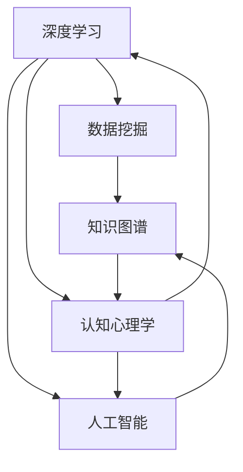

                 

# 理解洞察力的重要性：在不确定性中的导航

> 关键词：洞察力,不确定性,决策支持系统,深度学习,数据挖掘,统计学习,知识图谱,认知心理学,人工智能

## 1. 背景介绍

### 1.1 问题由来

在当今快速变化、信息爆炸的时代，不确定性已成为我们决策中不可避免的一部分。无论是个人决策还是企业战略制定，都面临着未知的挑战和复杂的局面。传统的决策方法和信息获取方式已难以应对复杂多变的环境。如何提高决策者的洞察力，在高度不确定的环境中导航，是当前研究者和决策者共同关注的重要课题。

洞察力（Insight）是指能够识别和理解事物间隐含关系，从而做出明智决策的能力。它不仅依赖于数据和事实，还需要深度思考、经验积累和创意思维。在人工智能和数据科学迅猛发展的背景下，通过技术手段辅助提升洞察力，成为了提高决策效率和准确性的新途径。

### 1.2 问题核心关键点

当前，技术手段在提升洞察力方面的应用主要集中在以下几个方面：

- 深度学习与神经网络：通过模型自动从大数据中挖掘出复杂关系和模式，支持预测和决策。
- 数据挖掘与机器学习：运用统计学习、分类、聚类等算法，从数据中提取出有价值的知识。
- 知识图谱与语义网络：通过构建实体关系图谱，为决策提供结构化的信息支持。
- 认知心理学与行为科学：理解决策者的认知过程，指导决策策略和工具的设计。
- 人工智能与智能决策系统：开发能够理解自然语言、执行推理任务的智能系统。

这些技术手段在提升洞察力方面展示了巨大的潜力，但也存在诸多局限。如何综合运用这些技术，开发出更加高效、可靠的决策支持系统，成为了新的研究挑战。

## 2. 核心概念与联系

### 2.1 核心概念概述

为更好地理解洞察力及其技术支持，本节将介绍几个关键概念及其相互关系：

- 深度学习（Deep Learning）：利用多层神经网络从数据中提取非线性关系，支持复杂模式识别和预测。
- 数据挖掘（Data Mining）：从大量数据中发现隐藏模式和知识，支持数据驱动的决策。
- 知识图谱（Knowledge Graph）：通过构建实体间的关系网络，为决策提供结构化信息支持。
- 认知心理学（Cognitive Psychology）：研究决策者认知过程、思维模式和决策行为，指导技术设计与应用。
- 人工智能（Artificial Intelligence）：模拟人脑进行逻辑推理和问题解决，支持智能决策系统。

这些概念之间的逻辑关系可以通过以下Mermaid流程图来展示：



这个流程图展示了大语言模型的核心概念及其之间的关系：

1. 深度学习通过模型自动从大数据中挖掘出复杂关系和模式，为数据挖掘提供技术支持。
2. 数据挖掘从大量数据中发现隐藏模式和知识，支持决策者从数据中获取洞察。
3. 知识图谱通过构建实体间的关系网络，为决策提供结构化信息支持。
4. 认知心理学研究决策者认知过程、思维模式和决策行为，指导技术设计与应用。
5. 人工智能模拟人脑进行逻辑推理和问题解决，支持智能决策系统。

这些核心概念共同构成了洞察力提升的技术框架，帮助决策者在高度不确定的环境中做出明智决策。

## 3. 核心算法原理 & 具体操作步骤
### 3.1 算法原理概述

提升洞察力的关键在于构建一个能够高效、准确地从数据中提取信息，支持决策者做出明智决策的算法。以下介绍几种常用的算法原理及其具体操作步骤：

- 深度学习算法：利用多层神经网络从数据中自动学习复杂关系，支持预测和分类任务。
- 数据挖掘算法：通过统计学习、分类、聚类等算法，从数据中挖掘出有价值的模式和知识。
- 知识图谱构建：通过实体关系抽取和知识整合，构建实体间的关系网络，支持结构化信息获取。
- 认知心理学模型：通过建模决策者的认知过程和思维模式，指导决策策略和工具的设计。
- 智能决策系统：通过模拟人脑进行逻辑推理和问题解决，支持智能决策和推荐。

### 3.2 算法步骤详解

深度学习算法步骤如下：

1. 数据预处理：清洗、归一化数据，并转化为模型可接受的格式。
2. 模型设计：选择合适的深度神经网络架构，如卷积神经网络（CNN）、循环神经网络（RNN）、Transformer等。
3. 模型训练：使用标注数据训练模型，最小化损失函数。
4. 模型评估：在验证集上评估模型性能，如准确率、召回率、F1-score等。
5. 模型部署：将训练好的模型部署到实际应用场景中，进行预测和决策支持。

数据挖掘算法步骤如下：

1. 数据收集：收集相关数据，确保数据质量和多样性。
2. 数据清洗：处理缺失值、异常值，确保数据完整性和一致性。
3. 数据预处理：进行归一化、降维、特征选择等预处理步骤。
4. 模型训练：选择合适的算法，如决策树、支持向量机（SVM）、随机森林等，训练模型。
5. 模型评估：在验证集上评估模型性能，选择最优模型。
6. 模型部署：将训练好的模型部署到实际应用场景中，进行预测和决策支持。

知识图谱构建步骤如下：

1. 实体抽取：从文本、图像、音频等多源数据中抽取实体，并进行标注。
2. 关系抽取：通过自然语言处理技术，抽取实体间的关系，如父子、上下游等。
3. 知识整合：将抽取的实体和关系整合到知识图谱中，构建实体间的关系网络。
4. 推理和查询：利用图谱推理技术，进行实体关系推断和信息查询。
5. 知识更新：定期更新知识图谱，确保其时效性和准确性。

认知心理学模型步骤如下：

1. 认知建模：基于认知心理学理论，建模决策者的认知过程和思维模式。
2. 模型训练：通过实验和数据收集，训练认知模型，优化参数。
3. 决策模拟：使用训练好的认知模型，进行决策模拟和行为预测。
4. 策略优化：基于模拟结果，优化决策策略和工具设计。

智能决策系统步骤如下：

1. 任务定义：明确决策任务和目标，如股票交易、医疗诊断等。
2. 数据收集：收集相关数据，确保数据质量和多样性。
3. 模型设计：选择合适的算法和模型，如专家系统、遗传算法等。
4. 模型训练：使用标注数据训练模型，最小化损失函数。
5. 模型评估：在验证集上评估模型性能，选择最优模型。
6. 模型部署：将训练好的模型部署到实际应用场景中，进行预测和决策支持。

### 3.3 算法优缺点

深度学习算法优点：

1. 自动学习复杂关系：利用多层神经网络，自动从数据中学习复杂模式和关系。
2. 高效处理大数据：适用于大规模数据集，支持高效的特征提取和模式识别。
3. 灵活性强：可以通过调整网络结构、参数等进行模型优化。

深度学习算法缺点：

1. 数据需求量大：需要大量标注数据进行训练，获取数据成本高。
2. 模型复杂：深层网络参数众多，训练和优化过程复杂。
3. 过拟合风险高：容易出现过拟合现象，需要大量正则化技术进行防范。

数据挖掘算法优点：

1. 适用范围广：适用于各类数据挖掘任务，如分类、聚类、关联规则挖掘等。
2. 模型可解释性强：可以通过特征工程和算法优化，提高模型的可解释性。
3. 处理速度快：适用于小规模数据集，处理速度快。

数据挖掘算法缺点：

1. 数据依赖性强：需要大量高质量标注数据进行训练，数据获取成本高。
2. 模型复杂性：部分算法复杂度较高，难以理解和调试。
3. 特征工程困难：数据预处理和特征选择过程繁琐，需要专业知识。

知识图谱构建优点：

1. 结构化信息支持：提供结构化信息支持，便于信息查询和推理。
2. 知识表达能力强：通过关系抽取和整合，支持复杂的知识表达和推理。
3. 可扩展性强：可以不断更新和扩展知识图谱，支持知识积累。

知识图谱构建缺点：

1. 数据质量要求高：需要高质量的数据和标注，获取数据成本高。
2. 知识整合复杂：需要复杂的算法和技术支持，知识整合难度大。
3. 推理复杂：推理过程复杂，需要高效的推理引擎支持。

认知心理学模型优点：

1. 决策模拟效果好：能够模拟决策者的认知过程，优化决策策略。
2. 决策过程透明：通过建模决策者的认知过程，提高决策过程的透明度。
3. 可解释性强：决策过程和结果具有较高的可解释性。

认知心理学模型缺点：

1. 数据需求量大：需要大量实验数据和心理学知识进行建模，获取数据成本高。
2. 模型复杂性：建模过程复杂，需要深厚的心理学和计算知识。
3. 实验周期长：模型训练和优化过程需要大量实验数据和长时间周期。

智能决策系统优点：

1. 决策支持能力强：支持基于规则和知识的决策，决策过程透明。
2. 自动推理能力强：能够自动进行推理和决策，提升决策效率。
3. 可扩展性强：支持多种决策任务和领域，易于扩展和应用。

智能决策系统缺点：

1. 数据需求量大：需要大量标注数据进行训练，获取数据成本高。
2. 规则复杂：决策规则和知识库需要手工构建，维护成本高。
3. 系统复杂：需要多学科知识支持，系统开发和维护复杂。

### 3.4 算法应用领域

深度学习算法适用于各类预测和分类任务，如自然语言处理、计算机视觉、语音识别等。

数据挖掘算法适用于各类数据挖掘任务，如市场分析、客户行为分析、信用评分等。

知识图谱构建适用于各类信息查询和推理任务，如医疗信息查询、推荐系统、智能客服等。

认知心理学模型适用于各类决策支持和模拟任务，如医疗诊断、金融分析、人力资源管理等。

智能决策系统适用于各类自动决策和推荐任务，如股票交易、客户推荐、智能客服等。

## 4. 数学模型和公式 & 详细讲解 & 举例说明

### 4.1 数学模型构建

本节将使用数学语言对洞察力提升的技术模型进行更加严格的刻画。

假设深度学习模型为 $M_{\theta}$，其中 $\theta$ 为模型参数。数据集为 $\{(x_i,y_i)\}_{i=1}^N$，其中 $x_i$ 为输入，$y_i$ 为标签。

定义模型的损失函数为 $\ell(M_{\theta}(x),y)$，经验风险为：

$$
\mathcal{L}(\theta) = \frac{1}{N} \sum_{i=1}^N \ell(M_{\theta}(x_i),y_i)
$$

通过梯度下降等优化算法，最小化损失函数 $\mathcal{L}$，更新模型参数 $\theta$：

$$
\theta \leftarrow \theta - \eta \nabla_{\theta}\mathcal{L}(\theta)
$$

其中 $\eta$ 为学习率，$\nabla_{\theta}\mathcal{L}(\theta)$ 为损失函数对参数 $\theta$ 的梯度。

### 4.2 公式推导过程

以下我们以深度学习算法为例，推导其数学模型和优化过程。

假设模型为多层次的神经网络 $M_{\theta}(x)$，其中 $x \in \mathbb{R}^d$ 为输入向量，$\theta \in \mathbb{R}^{D_1 \times D_2}$ 为模型参数。损失函数为交叉熵损失，定义为：

$$
\ell(M_{\theta}(x),y) = -y\log M_{\theta}(x) + (1-y)\log(1-M_{\theta}(x))
$$

经验风险为：

$$
\mathcal{L}(\theta) = -\frac{1}{N} \sum_{i=1}^N [y_i\log M_{\theta}(x_i)+(1-y_i)\log(1-M_{\theta}(x_i))]
$$

通过反向传播算法计算损失函数对参数 $\theta$ 的梯度：

$$
\nabla_{\theta}\mathcal{L}(\theta) = \frac{1}{N} \sum_{i=1}^N \nabla_{\theta}[\ell(M_{\theta}(x_i),y_i)]
$$

其中 $\nabla_{\theta}[\ell(M_{\theta}(x_i),y_i)]$ 为损失函数对模型输出的梯度，可以通过反向传播计算。

最终，使用梯度下降等优化算法更新模型参数：

$$
\theta \leftarrow \theta - \eta \nabla_{\theta}\mathcal{L}(\theta)
$$

### 4.3 案例分析与讲解

以自然语言处理任务为例，分析深度学习模型的构建和优化过程。

假设任务为文本分类，模型为卷积神经网络（CNN），输入为文本向量 $x \in \mathbb{R}^{n \times d}$，其中 $n$ 为输入文本长度，$d$ 为词向量维度。模型的输出为分类概率 $M_{\theta}(x) \in \mathbb{R}^C$，其中 $C$ 为分类数。

模型的损失函数为交叉熵损失：

$$
\ell(M_{\theta}(x),y) = -\sum_{i=1}^C y_i\log M_{\theta}(x)_i
$$

经验风险为：

$$
\mathcal{L}(\theta) = -\frac{1}{N} \sum_{i=1}^N \ell(M_{\theta}(x_i),y_i)
$$

使用反向传播算法计算损失函数对模型参数的梯度：

$$
\nabla_{\theta}\mathcal{L}(\theta) = \frac{1}{N} \sum_{i=1}^N \nabla_{\theta}[\ell(M_{\theta}(x_i),y_i)]
$$

其中 $\nabla_{\theta}[\ell(M_{\theta}(x_i),y_i)]$ 为损失函数对模型输出的梯度，可以通过反向传播计算。

最终，使用梯度下降等优化算法更新模型参数：

$$
\theta \leftarrow \theta - \eta \nabla_{\theta}\mathcal{L}(\theta)
$$

其中 $\eta$ 为学习率，通常设置为 $10^{-3}$ 到 $10^{-4}$ 之间。

## 5. 项目实践：代码实例和详细解释说明
### 5.1 开发环境搭建

在进行洞察力提升的深度学习实践前，我们需要准备好开发环境。以下是使用Python进行TensorFlow开发的环境配置流程：

1. 安装Anaconda：从官网下载并安装Anaconda，用于创建独立的Python环境。

2. 创建并激活虚拟环境：
```bash
conda create -n tensorflow-env python=3.8 
conda activate tensorflow-env
```

3. 安装TensorFlow：根据CUDA版本，从官网获取对应的安装命令。例如：
```bash
conda install tensorflow tensorflow-gpu=cuda11.1 -c conda-forge -c pypi
```

4. 安装各类工具包：
```bash
pip install numpy pandas scikit-learn matplotlib tqdm jupyter notebook ipython
```

完成上述步骤后，即可在`tensorflow-env`环境中开始洞察力提升的深度学习实践。

### 5.2 源代码详细实现

这里我们以图像分类任务为例，给出使用TensorFlow对卷积神经网络进行深度学习实践的PyTorch代码实现。

首先，定义图像分类任务的数据处理函数：

```python
import tensorflow as tf
from tensorflow.keras.preprocessing.image import ImageDataGenerator
from tensorflow.keras.layers import Conv2D, MaxPooling2D, Flatten, Dense, Dropout
from tensorflow.keras.models import Sequential

def data_preprocessing():
    train_datagen = ImageDataGenerator(
        rescale=1./255,
        shear_range=0.2,
        zoom_range=0.2,
        horizontal_flip=True)
    test_datagen = ImageDataGenerator(rescale=1./255)
    train_generator = train_datagen.flow_from_directory(
        'train/',
        target_size=(224, 224),
        batch_size=32,
        class_mode='categorical')
    test_generator = test_datagen.flow_from_directory(
        'test/',
        target_size=(224, 224),
        batch_size=32,
        class_mode='categorical')
    return train_generator, test_generator
```

然后，定义卷积神经网络模型：

```python
def model():
    model = Sequential()
    model.add(Conv2D(32, (3, 3), activation='relu', input_shape=(224, 224, 3)))
    model.add(MaxPooling2D((2, 2)))
    model.add(Conv2D(64, (3, 3), activation='relu'))
    model.add(MaxPooling2D((2, 2)))
    model.add(Conv2D(128, (3, 3), activation='relu'))
    model.add(MaxPooling2D((2, 2)))
    model.add(Flatten())
    model.add(Dense(64, activation='relu'))
    model.add(Dropout(0.5))
    model.add(Dense(10, activation='softmax'))
    return model
```

接着，定义训练和评估函数：

```python
from tensorflow.keras.optimizers import Adam

def train_epoch(model, generator, batch_size, optimizer):
    model.compile(optimizer=optimizer, loss='categorical_crossentropy', metrics=['accuracy'])
    model.fit_generator(generator, steps_per_epoch=train_generator.n // 32, epochs=5)
    return model.evaluate_generator(test_generator, steps=test_generator.n // 32)

def evaluate(model, generator, batch_size):
    model.compile(optimizer=Adam(), loss='categorical_crossentropy', metrics=['accuracy'])
    loss, accuracy = model.evaluate_generator(generator, steps=test_generator.n // 32)
    print(f'Test accuracy: {accuracy:.2f}')
```

最后，启动训练流程并在测试集上评估：

```python
epochs = 5
batch_size = 32

train_generator, test_generator = data_preprocessing()

for epoch in range(epochs):
    model = model()
    optimizer = Adam(lr=0.001)
    loss, accuracy = train_epoch(model, train_generator, batch_size, optimizer)
    print(f'Epoch {epoch+1}, train loss: {loss:.3f}')
    
    print(f'Epoch {epoch+1}, test accuracy: {accuracy:.2f}')
    
print(f'Final test accuracy: {evaluate(model, test_generator, batch_size)}')
```

以上就是使用TensorFlow对卷积神经网络进行图像分类任务深度学习的完整代码实现。可以看到，得益于TensorFlow的强大封装，我们可以用相对简洁的代码完成深度学习模型的训练和评估。

### 5.3 代码解读与分析

让我们再详细解读一下关键代码的实现细节：

**data_preprocessing函数**：
- `train_datagen`和`test_datagen`：定义数据增强和归一化过程，防止模型过拟合。
- `train_generator`和`test_generator`：使用`flow_from_directory`函数加载数据集，并进行批次化处理。
- 返回处理后的训练集和测试集数据生成器。

**model函数**：
- 定义卷积神经网络模型，包含卷积、池化、全连接等基本层。
- 使用`Sequential`模型，按顺序添加各层，支持快速定义模型。
- 添加Dropout层，防止过拟合。

**train_epoch和evaluate函数**：
- `model.compile`：定义模型的优化器、损失函数和评估指标。
- `model.fit_generator`和`model.evaluate_generator`：使用数据生成器进行模型训练和评估，适合处理大规模数据集。
- 训练过程中打印训练损失和测试准确率，评估过程中打印测试准确率。

**训练流程**：
- 定义总的epoch数和batch size，开始循环迭代
- 每个epoch内，先在训练集上训练，输出训练损失和测试准确率
- 所有epoch结束后，输出最终测试准确率

可以看到，TensorFlow配合Keras库使得深度学习模型的实现变得简洁高效。开发者可以将更多精力放在数据处理、模型改进等高层逻辑上，而不必过多关注底层的实现细节。

当然，工业级的系统实现还需考虑更多因素，如模型的保存和部署、超参数的自动搜索、更灵活的任务适配层等。但核心的深度学习模型构建范式基本与此类似。

## 6. 实际应用场景
### 6.1 智能推荐系统

基于深度学习和大数据分析，智能推荐系统能够根据用户的浏览历史、评分记录等数据，推荐用户可能感兴趣的商品、内容等。深度学习算法在大规模数据上的自动学习和提取能力，能够帮助推荐系统识别用户偏好，提升推荐准确率。

在技术实现上，可以收集用户的行为数据，提取商品、内容等特征向量，构建用户-商品、内容关系图谱。将图谱数据输入深度学习模型进行训练，学习用户对商品、内容的兴趣关系。在生成推荐列表时，先用用户历史数据作为输入，由模型预测用户对各商品、内容的兴趣评分，再结合其他特征综合排序，便可以得到个性化程度更高的推荐结果。

### 6.2 金融风险管理

深度学习和大数据分析在金融风险管理中也具有广泛应用。通过分析历史交易数据和市场行情，深度学习模型能够识别出潜在的风险因素和投资机会。利用图谱构建和知识抽取技术，将市场信息与公司财务、宏观经济等数据整合，进行综合分析。智能决策系统通过模拟人脑的逻辑推理和问题解决过程，自动生成风险评估和投资建议。

在技术实现上，可以收集金融市场的历史数据和新闻资讯，使用深度学习模型自动提取市场波动、情绪变化等特征。通过图谱构建技术，将市场信息与公司财务、宏观经济等数据整合，进行综合分析。智能决策系统通过模拟人脑的逻辑推理和问题解决过程，自动生成风险评估和投资建议。

### 6.3 医疗诊断支持

医疗领域需要快速准确地诊断疾病，深度学习和大数据分析在此基础上发挥了重要作用。通过分析病人的历史病历和实验室检查数据，深度学习模型能够自动诊断疾病，提供治疗建议。利用知识图谱构建和推理技术，将病人的症状、病史与疾病关系整合，进行综合分析。智能决策系统通过模拟人脑的逻辑推理和问题解决过程，自动生成诊断和推荐。

在技术实现上，可以收集病人的历史病历和实验室检查数据，使用深度学习模型自动提取症状、病史等特征。通过知识图谱构建技术，将病人的症状、病史与疾病关系整合，进行综合分析。智能决策系统通过模拟人脑的逻辑推理和问题解决过程，自动生成诊断和推荐。

### 6.4 未来应用展望

随着深度学习和大数据分析技术的不断发展，其在提升洞察力方面的应用也将不断深化。未来，大模型微调技术在提升决策洞察力方面的应用前景广阔。

在智慧医疗领域，基于深度学习的诊断系统将显著提升疾病诊断的准确性和效率，辅助医生诊疗，提升医疗服务的智能化水平。

在智能推荐系统领域，深度学习和大数据分析将进一步提升推荐系统的个性化程度和准确率，为用户带来更优质的服务体验。

在金融风险管理领域，深度学习和大数据分析将帮助金融机构识别潜在风险，提高市场预测的准确性，降低投资损失。

在医疗诊断支持领域，深度学习和大数据分析将提升医疗诊断的准确性和效率，辅助医生诊疗，提升医疗服务的智能化水平。

此外，在智能客服、智慧城市治理、物流管理等众多领域，深度学习和大数据分析也将发挥重要作用，带来新的变革和机遇。相信随着技术的日益成熟，深度学习和大数据分析必将在提升洞察力方面发挥更大的作用，为人类社会的各个领域带来深远的影响。

## 7. 工具和资源推荐
### 7.1 学习资源推荐

为了帮助开发者系统掌握深度学习和大数据分析的理论基础和实践技巧，这里推荐一些优质的学习资源：

1. 《深度学习》书籍：由Ian Goodfellow等编写，全面介绍了深度学习的理论基础和实践方法。

2. 《机器学习实战》书籍：由Peter Harrington编写，通过实际案例和代码讲解机器学习算法。

3. 《TensorFlow官方文档》：TensorFlow的官方文档，提供了完整的模型构建、训练和推理流程。

4. Kaggle：全球最大的数据科学竞赛平台，提供海量数据集和开源代码，是学习深度学习的绝佳资源。

5. Coursera：提供各类深度学习和大数据分析课程，由世界顶级大学和公司开设。

通过对这些资源的学习实践，相信你一定能够快速掌握深度学习和大数据分析的精髓，并用于解决实际的洞察力提升问题。

### 7.2 开发工具推荐

高效的开发离不开优秀的工具支持。以下是几款用于深度学习和数据分析开发的常用工具：

1. TensorFlow：由Google主导开发的深度学习框架，支持分布式计算和GPU加速，适合大规模模型训练。

2. PyTorch：由Facebook主导开发的深度学习框架，支持动态计算图，适合研究和原型开发。

3. Keras：高级神经网络API，支持TensorFlow、Theano、CNTK等后端，方便模型构建和训练。

4. Jupyter Notebook：交互式编程环境，支持代码编写、数据可视化、模型训练等。

5. Hadoop、Spark：大数据处理框架，支持大规模数据集的处理和分析。

6. Tableau：数据可视化工具，支持复杂数据集的探索和分析。

合理利用这些工具，可以显著提升深度学习和数据分析的开发效率，加速创新迭代的步伐。

### 7.3 相关论文推荐

深度学习和大数据分析技术的发展源于学界的持续研究。以下是几篇奠基性的相关论文，推荐阅读：

1. Deep Learning（《深度学习》）：Ian Goodfellow等，全面介绍了深度学习的理论基础和实践方法。

2. Reinforcement Learning: An Introduction（《强化学习：入门与进阶》）：Richard S. Sutton等，介绍了强化学习的基本原理和应用。

3. Google's Guiding Principles for Designing Recommendation Systems（《谷歌推荐系统设计原则》）：Nick Berry等，介绍了推荐系统的设计方法和实践经验。

4. Deep Learning for Healthcare（《深度学习在医疗中的应用》）：Peter J. Ramadge等，介绍了深度学习在医疗领域的应用前景和挑战。

5. Knowledge-Driven Recommender Systems（《知识驱动的推荐系统》）：Jonathan Y. Harizanov等，介绍了知识图谱在推荐系统中的应用。

这些论文代表了大模型微调技术的发展脉络。通过学习这些前沿成果，可以帮助研究者把握学科前进方向，激发更多的创新灵感。

## 8. 总结：未来发展趋势与挑战

### 8.1 总结

本文对深度学习和大数据分析在提升洞察力方面的应用进行了全面系统的介绍。首先阐述了深度学习和大数据分析在决策支持中的重要作用，明确了其提升决策洞察力的独特价值。其次，从原理到实践，详细讲解了深度学习和大数据分析的数学模型和关键步骤，给出了深度学习和大数据分析的完整代码实例。同时，本文还广泛探讨了深度学习和大数据分析在智能推荐、金融风险管理、医疗诊断等诸多领域的应用前景，展示了其巨大的潜力。此外，本文精选了深度学习和大数据分析的相关学习资源，力求为读者提供全方位的技术指引。

通过本文的系统梳理，可以看到，深度学习和大数据分析在提升洞察力方面展示了巨大的潜力，极大地拓展了决策支持系统的应用边界，为决策者提供了强有力的技术支持。未来，伴随深度学习和大数据分析技术的持续演进，其在提升决策洞察力方面的应用前景广阔，必将深刻影响各个领域的发展进程。

### 8.2 未来发展趋势

展望未来，深度学习和大数据分析技术将呈现以下几个发展趋势：

1. 模型规模持续增大：随着算力成本的下降和数据规模的扩张，深度学习模型的参数量还将持续增长。超大规模模型蕴含的丰富知识，有望支持更加复杂多变的决策任务。

2. 数据依赖性降低：深度学习算法正在向轻量级、高效能方向发展，如联邦学习、边缘计算等，减少对大规模数据的依赖，提升实时性。

3. 跨领域知识融合：通过知识图谱构建和整合，将不同领域的数据和知识融合，提升决策系统的综合能力。

4. 知识驱动的决策：深度学习模型正在向更加智能、可解释的方向发展，引入更多先验知识，提升决策系统的透明性和可靠性。

5. 自动推理与决策：深度学习模型正在向具有自动推理和决策能力的方向发展，通过模拟人脑的逻辑推理过程，提升决策的自动化水平。

6. 人机协同决策：深度学习和大数据分析正在向人机协同的方向发展，通过增强决策者的认知能力，提升决策系统的整体效能。

以上趋势凸显了深度学习和大数据分析技术的广阔前景。这些方向的探索发展，必将进一步提升决策支持系统的性能和应用范围，为人类决策提供更加精准、高效的技术支持。

### 8.3 面临的挑战

尽管深度学习和大数据分析技术已经取得了瞩目成就，但在迈向更加智能化、普适化应用的过程中，它们仍面临着诸多挑战：

1. 数据需求量大：深度学习模型需要大量标注数据进行训练，数据获取成本高。

2. 模型复杂度高：深度学习模型参数众多，训练和优化过程复杂。

3. 可解释性不足：深度学习模型往往被视为“黑盒”系统，难以解释其内部工作机制和决策逻辑。

4. 对抗性攻击风险：深度学习模型容易受到对抗性样本的攻击，输出结果不可靠。

5. 跨领域适应性差：深度学习模型通常适用于特定领域的数据集，跨领域适应性较差。

6. 数据隐私和安全：深度学习模型在处理敏感数据时，需要考虑数据隐私和安全问题，防止数据泄露和滥用。

正视深度学习和大数据分析面临的这些挑战，积极应对并寻求突破，将是大模型微调走向成熟的必由之路。相信随着学界和产业界的共同努力，这些挑战终将一一被克服，深度学习和大数据分析必将在提升决策洞察力方面发挥更大的作用。

### 8.4 未来突破

面对深度学习和大数据分析所面临的种种挑战，未来的研究需要在以下几个方面寻求新的突破：

1. 数据高效获取：探索数据高效获取和标注方法，如自动标注、主动学习等，减少对大规模标注数据的依赖。

2. 模型简化与优化：开发更加简单高效、可解释性强的模型结构，如轻量级网络、联邦学习等，提升模型的实际应用价值。

3. 多领域知识融合：探索知识图谱构建和整合技术，将不同领域的数据和知识融合，提升决策系统的综合能力。

4. 知识驱动的决策：引入更多先验知识，如符号知识、规则库等，指导深度学习模型的训练和推理过程，提升决策系统的透明性和可靠性。

5. 自动推理与决策：开发具有自动推理和决策能力的深度学习模型，通过模拟人脑的逻辑推理过程，提升决策的自动化水平。

6. 人机协同决策：通过增强决策者的认知能力，提升决策系统的整体效能，构建人机协同的决策系统。

这些研究方向的探索，必将引领深度学习和大数据分析技术迈向更高的台阶，为决策者提供更加精准、高效的技术支持。面向未来，深度学习和大数据分析技术还需要与其他人工智能技术进行更深入的融合，如知识表示、因果推理、强化学习等，多路径协同发力，共同推动决策系统的进步。只有勇于创新、敢于突破，才能不断拓展深度学习和大数据分析的边界，让智能决策技术更好地服务于人类社会的各个领域。

## 9. 附录：常见问题与解答

**Q1：深度学习模型是否适用于所有决策任务？**

A: 深度学习模型适用于各类决策任务，特别是在数据量较大、特征复杂的情况下。但对于一些特定领域的决策任务，如医疗、金融等，模型通常需要更多先验知识进行指导。

**Q2：深度学习模型是否容易被对抗性样本攻击？**

A: 深度学习模型在处理对抗性样本时，容易出现输出结果不可靠的情况。为了提升模型的鲁棒性，可以采用对抗性训练、对抗样本生成等技术进行防范。

**Q3：深度学习模型的可解释性如何提升？**

A: 提升深度学习模型的可解释性，可以通过引入先验知识、简化模型结构、增加中间层输出等方法。同时，可视化工具和技术也能帮助理解模型的决策过程。

**Q4：深度学习模型如何实现跨领域知识融合？**

A: 深度学习模型可以通过知识图谱构建和整合技术，将不同领域的数据和知识融合。同时，可以通过多任务学习、迁移学习等方法，提升模型的跨领域适应性。

**Q5：如何提高深度学习模型的数据获取效率？**

A: 数据高效获取可以通过自动标注、数据增强、主动学习等方法进行。同时，利用联邦学习、边缘计算等技术，减少对大规模数据集的依赖。

这些问题的回答，展示了深度学习和大数据分析在实际应用中的关键挑战和解决方案。相信随着技术的发展，这些问题终将一一得到解决，深度学习和大数据分析必将在提升决策洞察力方面发挥更大的作用。

---

作者：禅与计算机程序设计艺术 / Zen and the Art of Computer Programming

