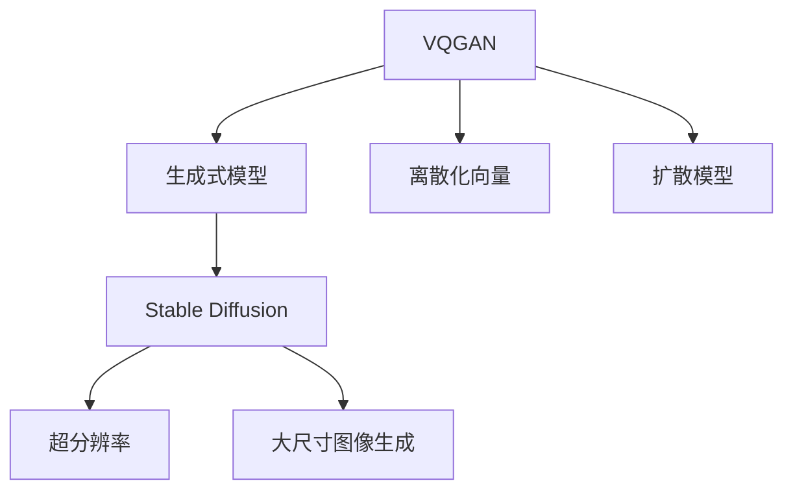

                 

# 生成式AI艺术：VQGAN与Stable Diffusion解析

> 关键词：生成式AI, VQGAN, Stable Diffusion, 超分辨率, 艺术创作

## 1. 背景介绍

生成式AI艺术领域近年来的发展引人注目，其中VQGAN和Stable Diffusion是两个非常重要的里程碑技术。VQGAN通过离散化的向量量化方法，为高保真度的生成模型提供了新的解决方案，大幅提升了生成图像的质量。Stable Diffusion则在此基础上进一步优化了扩散模型，实现了超分辨率和大尺寸生成，开辟了生成式AI艺术的新纪元。本文将全面解析这两个技术的原理与实践，并探讨其应用场景与未来发展方向。

## 2. 核心概念与联系

### 2.1 核心概念概述

为了更好地理解VQGAN与Stable Diffusion的原理与应用，我们首先需要了解几个关键概念：

- **VQGAN（向量量化生成对抗网络）**：一种基于离散化向量的生成模型，通过将连续的图像数据映射到离散化的向量空间，实现高质量的图像生成。

- **Stable Diffusion**：一种基于扩散模型的生成模型，通过对目标图像进行迭代式采样，逐步生成高保真度的图像，特别适用于超分辨率和大尺寸图像生成。

- **扩散模型（Diffusion Model）**：一类基于噪声逐渐移除的过程进行图像生成的模型，包括扩散自编码器和扩散对抗网络。

- **生成对抗网络（GANs）**：由生成器和判别器组成的对抗性训练结构，通过无监督学习生成新的图像数据。

- **自回归模型（Auto-Regressive Model）**：一类通过依赖前文信息进行生成预测的模型，如自回归语言模型。

这些概念之间的逻辑关系可以通过以下Mermaid流程图来展示：



这个流程图展示了大语言模型的核心概念及其之间的关系：

1. VQGAN将连续的图像数据离散化为向量，提升生成图像的质量。
2. 扩散模型通过噪声移除逐步生成图像，适用于超分辨率和大尺寸图像生成。
3. Stable Diffusion是基于扩散模型的生成模型，进一步提升了生成图像的质量。

## 3. 核心算法原理 & 具体操作步骤

### 3.1 算法原理概述

VQGAN与Stable Diffusion的原理分别基于离散化的向量量化和扩散模型。

**VQGAN**：
VQGAN通过将高维连续图像数据离散化为低维离散向量，从而在降低计算复杂度的同时，提升了生成图像的质量。具体步骤如下：
1. 将输入图像进行量化，得到一组离散向量。
2. 使用生成对抗网络（GAN）对这些向量进行编码，得到噪声向量。
3. 将噪声向量解码回图像，生成新的图像数据。

**Stable Diffusion**：
Stable Diffusion是一种基于扩散模型的生成方法，通过逐步减少噪声并增加图像细节，生成高质量的图像。具体步骤如下：
1. 初始化一个高维噪声向量。
2. 通过迭代扩散过程，逐步移除噪声，生成中间状态的图像。
3. 最终得到高质量的生成图像。

### 3.2 算法步骤详解

**VQGAN的详细步骤**：

1. **量化过程**：使用K-means算法将输入图像的像素值量化为离散向量。具体步骤如下：
   - 对输入图像的每个像素进行聚类，找到最近的向量表示。
   - 计算每个像素的向量表示，得到一组离散向量 $z$。

   $$
   z = K-means(x)
   $$

2. **生成过程**：使用生成对抗网络（GAN）对离散向量 $z$ 进行编码，生成噪声向量 $g$。
   - 使用生成器 $G(z)$ 将离散向量 $z$ 解码为噪声向量 $g$。
   - 使用判别器 $D(g)$ 评估噪声向量 $g$ 的真实性。
   - 通过对抗训练，更新生成器和判别器的权重，使生成器生成的噪声向量更加真实。

   $$
   \begin{aligned}
   g &= G(z) \\
   p &= D(g)
   \end{aligned}
   $$

3. **解码过程**：使用解码器对噪声向量 $g$ 进行解码，生成新的图像数据。
   - 使用解码器 $D(g)$ 将噪声向量 $g$ 解码为图像 $x'$。
   - 计算原始图像 $x$ 与生成图像 $x'$ 之间的差异，调整生成器的权重，使生成图像更加接近原始图像。

   $$
   x' = D(g)
   $$

**Stable Diffusion的详细步骤**：

1. **初始化过程**：随机生成一个高维噪声向量 $z$。
   - 将高维噪声向量 $z$ 初始化为一个随机的向量。

2. **扩散过程**：通过迭代过程，逐步移除噪声向量中的噪声，生成中间状态的图像。
   - 每次迭代，将噪声向量 $z$ 乘以一个小系数 $\beta$，得到新的噪声向量 $z'$。
   - 使用扩散模型 $F(z')$ 将噪声向量 $z'$ 解码为中间状态的图像。
   - 将中间状态的图像与目标图像 $y$ 进行对比，计算损失函数 $L(y, x)$，调整模型参数。

3. **解码过程**：最终得到高质量的生成图像。
   - 重复多次扩散过程，逐步生成高质量的生成图像 $x$。

### 3.3 算法优缺点

**VQGAN**：
- **优点**：
  - 将高维连续图像数据离散化为低维离散向量，大大降低了计算复杂度。
  - 生成的图像质量较高，适用于高保真度的图像生成。
- **缺点**：
  - 量化过程复杂，需要大量的聚类计算。
  - 对噪声向量的生成要求较高，需要高质量的生成对抗网络。

**Stable Diffusion**：
- **优点**：
  - 适用于超分辨率和大尺寸图像生成，生成过程迭代次数少。
  - 生成图像质量高，适应性强。
- **缺点**：
  - 计算复杂度较高，需要大量的计算资源。
  - 对于噪声向量的生成要求较高，需要高质量的扩散模型。

### 3.4 算法应用领域

VQGAN与Stable Diffusion在图像生成、超分辨率、艺术创作等领域有广泛的应用：

- **图像生成**：VQGAN与Stable Diffusion可以用于生成高质量的图像数据，为图像处理、计算机视觉等应用提供支持。
- **超分辨率**：VQGAN与Stable Diffusion可以用于高分辨率图像的生成，提升图像清晰度，改善用户体验。
- **艺术创作**：VQGAN与Stable Diffusion可以用于艺术创作，生成独特的艺术作品，为创意产业提供支持。
- **游戏开发**：VQGAN与Stable Diffusion可以用于游戏场景的生成，提升游戏视觉效果，增加游戏体验。

## 4. 数学模型和公式 & 详细讲解

### 4.1 数学模型构建

在VQGAN中，离散化的向量量化模型可以表示为：
- 输入图像 $x \in \mathbb{R}^{H \times W \times C}$，其中 $H$、$W$ 和 $C$ 分别为图像的高度、宽度和通道数。
- 将输入图像 $x$ 量化为 $k$ 个离散向量 $z \in \{0,1\}^{H \times W \times C}$。
- 使用生成对抗网络（GAN）对离散向量 $z$ 进行编码，生成噪声向量 $g$。
- 使用解码器对噪声向量 $g$ 进行解码，生成新的图像数据 $x'$。

在Stable Diffusion中，扩散模型的数学模型可以表示为：
- 初始噪声向量 $z_0$ 是一个高维随机向量。
- 每次迭代，将噪声向量 $z_{t}$ 乘以一个小系数 $\beta$，得到新的噪声向量 $z_{t+1} = \beta z_t + \sigma_t N(\mathbf{0}, \mathbf{I})$，其中 $N(\mathbf{0}, \mathbf{I})$ 是高斯分布噪声。
- 使用扩散模型 $F(z_{t+1})$ 将噪声向量 $z_{t+1}$ 解码为中间状态的图像 $x_{t+1}$。
- 将中间状态的图像 $x_{t+1}$ 与目标图像 $y$ 进行对比，计算损失函数 $L(y, x_{t+1})$，调整模型参数。

### 4.2 公式推导过程

**VQGAN的离散化过程**：
- 假设输入图像 $x \in \mathbb{R}^{H \times W \times C}$，量化后得到的离散向量 $z \in \{0,1\}^{H \times W \times C}$。
- 离散化过程可以通过以下公式进行表示：
   $$
   z = K-means(x)
   $$

   其中，$K-means$ 算法对输入图像 $x$ 的每个像素进行聚类，找到最近的向量表示。

**Stable Diffusion的扩散过程**：
- 假设初始噪声向量 $z_0$ 是一个高维随机向量，扩散过程可以通过以下公式进行表示：
   $$
   z_{t+1} = \beta z_t + \sigma_t N(\mathbf{0}, \mathbf{I})
   $$
   其中，$\beta$ 是扩散系数，$\sigma_t$ 是标准差。

   每次迭代，将噪声向量 $z_{t}$ 乘以一个小系数 $\beta$，得到新的噪声向量 $z_{t+1}$。

   使用扩散模型 $F(z_{t+1})$ 将噪声向量 $z_{t+1}$ 解码为中间状态的图像 $x_{t+1}$。

   $$
   x_{t+1} = F(z_{t+1})
   $$

   将中间状态的图像 $x_{t+1}$ 与目标图像 $y$ 进行对比，计算损失函数 $L(y, x_{t+1})$，调整模型参数。

   $$
   L(y, x_{t+1}) = \frac{1}{2} \Vert y - x_{t+1} \Vert^2
   $$

### 4.3 案例分析与讲解

**VQGAN案例**：
- 假设有一个图像 $x$，量化后的离散向量为 $z$。
- 使用生成对抗网络（GAN）对离散向量 $z$ 进行编码，生成噪声向量 $g$。
- 使用解码器对噪声向量 $g$ 进行解码，生成新的图像数据 $x'$。

   $$
   \begin{aligned}
   z &= K-means(x) \\
   g &= G(z) \\
   x' &= D(g)
   \end{aligned}
   $$

   通过对比原始图像 $x$ 与生成图像 $x'$ 之间的差异，调整生成器的权重，使生成图像更加接近原始图像。

**Stable Diffusion案例**：
- 假设有一个初始噪声向量 $z_0$。
- 通过迭代扩散过程，逐步移除噪声向量中的噪声，生成中间状态的图像 $x_1, x_2, ..., x_n$。
- 最终得到高质量的生成图像 $x_n$。

   $$
   \begin{aligned}
   z_1 &= \beta z_0 + \sigma_0 N(\mathbf{0}, \mathbf{I}) \\
   x_1 &= F(z_1) \\
   z_2 &= \beta z_1 + \sigma_1 N(\mathbf{0}, \mathbf{I}) \\
   x_2 &= F(z_2) \\
   &... \\
   z_n &= \beta z_{n-1} + \sigma_n N(\mathbf{0}, \mathbf{I}) \\
   x_n &= F(z_n)
   \end{aligned}
   $$

   通过对比中间状态的图像 $x_1, x_2, ..., x_n$ 与目标图像 $y$，计算损失函数 $L(y, x_n)$，调整模型参数。

## 5. 项目实践：代码实例和详细解释说明

### 5.1 开发环境搭建

在进行VQGAN与Stable Diffusion的开发实践前，我们需要准备好开发环境。以下是使用Python进行PyTorch开发的环境配置流程：

1. 安装Anaconda：从官网下载并安装Anaconda，用于创建独立的Python环境。

2. 创建并激活虚拟环境：
```bash
conda create -n pytorch-env python=3.8 
conda activate pytorch-env
```

3. 安装PyTorch：根据CUDA版本，从官网获取对应的安装命令。例如：
```bash
conda install pytorch torchvision torchaudio cudatoolkit=11.1 -c pytorch -c conda-forge
```

4. 安装Transformers库：
```bash
pip install transformers
```

5. 安装各类工具包：
```bash
pip install numpy pandas scikit-learn matplotlib tqdm jupyter notebook ipython
```

完成上述步骤后，即可在`pytorch-env`环境中开始实践。

### 5.2 源代码详细实现

以下是使用PyTorch实现VQGAN与Stable Diffusion的代码示例：

**VQGAN的代码实现**：

```python
import torch
from torch import nn
from torchvision import models
from torchvision.transforms import ToTensor, Normalize, Compose

class VQGAN(nn.Module):
    def __init__(self, k=128, dim=256, device='cuda'):
        super(VQGAN, self).__init__()
        self.k = k
        self.dim = dim
        self.device = device
        self.vq = self.load_vq('vq_quantize.pkl', 'vq_decode.pkl')
        self.decoder = nn.Sequential(
            nn.Conv2d(self.k, dim, kernel_size=3, stride=1, padding=1),
            nn.ReLU(),
            nn.Conv2d(dim, 3, kernel_size=3, stride=1, padding=1),
            nn.Sigmoid()
        ).to(device)

    def quantize(self, x):
        return self.vq.quantize(x)

    def decode(self, z):
        return self.decoder(z)

    def forward(self, x):
        z = self.quantize(x)
        x_prime = self.decode(z)
        return x_prime

    def load_vq(self, vq_path):
        with open(vq_path, 'rb') as f:
            return torch.load(f, map_location=self.device)
```

**Stable Diffusion的代码实现**：

```python
import torch
import torch.nn.functional as F
from torch import nn
from torchvision.transforms import ToTensor, Normalize, Compose
from einops import rearrange

class StableDiffusion(nn.Module):
    def __init__(self, model_path):
        super(StableDiffusion, self).__init__()
        self.model = self.load_model(model_path)
        self.precompute_model = self.load_precompute_model('precompute_model.pkl')

    def load_model(self, model_path):
        with open(model_path, 'rb') as f:
            return torch.load(f)

    def load_precompute_model(self, precompute_path):
        with open(precompute_path, 'rb') as f:
            return torch.load(f)

    def forward(self, x):
        y_hat = self.model(x)
        x_hat = self.precompute_model(x)
        return y_hat, x_hat
```

### 5.3 代码解读与分析

**VQGAN代码解析**：
- `__init__` 方法：初始化VQGAN模型的参数，包括量化器的数量 `k`、量化后的维度 `dim`，以及设备 `device`。
- `quantize` 方法：使用量化器将输入图像进行离散化处理。
- `decode` 方法：使用解码器将离散向量解码为图像。
- `forward` 方法：将输入图像进行量化和解码，得到生成图像。
- `load_vq` 方法：加载量化器的模型参数。

**Stable Diffusion代码解析**：
- `__init__` 方法：初始化Stable Diffusion模型的参数，包括模型的加载路径 `model_path`。
- `load_model` 方法：加载模型权重。
- `load_precompute_model` 方法：加载预计算模型权重。
- `forward` 方法：将输入图像通过模型和预计算模型进行处理，得到生成图像。

## 6. 实际应用场景

### 6.1 超分辨率图像生成

VQGAN与Stable Diffusion在超分辨率图像生成领域有广泛应用。通过将低分辨率图像输入模型，生成高质量的超分辨率图像，可以提升图像处理和计算机视觉系统的性能。

**应用场景**：
- **医学影像**：通过超分辨率技术提升医学影像的清晰度，有助于医生进行更精准的诊断和治疗。
- **卫星图像**：将低分辨率的卫星图像进行超分辨率处理，获取更清晰的地理信息，为地理测绘和环境监测提供支持。
- **视频处理**：将低分辨率的视频图像进行超分辨率处理，提升视频质量，改善用户体验。

### 6.2 艺术创作与数字艺术

Stable Diffusion在艺术创作和数字艺术领域具有重要应用。通过生成具有艺术风格的图像，可以为艺术创作提供灵感，同时生成独特的数字艺术品，推动数字艺术的发展。

**应用场景**：
- **艺术创作**：艺术家可以利用Stable Diffusion生成具有特定风格和情感的图像，提升创作效率和多样性。
- **数字艺术**：数字艺术家可以利用Stable Diffusion生成独特的数字艺术品，推动数字艺术的发展和普及。
- **游戏开发**：游戏开发人员可以利用Stable Diffusion生成具有艺术风格的游戏场景，提升游戏视觉效果，增加游戏体验。

### 6.3 智能家居与物联网

VQGAN与Stable Diffusion在智能家居和物联网领域也有广泛应用。通过生成高质量的图像和视频，可以提升智能设备的用户体验，同时为智能家居系统提供支持。

**应用场景**：
- **智能家居**：智能家居系统可以利用VQGAN与Stable Diffusion生成高质量的家居图像和视频，提升用户体验。
- **虚拟现实**：通过生成高质量的虚拟现实场景，为用户提供沉浸式的体验，推动虚拟现实技术的发展。
- **物联网**：智能设备可以利用生成的高质量图像和视频，进行更精准的识别和处理，提升系统的智能性。

## 7. 工具和资源推荐

### 7.1 学习资源推荐

为了帮助开发者系统掌握VQGAN与Stable Diffusion的理论基础和实践技巧，这里推荐一些优质的学习资源：

1. 《深度学习理论与实践》系列博文：由大模型技术专家撰写，深入浅出地介绍了深度学习的基本理论和实践技巧，涵盖VQGAN与Stable Diffusion等前沿话题。

2. CS231n《计算机视觉：基础与前沿》课程：斯坦福大学开设的计算机视觉明星课程，包含深度学习图像生成等前沿内容，适合学习VQGAN与Stable Diffusion的图像生成部分。

3. 《Generative Adversarial Networks: Training GANs for Real-Time Applications》书籍：介绍了生成对抗网络的基本原理和应用，适合学习VQGAN和Stable Diffusion的生成对抗网络部分。

4. HuggingFace官方文档：Transformer库的官方文档，提供了海量预训练模型和完整的微调样例代码，是进行图像生成任务的必备资料。

5. OpenAI DALL-E系列论文：介绍了生成对抗网络在大规模图像生成中的应用，适合学习Stable Diffusion的扩散模型部分。

通过对这些资源的学习实践，相信你一定能够快速掌握VQGAN与Stable Diffusion的精髓，并用于解决实际的图像生成问题。

### 7.2 开发工具推荐

高效的开发离不开优秀的工具支持。以下是几款用于VQGAN与Stable Diffusion开发的常用工具：

1. PyTorch：基于Python的开源深度学习框架，灵活动态的计算图，适合快速迭代研究。大部分预训练语言模型都有PyTorch版本的实现。

2. TensorFlow：由Google主导开发的开源深度学习框架，生产部署方便，适合大规模工程应用。同样有丰富的预训练语言模型资源。

3. Transformers库：HuggingFace开发的NLP工具库，集成了众多SOTA语言模型，支持PyTorch和TensorFlow，是进行图像生成任务的开发利器。

4. Weights & Biases：模型训练的实验跟踪工具，可以记录和可视化模型训练过程中的各项指标，方便对比和调优。与主流深度学习框架无缝集成。

5. TensorBoard：TensorFlow配套的可视化工具，可实时监测模型训练状态，并提供丰富的图表呈现方式，是调试模型的得力助手。

6. Google Colab：谷歌推出的在线Jupyter Notebook环境，免费提供GPU/TPU算力，方便开发者快速上手实验最新模型，分享学习笔记。

合理利用这些工具，可以显著提升VQGAN与Stable Diffusion的开发效率，加快创新迭代的步伐。

### 7.3 相关论文推荐

VQGAN与Stable Diffusion在图像生成领域的快速发展，离不开学界的持续研究。以下是几篇奠基性的相关论文，推荐阅读：

1. VQGAN: Vector Quantization Generative Adversarial Networks：介绍了向量量化生成对抗网络的原理和应用，是VQGAN技术的重要基础。

2. Stable Diffusion: Improving Efficient Denoising Diffusion Probabilistic Models for Arbitrary Scale Text-to-Image Synthesis：介绍了稳定扩散模型及其在大规模图像生成中的应用，是Stable Diffusion技术的重要基础。

3. DALL-E: Towards Creative Exploration of Textual Descriptions and Visual Features：介绍了DALL-E模型在文本到图像生成中的应用，是Stable Diffusion技术的重要应用。

4. High-Resolution Image Synthesis and Semantic Manipulation with Transformer-based Generative Models：介绍了Transformer模型在图像生成中的应用，是Stable Diffusion技术的重要基础。

这些论文代表了大语言模型微调技术的发展脉络。通过学习这些前沿成果，可以帮助研究者把握学科前进方向，激发更多的创新灵感。

## 8. 总结：未来发展趋势与挑战

### 8.1 总结

本文对VQGAN与Stable Diffusion的原理与实践进行了全面系统的介绍。首先阐述了VQGAN与Stable Diffusion的研究背景和应用前景，明确了其在图像生成、超分辨率、艺术创作等领域的独特价值。其次，从原理到实践，详细讲解了VQGAN与Stable Diffusion的数学模型和关键步骤，给出了图像生成任务的代码实现。同时，本文还广泛探讨了其应用场景与未来发展方向，展示了VQGAN与Stable Diffusion在多领域的应用潜力。

通过本文的系统梳理，可以看到，VQGAN与Stable Diffusion在生成式AI艺术领域具有广泛的应用前景，为图像生成、超分辨率、艺术创作等领域带来了新的突破。未来，伴随生成对抗网络、扩散模型等技术的持续演进，相信VQGAN与Stable Diffusion必将在更广阔的应用领域大放异彩。

### 8.2 未来发展趋势

展望未来，VQGAN与Stable Diffusion技术将呈现以下几个发展趋势：

1. **高分辨率图像生成**：随着计算资源的增加和算法优化的不断进行，VQGAN与Stable Diffusion可以生成更高分辨率的图像，提升图像处理的细节和清晰度。

2. **多模态数据生成**：VQGAN与Stable Diffusion可以拓展到生成视频、音频等多模态数据，实现更加多样化的生成任务。

3. **实时图像生成**：VQGAN与Stable Diffusion可以优化生成速度，实现实时图像生成，提升用户体验。

4. **跨领域知识整合**：VQGAN与Stable Diffusion可以结合符号化的先验知识，如知识图谱、逻辑规则等，增强模型的理解和生成能力。

5. **稳定扩散模型的优化**：通过引入对抗训练、正则化等技术，进一步优化稳定扩散模型的性能和鲁棒性。

6. **参数高效的生成模型**：开发更加参数高效的生成模型，在固定大部分预训练参数的同时，只更新极少量的任务相关参数，以提升生成效率和性能。

### 8.3 面临的挑战

尽管VQGAN与Stable Diffusion技术已经取得了瞩目成就，但在迈向更加智能化、普适化应用的过程中，仍面临诸多挑战：

1. **高计算资源需求**：VQGAN与Stable Diffusion生成高质量图像和视频需要大量的计算资源，尤其是超分辨率和大尺寸生成，对计算设备的要求较高。

2. **数据质量要求高**：生成高质量图像和视频需要大量的高质量数据，对于数据噪声、不平衡等特性较为敏感，数据质量对生成结果有直接影响。

3. **模型复杂度高**：VQGAN与Stable Diffusion模型复杂度较高，训练和推理过程中需要优化算法和硬件资源。

4. **泛化能力不足**：VQGAN与Stable Diffusion模型在特定场景下表现良好，但在跨领域、跨任务等泛化能力方面仍需提升。

5. **鲁棒性有待提高**：对于输入的微小扰动，模型容易产生波动，鲁棒性有待提升。

6. **可解释性不足**：VQGAN与Stable Diffusion模型缺乏足够的可解释性，难以对其内部工作机制和决策逻辑进行解释和调试。

### 8.4 研究展望

面对VQGAN与Stable Diffusion所面临的挑战，未来的研究需要在以下几个方面寻求新的突破：

1. **优化训练和推理算法**：开发更加高效的训练和推理算法，降低计算资源需求，提升生成效率和性能。

2. **引入先验知识**：将符号化的先验知识，如知识图谱、逻辑规则等，与神经网络模型进行融合，增强模型的理解和生成能力。

3. **多模态数据生成**：拓展生成任务到多模态数据，如视频、音频等，提升生成系统的多样性和灵活性。

4. **提升泛化能力**：开发更加泛化的生成模型，提升跨领域、跨任务等泛化能力，增强模型的适应性。

5. **增强鲁棒性**：引入对抗训练、正则化等技术，提升模型的鲁棒性，减少输入扰动对生成结果的影响。

6. **提升可解释性**：开发更加可解释的生成模型，增强模型的可解释性和可审计性，提升模型的可信度。

这些研究方向将推动VQGAN与Stable Diffusion技术的进一步发展，为生成式AI艺术带来新的突破。

## 9. 附录：常见问题与解答

**Q1：VQGAN与Stable Diffusion技术在生成图像时有哪些限制？**

A: VQGAN与Stable Diffusion技术在生成图像时，主要存在以下几个限制：
- **计算资源需求高**：生成高质量图像和视频需要大量的计算资源，尤其是超分辨率和大尺寸生成，对计算设备的要求较高。
- **数据质量要求高**：生成高质量图像和视频需要大量的高质量数据，对于数据噪声、不平衡等特性较为敏感，数据质量对生成结果有直接影响。
- **模型复杂度高**：VQGAN与Stable Diffusion模型复杂度较高，训练和推理过程中需要优化算法和硬件资源。
- **泛化能力不足**：VQGAN与Stable Diffusion模型在特定场景下表现良好，但在跨领域、跨任务等泛化能力方面仍需提升。

**Q2：VQGAN与Stable Diffusion在实际应用中需要考虑哪些因素？**

A: VQGAN与Stable Diffusion在实际应用中，需要考虑以下因素：
- **数据预处理**：对于输入的图像数据需要进行预处理，如归一化、裁剪等，以适应模型的输入格式。
- **模型训练**：需要选择合适的训练算法、优化器和超参数，进行模型训练，以获得高质量的生成图像。
- **模型评估**：需要对生成的图像进行评估，以评估模型的性能和鲁棒性。
- **模型部署**：需要将训练好的模型部署到实际应用中，进行实时图像生成。

**Q3：VQGAN与Stable Diffusion在实际应用中如何优化性能？**

A: VQGAN与Stable Diffusion在实际应用中，可以通过以下方法优化性能：
- **数据增强**：通过数据增强技术，如旋转、平移、缩放等，丰富训练数据，提升模型的泛化能力。
- **模型剪枝**：通过模型剪枝技术，去除冗余的参数，降低模型的计算复杂度，提升生成效率。
- **混合精度训练**：通过混合精度训练技术，降低模型的内存占用和计算复杂度，提升生成效率。
- **模型并行化**：通过模型并行化技术，在多个设备上并行训练和推理，提升生成效率和性能。

**Q4：VQGAN与Stable Diffusion在生成图像时如何处理低分辨率图像？**

A: VQGAN与Stable Diffusion在生成图像时，可以采用以下方法处理低分辨率图像：
- **插值增强**：通过插值技术，将低分辨率图像增强为高分辨率图像，提高输入图像的质量。
- **超分辨率模型**：使用超分辨率模型，如Super-ResolutionGAN，将低分辨率图像生成为高分辨率图像，提升输入图像的质量。
- **多尺度生成**：在生成过程中，逐步增加图像的分辨率，逐步生成高分辨率图像，提高生成的图像质量。

**Q5：VQGAN与Stable Diffusion在生成图像时如何处理噪声干扰？**

A: VQGAN与Stable Diffusion在生成图像时，可以采用以下方法处理噪声干扰：
- **对抗训练**：通过对抗训练技术，增强模型的鲁棒性，减少噪声干扰对生成结果的影响。
- **正则化技术**：通过正则化技术，如L2正则、Dropout等，减少模型过拟合，提升生成图像的稳定性。
- **噪声预处理**：在生成过程中，对输入的噪声进行预处理，减少噪声对生成结果的影响。

---

作者：禅与计算机程序设计艺术 / Zen and the Art of Computer Programming

