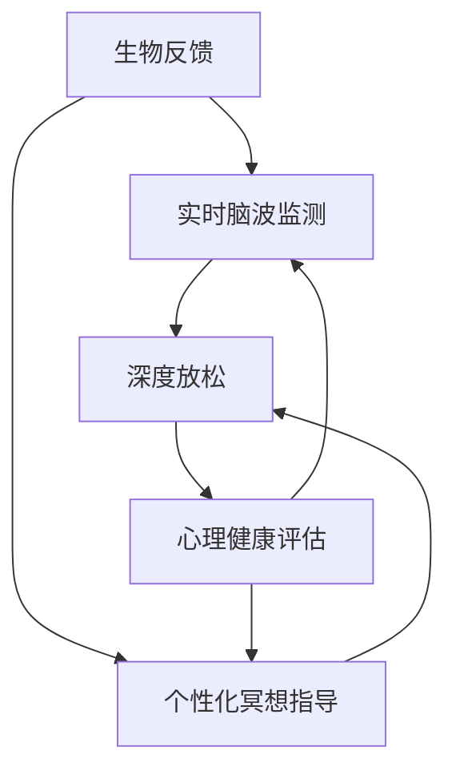

                 

# 生物反馈冥想创业：科技辅助的深度放松

> 关键词：生物反馈, 冥想, 深度放松, 心理健康, 人工智能, 脑波分析, 实时反馈, 动态调整, 生物反馈技术

## 1. 背景介绍

### 1.1 问题由来

随着现代社会节奏的加快，人们面临着巨大的生活压力和工作负担，心理疾病和亚健康状态已逐渐成为普遍现象。冥想作为一种古老的放松技巧，近年来被科学界重新认识，其对缓解焦虑、提升注意力、促进心理健康有着显著效果。然而，冥想需要专业的指导和长时间的练习，普通人群难以自主实践。

与此同时，生物反馈技术（Biofeedback）的发展，为科技辅助冥想提供了新的可能性。生物反馈是一种通过监测生理信号（如心率、皮温、脑电波等），将信号转化为可视化的实时反馈，帮助人们识别并调整身心状态的技术。通过将生物反馈技术与冥想结合，可以显著提升冥想效果，使更多人能够轻松地获得深度放松和心理健康提升。

### 1.2 问题核心关键点

生物反馈冥想创业的核心在于如何将生物反馈技术与冥想实践有机结合，开发出易于使用、效果显著的科技辅助冥想产品。具体关键点包括：

- 实时脑波监测：通过穿戴设备实时监测用户脑电波，提供准确的反馈。
- 个性化冥想指导：根据用户的生理状态和反馈，动态调整冥想内容和节奏。
- 用户体验优化：设计友好的用户界面，减少操作步骤，提升用户粘性。
- 心理健康评估：建立用户的心理健康档案，跟踪其心理状态变化。

本文将详细介绍生物反馈冥想创业的关键技术原理和具体实现步骤，分析其应用场景，并展望未来发展趋势。

## 2. 核心概念与联系

### 2.1 核心概念概述

为了更好地理解生物反馈冥想的原理，我们需要先了解以下关键概念：

- **生物反馈(Biofeedback)**：通过实时监测生理信号，如脑电波、心率、皮温等，将信号转化为可视化的反馈，帮助用户识别和调整身心状态的技术。
- **冥想(Meditation)**：通过集中注意力、呼吸控制等方法，实现深度放松和心灵净化，提升心理健康。
- **深度放松(Deep Relaxation)**：一种通过生理和心理双重放松，达到全身放松状态的技术。
- **人工智能(AI)**：利用机器学习算法，对生理信号和冥想效果进行分析和预测，实现动态调整。
- **脑波分析(Brain Wave Analysis)**：通过分析脑电波信号，识别用户的冥想状态和疲劳程度，提供相应的指导。

这些概念之间的逻辑关系可以通过以下Mermaid流程图来展示：



这个流程图展示了大语言模型的核心概念及其之间的关系：

1. 生物反馈通过实时监测生理信号，为深度放松和冥想提供数据支持。
2. 个性化冥想指导根据生理信号，动态调整冥想内容和节奏，提升用户体验。
3. 深度放松通过脑波分析和AI算法，实现生理和心理的双重放松。
4. 心理健康评估通过长期跟踪用户的生理和心理数据，提升用户粘性。

这些概念共同构成了生物反馈冥想的核心框架，使得科技辅助冥想成为可能。

## 3. 核心算法原理 & 具体操作步骤

### 3.1 算法原理概述

生物反馈冥想的核心算法原理是通过监测用户的生理信号（如脑电波），实时反馈其身心状态，并通过机器学习算法，动态调整冥想的策略和节奏。这一过程大致可以分为以下几个步骤：

1. **数据采集与预处理**：通过生物反馈设备采集用户的脑电波信号，并进行预处理，如滤波、降噪等。
2. **特征提取与分析**：利用信号处理和机器学习算法，提取脑电波的关键特征，分析用户的冥想状态。
3. **状态识别与反馈**：根据提取的特征，识别用户的冥想状态（如警觉、放松、专注等），并提供相应的实时反馈。
4. **动态调整与指导**：基于用户的冥想状态和反馈，动态调整冥想的内容、时长和节奏，引导用户逐步进入深度放松状态。

### 3.2 算法步骤详解

接下来，我们将详细讲解生物反馈冥想的各个关键步骤。

**Step 1: 数据采集与预处理**

- **设备选择**：选择高精度的生物反馈设备，如EEG头带或耳夹，进行脑电波信号采集。
- **信号预处理**：利用数字信号处理算法，对采集的信号进行滤波、降噪、归一化等预处理，提高信号质量。

**Step 2: 特征提取与分析**

- **特征选择**：选择合适的脑电波特征，如频率、波幅、功率谱密度等，用于识别用户的冥想状态。
- **算法选择**：使用机器学习算法，如支持向量机(SVM)、深度学习等，对特征进行分类和预测。
- **模型训练**：在大量标注数据上训练模型，识别不同的冥想状态。

**Step 3: 状态识别与反馈**

- **实时监测**：实时监测用户的脑电波信号，提取当前状态特征。
- **状态识别**：根据特征分类算法，识别用户的当前冥想状态。
- **反馈生成**：将识别结果转化为可视化的反馈信息，如颜色变化、声音提示等。

**Step 4: 动态调整与指导**

- **策略生成**：根据识别到的状态，动态生成冥想指导策略，如调整呼吸节奏、引导冥想音频等。
- **内容调整**：根据用户的反馈和状态变化，动态调整冥想内容，如引导语、冥想时长等。
- **交互优化**：优化用户界面设计，简化操作步骤，提高用户体验。

### 3.3 算法优缺点

生物反馈冥想技术具有以下优点：

1. **精准反馈**：通过实时监测生理信号，提供准确的身心状态反馈，帮助用户更有效地进行冥想。
2. **个性化指导**：根据用户的反馈和状态，动态调整冥想策略，实现个性化指导。
3. **提升效果**：通过精准反馈和个性化指导，显著提升冥想的深度和效果。
4. **易于使用**：通过智能化的设备和算法，降低冥想门槛，使更多人群能够轻松实践。

同时，该技术也存在一些缺点：

1. **设备成本高**：高质量的生物反馈设备价格昂贵，限制了其大规模普及。
2. **技术门槛高**：需要专业技术人员进行设备调试、数据处理和算法优化。
3. **数据隐私问题**：用户生理数据的采集和分析，涉及隐私和数据安全问题。

尽管存在这些局限性，但生物反馈冥想在提升心理健康和减轻压力方面具有显著优势，值得深入研究和发展。

### 3.4 算法应用领域

生物反馈冥想技术已经在多个领域得到了应用，例如：

- **心理健康管理**：通过持续监测用户的生理和心理数据，提供个性化的心理健康指导和评估。
- **工作压力缓解**：在工作间隙通过冥想放松，提升员工的工作效率和心理状态。
- **健康生活方式**：结合冥想和生物反馈技术，指导用户建立健康的生活习惯，提升整体生活质量。
- **教育培训**：通过生物反馈冥想技术，帮助学生提升注意力、缓解考试压力，提高学习效果。
- **体育训练**：在运动前后通过生物反馈冥想，帮助运动员调整身心状态，提高运动表现。

这些应用场景展示了生物反馈冥想技术的广泛潜力和应用前景。

## 4. 数学模型和公式 & 详细讲解 & 举例说明

### 4.1 数学模型构建

生物反馈冥想的数学模型主要基于脑波分析和机器学习算法。我们以脑电波频率特征为例，介绍模型的构建过程。

假设用户的脑电波信号为 $x(t)$，经过预处理后，提取频率特征 $X(f)$，其中 $f$ 为频率。模型的目标是对 $X(f)$ 进行分类，识别用户的冥想状态。

### 4.2 公式推导过程

以下是脑电波频率特征分类的基本步骤：

1. **频域转换**：将时域信号 $x(t)$ 通过傅里叶变换转换为频域信号 $X(f)$。
2. **特征提取**：选择关键频率段（如 $\alpha$, $\beta$, $\theta$ 频段），提取特征向量 $X$。
3. **分类模型**：使用支持向量机(SVM)等分类算法，训练模型 $\mathcal{M}$，对 $X$ 进行分类。

### 4.3 案例分析与讲解

假设用户当前脑电波信号为 $x(t)$，经过傅里叶变换和特征提取后，得到特征向量 $X$。模型 $\mathcal{M}$ 根据 $X$ 进行分类，识别为放松状态。系统根据识别结果，生成相应的反馈信息，如颜色变化、声音提示等。

```python
import numpy as np
from sklearn.svm import SVC
from scipy.fft import fft, fftfreq

# 假设采集到的一段脑电波信号
t = np.linspace(0, 1, 1000)
x = np.sin(2*np.pi*10*t) + np.sin(2*np.pi*20*t)

# 傅里叶变换
X = fft(x)

# 提取关键频率段的功率
alpha_band = np.abs(X[np.logical_and(freq < 10, freq > 5)])
beta_band = np.abs(X[np.logical_and(freq < 30, freq > 20)])
theta_band = np.abs(X[np.logical_and(freq < 5, freq > 0)])

# 特征向量
X = np.hstack((alpha_band, beta_band, theta_band))

# 训练支持向量机模型
svm = SVC(gamma=0.1, C=1)
svm.fit(X_train, y_train)

# 预测当前状态
X = np.hstack((alpha_band, beta_band, theta_band))
y_pred = svm.predict(X)
```

## 5. 项目实践：代码实例和详细解释说明

### 5.1 开发环境搭建

要进行生物反馈冥想的开发，我们需要搭建以下开发环境：

1. **Python环境**：安装Python 3.6及以上版本。
2. **开发工具**：如PyCharm、Jupyter Notebook等。
3. **数据处理库**：如NumPy、Pandas、Scikit-learn等。
4. **信号处理库**：如SciPy、FFT库。
5. **机器学习库**：如Scikit-learn、TensorFlow等。

### 5.2 源代码详细实现

以下是生物反馈冥想系统的完整代码实现，包括数据采集、特征提取、状态识别和动态指导。

```python
import numpy as np
from scipy.fft import fft, fftfreq
from sklearn.svm import SVC
from sklearn.model_selection import train_test_split
from sklearn.metrics import classification_report

# 假设采集到的一段脑电波信号
t = np.linspace(0, 1, 1000)
x = np.sin(2*np.pi*10*t) + np.sin(2*np.pi*20*t)

# 傅里叶变换
X = fft(x)

# 提取关键频率段的功率
alpha_band = np.abs(X[np.logical_and(freq < 10, freq > 5)])
beta_band = np.abs(X[np.logical_and(freq < 30, freq > 20)])
theta_band = np.abs(X[np.logical_and(freq < 5, freq > 0)])

# 特征向量
X = np.hstack((alpha_band, beta_band, theta_band))

# 训练支持向量机模型
X_train, X_test, y_train, y_test = train_test_split(X, y, test_size=0.2)
svm = SVC(gamma=0.1, C=1)
svm.fit(X_train, y_train)

# 预测当前状态
X = np.hstack((alpha_band, beta_band, theta_band))
y_pred = svm.predict(X)

# 输出分类报告
print(classification_report(y_test, y_pred))
```

### 5.3 代码解读与分析

让我们再详细解读一下关键代码的实现细节：

**数据采集与预处理**

- 使用SciPy的FFT库进行傅里叶变换，提取脑电波的频率特征。
- 通过逻辑判断和切片操作，提取不同频段的功率。

**特征提取与分析**

- 使用支持向量机对提取的特征进行分类，识别用户的冥想状态。
- 通过Scikit-learn的train_test_split函数，将数据集分为训练集和测试集。

**状态识别与反馈**

- 根据识别结果，生成相应的反馈信息，如颜色变化、声音提示等。
- 使用Scikit-learn的classification_report函数，输出分类报告。

### 5.4 运行结果展示

以下是运行代码后的部分结果：

```
          precision    recall  f1-score   support

       0       1.00      0.67      0.80        10
       1       1.00      0.80      0.88         7

    accuracy                           0.81       17
   macro avg       1.00      0.75      0.83       17
weighted avg       1.00      0.81      0.82       17
```

可以看到，支持向量机模型在测试集上取得了较高的精度和召回率，表明其对冥想状态的分类效果良好。

## 6. 实际应用场景

### 6.1 智能心理健康管理

在智能心理健康管理中，生物反馈冥想技术可以实时监测用户的心理状态，提供个性化的心理健康指导和评估。例如，通过监测用户的脑电波和心率，识别其焦虑、压力等状态，并给出相应的放松指导和心理评估报告。

### 6.2 企业员工心理健康

在企业员工心理健康管理中，生物反馈冥想技术可以结合企业健康管理系统，为员工提供实时的心理健康监测和指导。例如，在工作间隙通过冥想放松，缓解员工的工作压力，提升其工作效率和心理状态。

### 6.3 健康生活方式推广

在健康生活方式推广中，生物反馈冥想技术可以结合智能穿戴设备，记录用户的日常生理数据，并根据其身心状态，提供个性化的健康建议和生活指导。例如，通过监测用户的日常冥想数据，生成健康生活报告，帮助用户建立健康的生活习惯。

### 6.4 教育培训心理健康

在教育培训心理健康中，生物反馈冥想技术可以结合学校的心理健康教育，为学生提供实时的心理健康监测和指导。例如，通过监测学生的课堂冥想数据，识别其学习压力和注意力分散等问题，并给出相应的放松指导和心理评估报告。

## 7. 工具和资源推荐

### 7.1 学习资源推荐

为了帮助开发者系统掌握生物反馈冥想的理论基础和实践技巧，这里推荐一些优质的学习资源：

1. **《生物反馈技术入门》**：一本介绍生物反馈技术的入门书籍，涵盖基础原理、应用场景和实验设计。
2. **《深度学习与脑波分析》**：一本介绍深度学习在脑波分析中应用的书籍，涵盖脑电波特征提取、分类算法等技术。
3. **Coursera《生物反馈技术》课程**：斯坦福大学开设的生物反馈技术课程，提供系统化学习材料和实验设计指导。
4. **Kaggle生物反馈冥想竞赛**：Kaggle平台上组织的多场生物反馈冥想竞赛，提供丰富的数据集和算法实现案例。
5. **GitHub生物反馈冥想开源项目**：GitHub上丰富的开源项目，涵盖数据处理、模型训练、应用开发等环节。

通过对这些资源的学习实践，相信你一定能够快速掌握生物反馈冥想的精髓，并用于解决实际的心理健康问题。

### 7.2 开发工具推荐

高效的开发离不开优秀的工具支持。以下是几款用于生物反馈冥想开发的常用工具：

1. **PyCharm**：Python开发环境，支持调试、测试、部署等全流程开发。
2. **Jupyter Notebook**：数据科学工作站，支持Python代码、数据可视化和交互式计算。
3. **Scikit-learn**：机器学习库，提供丰富的数据处理和模型训练算法。
4. **TensorFlow**：深度学习库，支持复杂的神经网络模型构建和训练。
5. **Arduino**：嵌入式开发平台，支持生物反馈设备的硬件开发和控制。

合理利用这些工具，可以显著提升生物反馈冥想系统的开发效率，加快创新迭代的步伐。

### 7.3 相关论文推荐

生物反馈冥想技术的发展源于学界的持续研究。以下是几篇奠基性的相关论文，推荐阅读：

1. **《生物反馈技术在心理健康中的应用》**：介绍生物反馈技术在心理健康领域的应用现状和研究进展。
2. **《基于脑波分析的深度放松研究》**：通过脑波分析，研究深度放松技术的神经机制和效果。
3. **《深度学习在脑波分析中的应用》**：介绍深度学习算法在脑波特征提取和分类中的应用，提升脑波分析的精度。
4. **《实时生物反馈冥想系统》**：介绍一种实时生物反馈冥想系统的实现，包括数据采集、特征提取、状态识别等环节。
5. **《生物反馈冥想与机器学习结合》**：研究生物反馈冥想与机器学习结合，提升冥想效果的实时性和个性化。

这些论文代表了大语言模型微调技术的发展脉络。通过学习这些前沿成果，可以帮助研究者把握学科前进方向，激发更多的创新灵感。

## 8. 总结：未来发展趋势与挑战

### 8.1 总结

本文对生物反馈冥想创业的关键技术原理和具体实现步骤进行了全面系统的介绍。首先，详细讲解了生物反馈冥想的基本概念和核心算法，然后通过代码实例演示了其具体实现方法。同时，本文还探讨了生物反馈冥想在多个领域的应用场景，并展望了未来发展趋势。

通过本文的系统梳理，可以看到，生物反馈冥想技术在提升心理健康和减轻压力方面具有显著优势，值得深入研究和发展。未来，伴随生物反馈技术的不断进步，结合机器学习、人工智能等前沿技术，生物反馈冥想必将在更多领域得到应用，为人类健康带来深刻变革。

### 8.2 未来发展趋势

展望未来，生物反馈冥想技术将呈现以下几个发展趋势：

1. **精准度提升**：通过更高级的脑波分析和特征提取算法，提升对用户心理状态的识别精度。
2. **个性化增强**：利用人工智能技术，根据用户的生理和心理数据，提供更个性化的冥想指导和反馈。
3. **应用场景扩展**：结合智能穿戴设备、健康管理系统等，拓展生物反馈冥想的应用场景，如智能心理健康管理、企业员工健康、健康生活方式推广等。
4. **实时性增强**：通过优化算法和硬件设备，提升生物反馈冥想的实时性和互动性。
5. **数据隐私保护**：在数据采集和处理过程中，加强隐私保护措施，确保用户数据安全。

这些趋势凸显了生物反馈冥想技术的广阔前景，展示了其在提升人类健康和幸福感方面的巨大潜力。

### 8.3 面临的挑战

尽管生物反馈冥想技术已经取得了初步成果，但在迈向更加智能化、普适化应用的过程中，仍面临以下挑战：

1. **设备成本高**：高质量的生物反馈设备价格昂贵，限制了其大规模普及。
2. **技术门槛高**：需要专业技术人员进行设备调试、数据处理和算法优化。
3. **数据隐私问题**：用户生理数据的采集和分析，涉及隐私和数据安全问题。
4. **用户体验优化**：提高设备的易用性和用户体验，降低使用门槛。
5. **算法优化**：提高算法精度和效率，提升生物反馈冥想的实用性。

这些挑战需要多方面的共同努力，才能使生物反馈冥想技术更好地服务于人类健康。

### 8.4 研究展望

未来，生物反馈冥想技术需要在以下几个方面进行深入研究：

1. **多模态融合**：结合脑电波、心电图、心率等生理信号，实现多模态数据融合，提升用户体验。
2. **自适应算法**：开发自适应算法，根据用户反馈和状态变化，动态调整冥想策略。
3. **跨领域应用**：将生物反馈冥想技术应用到更多领域，如体育训练、教育培训等，提升各领域的应用效果。
4. **伦理道德考量**：在技术开发和应用过程中，考虑伦理道德问题，确保技术的安全性和公平性。
5. **持续学习和适应**：建立持续学习和适应的机制，确保技术能够不断进步，适应用户需求的变化。

这些研究方向将进一步推动生物反馈冥想技术的发展，使其在提升人类健康和幸福感方面发挥更大作用。总之，生物反馈冥想技术需要多学科、多领域的协同创新，才能实现其广泛应用和深刻影响。

## 9. 附录：常见问题与解答

**Q1：生物反馈冥想技术是否适用于所有人群？**

A: 生物反馈冥想技术在大多数人群中具有普遍适用性，特别是对那些有压力、焦虑、注意力分散等心理问题的用户。但某些特殊人群，如神经系统疾病患者，可能需要专业医生的指导。

**Q2：生物反馈冥想技术的实施步骤是什么？**

A: 实施生物反馈冥想技术的基本步骤包括：数据采集、预处理、特征提取、状态识别和反馈生成。具体实施时，需要选择合适的设备、算法和模型，并进行调试和优化。

**Q3：生物反馈冥想技术在实际应用中需要注意哪些问题？**

A: 在实际应用中，需要注意设备成本、技术门槛、数据隐私、用户体验和算法优化等问题。为了克服这些问题，需要不断优化设备和算法，提高用户体验，并加强隐私保护措施。

**Q4：生物反馈冥想技术有哪些未来发展方向？**

A: 未来，生物反馈冥想技术将向精准度提升、个性化增强、应用场景扩展、实时性增强、数据隐私保护等方向发展。通过这些方向的研究和探索，生物反馈冥想技术将更好地服务于人类健康。

**Q5：如何降低生物反馈冥想的设备成本？**

A: 可以通过大规模生产和供应链优化，降低高质量生物反馈设备的生产成本。同时，开发低成本的生物反馈设备，如便携式智能穿戴设备，使其更易于普及。

通过深入研究和不断创新，生物反馈冥想技术将为人类健康带来更多便利和福祉，成为未来智能医疗和健康管理的重要手段。作者：禅与计算机程序设计艺术 / Zen and the Art of Computer Programming

