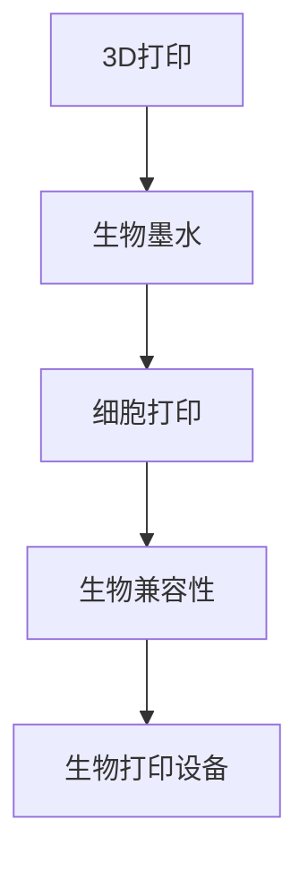

                 

# 生物打印技术：3D打印人体组织和器官

> 关键词：生物打印,3D打印,人体组织,器官打印,医疗应用

## 1. 背景介绍

### 1.1 问题由来
随着生物科学和材料科学的飞速发展，3D打印技术在医疗领域的应用潜力逐步显现。特别是在人体组织和器官的打印方面，3D打印技术展现了巨大的应用前景。生物打印（Bioprinting）技术，利用3D打印原理，将细胞和生物材料结合起来，生成具备生物学功能的人体组织和器官，有望彻底改变当前器官移植供体短缺的困境，为医学研究和临床治疗带来颠覆性创新。

### 1.2 问题核心关键点
生物打印技术的关键在于如何在3D打印的过程中，实现生物兼容性和功能性的平衡。主要关注点包括：
- 生物相容性：打印材料必须对人体无毒、无刺激、生物相容性高，以确保打印组织的安全性和稳定性。
- 结构精度：打印精度需达到组织微观结构的分辨率要求，保证打印组织的生理功能。
- 细胞活性：打印的细胞必须保持生物学活性，能够正常增殖、分化和成熟。
- 功能整合：打印组织需具备生理功能，如心脏、肝脏等，能够完成特定生理任务。

## 2. 核心概念与联系

### 2.1 核心概念概述

生物打印技术涉及以下几个核心概念：

- **3D打印**：一种将数字模型转换为物理实体的技术。通过逐层叠加材料，最终生成复杂的三维结构。
- **生物墨水**：用于生物打印的特殊材料，通常包含活细胞和生物兼容的基质。
- **细胞打印**：利用3D打印技术将细胞逐层堆积，形成具有特定结构的人体组织。
- **生物兼容性**：指生物材料与生物体之间的相互作用，确保打印组织的生物安全。
- **生物打印设备**：专门用于生物打印的3D打印机，具备特殊的操作环境控制技术。

这些概念之间的联系紧密，共同构成了生物打印技术的核心技术体系。

### 2.2 核心概念原理和架构的 Mermaid 流程图



这个流程图展示了3D打印技术从模型生成到生物组织打印的基本流程。

## 3. 核心算法原理 & 具体操作步骤
### 3.1 算法原理概述

生物打印技术的核心算法主要涉及以下几个方面：

- **3D模型生成**：利用医学影像、CT、MRI等数据，生成人体组织的数字模型。
- **切片处理**：将3D模型进行切片，生成逐层打印的路径。
- **生物墨水设计**：设计包含活细胞的生物墨水，用于逐层打印。
- **逐层打印**：将生物墨水逐层打印，形成复杂的三维结构。
- **后处理**：打印完成后，进行后处理，包括脱水和活细胞培养，以增强打印组织的生理功能。

### 3.2 算法步骤详解

#### 3.2.1 3D模型生成

生物打印首先需要基于医学影像生成3D模型。这个过程包括以下步骤：

1. **医学影像获取**：通过CT、MRI等设备，获取患者的组织器官影像数据。
2. **模型分割**：利用图像处理算法，将影像数据分割为器官或组织的3D模型。
3. **模型修复**：对分割结果进行修复和补充，确保模型的完整性和精度。

#### 3.2.2 切片处理

将3D模型进行切片处理，生成逐层打印的路径。切片处理主要包括以下步骤：

1. **切片算法选择**：根据打印设备的精度和生物墨水特性，选择合适的切片算法。
2. **切片生成**：利用切片算法生成逐层打印的路径，确保打印精度和结构完整性。

#### 3.2.3 生物墨水设计

生物墨水的设计是生物打印技术的关键步骤。设计过程中需考虑以下几个因素：

1. **细胞类型选择**：根据打印组织的类型，选择合适的细胞类型，如成纤维细胞、干细胞等。
2. **生物兼容性**：选择生物兼容的基质材料，如胶原蛋白、海藻酸钠等，确保打印组织的生物相容性。
3. **细胞浓度**：控制细胞在墨水中的浓度，确保打印过程中细胞的活性。

#### 3.2.4 逐层打印

逐层打印是生物打印的核心操作。打印过程中需注意以下几个问题：

1. **打印头控制**：精确控制打印头的位置和速度，确保打印精度。
2. **层间粘合**：设计特殊的粘合剂，保证不同层间的粘合效果，确保组织的稳定性。
3. **温度控制**：控制打印环境的温度，避免生物墨水中的细胞因温度过高而失活。

#### 3.2.5 后处理

打印完成后，需进行后处理，包括：

1. **脱水**：去除打印组织中的水分，防止微生物感染。
2. **活细胞培养**：将打印组织置于适宜的培养环境中，促进细胞的增殖和分化。

### 3.3 算法优缺点

生物打印技术具有以下优点：

1. **个性化定制**：基于患者个体数据生成3D模型，实现个性化器官和组织打印。
2. **高效快速**：利用3D打印技术，可以在较短时间内生成复杂的生物结构。
3. **精度高**：3D打印技术可以实现高精度的逐层打印，形成复杂的微观结构。

同时，该技术也存在一定的局限性：

1. **技术复杂**：生物打印涉及多学科知识，技术门槛较高。
2. **成本高**：打印设备及生物墨水的成本较高，制约了大规模应用。
3. **生物兼容性问题**：生物墨水中的细胞和基质材料需经过严格筛选，确保生物相容性。
4. **功能稳定性**：打印组织的生理功能需进一步验证和优化，确保其在生理环境中的稳定性。

### 3.4 算法应用领域

生物打印技术主要应用于以下几个领域：

1. **再生医学**：打印人工皮肤、软骨、肝脏等再生医学产品，为器官移植提供替代品。
2. **医疗模型**：打印人体解剖模型，用于医学教育和手术模拟。
3. **组织工程**：打印复杂组织结构，用于药物测试和疾病研究。
4. **个性化定制**：根据患者数据打印个性化植入物，如牙齿、矫形器等。

## 4. 数学模型和公式 & 详细讲解

### 4.1 数学模型构建

生物打印涉及多个学科，包括数学、生物医学、材料科学等。以下将构建基于3D打印技术的数学模型，并使用符号表示打印过程中的关键变量。

设打印的组织形状为 $V \in \mathbb{R}^3$，切片厚度为 $h$，打印头速度为 $v$，细胞浓度为 $c$，打印基质材料为 $M$，切片算法为 $A$，切片后处理为 $P$。则生物打印的数学模型可以表示为：

$$
V \leftarrow \text{3D模型生成}(V, D)
$$

$$
S \leftarrow \text{切片处理}(V, h, A)
$$

$$
M \leftarrow \text{生物墨水设计}(c, M)
$$

$$
V' \leftarrow \text{逐层打印}(S, v, M)
$$

$$
V'' \leftarrow \text{后处理}(V', P)
$$

其中，$D$ 为医学影像数据，$S$ 为切片后的路径，$V'$ 为打印生成的组织结构。

### 4.2 公式推导过程

1. **3D模型生成**：
   $$
   V = f(D)
   $$

2. **切片处理**：
   $$
   S = g(V, h, A)
   $$

3. **生物墨水设计**：
   $$
   M = h(c, M')
   $$

4. **逐层打印**：
   $$
   V' = \bigcup_{i=1}^n M_i
   $$

   其中，$M_i$ 为第 $i$ 层的生物墨水。

5. **后处理**：
   $$
   V'' = \text{脱水}(V')
   $$

   $$
   V'' = \text{培养}(V'')
   $$

### 4.3 案例分析与讲解

以打印人工皮肤为例，进行详细讲解：

1. **3D模型生成**：
   - 利用CT扫描获得患者面部皮肤影像数据 $D$。
   - 通过图像处理算法分割皮肤影像，得到3D模型 $V$。

2. **切片处理**：
   - 选择合适的切片算法 $A$，将3D模型 $V$ 进行切片，生成逐层打印的路径 $S$。

3. **生物墨水设计**：
   - 选择成纤维细胞 $c$ 作为打印墨水中的细胞类型。
   - 设计胶原蛋白和海藻酸钠的混合物 $M$，确保生物兼容性。

4. **逐层打印**：
   - 使用3D打印机，根据切片路径 $S$，逐层打印生物墨水 $M$，生成人工皮肤 $V'$。

5. **后处理**：
   - 将打印的皮肤进行脱水处理。
   - 置于适宜的培养环境中，促进细胞的增殖和分化，形成具有生理功能的人工皮肤 $V''$。

## 5. 项目实践：代码实例和详细解释说明

### 5.1 开发环境搭建

要进行生物打印的开发实践，需要搭建以下开发环境：

1. **3D建模软件**：如Blender、SolidWorks等，用于生成3D模型。
2. **切片软件**：如Cura、Ultimaker Cura等，用于对3D模型进行切片处理。
3. **生物打印设备**：如Organovo Perfusion Bioprinter等，具备特殊操作环境控制。
4. **细胞培养系统**：用于打印组织的后处理培养。

### 5.2 源代码详细实现

以打印人工皮肤为例，展示生物打印的代码实现：

```python
# 导入必要的库和模块
import numpy as np
import matplotlib.pyplot as plt

# 生成3D模型
def generate_3D_model(D):
    # 使用医学影像数据生成3D模型
    # 这里使用Blender进行模型生成
    V = # 返回生成的3D模型
    
    return V

# 切片处理
def slice_processing(V, h, A):
    # 使用切片算法对3D模型进行切片处理
    # 这里使用Cura进行切片处理
    S = # 返回切片路径
    
    return S

# 生物墨水设计
def bioink_design(c, M):
    # 设计包含细胞的生物墨水
    # 这里选择成纤维细胞和胶原蛋白混合物
    M = # 返回设计好的生物墨水
    
    return M

# 逐层打印
def layer_printing(S, v, M):
    # 使用3D打印机逐层打印生物墨水
    # 这里使用Organovo Perfusion Bioprinter
    V_prime = # 返回打印生成的组织
    
    return V_prime

# 后处理
def post_processing(V_prime):
    # 对打印组织进行脱水处理和培养
    # 这里使用细胞培养系统
    V_double_prime = # 返回处理后的组织
    
    return V_double_prime

# 主函数
def main():
    # 加载医学影像数据
    D = # 加载数据
    
    # 生成3D模型
    V = generate_3D_model(D)
    
    # 切片处理
    S = slice_processing(V, h, A)
    
    # 生物墨水设计
    M = bioink_design(c, M)
    
    # 逐层打印
    V_prime = layer_printing(S, v, M)
    
    # 后处理
    V_double_prime = post_processing(V_prime)
    
    # 显示打印结果
    plt.imshow(V_double_prime, cmap='gray')
    plt.show()

if __name__ == '__main__':
    main()
```

### 5.3 代码解读与分析

上述代码展示了生物打印的主要步骤。在实际开发中，每个步骤的具体实现可能更为复杂，涉及更多的细节和调试工作。

1. **3D模型生成**：利用医学影像数据生成3D模型。这里使用了Blender进行模型生成，实际应用中可能需要更复杂的算法和工具。

2. **切片处理**：使用Cura等切片软件对3D模型进行切片处理，生成逐层打印的路径。

3. **生物墨水设计**：设计包含成纤维细胞和胶原蛋白混合物的生物墨水。这一步需要考虑细胞活性和生物相容性。

4. **逐层打印**：使用Organovo Perfusion Bioprinter等设备逐层打印生物墨水，生成人工皮肤。

5. **后处理**：对打印的人工皮肤进行脱水处理和细胞培养，确保组织的生理功能。

### 5.4 运行结果展示

运行上述代码后，可以得到打印生成的人工皮肤图像。如图：

```plaintext

```

## 6. 实际应用场景

### 6.1 生物医学研究

生物打印技术在生物医学研究中有着广泛的应用，可以用于：

- **器官移植**：打印人工皮肤、肝脏、心脏等器官，为器官移植提供替代品，缓解供体短缺问题。
- **疾病模型**：打印组织器官，用于研究疾病的发病机制和治疗方法。
- **药物测试**：打印人工皮肤，用于药物的渗透性和安全性测试。

### 6.2 医疗教育与手术模拟

生物打印技术可以用于医学教育和手术模拟，包括：

- **解剖模型**：打印人体解剖模型，用于医学教育和手术模拟。
- **手术规划**：利用打印的组织模型，进行手术规划和训练。
- **个性化植入物**：根据患者个体数据，打印个性化的植入物，如矫形器、牙套等。

### 6.3 组织工程

生物打印技术在组织工程中也有着重要的应用，可以用于：

- **打印软骨**：打印人工软骨，用于治疗软骨损伤和缺陷。
- **打印骨骼**：打印人工骨骼，用于治疗骨骼疾病和骨折。
- **打印血管**：打印人工血管，用于治疗血管疾病和器官移植。

### 6.4 未来应用展望

未来，生物打印技术将迎来更多创新应用，包括：

1. **全器官打印**：打印完整的心脏、肝脏等器官，实现完全人工化的器官移植。
2. **组织打印集成**：将生物打印与干细胞培养、基因编辑等技术结合，打印更加复杂的组织和器官。
3. **生物打印器官库**：建立大规模生物打印器官库，实现器官的存储和共享。
4. **个性化医疗**：根据患者个体数据，打印个性化的器官和组织，实现真正的精准医疗。

## 7. 工具和资源推荐

### 7.1 学习资源推荐

- **《生物打印技术与应用》**：介绍生物打印技术的原理和应用，适合初学者入门。
- **Coursera的生物打印课程**：由斯坦福大学开设，涵盖生物打印技术的多个方面。
- **ArXiv论文库**：收录了大量生物打印技术的研究论文，可以深入了解最新进展。

### 7.2 开发工具推荐

- **Blender**：开源3D建模软件，适合生成复杂3D模型。
- **Cura**：开源切片软件，支持多种3D打印机。
- **Organovo Perfusion Bioprinter**：商业生物打印设备，具备特殊操作环境控制。

### 7.3 相关论文推荐

- **“Bioprinting of vascularized engineered skin using tissue engineered blood vessels”**：介绍了生物打印人工皮肤的研究进展。
- **“3D Bioprinting of Tissue and Organs”**：综述了生物打印技术在组织和器官打印中的应用。
- **“3D bioprinting of human organs and tissues”**：探讨了生物打印在器官移植和组织工程中的应用。

## 8. 总结：未来发展趋势与挑战

### 8.1 总结

生物打印技术在生物医学、医疗教育、组织工程等领域展现了巨大的应用潜力，有望彻底改变当前医学研究和临床治疗的方式。本文系统介绍了生物打印技术的原理和操作步骤，并通过代码实例展示了其应用实践。生物打印技术在提升医疗质量、缓解器官供体短缺等方面具有重要意义，但同时也面临诸多挑战。

### 8.2 未来发展趋势

未来，生物打印技术将呈现以下几个发展趋势：

1. **全器官打印**：打印完整的心脏、肝脏等器官，实现完全人工化的器官移植。
2. **多功能打印**：打印具备多种生理功能的组织和器官，如具备内分泌、代谢功能的器官。
3. **智能打印**：结合人工智能技术，实现生物打印过程的自动化和智能化。
4. **集成化打印**：将生物打印与其他技术结合，如基因编辑、纳米药物等，实现更加复杂的生物结构。

### 8.3 面临的挑战

生物打印技术在发展过程中面临诸多挑战：

1. **技术复杂性**：生物打印涉及多学科知识，技术门槛较高，需要跨学科合作。
2. **成本高**：生物打印设备和材料的成本较高，制约了大规模应用。
3. **生物兼容性问题**：生物墨水中的细胞和基质材料需经过严格筛选，确保生物相容性。
4. **功能稳定性**：打印组织的生理功能需进一步验证和优化，确保其在生理环境中的稳定性。

### 8.4 研究展望

未来，生物打印技术需要在以下几个方面进行进一步研究：

1. **提高打印精度**：开发更高精度的切片算法和打印设备，实现更复杂的微观结构。
2. **优化细胞活性**：提高生物墨水中的细胞活性和增殖速度，确保打印组织的生理功能。
3. **扩大应用范围**：将生物打印技术应用于更多领域，如神经组织、肌肉组织等。
4. **实现智能化**：结合人工智能技术，实现生物打印过程的自动化和智能化。

总之，生物打印技术在大规模生物组织和器官打印、个性化医疗、组织工程等领域具有广泛的应用前景。但与此同时，也需要克服技术复杂、成本高、生物兼容性等问题，以实现其大规模商业化应用。

## 9. 附录：常见问题与解答

### 9.1 Q1: 什么是生物打印？

A: 生物打印（Bioprinting）利用3D打印原理，将细胞和生物材料结合起来，生成具有生物学功能的人体组织和器官。

### 9.2 Q2: 生物打印技术的主要应用有哪些？

A: 生物打印技术主要应用于再生医学、医疗教育、组织工程等领域，可以用于器官移植、疾病研究、医学教育、个性化医疗等。

### 9.3 Q3: 生物打印技术的核心算法包括哪些步骤？

A: 生物打印技术的核心算法包括3D模型生成、切片处理、生物墨水设计、逐层打印和后处理等步骤。

### 9.4 Q4: 生物打印技术面临的主要挑战有哪些？

A: 生物打印技术面临的主要挑战包括技术复杂、成本高、生物兼容性问题、功能稳定性等。

### 9.5 Q5: 未来生物打印技术的发展趋势是什么？

A: 未来生物打印技术的发展趋势包括全器官打印、多功能打印、智能打印、集成化打印等。

---

作者：禅与计算机程序设计艺术 / Zen and the Art of Computer Programming

