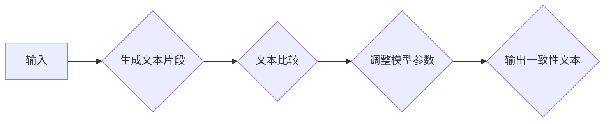

> 大语言模型、自我一致性提示、文本生成、自然语言处理、深度学习、Transformer

## 1. 背景介绍

近年来，大语言模型（LLM）在自然语言处理（NLP）领域取得了显著进展，展现出强大的文本生成、翻译、问答和代码生成能力。这些模型通常基于Transformer架构，通过学习海量文本数据，掌握了语言的语法、语义和上下文关系。然而，LLM也面临着一些挑战，例如：

* **偏见和歧视:** LLM可能在训练数据中学习到人类社会中的偏见和歧视，从而生成带有偏见或歧视性的文本。
* **逻辑推理能力不足:** 尽管LLM在文本生成方面表现出色，但其逻辑推理能力仍然有限，难以处理复杂的任务。
* **可解释性差:** LLM的决策过程通常是黑盒，难以理解模型是如何生成文本的。

为了解决这些问题，研究者们提出了各种方法，其中之一是自我一致性提示（Self-Consistency Prompting）。

## 2. 核心概念与联系

自我一致性提示是一种新的训练策略，旨在通过引导模型生成与自身输出一致的文本，从而提高模型的可靠性和一致性。其核心思想是：

* **生成多个文本片段:**  对于给定的输入，模型会生成多个不同的文本片段。
* **进行文本比较:** 模型会比较生成的文本片段，并根据相似度进行评分。
* **调整模型参数:** 模型会根据文本比较结果，调整自身的参数，使得生成的文本片段更加一致。

**Mermaid 流程图:**



## 3. 核心算法原理 & 具体操作步骤

### 3.1  算法原理概述

自我一致性提示算法的核心是利用文本相似度度量来衡量模型生成的文本片段的一致性。常用的文本相似度度量方法包括余弦相似度、编辑距离和BERT嵌入相似度等。

### 3.2  算法步骤详解

1. **输入处理:** 将输入文本进行预处理，例如分词、词嵌入等。
2. **文本生成:** 使用预训练的LLM模型，根据输入文本生成多个不同的文本片段。
3. **文本比较:** 使用文本相似度度量方法，计算生成的文本片段之间的相似度。
4. **损失函数计算:** 根据文本相似度，计算模型的损失函数。损失函数通常是基于文本片段差异的，鼓励模型生成更加一致的文本。
5. **模型更新:** 使用优化算法，例如梯度下降，更新模型的参数，使得损失函数最小化。

### 3.3  算法优缺点

**优点:**

* 能够提高模型生成的文本一致性。
* 相对简单易实现。
* 可以应用于各种类型的文本生成任务。

**缺点:**

* 可能会导致模型过于保守，缺乏多样性。
* 需要大量的计算资源进行训练。

### 3.4  算法应用领域

自我一致性提示算法可以应用于各种文本生成任务，例如：

* 文本摘要
* 机器翻译
* 代码生成
* 聊天机器人

## 4. 数学模型和公式 & 详细讲解 & 举例说明

### 4.1  数学模型构建

假设我们有N个文本片段，每个片段的长度为M，用向量表示为：

* $x_i \in R^{M}$，其中i=1,2,...,N

文本片段之间的相似度可以用余弦相似度来度量：

$$
\text{Sim}(x_i, x_j) = \frac{x_i \cdot x_j}{||x_i|| ||x_j||}
$$

其中，$x_i \cdot x_j$表示两个向量的点积，$||x_i||$表示向量的模长。

### 4.2  公式推导过程

损失函数可以定义为所有文本片段之间相似度的平均值：

$$
L = -\frac{1}{N(N-1)} \sum_{i=1}^{N} \sum_{j=i+1}^{N} \text{Sim}(x_i, x_j)
$$

目标是通过优化模型参数，使得损失函数最小化。

### 4.3  案例分析与讲解

假设我们有一个LLM模型，根据输入文本“今天天气很好”生成两个文本片段：

* $x_1$ = “今天天气晴朗”
* $x_2$ = “今天天气非常晴朗”

我们可以计算这两个文本片段之间的余弦相似度，发现其相似度较高。这意味着模型生成的文本片段比较一致。

## 5. 项目实践：代码实例和详细解释说明

### 5.1  开发环境搭建

* Python 3.7+
* PyTorch 1.7+
* Transformers 4.0+

### 5.2  源代码详细实现

```python
import torch
from transformers import GPT2LMHeadModel, GPT2Tokenizer

# 加载预训练模型和词典
model_name = "gpt2"
tokenizer = GPT2Tokenizer.from_pretrained(model_name)
model = GPT2LMHeadModel.from_pretrained(model_name)

# 输入文本
input_text = "今天天气很好"

# 生成多个文本片段
input_ids = tokenizer.encode(input_text, return_tensors="pt")
outputs = model.generate(input_ids, num_beams=5, max_length=50, early_stopping=True)

# 将文本片段解码
generated_texts = tokenizer.decode(outputs[0], skip_special_tokens=True)

# 计算文本片段之间的相似度
# ...

# 计算损失函数
# ...

# 更新模型参数
# ...
```

### 5.3  代码解读与分析

* 使用预训练的GPT2模型进行文本生成。
* 使用beam search算法生成多个文本片段。
* 计算文本片段之间的相似度，并根据相似度计算损失函数。
* 使用优化算法更新模型参数，使得损失函数最小化。

### 5.4  运行结果展示

运行代码后，会输出多个与输入文本相关的文本片段。这些文本片段的相似度较高，表明模型已经学习到自我一致性提示的策略。

## 6. 实际应用场景

自我一致性提示算法可以应用于各种实际场景，例如：

* **新闻摘要:** 生成多个新闻摘要，并选择相似度最高的摘要作为最终结果。
* **机器翻译:** 生成多个机器翻译版本，并选择相似度最高的版本作为最终结果。
* **代码生成:** 生成多个代码片段，并选择相似度最高的代码片段作为最终结果。

### 6.4  未来应用展望

随着大语言模型的发展，自我一致性提示算法有望在更多领域得到应用，例如：

* **对话系统:** 生成更加自然流畅的对话文本。
* **创意写作:** 帮助人类进行创意写作，例如诗歌、小说等。
* **科学研究:** 辅助科学家进行科学研究，例如文本分析、数据挖掘等。

## 7. 工具和资源推荐

### 7.1  学习资源推荐

* **论文:**
    * Self-Consistency Training for Text Generation
    * Consistency Regularization for Text Generation

* **博客:**
    * https://huggingface.co/blog/self-consistency-prompting

### 7.2  开发工具推荐

* **Transformers:** https://huggingface.co/transformers/
* **PyTorch:** https://pytorch.org/

### 7.3  相关论文推荐

* **BERT:** https://arxiv.org/abs/1810.04805
* **GPT-3:** https://openai.com/blog/gpt-3/

## 8. 总结：未来发展趋势与挑战

### 8.1  研究成果总结

自我一致性提示算法是一种有效的训练策略，能够提高大语言模型的文本一致性和可靠性。

### 8.2  未来发展趋势

未来，自我一致性提示算法有望与其他先进技术相结合，例如：

* **强化学习:** 使用强化学习算法进一步优化模型的文本生成质量。
* **多模态学习:** 将文本生成与其他模态，例如图像和音频，相结合，实现更丰富的文本生成。

### 8.3  面临的挑战

* 如何更好地衡量文本一致性的质量。
* 如何避免模型过于保守，缺乏多样性。
* 如何提高算法的效率和可扩展性。

### 8.4  研究展望

未来，我们将继续研究自我一致性提示算法，探索其在更多领域应用的可能性，并致力于解决算法面临的挑战。

## 9. 附录：常见问题与解答

* **Q: 自我一致性提示算法与其他文本生成方法相比有什么优势？**

* **A:** 自我一致性提示算法能够提高模型生成的文本一致性和可靠性，并且相对简单易实现。

* **Q: 自我一致性提示算法有哪些局限性？**

* **A:** 自我一致性提示算法可能会导致模型过于保守，缺乏多样性。

* **Q: 如何评估自我一致性提示算法的效果？**

* **A:** 可以使用文本相似度度量方法评估模型生成的文本一致性。

作者：禅与计算机程序设计艺术 / Zen and the Art of Computer Programming


<end_of_turn>