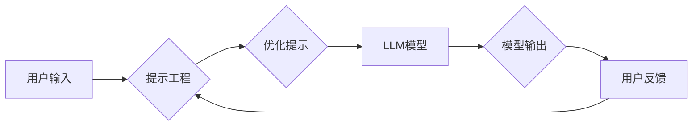

> 大语言模型，提示工程，自然语言处理，文本生成，机器学习，深度学习，Transformer

## 1. 背景介绍

近年来，大语言模型（LLM）在自然语言处理（NLP）领域取得了令人瞩目的成就。从文本生成、翻译到问答和代码编写，LLM展现出强大的能力，为我们带来了全新的可能性。然而，LLM的潜力并非一蹴而就，需要通过精心设计的“提示”（prompt）来引导模型，使其发挥最佳性能。

提示工程（Prompt Engineering）正是指通过设计和优化输入提示，以引导LLM生成更准确、更符合预期、更具创造性的输出。它就像给LLM提供清晰的指令和上下文，帮助模型理解任务需求并生成高质量的响应。

随着LLM技术的不断发展，提示工程的重要性日益凸显。它不仅是LLM应用的关键环节，也是推动LLM技术进步的重要方向。

## 2. 核心概念与联系

### 2.1  大语言模型

大语言模型是指在海量文本数据上训练的深度学习模型，能够理解和生成人类语言。它们通常基于Transformer架构，拥有强大的文本表示能力和上下文理解能力。

### 2.2  提示工程

提示工程是指通过设计和优化输入提示，以引导LLM生成更准确、更符合预期、更具创造性的输出。它是一个迭代的过程，需要不断尝试和调整提示，以获得最佳效果。

### 2.3  提示与模型交互

提示工程的核心在于理解LLM的输入机制和输出模式。LLM通过分析提示中的信息，构建语义理解和知识表示，并根据训练数据和模型参数生成相应的输出。

**Mermaid 流程图**



## 3. 核心算法原理 & 具体操作步骤

### 3.1  算法原理概述

提示工程的核心算法原理是基于自然语言处理和机器学习的知识。它利用语言模型的文本表示能力和上下文理解能力，通过设计和优化提示，引导模型生成符合预期输出。

### 3.2  算法步骤详解

1. **明确任务目标:** 首先要明确LLM需要完成的任务，例如文本生成、翻译、问答等。
2. **设计初始提示:** 根据任务目标，设计一个初始提示，提供必要的上下文信息和指令。
3. **评估提示效果:** 使用LLM对提示进行测试，评估其生成结果的质量和准确性。
4. **优化提示:** 根据评估结果，对提示进行修改和优化，例如添加细节信息、调整指令语气、引入示例等。
5. **迭代测试:** 重复步骤3和4，不断迭代优化提示，直到达到预期的效果。

### 3.3  算法优缺点

**优点:**

* **灵活性:** 提示工程可以灵活地调整LLM的输出，使其适应不同的任务和需求。
* **可解释性:** 提示工程的过程相对透明，可以更容易地理解模型的决策过程。
* **易于实施:** 提示工程不需要复杂的模型训练，可以相对容易地进行实施。

**缺点:**

* **人工成本:** 设计和优化提示需要一定的专业知识和经验，可能需要投入较多的人工成本。
* **提示质量依赖:** 提示的质量直接影响LLM的输出效果，如果提示设计不当，可能会导致模型生成错误或不符合预期的结果。
* **泛化能力:** 一些精心设计的提示可能只适用于特定的任务或数据，缺乏泛化能力。

### 3.4  算法应用领域

提示工程在多个领域都有广泛的应用，例如：

* **文本生成:** 写作、诗歌创作、代码生成等。
* **对话系统:** 聊天机器人、虚拟助手等。
* **问答系统:** 自动回答问题、搜索信息等。
* **机器翻译:** 将文本从一种语言翻译成另一种语言。
* **数据分析:** 从文本数据中提取信息、进行情感分析等。

## 4. 数学模型和公式 & 详细讲解 & 举例说明

### 4.1  数学模型构建

LLM的训练过程本质上是一个优化问题的求解过程。目标是找到一个模型参数集，使得模型在训练数据上表现最佳。常用的数学模型包括：

* **交叉熵损失函数:** 用于衡量模型预测结果与真实标签之间的差异。

$$
Loss = - \sum_{i=1}^{N} y_i \log(p_i)
$$

其中：

* $N$ 是样本数量。
* $y_i$ 是真实标签。
* $p_i$ 是模型预测的概率。

* **梯度下降算法:** 用于更新模型参数，使其朝着损失函数最小化的方向进行调整。

### 4.2  公式推导过程

梯度下降算法的核心思想是利用梯度信息，逐步调整模型参数，降低损失函数的值。具体推导过程如下：

1. 计算损失函数对每个参数的梯度。
2. 根据梯度方向更新每个参数的值。
3. 重复步骤1和2，直到损失函数达到最小值。

### 4.3  案例分析与讲解

假设我们有一个简单的文本分类任务，需要将文本分类为正类或负类。我们可以使用交叉熵损失函数和梯度下降算法来训练一个二分类模型。

在训练过程中，模型会不断调整参数，使得预测结果与真实标签之间的差异最小化。最终，模型能够学习到文本特征，并准确地分类文本。

## 5. 项目实践：代码实例和详细解释说明

### 5.1  开发环境搭建

为了进行LLM应用开发，需要搭建相应的开发环境。常用的开发环境包括：

* **Python:** 作为主流的机器学习编程语言，Python拥有丰富的库和工具，支持LLM开发。
* **深度学习框架:** TensorFlow、PyTorch等深度学习框架提供高效的模型训练和推理能力。
* **云计算平台:** AWS、Google Cloud、Azure等云计算平台提供强大的计算资源和服务，支持大规模LLM训练和部署。

### 5.2  源代码详细实现

以下是一个简单的文本生成示例代码，使用HuggingFace Transformers库加载预训练的LLM模型，并根据用户输入生成文本：

```python
from transformers import pipeline

# 加载文本生成模型
generator = pipeline("text-generation", model="gpt2")

# 用户输入
text = "今天天气真好"

# 生成文本
output = generator(text, max_length=50, num_return_sequences=3)

# 打印结果
for i in range(len(output)):
    print(f"输出{i+1}: {output[i]['generated_text']}")
```

### 5.3  代码解读与分析

* `pipeline("text-generation", model="gpt2")`: 使用HuggingFace Transformers库加载预训练的GPT-2模型，用于文本生成任务。
* `generator(text, max_length=50, num_return_sequences=3)`: 使用模型生成文本，`text`为用户输入，`max_length`为生成文本的最大长度，`num_return_sequences`为生成多个文本序列的数量。
* `output[i]['generated_text']`: 获取每个生成的文本序列。

### 5.4  运行结果展示

运行上述代码，会输出三个基于用户输入“今天天气真好”生成的文本序列。

## 6. 实际应用场景

### 6.1  文本生成

* **内容创作:** 自动生成文章、故事、诗歌等内容。
* **广告文案:** 自动生成吸引人的广告文案。
* **产品描述:** 自动生成产品描述和规格。

### 6.2  对话系统

* **聊天机器人:** 提供智能对话体验，回答用户问题、进行闲聊等。
* **虚拟助手:** 帮助用户完成任务，例如设置提醒、查询信息等。

### 6.3  问答系统

* **搜索引擎:** 帮助用户找到相关信息。
* **知识问答:** 回答用户关于特定主题的问题。

### 6.4  未来应用展望

LLM在未来将有更广泛的应用场景，例如：

* **个性化教育:** 提供个性化的学习内容和辅导。
* **医疗诊断:** 辅助医生进行诊断和治疗。
* **法律服务:** 自动生成法律文件和分析法律问题。

## 7. 工具和资源推荐

### 7.1  学习资源推荐

* **HuggingFace:** https://huggingface.co/
* **OpenAI:** https://openai.com/
* **Stanford NLP Group:** https://nlp.stanford.edu/

### 7.2  开发工具推荐

* **Transformers:** https://huggingface.co/docs/transformers/index
* **TensorFlow:** https://www.tensorflow.org/
* **PyTorch:** https://pytorch.org/

### 7.3  相关论文推荐

* **Attention Is All You Need:** https://arxiv.org/abs/1706.03762
* **BERT: Pre-training of Deep Bidirectional Transformers for Language Understanding:** https://arxiv.org/abs/1810.04805
* **GPT-3: Language Models are Few-Shot Learners:** https://arxiv.org/abs/2005.14165

## 8. 总结：未来发展趋势与挑战

### 8.1  研究成果总结

近年来，LLM取得了显著的进展，在文本生成、对话系统、问答系统等领域展现出强大的能力。提示工程作为LLM应用的关键环节，也取得了重要的进展，为LLM的应用提供了新的思路和方法。

### 8.2  未来发展趋势

* **模型规模和能力提升:** 未来LLM模型规模将继续扩大，能力将进一步提升，能够处理更复杂的任务。
* **多模态LLM:** 将文本、图像、音频等多种模态信息融合到LLM中，实现更丰富的交互和应用场景。
* **可解释性增强:** 研究LLM的决策过程，提高模型的可解释性和透明度。
* **安全性和鲁棒性提升:** 增强LLM的安全性，防止模型被恶意利用，提高模型的鲁棒性，使其能够应对各种输入和环境变化。

### 8.3  面临的挑战

* **数据获取和标注:** 训练高性能LLM需要海量高质量的数据，数据获取和标注成本较高。
* **计算资源需求:** 训练大型LLM需要大量的计算资源，成本较高。
* **伦理和社会影响:** LLM的应用可能带来伦理和社会问题，例如信息误导、偏见放大等，需要谨慎考虑和应对。

### 8.4  研究展望

未来，LLM研究将继续朝着更强大、更安全、更可解释的方向发展。提示工程也将成为LLM应用的重要方向，需要不断探索新的方法和技术，以更好地引导LLM发挥其潜力，为人类社会带来更多价值。

## 9. 附录：常见问题与解答

### 9.1  如何设计一个好的提示？

设计一个好的提示需要考虑以下几个方面：

* **明确任务目标:** 首先要明确LLM需要完成的任务。
* **提供必要信息:** 给予LLM足够的上下文信息和指令，使其能够理解任务需求。
* **使用清晰简洁的语言:** 使用易于理解的语言，避免使用过于复杂的语法或专业术语。
* **添加示例:** 提供一些示例输入和输出，帮助LLM理解期望的格式和内容。

### 9.2  如何评估提示效果？

可以根据以下指标评估提示效果：

* **准确率:** 模型输出的准确性。
* **流畅度:** 模型生成的文本的流畅度和自然度。
* **相关性:** 模型输出与任务目标的相关性。
* **多样性:** 模型生成的多样性，避免生成重复或单调的文本。

### 9.3  LLM有哪些伦理和社会影响？

LLM的应用可能带来以下伦理和社会影响：

* **信息误导:** LLM可能生成虚假信息或误导性内容。
* **偏见放大:** LLM可能学习到训练数据中的