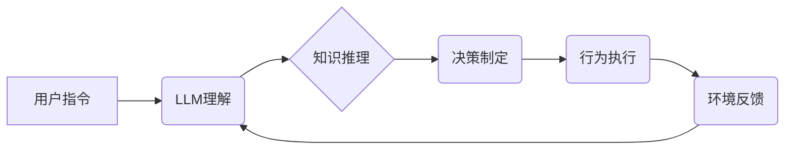

> 大语言模型、自主Agent、强化学习、对话系统、知识图谱、应用案例

## 1. 背景介绍

近年来，大语言模型（LLM）的快速发展，为人工智能领域带来了革命性的变革。LLM 拥有强大的文本理解和生成能力，能够完成从文本摘要、翻译到代码生成等多种复杂任务。然而，LLM 的应用场景远不止于此。随着人工智能技术的不断进步，LLM 开始被应用于构建更加智能、自主的Agent系统。

自主Agent系统是指能够独立感知环境、制定决策并执行行动的智能体。传统的Agent系统通常依赖于人工设计的规则和知识库，而LLM 的引入则为Agent系统赋予了更强的学习和适应能力。通过训练大量的文本数据，LLM 可以学习到人类的语言表达方式和知识结构，从而更好地理解环境信息并做出更合理的决策。

## 2. 核心概念与联系

### 2.1 大语言模型 (LLM)

大语言模型是一种基于Transformer架构的深度学习模型，通过训练海量文本数据，学习语言的语法、语义和上下文关系。LLM 能够理解和生成人类语言，并具备以下关键特性：

* **文本理解:** 能够理解文本的含义、情感和意图。
* **文本生成:** 能够生成流畅、自然的文本，包括文章、对话、代码等。
* **知识表示:** 能够将文本信息转化为知识图谱，并进行推理和查询。

### 2.2 自主Agent

自主Agent是一个能够独立行动的智能体，它具有以下特征：

* **感知环境:** 能够通过传感器或其他方式获取环境信息。
* **决策制定:** 能够根据环境信息和自身目标，制定行动计划。
* **执行行动:** 能够执行决策计划，并与环境进行交互。

### 2.3 核心概念联系

LLM 和自主Agent系统之间存在着密切的联系。LLM 可以为自主Agent系统提供以下功能：

* **自然语言理解:** 帮助Agent理解用户指令和环境信息。
* **知识推理:** 帮助Agent进行知识检索和推理，做出更明智的决策。
* **行为规划:** 帮助Agent制定行动计划，并生成相应的执行指令。

**Mermaid 流程图**



## 3. 核心算法原理 & 具体操作步骤

### 3.1 算法原理概述

自主Agent系统通常采用强化学习（Reinforcement Learning，RL）算法进行训练。RL 是一种机器学习方法，通过奖励机制来引导Agent学习最优的行为策略。

在RL 框架下，Agent与环境进行交互，根据环境反馈获得奖励或惩罚。Agent的目标是最大化累积的奖励，从而学习到最优的行为策略。

### 3.2 算法步骤详解

1. **环境建模:** 建立Agent与环境的交互模型，定义Agent可以采取的行动、环境状态和奖励机制。
2. **策略初始化:** 初始化Agent的行为策略，例如随机策略或贪婪策略。
3. **环境交互:** Agent与环境进行交互，根据当前状态选择行动，并观察环境反馈。
4. **奖励计算:** 根据环境反馈计算奖励，奖励越大表示Agent的行为越优。
5. **策略更新:** 使用RL 算法更新Agent的行为策略，例如Q-learning 或 Deep Q-Network (DQN)。
6. **重复步骤3-5:** 重复以上步骤，直到Agent学习到最优的行为策略。

### 3.3 算法优缺点

**优点:**

* **能够学习复杂的行为策略:** RL 算法能够学习到复杂、非线性、动态的环境中的最优行为策略。
* **适应性强:** RL 算法能够根据环境变化动态调整行为策略。
* **无需人工设计规则:** RL 算法能够通过奖励机制自动学习行为策略，无需人工设计规则。

**缺点:**

* **训练时间长:** RL 算法的训练过程通常需要大量的时间和计算资源。
* **奖励设计困难:** 设计合适的奖励机制是RL 算法的关键，奖励机制设计不当会导致Agent学习到不理想的行为策略。
* **样本效率低:** RL 算法通常需要大量的样本数据进行训练。

### 3.4 算法应用领域

RL 算法在许多领域都有广泛的应用，例如：

* **机器人控制:** 训练机器人完成复杂的任务，例如导航、抓取和组装。
* **游戏 AI:** 训练游戏中的AI对手，使其能够与人类玩家进行对抗。
* **推荐系统:** 训练推荐系统，根据用户的历史行为推荐更符合用户偏好的内容。
* **金融交易:** 训练交易策略，自动进行股票交易。

## 4. 数学模型和公式 & 详细讲解 & 举例说明

### 4.1 数学模型构建

在RL 框架下，Agent与环境的交互过程可以建模为马尔可夫决策过程 (MDP)。MDP 由以下几个要素组成：

* **状态空间 (S):** 环境可能存在的全部状态。
* **动作空间 (A):** Agent可以采取的所有动作。
* **转移概率 (P):** 从一个状态执行一个动作后转移到另一个状态的概率。
* **奖励函数 (R):** Agent在某个状态执行某个动作后获得的奖励。
* **折扣因子 (γ):** 用于权衡未来奖励和当前奖励的因子。

### 4.2 公式推导过程

RL 算法的目标是学习一个最优的策略 π(s, a)，该策略能够最大化Agent的累积奖励。

最优策略的定义如下：

$$
\pi^*(s) = \arg\max_a Q^*(s, a)
$$

其中，$Q^*(s, a)$ 表示在状态 $s$ 执行动作 $a$ 后获得的期望累积奖励。

Q-learning 算法是一种常用的RL 算法，其核心思想是通过迭代更新Q值表来学习最优策略。

Q-learning 算法的更新规则如下：

$$
Q(s, a) \leftarrow Q(s, a) + \alpha [r + \gamma \max_{a'} Q(s', a') - Q(s, a)]
$$

其中，

* $\alpha$ 是学习率，控制着学习速度。
* $r$ 是在状态 $s$ 执行动作 $a$ 后获得的奖励。
* $s'$ 是执行动作 $a$ 后转移到的下一个状态。
* $\max_{a'} Q(s', a')$ 是在下一个状态 $s'$ 执行所有可能的行动 $a'$ 后获得的最大Q值。

### 4.3 案例分析与讲解

假设有一个Agent需要学习玩一个简单的游戏，游戏规则如下：

* 游戏状态由一个数字表示，数字可以从0到9变化。
* Agent可以执行两个动作：加1和减1。
* 当数字达到10时，Agent获得奖励100，否则获得奖励0。

可以使用Q-learning 算法训练Agent学习玩这个游戏。

在训练过程中，Agent会根据当前状态和执行的动作，更新Q值表。最终，Agent会学习到一个最优策略，能够在游戏中获得最大奖励。

## 5. 项目实践：代码实例和详细解释说明

### 5.1 开发环境搭建

本案例使用Python语言进行开发，需要安装以下库：

* NumPy
* TensorFlow 或 PyTorch

### 5.2 源代码详细实现

```python
import numpy as np

# 定义状态空间和动作空间
state_space = np.arange(10)
action_space = [-1, 1]

# 定义Q值表
q_table = np.zeros((len(state_space), len(action_space)))

# 定义学习参数
alpha = 0.1
gamma = 0.9

# 训练过程
for episode in range(1000):
    state = np.random.choice(state_space)
    done = False

    while not done:
        # 选择动作
        action = np.argmax(q_table[state])

        # 执行动作并观察环境反馈
        next_state = state + action
        reward = 0
        if next_state == 10:
            reward = 100
            done = True
        
        # 更新Q值
        q_table[state, action] = q_table[state, action] + alpha * (reward + gamma * np.max(q_table[next_state]) - q_table[state, action])

        state = next_state

# 输出最优策略
print(q_table)
```

### 5.3 代码解读与分析

* **状态空间和动作空间:** 定义了Agent可以处的状态和可以采取的动作。
* **Q值表:** 用于存储Agent在每个状态下执行每个动作的期望累积奖励。
* **学习参数:** 学习率 $\alpha$ 控制着学习速度，折扣因子 $\gamma$ 控制着未来奖励的权重。
* **训练过程:** 迭代地更新Q值表，直到Agent学习到最优策略。
* **输出最优策略:** 打印出Q值表，展示Agent在每个状态下执行每个动作的期望累积奖励。

### 5.4 运行结果展示

运行代码后，会输出一个Q值表，该表展示了Agent在每个状态下执行每个动作的期望累积奖励。

## 6. 实际应用场景

### 6.1 智能客服系统

LLM 可以用于构建智能客服系统，帮助企业自动处理客户咨询和服务请求。

* **自然语言理解:** LLM 可以理解客户的自然语言输入，并识别客户的需求。
* **知识检索:** LLM 可以访问知识库，检索相关信息并提供给客户。
* **对话生成:** LLM 可以生成自然流畅的对话回复，与客户进行互动。

### 6.2 个性化推荐系统

LLM 可以用于构建个性化推荐系统，根据用户的兴趣和偏好推荐相关内容。

* **用户画像:** LLM 可以分析用户的历史行为和偏好，构建用户画像。
* **内容理解:** LLM 可以理解内容的主题和风格，并与用户的兴趣匹配。
* **推荐生成:** LLM 可以根据用户的画像和内容理解，生成个性化的推荐列表。

### 6.3 自动写作工具

LLM 可以用于构建自动写作工具，帮助用户生成各种类型的文本内容。

* **文本生成:** LLM 可以根据用户的提示，生成文章、故事、诗歌等文本内容。
* **文本摘要:** LLM 可以对长篇文本进行摘要，提取关键信息。
* **文本翻译:** LLM 可以将文本翻译成不同的语言。

### 6.4 未来应用展望

LLM 在自主Agent系统中的应用前景广阔，未来可能在以下领域得到更广泛的应用：

* **医疗保健:** 辅助医生诊断疾病、制定治疗方案。
* **教育:** 提供个性化的学习辅导、自动批改作业。
* **金融:** 自动进行风险评估、投资决策。
* **交通运输:** 自动驾驶汽车、智能交通管理。

## 7. 工具和资源推荐

### 7.1 学习资源推荐

* **书籍:**
    * 《深度学习》
    * 《强化学习：原理、算法和应用》
* **在线课程:**
    * Coursera: 强化学习
    * Udacity: 深度学习
* **博客和论坛:**
    * OpenAI Blog
    * DeepMind Blog

### 7.2 开发工具推荐

* **TensorFlow:** 开源深度学习框架
* **PyTorch:** 开源深度学习框架
* **Gym:** 强化学习环境库

### 7.3 相关论文推荐

* **Deep Reinforcement Learning with Double Q-learning**
* **DQN: Deep Q-Network**
* **Proximal Policy Optimization Algorithms**

## 8. 总结：未来发展趋势与挑战

### 8.1 研究成果总结

LLM 在自主Agent系统中的应用取得了显著的成果，例如在游戏、机器人控制和推荐系统等领域取得了