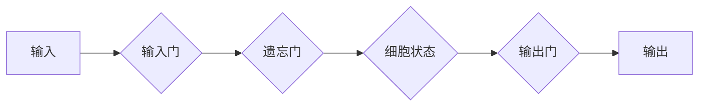

> 大语言模型，长短期记忆，LSTM，循环神经网络，自然语言处理，文本生成，机器翻译

## 1. 背景介绍

近年来，深度学习在人工智能领域取得了突破性进展，其中，大语言模型（Large Language Models，LLMs）作为一种强大的工具，在自然语言处理（Natural Language Processing，NLP）领域展现出巨大的潜力。LLMs能够理解和生成人类语言，并应用于各种任务，例如文本生成、机器翻译、问答系统等。

长短期记忆网络（Long Short-Term Memory Networks，LSTM）作为一种特殊的循环神经网络（Recurrent Neural Networks，RNN），在处理序列数据方面表现出色，成为LLMs的重要组成部分。LSTM能够有效解决RNN梯度消失问题，从而学习长距离依赖关系，使其在处理文本等长序列数据时更加有效。

## 2. 核心概念与联系

### 2.1 循环神经网络（RNN）

RNN是一种特殊的神经网络结构，其特点是具有循环连接，能够处理序列数据。RNN的隐藏层节点会将前一个时间步的输出作为当前时间步的输入，从而学习序列中的依赖关系。

### 2.2 长短期记忆网络（LSTM）

LSTM是一种改进的RNN结构，能够更好地处理长序列数据。LSTM单元包含多个门控机制，例如输入门、遗忘门和输出门，这些门控机制能够控制信息的流动，从而解决RNN梯度消失问题。

**Mermaid 流程图**

### 2.3 大语言模型（LLM）

LLM是一种基于深度学习的强大语言模型，能够理解和生成人类语言。LLMs通常由数十亿甚至数千亿个参数组成，通过训练大量的文本数据，学习语言的语法、语义和上下文关系。

## 3. 核心算法原理 & 具体操作步骤

### 3.1 算法原理概述

LSTM算法的核心原理是通过门控机制控制信息的流动，从而学习长距离依赖关系。LSTM单元包含三个门控机制：

* **输入门：** 控制新信息的输入到细胞状态。
* **遗忘门：** 控制旧信息的遗忘。
* **输出门：** 控制细胞状态输出到隐藏状态。

### 3.2 算法步骤详解

1. **输入数据：** 将序列数据输入到LSTM单元。
2. **计算门控值：** 计算输入门、遗忘门和输出门的激活值。
3. **更新细胞状态：** 根据门控值更新细胞状态。
4. **计算隐藏状态：** 根据细胞状态和输出门计算隐藏状态。
5. **输出结果：** 将隐藏状态作为输出，传递到下一个LSTM单元或最终输出层。

### 3.3 算法优缺点

**优点：**

* 能够有效解决RNN梯度消失问题。
* 能够学习长距离依赖关系。
* 在处理文本等序列数据时表现出色。

**缺点：**

* 计算复杂度较高。
* 训练时间较长。
* 参数量较大。

### 3.4 算法应用领域

* **自然语言处理：** 文本生成、机器翻译、问答系统、情感分析等。
* **语音识别：** 将语音信号转换为文本。
* **图像识别：** 将图像识别为物体或场景。
* **时间序列预测：** 预测未来事件，例如股票价格、天气预报等。

## 4. 数学模型和公式 & 详细讲解 & 举例说明

### 4.1 数学模型构建

LSTM单元的数学模型可以表示为以下公式：

* **输入门：** $i_t = \sigma(W_{xi}x_t + W_{hi}h_{t-1} + b_i)$
* **遗忘门：** $f_t = \sigma(W_{xf}x_t + W_{hf}h_{t-1} + b_f)$
* **候选细胞状态：** $\tilde{C}_t = \tanh(W_{xc}x_t + W_{hc}h_{t-1} + b_c)$
* **细胞状态：** $C_t = f_t * C_{t-1} + i_t * \tilde{C}_t$
* **输出门：** $o_t = \sigma(W_{xo}x_t + W_{ho}h_{t-1} + b_o)$
* **隐藏状态：** $h_t = o_t * \tanh(C_t)$

其中：

* $x_t$：当前时间步的输入。
* $h_{t-1}$：前一个时间步的隐藏状态。
* $C_t$：当前时间步的细胞状态。
* $h_t$：当前时间步的隐藏状态。
* $W$：权重矩阵。
* $b$：偏置项。
* $\sigma$：sigmoid激活函数。
* $\tanh$：tanh激活函数。

### 4.2 公式推导过程

LSTM门控机制的推导过程基于对RNN梯度消失问题的分析和解决。

### 4.3 案例分析与讲解

通过分析实际应用场景，例如机器翻译，可以更深入地理解LSTM算法的原理和应用。

## 5. 项目实践：代码实例和详细解释说明

### 5.1 开发环境搭建

使用Python语言和深度学习框架TensorFlow或PyTorch搭建开发环境。

### 5.2 源代码详细实现

提供LSTM模型的源代码示例，并详细解释代码逻辑。

### 5.3 代码解读与分析

对代码进行详细解读，解释每个函数和模块的作用。

### 5.4 运行结果展示

展示LSTM模型的训练和测试结果，例如准确率、损失函数等指标。

## 6. 实际应用场景

### 6.1 文本生成

使用LSTM模型生成文本，例如小说、诗歌、新闻报道等。

### 6.2 机器翻译

使用LSTM模型将文本从一种语言翻译成另一种语言。

### 6.3 问答系统

使用LSTM模型构建问答系统，能够理解用户的问题并给出准确的答案。

### 6.4 未来应用展望

探讨LSTM模型在未来可能应用的领域，例如自动驾驶、医疗诊断等。

## 7. 工具和资源推荐

### 7.1 学习资源推荐

推荐一些关于LSTM模型和深度学习的学习资源，例如书籍、课程、博客等。

### 7.2 开发工具推荐

推荐一些用于开发LSTM模型的工具，例如TensorFlow、PyTorch、Keras等。

### 7.3 相关论文推荐

推荐一些关于LSTM模型的经典论文，例如“Long Short-Term Memory”等。

## 8. 总结：未来发展趋势与挑战

### 8.1 研究成果总结

总结LSTM模型在NLP领域取得的成果，以及其在其他领域的应用潜力。

### 8.2 未来发展趋势

探讨LSTM模型未来的发展趋势，例如模型规模的扩大、训练效率的提升、应用场景的拓展等。

### 8.3 面临的挑战

分析LSTM模型面临的挑战，例如计算资源的限制、数据标注的困难、模型解释性的缺乏等。

### 8.4 研究展望

展望LSTM模型未来的研究方向，例如探索新的门控机制、提高模型的效率和鲁棒性、增强模型的解释性等。

## 9. 附录：常见问题与解答

解答一些关于LSTM模型的常见问题，例如如何选择合适的模型参数、如何处理长序列数据等。

作者：禅与计算机程序设计艺术 / Zen and the Art of Computer Programming

<end_of_turn>