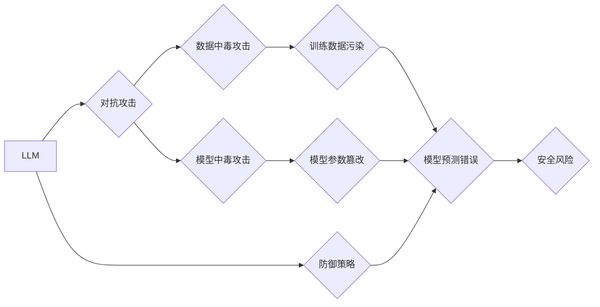

> 大语言模型，LLM，安全，防御策略，对抗攻击，数据中毒，模型中毒，鲁棒性，可解释性

## 1. 背景介绍

大语言模型（LLM）近年来取得了令人瞩目的进展，展现出强大的文本生成、翻译、摘要和问答能力。然而，随着LLM应用的广泛普及，其潜在的安全风险也日益凸显。攻击者可以利用LLM的特性进行恶意攻击，例如生成虚假信息、传播谣言、进行身份盗窃等。因此，研究和开发有效的防御策略，保障LLM的安全性和可靠性，至关重要。

## 2. 核心概念与联系

**2.1  大语言模型（LLM）**

LLM是一种基于深度学习的强大人工智能模型，能够理解和生成人类语言。它们通常由 Transformer 架构构成，并通过海量文本数据进行训练。LLM可以执行各种自然语言处理任务，例如文本分类、情感分析、机器翻译和对话系统。

**2.2  对抗攻击**

对抗攻击是指攻击者通过对输入数据进行微小扰动，以欺骗模型做出错误预测或产生不期望的输出。这些扰动通常对人类不可察觉，但对模型却具有显著影响。常见的对抗攻击方法包括：

* **白盒攻击:** 攻击者知道模型的内部结构和参数。
* **黑盒攻击:** 攻击者只知道模型的输入和输出，但不知道其内部结构。
* **梯度攻击:** 攻击者利用模型的梯度信息来构造对抗样本。

**2.3  数据中毒攻击**

数据中毒攻击是指攻击者将恶意数据注入到训练数据集中，从而影响模型的训练过程，导致模型在预测时产生错误结果。

**2.4  模型中毒攻击**

模型中毒攻击是指攻击者在模型训练完成后，对模型参数进行恶意修改，从而改变模型的预测行为。

**2.5  鲁棒性**

鲁棒性是指模型对对抗攻击和数据中毒攻击的抵抗能力。鲁棒模型能够在面对恶意输入时，仍然能够保持准确的预测结果。

**2.6  可解释性**

可解释性是指能够理解模型的决策过程，并解释其预测结果的原理。可解释模型能够帮助我们识别模型的弱点，并开发更有效的防御策略。

**Mermaid 流程图**



## 3. 核心算法原理 & 具体操作步骤

### 3.1  算法原理概述

防御LLM攻击的算法主要分为以下几类：

* **对抗训练:** 通过在训练过程中加入对抗样本，增强模型对对抗攻击的鲁棒性。
* **数据增强:** 通过对训练数据进行各种变换，增加数据的多样性，提高模型的泛化能力。
* **模型剪枝:** 通过移除模型中不重要的参数，减少模型的复杂度，提高模型的鲁棒性。
* **可解释性分析:** 通过分析模型的决策过程，识别模型的弱点，并开发针对性的防御策略。

### 3.2  算法步骤详解

**3.2.1  对抗训练**

1. **生成对抗样本:** 使用对抗攻击方法生成对抗样本，例如FGSM、PGD等。
2. **训练模型:** 在训练过程中，将对抗样本和原始样本一起输入模型进行训练。
3. **评估模型:** 使用测试集评估模型的性能，包括准确率、鲁棒性等指标。

**3.2.2  数据增强**

1. **选择数据增强方法:** 常用的数据增强方法包括文本替换、文本插入、文本删除等。
2. **增强训练数据:** 对训练数据进行数据增强，生成新的训练样本。
3. **训练模型:** 使用增强后的训练数据训练模型。

**3.2.3  模型剪枝**

1. **选择剪枝方法:** 常用的剪枝方法包括权重剪枝、结构剪枝等。
2. **剪枝模型:** 使用剪枝方法对模型进行剪枝，移除不重要的参数。
3. **重新训练模型:** 对剪枝后的模型进行重新训练，以恢复模型性能。

### 3.3  算法优缺点

| 算法 | 优点 | 缺点 |
|---|---|---|
| 对抗训练 | 提高模型对对抗攻击的鲁棒性 | 计算成本高，训练时间长 |
| 数据增强 | 提高模型的泛化能力 | 可能导致数据分布不均匀 |
| 模型剪枝 | 减少模型的复杂度，提高模型的效率 | 可能导致模型性能下降 |

### 3.4  算法应用领域

* **安全领域:** 检测和防御网络攻击、恶意软件检测、身份验证等。
* **医疗领域:** 诊断疾病、预测患者风险、辅助医疗决策等。
* **金融领域:** 欺诈检测、风险评估、信用评分等。

## 4. 数学模型和公式 & 详细讲解 & 举例说明

### 4.1  数学模型构建

对抗训练的目标是训练一个鲁棒的模型，能够在面对对抗样本时仍然能够保持准确的预测结果。数学模型可以表示为：

$$
\min_{w} \mathcal{L}(w, x, y) + \lambda \mathcal{R}(w, x, \epsilon)
$$

其中：

* $w$ 是模型的参数。
* $\mathcal{L}(w, x, y)$ 是模型的损失函数，衡量模型预测结果与真实标签之间的差异。
* $\mathcal{R}(w, x, \epsilon)$ 是模型的对抗性损失函数，衡量模型对对抗样本的敏感度。
* $\lambda$ 是权重参数，用于平衡损失函数和对抗性损失函数的贡献。
* $x$ 是输入数据，$\epsilon$ 是对抗样本扰动。

### 4.2  公式推导过程

对抗性损失函数的具体形式取决于使用的对抗攻击方法。例如，常用的FGSM攻击方法的对抗性损失函数可以表示为：

$$
\mathcal{R}(w, x, \epsilon) = \max_{x'} \mathcal{L}(w, x' , y)
$$

其中 $x'$ 是通过添加对抗扰动 $\epsilon$ 得到的对抗样本。

### 4.3  案例分析与讲解

假设我们训练一个图像分类模型，目标是识别猫和狗的图片。如果攻击者使用FGSM攻击方法，可以构造一个微小的扰动，使得模型将猫的图片误判为狗的图片。

## 5. 项目实践：代码实例和详细解释说明

### 5.1  开发环境搭建

* Python 3.7+
* TensorFlow 2.0+
* PyTorch 1.0+

### 5.2  源代码详细实现

```python
import tensorflow as tf

# 定义模型
model = tf.keras.models.Sequential([
    tf.keras.layers.Conv2D(32, (3, 3), activation='relu', input_shape=(28, 28, 1)),
    tf.keras.layers.MaxPooling2D((2, 2)),
    tf.keras.layers.Conv2D(64, (3, 3), activation='relu'),
    tf.keras.layers.MaxPooling2D((2, 2)),
    tf.keras.layers.Flatten(),
    tf.keras.layers.Dense(10, activation='softmax')
])

# 定义损失函数和优化器
loss_fn = tf.keras.losses.SparseCategoricalCrossentropy()
optimizer = tf.keras.optimizers.Adam()

# 定义对抗训练的步骤
def adversarial_training_step(images, labels):
    with tf.GradientTape() as tape:
        predictions = model(images)
        loss = loss_fn(labels, predictions)
        # 计算对抗性损失
        epsilon = tf.random.normal(shape=images.shape, mean=0.0, stddev=0.01)
        adversarial_images = images + epsilon
        adversarial_predictions = model(adversarial_images)
        adversarial_loss = loss_fn(labels, adversarial_predictions)
        total_loss = loss + 0.1 * adversarial_loss
    gradients = tape.gradient(total_loss, model.trainable_variables)
    optimizer.apply_gradients(zip(gradients, model.trainable_variables))
    return total_loss

# 训练模型
for epoch in range(10):
    for batch in dataset:
        images, labels = batch
        loss = adversarial_training_step(images, labels)
        print(f'Epoch: {epoch}, Loss: {loss.numpy()}')

```

### 5.3  代码解读与分析

* 代码首先定义了一个简单的卷积神经网络模型。
* 然后定义了损失函数和优化器。
* `adversarial_training_step` 函数实现了对抗训练的步骤，包括计算模型的损失，生成对抗样本，计算对抗性损失，并更新模型参数。
* 最后，代码循环训练模型，并打印每轮训练的损失值。

### 5.4  运行结果展示

训练完成后，可以评估模型在对抗样本上的性能，例如使用FGSM攻击方法生成对抗样本，并测试模型在这些对抗样本上的准确率。

## 6. 实际应用场景

### 6.1  安全领域

* **网络攻击检测:** 利用LLM识别网络攻击的特征，例如恶意代码、钓鱼链接等。
* **恶意软件检测:** 利用LLM分析恶意软件的代码结构和行为，识别恶意软件。
* **身份验证:** 利用LLM识别用户的身份，例如语音识别、人脸识别等。

### 6.2  医疗领域

* **疾病诊断:** 利用LLM分析患者的症状和病史，辅助医生诊断疾病。
* **药物研发:** 利用LLM分析药物的结构和作用机制，加速药物研发。
* **患者风险评估:** 利用LLM分析患者的医疗记录，评估患者的风险，例如患病风险、并发症风险等。

### 6.3  金融领域

* **欺诈检测:** 利用LLM分析交易数据，识别欺诈交易。
* **风险评估:** 利用LLM分析客户的信用记录，评估客户的风险。
* **信用评分:** 利用LLM分析客户的财务状况，为客户分配信用评分。

### 6.4  未来应用展望

随着LLM技术的不断发展，其应用场景将会更加广泛，例如：

* **个性化教育:** 利用LLM为学生提供个性化的学习内容和辅导。
* **智能客服:** 利用LLM构建智能客服系统，为用户提供24小时在线服务。
* **创意写作:** 利用LLM辅助人类进行创意写作，例如诗歌、小说、剧本等。

## 7. 工具和资源推荐

### 7.1  学习资源推荐

* **书籍:**
    * 《深度学习》
    * 《自然语言处理》
    * 《机器学习》
* **在线课程:**
    * Coursera: 深度学习
    * edX: 自然语言处理
    * fast.ai: 深度学习

### 7.2  开发工具推荐

* **TensorFlow:** 开源深度学习框架
* **PyTorch:** 开源深度学习框架
* **Hugging Face Transformers:** 预训练语言模型库

### 7.3  相关论文推荐

* **BERT: Pre-training of Deep Bidirectional Transformers for Language Understanding**
* **GPT-3: Language Models are Few-Shot Learners**
* **Adversarial Training for Robust Machine Learning**

## 8. 总结：未来发展趋势与挑战

### 8.1  研究成果总结

近年来，LLM取得了显著的进展，在文本生成、翻译、摘要等任务上表现出色。防御LLM攻击的研究也取得了进展，例如对抗训练、数据增强、模型剪枝等方法能够提高模型的鲁棒性。

### 8.2  未来发展趋势