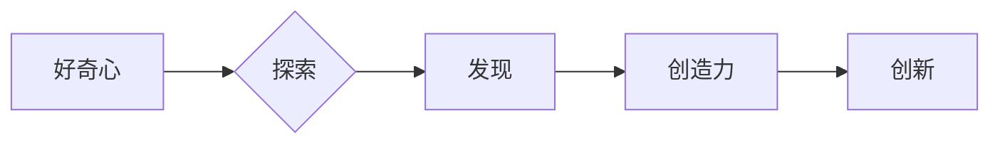

> 人工智能，好奇心，创造力，探索，算法，机器学习，深度学习，自然语言处理

## 1. 背景介绍

在科技日新月异的时代，人工智能（AI）正以惊人的速度发展，深刻地改变着我们的生活。从自动驾驶汽车到智能语音助手，从医疗诊断到金融交易，AI技术的应用领域日益广泛。然而，在AI的快速发展过程中，我们不禁要思考：是什么驱使着AI的进步？是什么让AI能够不断地学习、进化和创造？

答案或许就在于“好奇心”和“创造力”这两项人类特质。好奇心是人类探索未知世界的源泉，它驱使我们不断地提问、思考和发现。创造力则是将这些发现转化为新的知识、技术和产品的能力。

## 2. 核心概念与联系

好奇心和创造力是相互关联、相互促进的。好奇心激发我们对未知的探索，而创造力则让我们能够将探索的结果转化为有价值的成果。

**好奇心与创造力的关系**



**核心概念原理和架构**

好奇心驱动着AI的探索，而创造力则赋予AI以创新能力。

* **好奇心驱动的AI:** 通过设定目标和奖励机制，我们可以引导AI去探索未知领域，例如学习新的知识、发现新的模式或解决新的问题。
* **创造力赋予的AI:** 通过模仿人类的创造过程，例如启发式搜索、组合和演化，我们可以让AI生成新的内容，例如文本、图像、音乐或代码。

## 3. 核心算法原理 & 具体操作步骤

### 3.1  算法原理概述

**强化学习 (Reinforcement Learning)**

强化学习是一种机器学习方法，它通过奖励和惩罚机制来训练AI代理在环境中做出最优决策。

* **环境:** AI代理所处的环境，例如游戏世界或现实世界。
* **代理:** AI模型，它与环境交互并做出决策。
* **状态:** 环境的当前状态，例如游戏中的棋盘状态或现实世界中的传感器数据。
* **动作:** 代理可以采取的行动，例如在游戏中移动棋子或在现实世界中控制机器臂。
* **奖励:** 环境对代理动作的反馈，例如游戏中的分数或现实世界中的任务完成度。

**目标:** 通过学习环境的奖励机制，AI代理的目标是找到最优策略，使得在长期内获得最大的总奖励。

### 3.2  算法步骤详解

1. **初始化:** 初始化代理的策略，例如随机策略。
2. **感知环境:** 代理感知环境的当前状态。
3. **选择动作:** 根据当前状态和策略，代理选择一个动作。
4. **执行动作:** 代理执行选择的动作，并观察环境的变化。
5. **获得奖励:** 环境根据代理的动作提供奖励。
6. **更新策略:** 根据奖励信息，更新代理的策略，使得未来能够选择更优的动作。
7. **重复步骤2-6:** 重复上述步骤，直到代理学会了最优策略。

### 3.3  算法优缺点

**优点:**

* 可以解决复杂决策问题。
* 可以学习动态变化的环境。
* 可以实现自主学习和进化。

**缺点:**

* 需要大量的训练数据和计算资源。
* 训练过程可能很长且不稳定。
* 难以解释AI代理的决策过程。

### 3.4  算法应用领域

* **机器人控制:** 训练机器人自主导航、抓取物体和完成其他任务。
* **游戏 AI:** 训练游戏中的AI对手，使其更加智能和具有挑战性。
* **金融交易:** 训练AI系统进行股票交易、风险管理和投资决策。
* **医疗诊断:** 训练AI系统辅助医生诊断疾病、预测患者病情和制定治疗方案。

## 4. 数学模型和公式 & 详细讲解 & 举例说明

### 4.1  数学模型构建

强化学习的数学模型主要包括状态空间、动作空间、奖励函数和价值函数。

* **状态空间:** 所有可能的环境状态的集合。
* **动作空间:** 代理可以采取的所有动作的集合。
* **奖励函数:** 将环境状态和代理动作映射到奖励值的函数。
* **价值函数:** 将环境状态映射到代理在该状态下获得的长期奖励的期望值的函数。

### 4.2  公式推导过程

**Bellman 方程:**

$$
V(s) = \max_a \left[ R(s, a) + \gamma \sum_{s'} P(s' | s, a) V(s') \right]
$$

其中:

* $V(s)$ 是状态 $s$ 的价值函数。
* $R(s, a)$ 是在状态 $s$ 执行动作 $a$ 得到的奖励。
* $\gamma$ 是折扣因子，控制未来奖励的权重。
* $P(s' | s, a)$ 是从状态 $s$ 执行动作 $a$ 到状态 $s'$ 的转移概率。

### 4.3  案例分析与讲解

**例子:**

假设有一个简单的强化学习问题，例如一个机器人需要在迷宫中找到出口。

* **状态空间:** 迷宫中的所有位置。
* **动作空间:** 向上、向下、向左、向右四个方向移动。
* **奖励函数:** 当机器人到达出口时，奖励为 1，否则奖励为 0。
* **价值函数:** 每个位置的价值函数表示机器人到达该位置的期望奖励。

通过Bellman方程，我们可以迭代地更新每个位置的价值函数，直到找到最优策略，即机器人能够找到最短路径到达出口的策略。

## 5. 项目实践：代码实例和详细解释说明

### 5.1  开发环境搭建

* Python 3.x
* TensorFlow 或 PyTorch
* Jupyter Notebook

### 5.2  源代码详细实现

```python
import tensorflow as tf

# 定义模型
model = tf.keras.Sequential([
    tf.keras.layers.Dense(128, activation='relu'),
    tf.keras.layers.Dense(64, activation='relu'),
    tf.keras.layers.Dense(1, activation='sigmoid')
])

# 定义损失函数和优化器
loss_fn = tf.keras.losses.BinaryCrossentropy()
optimizer = tf.keras.optimizers.Adam()

# 训练模型
for epoch in range(100):
    for batch in dataset:
        with tf.GradientTape() as tape:
            predictions = model(batch['input'])
            loss = loss_fn(batch['target'], predictions)
        gradients = tape.gradient(loss, model.trainable_variables)
        optimizer.apply_gradients(zip(gradients, model.trainable_variables))

# 评估模型
accuracy = model.evaluate(test_dataset)
print(f'Accuracy: {accuracy}')
```

### 5.3  代码解读与分析

* **模型定义:** 使用TensorFlow构建一个简单的多层感知机模型。
* **损失函数和优化器:** 使用二分类交叉熵损失函数和Adam优化器。
* **训练模型:** 迭代地训练模型，更新模型参数。
* **评估模型:** 使用测试数据集评估模型的准确率。

### 5.4  运行结果展示

训练完成后，可以将模型应用于新的数据进行预测。

## 6. 实际应用场景

### 6.1  自然语言处理

* **机器翻译:** 使用强化学习训练模型，使其能够将一种语言翻译成另一种语言。
* **文本摘要:** 使用强化学习训练模型，使其能够自动生成文本的摘要。
* **对话系统:** 使用强化学习训练模型，使其能够与人类进行自然流畅的对话。

### 6.2  计算机视觉

* **图像识别:** 使用强化学习训练模型，使其能够识别图像中的物体。
* **目标跟踪:** 使用强化学习训练模型，使其能够跟踪图像中的目标。
* **图像生成:** 使用强化学习训练模型，使其能够生成新的图像。

### 6.3  其他领域

* **游戏 AI:** 训练游戏中的AI对手，使其更加智能和具有挑战性。
* **机器人控制:** 训练机器人自主导航、抓取物体和完成其他任务。
* **金融交易:** 训练AI系统进行股票交易、风险管理和投资决策。

### 6.4  未来应用展望

随着人工智能技术的不断发展，强化学习将在更多领域得到应用，例如自动驾驶、医疗诊断、个性化教育等。

## 7. 工具和资源推荐

### 7.1  学习资源推荐

* **书籍:**
    * Reinforcement Learning: An Introduction by Richard S. Sutton and Andrew G. Barto
    * Deep Reinforcement Learning Hands-On by Maxim Lapan
* **在线课程:**
    * Deep Reinforcement Learning Specialization by DeepLearning.AI
    * Reinforcement Learning by David Silver (University of DeepMind)

### 7.2  开发工具推荐

* **TensorFlow:** 开源深度学习框架，支持强化学习算法。
* **PyTorch:** 开源深度学习框架，支持强化学习算法。
* **OpenAI Gym:** 强化学习环境库，提供各种标准的强化学习任务。

### 7.3  相关论文推荐

* **Deep Q-Network (DQN):** Mnih et al. (2015)
* **Proximal Policy Optimization (PPO):** Schulman et al. (2017)
* **Trust Region Policy Optimization (TRPO):** Schulman et al. (2015)

## 8. 总结：未来发展趋势与挑战

### 8.1  研究成果总结

近年来，强化学习取得了显著的进展，在许多领域取得了突破性的成果。例如，AlphaGo通过强化学习战胜了世界围棋冠军，AlphaStar通过强化学习在星际争霸2中取得了职业水平的成绩。

### 8.2  未来发展趋势

* **更强大的算法:** 研究更强大的强化学习算法，例如能够解决更复杂问题的算法和能够学习更复杂环境的算法。
* **更有效的训练方法:** 研究更有效的训练方法，例如能够更快地训练模型和能够使用更少的数据训练模型的方法。
* **更广泛的应用:** 将强化学习应用到更多领域，例如自动驾驶、医疗诊断、个性化教育等。

### 8.3  面临的挑战

* **数据效率:** 强化学习算法通常需要大量的训练数据，这在某些领域可能难以获得。
* **可解释性:** 强化学习模型的决策过程通常难以解释，这可能导致人们对模型的信任度降低。
* **安全性和可靠性:** 强化学习模型在现实世界中的应用需要保证其安全性和可靠性，这需要进行大量的测试和验证。

### 8.4  研究展望

未来，强化学习将继续是一个重要的研究方向，它将推动人工智能技术的进步，并为人类社会带来更多福祉。


## 9. 附录：常见问题与解答

**Q1: 强化学习和监督学习有什么区别？**

**A1:** 强化学习和监督学习都是机器学习的范式，但它们的区别在于数据的使用方式。监督学习使用标记数据来训练模型，而强化学习使用奖励信号来训练模型。

**Q2: 强化学习的应用场景有哪些？**

**A2:** 强化学习的应用场景非常广泛，例如游戏 AI、机器人控制、自动驾驶、医疗诊断、金融交易等。

**Q3: 如何评估强化学习模型的性能？**

**A3:** 强化学习模型的性能通常通过奖励总和来评估，奖励总和越高，模型的性能越好。

**Q4: 强化学习的未来发展趋势是什么？**

**A4:** 强化学习的未来发展趋势包括开发更强大的算法、提高训练效率、拓展应用领域等。


作者：禅与计算机程序设计艺术 / Zen and the Art of Computer Programming 
<end_of_turn>