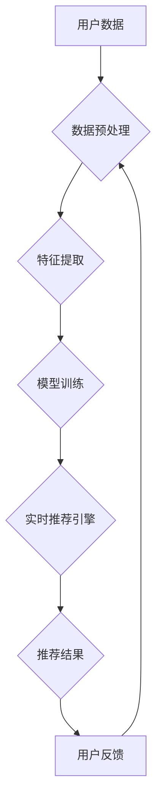

> 实时推荐, 协同过滤, 内容过滤, 深度学习, 矩阵分解, 模型训练, 算法优化, 推荐系统

## 1. 背景介绍

在信息爆炸的时代，海量数据和个性化需求共同催生了推荐系统的蓬勃发展。实时推荐技术作为推荐系统的重要组成部分，旨在根据用户实时行为和上下文信息，快速精准地推荐相关内容，为用户提供更个性化、更及时、更有效的体验。

实时推荐技术在各个领域都有广泛的应用，例如：

* **电商平台**: 根据用户的浏览历史、购买记录、购物车内容等实时信息，推荐个性化商品，提高转化率。
* **视频平台**: 根据用户的观看记录、点赞、评论等行为，推荐相关视频，提升用户粘性和内容发现率。
* **社交媒体**: 根据用户的兴趣爱好、好友互动、实时话题等信息，推荐相关内容，增强用户参与度和社交互动。

## 2. 核心概念与联系

实时推荐技术的核心在于快速高效地处理海量数据，并根据用户实时行为进行精准的个性化推荐。

**核心概念**:

* **用户**: 推荐系统的核心对象，拥有独特的兴趣爱好、行为模式和需求。
* **物品**: 需要被推荐的内容，例如商品、视频、文章等。
* **交互**: 用户与物品之间的互动行为，例如浏览、点击、购买、点赞等。
* **上下文**: 用户行为发生的场景和环境信息，例如时间、地点、设备等。

**架构**:



## 3. 核心算法原理 & 具体操作步骤

### 3.1  算法原理概述

实时推荐算法主要分为两大类：

* **协同过滤**: 基于用户之间的相似性或物品之间的相似性进行推荐。
* **内容过滤**: 基于物品的特征和用户偏好进行推荐。

### 3.2  算法步骤详解

**协同过滤**:

1. **用户-物品交互矩阵构建**: 将用户和物品的交互行为记录到一个矩阵中，其中每个元素表示用户对物品的评分或交互行为。
2. **相似性计算**: 计算用户之间的相似度或物品之间的相似度，常用的方法包括余弦相似度、皮尔逊相关系数等。
3. **推荐生成**: 根据用户或物品的相似性，推荐与用户或物品相似的其他内容。

**内容过滤**:

1. **物品特征提取**: 将物品的特征信息提取出来，例如商品的类别、价格、描述等。
2. **用户偏好建模**: 建立用户对不同特征的偏好模型，例如用户喜欢高价商品、喜欢特定类别的商品等。
3. **推荐生成**: 根据用户偏好模型和物品特征，推荐符合用户偏好的物品。

### 3.3  算法优缺点

**协同过滤**:

* **优点**: 可以发现用户隐性偏好，推荐更个性化的内容。
* **缺点**: 数据稀疏性问题，新用户新物品冷启动问题。

**内容过滤**:

* **优点**: 不需要用户历史交互数据，可以推荐新用户新物品。
* **缺点**: 难以捕捉用户隐性偏好，推荐结果可能不够个性化。

### 3.4  算法应用领域

* **协同过滤**: 电商平台商品推荐、视频平台视频推荐、音乐平台歌曲推荐等。
* **内容过滤**: 新闻推荐、博客推荐、学术论文推荐等。

## 4. 数学模型和公式 & 详细讲解 & 举例说明

### 4.1  数学模型构建

协同过滤算法通常使用矩阵分解模型进行建模，将用户-物品交互矩阵分解成两个低维矩阵，分别表示用户特征和物品特征。

假设用户集合为U，物品集合为I，用户-物品交互矩阵为R，则矩阵分解模型可以表示为：

$$R \approx U V^T$$

其中，U为用户特征矩阵，V为物品特征矩阵。

### 4.2  公式推导过程

目标函数是最小化用户-物品交互矩阵与预测矩阵之间的误差，常用的损失函数为均方误差：

$$L(U, V) = \frac{1}{2} \sum_{u \in U, i \in I} (R_{ui} - \hat{R}_{ui})^2$$

其中，$\hat{R}_{ui}$为预测的用户对物品的交互行为。

通过梯度下降算法优化目标函数，得到用户特征矩阵U和物品特征矩阵V。

### 4.3  案例分析与讲解

例如，假设有一个用户-物品交互矩阵，其中用户1对物品1评分为5，用户2对物品1评分为3，用户1对物品2评分为4，用户2对物品2评分为2。

使用矩阵分解模型进行建模，可以得到用户特征矩阵和物品特征矩阵，从而预测用户对其他物品的评分。

## 5. 项目实践：代码实例和详细解释说明

### 5.1  开发环境搭建

* Python 3.x
* TensorFlow/PyTorch
* Scikit-learn

### 5.2  源代码详细实现

```python
import tensorflow as tf

# 定义用户-物品交互矩阵
R = tf.constant([[5, 4], [3, 2]])

# 定义用户特征矩阵和物品特征矩阵
U = tf.Variable(tf.random.normal([2, 2]))
V = tf.Variable(tf.random.normal([2, 2]))

# 定义预测矩阵
R_hat = tf.matmul(U, V, transpose_b=True)

# 定义损失函数
loss = tf.reduce_mean(tf.square(R - R_hat))

# 定义优化器
optimizer = tf.keras.optimizers.Adam()

# 训练模型
for epoch in range(100):
    with tf.GradientTape() as tape:
        loss_value = loss
    gradients = tape.gradient(loss_value, [U, V])
    optimizer.apply_gradients(zip(gradients, [U, V]))

# 打印训练结果
print(loss_value)
```

### 5.3  代码解读与分析

* 代码首先定义了用户-物品交互矩阵R，以及用户特征矩阵U和物品特征矩阵V。
* 然后定义了预测矩阵R_hat，并计算了损失函数loss。
* 使用Adam优化器对模型进行训练，并打印训练结果。

### 5.4  运行结果展示

训练完成后，可以将预测矩阵R_hat与真实矩阵R进行比较，评估模型的性能。

## 6. 实际应用场景

### 6.1  电商平台商品推荐

实时推荐技术可以根据用户的浏览历史、购买记录、购物车内容等信息，推荐个性化商品，提高转化率。例如，当用户浏览某个商品时，系统可以根据用户的浏览历史和购买记录，推荐其他用户也感兴趣的商品。

### 6.2  视频平台视频推荐

实时推荐技术可以根据用户的观看记录、点赞、评论等行为，推荐相关视频，提升用户粘性和内容发现率。例如，当用户观看某个视频时，系统可以根据用户的观看记录和点赞行为，推荐其他用户也喜欢的视频。

### 6.3  社交媒体内容推荐

实时推荐技术可以根据用户的兴趣爱好、好友互动、实时话题等信息，推荐相关内容，增强用户参与度和社交互动。例如，当用户关注某个话题时，系统可以根据用户的关注话题和好友互动，推荐其他用户也感兴趣的内容。

### 6.4  未来应用展望

随着人工智能技术的不断发展，实时推荐技术将应用于更多领域，例如：

* **个性化教育**: 根据学生的学习进度和兴趣爱好，推荐个性化学习内容。
* **医疗保健**: 根据患者的病史和症状，推荐相关医疗信息和服务。
* **金融服务**: 根据用户的投资偏好和风险承受能力，推荐个性化投资方案。

## 7. 工具和资源推荐

### 7.1  学习资源推荐

* **书籍**:
    * 《推荐系统实践》
    * 《机器学习》
* **在线课程**:
    * Coursera: Recommender Systems
    * Udacity: Machine Learning Engineer Nanodegree

### 7.2  开发工具推荐

* **Python**: 广泛应用于机器学习和数据科学领域。
* **TensorFlow**: 开源深度学习框架。
* **PyTorch**: 开源深度学习框架。
* **Scikit-learn**: 机器学习库。

### 7.3  相关论文推荐

* **Collaborative Filtering for Implicit Feedback Datasets**
* **Matrix Factorization Techniques for Recommender Systems**
* **Deep Learning for Recommender Systems**

## 8. 总结：未来发展趋势与挑战

### 8.1  研究成果总结

实时推荐技术在近年来取得了显著的进展，算法模型不断优化，推荐效果不断提升。

### 8.2  未来发展趋势

* **个性化推荐**: 更加精准地理解用户的需求，提供更加个性化的推荐。
* **跨平台推荐**: 将用户行为数据整合到多个平台，提供更加全面的推荐。
* **解释性推荐**: 为推荐结果提供更清晰的解释，增强用户信任度。

### 8.3  面临的挑战

* **数据稀疏性**: 用户-物品交互数据往往稀疏，难以训练有效的推荐模型。
* **冷启动问题**: 新用户和新物品难以获得推荐，需要新的算法和策略解决。
* **公平性问题**: 推荐算法可能存在偏见，导致推荐结果不公平，需要关注算法的公平性。

### 8.4  研究展望

未来，实时推荐技术将继续朝着更加个性化、智能化、公平化的方向发展，为用户提供更加优质的体验。

## 9. 附录：常见问题与解答

* **Q1**: 如何解决数据稀疏性问题？
* **A1**: 可以使用矩阵分解、协同过滤等算法，以及利用用户相似性、物品相似性等信息进行补全。
* **Q2**: 如何解决冷启动问题？
* **A2**: 可以使用基于内容过滤、基于知识图谱等方法，以及利用用户行为特征、物品属性信息进行推荐。
* **Q3**: 如何评估推荐系统的性能？
* **A3**: 可以使用准确率、召回率、NDCG等指标进行评估。


作者：禅与计算机程序设计艺术 / Zen and the Art of Computer Programming 
<end_of_turn>