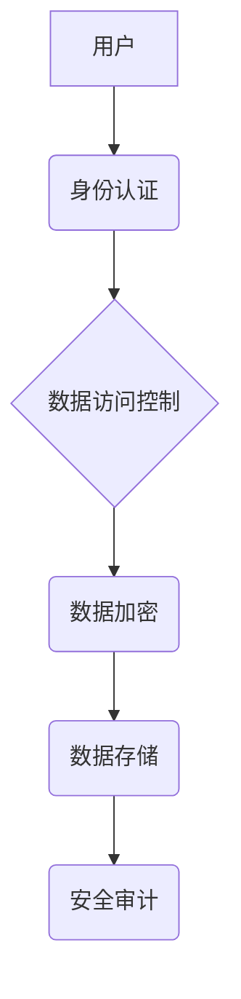

> 平台经济、数据安全、安全方案、数据加密、身份认证、访问控制、数据脱敏、隐私保护、安全审计

## 1. 背景介绍

平台经济作为一种以平台为核心、连接用户和提供商的商业模式，其发展迅速，为经济社会带来了巨大变革。然而，平台经济也面临着严峻的数据安全挑战。平台收集和处理海量用户数据，这些数据包含个人隐私信息、交易记录、行为轨迹等敏感信息，一旦泄露或被恶意利用，将造成严重后果。因此，制定有效的平台经济数据安全技术方案至关重要。

## 2. 核心概念与联系

**2.1 数据安全概念**

数据安全是指保护数据免受未经授权的访问、使用、披露、修改或销毁等威胁，确保数据完整性、可用性和机密性。

**2.2 平台经济数据安全挑战**

平台经济的数据安全面临着以下挑战：

* **数据量大、结构复杂:** 平台收集和处理海量数据，数据类型多样，结构复杂，难以进行统一管理和保护。
* **数据流动性强:** 数据在平台内和平台之间流动频繁，增加了数据泄露的风险。
* **用户隐私保护:** 平台收集的用户数据包含大量个人隐私信息，需要采取有效措施保护用户隐私。
* **安全技术复杂:** 数据安全技术不断发展，平台需要不断学习和更新安全技术，才能有效应对新的安全威胁。

**2.3 平台经济数据安全技术方案**

平台经济数据安全技术方案应涵盖以下几个方面：

* **数据加密:** 对敏感数据进行加密，防止未经授权的访问和使用。
* **身份认证:** 对用户和系统进行身份认证，确保只有授权用户才能访问数据。
* **访问控制:** 对数据访问进行权限控制，限制用户对数据的访问范围。
* **数据脱敏:** 对敏感数据进行脱敏处理，保护用户隐私。
* **安全审计:** 对数据访问和操作进行审计，记录操作日志，方便追溯和调查安全事件。

**2.4 数据安全技术架构**



## 3. 核心算法原理 & 具体操作步骤

**3.1 算法原理概述**

数据加密算法是平台经济数据安全技术方案的核心，其目的是将敏感数据转换为不可读的形式，防止未经授权的访问和使用。常见的加密算法包括：

* **对称加密算法:** 使用相同的密钥进行加密和解密，例如AES、DES等。
* **非对称加密算法:** 使用一对密钥进行加密和解密，公钥用于加密，私钥用于解密，例如RSA、ECC等。

**3.2 算法步骤详解**

**对称加密算法:**

1. 选择一个密钥。
2. 使用密钥对数据进行加密。
3. 将加密后的数据传输或存储。
4. 使用相同的密钥对数据进行解密。

**非对称加密算法:**

1. 生成一对密钥：公钥和私钥。
2. 使用公钥对数据进行加密。
3. 将加密后的数据传输或存储。
4. 使用私钥对数据进行解密。

**3.3 算法优缺点**

**对称加密算法:**

* **优点:** 加密速度快，解密速度快。
* **缺点:** 密钥管理复杂，密钥泄露风险高。

**非对称加密算法:**

* **优点:** 密钥管理相对简单，密钥泄露风险低。
* **缺点:** 加密速度慢，解密速度慢。

**3.4 算法应用领域**

* **数据加密:** 对敏感数据进行加密，防止未经授权的访问和使用。
* **数字签名:** 验证数据来源和完整性。
* **身份认证:** 验证用户的身份。

## 4. 数学模型和公式 & 详细讲解 & 举例说明

**4.1 数学模型构建**

数据安全技术方案可以抽象为一个数学模型，其中包括数据、用户、攻击者和安全策略等要素。

**数据安全模型:**

$$
D = \{d_1, d_2, ..., d_n\}
$$

其中，$D$ 表示数据集合，$d_i$ 表示数据元素。

**用户模型:**

$$
U = \{u_1, u_2, ..., u_m\}
$$

其中，$U$ 表示用户集合，$u_i$ 表示用户元素。

**攻击者模型:**

$$
A = \{a_1, a_2, ..., a_k\}
$$

其中，$A$ 表示攻击者集合，$a_i$ 表示攻击者元素。

**安全策略模型:**

$$
S = \{s_1, s_2, ..., s_l\}
$$

其中，$S$ 表示安全策略集合，$s_i$ 表示安全策略元素。

**4.2 公式推导过程**

数据安全模型的目标是最大化数据安全，最小化安全风险。可以定义一个安全指标来衡量数据安全水平，例如数据泄露概率。

**数据泄露概率:**

$$
P(D) = \frac{N(A, D)}{N(U, D)}
$$

其中，$N(A, D)$ 表示攻击者成功访问数据的次数，$N(U, D)$ 表示用户访问数据的次数。

**4.3 案例分析与讲解**

假设一个平台收集用户姓名、年龄、性别等信息。攻击者试图窃取用户姓名和年龄信息。

* 数据集合：$D = \{姓名, 年龄, 性别\}$
* 用户集合：$U = \{用户1, 用户2, ..., 用户N\}$
* 攻击者集合：$A = \{攻击者1, 攻击者2\}$
* 安全策略集合：$S = \{数据加密, 身份认证, 访问控制\}$

平台可以采用数据加密、身份认证和访问控制等安全策略来降低数据泄露概率。例如，对用户姓名和年龄信息进行加密，要求用户进行身份认证才能访问这些信息，并设置访问权限，限制用户只能访问自己相关的信息。

## 5. 项目实践：代码实例和详细解释说明

**5.1 开发环境搭建**

* 操作系统：Linux
* 编程语言：Python
* 开发工具：VS Code

**5.2 源代码详细实现**

```python
# 数据加密
from cryptography.fernet import Fernet

# 生成密钥
key = Fernet.generate_key()
fernet = Fernet(key)

# 加密数据
message = "敏感信息".encode()
encrypted_message = fernet.encrypt(message)

# 解密数据
decrypted_message = fernet.decrypt(encrypted_message)

# 身份认证
from flask_login import LoginManager, UserMixin

# 用户模型
class User(UserMixin):
    def __init__(self, id, username, password):
        self.id = id
        self.username = username
        self.password = password

# 访问控制
from flask import Flask, request, jsonify

app = Flask(__name__)

@app.route('/data')
def get_data():
    # 检查用户身份
    if not current_user.is_authenticated:
        return jsonify({'error': 'Unauthorized'}), 401
    # 返回数据
    return jsonify({'data': '敏感信息'})

```

**5.3 代码解读与分析**

* 数据加密部分使用Fernet库对数据进行加密和解密。
* 身份认证部分使用Flask-Login库实现用户身份认证。
* 访问控制部分使用Flask框架对数据访问进行权限控制。

**5.4 运行结果展示**

* 运行代码后，可以访问`/data`接口获取数据。
* 只有经过身份认证的用户才能访问`/data`接口。

## 6. 实际应用场景

**6.1 电商平台**

电商平台收集用户购物记录、支付信息等敏感数据，需要采用数据加密、身份认证、访问控制等技术来保护用户隐私。

**6.2 社交平台**

社交平台收集用户个人信息、聊天记录等敏感数据，需要采用数据脱敏、隐私保护等技术来保护用户隐私。

**6.3 金融平台**

金融平台收集用户银行账户信息、交易记录等敏感数据，需要采用数据加密、身份认证、安全审计等技术来保障数据安全。

**6.4 未来应用展望**

随着平台经济的不断发展，数据安全技术方案将更加复杂和智能化。未来，数据安全技术方案将更加注重：

* **人工智能技术:** 利用人工智能技术进行数据安全威胁检测和预警。
* **区块链技术:** 利用区块链技术实现数据安全可追溯和不可篡改。
* **云计算技术:** 利用云计算技术提供更加灵活和弹性的数据安全服务。

## 7. 工具和资源推荐

**7.1 学习资源推荐**

* **书籍:**
    * 《数据安全》
    * 《网络安全》
* **网站:**
    * OWASP
    * SANS Institute

**7.2 开发工具推荐**

* **数据加密工具:** OpenSSL, GPG
* **身份认证工具:** Keycloak, Auth0
* **访问控制工具:** Apache Shiro, Spring Security

**7.3 相关论文推荐**

* 《数据安全技术研究》
* 《平台经济数据安全挑战与应对策略》

## 8. 总结：未来发展趋势与挑战

**8.1 研究成果总结**

本文介绍了平台经济数据安全技术方案的构建，包括核心概念、算法原理、代码实现以及实际应用场景。

**8.2 未来发展趋势**

未来，平台经济数据安全技术方案将更加注重人工智能、区块链和云计算技术的应用，实现更加智能化、安全可靠的数据保护。

**8.3 面临的挑战**

平台经济数据安全技术方案面临着以下挑战：

* **技术复杂性:** 数据安全技术不断发展，平台需要不断学习和更新安全技术。
* **成本压力:** 数据安全技术方案的实施需要投入一定的成本。
* **法律法规:** 数据安全法律法规不断完善，平台需要及时了解和遵守相关法律法规。

**8.4 研究展望**

未来，我们将继续研究平台经济数据安全技术方案，探索更加安全可靠的数据保护方法，为平台经济的可持续发展提供技术支持。

## 9. 附录：常见问题与解答

**9.1 如何选择合适的加密算法？**

选择加密算法需要根据实际应用场景和数据敏感程度进行选择。对敏感数据，建议使用非对称加密算法，例如RSA。

**9.2 如何管理密钥？**

密钥管理是数据安全的重要环节，需要采用安全可靠的密钥管理系统，确保密钥的安全性和保密性。

**9.3 如何进行数据脱敏？**

数据脱敏是指对敏感数据进行处理，去除或隐藏敏感信息，例如将姓名替换为代号。

**9.4 如何进行安全审计？**

安全审计是指对数据访问和操作进行记录和分析，以便追溯和调查安全事件。

作者：禅与计算机程序设计艺术 / Zen and the Art of Computer Programming


<end_of_turn>