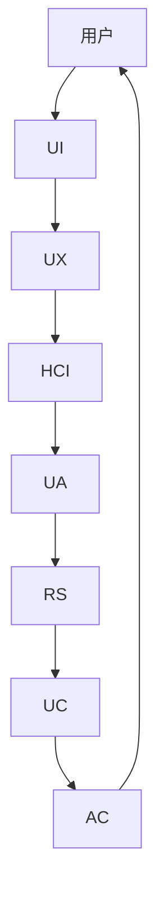

                 

# 用户界面设计：打造友好易用的人机交互

## 1. 背景介绍

随着人工智能(AI)技术的迅猛发展，人机交互界面(UI)设计在用户体验(UX)中扮演着越来越重要的角色。UI不仅需要满足用户对信息获取的需求，还需要提供直观、高效的操作方式，确保用户能够流畅地与系统互动。本文将从基础概念出发，探讨UI设计的核心原则与策略，力求为读者提供一个全面、深入的用户界面设计指南。

## 2. 核心概念与联系

### 2.1 核心概念概述

为了更好地理解用户界面设计，首先介绍几个关键概念及其相互联系：

1. **用户界面(UI)**：用户与系统交互的界面，包括显示器、键盘、鼠标、触摸屏等硬件设备。
2. **用户体验(UX)**：用户在使用产品时的情感和心理体验，是衡量产品质量的重要指标。
3. **人机交互(HCI)**：研究人和计算机如何交互的技术和科学，是UI设计的核心。
4. **可用性(UA)**：衡量用户使用产品时的效率、成功率和满意度，是评估UI设计的关键指标。
5. **响应性(RS)**：指用户与UI交互时系统的响应速度，直接影响到用户体验。
6. **一致性(UC)**：保证UI元素的样式和行为在不同场景下保持一致，增强用户对系统的熟悉度和信任感。
7. **可访问性(AC)**：确保UI设计能够被所有用户（包括残障人士）访问和理解，提高产品的普及度和包容性。

这些概念相互联系，共同构成了用户界面设计的理论基础。

### 2.2 核心概念原理和架构的 Mermaid 流程图



这个流程图展示了用户、UI、UX、HCI、UA、RS、UC和AC之间的关系。用户通过UI与系统交互，UI设计要围绕UX目标，采用HCI原则，考虑UA、RS和UC，同时确保系统的可访问性。

## 3. 核心算法原理 & 具体操作步骤

### 3.1 算法原理概述

用户界面设计的核心原理在于“以用户为中心”的设计思想，即通过深入了解用户需求，合理规划UI元素和布局，为用户提供直观、高效的交互体验。设计过程通常包括以下几个步骤：

1. **需求分析**：理解用户的使用场景和需求，通过问卷调查、用户访谈等手段获取第一手资料。
2. **信息架构**：构建系统的信息框架，确定内容分类、导航方式和信息流向。
3. **原型设计**：根据信息架构，设计UI原型，包括布局、控件和交互逻辑。
4. **用户测试**：在初步设计完成后，进行用户测试，收集反馈，发现问题并进行优化。
5. **迭代优化**：根据用户反馈和测试结果，不断调整和优化UI设计，直至满足用户需求。

### 3.2 算法步骤详解

以下详细介绍用户界面设计的具体步骤和实现方法：

#### 3.2.1 需求分析

需求分析是UI设计的起点，其目的是准确理解用户需求和目标，以便设计出符合用户期望的产品。常用的方法包括：

1. **问卷调查**：设计问卷，向目标用户群体收集信息，了解他们的需求、使用习惯和痛点。
2. **用户访谈**：通过与用户面对面交流，深入了解其使用场景、期望和限制。
3. **竞品分析**：分析竞争对手的产品，了解市场趋势和用户偏好。
4. **用户画像**：创建详细的用户画像，包括人口统计学信息、心理特征和行为习惯，以便更准确地定位目标用户。

#### 3.2.2 信息架构

信息架构决定了系统的内容组织方式，其核心在于如何合理地划分内容和导航结构，让用户能够高效地获取和理解信息。具体步骤包括：

1. **内容分类**：将系统内容按照逻辑关系划分为不同的类别，如新闻、文章、图片等。
2. **导航设计**：设计合理的导航方式，如菜单栏、面包屑导航、标签页等，使用户能够轻松切换和查找信息。
3. **信息流向**：确定信息流动方向，包括内容展示的优先级、用户浏览路径和交互行为等。

#### 3.2.3 原型设计

原型设计是将信息架构转化为视觉和交互设计的过程。具体步骤如下：

1. **布局设计**：设计UI的布局，包括页面尺寸、元素大小、间距和对齐等，确保页面整洁、美观。
2. **控件设计**：选择适合用户操作需求的控件，如按钮、文本框、滑块等，并定义其交互规则。
3. **交互逻辑**：设计用户与UI的交互流程，确保每个操作都能够快速响应，提供即时反馈。
4. **原型实现**：使用工具如Sketch、Adobe XD、Figma等，实现UI原型，并进行初步的测试和优化。

#### 3.2.4 用户测试

用户测试是评估UI设计的重要环节，通过实际用户的操作和反馈，发现设计中的问题并进行改进。具体步骤如下：

1. **测试计划**：制定详细的测试计划，包括测试目标、测试方法、测试场景和评价指标等。
2. **用户招募**：根据用户画像和需求分析，选择适合的测试用户。
3. **测试执行**：在用户使用产品的过程中，记录他们的行为和反馈，收集数据和问题。
4. **数据分析**：对测试数据进行分析，发现用户普遍存在的问题和优化点。
5. **改进优化**：根据分析结果，进行UI设计的迭代和优化，确保产品满足用户需求。

#### 3.2.5 迭代优化

迭代优化是UI设计不断改进和完善的过程，其目的是通过反复测试和用户反馈，逐步提升产品的可用性和用户体验。具体步骤如下：

1. **新版本设计**：根据测试结果和用户反馈，进行新一轮的设计和开发。
2. **内测和发布**：在内测阶段进行进一步优化，确保新版本的稳定性和可用性，再正式发布。
3. **用户反馈**：持续收集用户的使用反馈，发现新问题和改进点。
4. **持续改进**：不断迭代优化，提升产品的整体质量和用户体验。

### 3.3 算法优缺点

#### 3.3.1 优点

用户界面设计的优点在于能够通过科学的方法，系统性地解决用户需求和问题，提升产品的可用性和用户体验。具体包括：

1. **用户中心**：通过深入了解用户需求，设计符合用户期望的产品，提升用户满意度。
2. **系统高效**：通过合理的布局和控件设计，提升用户操作效率，减少误操作和错误。
3. **问题反馈**：通过用户测试和反馈机制，及时发现和解决问题，持续改进产品。
4. **可扩展性**：通过模块化和标准化设计，支持产品的扩展和迭代，适应不断变化的需求。

#### 3.3.2 缺点

用户界面设计也有其局限性，主要体现在：

1. **复杂度高**：设计过程中需要综合考虑多方面因素，如用户需求、技术实现、市场趋势等，工作量较大。
2. **成本高昂**：设计过程中需要大量的时间和资源投入，特别是初期需求分析和原型设计阶段。
3. **难度较大**：需要综合运用心理学、人类工效学等多学科知识，对设计师要求较高。

### 3.4 算法应用领域

用户界面设计广泛应用于各种类型的应用程序和系统，具体包括：

1. **移动应用**：如iOS、Android、Windows Phone等移动设备上的应用。
2. **Web应用**：如网页、浏览器插件、在线服务等。
3. **桌面应用**：如Windows、macOS、Linux等操作系统上的桌面应用程序。
4. **智能设备**：如智能家居、智能手表、智能电视等设备的用户界面。
5. **虚拟现实(VR)和增强现实(AR)**：如虚拟现实头显、增强现实眼镜等设备的用户界面。

## 4. 数学模型和公式 & 详细讲解 & 举例说明

### 4.1 数学模型构建

用户界面设计通常不涉及复杂的数学模型，但可以通过一些简单的模型和公式来描述和优化UI设计。以下介绍几个常用的模型和公式：

#### 4.1.1 信息熵模型

信息熵模型用于衡量信息的不确定性，即信息源产生的随机事件的不确定性。在UI设计中，信息熵可以用来量化用户对系统的理解程度。

**公式**：
$$ H(S) = -\sum_{x \in S} P(x) \log P(x) $$

**解释**：$S$为系统状态集合，$P(x)$为状态$x$的概率。

#### 4.1.2 任务完成时间模型

任务完成时间模型用于衡量用户在特定任务上所需的时间，包括浏览、操作、等待等时间。通过优化这些时间，可以提升用户的使用效率。

**公式**：
$$ T_{total} = T_{browsing} + T_{operating} + T_{waiting} $$

**解释**：$T_{total}$为总任务完成时间，$T_{browsing}$为浏览时间，$T_{operating}$为操作时间，$T_{waiting}$为等待时间。

#### 4.1.3 点击率模型

点击率模型用于衡量用户在UI中的点击行为，通过优化点击率，可以提高用户的操作效率和满意度。

**公式**：
$$ CTR = \frac{Clicks}{Total Interactions} $$

**解释**：$CTR$为点击率，$Clicks$为用户点击的次数，$Total Interactions$为用户交互的总次数。

### 4.2 公式推导过程

#### 4.2.1 信息熵模型

信息熵模型的推导过程如下：

1. 假设系统有$n$个状态，每个状态的概率为$P(x)$。
2. 信息熵定义为$H(S)$，即系统状态的不确定性。
3. 根据信息熵的定义，$H(S)$可以表示为：
   $$ H(S) = -\sum_{x \in S} P(x) \log P(x) $$

   其中，$\log$表示以自然对数为底的对数。

#### 4.2.2 任务完成时间模型

任务完成时间模型的推导过程如下：

1. 假设用户完成一个任务所需的时间为$T$，包含浏览时间$T_{browsing}$、操作时间$T_{operating}$和等待时间$T_{waiting}$。
2. 总任务完成时间$T_{total}$可以表示为：
   $$ T_{total} = T_{browsing} + T_{operating} + T_{waiting} $$

   其中，$T_{total}$为总任务完成时间，$T_{browsing}$为浏览时间，$T_{operating}$为操作时间，$T_{waiting}$为等待时间。

#### 4.2.3 点击率模型

点击率模型的推导过程如下：

1. 假设用户在UI中的点击次数为$Clicks$，总交互次数为$Total Interactions$。
2. 点击率$CTR$可以表示为：
   $$ CTR = \frac{Clicks}{Total Interactions} $$

   其中，$CTR$为点击率，$Clicks$为用户点击的次数，$Total Interactions$为用户交互的总次数。

### 4.3 案例分析与讲解

#### 4.3.1 信息熵模型

信息熵模型在UI设计中的应用案例包括：

1. **导航设计**：通过分析用户对不同导航路径的选择概率，评估用户对系统的理解程度，优化导航结构。
2. **内容组织**：通过计算不同内容分类下的信息熵，确定用户最感兴趣的内容，优化信息架构。

#### 4.3.2 任务完成时间模型

任务完成时间模型在UI设计中的应用案例包括：

1. **操作流程**：通过分析用户在特定任务上的时间消耗，优化操作流程，减少等待和误操作。
2. **用户反馈**：通过记录用户的操作时间，收集用户的使用反馈，改进UI设计。

#### 4.3.3 点击率模型

点击率模型在UI设计中的应用案例包括：

1. **按钮优化**：通过分析用户对不同按钮的点击率，优化按钮的布局和颜色，提升点击效率。
2. **界面设计**：通过计算不同界面元素的使用率，优化界面设计，减少冗余元素和干扰。

## 5. 项目实践：代码实例和详细解释说明

### 5.1 开发环境搭建

为了进行UI设计的实践，需要准备以下开发环境：

1. **操作系统**：Windows、macOS、Linux等主流操作系统。
2. **开发工具**：Sketch、Adobe XD、Figma等设计工具。
3. **编程语言**：HTML、CSS、JavaScript等前端语言。
4. **框架和库**：React、Vue、Angular等前端框架，Bootstrap、Materialize等UI库。
5. **开发环境**：Visual Studio Code、Atom、Sublime Text等编辑器。

### 5.2 源代码详细实现

以下以一个简单的移动应用为例，展示UI设计的代码实现：

**示例代码**：
```html
<!DOCTYPE html>
<html>
<head>
    <title>用户界面设计示例</title>
    <style>
        body {
            font-family: Arial, sans-serif;
            background-color: #f0f0f0;
        }
        header {
            background-color: #333;
            color: #fff;
            padding: 10px;
            text-align: center;
        }
        .container {
            margin: 20px;
            padding: 20px;
            background-color: #fff;
            border: 1px solid #ddd;
            border-radius: 5px;
        }
        input[type="text"] {
            padding: 10px;
            border: 1px solid #ddd;
            border-radius: 5px;
        }
        button {
            padding: 10px;
            background-color: #337ab7;
            color: #fff;
            border: none;
            border-radius: 5px;
            cursor: pointer;
        }
    </style>
</head>
<body>
    <header>
        <h1>用户界面设计示例</h1>
    </header>
    <div class="container">
        <h2>登录表单</h2>
        <form>
            <label for="username">用户名：</label>
            <input type="text" id="username" name="username"><br><br>
            <label for="password">密码：</label>
            <input type="password" id="password" name="password"><br><br>
            <button type="submit">登录</button>
        </form>
    </div>
</body>
</html>
```

**代码解释**：
- **HTML结构**：页面结构包括头部和主体部分，主体部分包含一个简单的登录表单。
- **CSS样式**：定义了页面的基本样式，包括字体、背景、边距等。
- **表单控件**：包括用户名输入框、密码输入框和提交按钮。

### 5.3 代码解读与分析

**代码解读**：
- **HTML标签**：`<!DOCTYPE html>`表示文档类型声明，`<html>`是根元素，`<head>`包含文档的头部信息，`<title>`定义了页面标题，`<body>`包含文档的主体内容。
- **CSS样式**：通过`<style>`标签定义了页面的样式，包括字体、背景、边距等。
- **表单控件**：`<input>`标签用于定义表单控件，`type="text"`表示文本输入框，`type="password"`表示密码输入框，`<button>`标签用于定义提交按钮。

**代码分析**：
- **页面结构**：代码结构清晰，HTML标签层次分明，易于理解和修改。
- **样式定义**：CSS样式简洁，定义了页面的基本布局和样式，便于后续样式修改和优化。
- **表单控件**：表单控件符合标准，用户填写信息时能够快速提交，提高了用户的使用效率。

### 5.4 运行结果展示

运行上述代码，页面会显示一个简单的登录表单，用户可以输入用户名和密码，并点击提交按钮登录系统。界面简洁明了，符合用户对登录页面的基本需求。

## 6. 实际应用场景

### 6.1 智能家居设备

智能家居设备的用户界面设计需要考虑用户的年龄、文化背景和使用习惯等因素。例如，对于老年人使用的设备，界面应该更加简单明了，字体和按钮大小应该适当放大，操作流程也应该尽量简化。此外，设备需要提供语音识别和手势控制等多种交互方式，以适应不同用户的需求。

### 6.2 医疗健康应用

医疗健康应用的用户界面设计需要遵循医学标准和规定，界面元素需要清晰、准确，避免误导用户。例如，显示药物剂量时，应该使用标准单位，避免出现计量错误。此外，用户需要能够在设备上方便地查看健康数据，如心率、血压等，界面应该简洁、直观，让用户能够快速获取所需信息。

### 6.3 电子商务平台

电子商务平台的用户界面设计需要考虑用户的购物体验，界面应该清晰、易用，让用户能够快速找到所需商品，方便浏览和购买。例如，商品页面应该提供高清图片和详细描述，用户可以通过搜索、筛选等方式快速查找商品。此外，用户还需要能够方便地进行结账、支付等操作，界面应该提供简洁的操作流程和清晰的指引。

### 6.4 未来应用展望

未来，随着人工智能技术的不断进步，用户界面设计也将迎来新的变革。以下展望几种可能的发展趋势：

1. **智能交互**：未来UI设计将更加注重智能交互，通过语音识别、手势控制等技术，实现更自然的人机交互。
2. **虚拟现实**：虚拟现实技术将带来全新的用户界面体验，用户在虚拟环境中可以更加直观地操作设备，提升使用体验。
3. **多模态交互**：未来UI设计将支持多模态交互，用户可以通过声音、图像、手势等多种方式进行交互，提升用户体验。
4. **个性化定制**：未来的UI设计将更加注重个性化定制，通过用户行为分析，提供更加符合用户需求的个性化界面和交互方式。

## 7. 工具和资源推荐

### 7.1 学习资源推荐

为了帮助开发者系统掌握用户界面设计的方法和技巧，以下是一些优质的学习资源：

1. **《Don't Make Me Think》**：史蒂夫·克鲁格（Steve Krug）的经典著作，讲述了如何设计简单、易用的界面。
2. **《The Elements of User Experience》**：Jesse James Garrett的作品，详细介绍了用户体验设计的各个方面。
3. **《Interaction Design Foundation》**：提供全面的用户体验设计课程和资源，涵盖设计原则、工具和方法等。
4. **《Nielsen Norman Group》**：用户体验研究的权威机构，提供大量研究和报告，帮助设计师优化用户体验。
5. **《Google Design》**：谷歌设计团队的作品，详细介绍了谷歌产品的设计原则和实践经验。

### 7.2 开发工具推荐

以下推荐的工具可以帮助开发者高效进行UI设计：

1. **Sketch**：业界领先的设计工具，支持矢量图形和矢量排版，适用于设计多种类型的用户界面。
2. **Adobe XD**：Adobe推出的设计工具，支持原型设计、交互设计和动画设计，适用于多种平台的用户界面设计。
3. **Figma**：云端协作设计工具，支持实时协作和共享，适用于团队设计和快速迭代。
4. **InVision**：用户研究和原型验证工具，支持用户测试、用户反馈和数据分析。
5. **Axure RP**：快速原型设计工具，支持复杂交互和动态效果，适用于高保真原型设计。

### 7.3 相关论文推荐

用户界面设计的发展离不开学术界的研究和探索。以下是几篇具有代表性的论文：

1. **《A Formal Basis for Design》**：唐·诺曼（Don Norman）的经典论文，探讨了设计的基本原理和心理机制。
2. **《Design Patterns for User Interfaces》**：Paul J. Grudin的著作，介绍了常用的UI设计模式和最佳实践。
3. **《Interaction Design Elements》**：Pantone公司的作品，详细介绍了色彩、字体和图形等设计元素。
4. **《Universal Principles of Design》**：William Lidwell的著作，介绍了200个经典设计原则，帮助设计师提升设计水平。
5. **《Designing with the Mind in Mind》**：Jane McGonigal的作品，探讨了设计中的心理学原理和实践方法。

## 8. 总结：未来发展趋势与挑战

### 8.1 研究成果总结

本文系统地介绍了用户界面设计的核心概念、方法和应用，帮助读者全面理解UI设计的本质和实现流程。通过深入了解用户需求、优化UI元素和布局、进行用户测试和迭代优化，可以设计出更加友好易用的用户界面，提升用户体验和满意度。

### 8.2 未来发展趋势

未来，用户界面设计将继续朝着智能化、个性化和多样化方向发展，具体趋势包括：

1. **智能交互**：通过语音识别、手势控制等技术，实现更自然的人机交互。
2. **虚拟现实**：虚拟现实技术将带来全新的用户界面体验，提升用户的使用体验。
3. **多模态交互**：用户可以通过声音、图像、手势等多种方式进行交互，提升用户体验。
4. **个性化定制**：通过用户行为分析，提供更加符合用户需求的个性化界面和交互方式。

### 8.3 面临的挑战

用户界面设计在发展过程中也面临着诸多挑战：

1. **设计复杂性**：用户界面设计需要考虑多方面因素，如用户需求、技术实现、市场趋势等，工作量较大。
2. **用户需求多样性**：用户需求千差万别，设计时需要兼顾不同用户的需求，增加了设计难度。
3. **技术更新快**：随着新技术的不断涌现，UI设计需要不断学习和更新，跟上技术发展的步伐。

### 8.4 研究展望

为了应对未来UI设计的挑战，需要加强以下几方面的研究：

1. **用户需求分析**：通过更科学的用户研究方法，深入了解用户需求和心理，优化UI设计。
2. **智能交互技术**：开发更加智能的交互技术，如语音识别、手势控制等，提升用户体验。
3. **个性化设计**：通过用户行为分析和机器学习技术，实现个性化定制，提升用户满意度和忠诚度。
4. **可访问性**：保证UI设计的可访问性，确保残障用户也能方便地使用系统，提高产品的普及度和包容性。

未来，用户界面设计将不断融入更多前沿技术，如人工智能、虚拟现实、物联网等，为人类社会带来更加便捷和智能的交互体验。相信随着技术的不断进步和应用的广泛推广，用户界面设计将在提升用户体验和推动技术创新中发挥越来越重要的作用。

## 9. 附录：常见问题与解答

**Q1：UI设计中如何处理用户的多样性和个性化需求？**

A: UI设计需要考虑用户的多样性和个性化需求，以下是一些常用的方法：

1. **用户画像**：创建详细的用户画像，包括人口统计学信息、心理特征和行为习惯，以便更准确地定位目标用户。
2. **用户测试**：通过用户测试，了解不同用户的需求和使用场景，优化UI设计。
3. **个性化定制**：根据用户行为和偏好，提供个性化的UI界面和交互方式，提升用户体验。

**Q2：UI设计中如何提升系统的可访问性？**

A: 提升系统的可访问性需要从多个方面入手，以下是一些常用的方法：

1. **无障碍设计**：确保UI设计符合无障碍标准，如WCAG（Web Content Accessibility Guidelines）等。
2. **语音控制**：支持语音识别和语音控制，使残障用户能够方便地使用系统。
3. **高对比度设计**：使用高对比度的颜色和字体，确保残障用户能够清晰地阅读和操作。
4. **键盘导航**：确保用户可以使用键盘进行交互，帮助无法使用鼠标的用户。

**Q3：UI设计中如何提升系统的响应性？**

A: 提升系统的响应性需要优化UI设计和开发，以下是一些常用的方法：

1. **优化代码**：减少代码体积和复杂度，提升代码执行效率。
2. **异步加载**：通过异步加载技术，减少页面加载时间，提升用户体验。
3. **缓存技术**：使用缓存技术，减少服务器响应时间和带宽消耗。
4. **代码压缩**：压缩代码体积，减少传输和加载时间。

**Q4：UI设计中如何处理用户反馈和优化？**

A: 处理用户反馈和优化是UI设计的关键环节，以下是一些常用的方法：

1. **用户测试**：通过用户测试，收集用户的使用反馈，发现设计中的问题。
2. **数据分析**：通过数据分析，了解用户的行为和需求，优化UI设计。
3. **迭代优化**：根据用户反馈和数据分析结果，进行UI设计的迭代和优化，提升用户体验。
4. **社区反馈**：通过用户社区和社交媒体，收集用户的使用体验和建议，进行优化和改进。

**Q5：UI设计中如何处理国际化和本地化？**

A: 处理国际化和本地化需要考虑用户的多语言需求和文化差异，以下是一些常用的方法：

1. **多语言支持**：提供多语言支持，使用户可以选择自己熟悉的语言。
2. **本地化设计**：根据不同地区和文化的用户需求，设计本地化的UI界面和交互方式。
3. **文化适应性**：考虑不同文化背景用户的需求，避免文化冲突和误解。

综上所述，用户界面设计是一个系统性、复杂性的过程，需要综合考虑用户需求、技术实现和文化差异等多个方面。通过科学的设计方法、技术和工具，可以设计出更加友好易用的用户界面，提升用户体验和满意度。未来，随着技术的不断进步和应用的广泛推广，用户界面设计将在提升用户体验和推动技术创新中发挥越来越重要的作用。

---

作者：禅与计算机程序设计艺术 / Zen and the Art of Computer Programming

