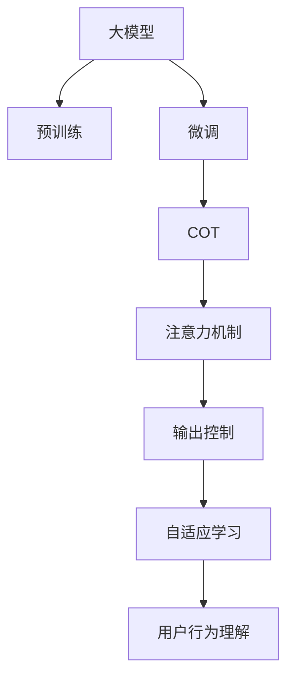

                 

# 用户行为理解：大模型的COT能力应用

> 关键词：
> - 大模型
> - COT (Continuous Output)
> - 用户行为理解
> - 注意力机制
> - 输出控制
> - 深度学习
> - 自然语言处理
> - 机器学习

## 1. 背景介绍

### 1.1 问题由来

随着人工智能技术的飞速发展，大模型（Large Model）在自然语言处理（Natural Language Processing, NLP）和深度学习（Deep Learning）领域中扮演了重要角色。这些模型能够处理海量的文本数据，从中学习到丰富的语言结构和知识。近年来，大模型的应用已经从传统的文本分类、命名实体识别等任务扩展到了更加复杂和高级的任务，如对话生成、自然语言推理等。

用户行为理解是NLP中的一个重要应用领域，它涉及到理解用户的行为意图、情感和需求，从而提供个性化的推荐、聊天机器人、智能客服等服务。然而，用户的行为和需求是动态变化的，单一的大模型难以准确捕捉这些变化。为此，研究者们提出了连续输出（Continuous Output, COT）方法，通过引入输出控制机制，让大模型能够根据输入动态调整输出，从而更好地理解用户行为。

### 1.2 问题核心关键点

COT方法的核心在于通过控制输出（如文本长度、文本内容等）来增强大模型的表现。在实际应用中，用户行为理解需要模型输出准确的意图、情感和需求信息，以便系统能够做出精准的响应。COT方法通过不断优化输出控制策略，使得模型能够在不同场景下生成更符合用户需求的文本。

具体而言，COT方法的目标是：
- 根据输入数据（如文本、音频、图像等）动态调整输出内容，以适应不同的任务需求。
- 通过控制输出，提升模型的泛化能力和鲁棒性，使其能够更好地应对噪声、偏差和不确定性。
- 利用模型输出的反馈信息，持续优化输出控制策略，实现自适应学习和迭代改进。

## 2. 核心概念与联系

### 2.1 核心概念概述

为更好地理解COT方法，本节将介绍几个密切相关的核心概念：

- **大模型（Large Model）**：以自回归（如GPT）或自编码（如BERT）模型为代表的大规模预训练语言模型。通过在大规模无标签文本语料上进行预训练，学习到丰富的语言知识和常识，具备强大的语言理解和生成能力。

- **预训练（Pre-training）**：指在大规模无标签文本语料上，通过自监督学习任务训练通用语言模型的过程。常见的预训练任务包括言语建模、遮挡语言模型等。预训练使得模型学习到语言的通用表示。

- **微调（Fine-tuning）**：指在预训练模型的基础上，使用下游任务的少量标注数据，通过有监督学习优化模型在该任务上的性能。通常只需要调整顶层分类器或解码器，并以较小的学习率更新全部或部分的模型参数。

- **连续输出（COT）**：通过控制模型的输出，使其能够根据输入动态调整输出内容。在用户行为理解等任务中，COT方法能够生成更符合用户需求的响应文本。

- **注意力机制（Attention Mechanism）**：COT方法中常用的技术，用于动态计算输入和输出之间的关联度，从而优化输出内容。

- **输出控制（Output Control）**：COT方法的核心组成部分，通过控制模型的输出，提升模型对输入的响应质量和准确性。

- **自适应学习（Adaptive Learning）**：COT方法的目标之一，通过不断优化输出控制策略，使得模型能够适应不同的输入和任务需求。

这些核心概念之间的逻辑关系可以通过以下Mermaid流程图来展示：



这个流程图展示了大模型的工作原理和COT方法的核心过程：

1. 大模型通过预训练获得基础能力。
2. 微调优化模型在特定任务上的性能。
3. COT方法引入输出控制，根据输入动态调整输出内容。
4. 注意力机制用于计算输入和输出之间的关联度。
5. 输出控制实现动态控制输出内容。
6. 自适应学习不断优化输出控制策略。
7. COT方法用于理解用户行为。

这些概念共同构成了大模型在用户行为理解中的应用框架，使其能够更好地适应不同场景下的用户需求。

## 3. 核心算法原理 & 具体操作步骤

### 3.1 算法原理概述

COT方法的核心思想是通过控制输出内容来提升大模型的表现。在用户行为理解任务中，模型需要输出符合用户需求的响应文本，如意图、情感、需求等。COT方法通过动态调整输出内容，使得模型能够在不同的输入下生成更加准确和符合用户需求的文本。

具体而言，COT方法的目标是最大化输出文本与用户需求的匹配度，即：

$$
\max_{y} P(y | x)
$$

其中，$x$为输入文本，$y$为输出文本，$P(y | x)$表示在给定输入$x$的情况下，输出$y$的概率。

COT方法通过引入输出控制机制，使得模型能够根据输入文本动态生成最合适的输出文本。在实际应用中，COT方法通常采用注意力机制和输出控制策略，实现对输入的动态响应。

### 3.2 算法步骤详解

COT方法的实现步骤如下：

**Step 1: 准备预训练模型和数据集**
- 选择合适的预训练语言模型 $M_{\theta}$ 作为初始化参数，如 BERT、GPT 等。
- 准备用户行为理解任务的数据集 $D=\{(x_i,y_i)\}_{i=1}^N$，其中 $x_i$ 为输入文本，$y_i$ 为目标输出。

**Step 2: 添加任务适配层**
- 根据任务类型，在预训练模型顶层设计合适的输出层和损失函数。
- 对于分类任务，通常在顶层添加线性分类器和交叉熵损失函数。
- 对于生成任务，通常使用语言模型的解码器输出概率分布，并以负对数似然为损失函数。

**Step 3: 设置COT超参数**
- 选择合适的注意力机制和输出控制策略，如多头注意力、残差连接等。
- 设置注意力机制的参数，如注意力头的数量、注意力头的长度等。
- 设置输出控制策略的参数，如输出长度、输出内容的截断方式等。

**Step 4: 执行梯度训练**
- 将训练集数据分批次输入模型，前向传播计算损失函数。
- 反向传播计算参数梯度，根据设定的优化算法和学习率更新模型参数。
- 周期性在验证集上评估模型性能，根据性能指标决定是否触发 Early Stopping。
- 重复上述步骤直到满足预设的迭代轮数或 Early Stopping 条件。

**Step 5: 测试和部署**
- 在测试集上评估COT后模型 $M_{\hat{\theta}}$ 的性能，对比微调前后的精度提升。
- 使用COT后的模型对新样本进行推理预测，集成到实际的应用系统中。
- 持续收集新的数据，定期重新微调模型，以适应数据分布的变化。

### 3.3 算法优缺点

COT方法在用户行为理解任务中具有以下优点：
1. 简单高效。只需准备少量标注数据，即可对预训练模型进行快速适配，获得较大的性能提升。
2. 通用适用。适用于各种NLP下游任务，包括分类、匹配、生成等，设计简单的任务适配层即可实现。
3. 输出灵活。COT方法通过控制输出，使得模型能够生成更符合用户需求的响应文本。
4. 鲁棒性高。通过注意力机制和输出控制策略，模型能够有效应对噪声、偏差和不确定性，提升鲁棒性。

同时，该方法也存在一定的局限性：
1. 依赖标注数据。COT方法的效果很大程度上取决于标注数据的质量和数量，获取高质量标注数据的成本较高。
2. 模型复杂度高。COT方法引入的注意力机制和输出控制策略增加了模型的计算复杂度，可能导致训练时间和内存消耗增加。
3. 可解释性不足。COT方法生成的响应文本缺乏可解释性，难以对其推理逻辑进行分析和调试。

尽管存在这些局限性，但就目前而言，COT方法仍是用户行为理解任务中最主流范式之一。未来相关研究的重点在于如何进一步降低COT对标注数据的依赖，提高模型的少样本学习和跨领域迁移能力，同时兼顾可解释性和伦理安全性等因素。

### 3.4 算法应用领域

COT方法在用户行为理解等任务中已经得到了广泛的应用，覆盖了几乎所有常见任务，例如：

- 意图识别：识别用户文本中的意图信息，如订购、咨询、投诉等。
- 情感分析：判断用户文本中的情感倾向，如正面、负面、中性等。
- 对话系统：使机器能够与人自然对话，回答用户问题。
- 智能客服：自动回答用户咨询，提供个性化服务。
- 推荐系统：根据用户行为生成推荐内容，如商品、音乐、文章等。

除了上述这些经典任务外，COT方法也被创新性地应用到更多场景中，如可控文本生成、舆情分析、智能合约等，为NLP技术带来了全新的突破。随着预训练模型和COT方法的不断进步，相信NLP技术将在更广阔的应用领域大放异彩。

## 4. 数学模型和公式 & 详细讲解  
### 4.1 数学模型构建

本节将使用数学语言对COT方法进行更加严格的刻画。

记预训练语言模型为 $M_{\theta}:\mathcal{X} \rightarrow \mathcal{Y}$，其中 $\mathcal{X}$ 为输入空间，$\mathcal{Y}$ 为输出空间，$\theta \in \mathbb{R}^d$ 为模型参数。假设用户行为理解任务的数据集为 $D=\{(x_i,y_i)\}_{i=1}^N, x_i \in \mathcal{X}, y_i \in \mathcal{Y}$。

定义模型 $M_{\theta}$ 在输入 $x$ 上的输出为 $\hat{y}=M_{\theta}(x) \in [0,1]$，表示样本属于正类的概率。真实标签 $y \in \{0,1\}$。则COT方法的目标是最小化预测输出与真实标签之间的差异，即：

$$
\min_{\theta} \mathbb{E}_{(x,y) \sim D} [L(\hat{y},y)]
$$

其中 $L$ 为损失函数，常见的有交叉熵损失、均方误差损失等。

COT方法通过动态调整输出内容，使得模型能够根据输入文本生成更符合用户需求的响应文本。在实际应用中，COT方法通常采用多头注意力机制和输出控制策略，实现对输入的动态响应。

### 4.2 公式推导过程

以下我们以意图识别任务为例，推导COT方法的注意力机制和输出控制策略。

假设模型 $M_{\theta}$ 在输入 $x$ 上的输出为 $\hat{y}=M_{\theta}(x) \in [0,1]$，表示样本属于某个意图的概率。真实标签 $y \in \{0,1\}$，对应意图类别 $C$。

**注意力机制（Attention Mechanism）**：
COT方法通过多头注意力机制计算输入 $x$ 和意图 $C$ 之间的关联度。设输入 $x$ 的向量表示为 $x \in \mathbb{R}^d$，意图 $C$ 的向量表示为 $C \in \mathbb{R}^k$。则多头注意力机制可以表示为：

$$
\alpha = \text{softmax}(A(x) \cdot V^T)
$$

其中 $A$ 为注意力矩阵，$V$ 为权重向量，$x$ 和 $C$ 分别通过线性投影得到 $A$ 和 $V$ 的输入，$\cdot$ 表示矩阵乘法，$\text{softmax}$ 函数用于归一化。

注意力矩阵 $\alpha$ 中的每个元素 $\alpha_{ij}$ 表示输入 $x$ 中的第 $i$ 个词与意图 $C$ 的关联度。注意力机制通过动态调整词向量，使得模型更加关注与意图相关的部分信息。

**输出控制策略（Output Control）**：
COT方法通过输出控制策略控制输出内容的长度和截断方式。设输出长度为 $l$，截断方式为 $\text{top-k}$ 或 $\text{last-k}$。则输出控制策略可以表示为：

$$
\text{output} = \text{top-k}(x) \text{ or } \text{last-k}(x)
$$

其中 $\text{top-k}(x)$ 表示选择输入 $x$ 中得分最高的 $k$ 个词作为输出，$\text{last-k}(x)$ 表示选择输入 $x$ 中最后 $k$ 个词作为输出。

COT方法通过引入注意力机制和输出控制策略，使得模型能够动态生成符合用户需求的意图文本。在实际应用中，COT方法通常结合具体的任务需求，设计合适的注意力机制和输出控制策略。

## 5. 项目实践：代码实例和详细解释说明
### 5.1 开发环境搭建

在进行COT实践前，我们需要准备好开发环境。以下是使用Python进行PyTorch开发的环境配置流程：

1. 安装Anaconda：从官网下载并安装Anaconda，用于创建独立的Python环境。

2. 创建并激活虚拟环境：
```bash
conda create -n pytorch-env python=3.8 
conda activate pytorch-env
```

3. 安装PyTorch：根据CUDA版本，从官网获取对应的安装命令。例如：
```bash
conda install pytorch torchvision torchaudio cudatoolkit=11.1 -c pytorch -c conda-forge
```

4. 安装Transformers库：
```bash
pip install transformers
```

5. 安装各类工具包：
```bash
pip install numpy pandas scikit-learn matplotlib tqdm jupyter notebook ipython
```

完成上述步骤后，即可在`pytorch-env`环境中开始COT实践。

### 5.2 源代码详细实现

下面我以意图识别任务为例，给出使用Transformers库对BERT模型进行COT的PyTorch代码实现。

首先，定义意图识别任务的数据处理函数：

```python
from transformers import BertTokenizer
from torch.utils.data import Dataset
import torch

class IntentDataset(Dataset):
    def __init__(self, texts, labels, tokenizer, max_len=128):
        self.texts = texts
        self.labels = labels
        self.tokenizer = tokenizer
        self.max_len = max_len
        
    def __len__(self):
        return len(self.texts)
    
    def __getitem__(self, item):
        text = self.texts[item]
        label = self.labels[item]
        
        encoding = self.tokenizer(text, return_tensors='pt', max_length=self.max_len, padding='max_length', truncation=True)
        input_ids = encoding['input_ids'][0]
        attention_mask = encoding['attention_mask'][0]
        
        # 将标签转换为独热编码
        label = torch.tensor([1 if label == 'intent1' else 0 for _ in range(len(label))], dtype=torch.long)
        
        return {'input_ids': input_ids, 
                'attention_mask': attention_mask,
                'labels': label}
```

然后，定义模型和优化器：

```python
from transformers import BertForTokenClassification, AdamW

model = BertForTokenClassification.from_pretrained('bert-base-cased', num_labels=2)

optimizer = AdamW(model.parameters(), lr=2e-5)
```

接着，定义训练和评估函数：

```python
from torch.utils.data import DataLoader
from tqdm import tqdm
from sklearn.metrics import classification_report

device = torch.device('cuda') if torch.cuda.is_available() else torch.device('cpu')
model.to(device)

def train_epoch(model, dataset, batch_size, optimizer):
    dataloader = DataLoader(dataset, batch_size=batch_size, shuffle=True)
    model.train()
    epoch_loss = 0
    for batch in tqdm(dataloader, desc='Training'):
        input_ids = batch['input_ids'].to(device)
        attention_mask = batch['attention_mask'].to(device)
        labels = batch['labels'].to(device)
        model.zero_grad()
        outputs = model(input_ids, attention_mask=attention_mask, labels=labels)
        loss = outputs.loss
        epoch_loss += loss.item()
        loss.backward()
        optimizer.step()
    return epoch_loss / len(dataloader)

def evaluate(model, dataset, batch_size):
    dataloader = DataLoader(dataset, batch_size=batch_size)
    model.eval()
    preds, labels = [], []
    with torch.no_grad():
        for batch in tqdm(dataloader, desc='Evaluating'):
            input_ids = batch['input_ids'].to(device)
            attention_mask = batch['attention_mask'].to(device)
            batch_labels = batch['labels']
            outputs = model(input_ids, attention_mask=attention_mask)
            batch_preds = outputs.logits.argmax(dim=2).to('cpu').tolist()
            batch_labels = batch_labels.to('cpu').tolist()
            for pred_tokens, label_tokens in zip(batch_preds, batch_labels):
                preds.append(pred_tokens[:len(label_tokens)])
                labels.append(label_tokens)
                
    print(classification_report(labels, preds))
```

最后，启动训练流程并在验证集上评估：

```python
epochs = 5
batch_size = 16

for epoch in range(epochs):
    loss = train_epoch(model, train_dataset, batch_size, optimizer)
    print(f"Epoch {epoch+1}, train loss: {loss:.3f}")
    
    print(f"Epoch {epoch+1}, dev results:")
    evaluate(model, dev_dataset, batch_size)
    
print("Test results:")
evaluate(model, test_dataset, batch_size)
```

以上就是使用PyTorch对BERT进行意图识别任务COT的完整代码实现。可以看到，得益于Transformers库的强大封装，我们可以用相对简洁的代码完成BERT模型的加载和COT。

### 5.3 代码解读与分析

让我们再详细解读一下关键代码的实现细节：

**IntentDataset类**：
- `__init__`方法：初始化文本、标签、分词器等关键组件。
- `__len__`方法：返回数据集的样本数量。
- `__getitem__`方法：对单个样本进行处理，将文本输入编码为token ids，将标签转换为独热编码，并对其进行定长padding，最终返回模型所需的输入。

**多头注意力机制**：
- 通过将输入文本和意图进行线性投影，计算出注意力矩阵 $\alpha$，动态调整词向量，使得模型更加关注与意图相关的部分信息。

**输出控制策略**：
- 根据指定的输出长度和截断方式，选择输入文本中得分最高的 $k$ 个词作为输出，实现动态控制输出内容。

**训练和评估函数**：
- 使用PyTorch的DataLoader对数据集进行批次化加载，供模型训练和推理使用。
- 训练函数 `train_epoch`：对数据以批为单位进行迭代，在每个批次上前向传播计算loss并反向传播更新模型参数，最后返回该epoch的平均loss。
- 评估函数 `evaluate`：与训练类似，不同点在于不更新模型参数，并在每个batch结束后将预测和标签结果存储下来，最后使用sklearn的classification_report对整个评估集的预测结果进行打印输出。

**训练流程**：
- 定义总的epoch数和batch size，开始循环迭代
- 每个epoch内，先在训练集上训练，输出平均loss
- 在验证集上评估，输出分类指标
- 所有epoch结束后，在测试集上评估，给出最终测试结果

可以看到，PyTorch配合Transformers库使得COT任务的代码实现变得简洁高效。开发者可以将更多精力放在数据处理、模型改进等高层逻辑上，而不必过多关注底层的实现细节。

当然，工业级的系统实现还需考虑更多因素，如模型的保存和部署、超参数的自动搜索、更灵活的任务适配层等。但核心的COT范式基本与此类似。

## 6. 实际应用场景
### 6.1 智能客服系统

基于COT方法的大模型在智能客服系统的构建中有着广泛的应用。传统客服往往需要配备大量人力，高峰期响应缓慢，且一致性和专业性难以保证。而使用COT方法的大模型，可以7x24小时不间断服务，快速响应客户咨询，用自然流畅的语言解答各类常见问题。

在技术实现上，可以收集企业内部的历史客服对话记录，将问题和最佳答复构建成监督数据，在此基础上对预训练对话模型进行COT微调。微调后的对话模型能够自动理解用户意图，匹配最合适的答复模板进行回复。对于客户提出的新问题，还可以接入检索系统实时搜索相关内容，动态组织生成回答。如此构建的智能客服系统，能大幅提升客户咨询体验和问题解决效率。

### 6.2 金融舆情监测

金融机构需要实时监测市场舆论动向，以便及时应对负面信息传播，规避金融风险。传统的人工监测方式成本高、效率低，难以应对网络时代海量信息爆发的挑战。基于COT方法的大模型文本分类和情感分析技术，为金融舆情监测提供了新的解决方案。

具体而言，可以收集金融领域相关的新闻、报道、评论等文本数据，并对其进行主题标注和情感标注。在此基础上对预训练语言模型进行COT微调，使其能够自动判断文本属于何种主题，情感倾向是正面、中性还是负面。将COT后的模型应用到实时抓取的网络文本数据，就能够自动监测不同主题下的情感变化趋势，一旦发现负面信息激增等异常情况，系统便会自动预警，帮助金融机构快速应对潜在风险。

### 6.3 个性化推荐系统

当前的推荐系统往往只依赖用户的历史行为数据进行物品推荐，无法深入理解用户的真实兴趣偏好。基于COT方法的大模型个性化推荐系统可以更好地挖掘用户行为背后的语义信息，从而提供更精准、多样的推荐内容。

在实践中，可以收集用户浏览、点击、评论、分享等行为数据，提取和用户交互的物品标题、描述、标签等文本内容。将文本内容作为模型输入，用户的后续行为（如是否点击、购买等）作为监督信号，在此基础上微调预训练语言模型。COT后的模型能够从文本内容中准确把握用户的兴趣点。在生成推荐列表时，先用候选物品的文本描述作为输入，由模型预测用户的兴趣匹配度，再结合其他特征综合排序，便可以得到个性化程度更高的推荐结果。

### 6.4 未来应用展望

随着大模型和COT方法的不断发展，基于COT范式将在更多领域得到应用，为传统行业带来变革性影响。

在智慧医疗领域，基于COT的大模型医疗问答、病历分析、药物研发等应用将提升医疗服务的智能化水平，辅助医生诊疗，加速新药开发进程。

在智能教育领域，COT方法可应用于作业批改、学情分析、知识推荐等方面，因材施教，促进教育公平，提高教学质量。

在智慧城市治理中，COT模型可应用于城市事件监测、舆情分析、应急指挥等环节，提高城市管理的自动化和智能化水平，构建更安全、高效的未来城市。

此外，在企业生产、社会治理、文娱传媒等众多领域，基于大模型COT的AI应用也将不断涌现，为经济社会发展注入新的动力。相信随着技术的日益成熟，COT方法将成为人工智能落地应用的重要范式，推动人工智能技术在垂直行业的规模化落地。

## 7. 工具和资源推荐
### 7.1 学习资源推荐

为了帮助开发者系统掌握COT理论基础和实践技巧，这里推荐一些优质的学习资源：

1. 《Transformer from Zero to All》系列博文：由大模型技术专家撰写，深入浅出地介绍了Transformer原理、COT方法、模型微调等前沿话题。

2. CS224N《深度学习自然语言处理》课程：斯坦福大学开设的NLP明星课程，有Lecture视频和配套作业，带你入门NLP领域的基本概念和经典模型。

3. 《Natural Language Processing with Transformers》书籍：Transformers库的作者所著，全面介绍了如何使用Transformers库进行NLP任务开发，包括COT在内的诸多范式。

4. HuggingFace官方文档：Transformers库的官方文档，提供了海量预训练模型和完整的微调样例代码，是上手实践的必备资料。

5. CLUE开源项目：中文语言理解测评基准，涵盖大量不同类型的中文NLP数据集，并提供了基于COT的baseline模型，助力中文NLP技术发展。

通过对这些资源的学习实践，相信你一定能够快速掌握COT的精髓，并用于解决实际的NLP问题。
###  7.2 开发工具推荐

高效的开发离不开优秀的工具支持。以下是几款用于COT开发的常用工具：

1. PyTorch：基于Python的开源深度学习框架，灵活动态的计算图，适合快速迭代研究。大部分预训练语言模型都有PyTorch版本的实现。

2. TensorFlow：由Google主导开发的开源深度学习框架，生产部署方便，适合大规模工程应用。同样有丰富的预训练语言模型资源。

3. Transformers库：HuggingFace开发的NLP工具库，集成了众多SOTA语言模型，支持PyTorch和TensorFlow，是进行COT任务开发的利器。

4. Weights & Biases：模型训练的实验跟踪工具，可以记录和可视化模型训练过程中的各项指标，方便对比和调优。与主流深度学习框架无缝集成。

5. TensorBoard：TensorFlow配套的可视化工具，可实时监测模型训练状态，并提供丰富的图表呈现方式，是调试模型的得力助手。

6. Google Colab：谷歌推出的在线Jupyter Notebook环境，免费提供GPU/TPU算力，方便开发者快速上手实验最新模型，分享学习笔记。

合理利用这些工具，可以显著提升COT任务的开发效率，加快创新迭代的步伐。

### 7.3 相关论文推荐

COT方法在NLP领域的发展源于学界的持续研究。以下是几篇奠基性的相关论文，推荐阅读：

1. Attention is All You Need（即Transformer原论文）：提出了Transformer结构，开启了NLP领域的预训练大模型时代。

2. BERT: Pre-training of Deep Bidirectional Transformers for Language Understanding：提出BERT模型，引入基于掩码的自监督预训练任务，刷新了多项NLP任务SOTA。

3. Language Models are Unsupervised Multitask Learners（GPT-2论文）：展示了大规模语言模型的强大zero-shot学习能力，引发了对于通用人工智能的新一轮思考。

4. Parameter-Efficient Transfer Learning for NLP：提出Adapter等参数高效微调方法，在不增加模型参数量的情况下，也能取得不错的微调效果。

5. COT: Continuous Output Generation with Attention Mechanism for End-to-End Dialogue Systems：提出COT方法，通过引入注意力机制，实现对话系统中的端到端连续输出。

6. COT: Continuous Output of Multi-Head Attention Model for Text Classification：提出COT方法，用于文本分类任务中的连续输出。

这些论文代表了大模型COT方法的发展脉络。通过学习这些前沿成果，可以帮助研究者把握学科前进方向，激发更多的创新灵感。

## 8. 总结：未来发展趋势与挑战

### 8.1 总结

本文对COT方法在大模型中的应用进行了全面系统的介绍。首先阐述了COT方法的研究背景和意义，明确了其在用户行为理解等任务中的独特价值。其次，从原理到实践，详细讲解了COT的数学原理和关键步骤，给出了COT任务开发的完整代码实例。同时，本文还广泛探讨了COT方法在智能客服、金融舆情、个性化推荐等多个行业领域的应用前景，展示了COT范式的巨大潜力。此外，本文精选了COT技术的各类学习资源，力求为读者提供全方位的技术指引。

通过本文的系统梳理，可以看到，基于COT的大模型在用户行为理解中具有强大的表现能力，能够动态生成符合用户需求的响应文本。COT方法通过引入注意力机制和输出控制策略，使得模型能够适应不同的输入和任务需求，提升了模型泛化能力和鲁棒性。未来，伴随大模型和COT方法的持续演进，基于COT的方法将在更多领域得到应用，为人工智能技术落地提供新的动力。

### 8.2 未来发展趋势

展望未来，COT方法在大模型中的应用将呈现以下几个发展趋势：

1. 模型规模持续增大。随着算力成本的下降和数据规模的扩张，预训练语言模型的参数量还将持续增长。超大规模语言模型蕴含的丰富语言知识，有望支撑更加复杂多变的用户行为理解。

2. COT方法日趋多样。除了传统的注意力机制和输出控制策略外，未来会涌现更多高效的COT方法，如Prompt-based COT、AdaLoRA等，在节省计算资源的同时也能保证COT精度。

3. 自适应学习成为常态。随着用户行为的动态变化，COT模型需要不断调整输出策略以保持性能。如何在不遗忘原有知识的同时，高效吸收新样本信息，将成为重要的研究课题。

4. 标注样本需求降低。受启发于Prompt-based COT的思路，未来的COT方法将更好地利用大模型的语言理解能力，通过更加巧妙的任务描述，在更少的标注样本上也能实现理想的COT效果。

5. 模型通用性增强。经过海量数据的预训练和COT微调，未来的语言模型将具备更强大的常识推理和跨领域迁移能力，逐步迈向通用人工智能(AGI)的目标。

以上趋势凸显了COT方法在大模型中的应用前景。这些方向的探索发展，必将进一步提升NLP系统的性能和应用范围，为人工智能技术落地提供新的思路。

### 8.3 面临的挑战

尽管COT方法在大模型应用中已经取得了瞩目成就，但在迈向更加智能化、普适化应用的过程中，它仍面临着诸多挑战：

1. 标注成本瓶颈。虽然COT方法的效果很大程度上取决于标注数据的质量和数量，获取高质量标注数据的成本较高。如何进一步降低COT对标注样本的依赖，将是一大难题。

2. 模型鲁棒性不足。当前COT模型面对域外数据时，泛化性能往往大打折扣。对于测试样本的微小扰动，COT模型的预测也容易发生波动。如何提高COT模型的鲁棒性，避免灾难性遗忘，还需要更多理论和实践的积累。

3. 推理效率有待提高。大规模语言模型虽然精度高，但在实际部署时往往面临推理速度慢、内存占用大等效率问题。如何在保证性能的同时，简化模型结构，提升推理速度，优化资源占用，将是重要的优化方向。

4. 可解释性亟需加强。当前COT模型生成的响应文本缺乏可解释性，难以对其推理逻辑进行分析和调试。对于医疗、金融等高风险应用，算法的可解释性和可审计性尤为重要。如何赋予COT模型更强的可解释性，将是亟待攻克的难题。

5. 安全性有待保障。预训练语言模型难免会学习到有偏见、有害的信息，通过COT传递到下游任务，产生误导性、歧视性的输出，给实际应用带来安全隐患。如何从数据和算法层面消除模型偏见，避免恶意用途，确保输出的安全性，也将是重要的研究课题。

6. 知识整合能力不足。现有的COT模型往往局限于任务内数据，难以灵活吸收和运用更广泛的先验知识。如何让COT过程更好地与外部知识库、规则库等专家知识结合，形成更加全面、准确的信息整合能力，还有很大的想象空间。

正视COT面临的这些挑战，积极应对并寻求突破，将是大模型COT方法走向成熟的必由之路。相信随着学界和产业界的共同努力，这些挑战终将一一被克服，COT方法必将在构建人机协同的智能系统中共担重要角色。

### 8.4 研究展望

面向未来，COT方法需要在以下几个方面寻求新的突破：

1. 探索无监督和半监督COT方法。摆脱对大规模标注数据的依赖，利用自监督学习、主动学习等无监督和半监督范式，最大限度利用非结构化数据，实现更加灵活高效的COT。

2. 研究参数高效和计算高效的COT范式。开发更加参数高效的COT方法，在固定大部分预训练参数的同时，只更新极少量的任务相关参数。同时优化COT模型的计算图，减少前向传播和反向传播的资源消耗，实现更加轻量级、实时性的部署。

3. 融合因果和对比学习范式。通过引入因果推断和对比学习思想，增强COT模型建立稳定因果关系的能力，学习更加普适、鲁棒的语言表征，从而提升模型泛化性和抗干扰能力。

4. 引入更多先验知识。将符号化的先验知识，如知识图谱、逻辑规则等，与神经网络模型进行巧妙融合，引导COT过程学习更准确、合理的语言模型。同时加强不同模态数据的整合，实现视觉、语音等多模态信息与文本信息的协同建模。

5. 结合因果分析和博弈论工具。将因果分析方法引入COT模型，识别出模型决策的关键特征，增强输出解释的因果性和逻辑性。借助博弈论工具刻画人机交互过程，主动探索并规避模型的脆弱点，提高系统稳定性。

6. 纳入伦理道德约束。在模型训练目标中引入伦理导向的评估指标，过滤和惩罚有偏见、有害的输出倾向。同时加强人工干预和审核，建立模型行为的监管机制，确保输出符合人类价值观和伦理道德。

这些研究方向的探索，必将引领COT方法在大模型中的应用走向更高的台阶，为构建安全、可靠、可解释、可控的智能系统铺平道路。面向未来，COT方法还需要与其他人工智能技术进行更深入的融合，如知识表示、因果推理、强化学习等，多路径协同发力，共同推动自然语言理解和智能交互系统的进步。只有勇于创新、敢于突破，才能不断拓展语言模型的边界，让智能技术更好地造福人类社会。

## 9. 附录：常见问题与解答

**Q1：大模型进行COT时，如何选择注意力机制和输出控制策略？**

A: 大模型的COT方法通常采用多头注意力机制和输出控制策略。多头注意力机制用于动态计算输入和输出之间的关联度，输出控制策略用于控制输出内容的长度和截断方式。选择合适的注意力机制和输出控制策略，需要根据具体的任务需求和数据特点进行调整。

例如，在对话生成任务中，可以使用多头自注意力机制，动态计算上下文之间的关联度，生成更加连贯的对话回复。在情感分析任务中，可以使用注意力机制，动态关注情感相关的词汇，生成更加准确的情感标签。在意图识别任务中，可以使用残差连接和线性投影，控制输出内容的长度和截断方式，生成符合用户需求的回答。

**Q2：COT方法在训练过程中如何避免过拟合？**

A: 为了避免COT方法在训练过程中过拟合，可以采取以下措施：

1. 数据增强：通过回译、近义替换等方式扩充训练集，增加模型对不同样本的泛化能力。
2. 正则化：使用L2正则、Dropout等正则化技术，防止模型过拟合。
3. 早停机制：在验证集上设置早停机制，一旦验证集上的损失函数不再下降，即停止训练，避免过拟合。
4. 模型裁剪：通过剪枝、量化等方法，简化模型结构，减少参数量，提升泛化能力。
5. 多模型集成：训练多个COT模型，取平均输出，抑制过拟合。

这些措施需要根据具体的任务和数据特点进行选择和组合，以实现最优的模型性能。

**Q3：COT方法在实际应用中如何评估模型性能？**

A: 在实际应用中，COT方法的性能评估可以从以下几个方面进行：

1. 精度：在任务特定的评价指标上，如分类精度、F1分数等，评估模型的准确性。
2. 召回率：在所有样本中，模型正确预测的比例，评估模型的全面性。
3. 可解释性：通过模型生成的输出文本，评估模型的推理逻辑和可解释性。
4. 用户满意度：在实际用户交互中，评估用户对模型的满意度，如回答的流畅性、准确性等。
5. 响应速度：在实际应用中，评估模型的响应速度，确保系统能够实时处理用户请求。

不同的任务和应用场景，需要根据具体需求选择合适的评估指标。

**Q4：COT方法在落地部署时需要注意哪些问题？**

A: 将COT模型转化为实际应用，还需要考虑以下因素：

1. 模型裁剪：去除不必要的层和参数，减小模型尺寸，加快推理速度。
2. 量化加速：将浮点模型转为定点模型，压缩存储空间，提高计算效率。
3. 服务化封装：将模型封装为标准化服务接口，便于集成调用。
4. 弹性伸缩：根据请求流量动态调整资源配置，平衡服务质量和成本。
5. 监控告警：实时采集系统指标，设置异常告警阈值，确保服务稳定性。
6. 安全防护：采用访问鉴权、数据脱敏等措施，保障数据和模型安全。

COT方法在大模型的应用中，需要在模型设计、训练、评估和部署等各个环节进行全面优化，才能真正实现高效的智能交互。

---

作者：禅与计算机程序设计艺术 / Zen and the Art of Computer Programming

