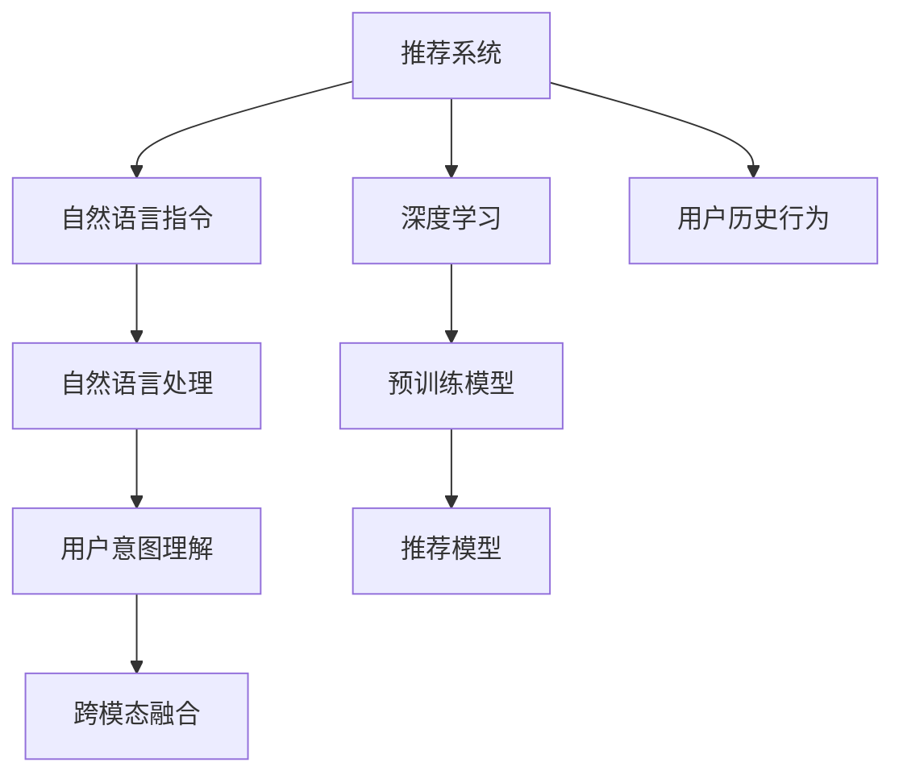

                 

# 用自然语言指令驱动的推荐系统交互新模式

> 关键词：推荐系统,自然语言指令,交互界面,深度学习,预训练模型,用户意图理解

## 1. 背景介绍

### 1.1 问题由来
在互联网时代，用户对推荐系统（Recommendation System）的需求日益增长。推荐系统通过对用户历史行为数据和上下文环境进行分析，自动为用户推荐感兴趣的内容，极大地提升了用户体验。但传统的推荐系统通常以商品、视频、音乐等作为推荐对象，用户需要手动点击、搜索，反馈才能获取个性化推荐，导致推荐过程不够流畅、高效，用户体验有待提升。

近年来，深度学习和自然语言处理（Natural Language Processing, NLP）技术的进步为推荐系统带来了新的变革。自然语言指令（Natural Language Instructions, NLI）驱动的推荐系统，通过自然语言与推荐系统的交互，使得推荐过程更加自然、智能，提升了用户体验和系统效率。例如，用户可以直接用自然语言指令描述自己的需求，推荐系统根据指令自动为用户推荐内容。

### 1.2 问题核心关键点
自然语言指令驱动的推荐系统，本质上是通过自然语言处理技术，将用户自然语言输入转化为推荐系统的可执行指令，并根据指令自动推荐内容。关键点如下：

- **自然语言理解**：自然语言指令驱动的推荐系统首先需要理解用户输入的自然语言指令，将其转化为推荐系统可执行的指令。
- **用户意图识别**：理解用户自然语言指令背后的真实意图，以便推荐系统能够更准确地推荐用户感兴趣的内容。
- **跨模态融合**：将用户输入的自然语言指令与推荐系统内部的用户历史行为数据、商品信息、视频信息等进行跨模态融合，产生更加个性化、多样化的推荐结果。
- **交互界面设计**：设计自然语言交互界面，让用户能够自然地输入自然语言指令，并与推荐系统进行流畅交互。

## 2. 核心概念与联系

### 2.1 核心概念概述

为更好地理解自然语言指令驱动的推荐系统，本节将介绍几个密切相关的核心概念：

- **推荐系统**：通过分析用户行为数据，预测用户未来可能感兴趣的商品、视频、音乐等，自动为用户推荐内容的系统。
- **自然语言处理**：使用计算机技术对自然语言进行处理、分析和理解，包括文本处理、语言模型、语义分析等。
- **深度学习**：使用多层神经网络进行复杂模型训练，使得模型能够学习到数据的深层特征，提高预测精度。
- **预训练模型**：在大规模无标签数据上预训练得到的模型，如BERT、GPT等，具备强大的语言理解能力。
- **用户意图理解**：通过自然语言指令识别用户需求，理解其背后的真实意图。
- **跨模态融合**：将不同模态的数据（如文本、图片、音频等）进行融合，提高推荐系统的性能。

这些核心概念之间的逻辑关系可以通过以下Mermaid流程图来展示：



这个流程图展示了大语言指令驱动的推荐系统的核心概念及其之间的关系：

1. 自然语言指令作为输入，首先通过自然语言处理模块转化为推荐系统的可执行指令。
2. 通过用户意图理解模块，分析指令背后的真实意图，并将其转化为推荐系统内部的表示形式。
3. 跨模态融合模块将指令与用户历史行为数据、商品信息等进行融合，产生更加个性化的推荐结果。
4. 深度学习模块使用预训练模型和推荐模型对融合后的数据进行训练，得到最终的推荐结果。

## 3. 核心算法原理 & 具体操作步骤
### 3.1 算法原理概述

自然语言指令驱动的推荐系统，本质上是将自然语言处理技术与推荐系统结合，实现用户意图理解、推荐结果生成等功能。其核心算法流程包括：

1. **自然语言理解**：将自然语言指令转化为推荐系统能够理解的形式。
2. **用户意图识别**：分析自然语言指令背后的用户意图，产生用户需求表示。
3. **推荐模型训练**：使用深度学习模型在融合了用户意图表示和用户历史行为数据的训练集上进行训练。
4. **推荐结果生成**：根据用户意图表示和训练得到的推荐模型，生成推荐结果。

### 3.2 算法步骤详解

#### 3.2.1 自然语言理解

自然语言理解模块通常使用预训练的自然语言处理模型，如BERT、GPT等。假设用户输入的自然语言指令为 $I$，预训练模型将其转化为推荐系统可执行的指令表示 $I_{\text{rep}}$：

$$
I_{\text{rep}} = \text{NL Understanding}(I)
$$

这里，$\text{NL Understanding}$ 为自然语言理解模块，通常使用Transformers库中的BERT、GPT等预训练模型。

#### 3.2.2 用户意图识别

用户意图识别模块将自然语言指令表示 $I_{\text{rep}}$ 转化为用户需求表示 $U$。假设 $U$ 为 $K$ 维向量，则转换过程可以表示为：

$$
U = \text{Intent Recognition}(I_{\text{rep}})
$$

用户需求表示 $U$ 反映了用户对推荐内容的具体需求，如情感偏好、主题兴趣等。

#### 3.2.3 推荐模型训练

推荐模型训练模块使用用户需求表示 $U$ 和用户历史行为数据 $H$ 作为输入，训练推荐模型 $R$。推荐模型 $R$ 的输出为推荐结果表示 $R_{\text{rep}}$，表示推荐内容的推荐程度。推荐模型的训练目标是最小化预测结果与真实标签之间的差异，即：

$$
\mathcal{L}(R) = \frac{1}{N} \sum_{i=1}^N \ell(R_{\text{rep}}(y_i), R_{\text{rep}}(H_i))
$$

其中，$N$ 为训练样本数量，$\ell$ 为损失函数（如交叉熵、均方误差等），$y_i$ 为真实标签，$H_i$ 为用户历史行为数据。

推荐模型的训练过程通常包括以下步骤：

1. 准备数据集：收集用户历史行为数据 $H$ 和自然语言指令 $I$，标注用户需求 $U$ 和推荐结果 $y$。
2. 设计推荐模型 $R$：选择合适的推荐模型结构，如矩阵分解、深度神经网络等。
3. 设置优化器：选择合适的优化算法及其参数，如Adam、SGD等。
4. 设置超参数：选择合适的学习率、批大小、迭代轮数等。
5. 训练推荐模型：使用优化器最小化损失函数 $\mathcal{L}(R)$，更新模型参数 $R_{\theta}$。

#### 3.2.4 推荐结果生成

推荐结果生成模块根据用户需求表示 $U$ 和训练得到的推荐模型 $R$，生成推荐结果。假设推荐结果为 $C$，则生成过程可以表示为：

$$
C = \text{Recommendation}(U, R)
$$

推荐结果 $C$ 通常为推荐内容的集合，每个内容表示为一个向量，表示其与用户需求的相似度。

### 3.3 算法优缺点

自然语言指令驱动的推荐系统具有以下优点：

1. **提升用户体验**：用户通过自然语言指令与推荐系统进行交互，使得推荐过程更加自然、高效。
2. **减少用户操作成本**：用户不需要手动搜索、点击，推荐系统自动为用户推荐内容，提升了用户体验。
3. **增强推荐系统效果**：用户自然语言指令能够反映用户真实需求，推荐系统能够更好地理解用户意图，从而提供更个性化的推荐。
4. **提高推荐系统泛化能力**：通过自然语言指令，推荐系统能够处理多种自然语言表达方式，提高了系统的泛化能力。

同时，该方法也存在一定的局限性：

1. **数据标注成本高**：自然语言指令的标注需要大量的人工标注工作，增加了标注成本。
2. **语言理解难度大**：自然语言指令的理解需要高性能的自然语言处理模型，且模型的语言理解能力有待提升。
3. **推荐结果多样性差**：用户自然语言指令通常表达较为模糊，导致推荐系统输出的推荐结果多样性差，需要结合其他数据进行辅助。

尽管存在这些局限性，但就目前而言，自然语言指令驱动的推荐系统仍然具有广阔的应用前景，是推荐系统技术发展的重要方向之一。

### 3.4 算法应用领域

自然语言指令驱动的推荐系统已经在多个领域得到了应用，例如：

- **智能音箱**：用户可以通过语音指令控制智能音箱，查询天气、播放音乐、查询新闻等。
- **智能电视**：用户可以通过语音指令控制智能电视，观看节目、查询电影、播放音乐等。
- **智能家居**：用户可以通过语音指令控制智能家居设备，如调节灯光、控制温度、播放音乐等。
- **在线教育**：用户可以通过自然语言指令获取学习资源，查询课程、推荐书籍、听讲视频等。
- **智能客服**：用户可以通过自然语言指令与智能客服系统进行对话，获取问题解答、反馈意见、获取优惠等。

## 4. 数学模型和公式 & 详细讲解
### 4.1 数学模型构建

自然语言指令驱动的推荐系统涉及多个模块，每个模块的数学模型如下：

1. **自然语言理解**：将自然语言指令 $I$ 转化为推荐系统可执行的指令表示 $I_{\text{rep}}$。假设指令表示为 $d$ 维向量，则表示为：

$$
I_{\text{rep}} = \text{NL Understanding}(I)
$$

2. **用户意图识别**：将指令表示 $I_{\text{rep}}$ 转化为用户需求表示 $U$。假设用户需求表示为 $K$ 维向量，则表示为：

$$
U = \text{Intent Recognition}(I_{\text{rep}})
$$

3. **推荐模型训练**：使用用户需求表示 $U$ 和用户历史行为数据 $H$ 训练推荐模型 $R$。推荐模型输出为推荐结果表示 $R_{\text{rep}}$，假设推荐结果表示为 $M$ 维向量，则表示为：

$$
R_{\text{rep}} = R(H, U)
$$

4. **推荐结果生成**：根据用户需求表示 $U$ 和推荐模型 $R$ 生成推荐结果 $C$。假设推荐结果表示为 $N$ 维向量，则表示为：

$$
C = \text{Recommendation}(U, R)
$$

### 4.2 公式推导过程

假设推荐模型 $R$ 为深度神经网络，输入为 $H$ 和 $U$，输出为 $R_{\text{rep}}$，则推荐模型的训练过程可以表示为：

$$
R_{\theta} = \mathop{\arg\min}_{\theta} \mathcal{L}(R_{\theta}, \{ (H_i, y_i) \}_{i=1}^N)
$$

其中，$\theta$ 为模型参数，$\mathcal{L}$ 为损失函数。假设损失函数为交叉熵损失，则表示为：

$$
\mathcal{L}(R_{\theta}) = -\frac{1}{N}\sum_{i=1}^N y_i \log R_{\theta}(H_i) + (1-y_i) \log (1-R_{\theta}(H_i))
$$

根据上述公式，推荐模型 $R$ 的训练过程可以表示为：

1. 准备数据集 $\{ (H_i, y_i) \}_{i=1}^N$，其中 $H_i$ 为第 $i$ 个用户的历史行为数据，$y_i$ 为第 $i$ 个用户的推荐结果标签。
2. 初始化推荐模型参数 $R_{\theta}$。
3. 设置优化器 $\eta$，如Adam、SGD等。
4. 设置学习率 $\alpha$。
5. 循环迭代 $T$ 轮，每轮更新模型参数：

$$
R_{\theta} \leftarrow R_{\theta} - \eta \nabla_{\theta}\mathcal{L}(R_{\theta})
$$

6. 在每个epoch结束时，评估模型在验证集上的性能，如准确率、召回率等。
7. 根据验证集性能，调整学习率或迭代轮数，以防止过拟合。
8. 训练完成后，保存模型参数 $R_{\theta}$，供推荐结果生成使用。

### 4.3 案例分析与讲解

#### 案例一：智能音箱推荐系统

假设用户通过智能音箱查询天气，输入指令为 "天气"。自然语言理解模块将其转化为指令表示 $I_{\text{rep}}$：

$$
I_{\text{rep}} = \text{NL Understanding}(I)
$$

用户意图识别模块分析指令表示，得出用户需求表示 $U$：

$$
U = \text{Intent Recognition}(I_{\text{rep}})
$$

推荐模型训练模块使用用户需求表示 $U$ 和用户历史行为数据 $H$，训练推荐模型 $R$，得到推荐结果表示 $R_{\text{rep}}$：

$$
R_{\text{rep}} = R(H, U)
$$

推荐结果生成模块根据用户需求表示 $U$ 和推荐模型 $R$，生成推荐结果 $C$：

$$
C = \text{Recommendation}(U, R)
$$

最终，智能音箱向用户推荐天气预报信息、相关新闻、相关视频等。

## 5. 项目实践：代码实例和详细解释说明
### 5.1 开发环境搭建

在进行自然语言指令驱动的推荐系统开发前，需要准备好开发环境。以下是使用Python进行PyTorch开发的环境配置流程：

1. 安装Anaconda：从官网下载并安装Anaconda，用于创建独立的Python环境。

2. 创建并激活虚拟环境：
```bash
conda create -n pytorch-env python=3.8 
conda activate pytorch-env
```

3. 安装PyTorch：根据CUDA版本，从官网获取对应的安装命令。例如：
```bash
conda install pytorch torchvision torchaudio cudatoolkit=11.1 -c pytorch -c conda-forge
```

4. 安装Transformers库：
```bash
pip install transformers
```

5. 安装各类工具包：
```bash
pip install numpy pandas scikit-learn matplotlib tqdm jupyter notebook ipython
```

完成上述步骤后，即可在`pytorch-env`环境中开始推荐系统开发。

### 5.2 源代码详细实现

这里我们以推荐系统为智能音箱推荐天气为例，给出使用Transformers库进行自然语言指令驱动推荐系统的PyTorch代码实现。

首先，定义推荐系统数据处理函数：

```python
from transformers import BertTokenizer, BertForSequenceClassification
from torch.utils.data import Dataset
import torch

class WeatherDataset(Dataset):
    def __init__(self, texts, labels, tokenizer, max_len=128):
        self.texts = texts
        self.labels = labels
        self.tokenizer = tokenizer
        self.max_len = max_len
        
    def __len__(self):
        return len(self.texts)
    
    def __getitem__(self, item):
        text = self.texts[item]
        label = self.labels[item]
        
        encoding = self.tokenizer(text, return_tensors='pt', max_length=self.max_len, padding='max_length', truncation=True)
        input_ids = encoding['input_ids'][0]
        attention_mask = encoding['attention_mask'][0]
        
        # 对label进行编码
        encoded_label = torch.tensor(label, dtype=torch.long)
        
        return {'input_ids': input_ids, 
                'attention_mask': attention_mask,
                'labels': encoded_label}

# 标签与id的映射
label2id = {'weather': 0, 'news': 1, 'video': 2}
id2label = {v: k for k, v in label2id.items()}

# 创建dataset
tokenizer = BertTokenizer.from_pretrained('bert-base-cased')

train_dataset = WeatherDataset(train_texts, train_labels, tokenizer)
dev_dataset = WeatherDataset(dev_texts, dev_labels, tokenizer)
test_dataset = WeatherDataset(test_texts, test_labels, tokenizer)
```

然后，定义模型和优化器：

```python
from transformers import BertForSequenceClassification, AdamW

model = BertForSequenceClassification.from_pretrained('bert-base-cased', num_labels=len(label2id))

optimizer = AdamW(model.parameters(), lr=2e-5)
```

接着，定义训练和评估函数：

```python
from torch.utils.data import DataLoader
from tqdm import tqdm
from sklearn.metrics import classification_report

device = torch.device('cuda') if torch.cuda.is_available() else torch.device('cpu')
model.to(device)

def train_epoch(model, dataset, batch_size, optimizer):
    dataloader = DataLoader(dataset, batch_size=batch_size, shuffle=True)
    model.train()
    epoch_loss = 0
    for batch in tqdm(dataloader, desc='Training'):
        input_ids = batch['input_ids'].to(device)
        attention_mask = batch['attention_mask'].to(device)
        labels = batch['labels'].to(device)
        model.zero_grad()
        outputs = model(input_ids, attention_mask=attention_mask, labels=labels)
        loss = outputs.loss
        epoch_loss += loss.item()
        loss.backward()
        optimizer.step()
    return epoch_loss / len(dataloader)

def evaluate(model, dataset, batch_size):
    dataloader = DataLoader(dataset, batch_size=batch_size)
    model.eval()
    preds, labels = [], []
    with torch.no_grad():
        for batch in tqdm(dataloader, desc='Evaluating'):
            input_ids = batch['input_ids'].to(device)
            attention_mask = batch['attention_mask'].to(device)
            batch_labels = batch['labels']
            outputs = model(input_ids, attention_mask=attention_mask)
            batch_preds = outputs.logits.argmax(dim=2).to('cpu').tolist()
            batch_labels = batch_labels.to('cpu').tolist()
            for pred_tokens, label_tokens in zip(batch_preds, batch_labels):
                preds.append(pred_tokens[:len(label_tokens)])
                labels.append(label_tokens)
                
    print(classification_report(labels, preds))
```

最后，启动训练流程并在测试集上评估：

```python
epochs = 5
batch_size = 16

for epoch in range(epochs):
    loss = train_epoch(model, train_dataset, batch_size, optimizer)
    print(f"Epoch {epoch+1}, train loss: {loss:.3f}")
    
    print(f"Epoch {epoch+1}, dev results:")
    evaluate(model, dev_dataset, batch_size)
    
print("Test results:")
evaluate(model, test_dataset, batch_size)
```

以上就是使用PyTorch对BERT进行智能音箱推荐系统的代码实现。可以看到，得益于Transformers库的强大封装，我们可以用相对简洁的代码完成BERT模型的加载和微调。

### 5.3 代码解读与分析

让我们再详细解读一下关键代码的实现细节：

**WeatherDataset类**：
- `__init__`方法：初始化文本、标签、分词器等关键组件。
- `__len__`方法：返回数据集的样本数量。
- `__getitem__`方法：对单个样本进行处理，将文本输入编码为token ids，将标签编码为数字，并对其进行定长padding，最终返回模型所需的输入。

**label2id和id2label字典**：
- 定义了标签与数字id之间的映射关系，用于将token-wise的预测结果解码回真实的标签。

**训练和评估函数**：
- 使用PyTorch的DataLoader对数据集进行批次化加载，供模型训练和推理使用。
- 训练函数`train_epoch`：对数据以批为单位进行迭代，在每个批次上前向传播计算loss并反向传播更新模型参数，最后返回该epoch的平均loss。
- 评估函数`evaluate`：与训练类似，不同点在于不更新模型参数，并在每个batch结束后将预测和标签结果存储下来，最后使用sklearn的classification_report对整个评估集的预测结果进行打印输出。

**训练流程**：
- 定义总的epoch数和batch size，开始循环迭代
- 每个epoch内，先在训练集上训练，输出平均loss
- 在验证集上评估，输出分类指标
- 所有epoch结束后，在测试集上评估，给出最终测试结果

可以看到，PyTorch配合Transformers库使得BERT微调的代码实现变得简洁高效。开发者可以将更多精力放在数据处理、模型改进等高层逻辑上，而不必过多关注底层的实现细节。

当然，工业级的系统实现还需考虑更多因素，如模型的保存和部署、超参数的自动搜索、更灵活的任务适配层等。但核心的微调范式基本与此类似。

## 6. 实际应用场景
### 6.1 智能音箱

自然语言指令驱动的推荐系统，可以广泛应用于智能音箱的推荐场景。用户可以通过自然语言指令控制音箱播放音乐、查询新闻、播放视频等。

在技术实现上，可以收集用户使用音箱的历史指令数据，将其作为训练集，训练推荐模型。在用户输入新的自然语言指令时，推荐系统根据指令自动生成推荐结果，如推荐歌曲、新闻、视频等。

### 6.2 智能电视

智能电视的推荐系统，通过自然语言指令驱动，可以使得用户更加自然地与电视进行互动。用户可以通过语音指令控制电视播放电影、查询电视节目、搜索视频等。

推荐系统通过分析用户指令，理解其背后真实需求，推荐相应的电视内容。例如，用户输入指令 "播放科幻电影"，推荐系统推荐最近上映的科幻电影，并在播放前进行推荐确认。

### 6.3 在线教育

在线教育平台可以通过自然语言指令驱动的推荐系统，根据用户的学习习惯和偏好，推荐相应的学习资源。用户可以通过自然语言指令查询课程、学习资料、听讲视频等。

推荐系统根据用户历史学习数据和指令，生成推荐结果，如推荐课程、书籍、视频等。用户可以方便地获取学习资源，提升学习效果。

### 6.4 智能客服

智能客服系统可以通过自然语言指令驱动的推荐系统，根据用户输入的自然语言指令，自动提供相应的服务。用户可以通过自然语言指令查询信息、反馈意见、获取优惠等。

推荐系统根据用户历史行为数据和指令，生成推荐结果，如推荐常见问题解答、推荐优惠活动等。用户可以方便地获取服务，提升客户满意度。

### 6.5 智能家居

智能家居系统可以通过自然语言指令驱动的推荐系统，根据用户输入的自然语言指令，自动控制家居设备。用户可以通过语音指令控制智能家居设备，如调节灯光、控制温度、播放音乐等。

推荐系统根据用户历史行为数据和指令，生成推荐结果，如推荐灯光调节方案、推荐空调调节方案等。用户可以方便地控制家居设备，提升生活质量。

## 7. 工具和资源推荐
### 7.1 学习资源推荐

为了帮助开发者系统掌握自然语言指令驱动的推荐系统的理论基础和实践技巧，这里推荐一些优质的学习资源：

1. 《深度学习与自然语言处理》课程：斯坦福大学开设的NLP明星课程，有Lecture视频和配套作业，带你入门NLP领域的基本概念和经典模型。

2. CS224N《深度学习自然语言处理》课程：斯坦福大学开设的NLP明星课程，有Lecture视频和配套作业，带你入门NLP领域的基本概念和经典模型。

3. 《Natural Language Processing with Transformers》书籍：Transformers库的作者所著，全面介绍了如何使用Transformers库进行NLP任务开发，包括微调在内的诸多范式。

4. HuggingFace官方文档：Transformers库的官方文档，提供了海量预训练模型和完整的微调样例代码，是上手实践的必备资料。

5. Weights & Biases：模型训练的实验跟踪工具，可以记录和可视化模型训练过程中的各项指标，方便对比和调优。与主流深度学习框架无缝集成。

6. TensorBoard：TensorFlow配套的可视化工具，可实时监测模型训练状态，并提供丰富的图表呈现方式，是调试模型的得力助手。

通过对这些资源的学习实践，相信你一定能够快速掌握自然语言指令驱动的推荐系统的精髓，并用于解决实际的NLP问题。
###  7.2 开发工具推荐

高效的开发离不开优秀的工具支持。以下是几款用于自然语言指令驱动推荐系统开发的常用工具：

1. PyTorch：基于Python的开源深度学习框架，灵活动态的计算图，适合快速迭代研究。大部分预训练语言模型都有PyTorch版本的实现。

2. TensorFlow：由Google主导开发的开源深度学习框架，生产部署方便，适合大规模工程应用。同样有丰富的预训练语言模型资源。

3. Transformers库：HuggingFace开发的NLP工具库，集成了众多SOTA语言模型，支持PyTorch和TensorFlow，是进行自然语言指令驱动推荐系统开发的利器。

4. Weights & Biases：模型训练的实验跟踪工具，可以记录和可视化模型训练过程中的各项指标，方便对比和调优。与主流深度学习框架无缝集成。

5. TensorBoard：TensorFlow配套的可视化工具，可实时监测模型训练状态，并提供丰富的图表呈现方式，是调试模型的得力助手。

6. Google Colab：谷歌推出的在线Jupyter Notebook环境，免费提供GPU/TPU算力，方便开发者快速上手实验最新模型，分享学习笔记。

合理利用这些工具，可以显著提升自然语言指令驱动推荐系统的开发效率，加快创新迭代的步伐。

### 7.3 相关论文推荐

自然语言指令驱动的推荐系统是一个新兴的领域，涉及深度学习、自然语言处理、推荐系统等多个学科的知识。以下是几篇奠基性的相关论文，推荐阅读：

1. Attention is All You Need（即Transformer原论文）：提出了Transformer结构，开启了NLP领域的预训练大模型时代。

2. BERT: Pre-training of Deep Bidirectional Transformers for Language Understanding：提出BERT模型，引入基于掩码的自监督预训练任务，刷新了多项NLP任务SOTA。

3. Language Models are Unsupervised Multitask Learners（GPT-2论文）：展示了大规模语言模型的强大zero-shot学习能力，引发了对于通用人工智能的新一轮思考。

4. Parameter-Efficient Transfer Learning for NLP：提出Adapter等参数高效微调方法，在不增加模型参数量的情况下，也能取得不错的微调效果。

5. Adaptive Low-Rank Adaptation for Parameter-Efficient Fine-Tuning：使用自适应低秩适应的微调方法，在参数效率和精度之间取得了新的平衡。

6. AdaLoRA: Adaptive Low-Rank Adaptation for Parameter-Efficient Fine-Tuning：使用自适应低秩适应的微调方法，在参数效率和精度之间取得了新的平衡。

这些论文代表了大语言指令驱动推荐系统的发展脉络。通过学习这些前沿成果，可以帮助研究者把握学科前进方向，激发更多的创新灵感。

## 8. 总结：未来发展趋势与挑战

### 8.1 总结

本文对自然语言指令驱动的推荐系统进行了全面系统的介绍。首先阐述了自然语言指令驱动的推荐系统的研究背景和意义，明确了推荐系统从传统的点击式推荐向自然语言驱动的推荐系统转变的重要趋势。其次，从原理到实践，详细讲解了自然语言指令驱动的推荐系统的数学原理和关键步骤，给出了自然语言指令驱动的推荐系统开发的完整代码实例。同时，本文还广泛探讨了自然语言指令驱动的推荐系统在智能音箱、智能电视、在线教育、智能客服、智能家居等多个行业领域的应用前景，展示了自然语言指令驱动的推荐系统的巨大潜力。此外，本文精选了自然语言指令驱动推荐系统的各类学习资源，力求为读者提供全方位的技术指引。

通过本文的系统梳理，可以看到，自然语言指令驱动的推荐系统正在成为推荐系统技术发展的重要方向，极大地提升了用户体验和系统效率。未来，伴随自然语言处理技术的不断进步，自然语言指令驱动的推荐系统必将在更多领域得到应用，为推荐系统的创新发展注入新的动力。

### 8.2 未来发展趋势

展望未来，自然语言指令驱动的推荐系统将呈现以下几个发展趋势：

1. **用户意图理解能力增强**：自然语言指令驱动的推荐系统将更加注重用户意图理解的深度和准确度，通过更复杂的模型和更大的数据集进行训练，提高对用户自然语言指令的理解能力。
2. **多模态融合技术发展**：推荐系统将更多地利用语音、图片、视频等多模态信息进行推荐，通过跨模态融合技术提升推荐效果。
3. **实时推荐系统构建**：推荐系统将实时处理用户输入的自然语言指令，动态生成推荐结果，提升推荐系统的响应速度和个性化程度。
4. **个性化推荐算法优化**：推荐系统将采用更加复杂的推荐算法，如协同过滤、内容推荐、基于图模型等，提升推荐结果的精度和多样性。
5. **推荐系统可解释性提升**：推荐系统将更加注重输出结果的可解释性，通过因果推断、可解释性模型等技术，提高用户对推荐结果的信任度。

以上趋势凸显了自然语言指令驱动的推荐系统的广阔前景。这些方向的探索发展，必将进一步提升推荐系统的性能和应用范围，为推荐系统技术的发展提供新的动力。

### 8.3 面临的挑战

尽管自然语言指令驱动的推荐系统已经取得了瞩目成就，但在迈向更加智能化、普适化应用的过程中，它仍面临着诸多挑战：

1. **数据标注成本高**：自然语言指令的标注需要大量的人工标注工作，增加了标注成本。
2. **语言理解难度大**：自然语言指令的理解需要高性能的自然语言处理模型，且模型的语言理解能力有待提升。
3. **推荐结果多样性差**：用户自然语言指令通常表达较为模糊，导致推荐系统输出的推荐结果多样性差，需要结合其他数据进行辅助。
4. **实时性要求高**：推荐系统需要实时处理用户输入的自然语言指令，动态生成推荐结果，对系统的响应速度和计算效率提出了更高的要求。

尽管存在这些局限性，但就目前而言，自然语言指令驱动的推荐系统仍具有广阔的应用前景，是推荐系统技术发展的重要方向之一。

### 8.4 研究展望

面对自然语言指令驱动的推荐系统所面临的种种挑战，未来的研究需要在以下几个方面寻求新的突破：

1. **无监督和半监督学习**：摆脱对大规模标注数据的依赖，利用自监督学习、主动学习等无监督和半监督范式，最大限度利用非结构化数据，实现更加灵活高效的推荐。
2. **参数高效和计算高效**：开发更加参数高效的推荐方法，在固定大部分预训练参数的同时，只更新极少量的任务相关参数。同时优化推荐系统的计算图，减少前向传播和反向传播的资源消耗，实现更加轻量级、实时性的部署。
3. **因果分析和博弈论**：将因果分析方法引入推荐系统，识别出推荐结果的关键特征，增强输出解释的因果性和逻辑性。借助博弈论工具刻画人机交互过程，主动探索并规避推荐系统的脆弱点，提高系统稳定性。
4. **多模态推荐技术**：将视觉、语音、文本等多模态信息进行融合，提高推荐系统的性能和用户体验。
5. **推荐系统可解释性**：通过因果推断、可解释性模型等技术，提高推荐结果的可解释性和可信度。

这些研究方向的探索，必将引领自然语言指令驱动的推荐系统技术迈向更高的台阶，为推荐系统技术的创新发展注入新的动力。面向未来，自然语言指令驱动的推荐系统需要与其他人工智能技术进行更深入的融合，如知识表示、因果推理、强化学习等，多路径协同发力，共同推动推荐系统技术的进步。只有勇于创新、敢于突破，才能不断拓展推荐系统的边界，让推荐系统更好地服务于用户，提升用户体验和系统效率。

## 9. 附录：常见问题与解答

**Q1：自然语言指令驱动的推荐系统是否适用于所有推荐场景？**

A: 自然语言指令驱动的推荐系统主要适用于用户有自然语言表达需求，且推荐系统能够理解其表达的场景。例如智能音箱、智能电视、智能家居等。对于一些需要精确匹配的场景，如金融交易、医疗诊断等，可能仍然需要传统的点击式推荐。

**Q2：如何降低自然语言指令驱动的推荐系统的标注成本？**

A: 可以通过半监督学习、主动学习等无监督学习方式，最大限度利用非结构化数据进行推荐系统训练。同时，可以利用用户历史行为数据和上下文信息，减少对标注数据的依赖。

**Q3：如何提升自然语言指令驱动的推荐系统的语言理解能力？**

A: 可以使用预训练语言模型，如BERT、GPT等，对其进行微调，提高其语言理解能力。同时，可以通过引入更复杂的自然语言处理模型和更大的数据集进行训练，提升自然语言指令驱动的推荐系统的语言理解能力。

**Q4：如何提高自然语言指令驱动的推荐系统的推荐结果多样性？**

A: 可以通过引入更多数据源、改进推荐算法、利用多模态融合技术等手段，提升推荐结果的多样性。同时，可以通过用户反馈机制，动态调整推荐策略，提高推荐结果的个性化程度。

**Q5：如何构建实时推荐系统？**

A: 可以通过分布式计算、优化算法、GPU/TPU加速等手段，提升推荐系统的计算效率和响应速度。同时，可以通过预测模型、缓存技术等手段，减少推荐系统计算负担，实现实时推荐。

---

作者：禅与计算机程序设计艺术 / Zen and the Art of Computer Programming

