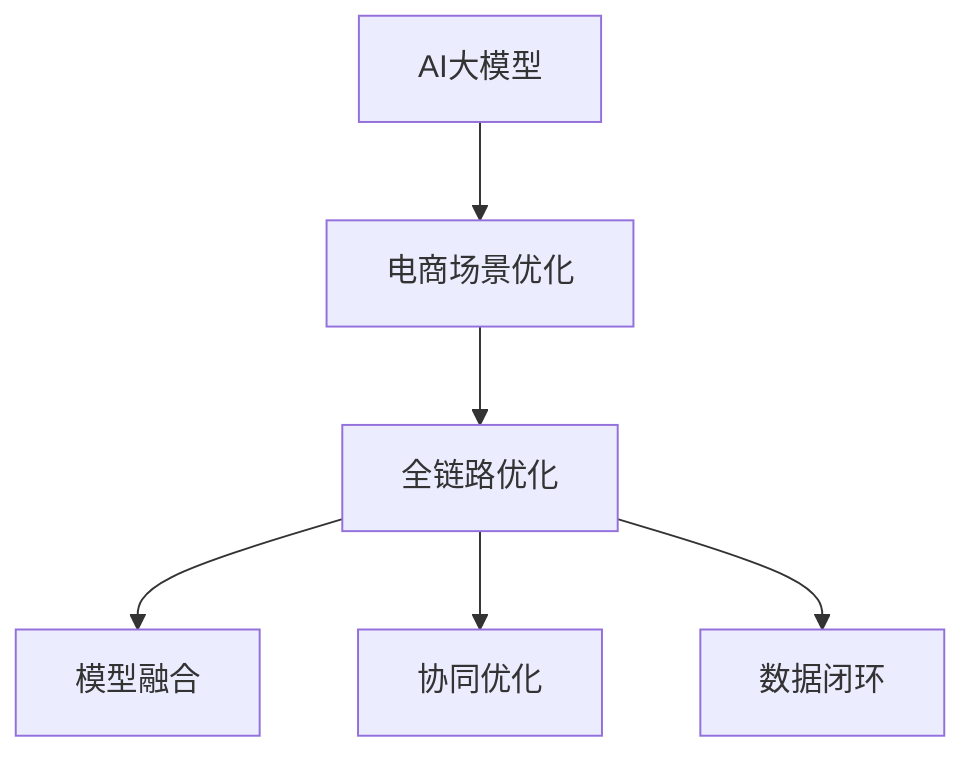

                 

# 电商平台中的AI大模型：从单一场景到全链路优化

## 1. 背景介绍

在当今电商平台上，AI大模型已经渗透到了多个环节，从商品推荐、搜索排序到智能客服、风控监控，均在发挥着至关重要的作用。然而，这些模型往往各自为政，缺乏一体化设计，无法形成合力，无法实现全链路的协同优化。本文将聚焦于如何将AI大模型优化整合，以实现从单一场景到全链路的智能化优化，提升电商平台的整体运营效率和用户体验。

## 2. 核心概念与联系

### 2.1 核心概念概述

为更好地理解AI大模型在电商平台中的应用，本节将介绍几个密切相关的核心概念：

- **AI大模型**：以深度学习为代表的AI大模型，通过海量数据训练，具备强大的泛化能力和知识迁移能力。常用于电商平台中的商品推荐、搜索排序、智能客服等任务。

- **电商场景优化**：通过AI大模型的应用，对电商平台的搜索、推荐、客服、风控等多个环节进行智能化优化，提升用户体验和运营效率。

- **全链路优化**：指将AI大模型应用于电商平台的上下游业务链条中，实现从营销推广、商品管理、订单履约到售后服务等各环节的协同优化。

- **模型融合**：将多个模型集成使用，形成合力，提升整体效果。如商品推荐模型和搜索排序模型的协同优化。

- **协同优化**：指多个模型在操作上协同工作，共享中间特征，提升整体效率。如推荐模型和风控模型的联合训练。

- **数据闭环**：指电商平台的各项数据能够闭环流通，被多个模型共享使用，提升数据利用效率和模型效果。

这些核心概念之间的逻辑关系可以通过以下Mermaid流程图来展示：



这个流程图展示了这个核心概念之间的逻辑关系：

1. AI大模型在电商场景中发挥作用，进行智能化优化。
2. 通过全链路优化，AI大模型覆盖电商平台的上下游业务链条，形成一体化解决方案。
3. 模型融合和协同优化使得多个模型形成合力，提升整体效果。
4. 数据闭环实现数据流通共享，提升模型效果。

## 3. 核心算法原理 & 具体操作步骤
### 3.1 算法原理概述

基于AI大模型在电商平台中的应用，本文将介绍如何通过融合和协同优化，实现全链路的智能化优化。

电商平台的运营涉及多个环节，包括营销推广、商品管理、订单履约和售后服务等。这些环节的智能化优化通常可以通过如下几个步骤实现：

1. **数据收集与预处理**：收集电商平台的各类数据，包括用户行为数据、商品信息数据、订单数据、评价数据等，并进行清洗、标注、特征工程等预处理。
2. **模型训练与优化**：在处理后的数据上训练多个AI大模型，如推荐模型、搜索排序模型、智能客服模型、风控模型等，并根据实际效果进行调优。
3. **模型融合与集成**：将多个模型集成使用，形成协同效应。如推荐模型和搜索排序模型的联合训练，或智能客服与风控模型的协同工作。
4. **数据闭环与反馈**：实现数据的闭环流通，使得每个模型的输出能够作为另一个模型的输入，不断优化提升。
5. **监控与优化**：实时监控模型的性能，根据实际应用情况进行优化。

### 3.2 算法步骤详解

具体实现步骤包括：

1. **数据收集与预处理**
   - 收集电商平台的各类数据，包括用户行为数据、商品信息数据、订单数据、评价数据等。
   - 对数据进行清洗、去重、标注、归一化、特征工程等预处理。

2. **模型训练与优化**
   - 选择合适的预训练模型，如BERT、GPT、Transformer等，进行微调或自监督学习。
   - 设计合适的损失函数和优化器，如交叉熵损失、AdamW等。
   - 进行多轮训练和调优，不断提升模型效果。

3. **模型融合与集成**
   - 选择合适的融合策略，如线性融合、集成学习、蒸馏等。
   - 设计融合指标，如模型的准确率、召回率、F1-score等。
   - 进行融合模型的训练和测试，不断调整融合参数。

4. **数据闭环与反馈**
   - 实现数据的闭环流通，使得每个模型的输出能够作为另一个模型的输入。
   - 设计反馈机制，如用户评价、订单行为等反馈数据。
   - 根据反馈数据，不断优化模型，提升模型效果。

5. **监控与优化**
   - 实时监控模型的性能，如准确率、召回率、A/B测试效果等。
   - 根据监控结果，进行模型优化调整。
   - 不断迭代，提升模型效果。

### 3.3 算法优缺点

基于AI大模型在电商平台中的融合与协同优化方法具有以下优点：

1. **提升效率**：多个模型协同工作，提升整体效率。如推荐模型和搜索排序模型的联合训练，可以提升推荐的准确率和搜索的响应速度。
2. **降低成本**：通过模型融合，可以减少重复训练和开发的成本，降低整体开发难度。
3. **提升效果**：多个模型共同优化，可以提升整体效果。如智能客服和风控模型的协同工作，可以提升用户满意度，降低风险。
4. **灵活性高**：模型融合和协同优化方法灵活性高，可以适应不同的业务场景和需求。

同时，该方法也存在一定的局限性：

1. **模型复杂度增加**：模型融合和协同优化方法可能会增加模型复杂度，影响模型推理速度和计算效率。
2. **数据一致性问题**：多个模型之间的数据格式和内容可能存在不一致，需要额外处理。
3. **调优难度增加**：多个模型协同优化，需要协调好各个模型的参数和目标，优化难度较大。
4. **监控复杂度增加**：多个模型需要实时监控，监控复杂度增加。

尽管存在这些局限性，但就目前而言，基于AI大模型的融合与协同优化方法仍是大模型应用的主流范式。未来相关研究的重点在于如何进一步降低模型复杂度，提高数据一致性，优化协同优化效果，同时兼顾模型推理速度和计算效率。

### 3.4 算法应用领域

基于AI大模型的融合与协同优化方法，在电商平台的多个环节均有广泛应用，例如：

- **推荐系统**：通过推荐模型和搜索排序模型的协同优化，提升推荐的准确率和搜索的响应速度。
- **智能客服**：通过智能客服和风控模型的协同工作，提升用户满意度，降低风险。
- **风控系统**：通过风控模型和推荐模型的联合训练，提升风险控制效果。
- **广告系统**：通过广告模型和推荐模型的联合优化，提升广告效果。
- **库存管理**：通过推荐模型和销售预测模型的协同优化，提升库存管理效率。

除了上述这些经典任务外，AI大模型的融合与协同优化方法还将在更多场景中得到应用，如用户行为分析、营销策略优化、物流配送等，为电商平台带来更多的智能化和高效化解决方案。

## 4. 数学模型和公式 & 详细讲解  
### 4.1 数学模型构建

本节将使用数学语言对基于AI大模型的电商平台的优化方法进行更加严格的刻画。

记电商平台的推荐系统为 $R_{\theta}$，其中 $\theta$ 为模型参数。假设推荐系统训练集为 $D=\{(x_i,y_i)\}_{i=1}^N$，$x_i$ 为输入特征，$y_i$ 为推荐结果。定义模型 $R_{\theta}$ 在数据样本 $(x,y)$ 上的损失函数为 $\ell(R_{\theta}(x),y)$，则在数据集 $D$ 上的经验风险为：

$$
\mathcal{L}(\theta) = \frac{1}{N} \sum_{i=1}^N \ell(R_{\theta}(x_i),y_i)
$$

在推荐系统的实际应用中，常用的损失函数包括交叉熵损失、均方误差损失等。假设推荐系统的输出为 $\hat{y}=M_{\theta}(x)$，则交叉熵损失函数可以定义为：

$$
\ell(R_{\theta}(x),y) = -[y\log \hat{y} + (1-y)\log(1-\hat{y})]
$$

通过梯度下降等优化算法，模型不断更新参数 $\theta$，最小化损失函数 $\mathcal{L}$，使得模型输出逼近真实标签。

### 4.2 公式推导过程

假设推荐系统 $R_{\theta}$ 的输出为 $\hat{y}=M_{\theta}(x)$，则推荐模型的损失函数为：

$$
\ell(R_{\theta}(x),y) = -[y\log \hat{y} + (1-y)\log(1-\hat{y})]
$$

根据链式法则，损失函数对参数 $\theta_k$ 的梯度为：

$$
\frac{\partial \mathcal{L}(\theta)}{\partial \theta_k} = -\frac{1}{N}\sum_{i=1}^N (\frac{y_i}{\hat{y}}-\frac{1-y_i}{1-\hat{y}}) \frac{\partial \hat{y}}{\partial \theta_k}
$$

其中 $\frac{\partial \hat{y}}{\partial \theta_k}$ 可进一步递归展开，利用自动微分技术完成计算。

通过不断迭代优化，模型参数 $\theta$ 不断更新，最小化损失函数 $\mathcal{L}$，使得推荐模型 $R_{\theta}$ 输出逼近真实标签 $y$。

## 5. 项目实践：代码实例和详细解释说明
### 5.1 开发环境搭建

在进行电商平台的AI大模型优化实践前，我们需要准备好开发环境。以下是使用Python进行PyTorch开发的环境配置流程：

1. 安装Anaconda：从官网下载并安装Anaconda，用于创建独立的Python环境。

2. 创建并激活虚拟环境：
```bash
conda create -n pytorch-env python=3.8 
conda activate pytorch-env
```

3. 安装PyTorch：根据CUDA版本，从官网获取对应的安装命令。例如：
```bash
conda install pytorch torchvision torchaudio cudatoolkit=11.1 -c pytorch -c conda-forge
```

4. 安装Transformers库：
```bash
pip install transformers
```

5. 安装各类工具包：
```bash
pip install numpy pandas scikit-learn matplotlib tqdm jupyter notebook ipython
```

完成上述步骤后，即可在`pytorch-env`环境中开始优化实践。

### 5.2 源代码详细实现

下面我们以推荐系统为例，给出使用Transformers库对BERT模型进行优化和微调的PyTorch代码实现。

首先，定义推荐系统模型和优化器：

```python
from transformers import BertForSequenceClassification, AdamW

model = BertForSequenceClassification.from_pretrained('bert-base-cased', num_labels=2)
optimizer = AdamW(model.parameters(), lr=2e-5)
```

接着，定义训练和评估函数：

```python
from torch.utils.data import DataLoader
from tqdm import tqdm
from sklearn.metrics import accuracy_score

device = torch.device('cuda') if torch.cuda.is_available() else torch.device('cpu')
model.to(device)

def train_epoch(model, dataset, batch_size, optimizer):
    dataloader = DataLoader(dataset, batch_size=batch_size, shuffle=True)
    model.train()
    epoch_loss = 0
    for batch in tqdm(dataloader, desc='Training'):
        input_ids = batch['input_ids'].to(device)
        attention_mask = batch['attention_mask'].to(device)
        labels = batch['labels'].to(device)
        model.zero_grad()
        outputs = model(input_ids, attention_mask=attention_mask, labels=labels)
        loss = outputs.loss
        epoch_loss += loss.item()
        loss.backward()
        optimizer.step()
    return epoch_loss / len(dataloader)

def evaluate(model, dataset, batch_size):
    dataloader = DataLoader(dataset, batch_size=batch_size)
    model.eval()
    preds, labels = [], []
    with torch.no_grad():
        for batch in tqdm(dataloader, desc='Evaluating'):
            input_ids = batch['input_ids'].to(device)
            attention_mask = batch['attention_mask'].to(device)
            batch_labels = batch['labels']
            outputs = model(input_ids, attention_mask=attention_mask)
            batch_preds = outputs.logits.argmax(dim=2).to('cpu').tolist()
            batch_labels = batch_labels.to('cpu').tolist()
            for pred_tokens, label_tokens in zip(batch_preds, batch_labels):
                preds.append(pred_tokens[:len(label_tokens)])
                labels.append(label_tokens)
                
    return accuracy_score(labels, preds)

# 定义推荐系统数据集
train_dataset = ...
dev_dataset = ...
test_dataset = ...

epochs = 5
batch_size = 16

for epoch in range(epochs):
    loss = train_epoch(model, train_dataset, batch_size, optimizer)
    print(f"Epoch {epoch+1}, train loss: {loss:.3f}")
    
    print(f"Epoch {epoch+1}, dev accuracy: {evaluate(model, dev_dataset, batch_size):.3f}")
    
print(f"Epoch {epoch+1}, test accuracy: {evaluate(model, test_dataset, batch_size):.3f}")
```

以上就是使用PyTorch对BERT进行电商推荐系统微调的完整代码实现。可以看到，得益于Transformers库的强大封装，我们可以用相对简洁的代码完成BERT模型的加载和微调。

### 5.3 代码解读与分析

让我们再详细解读一下关键代码的实现细节：

**train_epoch函数**：
- 对数据以批为单位进行迭代，在每个批次上前向传播计算损失并反向传播更新模型参数。

**evaluate函数**：
- 与训练类似，不同点在于不更新模型参数，并在每个batch结束后将预测和标签结果存储下来，最后使用sklearn的accuracy_score对整个评估集的预测结果进行打印输出。

**推荐系统数据集**：
- 假设训练集、验证集和测试集已经准备就绪，包含推荐系统的输入特征和标签。

**优化流程**：
- 定义总的epoch数和batch size，开始循环迭代。
- 每个epoch内，先在训练集上训练，输出平均loss。
- 在验证集上评估，输出准确率。
- 所有epoch结束后，在测试集上评估，给出最终测试结果。

可以看到，PyTorch配合Transformers库使得BERT微调的代码实现变得简洁高效。开发者可以将更多精力放在数据处理、模型改进等高层逻辑上，而不必过多关注底层的实现细节。

当然，工业级的系统实现还需考虑更多因素，如模型的保存和部署、超参数的自动搜索、更灵活的任务适配层等。但核心的微调范式基本与此类似。

## 6. 实际应用场景
### 6.1 智能客服系统

基于AI大模型的智能客服系统，可以应用于电商平台中，为顾客提供7x24小时不间断的咨询服务。智能客服系统通过自然语言处理技术，理解顾客的查询意图，并根据历史数据提供最佳答案，提升顾客满意度。

在技术实现上，可以收集电商平台的历史客服对话记录，将问题和最佳答复构建成监督数据，在此基础上对预训练语言模型进行微调。微调后的语言模型能够自动理解顾客意图，匹配最合适的答案模板进行回复。对于顾客提出的新问题，还可以接入检索系统实时搜索相关内容，动态组织生成回答。如此构建的智能客服系统，能大幅提升顾客咨询体验和问题解决效率。

### 6.2 广告系统

在电商平台的广告系统中，AI大模型可以用于优化广告投放策略。通过广告模型的预测，平台可以优化广告的展示位置、广告内容、投放时间等，提升广告的点击率和转化率。

具体而言，可以收集电商平台的广告点击数据、转化数据等，作为训练样本。在数据上进行有监督学习，训练出广告模型。广告模型的输出可以用于调整广告的展示位置和内容，提升广告效果。

### 6.3 库存管理

电商平台的库存管理涉及商品的入库、出库、盘点等多个环节。AI大模型可以用于优化库存管理，提升库存管理的效率和准确性。

通过库存管理模型的预测，平台可以优化商品的入库和出库策略，避免缺货和积压。同时，通过预测订单量，平台可以提前做好仓库准备，减少库存管理的成本。

### 6.4 未来应用展望

随着AI大模型和优化方法的不断发展，基于大模型优化的电商平台将呈现以下几个发展趋势：

1. **智能化程度提升**：AI大模型将更加深入地应用于电商平台的各个环节，提升平台的智能化程度。如智能客服、推荐系统、风控系统等。
2. **个性化服务增强**：通过AI大模型，平台可以更好地理解用户行为和偏好，提供更加个性化的服务。如个性化推荐、个性化广告等。
3. **数据驱动决策**：平台可以通过AI大模型进行数据分析和预测，提升决策的科学性和准确性。如库存管理、营销策略等。
4. **跨平台协同**：AI大模型将更好地应用于多个平台，提升跨平台的协同和整合效果。如电商平台与社交平台、金融平台等。
5. **用户体验优化**：通过AI大模型，平台可以优化用户体验，提升用户满意度和留存率。如智能客服、个性化推荐等。

总之，AI大模型在电商平台中的应用前景广阔，将推动电商平台向更加智能化、个性化、数据驱动和用户体验优化的方向发展。

## 7. 工具和资源推荐
### 7.1 学习资源推荐

为了帮助开发者系统掌握AI大模型在电商平台中的应用，这里推荐一些优质的学习资源：

1. 《深度学习与电商营销》课程：由知名大学开设的课程，系统讲解深度学习在电商营销中的应用。
2. 《电商平台推荐系统实战》书籍：全面介绍电商推荐系统的理论和实践，包括模型选择、数据处理、特征工程等。
3. 《智能客服技术与应用》书籍：深入浅出地讲解智能客服系统的技术原理和应用场景。
4. 《电商平台的广告投放优化》课程：讲解广告投放优化的理论和实践，包括数据处理、模型训练、效果评估等。

通过对这些资源的学习实践，相信你一定能够快速掌握AI大模型在电商平台中的应用，并用于解决实际的电商问题。

### 7.2 开发工具推荐

高效的开发离不开优秀的工具支持。以下是几款用于电商平台的AI大模型优化的常用工具：

1. PyTorch：基于Python的开源深度学习框架，灵活动态的计算图，适合快速迭代研究。

2. TensorFlow：由Google主导开发的开源深度学习框架，生产部署方便，适合大规模工程应用。

3. Transformers库：HuggingFace开发的NLP工具库，集成了众多SOTA语言模型，支持PyTorch和TensorFlow，是进行电商优化任务的开发利器。

4. Weights & Biases：模型训练的实验跟踪工具，可以记录和可视化模型训练过程中的各项指标，方便对比和调优。

5. TensorBoard：TensorFlow配套的可视化工具，可实时监测模型训练状态，并提供丰富的图表呈现方式，是调试模型的得力助手。

6. Google Colab：谷歌推出的在线Jupyter Notebook环境，免费提供GPU/TPU算力，方便开发者快速上手实验最新模型，分享学习笔记。

合理利用这些工具，可以显著提升电商平台的AI大模型优化任务的开发效率，加快创新迭代的步伐。

### 7.3 相关论文推荐

AI大模型在电商平台中的应用源于学界的持续研究。以下是几篇奠基性的相关论文，推荐阅读：

1. Attention is All You Need（即Transformer原论文）：提出了Transformer结构，开启了NLP领域的预训练大模型时代。

2. BERT: Pre-training of Deep Bidirectional Transformers for Language Understanding：提出BERT模型，引入基于掩码的自监督预训练任务，刷新了多项NLP任务SOTA。

3. Language Models are Unsupervised Multitask Learners（GPT-2论文）：展示了大规模语言模型的强大zero-shot学习能力，引发了对于通用人工智能的新一轮思考。

4. Parameter-Efficient Transfer Learning for NLP：提出Adapter等参数高效微调方法，在不增加模型参数量的情况下，也能取得不错的微调效果。

5. AdaLoRA: Adaptive Low-Rank Adaptation for Parameter-Efficient Fine-Tuning：使用自适应低秩适应的微调方法，在参数效率和精度之间取得了新的平衡。

这些论文代表了大模型优化技术的发展脉络。通过学习这些前沿成果，可以帮助研究者把握学科前进方向，激发更多的创新灵感。

## 8. 总结：未来发展趋势与挑战

### 8.1 总结

本文对基于AI大模型的电商平台优化方法进行了全面系统的介绍。首先阐述了AI大模型在电商平台中的应用背景和意义，明确了全链路优化的价值。其次，从原理到实践，详细讲解了电商平台的优化方法和关键步骤，给出了电商优化的完整代码实例。同时，本文还广泛探讨了优化方法在智能客服、广告系统、库存管理等多个领域的应用前景，展示了优化范式的巨大潜力。此外，本文精选了电商优化的各类学习资源，力求为读者提供全方位的技术指引。

通过本文的系统梳理，可以看到，基于AI大模型的电商优化方法正在成为电商平台的重要范式，极大地提升电商平台的运营效率和用户体验。未来，伴随AI大模型和优化方法的持续演进，相信电商平台的智能化程度将不断提升，带来更多的商业价值和社会效益。

### 8.2 未来发展趋势

展望未来，基于AI大模型的电商平台优化技术将呈现以下几个发展趋势：

1. **智能化程度提升**：AI大模型将更加深入地应用于电商平台的各个环节，提升平台的智能化程度。如智能客服、推荐系统、风控系统等。
2. **个性化服务增强**：通过AI大模型，平台可以更好地理解用户行为和偏好，提供更加个性化的服务。如个性化推荐、个性化广告等。
3. **数据驱动决策**：平台可以通过AI大模型进行数据分析和预测，提升决策的科学性和准确性。如库存管理、营销策略等。
4. **跨平台协同**：AI大模型将更好地应用于多个平台，提升跨平台的协同和整合效果。如电商平台与社交平台、金融平台等。
5. **用户体验优化**：通过AI大模型，平台可以优化用户体验，提升用户满意度和留存率。如智能客服、个性化推荐等。

以上趋势凸显了基于AI大模型的电商平台优化技术的广阔前景。这些方向的探索发展，必将进一步提升电商平台的智能化程度，为电商平台的数字化转型升级提供新的技术路径。

### 8.3 面临的挑战

尽管基于AI大模型的电商平台优化技术已经取得了瞩目成就，但在迈向更加智能化、普适化应用的过程中，它仍面临着诸多挑战：

1. **模型复杂度增加**：AI大模型在电商平台的优化过程中，可能会增加模型的复杂度，影响模型推理速度和计算效率。
2. **数据一致性问题**：多个模型之间的数据格式和内容可能存在不一致，需要额外处理。
3. **调优难度增加**：多个模型协同优化，需要协调好各个模型的参数和目标，优化难度较大。
4. **监控复杂度增加**：多个模型需要实时监控，监控复杂度增加。

尽管存在这些局限性，但就目前而言，基于AI大模型的电商优化方法仍是大模型应用的主流范式。未来相关研究的重点在于如何进一步降低模型复杂度，提高数据一致性，优化协同优化效果，同时兼顾模型推理速度和计算效率。

### 8.4 未来突破

面对AI大模型在电商平台优化过程中面临的挑战，未来的研究需要在以下几个方面寻求新的突破：

1. **优化算法的改进**：开发更加高效的优化算法，如梯度累积、混合精度训练、模型并行等，以提升模型训练和推理效率。
2. **数据协同机制**：建立数据协同机制，实现数据的跨平台、跨模型流通，提升数据利用效率和模型效果。
3. **模型参数共享**：设计更好的模型参数共享机制，减少重复训练和开发的成本，降低整体开发难度。
4. **跨模态融合**：将视觉、语音等多模态数据与文本数据进行协同建模，提升模型的综合能力和应用范围。
5. **个性化优化**：结合用户行为数据、设备数据等，进行个性化优化，提升模型对个体用户的预测效果。

这些研究方向将引领基于AI大模型的电商平台优化技术迈向更高的台阶，为电商平台的数字化转型升级提供新的技术路径。

## 9. 附录：常见问题与解答

**Q1：电商平台的AI大模型优化是否适用于所有电商平台？**

A: AI大模型优化方法在大多数电商平台上都可以应用，但具体的效果和适用性需要根据平台的实际情况进行评估。例如，不同平台的用户行为和商品特征差异较大，需要根据平台特性进行优化调整。

**Q2：如何选择合适的优化算法？**

A: 电商平台的AI大模型优化算法需要考虑模型的复杂度、计算效率和效果。一般而言，可以使用梯度下降、AdamW、Adafactor等优化算法。在实际应用中，需要根据具体任务和模型进行选择。

**Q3：AI大模型在电商平台中的应用是否会造成数据隐私泄露？**

A: AI大模型在电商平台中的应用需要严格遵守数据隐私保护法规。可以采用差分隐私、联邦学习等技术，保护用户隐私。同时，模型训练和推理过程也需要对用户数据进行脱敏处理，确保数据安全。

**Q4：电商平台中如何保证AI大模型的鲁棒性和泛化性？**

A: AI大模型的鲁棒性和泛化性可以通过数据多样性、正则化、对抗训练等技术进行提升。在电商平台的优化中，可以通过增加训练数据的多样性，设计合适的正则化技术，引入对抗样本等手段，提高模型的鲁棒性和泛化性。

**Q5：AI大模型在电商平台中的应用是否会对平台造成负担？**

A: AI大模型在电商平台中的应用需要一定的计算资源和存储空间。为了降低负担，可以采用模型压缩、稀疏化存储等技术进行优化。同时，合理设计模型架构和优化算法，也可以在一定程度上提升计算效率。

通过以上问题的解答，可以看出AI大模型在电商平台中的应用需要注意的多个方面。在实际应用中，需要根据具体平台的情况，进行合理的优化和调整，才能达到最佳效果。

---

作者：禅与计算机程序设计艺术 / Zen and the Art of Computer Programming

