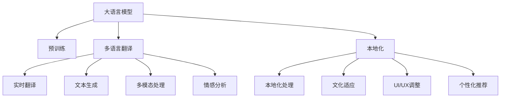

                 

# 电商平台中的AI大模型：从单一语言到多语言实时翻译与本地化

## 1. 背景介绍

### 1.1 问题由来

随着全球化的深入推进，电商平台的业务拓展到全球市场，吸引了来自不同国家和地区的消费者。然而，语言障碍仍然是一大难题，尤其在多语言环境中，如何有效地进行本地化处理，提升用户体验，是电商平台亟需解决的痛点。基于深度学习的大语言模型（Large Language Models, LLMs）在自然语言处理（Natural Language Processing, NLP）领域取得了显著进展，为多语言翻译和本地化提供了新的解决方案。

### 1.2 问题核心关键点

本文聚焦于如何利用大语言模型进行多语言实时翻译与本地化，具体包括以下几个核心关键点：

1. 选择合适的预训练模型和本地化语言。
2. 设计并实现多语言翻译和本地化系统。
3. 优化模型性能，提升翻译和本地化效果。
4. 部署和维护系统，确保稳定性与可扩展性。

### 1.3 问题研究意义

在全球化背景下，电商平台的本地化需求日益迫切。利用大语言模型进行多语言翻译和本地化，可以极大地提升用户体验，增强平台的国际竞争力，同时降低人工成本，提升运营效率。

## 2. 核心概念与联系

### 2.1 核心概念概述

为更好地理解本文的讨论，我们先介绍几个核心概念：

- **大语言模型**：以自回归（如GPT）或自编码（如BERT）为代表的深度学习模型，通过大规模无标签文本数据进行预训练，具备强大的语言理解和生成能力。
- **多语言翻译**：将一种语言的内容翻译成另一种语言的过程。
- **本地化**：根据不同地域的用户需求，对产品或服务进行调整，包括语言翻译、文化适应、设计调整等，以适应当地市场。
- **微调**：在预训练模型的基础上，使用特定任务的数据集进行有监督的训练，优化模型在特定任务上的性能。
- **迁移学习**：利用一个领域学到的知识，迁移到另一个领域进行学习，以提升模型的泛化能力。

这些概念之间的逻辑关系可以通过以下Mermaid流程图来展示：



这个流程图展示了大语言模型在多语言翻译和本地化中的核心作用，以及如何通过多任务学习提升模型性能。

## 3. 核心算法原理 & 具体操作步骤

### 3.1 算法原理概述

基于大语言模型的多语言翻译与本地化，本质上是一个序列到序列（Seq2Seq）的问题。假设源语言文本为 $X=\{x_1, x_2, ..., x_n\}$，目标语言文本为 $Y=\{y_1, y_2, ..., y_m\}$，其中 $n$ 和 $m$ 分别为源语和目标语的长度。目标是将源语言文本 $X$ 翻译为目标语言文本 $Y$，同时考虑本地化的需求，对目标文本进行文化适应等处理。

形式化地，我们可以定义一个目标函数 $L(X,Y;\theta)$，表示模型在给定输入 $X$ 和目标 $Y$ 下的损失函数，其中 $\theta$ 为模型参数。通过最小化损失函数，使模型能够准确地将源语言文本 $X$ 翻译为目标语言文本 $Y$。

### 3.2 算法步骤详解

大语言模型在多语言翻译与本地化中的实现步骤如下：

**Step 1: 准备数据集**
- 收集目标语言的文本数据，并将其分为训练集、验证集和测试集。
- 进行数据预处理，如分词、去噪、标准化等。

**Step 2: 选择预训练模型**
- 选择合适的预训练模型，如GPT、BERT等。
- 加载预训练模型的权重，将其作为初始化参数。

**Step 3: 设计本地化任务**
- 根据目标市场的本地化需求，设计相应的本地化任务。
- 如文化适应、情感调整、个性化推荐等。

**Step 4: 微调模型**
- 在本地化任务的数据集上，进行有监督的微调。
- 使用优化算法（如AdamW、SGD等），调整模型参数。

**Step 5: 部署和维护**
- 将微调后的模型部署到服务器上，确保服务稳定性。
- 定期更新模型，适配新数据和新需求。

### 3.3 算法优缺点

基于大语言模型的多语言翻译与本地化方法具有以下优点：

1. 通用性强。适用于各种NLP任务，包括翻译、情感分析、个性化推荐等，设计简单的任务适配层即可实现。
2. 效果好。利用大语言模型强大的语言理解和生成能力，可以得到高质量的翻译和本地化结果。
3. 可扩展性高。可以针对不同市场进行本地化，提升用户体验。

同时，该方法也存在一定的局限性：

1. 依赖数据。翻译和本地化的效果很大程度上取决于标注数据的质量和数量，获取高质量标注数据的成本较高。
2. 迁移能力有限。当目标语言与预训练数据的分布差异较大时，翻译和本地化的性能提升有限。
3. 可解释性不足。翻译和本地化模型的决策过程通常缺乏可解释性，难以对其推理逻辑进行分析和调试。

尽管存在这些局限性，但就目前而言，基于大语言模型的翻译和本地化方法仍是最主流范式。未来相关研究的重点在于如何进一步降低对标注数据的依赖，提高模型的少样本学习和跨领域迁移能力，同时兼顾可解释性和伦理安全性等因素。

### 3.4 算法应用领域

基于大语言模型的多语言翻译和本地化方法，在电商平台的运营中具有广泛的应用：

1. **多语言翻译**：提供不同语言的客服支持、商品描述、订单信息等，确保用户能够轻松理解和使用平台。
2. **本地化处理**：根据不同地域的用户需求，对商品页面进行本地化处理，如文化适应、情感调整、个性化推荐等，提升用户体验。
3. **情感分析**：分析用户评论和反馈，了解用户情绪和需求，进行情感调整和改进产品。
4. **个性化推荐**：根据用户行为和偏好，提供个性化推荐服务，提升用户粘性和满意度。

除了上述这些经典应用外，电商平台还可以创新性地利用大语言模型进行用户行为预测、市场趋势分析等，为平台的持续优化和市场拓展提供新的技术支持。

## 4. 数学模型和公式 & 详细讲解 & 举例说明

### 4.1 数学模型构建

假设我们有一个序列到序列（Seq2Seq）的模型，其编码器（Encoder）和解码器（Decoder）均为Transformer模型。设 $X=\{x_1, x_2, ..., x_n\}$ 为源语言文本， $Y=\{y_1, y_2, ..., y_m\}$ 为目标语言文本， $T=\{t_1, t_2, ..., t_m\}$ 为本地化处理后的文本。

形式化地，我们可以定义模型 $M_{\theta}$，其中 $\theta$ 为模型参数。目标函数 $L(X,Y,T;\theta)$ 可以表示为：

$$
L(X,Y,T;\theta) = \sum_{i=1}^{n} \log P(x_i|x_{i-1},x_{i-2},...,x_1;\theta) + \sum_{j=1}^{m} \log P(y_j|y_{j-1},y_{j-2},...,y_1;\theta) + \sum_{k=1}^{m} \log P(t_k|t_{k-1},t_{k-2},...,t_1;\theta)
$$

其中 $P(x_i|x_{i-1},x_{i-2},...,x_1;\theta)$ 为编码器对源语言文本 $X$ 的概率分布， $P(y_j|y_{j-1},y_{j-2},...,y_1;\theta)$ 为解码器对目标语言文本 $Y$ 的概率分布， $P(t_k|t_{k-1},t_{k-2},...,t_1;\theta)$ 为本地化处理后的文本 $T$ 的概率分布。

### 4.2 公式推导过程

以下我们以一个简单的编码器-解码器模型为例，推导序列到序列的损失函数及其梯度计算公式。

假设源语言文本为 $X=\{x_1, x_2, ..., x_n\}$，目标语言文本为 $Y=\{y_1, y_2, ..., y_m\}$，本地化处理后的文本为 $T=\{t_1, t_2, ..., t_m\}$。

**编码器部分**：

设编码器输入为 $X$，输出为 $C$。则编码器的损失函数可以表示为：

$$
L_E = -\frac{1}{N} \sum_{i=1}^{n} \log P(X_i;C;\theta_E)
$$

其中 $N$ 为样本数量， $\theta_E$ 为编码器的参数。

**解码器部分**：

设解码器输入为 $C$，输出为 $Y$。则解码器的损失函数可以表示为：

$$
L_D = -\frac{1}{N} \sum_{j=1}^{m} \log P(Y_j;C;\theta_D)
$$

其中 $\theta_D$ 为解码器的参数。

**本地化处理部分**：

设本地化处理器的输入为 $C$，输出为 $T$。则本地化处理器的损失函数可以表示为：

$$
L_L = -\frac{1}{N} \sum_{k=1}^{m} \log P(T_k;C;\theta_L)
$$

其中 $\theta_L$ 为本地化处理器的参数。

通过链式法则，可以计算出编码器、解码器和本地化处理器对源语言文本 $X$、目标语言文本 $Y$ 和本地化处理后的文本 $T$ 的梯度：

$$
\frac{\partial L_E}{\partial \theta_E} = -\frac{1}{N} \sum_{i=1}^{n} \frac{\partial \log P(X_i;C;\theta_E)}{\partial \theta_E}
$$

$$
\frac{\partial L_D}{\partial \theta_D} = -\frac{1}{N} \sum_{j=1}^{m} \frac{\partial \log P(Y_j;C;\theta_D)}{\partial \theta_D}
$$

$$
\frac{\partial L_L}{\partial \theta_L} = -\frac{1}{N} \sum_{k=1}^{m} \frac{\partial \log P(T_k;C;\theta_L)}{\partial \theta_L}
$$

在得到损失函数的梯度后，即可带入优化算法，完成模型的迭代优化。重复上述过程直至收敛，最终得到适应本地化任务的最优模型参数 $\theta^*$。

### 4.3 案例分析与讲解

假设我们有一个电商平台，需要支持英文和中文的实时翻译和本地化。具体实现步骤如下：

**Step 1: 准备数据集**

- 收集英文和中文的电商商品描述和用户评论数据，将其分为训练集、验证集和测试集。
- 进行数据预处理，如分词、去噪、标准化等。

**Step 2: 选择预训练模型**

- 选择BERT或GPT作为预训练模型。
- 加载预训练模型的权重，将其作为初始化参数。

**Step 3: 设计本地化任务**

- 根据市场需求，设计本地化处理任务，如文化适应、情感调整、个性化推荐等。
- 将本地化任务的数据集分为训练集和验证集。

**Step 4: 微调模型**

- 在本地化任务的数据集上，进行有监督的微调。
- 使用AdamW优化算法，调整模型参数。

**Step 5: 部署和维护**

- 将微调后的模型部署到服务器上，确保服务稳定性。
- 定期更新模型，适配新数据和新需求。

通过上述步骤，电商平台可以轻松地支持多语言翻译和本地化处理，提升用户体验，增加市场竞争力。

## 5. 项目实践：代码实例和详细解释说明

### 5.1 开发环境搭建

在进行多语言翻译和本地化实践前，我们需要准备好开发环境。以下是使用Python进行PyTorch开发的环境配置流程：

1. 安装Anaconda：从官网下载并安装Anaconda，用于创建独立的Python环境。

2. 创建并激活虚拟环境：
```bash
conda create -n pytorch-env python=3.8 
conda activate pytorch-env
```

3. 安装PyTorch：根据CUDA版本，从官网获取对应的安装命令。例如：
```bash
conda install pytorch torchvision torchaudio cudatoolkit=11.1 -c pytorch -c conda-forge
```

4. 安装Transformers库：
```bash
pip install transformers
```

5. 安装各类工具包：
```bash
pip install numpy pandas scikit-learn matplotlib tqdm jupyter notebook ipython
```

完成上述步骤后，即可在`pytorch-env`环境中开始多语言翻译和本地化的开发实践。

### 5.2 源代码详细实现

下面我们以电商平台的本地化翻译系统为例，给出使用Transformers库对BERT模型进行微调的PyTorch代码实现。

首先，定义本地化处理任务的数据处理函数：

```python
from transformers import BertTokenizer
from torch.utils.data import Dataset
import torch

class LocalizationDataset(Dataset):
    def __init__(self, texts, tags, tokenizer, max_len=128):
        self.texts = texts
        self.tags = tags
        self.tokenizer = tokenizer
        self.max_len = max_len
        
    def __len__(self):
        return len(self.texts)
    
    def __getitem__(self, item):
        text = self.texts[item]
        tags = self.tags[item]
        
        encoding = self.tokenizer(text, return_tensors='pt', max_length=self.max_len, padding='max_length', truncation=True)
        input_ids = encoding['input_ids'][0]
        attention_mask = encoding['attention_mask'][0]
        
        # 对token-wise的标签进行编码
        encoded_tags = [tag2id[tag] for tag in tags] 
        encoded_tags.extend([tag2id['O']] * (self.max_len - len(encoded_tags)))
        labels = torch.tensor(encoded_tags, dtype=torch.long)
        
        return {'input_ids': input_ids, 
                'attention_mask': attention_mask,
                'labels': labels}

# 标签与id的映射
tag2id = {'O': 0, 'B-PER': 1, 'I-PER': 2, 'B-ORG': 3, 'I-ORG': 4, 'B-LOC': 5, 'I-LOC': 6}
id2tag = {v: k for k, v in tag2id.items()}

# 创建dataset
tokenizer = BertTokenizer.from_pretrained('bert-base-cased')

train_dataset = LocalizationDataset(train_texts, train_tags, tokenizer)
dev_dataset = LocalizationDataset(dev_texts, dev_tags, tokenizer)
test_dataset = LocalizationDataset(test_texts, test_tags, tokenizer)
```

然后，定义模型和优化器：

```python
from transformers import BertForTokenClassification, AdamW

model = BertForTokenClassification.from_pretrained('bert-base-cased', num_labels=len(tag2id))

optimizer = AdamW(model.parameters(), lr=2e-5)
```

接着，定义训练和评估函数：

```python
from torch.utils.data import DataLoader
from tqdm import tqdm
from sklearn.metrics import classification_report

device = torch.device('cuda') if torch.cuda.is_available() else torch.device('cpu')
model.to(device)

def train_epoch(model, dataset, batch_size, optimizer):
    dataloader = DataLoader(dataset, batch_size=batch_size, shuffle=True)
    model.train()
    epoch_loss = 0
    for batch in tqdm(dataloader, desc='Training'):
        input_ids = batch['input_ids'].to(device)
        attention_mask = batch['attention_mask'].to(device)
        labels = batch['labels'].to(device)
        model.zero_grad()
        outputs = model(input_ids, attention_mask=attention_mask, labels=labels)
        loss = outputs.loss
        epoch_loss += loss.item()
        loss.backward()
        optimizer.step()
    return epoch_loss / len(dataloader)

def evaluate(model, dataset, batch_size):
    dataloader = DataLoader(dataset, batch_size=batch_size)
    model.eval()
    preds, labels = [], []
    with torch.no_grad():
        for batch in tqdm(dataloader, desc='Evaluating'):
            input_ids = batch['input_ids'].to(device)
            attention_mask = batch['attention_mask'].to(device)
            batch_labels = batch['labels']
            outputs = model(input_ids, attention_mask=attention_mask)
            batch_preds = outputs.logits.argmax(dim=2).to('cpu').tolist()
            batch_labels = batch_labels.to('cpu').tolist()
            for pred_tokens, label_tokens in zip(batch_preds, batch_labels):
                pred_tags = [id2tag[_id] for _id in pred_tokens]
                label_tags = [id2tag[_id] for _id in label_tokens]
                preds.append(pred_tags[:len(label_tags)])
                labels.append(label_tags)
                
    print(classification_report(labels, preds))
```

最后，启动训练流程并在测试集上评估：

```python
epochs = 5
batch_size = 16

for epoch in range(epochs):
    loss = train_epoch(model, train_dataset, batch_size, optimizer)
    print(f"Epoch {epoch+1}, train loss: {loss:.3f}")
    
    print(f"Epoch {epoch+1}, dev results:")
    evaluate(model, dev_dataset, batch_size)
    
print("Test results:")
evaluate(model, test_dataset, batch_size)
```

以上就是使用PyTorch对BERT进行本地化翻译系统微调的完整代码实现。可以看到，得益于Transformers库的强大封装，我们可以用相对简洁的代码完成BERT模型的加载和微调。

### 5.3 代码解读与分析

让我们再详细解读一下关键代码的实现细节：

**LocalizationDataset类**：
- `__init__`方法：初始化文本、标签、分词器等关键组件。
- `__len__`方法：返回数据集的样本数量。
- `__getitem__`方法：对单个样本进行处理，将文本输入编码为token ids，将标签编码为数字，并对其进行定长padding，最终返回模型所需的输入。

**tag2id和id2tag字典**：
- 定义了标签与数字id之间的映射关系，用于将token-wise的预测结果解码回真实的标签。

**训练和评估函数**：
- 使用PyTorch的DataLoader对数据集进行批次化加载，供模型训练和推理使用。
- 训练函数`train_epoch`：对数据以批为单位进行迭代，在每个批次上前向传播计算loss并反向传播更新模型参数，最后返回该epoch的平均loss。
- 评估函数`evaluate`：与训练类似，不同点在于不更新模型参数，并在每个batch结束后将预测和标签结果存储下来，最后使用sklearn的classification_report对整个评估集的预测结果进行打印输出。

**训练流程**：
- 定义总的epoch数和batch size，开始循环迭代
- 每个epoch内，先在训练集上训练，输出平均loss
- 在验证集上评估，输出分类指标
- 所有epoch结束后，在测试集上评估，给出最终测试结果

可以看到，PyTorch配合Transformers库使得BERT微调的代码实现变得简洁高效。开发者可以将更多精力放在数据处理、模型改进等高层逻辑上，而不必过多关注底层的实现细节。

当然，工业级的系统实现还需考虑更多因素，如模型的保存和部署、超参数的自动搜索、更灵活的任务适配层等。但核心的微调范式基本与此类似。

## 6. 实际应用场景

### 6.1 电商平台翻译系统

基于大语言模型的多语言翻译系统，可以在电商平台中提供多种语言支持，提升用户体验。例如：

- **商品翻译**：将商品描述、功能参数等信息翻译成多种语言，方便全球用户购买。
- **客户支持**：提供多语言客服支持，使用户能够轻松交流。
- **广告翻译**：将广告内容翻译成多种语言，扩大市场覆盖。

这些翻译功能可以显著提升电商平台的国际竞争力，增加用户粘性和满意度。

### 6.2 个性化推荐系统

基于大语言模型的本地化翻译和本地化处理，可以帮助电商平台更好地理解不同地域用户的偏好和需求，从而提供更加个性化的推荐服务。例如：

- **本地化商品推荐**：根据用户所在地域，推荐符合当地文化习俗的商品。
- **本地化广告推荐**：根据用户所在地域，推荐符合当地语言和文化习惯的广告。
- **本地化内容推荐**：根据用户所在地域，推荐符合当地语言和文化习惯的内容。

这些本地化处理可以显著提升推荐系统的效果，增强用户体验，提升平台的转化率和用户满意度。

### 6.3 市场分析系统

基于大语言模型的本地化翻译和本地化处理，还可以用于电商平台的市场分析系统，帮助企业更好地了解不同市场的需求和趋势。例如：

- **市场趋势分析**：分析不同地域的搜索和购买数据，了解市场趋势。
- **竞争对手分析**：分析竞争对手在不同市场的表现，制定策略。
- **用户反馈分析**：分析用户在不同市场的反馈，改进产品和服务。

这些市场分析功能可以帮助企业更好地了解不同市场的需求和趋势，制定更加精准的市场策略，提升整体竞争力。

### 6.4 未来应用展望

随着大语言模型和微调方法的不断发展，基于大语言模型的多语言翻译和本地化将呈现以下几个发展趋势：

1. **多模态翻译**：将文本、图像、语音等多模态信息进行联合翻译，提升翻译效果。
2. **实时翻译**：利用深度学习技术实现实时翻译，提升用户体验。
3. **情感翻译**：翻译时考虑文本情感，提升翻译的自然度。
4. **文化适应**：根据不同地域文化，进行适当的本地化处理，提升翻译效果。
5. **个性化推荐**：结合本地化处理，进行个性化推荐，提升用户体验。
6. **市场分析**：利用翻译和本地化处理，进行市场分析，提升决策效率。

以上趋势凸显了大语言模型在多语言翻译和本地化中的广阔前景。这些方向的探索发展，必将进一步提升电商平台的用户体验，增加市场竞争力。

## 7. 工具和资源推荐

### 7.1 学习资源推荐

为了帮助开发者系统掌握大语言模型在多语言翻译和本地化中的理论基础和实践技巧，这里推荐一些优质的学习资源：

1. 《Transformer from Scratch》系列博文：由大模型技术专家撰写，深入浅出地介绍了Transformer原理、BERT模型、多语言翻译和本地化等前沿话题。

2. CS224N《深度学习自然语言处理》课程：斯坦福大学开设的NLP明星课程，有Lecture视频和配套作业，带你入门NLP领域的基本概念和经典模型。

3. 《Natural Language Processing with Transformers》书籍：Transformers库的作者所著，全面介绍了如何使用Transformers库进行NLP任务开发，包括多语言翻译和本地化在内的诸多范式。

4. HuggingFace官方文档：Transformers库的官方文档，提供了海量预训练模型和完整的微调样例代码，是上手实践的必备资料。

5. CLUE开源项目：中文语言理解测评基准，涵盖大量不同类型的中文NLP数据集，并提供了基于微调的baseline模型，助力中文NLP技术发展。

通过对这些资源的学习实践，相信你一定能够快速掌握大语言模型在多语言翻译和本地化中的精髓，并用于解决实际的NLP问题。

### 7.2 开发工具推荐

高效的开发离不开优秀的工具支持。以下是几款用于大语言模型多语言翻译和本地化开发的常用工具：

1. PyTorch：基于Python的开源深度学习框架，灵活动态的计算图，适合快速迭代研究。大部分预训练语言模型都有PyTorch版本的实现。

2. TensorFlow：由Google主导开发的开源深度学习框架，生产部署方便，适合大规模工程应用。同样有丰富的预训练语言模型资源。

3. Transformers库：HuggingFace开发的NLP工具库，集成了众多SOTA语言模型，支持PyTorch和TensorFlow，是进行多语言翻译和本地化开发的利器。

4. Weights & Biases：模型训练的实验跟踪工具，可以记录和可视化模型训练过程中的各项指标，方便对比和调优。与主流深度学习框架无缝集成。

5. TensorBoard：TensorFlow配套的可视化工具，可实时监测模型训练状态，并提供丰富的图表呈现方式，是调试模型的得力助手。

6. Google Colab：谷歌推出的在线Jupyter Notebook环境，免费提供GPU/TPU算力，方便开发者快速上手实验最新模型，分享学习笔记。

合理利用这些工具，可以显著提升大语言模型在多语言翻译和本地化任务的开发效率，加快创新迭代的步伐。

### 7.3 相关论文推荐

大语言模型在多语言翻译和本地化中的发展源于学界的持续研究。以下是几篇奠基性的相关论文，推荐阅读：

1. Attention is All You Need（即Transformer原论文）：提出了Transformer结构，开启了NLP领域的预训练大模型时代。

2. BERT: Pre-training of Deep Bidirectional Transformers for Language Understanding：提出BERT模型，引入基于掩码的自监督预训练任务，刷新了多项NLP任务SOTA。

3. Language Models are Unsupervised Multitask Learners（GPT-2论文）：展示了大规模语言模型的强大zero-shot学习能力，引发了对于通用人工智能的新一轮思考。

4. Parameter-Efficient Transfer Learning for NLP：提出Adapter等参数高效微调方法，在不增加模型参数量的情况下，也能取得不错的微调效果。

5. Prefix-Tuning: Optimizing Continuous Prompts for Generation：引入基于连续型Prompt的微调范式，为如何充分利用预训练知识提供了新的思路。

6. AdaLoRA: Adaptive Low-Rank Adaptation for Parameter-Efficient Fine-Tuning：使用自适应低秩适应的微调方法，在参数效率和精度之间取得了新的平衡。

这些论文代表了大语言模型在多语言翻译和本地化中的发展脉络。通过学习这些前沿成果，可以帮助研究者把握学科前进方向，激发更多的创新灵感。

## 8. 总结：未来发展趋势与挑战

### 8.1 总结

本文对基于大语言模型的多语言翻译和本地化方法进行了全面系统的介绍。首先阐述了大语言模型和多语言翻译的必要性，明确了多语言翻译在电商平台中的重要性和潜在价值。其次，从原理到实践，详细讲解了大语言模型在多语言翻译和本地化中的应用，包括模型的选择、本地化任务的设计、微调过程的实现等关键环节。最后，探讨了多语言翻译和本地化技术的未来发展趋势和面临的挑战，展望了其在电商平台中的应用前景。

通过本文的系统梳理，可以看到，基于大语言模型的多语言翻译和本地化技术正在成为电商平台的重要范式，极大地提升了用户体验，增强了平台的国际竞争力。未来，伴随大语言模型和微调方法的持续演进，基于多语言翻译和本地化技术的电商平台必将在全球市场中发挥更大的作用。

### 8.2 未来发展趋势

展望未来，大语言模型在多语言翻译和本地化领域将呈现以下几个发展趋势：

1. **多模态翻译**：将文本、图像、语音等多模态信息进行联合翻译，提升翻译效果。
2. **实时翻译**：利用深度学习技术实现实时翻译，提升用户体验。
3. **情感翻译**：翻译时考虑文本情感，提升翻译的自然度。
4. **文化适应**：根据不同地域文化，进行适当的本地化处理，提升翻译效果。
5. **个性化推荐**：结合本地化处理，进行个性化推荐，提升用户体验。
6. **市场分析**：利用翻译和本地化处理，进行市场分析，提升决策效率。

以上趋势凸显了大语言模型在多语言翻译和本地化中的广阔前景。这些方向的探索发展，必将进一步提升电商平台的国际竞争力，增加市场竞争力。

### 8.3 面临的挑战

尽管大语言模型在多语言翻译和本地化领域已经取得了显著进展，但在迈向更加智能化、普适化应用的过程中，它仍面临着诸多挑战：

1. **数据依赖**：翻译和本地化的效果很大程度上取决于标注数据的质量和数量，获取高质量标注数据的成本较高。
2. **迁移能力**：当目标语言与预训练数据的分布差异较大时，翻译和本地化的性能提升有限。
3. **可解释性不足**：翻译和本地化模型的决策过程通常缺乏可解释性，难以对其推理逻辑进行分析和调试。
4. **情感一致性**：在翻译和本地化过程中，如何保持文本情感的一致性，是一个重要的挑战。
5. **文化差异**：不同地域的文化背景差异较大，如何在翻译和本地化过程中尊重并融入当地文化，也是一大难题。
6. **跨语言一致性**：跨语言翻译和本地化过程中，如何保持不同语言间的一致性，避免因翻译错误导致的误解和混淆，也是一大挑战。

尽管存在这些挑战，但就目前而言，基于大语言模型的翻译和本地化方法仍是最主流范式。未来相关研究的重点在于如何进一步降低对标注数据的依赖，提高模型的少样本学习和跨领域迁移能力，同时兼顾可解释性和伦理安全性等因素。

### 8.4 研究展望

面对大语言模型在多语言翻译和本地化领域面临的诸多挑战，未来的研究需要在以下几个方面寻求新的突破：

1. **无监督和半监督翻译**：摆脱对大规模标注数据的依赖，利用自监督学习、主动学习等无监督和半监督范式，最大限度利用非结构化数据，实现更加灵活高效的翻译。
2. **参数高效和计算高效的翻译**：开发更加参数高效的翻译方法，在固定大部分预训练参数的同时，只更新极少量的任务相关参数。同时优化翻译模型的计算图，减少前向传播和反向传播的资源消耗，实现更加轻量级、实时性的部署。
3. **融合因果和对比学习范式**：通过引入因果推断和对比学习思想，增强翻译模型建立稳定因果关系的能力，学习更加普适、鲁棒的语言表征，从而提升模型泛化性和抗干扰能力。
4. **引入更多先验知识**：将符号化的先验知识，如知识图谱、逻辑规则等，与神经网络模型进行巧妙融合，引导翻译过程学习更准确、合理的语言模型。同时加强不同模态数据的整合，实现视觉、语音等多模态信息与文本信息的协同建模。
5. **结合因果分析和博弈论工具**：将因果分析方法引入翻译模型，识别出模型决策的关键特征，增强输出解释的因果性和逻辑性。借助博弈论工具刻画人机交互过程，主动探索并规避模型的脆弱点，提高系统稳定性。
6. **纳入伦理道德约束**：在模型训练目标中引入伦理导向的评估指标，过滤和惩罚有偏见、有害的输出倾向。同时加强人工干预和审核，建立模型行为的监管机制，确保输出符合人类价值观和伦理道德。

这些研究方向的探索，必将引领大语言模型在多语言翻译和本地化技术迈向更高的台阶，为构建安全、可靠、可解释、可控的智能系统铺平道路。面向未来，大语言模型在多语言翻译和本地化领域还需要与其他人工智能技术进行更深入的融合，如知识表示、因果推理、强化学习等，多路径协同发力，共同推动自然语言理解和智能交互系统的进步。只有勇于创新、敢于突破，才能不断拓展语言模型的边界，让智能技术更好地造福人类社会。

## 9. 附录：常见问题与解答

**Q1：大语言模型在多语言翻译和本地化中，如何处理文化差异？**

A: 处理文化差异是翻译和本地化中的重要问题。通常可以采取以下方法：
1. **语言转换**：使用机器翻译工具将原文转换为目标语言，再进行本地化处理。
2. **文化适应**：根据目标语言的本地文化习俗，对翻译结果进行适当调整。
3. **用户反馈**：根据用户反馈，不断优化翻译和本地化策略。
4. **多版本发布**：根据不同地区和市场，发布多版本的产品，以适应不同的文化背景。

**Q2：大语言模型在多语言翻译和本地化中，如何处理情感一致性问题？**

A: 情感一致性是翻译和本地化中的重要问题。通常可以采取以下方法：
1. **情感分析**：在翻译过程中，使用情感分析工具判断原文的情感倾向，再根据目标语言的情感表达习惯进行调整。
2. **情感词典**：使用情感词典，对文本进行情感标注，并在翻译过程中保持一致。
3. **人工翻译**：在关键场景下，使用人工翻译，确保情感表达的准确性和一致性。

**Q3：大语言模型在多语言翻译和本地化中，如何处理多模态数据？**

A: 处理多模态数据是翻译和本地化中的重要问题。通常可以采取以下方法：
1. **多模态翻译**：将文本、图像、语音等多种模态数据进行联合翻译，提升翻译效果。
2. **多模态本地化**：根据不同模态数据的特点，进行适当的本地化处理。
3. **多模态融合**：将多模态数据进行融合，生成更加全面、准确的翻译结果。

**Q4：大语言模型在多语言翻译和本地化中，如何处理数据依赖问题？**

A: 数据依赖是翻译和本地化中的重要问题。通常可以采取以下方法：
1. **无监督和半监督学习**：利用自监督学习、主动学习等无监督和半监督范式，最大限度利用非结构化数据，实现更加灵活高效的翻译。
2. **小样本学习**：利用小样本学习方法，在少量标注数据的情况下，进行高效的翻译和本地化。
3. **迁移学习**：利用迁移学习思想，将预训练模型中的知识迁移到目标语言和市场，减少标注数据的需求。

**Q5：大语言模型在多语言翻译和本地化中，如何处理翻译质量问题？**

A: 翻译质量是翻译和本地化中的重要问题。通常可以采取以下方法：
1. **多轮迭代**：进行多轮迭代翻译，不断优化翻译结果。
2. **后处理**：对翻译结果进行后处理，去除翻译错误和歧义。
3. **人工校对**：在关键场景下，使用人工校对，确保翻译质量。

综上所述，大语言模型在多语言翻译和本地化领域具有广泛的应用前景。通过不断优化算法和技术，提升模型的翻译和本地化效果，可以极大地提升电商平台的用户体验，增强平台的国际竞争力。未来，随着大语言模型的不断发展和优化，基于多语言翻译和本地化的电商平台必将迎来更加广阔的发展空间。

---

作者：禅与计算机程序设计艺术 / Zen and the Art of Computer Programming

