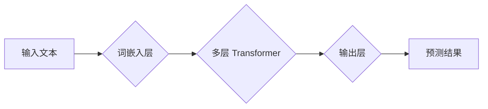

> Large Language Model (LLM), AI 开发, 自然语言处理 (NLP), 代码生成, 效率提升, 创新驱动

## 1. 背景介绍

人工智能 (AI) 正以惊人的速度发展，其影响力正在渗透到我们生活的方方面面。其中，大型语言模型 (LLM) 作为 AI 的重要组成部分，凭借其强大的文本理解和生成能力，正在改变着软件开发的格局。

传统的软件开发流程通常需要程序员花费大量时间和精力进行代码编写、测试和调试。而 LLM 则可以帮助开发者简化这些流程，提高开发效率，并激发新的创新。

## 2. 核心概念与联系

LLM 是一种基于深度学习的 AI 模型，其核心是训练一个庞大的神经网络，使其能够理解和生成人类语言。

LLM 的训练数据通常包含海量的文本信息，例如书籍、文章、代码等。通过学习这些数据，LLM 可以掌握语言的语法、语义和上下文关系，从而实现各种自然语言处理 (NLP) 任务，例如文本分类、机器翻译、问答系统等。

**LLM 与软件开发的联系:**

LLM 可以通过以下方式简化 AI 开发过程：

* **代码生成:** LLM 可以根据自然语言描述生成相应的代码，例如根据用户输入 "创建一个简单的登录页面"，LLM 可以自动生成 HTML、CSS 和 JavaScript 代码。
* **代码补全:** LLM 可以根据上下文预测程序员接下来要输入的代码，从而提高代码编写效率。
* **代码理解:** LLM 可以理解程序员的代码注释和文档，从而帮助开发者更好地理解代码的功能和逻辑。
* **代码测试:** LLM 可以生成测试用例，并自动执行测试，从而提高代码质量。

**LLM 架构流程图:**



## 3. 核心算法原理 & 具体操作步骤

### 3.1  算法原理概述

LLM 的核心算法是 Transformer，它是一种基于注意力机制的深度神经网络架构。

Transformer 的注意力机制能够捕捉文本序列中不同词之间的关系，从而更好地理解上下文信息。

### 3.2  算法步骤详解

1. **词嵌入:** 将输入文本中的每个词转换为一个向量表示，称为词嵌入。
2. **多层 Transformer:** 将词嵌入输入到多层 Transformer 网络中，每层 Transformer 包含多头注意力机制和前馈神经网络。
3. **输出层:** 将 Transformer 网络的输出经过一个输出层，生成预测结果，例如下一个词的概率分布。

### 3.3  算法优缺点

**优点:**

* 能够捕捉长距离依赖关系
* 并行计算能力强
* 训练效果优异

**缺点:**

* 计算资源消耗大
* 训练时间长
* 参数量大

### 3.4  算法应用领域

* 自然语言处理 (NLP)
* 机器翻译
* 文本摘要
* 问答系统
* 代码生成

## 4. 数学模型和公式 & 详细讲解 & 举例说明

### 4.1  数学模型构建

LLM 的数学模型通常基于概率论和统计学，其目标是学习一个概率分布，该分布能够生成符合语义和语法规则的文本。

### 4.2  公式推导过程

Transformer 网络的核心是注意力机制，其计算公式如下：

$$
Attention(Q, K, V) = softmax(\frac{QK^T}{\sqrt{d_k}})V
$$

其中：

* $Q$：查询矩阵
* $K$：键矩阵
* $V$：值矩阵
* $d_k$：键向量的维度
* $softmax$：softmax 函数

### 4.3  案例分析与讲解

例如，在机器翻译任务中，LLM 可以将源语言文本的词嵌入作为查询矩阵，目标语言文本的词嵌入作为键矩阵和值矩阵，通过注意力机制计算每个源语言词与目标语言词之间的相关性，从而生成翻译结果。

## 5. 项目实践：代码实例和详细解释说明

### 5.1  开发环境搭建

LLM 的开发环境通常需要安装 Python、深度学习框架 (例如 TensorFlow 或 PyTorch) 和必要的库。

### 5.2  源代码详细实现

以下是一个使用 Hugging Face Transformers 库生成代码的简单示例：

```python
from transformers import pipeline

generator = pipeline("text-generation", model="gpt2")

input_text = "创建一个简单的登录页面"

output_text = generator(input_text, max_length=100, num_return_sequences=1)[0]['generated_text']

print(output_text)
```

### 5.3  代码解读与分析

这段代码首先使用 Hugging Face Transformers 库加载一个预训练的 GPT-2 模型，然后创建一个文本生成器。

接着，将用户输入的文本作为输入，并设置最大生成长度和返回序列数量。

最后，调用生成器生成代码，并打印输出结果。

### 5.4  运行结果展示

运行这段代码后，将输出一个简单的 HTML 代码，用于创建一个登录页面。

## 6. 实际应用场景

LLM 在软件开发领域具有广泛的应用场景，例如：

* **代码生成:** 自动生成代码模板、函数定义、类结构等。
* **代码补全:** 根据上下文预测程序员接下来要输入的代码，提高代码编写效率。
* **代码理解:** 帮助开发者理解代码的功能和逻辑，并进行代码维护和调试。
* **代码测试:** 自动生成测试用例，并自动执行测试，提高代码质量。
* **文档生成:** 自动生成代码文档、API 文档等。

### 6.4  未来应用展望

随着 LLM 技术的不断发展，其在软件开发领域的应用场景将更加广泛，例如：

* **智能代码助手:** LLM 可以成为程序员的智能助手，提供代码建议、错误提示、代码优化等功能。
* **低代码开发平台:** LLM 可以帮助构建低代码开发平台，让非程序员也能轻松开发应用程序。
* **代码翻译:** LLM 可以实现代码翻译，帮助开发者跨语言开发。

## 7. 工具和资源推荐

### 7.1  学习资源推荐

* **Hugging Face Transformers:** https://huggingface.co/docs/transformers/index
* **OpenAI API:** https://beta.openai.com/docs/api-reference/introduction
* **DeepLearning.AI:** https://www.deeplearning.ai/

### 7.2  开发工具推荐

* **VS Code:** https://code.visualstudio.com/
* **PyCharm:** https://www.jetbrains.com/pycharm/
* **Jupyter Notebook:** https://jupyter.org/

### 7.3  相关论文推荐

* **Attention Is All You Need:** https://arxiv.org/abs/1706.03762
* **BERT: Pre-training of Deep Bidirectional Transformers for Language Understanding:** https://arxiv.org/abs/1810.04805

## 8. 总结：未来发展趋势与挑战

### 8.1  研究成果总结

LLM 技术取得了显著的进展，在自然语言处理和代码生成等领域展现出强大的潜力。

### 8.2  未来发展趋势

LLM 的未来发展趋势包括：

* **模型规模和性能的提升:** 随着计算资源的不断发展，LLM 的模型规模和性能将进一步提升。
* **多模态理解和生成:** LLM 将能够理解和生成多种模态信息，例如文本、图像、音频等。
* **个性化定制:** LLM 将能够根据用户的需求进行个性化定制，提供更加精准和有效的服务。

### 8.3  面临的挑战

LLM 发展也面临一些挑战，例如：

* **数据安全和隐私:** LLM 的训练数据通常包含大量敏感信息，需要确保数据安全和隐私。
* **模型可解释性和信任度:** LLM 的决策过程通常是复杂的，难以解释，需要提高模型的可解释性和信任度。
* **伦理和社会影响:** LLM 的应用可能带来一些伦理和社会问题，需要进行深入的思考和讨论。

### 8.4  研究展望

未来，LLM 研究将继续深入探索模型架构、训练方法、应用场景等方面，推动 AI 技术的创新发展，并为人类社会带来更多福祉。

## 9. 附录：常见问题与解答

**Q1: LLM 的训练需要多少数据？**

**A1:** LLM 的训练数据量通常非常庞大，可能包含数十亿甚至数千亿个词。

**Q2: LLM 的训练时间有多长？**

**A2:** LLM 的训练时间取决于模型规模、数据量和计算资源等因素，可能需要数周甚至数月。

**Q3: 如何评估 LLM 的性能？**

**A3:** LLM 的性能通常通过各种指标进行评估，例如准确率、困惑度、BLEU 分数等。

**Q4: LLM 是否可以理解人类的情感？**

**A4:** 目前，LLM 只能识别文本中的情感词语，但无法真正理解人类的情感。

**Q5: LLM 是否会取代程序员？**

**A5:** LLM 可以帮助程序员提高开发效率，但不会完全取代程序员。程序员仍然需要负责代码设计、逻辑推理和问题解决等高层次的工作。


作者：禅与计算机程序设计艺术 / Zen and the Art of Computer Programming 
<end_of_turn>