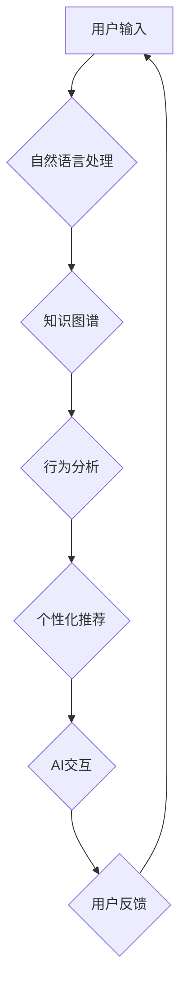

> 数字化自我实现助手，AI教练，个人成长，机器学习，自然语言处理，深度学习，行为分析，目标设定，反馈机制

## 1. 背景介绍

在当今信息爆炸的时代，个人成长和自我提升已成为人们普遍关注的议题。传统的人格成长方式往往依赖于书籍、课程、咨询等外部资源，而缺乏个性化和实时反馈。随着人工智能技术的飞速发展，AI辅助的个人成长教练应运而生，为用户提供更加智能、高效、个性化的成长体验。

数字化自我实现助手，即AI辅助的个人成长教练，旨在通过人工智能技术，帮助用户更好地了解自身，设定目标，制定计划，并提供持续的指导和支持，从而实现个人成长和自我实现。

## 2. 核心概念与联系

**2.1 核心概念**

* **数字化自我:** 通过数据收集、分析和建模，构建用户个性化的数字模型，包括认知、情感、行为等方面。
* **AI教练:** 基于机器学习和自然语言处理等人工智能技术，模拟人类教练的角色，为用户提供个性化的指导和建议。
* **个人成长:** 指个人在认知、情感、行为等方面不断提升和完善的过程，最终实现自我价值和目标。

**2.2 架构设计**



**2.3 核心联系**

数字化自我实现助手通过以下核心环节实现其功能：

1. **用户输入:** 用户通过文本、语音等方式与AI教练进行交互。
2. **自然语言处理:** 将用户输入转换为机器可理解的格式。
3. **知识图谱:** 基于用户输入和历史数据，构建用户个性化的知识图谱，包括用户兴趣、目标、能力等信息。
4. **行为分析:** 分析用户行为数据，识别用户习惯、偏好和潜在问题。
5. **个性化推荐:** 根据用户数据和分析结果，为用户提供个性化的成长建议、学习资源和行动计划。
6. **AI交互:** AI教练与用户进行自然、流畅的对话，提供指导、支持和鼓励。
7. **用户反馈:** 收集用户反馈，不断优化AI模型和服务体验。

## 3. 核心算法原理 & 具体操作步骤

**3.1 算法原理概述**

数字化自我实现助手的核心算法主要包括：

* **自然语言处理 (NLP):** 用于理解和处理用户自然语言输入，包括文本分类、情感分析、意图识别等。
* **机器学习 (ML):** 用于从用户数据中学习模式和规律，构建个性化模型，并进行预测和推荐。
* **深度学习 (DL):** 用于处理复杂的数据模式，例如用户行为分析和个性化内容推荐。

**3.2 算法步骤详解**

1. **数据收集:** 收集用户行为数据、兴趣偏好、学习记录等信息。
2. **数据预处理:** 清洗、转换和格式化数据，使其适合算法训练。
3. **模型训练:** 使用机器学习算法训练模型，例如分类模型、回归模型、推荐模型等。
4. **模型评估:** 使用测试数据评估模型性能，并进行调优。
5. **模型部署:** 将训练好的模型部署到线上环境，为用户提供服务。

**3.3 算法优缺点**

* **优点:**

    * **个性化:** 根据用户数据提供个性化的成长建议和支持。
    * **智能化:** 利用人工智能技术，自动分析用户数据和行为，提供更精准的指导。
    * **高效性:** 24/7 提供服务，用户随时随地可以获得帮助。

* **缺点:**

    * **数据依赖:** 算法性能依赖于数据质量和数量。
    * **伦理问题:** 数据隐私保护、算法偏见等伦理问题需要认真考虑。
    * **技术复杂性:** 开发和维护AI系统需要专业的技术团队。

**3.4 算法应用领域**

* **个人成长:** 提供个性化的学习计划、目标设定、习惯养成等指导。
* **职业发展:** 帮助用户分析职业兴趣、技能匹配、职业规划等。
* **心理健康:** 提供情绪管理、压力缓解、心理咨询等支持。
* **教育培训:** 个性化学习路径、知识点推荐、学习效果评估等。

## 4. 数学模型和公式 & 详细讲解 & 举例说明

**4.1 数学模型构建**

数字化自我实现助手可以构建以下数学模型：

* **用户行为模型:** 使用马尔科夫链或其他时间序列模型，预测用户的未来行为。
* **个性化推荐模型:** 使用协同过滤、内容过滤或深度学习模型，推荐个性化的学习资源和成长建议。
* **目标设定模型:** 使用目标分解、优先级排序等算法，帮助用户设定可实现的目标。

**4.2 公式推导过程**

例如，使用协同过滤算法进行个性化推荐，可以推导出以下公式：

$$
r_{ui} = \frac{\sum_{j \in N(u)} \frac{s_{uj} \cdot s_{uj}}{d_{uj}}}{\sum_{j \in N(u)} \frac{1}{d_{uj}}}
$$

其中：

* $r_{ui}$: 用户 $u$ 对物品 $i$ 的评分预测值。
* $s_{uj}$: 用户 $u$ 对物品 $j$ 的评分。
* $N(u)$: 用户 $u$ 评分过的物品集合。
* $d_{uj}$: 用户 $u$ 和物品 $j$ 之间的相似度。

**4.3 案例分析与讲解**

假设用户 Alice 评分了以下书籍：

* 书籍 A: 5 分
* 书籍 B: 3 分
* 书籍 C: 4 分

系统根据 Alice 的评分历史和其他用户的评分数据，计算出 Alice 对书籍 D 的评分预测值。

## 5. 项目实践：代码实例和详细解释说明

**5.1 开发环境搭建**

* 操作系统: Ubuntu 20.04
* Python 版本: 3.8
* 虚拟环境: venv
* 依赖库: numpy, pandas, scikit-learn, tensorflow, nltk

**5.2 源代码详细实现**

```python
# 导入必要的库
import numpy as np
from sklearn.metrics.pairwise import cosine_similarity

# 定义用户评分数据
user_ratings = {
    'Alice': {'A': 5, 'B': 3, 'C': 4},
    'Bob': {'A': 4, 'B': 5, 'C': 3},
    'Charlie': {'A': 3, 'B': 4, 'C': 5}
}

# 计算用户-物品评分矩阵
ratings_matrix = np.array([[user_ratings[user].get(item, 0) for item in ['A', 'B', 'C']] for user in user_ratings])

# 计算用户-用户相似度矩阵
user_similarity = cosine_similarity(ratings_matrix)

# 预测用户 Alice 对书籍 D 的评分
# 假设书籍 D 的评分为 0
ratings_matrix = np.insert(ratings_matrix, ratings_matrix.shape[1], 0, axis=1)
predicted_rating = np.dot(user_similarity[0], ratings_matrix[:, -1]) / np.sum(user_similarity[0])
print(f"Predicted rating for Alice on book D: {predicted_rating}")
```

**5.3 代码解读与分析**

* 代码首先导入必要的库，并定义用户评分数据。
* 然后，计算用户-物品评分矩阵和用户-用户相似度矩阵。
* 最后，使用用户相似度和评分矩阵，预测用户 Alice 对书籍 D 的评分。

**5.4 运行结果展示**

运行代码后，会输出 Alice 对书籍 D 的评分预测值。

## 6. 实际应用场景

**6.1 个人成长平台**

* 提供个性化的学习计划和目标设定指导。
* 分析用户学习习惯和行为，提供针对性的建议和反馈。
* 建立用户社区，促进用户之间的交流和学习。

**6.2 职业发展平台**

* 分析用户技能和兴趣，推荐合适的职业方向和发展路径。
* 提供职业技能培训和学习资源。
* 连接用户和潜在雇主，促进职业发展。

**6.3 心理健康平台**

* 提供情绪管理、压力缓解和心理咨询等服务。
* 分析用户情绪变化，识别潜在的心理问题。
* 建立用户支持网络，提供情感支持和帮助。

**6.4 未来应用展望**

* **更智能的AI教练:** 利用更先进的AI技术，例如生成式AI，提供更自然、更人性化的交互体验。
* **更个性化的服务:** 基于更丰富的用户数据，提供更精准、更个性化的成长建议和服务。
* **跨平台融合:** 将AI教练功能整合到更多平台和应用中，例如社交媒体、办公软件等。

## 7. 工具和资源推荐

**7.1 学习资源推荐**

* **书籍:**
    * 《深度学习》
    * 《机器学习实战》
    * 《自然语言处理入门》
* **在线课程:**
    * Coursera: 深度学习、机器学习
    * edX: 自然语言处理、数据科学
* **开源项目:**
    * TensorFlow
    * PyTorch
    * NLTK

**7.2 开发工具推荐**

* **编程语言:** Python
* **机器学习库:** scikit-learn, TensorFlow, PyTorch
* **自然语言处理库:** NLTK, spaCy
* **数据可视化工具:** Matplotlib, Seaborn

**7.3 相关论文推荐**

* **BERT: Pre-training of Deep Bidirectional Transformers for Language Understanding**
* **Attention Is All You Need**
* **Recurrent Neural Networks for Sequence Learning**

## 8. 总结：未来发展趋势与挑战

**8.1 研究成果总结**

数字化自我实现助手已取得了显著的进展，在个人成长、职业发展、心理健康等领域展现出巨大的潜力。

**8.2 未来发展趋势**

* **更智能的AI教练:** 利用更先进的AI技术，例如生成式AI，提供更自然、更人性化的交互体验。
* **更个性化的服务:** 基于更丰富的用户数据，提供更精准、更个性化的成长建议和服务。
* **跨平台融合:** 将AI教练功能整合到更多平台和应用中，例如社交媒体、办公软件等。

**8.3 面临的挑战**

* **数据隐私保护:** 确保用户数据安全和隐私，避免数据泄露和滥用。
* **算法偏见:** 避免算法产生偏见，确保公平公正的推荐和服务。
* **技术复杂性:** 开发和维护AI系统需要专业的技术团队和资源。

**8.4 研究展望**

未来，数字化自我实现助手将朝着更智能、更个性化、更安全的方向发展，为用户提供更全面的成长支持和服务。


## 9. 附录：常见问题与解答

**9.1 如何保证数据隐私安全？**

我们采用多种技术手段保障用户数据安全，包括数据加密、匿名化处理、访问控制等。

**9.2 AI教练会取代人类教练吗？**

AI教练可以作为人类教练的辅助工具，提供更智能、更高效的成长支持，但无法完全取代人类教练的陪伴和指导。

**9.3 如何评价AI教练的性能？**

AI教练的性能可以通过用户反馈、行为分析、目标达成率等指标进行评价。

**9.4 如何使用数字化自我实现助手？**

您可以通过我们的网站或移动应用注册账号，并开始使用AI教练提供的个性化成长服务。


作者：禅与计算机程序设计艺术 / Zen and the Art of Computer Programming 
<end_of_turn>