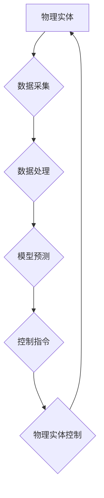

> 数字孪生、物理实体、自动化、机器学习、深度学习、人工智能、物联网

## 1. 背景介绍

随着人工智能、物联网、云计算等技术的快速发展，数字与物理世界正在逐渐融合，形成一个全新的智能化生态系统。在这个生态系统中，数字实体与物理实体相互映射，相互影响，共同推动社会经济的进步。

数字实体是指基于物理实体的虚拟模型，它可以实时反映物理实体的状态、行为和运行情况。通过对数字实体的模拟和分析，我们可以更好地理解物理实体的特性，预测其未来行为，并进行优化控制。

物理实体是指真实存在的物质对象，它可以是任何物体，例如机器设备、车辆、建筑物、甚至人体。

数字实体与物理实体的自动化方向是指利用人工智能、机器学习等技术，实现数字实体与物理实体之间的自动交互和控制，从而实现物理实体的智能化管理和优化。

## 2. 核心概念与联系

**2.1 数字孪生**

数字孪生是数字实体的一种特殊形式，它是一个与物理实体实时同步的虚拟模型，可以反映物理实体的实时状态、行为和运行情况。数字孪生可以用于模拟物理实体的运行过程，预测其未来行为，并进行优化控制。

**2.2 物理实体自动化**

物理实体自动化是指利用人工智能、机器学习等技术，实现物理实体的自动控制和管理。例如，可以利用机器学习算法对物理实体的运行数据进行分析，识别异常情况，并自动采取措施进行纠正。

**2.3 自动化流程图**



## 3. 核心算法原理 & 具体操作步骤

**3.1 算法原理概述**

数字实体与物理实体的自动化方向主要依赖于以下核心算法：

* **机器学习算法:** 用于从物理实体的运行数据中学习，识别模式，并进行预测。常见的机器学习算法包括监督学习、无监督学习和强化学习。
* **深度学习算法:** 用于处理复杂的数据，例如图像、语音和文本。深度学习算法可以学习到更深层次的特征，从而提高预测精度。
* **控制算法:** 用于根据模型预测的结果，生成控制指令，并控制物理实体的运行。常见的控制算法包括PID控制、模糊控制和模型预测控制。

**3.2 算法步骤详解**

1. **数据采集:** 从物理实体收集运行数据，例如温度、压力、流量等。
2. **数据预处理:** 对采集到的数据进行清洗、转换和特征提取。
3. **模型训练:** 利用机器学习或深度学习算法，对预处理后的数据进行训练，建立预测模型。
4. **模型预测:** 将新的运行数据输入到训练好的模型中，进行预测。
5. **控制指令生成:** 根据模型预测的结果，生成控制指令，并发送到物理实体。
6. **物理实体控制:** 物理实体根据控制指令进行调整，实现自动化控制。

**3.3 算法优缺点**

* **优点:**
    * 自动化程度高，可以减少人工干预。
    * 效率高，可以提高生产效率。
    * 精度高，可以实现更精准的控制。
* **缺点:**
    * 需要大量的运行数据进行训练。
    * 模型训练需要一定的时间和计算资源。
    * 模型的预测结果可能存在误差。

**3.4 算法应用领域**

数字实体与物理实体的自动化方向在各个领域都有广泛的应用，例如：

* **制造业:** 自动化生产线，实现智能制造。
* **能源行业:** 智能电网，优化能源分配。
* **交通运输业:** 自动驾驶汽车，提高交通效率。
* **医疗保健业:** 智能医疗设备，辅助医生诊断和治疗。

## 4. 数学模型和公式 & 详细讲解 & 举例说明

**4.1 数学模型构建**

我们可以用数学模型来描述数字实体与物理实体之间的关系。例如，我们可以用一个微分方程来描述物理实体的运动状态，用一个神经网络来描述数字实体对物理实体的控制策略。

**4.2 公式推导过程**

假设我们有一个物理实体的运动状态可以用以下微分方程来描述：

$$
\frac{d^2x}{dt^2} + c\frac{dx}{dt} + kx = u(t)
$$

其中：

* $x$ 是物理实体的位置
* $t$ 是时间
* $c$ 是阻尼系数
* $k$ 是弹簧系数
* $u(t)$ 是控制输入

我们可以用一个神经网络来学习控制输入 $u(t)$，使得物理实体的位置 $x$ 达到预定的目标值。

**4.3 案例分析与讲解**

例如，我们可以用一个神经网络来控制一个无人驾驶汽车的转向角度。

神经网络的输入是汽车周围的环境信息，例如道路状况、其他车辆的位置等。神经网络的输出是汽车的转向角度。

通过训练神经网络，我们可以让汽车能够自动避开障碍物，并安全地行驶到目的地。

## 5. 项目实践：代码实例和详细解释说明

**5.1 开发环境搭建**

* 操作系统：Ubuntu 20.04
* Python 版本：3.8
* 必要的库：TensorFlow、PyTorch、NumPy、Pandas

**5.2 源代码详细实现**

```python
import tensorflow as tf

# 定义神经网络模型
model = tf.keras.models.Sequential([
    tf.keras.layers.Dense(128, activation='relu', input_shape=(10,)),
    tf.keras.layers.Dense(64, activation='relu'),
    tf.keras.layers.Dense(1)
])

# 编译模型
model.compile(optimizer='adam', loss='mse')

# 训练模型
model.fit(X_train, y_train, epochs=100)

# 预测
predictions = model.predict(X_test)
```

**5.3 代码解读与分析**

这段代码定义了一个简单的深度学习模型，用于预测物理实体的运行状态。

* `tf.keras.models.Sequential` 创建了一个顺序模型，其中层级依次连接。
* `tf.keras.layers.Dense` 创建了一个全连接层，每个神经元都连接到上一层的每个神经元。
* `activation='relu'` 使用ReLU激活函数，可以提高模型的表达能力。
* `optimizer='adam'` 使用Adam优化器，可以加速模型训练。
* `loss='mse'` 使用均方误差作为损失函数，可以衡量模型预测结果与真实值的差异。
* `model.fit()` 使用训练数据训练模型。
* `model.predict()` 使用测试数据预测模型输出。

**5.4 运行结果展示**

训练完成后，我们可以使用测试数据来评估模型的性能。

例如，我们可以计算模型预测结果与真实值的均方误差，来衡量模型的精度。

## 6. 实际应用场景

**6.1 智能制造**

数字孪生技术可以用于模拟制造过程，优化生产流程，提高生产效率。例如，可以利用数字孪生模型来预测机器设备的故障，并提前进行维护，避免生产停机。

**6.2 智能能源**

数字孪生技术可以用于模拟能源系统，优化能源分配，提高能源利用效率。例如，可以利用数字孪生模型来预测电力需求，并根据预测结果调整发电计划，避免电力短缺。

**6.3 智能交通**

数字孪生技术可以用于模拟交通系统，优化交通流量，提高交通效率。例如，可以利用数字孪生模型来预测交通拥堵情况，并根据预测结果调整交通信号灯的控制策略，缓解交通拥堵。

**6.4 未来应用展望**

数字实体与物理实体的自动化方向在未来将会有更广泛的应用，例如：

* **个性化医疗:** 利用数字孪生技术，为每个患者创建个性化的医疗模型，提供更精准的诊断和治疗方案。
* **智慧城市:** 利用数字孪生技术，模拟城市运行状态，优化城市规划和管理，提高城市居民的生活质量。
* **虚拟现实和增强现实:** 利用数字实体与物理实体的交互，创造更沉浸式的虚拟现实和增强现实体验。

## 7. 工具和资源推荐

**7.1 学习资源推荐**

* **书籍:**
    * 《深度学习》
    * 《机器学习》
    * 《人工智能：现代方法》
* **在线课程:**
    * Coursera
    * edX
    * Udacity

**7.2 开发工具推荐**

* **TensorFlow:** 开源深度学习框架
* **PyTorch:** 开源深度学习框架
* **Keras:** 高级深度学习API

**7.3 相关论文推荐**

* **数字孪生:**
    * "Digital Twin: Definition, Requirements, and Applications"
    * "Digital Twin: A Comprehensive Review"
* **物理实体自动化:**
    * "Reinforcement Learning for Robotics"
    * "Deep Learning for Control"

## 8. 总结：未来发展趋势与挑战

**8.1 研究成果总结**

数字实体与物理实体的自动化方向取得了显著的进展，例如：

* 数字孪生技术已经应用于多个领域，例如制造业、能源行业和交通运输业。
* 机器学习和深度学习算法在物理实体控制方面取得了突破性进展。

**8.2 未来发展趋势**

* **更智能的数字实体:** 数字实体将更加智能，能够自主学习和决策。
* **更广泛的应用场景:** 数字实体与物理实体的自动化技术将应用于更多领域，例如医疗保健、教育和娱乐。
* **更强大的计算能力:** 随着计算能力的提升，数字实体将能够处理更加复杂的数据，并进行更加精准的预测和控制。

**8.3 面临的挑战**

* **数据安全和隐私保护:** 数字实体需要收集和处理大量的运行数据，因此数据安全和隐私保护是一个重要的挑战。
* **模型可解释性和信任度:** 深度学习模型的决策过程往往难以解释，这可能会导致模型的可解释性和信任度问题。
* **技术标准和互操作性:** 数字实体与物理实体的自动化技术涉及多个领域，因此需要建立统一的技术标准和互操作性机制。

**8.4 研究展望**

未来，我们将继续致力于数字实体与物理实体的自动化方向的研究，探索更智能、更安全、更可靠的自动化解决方案。


## 9. 附录：常见问题与解答

**9.1 如何构建数字孪生模型？**

构建数字孪生模型需要以下步骤：

1. 确定物理实体的特征和运行数据。
2. 选择合适的建模方法，例如物理模型、数据驱动模型或混合模型。
3. 收集物理实体的运行数据，并进行预处理。
4. 利用收集到的数据训练数字孪生模型。
5. 验证和评估数字孪生模型的精度和可靠性。

**9.2 数字孪生模型有什么应用场景？**

数字孪生模型可以应用于多个领域，例如：

* **制造业:** 模拟生产过程，优化生产流程，预测机器设备故障。
* **能源行业:** 模拟能源系统，优化能源分配，预测电力需求。
* **交通运输业:** 模拟交通系统，优化交通流量，预测交通拥堵情况。

**9.3 数字实体与物理实体的自动化技术有哪些挑战？**

数字实体与物理实体的自动化技术面临以下挑战：

* 数据安全和隐私保护
* 模型可解释性和信任度
* 技术标准和互操作性


作者：禅与计算机程序设计艺术 / Zen and the Art of Computer Programming 
<end_of_turn>