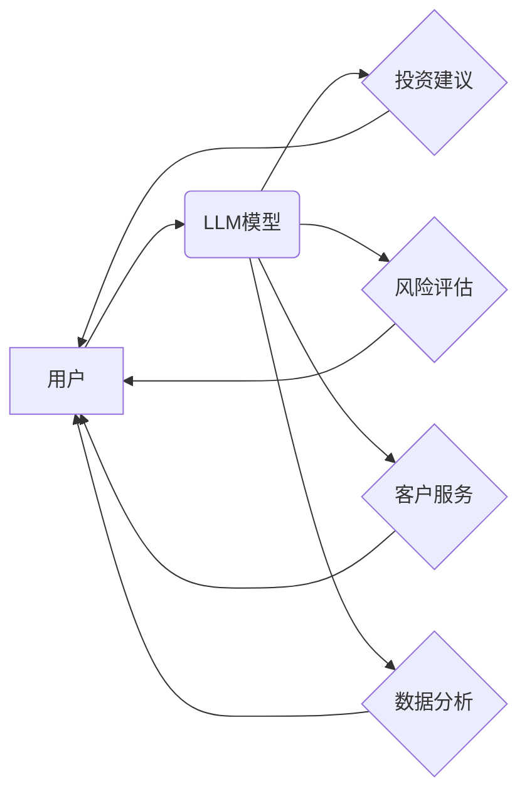

> Large Language Model (LLM), 投资顾问, 财富管理, 自然语言处理 (NLP), 机器学习 (ML), 风险管理

## 1. 背景介绍

随着人工智能技术的飞速发展，大型语言模型 (LLM) 在各个领域展现出强大的应用潜力。其中，在金融领域，LLM 正在逐渐改变传统的财富管理模式，为投资者提供更智能、更个性化的投资建议。

传统的投资顾问通常依赖于人类经验和专业知识，但受限于时间、精力和个人偏见等因素，难以满足所有投资者的需求。而 LLM 作为一种强大的数据处理和分析工具，能够学习海量金融数据，识别复杂的投资模式，并根据用户的风险偏好、投资目标等信息，提供个性化的投资建议。

## 2. 核心概念与联系

### 2.1  LLM 简介

大型语言模型 (LLM) 是一种基于深度学习的强大人工智能模型，能够理解和生成人类语言。它们通过训练海量文本数据，学习语言的语法、语义和上下文关系，从而具备强大的文本处理能力，例如文本分类、文本摘要、机器翻译等。

### 2.2  财富管理概述

财富管理是指为个人或机构提供全面的理财服务，包括资产规划、投资管理、风险管理、税务规划等。其目标是帮助客户实现财务目标，例如退休规划、子女教育、购房等。

### 2.3  LLM在财富管理中的应用

LLM 在财富管理中的应用主要体现在以下几个方面：

* **智能投资建议:** LLM 可以根据用户的风险偏好、投资目标、时间期限等信息，分析市场数据，并提供个性化的投资建议。
* **风险管理:** LLM 可以识别潜在的投资风险，并帮助投资者制定风险管理策略。
* **客户服务:** LLM 可以作为智能客服，回答客户的理财咨询，提供24小时不间断服务。
* **数据分析:** LLM 可以分析海量金融数据，发现投资趋势和机会。

**LLM在财富管理中的应用架构**



## 3. 核心算法原理 & 具体操作步骤

### 3.1  算法原理概述

LLM 在财富管理中的应用主要基于以下核心算法：

* **自然语言处理 (NLP):** 用于理解和处理用户的自然语言输入，例如投资目标、风险偏好等信息。
* **机器学习 (ML):** 用于训练 LLM 模型，使其能够学习金融数据，识别投资模式，并提供预测。
* **强化学习 (RL):** 用于优化投资策略，使其能够在不断变化的市场环境中获得最大收益。

### 3.2  算法步骤详解

1. **数据收集和预处理:** 收集海量金融数据，包括股票价格、债券收益率、经济指标等，并进行清洗、转换和格式化。
2. **模型训练:** 使用 NLP 和 ML 算法训练 LLM 模型，使其能够理解金融数据，识别投资模式，并预测市场趋势。
3. **用户输入:** 用户通过自然语言输入其投资目标、风险偏好等信息。
4. **模型分析:** LLM 模型分析用户的输入信息和市场数据，并提供个性化的投资建议。
5. **策略优化:** 使用 RL 算法优化投资策略，使其能够在不断变化的市场环境中获得最大收益。

### 3.3  算法优缺点

**优点:**

* **个性化服务:** LLM 可以根据用户的具体情况提供个性化的投资建议。
* **效率提升:** LLM 可以自动分析市场数据，节省人工成本。
* **风险控制:** LLM 可以识别潜在的投资风险，帮助投资者制定风险管理策略。

**缺点:**

* **数据依赖:** LLM 的性能取决于训练数据的质量和数量。
* **黑盒问题:** LLM 的决策过程难以解释，难以获得用户的信任。
* **伦理风险:** LLM 可能存在偏见或歧视，需要进行伦理审查。

### 3.4  算法应用领域

LLM 在财富管理领域的应用前景广阔，可以应用于以下领域:

* **个人投资顾问:** 为个人投资者提供个性化的投资建议。
* **机构资产管理:** 为机构投资者提供大规模资产管理服务。
* **风险管理:** 为金融机构提供风险评估和控制服务。
* **金融科技:** 为金融科技公司提供智能投资工具和服务。

## 4. 数学模型和公式 & 详细讲解 & 举例说明

### 4.1  数学模型构建

LLM 的训练过程本质上是一个优化问题，目标是找到一个模型参数，使得模型在训练数据上的预测性能达到最大。常用的数学模型包括：

* **线性回归:** 用于预测连续变量，例如股票价格。
* **逻辑回归:** 用于预测分类变量，例如投资风险等级。
* **神经网络:** 用于处理复杂数据，例如文本和图像。

### 4.2  公式推导过程

例如，线性回归模型的预测公式如下：

$$
y = \beta_0 + \beta_1 x_1 + \beta_2 x_2 + ... + \beta_n x_n + \epsilon
$$

其中：

* $y$ 是预测变量
* $x_1, x_2, ..., x_n$ 是输入变量
* $\beta_0, \beta_1, ..., \beta_n$ 是模型参数
* $\epsilon$ 是误差项

模型参数可以通过最小二乘法进行估计，目标是找到一组参数，使得预测值与实际值之间的误差最小。

### 4.3  案例分析与讲解

假设我们想要预测股票价格，可以使用线性回归模型。输入变量可以包括股票的历史价格、成交量、行业指数等，而预测变量就是股票未来的价格。通过训练模型，我们可以得到一组参数，用于预测股票价格。

## 5. 项目实践：代码实例和详细解释说明

### 5.1  开发环境搭建

* Python 3.x
* TensorFlow 或 PyTorch
* NumPy、Pandas 等数据处理库

### 5.2  源代码详细实现

```python
import tensorflow as tf

# 定义模型结构
model = tf.keras.Sequential([
    tf.keras.layers.Dense(64, activation='relu', input_shape=(10,)),
    tf.keras.layers.Dense(32, activation='relu'),
    tf.keras.layers.Dense(1)
])

# 编译模型
model.compile(optimizer='adam', loss='mse')

# 训练模型
model.fit(X_train, y_train, epochs=10)

# 预测股票价格
predictions = model.predict(X_test)
```

### 5.3  代码解读与分析

* 首先，我们定义了一个简单的线性回归模型，包含三个全连接层。
* 然后，我们使用 Adam 优化器和均方误差损失函数对模型进行编译。
* 接着，我们使用训练数据对模型进行训练，训练 epochs 为 10。
* 最后，我们使用测试数据对模型进行预测，并输出预测结果。

### 5.4  运行结果展示

训练完成后，我们可以评估模型的性能，例如使用均方根误差 (RMSE) 来衡量预测结果与实际值的差异。

## 6. 实际应用场景

LLM 在财富管理领域的应用场景非常广泛，例如：

* **智能投资机器人:** 为个人投资者提供个性化的投资建议，帮助他们制定投资计划。
* **风险管理平台:** 为金融机构提供风险评估和控制服务，帮助他们识别和规避潜在的风险。
* **金融数据分析工具:** 为金融分析师提供数据分析工具，帮助他们发现投资机会和趋势。

### 6.4  未来应用展望

随着 LLM 技术的不断发展，其在财富管理领域的应用将更加广泛和深入，例如：

* **更个性化的投资建议:** LLM 将能够更加深入地理解用户的需求和偏好，提供更加个性化的投资建议。
* **更智能的风险管理:** LLM 将能够识别更加复杂的风险模式，帮助投资者制定更加有效的风险管理策略。
* **更全面的财富管理服务:** LLM 将能够提供更加全面的财富管理服务，例如税务规划、遗产规划等。

## 7. 工具和资源推荐

### 7.1  学习资源推荐

* **书籍:**
    * 《深度学习》
    * 《自然语言处理》
    * 《机器学习实战》
* **在线课程:**
    * Coursera: 深度学习
    * edX: 自然语言处理
    * Udacity: 机器学习工程师

### 7.2  开发工具推荐

* **Python:** 
* **TensorFlow:** 
* **PyTorch:** 
* **NumPy:** 
* **Pandas:**

### 7.3  相关论文推荐

* **BERT: Pre-training of Deep Bidirectional Transformers for Language Understanding**
* **GPT-3: Language Models are Few-Shot Learners**
* **AlphaFold: A Highly Accurate Protein Structure Prediction System**

## 8. 总结：未来发展趋势与挑战

### 8.1  研究成果总结

LLM 在财富管理领域的应用取得了显著的成果，例如能够提供个性化的投资建议、识别潜在的风险、分析金融数据等。

### 8.2  未来发展趋势

LLM 在财富管理领域的应用将朝着以下方向发展：

* **更强大的模型:** 随着模型规模和训练数据的增加，LLM 的预测能力将进一步提升。
* **更个性化的服务:** LLM 将能够更加深入地理解用户的需求和偏好，提供更加个性化的服务。
* **更全面的应用场景:** LLM 将能够应用于更多的财富管理场景，例如税务规划、遗产规划等。

### 8.3  面临的挑战

LLM 在财富管理领域的应用也面临一些挑战：

* **数据安全和隐私:** LLM 需要处理大量用户数据，需要确保数据的安全和隐私。
* **算法解释性和可信度:** LLM 的决策过程难以解释，需要提高算法的透明度和可信度。
* **伦理风险:** LLM 可能存在偏见或歧视，需要进行伦理审查。

### 8.4  研究展望

未来，我们需要继续研究如何提高 LLM 的准确性、安全性、可解释性和伦理性，使其能够更好地服务于财富管理领域。

## 9. 附录：常见问题与解答

* **LLM 是否能够取代人类投资顾问？**

LLM 可以提供智能的投资建议，但目前还无法完全取代人类投资顾问。人类投资顾问拥有丰富的经验和专业知识，能够根据用户的具体情况提供更加全面的服务。

* **LLM 的投资建议是否可靠？**

LLM 的投资建议基于海量数据和算法模型，但仍然存在一定的风险。投资者需要根据自己的风险承受能力和投资目标，谨慎决策。

* **如何选择合适的LLM投资顾问？**

选择合适的LLM投资顾问需要考虑以下因素：

* 模型的准确性
* 数据的质量
* 服务的个性化程度
* 安全性和隐私保护

作者：禅与计算机程序设计艺术 / Zen and the Art of Computer Programming


<end_of_turn>