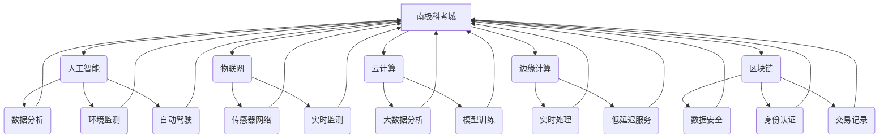

> 极地探索，南极科考城，北极旅游，人工智能，物联网，云计算，边缘计算，区块链，可持续发展

## 1. 背景介绍

随着全球气候变化的加剧，极地地区正经历着前所未有的变化。冰川融化、海平面上升、生态系统失衡等问题日益严峻，极地地区也面临着新的机遇和挑战。

在未来，极地地区将成为科学研究、资源开发、旅游观光等领域的重点关注区域。为了更好地探索和利用极地资源，同时保护极地生态环境，我们需要发展更加先进的技术和模式。

## 2. 核心概念与联系

**2.1 南极科考城与北极旅游**

南极科考城是一个集科研、生活、观光于一体的综合性设施，旨在为科学家提供一个稳定的工作环境，同时为游客提供一个安全舒适的观光体验。北极旅游则以观赏极光、探险冰川、体验北极文化等为主要内容，吸引着越来越多的游客前往。

**2.2 人工智能、物联网、云计算、边缘计算、区块链**

这些技术将为极地探索和旅游提供强大的支持：

* **人工智能 (AI)**：可以用于数据分析、环境监测、自动驾驶、机器人辅助等方面，提高极地探索和旅游的效率和安全性。
* **物联网 (IoT)**：可以连接各种传感器和设备，实时监测极地环境变化，为科学研究和旅游安全提供数据支持。
* **云计算 (Cloud Computing)**：可以提供强大的计算和存储能力，支持大数据分析、模型训练等任务，为极地探索和旅游提供技术支撑。
* **边缘计算 (Edge Computing)**：可以将计算任务部署到靠近数据源的边缘设备，降低数据传输延迟，提高实时性，为极地探索和旅游提供更快速、更可靠的服务。
* **区块链 (Blockchain)**：可以用于数据安全、身份认证、交易记录等方面，保障极地资源的合理利用和旅游活动的透明度。

**2.3 核心概念关系图**



## 3. 核心算法原理 & 具体操作步骤

**3.1 算法原理概述**

为了实现极地探索和旅游的智能化，需要开发一系列核心算法，例如：

* **环境监测算法**: 用于分析传感器数据，识别环境变化趋势，预警潜在风险。
* **路径规划算法**: 用于根据地形、天气等因素，规划最优的探险路线。
* **资源管理算法**: 用于优化极地资源的分配和利用，确保可持续发展。
* **安全保障算法**: 用于识别潜在威胁，保障人员和设备安全。

**3.2 算法步骤详解**

以环境监测算法为例，其具体操作步骤如下：

1. **数据采集**: 利用传感器网络收集环境数据，例如温度、湿度、气压、风速等。
2. **数据预处理**: 对采集到的数据进行清洗、格式化、异常值处理等操作，确保数据质量。
3. **特征提取**: 从预处理后的数据中提取关键特征，例如温度变化趋势、湿度波动幅度等。
4. **模型训练**: 利用机器学习算法，对提取的特征进行训练，建立环境监测模型。
5. **预测分析**: 将实时采集到的数据输入模型，进行预测分析，识别环境变化趋势和潜在风险。
6. **报警预警**: 当模型检测到异常情况时，及时发出报警预警，提醒相关人员采取措施。

**3.3 算法优缺点**

* **优点**: 能够实时监测环境变化，提高预警效率，保障人员和设备安全。
* **缺点**: 需要大量的训练数据，模型精度需要不断提升，算法复杂度较高。

**3.4 算法应用领域**

环境监测算法可以应用于极地科学研究、极地旅游安全保障、极地资源管理等领域。

## 4. 数学模型和公式 & 详细讲解 & 举例说明

**4.1 数学模型构建**

为了描述极地环境变化的复杂性，我们可以构建以下数学模型：

```latex
\frac{dT}{dt} = aT + bP + cW
```

其中：

* $T$：温度
* $t$：时间
* $a$：温度自回归系数
* $b$：气压对温度的影响系数
* $P$：气压
* $c$：风速对温度的影响系数
* $W$：风速

**4.2 公式推导过程**

该公式的推导过程基于热力学原理和气象学知识。

* 温度变化率与自身温度成正比，即 $aT$。
* 气压升高会导致温度升高，即 $bP$。
* 风速增加会导致温度下降，即 $cW$。

**4.3 案例分析与讲解**

假设南极某地气压为 1013 hPa，风速为 10 m/s，初始温度为 -20°C，则根据公式可以计算出温度随时间的变化趋势。

## 5. 项目实践：代码实例和详细解释说明

**5.1 开发环境搭建**

* 操作系统：Ubuntu 20.04
* 编程语言：Python 3.8
* 库依赖：NumPy、Pandas、Scikit-learn

**5.2 源代码详细实现**

```python
import numpy as np
import pandas as pd
from sklearn.linear_model import LinearRegression

# 数据加载
data = pd.read_csv('environment_data.csv')

# 数据预处理
data['temperature'] = data['temperature'].astype(float)
data['pressure'] = data['pressure'].astype(float)
data['wind_speed'] = data['wind_speed'].astype(float)

# 特征提取
X = data[['pressure', 'wind_speed']]
y = data['temperature']

# 模型训练
model = LinearRegression()
model.fit(X, y)

# 预测分析
new_data = pd.DataFrame({'pressure': [1013], 'wind_speed': [10]})
predicted_temperature = model.predict(new_data)

print(f'预测温度: {predicted_temperature[0]:.2f}°C')
```

**5.3 代码解读与分析**

* 代码首先加载环境数据，并对数据进行预处理和特征提取。
* 然后使用线性回归模型训练，建立环境监测模型。
* 最后利用训练好的模型预测新的环境温度。

**5.4 运行结果展示**

运行代码后，将输出预测温度的结果。

## 6. 实际应用场景

**6.1 南极科考城**

* **环境监测**: 利用环境监测算法，实时监测南极科考城的环境状况，例如温度、湿度、气压、风速等，保障人员安全和设备正常运行。
* **资源管理**: 利用资源管理算法，优化南极科考城的能源、水资源、物资等资源分配，实现可持续发展。
* **安全保障**: 利用安全保障算法，识别潜在威胁，例如极地风暴、动物袭击等，及时采取措施保障人员安全。

**6.2 北极旅游**

* **路径规划**: 利用路径规划算法，根据地形、天气等因素，规划最优的旅游路线，保障游客安全和体验。
* **观光服务**: 利用人工智能技术，提供个性化观光服务，例如推荐观光景点、提供实时天气预报等。
* **环境保护**: 利用物联网技术，监测旅游活动对环境的影响，采取措施保护北极生态环境。

**6.4 未来应用展望**

随着技术的不断发展，极地探索和旅游将更加智能化、便捷化、可持续化。

## 7. 工具和资源推荐

**7.1 学习资源推荐**

* 极地科学研究相关书籍和期刊
* 人工智能、物联网、云计算、边缘计算、区块链相关课程和文档

**7.2 开发工具推荐**

* Python 编程语言
* TensorFlow、PyTorch 等深度学习框架
* Kubernetes、Docker 等容器化技术
* Git 等版本控制工具

**7.3 相关论文推荐**

* 极地环境监测和数据分析相关论文
* 极地资源管理和可持续发展相关论文
* 极地旅游安全保障和体验优化相关论文

## 8. 总结：未来发展趋势与挑战

**8.1 研究成果总结**

本文介绍了极地探索和旅游的未来发展趋势，并探讨了人工智能、物联网、云计算、边缘计算、区块链等技术在极地探索和旅游中的应用。

**8.2 未来发展趋势**

* 极地探索和旅游将更加智能化、便捷化、可持续化。
* 人工智能技术将更加广泛地应用于极地探索和旅游领域。
* 极地数据分析和模型预测将更加精准和可靠。
* 极地资源管理和环境保护将更加有效。

**8.3 面临的挑战**

* 极地环境恶劣，技术应用面临挑战。
* 数据采集和传输成本高。
* 算法模型需要不断优化和改进。
* 极地资源管理和环境保护需要国际合作。

**8.4 研究展望**

未来，我们将继续深入研究极地探索和旅游的智能化技术，为极地科学研究、资源开发、旅游观光等领域提供更强大的技术支撑。

## 9. 附录：常见问题与解答

**9.1 Q: 极地环境恶劣，如何保障技术设备的稳定运行？**

**A:** 可以采用以下措施保障技术设备的稳定运行：

* 使用耐寒、耐腐蚀的材料制造设备。
* 设计冗余备份系统，提高设备可靠性。
* 利用远程监控和维护技术，及时发现和解决设备故障。

**9.2 Q: 极地数据传输成本高，如何解决数据传输问题？**

**A:** 可以采用以下措施解决数据传输问题：

* 利用卫星通信技术，实现远程数据传输。
* 采用边缘计算技术，将数据处理离线进行，减少数据传输量。
* 利用数据压缩和加密技术，提高数据传输效率和安全性。


作者：禅与计算机程序设计艺术 / Zen and the Art of Computer Programming 
<end_of_turn>