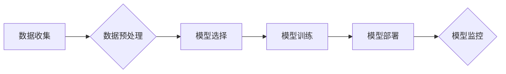

> 机器学习，需求预测，时间序列分析，回归模型，神经网络，深度学习，预测精度，数据驱动

## 1. 背景介绍

在当今数据爆炸的时代，企业积累了海量的历史数据，这些数据蕴藏着宝贵的预测价值。需求预测作为企业经营决策的重要环节，能够帮助企业优化库存管理、生产计划、资源配置等，从而提高效率、降低成本，增强竞争力。传统的需求预测方法往往依赖于经验和主观判断，难以准确捕捉复杂的需求变化趋势。而机器学习作为一种数据驱动型的预测方法，凭借其强大的学习能力和数据挖掘能力，为需求预测带来了新的机遇。

## 2. 核心概念与联系

**2.1 需求预测概述**

需求预测是指根据历史数据和市场趋势，预测未来一段时间内产品的需求量。需求预测的准确性直接影响到企业的生产、销售和库存管理，因此，需求预测一直是企业经营管理中一个重要的课题。

**2.2 机器学习概述**

机器学习是人工智能领域的一个重要分支，它通过算法训练模型，使模型能够从数据中学习规律，并对新的数据进行预测或分类。机器学习算法可以分为监督学习、无监督学习和强化学习三大类。

**2.3 机器学习在需求预测中的应用**

机器学习算法可以有效地捕捉历史数据中的复杂模式和趋势，从而提高需求预测的准确性。在需求预测领域，常用的机器学习算法包括回归模型、决策树、支持向量机、神经网络等。

**2.4 需求预测流程**

需求预测流程通常包括以下几个步骤：

1. 数据收集：收集历史销售数据、市场数据、季节性数据等相关信息。
2. 数据预处理：对收集到的数据进行清洗、转换、特征工程等处理，使其适合机器学习算法的训练。
3. 模型选择：根据需求预测的特点和数据类型，选择合适的机器学习算法。
4. 模型训练：使用训练数据训练机器学习模型，并评估模型的性能。
5. 模型部署：将训练好的模型部署到生产环境中，用于对未来需求进行预测。
6. 模型监控：持续监控模型的性能，并根据需要进行模型更新和调整。

**2.5 Mermaid 流程图**



## 3. 核心算法原理 & 具体操作步骤

### 3.1  算法原理概述

在需求预测领域，回归模型是常用的机器学习算法之一。回归模型的目标是预测连续数值型变量，例如产品的需求量。常见的回归模型包括线性回归、逻辑回归、支持向量回归等。

### 3.2  算法步骤详解

**3.2.1 线性回归**

线性回归模型假设需求量与预测变量之间存在线性关系。模型的目标是找到一条直线，使得这条直线与历史数据点的距离最小。

**步骤：**

1. 确定预测变量，例如历史销售数据、季节性数据、市场趋势等。
2. 使用最小二乘法求解线性回归模型的参数。
3. 将模型参数代入公式，预测未来需求量。

**3.2.2 逻辑回归**

逻辑回归模型用于预测分类型变量，例如产品是否会缺货。模型将预测变量映射到0到1之间的概率值，表示产品缺货的可能性。

**步骤：**

1. 确定预测变量，例如历史销售数据、库存水平、市场需求等。
2. 使用最大似然估计法求解逻辑回归模型的参数。
3. 将模型参数代入公式，预测产品缺货的概率。

### 3.3  算法优缺点

**3.3.1 线性回归**

**优点：**

* 计算简单，易于理解和实现。
* 训练速度快，适合处理大规模数据。

**缺点：**

* 假设需求量与预测变量之间存在线性关系，如果关系非线性，则预测精度会降低。
* 对异常值敏感，异常值会影响模型的训练结果。

**3.3.2 逻辑回归**

**优点：**

* 可以预测分类型变量，例如产品是否会缺货。
* 输出结果是概率值，可以直观地表示预测的置信度。

**缺点：**

* 假设预测变量之间相互独立，如果存在相关性，则预测精度会降低。
* 对异常值敏感，异常值会影响模型的训练结果。

### 3.4  算法应用领域

回归模型广泛应用于需求预测、价格预测、风险评估等领域。

## 4. 数学模型和公式 & 详细讲解 & 举例说明

### 4.1  数学模型构建

**4.1.1 线性回归模型**

线性回归模型假设需求量与预测变量之间存在线性关系，可以用以下公式表示：

$$y = \beta_0 + \beta_1x_1 + \beta_2x_2 + ... + \beta_nx_n + \epsilon$$

其中：

* $y$ 是需求量
* $x_1, x_2, ..., x_n$ 是预测变量
* $\beta_0, \beta_1, \beta_2, ..., \beta_n$ 是模型参数
* $\epsilon$ 是误差项

**4.1.2 逻辑回归模型**

逻辑回归模型将预测变量映射到0到1之间的概率值，可以用以下公式表示：

$$p(y=1) = \frac{1}{1 + e^{-( \beta_0 + \beta_1x_1 + \beta_2x_2 + ... + \beta_nx_n )}}$$

其中：

* $p(y=1)$ 是产品缺货的概率
* $x_1, x_2, ..., x_n$ 是预测变量
* $\beta_0, \beta_1, \beta_2, ..., \beta_n$ 是模型参数

### 4.2  公式推导过程

**4.2.1 线性回归模型参数求解**

线性回归模型的参数可以通过最小二乘法求解。最小二乘法目标是找到一条直线，使得这条直线与历史数据点的距离最小。

**4.2.2 逻辑回归模型参数求解**

逻辑回归模型的参数可以通过最大似然估计法求解。最大似然估计法目标是找到一组参数，使得模型生成的概率分布与实际观测数据最吻合。

### 4.3  案例分析与讲解

**4.3.1 线性回归模型案例**

假设我们想要预测某产品的未来需求量，已知该产品的历史销售数据、季节性数据和市场趋势数据。我们可以使用线性回归模型来预测未来需求量。

**4.3.2 逻辑回归模型案例**

假设我们想要预测某产品的未来是否会缺货，已知该产品的历史销售数据、库存水平和市场需求数据。我们可以使用逻辑回归模型来预测产品是否会缺货。

## 5. 项目实践：代码实例和详细解释说明

### 5.1  开发环境搭建

本项目使用Python语言进行开发，需要安装以下软件包：

* pandas：用于数据处理
* scikit-learn：用于机器学习算法
* matplotlib：用于数据可视化

### 5.2  源代码详细实现

```python
import pandas as pd
from sklearn.linear_model import LinearRegression
from sklearn.model_selection import train_test_split
from sklearn.metrics import mean_squared_error

# 加载数据
data = pd.read_csv('demand_data.csv')

# 划分训练集和测试集
X = data[['historical_sales', 'seasonality', 'market_trend']]
y = data['demand']
X_train, X_test, y_train, y_test = train_test_split(X, y, test_size=0.2, random_state=42)

# 创建线性回归模型
model = LinearRegression()

# 训练模型
model.fit(X_train, y_train)

# 预测测试集数据
y_pred = model.predict(X_test)

# 计算模型性能
mse = mean_squared_error(y_test, y_pred)
print(f'Mean Squared Error: {mse}')

# 可视化预测结果
import matplotlib.pyplot as plt
plt.scatter(y_test, y_pred)
plt.xlabel('Actual Demand')
plt.ylabel('Predicted Demand')
plt.title('Linear Regression Model')
plt.show()
```

### 5.3  代码解读与分析

* 代码首先加载数据，并划分训练集和测试集。
* 然后创建线性回归模型，并使用训练集训练模型。
* 接着使用训练好的模型预测测试集数据，并计算模型性能。
* 最后使用 matplotlib 库可视化预测结果。

### 5.4  运行结果展示

运行代码后，会输出模型的均方误差值，以及预测结果的可视化图。

## 6. 实际应用场景

### 6.1  库存管理

需求预测可以帮助企业优化库存管理，减少库存积压和缺货风险。

### 6.2  生产计划

需求预测可以帮助企业制定合理的生产计划，提高生产效率和资源利用率。

### 6.3  营销推广

需求预测可以帮助企业预测产品的市场需求，制定有效的营销推广策略。

### 6.4  未来应用展望

随着机器学习技术的不断发展，需求预测的精度和应用场景将会不断扩展。未来，机器学习在需求预测领域将有更广泛的应用，例如：

* 利用深度学习算法进行更复杂的预测。
* 将多源数据融合，提高预测精度。
* 将需求预测与其他业务系统集成，实现智能化决策。

## 7. 工具和资源推荐

### 7.1  学习资源推荐

* **书籍:**
    * 《机器学习》 by Tom Mitchell
    * 《Python机器学习》 by Sebastian Raschka
* **在线课程:**
    * Coursera: Machine Learning by Andrew Ng
    * edX: Artificial Intelligence by Columbia University

### 7.2  开发工具推荐

* **Python:** 
    * pandas
    * scikit-learn
    * TensorFlow
    * PyTorch

### 7.3  相关论文推荐

* **《Machine Learning for Demand Forecasting》** by  A. Agrawal et al.
* **《Deep Learning for Demand Forecasting》** by  S. Wang et al.

## 8. 总结：未来发展趋势与挑战

### 8.1  研究成果总结

机器学习在需求预测领域取得了显著的成果，能够有效提高预测精度，并为企业提供数据驱动的决策支持。

### 8.2  未来发展趋势

未来，机器学习在需求预测领域将朝着以下方向发展：

* **模型复杂度提升:** 利用深度学习算法进行更复杂的预测。
* **数据融合:** 将多源数据融合，提高预测精度。
* **实时预测:** 实现实时需求预测，满足企业快速决策的需求。
* **个性化预测:** 基于用户行为和偏好进行个性化需求预测。

### 8.3  面临的挑战

尽管机器学习在需求预测领域取得了进展，但仍面临一些挑战：

* **数据质量:** 需求预测模型的精度依赖于数据质量，数据不完整、不准确会影响模型性能。
* **模型解释性:** 一些机器学习模型的决策过程难以解释，这可能会阻碍企业对模型结果的信任。
* **计算资源:** 训练复杂的机器学习模型需要大量的计算资源。

### 8.4  研究展望

未来，需要进一步研究以下问题：

* 如何提高机器学习模型对数据质量的鲁棒性。
* 如何提高机器学习模型的解释性。
* 如何降低机器学习模型的计算成本。


## 9. 附录：常见问题与解答

**9.1  如何选择合适的机器学习算法？**

选择合适的机器学习算法取决于需求预测的特点和数据类型。

* 如果需求量与预测变量之间存在线性关系，可以使用线性回归模型。
* 如果需要预测分类型变量，可以使用逻辑回归模型。
* 如果需求量