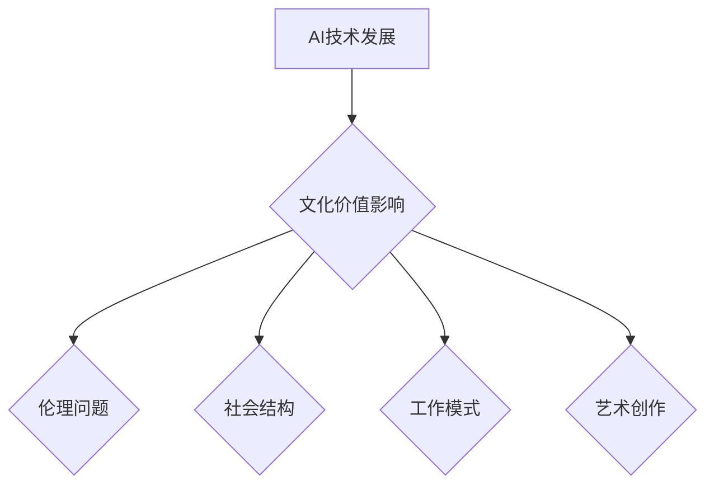

> 人工智能，AI 2.0，文化价值，伦理问题，社会影响，未来趋势

## 1. 背景介绍

人工智能（AI）技术近年来发展迅速，从语音识别、图像识别到自然语言处理，AI已经渗透到我们生活的方方面面。李开复，作为一位享誉全球的人工智能专家，在《AI 2.0 时代的文化价值》一文中，深刻探讨了AI技术发展对人类社会文化价值的深刻影响。

李开复指出，我们正处于AI 2.0时代，这一时代的特点是AI技术更加智能化、泛化和自主化。与前一代AI技术相比，AI 2.0能够更深入地理解和模拟人类思维，并能够自主学习和决策。这种强大的能力将深刻改变人类社会，带来前所未有的机遇和挑战。

## 2. 核心概念与联系

**AI 2.0时代**的核心概念包括：

* **深度学习**: 深度学习是AI 2.0时代的重要驱动力，它利用多层神经网络模拟人类大脑的学习机制，能够处理海量数据并从中提取复杂模式。
* **强化学习**: 强化学习让AI系统通过与环境交互学习，并通过奖励机制优化行为，使其能够在复杂环境中自主决策。
* **迁移学习**: 迁移学习允许AI系统将已学到的知识应用于新的任务或领域，从而降低学习成本和时间。
* **解释性AI**: 解释性AI致力于使AI系统的决策过程更加透明和可解释，帮助人类理解AI的思考方式。

**AI 2.0时代对文化价值的影响**



AI 2.0时代对文化价值的影响是多方面的，包括伦理问题、社会结构、工作模式和艺术创作等方面。

## 3. 核心算法原理 & 具体操作步骤

### 3.1  算法原理概述

深度学习算法是AI 2.0时代的核心算法之一，它通过多层神经网络模拟人类大脑的学习机制。深度学习算法的核心思想是通过不断调整神经网络的权重，使网络能够从数据中学习到复杂的特征和模式。

### 3.2  算法步骤详解

深度学习算法的训练过程可以概括为以下步骤：

1. **数据预处理**: 将原始数据进行清洗、转换和格式化，使其适合深度学习算法的训练。
2. **网络结构设计**: 根据任务需求设计深度神经网络的结构，包括神经元的数量、连接方式和激活函数等。
3. **参数初始化**: 为神经网络的参数（权重和偏置）进行随机初始化。
4. **前向传播**: 将输入数据通过神经网络进行前向传播，计算输出结果。
5. **反向传播**: 计算输出结果与真实值的误差，并根据误差反向传播，更新神经网络的参数。
6. **迭代训练**: 重复步骤4和5，直到模型的性能达到预期的水平。

### 3.3  算法优缺点

**优点**:

* 能够处理海量数据，学习到复杂的特征和模式。
* 泛化能力强，能够应用于多种不同的任务。

**缺点**:

* 训练成本高，需要大量的计算资源和时间。
* 模型解释性差，难以理解AI的决策过程。

### 3.4  算法应用领域

深度学习算法已广泛应用于各个领域，例如：

* **图像识别**: 人脸识别、物体检测、图像分类等。
* **语音识别**: 语音转文本、语音助手等。
* **自然语言处理**: 机器翻译、文本摘要、情感分析等。
* **医疗诊断**: 疾病预测、影像分析等。

## 4. 数学模型和公式 & 详细讲解 & 举例说明

### 4.1  数学模型构建

深度学习算法的核心是神经网络模型，其数学模型可以表示为：

$$
y = f(W^L x^L + b^L)
$$

其中：

* $y$ 是输出结果。
* $x^L$ 是第L层的输入。
* $W^L$ 是第L层的权重矩阵。
* $b^L$ 是第L层的偏置向量。
* $f$ 是激活函数。

### 4.2  公式推导过程

深度学习算法的训练过程是通过反向传播算法来更新神经网络的参数。反向传播算法的核心思想是利用链式法则计算误差梯度，并根据梯度更新参数。

### 4.3  案例分析与讲解

例如，在图像分类任务中，深度学习模型会将图像输入到神经网络中，并输出每个类别的概率。通过计算输出结果与真实标签之间的误差，反向传播算法可以计算出每个参数的梯度，并根据梯度更新参数，从而提高模型的分类精度。

## 5. 项目实践：代码实例和详细解释说明

### 5.1  开发环境搭建

深度学习项目开发通常需要以下环境：

* **操作系统**: Linux或macOS
* **编程语言**: Python
* **深度学习框架**: TensorFlow、PyTorch等
* **GPU**: 加速深度学习训练

### 5.2  源代码详细实现

以下是一个使用TensorFlow框架实现图像分类的简单代码示例：

```python
import tensorflow as tf

# 定义模型结构
model = tf.keras.models.Sequential([
    tf.keras.layers.Conv2D(32, (3, 3), activation='relu', input_shape=(28, 28, 1)),
    tf.keras.layers.MaxPooling2D((2, 2)),
    tf.keras.layers.Conv2D(64, (3, 3), activation='relu'),
    tf.keras.layers.MaxPooling2D((2, 2)),
    tf.keras.layers.Flatten(),
    tf.keras.layers.Dense(10, activation='softmax')
])

# 编译模型
model.compile(optimizer='adam',
              loss='sparse_categorical_crossentropy',
              metrics=['accuracy'])

# 训练模型
model.fit(x_train, y_train, epochs=5)

# 评估模型
loss, accuracy = model.evaluate(x_test, y_test)
print('Test loss:', loss)
print('Test accuracy:', accuracy)
```

### 5.3  代码解读与分析

这段代码定义了一个简单的卷积神经网络模型，用于图像分类任务。模型包含两层卷积层、两层最大池化层、一层全连接层和一层输出层。

### 5.4  运行结果展示

训练完成后，模型可以用来预测新的图像类别。

## 6. 实际应用场景

### 6.1  医疗诊断

AI 2.0技术在医疗诊断领域具有巨大的应用潜力。例如，深度学习算法可以用于分析医学影像，辅助医生诊断疾病。

### 6.2  金融风险控制

AI 2.0技术可以帮助金融机构识别和控制风险。例如，AI系统可以分析交易数据，识别异常交易行为，并采取相应的措施。

### 6.3  个性化教育

AI 2.0技术可以为学生提供个性化的学习体验。例如，AI系统可以根据学生的学习进度和能力，定制学习内容和教学方式。

### 6.4  未来应用展望

AI 2.0技术的应用场景还在不断扩展，未来将会有更多新的应用场景出现。例如，AI 2.0技术可以用于自动驾驶、机器人、虚拟现实等领域。

## 7. 工具和资源推荐

### 7.1  学习资源推荐

* **在线课程**: Coursera、edX、Udacity等平台提供丰富的AI课程。
* **书籍**: 《深度学习》、《人工智能：一种现代方法》等书籍。
* **博客**: TensorFlow博客、PyTorch博客等。

### 7.2  开发工具推荐

* **深度学习框架**: TensorFlow、PyTorch、Keras等。
* **数据处理工具**: Pandas、NumPy等。
* **可视化工具**: Matplotlib、Seaborn等。

### 7.3  相关论文推荐

* **《ImageNet Classification with Deep Convolutional Neural Networks》**: 
* **《Attention Is All You Need》**: 

## 8. 总结：未来发展趋势与挑战

### 8.1  研究成果总结

AI 2.0时代取得了令人瞩目的成果，例如深度学习算法的突破、强化学习的进展、迁移学习的应用等。这些成果为人类社会带来了巨大的机遇和挑战。

### 8.2  未来发展趋势

未来AI技术将朝着更加智能化、泛化和自主化的方向发展。例如，解释性AI将更加重要，以帮助人类理解AI的决策过程。

### 8.3  面临的挑战

AI技术发展也面临着一些挑战，例如伦理问题、数据安全问题、算法偏见问题等。

### 8.4  研究展望

未来研究需要关注以下几个方面：

* **解释性AI**: 提高AI系统的透明度和可解释性。
* **安全可靠性**: 确保AI系统的安全性和可靠性。
* **伦理规范**: 制定AI技术发展的伦理规范。

## 9. 附录：常见问题与解答

### 9.1  什么是AI 2.0？

AI 2.0是指人工智能技术发展到第二阶段，其特点是更加智能化、泛化和自主化。

### 9.2  AI 2.0对文化价值的影响是什么？

AI 2.0对文化价值的影响是多方面的，包括伦理问题、社会结构、工作模式和艺术创作等方面。

### 9.3  如何学习AI 2.0技术？

可以通过在线课程、书籍、博客等方式学习AI 2.0技术。

### 9.4  AI 2.0技术的未来发展趋势是什么？

未来AI技术将朝着更加智能化、泛化和自主化的方向发展。

### 9.5  AI 2.0技术面临哪些挑战？

AI技术发展也面临着一些挑战，例如伦理问题、数据安全问题、算法偏见问题等。


作者：禅与计算机程序设计艺术 / Zen and the Art of Computer Programming 
<end_of_turn>