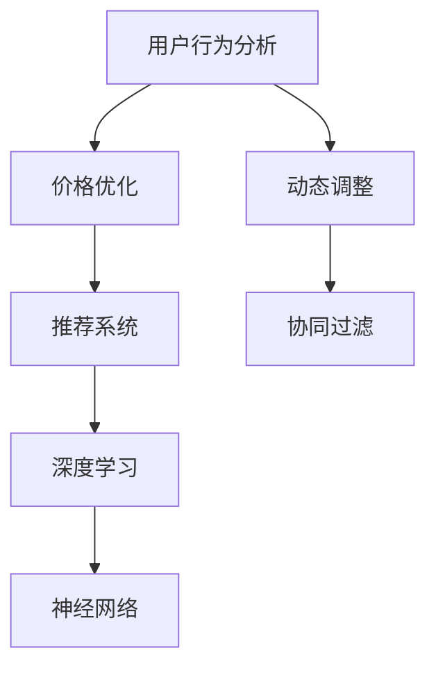

                 

## 1. 背景介绍

### 1.1 问题由来

随着电子商务的迅速发展，电商平台上的竞争日趋激烈。商家们为了提高销售业绩，纷纷通过折扣、满减、优惠券等方式吸引消费者，但这些传统的定价策略已经无法满足消费者对个性化、差异化定价的需求。因此，个性化定价模型应运而生。通过分析用户的消费行为和偏好，电商平台能够实现动态定价，提高交易转化率和用户满意度。

个性化定价模型是一种基于人工智能(AI)的技术，它通过对用户的历史行为数据进行分析，预测用户的购买意向，并根据预测结果进行动态定价。个性化定价模型不仅能够提高电商平台的利润，还能够提升用户体验，增强平台的竞争力。

### 1.2 问题核心关键点

个性化定价模型的核心在于如何准确预测用户的购买意向，并根据预测结果进行动态定价。个性化定价模型主要包括三个关键步骤：

1. **用户行为分析**：通过对用户的历史行为数据进行建模，预测用户对不同价格的商品的购买意向。
2. **价格优化**：根据用户购买意向，确定商品的价格，以最大化销售收益。
3. **动态调整**：实时监控用户行为和市场变化，动态调整商品价格，确保定价策略的适应性和有效性。

个性化定价模型已经在多个电商平台得到了广泛应用，包括亚马逊、阿里巴巴、京东等。通过个性化定价，这些电商平台能够提高销售额和利润率，同时增强用户的购物体验。

### 1.3 问题研究意义

个性化定价模型在电商平台中的应用具有重要意义：

1. **提升销售业绩**：通过动态定价策略，电商平台能够吸引更多消费者，提高交易转化率和销售额。
2. **增强用户体验**：个性化定价能够更好地满足用户的个性化需求，提升用户满意度和忠诚度。
3. **提高竞争力**：通过精准的定价策略，电商平台能够在竞争激烈的市场中脱颖而出，获得更多的市场份额。
4. **数据驱动决策**：个性化定价模型基于用户行为数据进行决策，减少了人为决策的偏差，提高了决策的科学性和准确性。

## 2. 核心概念与联系

### 2.1 核心概念概述

为更好地理解个性化定价模型的原理和架构，本节将介绍几个密切相关的核心概念：

- **用户行为分析**：通过对用户的历史行为数据进行分析，预测用户对不同商品或价格的反应，为定价决策提供依据。
- **价格优化**：在用户购买意向的基础上，通过数学优化模型确定最佳价格，以最大化销售收益。
- **动态调整**：实时监控市场变化和用户行为，动态调整商品价格，保持定价策略的适应性。
- **推荐系统**：通过分析用户的历史行为和偏好，推荐用户可能感兴趣的商品或价格，增强用户的购买意愿。
- **协同过滤**：利用用户之间的相似性进行推荐，提高推荐的准确性。
- **深度学习**：利用深度神经网络进行用户行为分析和预测，提升模型的准确性和泛化能力。

这些核心概念之间的逻辑关系可以通过以下Mermaid流程图来展示：



这个流程图展示了个性化定价模型的核心概念及其之间的关系：

1. 用户行为分析通过分析用户的历史行为数据，预测用户的购买意向。
2. 价格优化在用户购买意向的基础上，通过数学优化模型确定最佳价格。
3. 动态调整实时监控市场变化和用户行为，动态调整商品价格。
4. 推荐系统通过分析用户的历史行为和偏好，推荐用户可能感兴趣的商品或价格。
5. 协同过滤利用用户之间的相似性进行推荐，提高推荐的准确性。
6. 深度学习利用神经网络进行用户行为分析和预测，提升模型的准确性和泛化能力。

这些核心概念共同构成了个性化定价模型的学习和应用框架，使其能够实现精准定价，提升电商平台的竞争力和用户体验。

## 3. 核心算法原理 & 具体操作步骤

### 3.1 算法原理概述

个性化定价模型的核心思想是通过用户行为数据，预测用户的购买意向，并根据预测结果进行动态定价，以最大化销售收益。其基本流程包括以下几个步骤：

1. **用户行为数据采集**：通过日志、网站点击、购物车数据等途径，采集用户的历史行为数据。
2. **用户行为建模**：利用机器学习模型对用户行为数据进行分析，预测用户的购买意向和价格敏感度。
3. **价格优化模型**：根据用户购买意向和价格敏感度，确定最佳价格。
4. **动态定价调整**：实时监控用户行为和市场变化，动态调整商品价格。

个性化定价模型通常基于监督学习或强化学习进行建模。监督学习方法通过历史数据训练模型，预测用户购买意向和价格敏感度；强化学习方法通过模拟用户行为，不断优化定价策略。

### 3.2 算法步骤详解

个性化定价模型的具体实现步骤如下：

**Step 1: 用户行为数据采集**

1. **数据来源**：通过日志、网站点击、购物车数据等途径，采集用户的历史行为数据。
2. **数据清洗**：对数据进行去重、缺失值处理，确保数据的质量和一致性。
3. **特征提取**：从用户行为数据中提取有用的特征，如浏览时间、点击次数、购物车行为等。

**Step 2: 用户行为建模**

1. **选择模型**：选择合适的机器学习或深度学习模型，如线性回归、决策树、随机森林、神经网络等。
2. **模型训练**：利用历史用户行为数据，训练机器学习或深度学习模型，预测用户的购买意向和价格敏感度。
3. **模型评估**：在验证集上评估模型的性能，选择表现最佳的模型。

**Step 3: 价格优化模型**

1. **定价模型**：根据用户购买意向和价格敏感度，选择合适的定价模型，如线性回归、深度神经网络等。
2. **模型训练**：利用训练好的用户行为模型，训练定价模型，确定最佳价格。
3. **模型评估**：在测试集上评估定价模型的性能，选择表现最佳的模型。

**Step 4: 动态定价调整**

1. **实时监控**：实时监控用户行为和市场变化，收集最新的用户行为数据。
2. **动态定价**：根据实时监控数据，动态调整商品价格，确保定价策略的适应性。
3. **效果评估**：定期评估定价策略的效果，根据评估结果进行调整。

### 3.3 算法优缺点

个性化定价模型具有以下优点：

1. **精准定价**：通过用户行为数据，能够实现精准定价，提高销售业绩。
2. **提高用户体验**：根据用户的个性化需求进行定价，提升用户的购物体验和满意度。
3. **实时调整**：能够实时监控市场变化和用户行为，动态调整定价策略，保持适应性。
4. **提高竞争力**：通过精准的定价策略，增强电商平台在竞争中的优势。

同时，个性化定价模型也存在一些缺点：

1. **数据依赖**：个性化定价模型高度依赖用户行为数据，数据质量对模型的预测效果影响较大。
2. **复杂性高**：模型训练和调优过程较为复杂，需要较高的技术水平和计算资源。
3. **高成本**：需要采集和处理大量用户数据，成本较高。
4. **隐私问题**：用户行为数据的采集和处理可能涉及隐私问题，需要严格的法律法规和道德规范。

### 3.4 算法应用领域

个性化定价模型已经在多个电商平台上得到了广泛应用，如亚马逊、阿里巴巴、京东等。通过个性化定价，这些电商平台能够提高销售额和利润率，同时增强用户的购物体验。

除了电商领域，个性化定价模型还在金融、旅游、航空等行业得到了应用。例如，银行根据用户的交易行为和信用记录进行个性化定价，旅游平台根据用户的偏好和历史订单进行定价，航空公司根据用户的飞行历史和预订行为进行定价等。

## 4. 数学模型和公式 & 详细讲解

### 4.1 数学模型构建

个性化定价模型的核心在于通过用户行为数据预测用户的购买意向和价格敏感度，并根据预测结果进行定价。假设用户行为数据为 $X=\{x_1, x_2, ..., x_n\}$，其中 $x_i$ 表示用户第 $i$ 次的行为数据。

定义用户购买意向的预测模型为 $f(X) = \hat{y}$，其中 $\hat{y}$ 表示用户购买意向的预测值。定义价格敏感度的预测模型为 $g(X) = \hat{p}$，其中 $\hat{p}$ 表示用户对价格的敏感度。

定义定价模型为 $P(X, \hat{y}, \hat{p}) = p$，其中 $p$ 表示商品的价格。

### 4.2 公式推导过程

个性化定价模型的具体公式推导如下：

**用户购买意向预测**：

假设用户购买意向为二分类问题，使用逻辑回归模型进行预测：

$$
\hat{y} = \frac{1}{1+e^{-z}}
$$

其中 $z = w^T X + b$，$w$ 和 $b$ 为模型参数。

**价格敏感度预测**：

假设价格敏感度为回归问题，使用线性回归模型进行预测：

$$
\hat{p} = w^T X + b
$$

其中 $w$ 和 $b$ 为模型参数。

**定价模型**：

假设价格为连续值，使用线性回归模型进行定价：

$$
p = w^T X + b
$$

其中 $w$ 和 $b$ 为模型参数。

### 4.3 案例分析与讲解

假设电商平台销售一款商品，已知用户购买意向和价格敏感度分别为 $X = [浏览时间, 点击次数, 购物车行为]$，定价模型为 $P(X, \hat{y}, \hat{p}) = p$。

1. **用户行为建模**：
   - **数据来源**：通过日志、网站点击、购物车数据等途径，采集用户的历史行为数据。
   - **数据清洗**：对数据进行去重、缺失值处理，确保数据的质量和一致性。
   - **特征提取**：从用户行为数据中提取有用的特征，如浏览时间、点击次数、购物车行为等。
   - **模型训练**：利用历史用户行为数据，训练逻辑回归模型，预测用户的购买意向和价格敏感度。

2. **价格优化模型**：
   - **定价模型**：根据用户购买意向和价格敏感度，训练线性回归模型，确定最佳价格。
   - **模型评估**：在测试集上评估定价模型的性能，选择表现最佳的模型。

3. **动态定价调整**：
   - **实时监控**：实时监控用户行为和市场变化，收集最新的用户行为数据。
   - **动态定价**：根据实时监控数据，动态调整商品价格，确保定价策略的适应性。
   - **效果评估**：定期评估定价策略的效果，根据评估结果进行调整。

## 5. 项目实践：代码实例和详细解释说明

### 5.1 开发环境搭建

在进行个性化定价模型开发前，我们需要准备好开发环境。以下是使用Python进行Scikit-learn开发的环境配置流程：

1. 安装Anaconda：从官网下载并安装Anaconda，用于创建独立的Python环境。

2. 创建并激活虚拟环境：
```bash
conda create -n pyenv python=3.8 
conda activate pyenv
```

3. 安装Scikit-learn：
```bash
pip install -U scikit-learn
```

4. 安装相关依赖：
```bash
pip install pandas numpy matplotlib seaborn sklearn
```

完成上述步骤后，即可在`pyenv`环境中开始个性化定价模型的开发。

### 5.2 源代码详细实现

下面我们以电商平台个性化定价模型为例，给出使用Scikit-learn进行模型训练和调优的Python代码实现。

```python
import pandas as pd
import numpy as np
from sklearn.model_selection import train_test_split
from sklearn.linear_model import LogisticRegression, LinearRegression
from sklearn.metrics import mean_squared_error, accuracy_score
from sklearn.preprocessing import StandardScaler

# 加载数据
data = pd.read_csv('user_behavior.csv')

# 数据预处理
X = data[['浏览时间', '点击次数', '购物车行为']]
y = data['购买意向']
X_train, X_test, y_train, y_test = train_test_split(X, y, test_size=0.2, random_state=42)

# 标准化处理
scaler = StandardScaler()
X_train = scaler.fit_transform(X_train)
X_test = scaler.transform(X_test)

# 用户购买意向预测
clf = LogisticRegression()
clf.fit(X_train, y_train)
y_pred = clf.predict(X_test)

# 用户价格敏感度预测
reg = LinearRegression()
reg.fit(X_train, y_train)
p_pred = reg.predict(X_test)

# 定价模型
p = reg.predict(X_test)

# 模型评估
mse = mean_squared_error(y_test, p_pred)
accuracy = accuracy_score(y_test, y_pred)

print(f'均方误差：{mse:.3f}, 准确率：{accuracy:.3f}')
```

### 5.3 代码解读与分析

让我们再详细解读一下关键代码的实现细节：

**数据预处理**：
- **数据加载**：通过Pandas库加载用户行为数据，并从数据中提取有用的特征。
- **数据分割**：将数据集分割为训练集和测试集，使用70%的数据进行模型训练，30%的数据进行模型评估。
- **标准化处理**：对特征进行标准化处理，确保不同特征在同一尺度上。

**用户购买意向预测**：
- **模型选择**：选择逻辑回归模型进行用户购买意向预测。
- **模型训练**：利用训练集数据训练逻辑回归模型。
- **模型预测**：使用训练好的模型预测测试集数据的购买意向。

**用户价格敏感度预测**：
- **模型选择**：选择线性回归模型进行用户价格敏感度预测。
- **模型训练**：利用训练集数据训练线性回归模型。
- **模型预测**：使用训练好的模型预测测试集数据的价格敏感度。

**定价模型**：
- **定价模型**：使用线性回归模型进行定价，计算测试集数据的最佳价格。
- **模型评估**：使用测试集数据评估定价模型的性能，输出均方误差和准确率。

可以看出，Scikit-learn库提供了丰富的机器学习算法和评估指标，能够快速搭建和评估个性化定价模型。

## 6. 实际应用场景

### 6.1 智能推荐系统

智能推荐系统是个性化定价模型的一个重要应用场景。通过分析用户的历史行为数据，电商平台能够实现个性化的商品推荐，提升用户购买意愿。

在实际应用中，电商平台可以结合个性化定价模型和推荐系统，动态调整商品价格和推荐策略。例如，对于高价值用户，电商平台可以提供更具吸引力的价格和推荐商品，以提高销售额和利润率。

### 6.2 精准营销

精准营销是电商平台的重要策略之一。通过个性化定价模型，电商平台能够实现精准营销，提高广告投放的效果。

在实际应用中，电商平台可以根据用户的历史行为数据，预测用户的购买意向和价格敏感度，确定最佳的广告投放策略。例如，对于对价格敏感的用户，电商平台可以推出打折促销活动，吸引用户购买。

### 6.3 库存管理

库存管理是电商平台的重要任务之一。通过个性化定价模型，电商平台能够实现精准的库存管理，提高库存周转率和利润率。

在实际应用中，电商平台可以根据用户的历史行为数据，预测用户的购买意向和价格敏感度，确定最佳的商品定价策略。例如，对于需求旺盛的商品，电商平台可以提高价格以增加利润，而对于需求不足的商品，电商平台可以降低价格以促销库存。

### 6.4 未来应用展望

个性化定价模型在电商平台中的应用前景广阔，未来还有以下几个发展方向：

1. **多模态融合**：个性化定价模型可以融合用户的多模态数据，如语音、图像、位置等，提升定价策略的精准性和适应性。
2. **跨领域应用**：个性化定价模型可以应用于多个领域，如金融、旅游、航空等，提供更加个性化的定价服务。
3. **实时定价**：个性化定价模型可以实时监控市场变化和用户行为，动态调整商品价格，保持定价策略的适应性。
4. **深度学习应用**：深度学习技术可以提升个性化定价模型的准确性和泛化能力，处理更加复杂的用户行为数据。

总之，个性化定价模型将成为电商平台的重要工具，为商家提供更加精准、个性化的定价策略，提升电商平台的竞争力和用户满意度。

## 7. 工具和资源推荐

### 7.1 学习资源推荐

为了帮助开发者系统掌握个性化定价模型的理论基础和实践技巧，这里推荐一些优质的学习资源：

1. 《Python机器学习》：由Sebastian Raschka所著，是一本全面介绍Python机器学习技术的书，适合初学者和进阶开发者阅读。
2. 《深度学习入门》：由斋藤康毅所著，是一本详细介绍深度学习技术的书，适合有一定基础的学习者阅读。
3. 《自然语言处理综述》：由徐超所著，是一本全面介绍自然语言处理技术的综述性书籍，适合研究人员和工程师阅读。
4. Kaggle竞赛平台：Kaggle是一个数据科学竞赛平台，提供了大量的数据集和竞赛任务，适合数据科学爱好者进行实践。
5. Scikit-learn官方文档：Scikit-learn是Python中最流行的机器学习库之一，其官方文档提供了丰富的算法和应用案例，适合开发者参考。

通过对这些资源的学习实践，相信你一定能够快速掌握个性化定价模型的精髓，并用于解决实际的电商问题。

### 7.2 开发工具推荐

高效的开发离不开优秀的工具支持。以下是几款用于个性化定价模型开发的常用工具：

1. Jupyter Notebook：Jupyter Notebook是一个交互式的编程环境，支持Python、R等语言，适合数据分析和机器学习任务。
2. PyCharm：PyCharm是一个Python开发工具，提供了丰富的功能和插件，适合Python开发和数据分析任务。
3. RStudio：RStudio是一个R语言开发工具，提供了交互式的编程环境，适合数据分析和机器学习任务。
4. TensorBoard：TensorBoard是TensorFlow的可视化工具，可实时监测模型训练状态，并提供丰富的图表呈现方式，是调试模型的得力助手。
5. Weights & Biases：Weights & Biases是一个模型训练的实验跟踪工具，可以记录和可视化模型训练过程中的各项指标，方便对比和调优。

合理利用这些工具，可以显著提升个性化定价模型的开发效率，加快创新迭代的步伐。

### 7.3 相关论文推荐

个性化定价模型在电商领域得到了广泛应用，以下是几篇奠基性的相关论文，推荐阅读：

1. "A Comparative Analysis of Recommender Systems in E-commerce"：本文分析了电商平台的推荐系统，包括协同过滤和基于内容的推荐方法。
2. "Personalized Pricing in E-commerce"：本文讨论了电商平台的个性化定价策略，包括用户行为分析和定价模型。
3. "Deep Learning for Personalized Pricing in E-commerce"：本文介绍了深度学习在个性化定价中的应用，包括深度神经网络和强化学习。

这些论文代表了个性化定价模型在电商领域的发展脉络。通过学习这些前沿成果，可以帮助研究者把握学科前进方向，激发更多的创新灵感。

## 8. 总结：未来发展趋势与挑战

### 8.1 总结

本文对个性化定价模型的背景、原理、实现方法进行了全面系统的介绍。首先阐述了个性化定价模型的研究背景和应用意义，明确了个性化定价模型在电商平台中的独特价值。其次，从原理到实践，详细讲解了个性化定价模型的数学原理和关键步骤，给出了模型开发的完整代码实例。同时，本文还广泛探讨了个性化定价模型在智能推荐系统、精准营销、库存管理等多个领域的应用前景，展示了个性化定价模型的巨大潜力。此外，本文精选了个性化定价模型的各类学习资源，力求为读者提供全方位的技术指引。

通过本文的系统梳理，可以看到，个性化定价模型正在成为电商平台的重要范式，极大地拓展了电商平台的定价策略和应用范围，提高了电商平台的竞争力和用户满意度。未来，伴随技术的发展和应用场景的拓展，个性化定价模型必将在更多领域发挥重要作用，为人类社会带来更多便利和创新。

### 8.2 未来发展趋势

展望未来，个性化定价模型将呈现以下几个发展趋势：

1. **多模态融合**：个性化定价模型可以融合用户的多模态数据，如语音、图像、位置等，提升定价策略的精准性和适应性。
2. **跨领域应用**：个性化定价模型可以应用于多个领域，如金融、旅游、航空等，提供更加个性化的定价服务。
3. **实时定价**：个性化定价模型可以实时监控市场变化和用户行为，动态调整商品价格，保持定价策略的适应性。
4. **深度学习应用**：深度学习技术可以提升个性化定价模型的准确性和泛化能力，处理更加复杂的用户行为数据。
5. **联邦学习应用**：个性化定价模型可以应用于联邦学习，保护用户隐私的同时，提升模型的泛化能力。
6. **强化学习应用**：个性化定价模型可以应用于强化学习，通过模拟用户行为，不断优化定价策略。

以上趋势凸显了个性化定价模型的广阔前景。这些方向的探索发展，必将进一步提升电商平台的性能和应用范围，为人类社会带来更多便利和创新。

### 8.3 面临的挑战

尽管个性化定价模型已经取得了瞩目成就，但在迈向更加智能化、普适化应用的过程中，它仍面临着诸多挑战：

1. **数据依赖**：个性化定价模型高度依赖用户行为数据，数据质量对模型的预测效果影响较大。如何获取高质量的用户行为数据，是一个亟待解决的问题。
2. **隐私问题**：用户行为数据的采集和处理可能涉及隐私问题，需要严格的法律法规和道德规范。
3. **高成本**：个性化定价模型需要采集和处理大量用户数据，成本较高。
4. **模型复杂性**：模型训练和调优过程较为复杂，需要较高的技术水平和计算资源。
5. **实时性要求**：个性化定价模型需要实时监控市场变化和用户行为，对计算资源和系统架构提出了较高的要求。

### 8.4 研究展望

面对个性化定价模型所面临的挑战，未来的研究需要在以下几个方面寻求新的突破：

1. **无监督和半监督学习**：摆脱对大规模标注数据的依赖，利用无监督和半监督学习方法，最大化利用非结构化数据，实现更加灵活高效的定价策略。
2. **隐私保护技术**：利用差分隐私、联邦学习等技术，保护用户隐私，确保数据安全。
3. **计算效率优化**：优化模型结构和计算图，减少计算资源消耗，实现轻量级、实时性的定价策略。
4. **模型可解释性**：利用可解释性技术，提升模型的透明性和可解释性，增强用户信任。
5. **多模态数据融合**：融合用户的多模态数据，提升定价策略的精准性和适应性。

这些研究方向将推动个性化定价模型向更加智能化、普适化的方向发展，为电商平台和其他领域带来更多创新和突破。

## 9. 附录：常见问题与解答

**Q1: 个性化定价模型是否适用于所有电商平台？**

A: 个性化定价模型可以应用于大多数电商平台，但对于特定领域或特定类型的电商平台，可能需要根据实际情况进行相应的调整和优化。例如，对于某些垂直领域的电商平台，可能需要结合领域特定的特征进行模型训练。

**Q2: 个性化定价模型是否需要大量的标注数据？**

A: 个性化定价模型通常需要大量的用户行为数据，但不一定需要大量的标注数据。无监督和半监督学习方法可以用于模型训练，最大化利用非结构化数据。同时，可以通过用户行为数据的特征工程，提升模型的预测能力。

**Q3: 个性化定价模型在实际应用中是否需要进行实时调整？**

A: 是的，个性化定价模型需要实时监控市场变化和用户行为，动态调整商品价格，以保持定价策略的适应性。实时定价是个性化定价模型的重要特点之一，可以最大化提升电商平台的用户满意度和销售业绩。

**Q4: 个性化定价模型在实际应用中是否需要进行特征工程？**

A: 是的，特征工程是个性化定价模型中的重要环节。通过特征工程，可以从用户行为数据中提取有用的特征，提升模型的预测能力。特征工程包括数据清洗、特征提取、特征选择等环节，需要根据具体任务和数据特点进行设计。

**Q5: 个性化定价模型在实际应用中是否需要进行模型调优？**

A: 是的，模型调优是个性化定价模型的关键环节。通过模型调优，可以提升模型的预测能力、泛化能力和鲁棒性。模型调优包括模型选择、模型训练、超参数调整等环节，需要根据具体任务和数据特点进行设计。

---

作者：禅与计算机程序设计艺术 / Zen and the Art of Computer Programming

