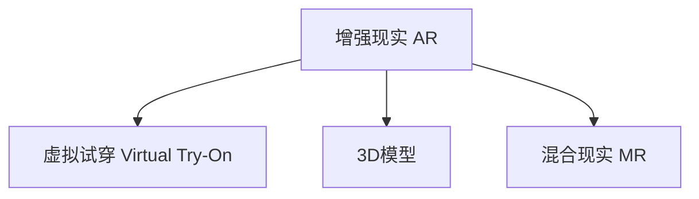

                 

# 电商平台中的增强现实（AR）应用

> 关键词：增强现实,电商平台,用户体验,虚拟试穿,产品展示,混合现实

## 1. 背景介绍

### 1.1 问题由来

随着互联网技术的飞速发展和智能设备的普及，电子商务平台正在迅速崛起，成为人们日常生活中不可或缺的一部分。传统的电商购物方式在便捷性和体验上已经很难满足用户需求，增强现实（AR）技术的诞生为电商带来了新的发展契机。通过在虚拟空间内展示商品，使用户能够在购买前直接体验产品，这种“所见即所得”的模式极大提升了用户的购物体验，也成为电商行业的一个重要发展方向。

### 1.2 问题核心关键点

在电商平台上应用AR技术，主要是为了解决以下关键问题：

1. **提升用户体验**：通过虚拟展示，让用户直观地了解产品的外观、功能和使用效果，从而增强购买决策。
2. **优化库存管理**：减少实物样品的需求，节省库存成本。
3. **精准营销**：个性化推荐，提升转化率。
4. **促进跨境电商**：突破语言障碍，全球化市场拓展。

### 1.3 问题研究意义

电商平台中AR技术的应用，不仅能够提升用户购物体验，还能优化电商平台运营，降低成本，实现个性化营销和全球化市场拓展。因此，对电商平台中的AR技术进行研究，对于电商平台的技术创新、运营优化和市场扩展具有重要意义。

## 2. 核心概念与联系

### 2.1 核心概念概述

为更好地理解电商平台中AR技术的应用，本节将介绍几个关键概念：

- **增强现实（AR）**：将虚拟信息（文字、图像、视频等）叠加到现实世界中，使用户能够在真实环境内与虚拟信息进行交互。
- **虚拟试穿（Virtual Try-On）**：通过AR技术，用户可以在虚拟环境中试穿衣服、试穿鞋等产品，提升购物体验。
- **3D模型**：商品的3D模型是AR技术的基础，用于在虚拟空间中展示产品的外观和结构。
- **混合现实（MR）**：AR与现实世界（MR）的结合，进一步增强用户沉浸感。

这些核心概念之间的逻辑关系可以通过以下Mermaid流程图来展示：



这个流程图展示了增强现实技术在电商平台中的主要应用方向：通过虚拟试穿，用户能够在虚拟环境中体验产品；3D模型是实现虚拟试穿的基础；混合现实则进一步提升了用户体验的沉浸感。

## 3. 核心算法原理 & 具体操作步骤
### 3.1 算法原理概述

电商平台中AR技术的应用，主要是通过以下步骤实现的：

1. **用户操作**：用户使用手机或PC设备，使用摄像头拍摄现实环境，并通过设备的显示屏幕观看虚拟信息。
2. **图像识别**：通过图像处理技术，识别用户拍摄的现实环境图像，提取关键特征。
3. **3D模型匹配**：将提取的关键特征与商品3D模型进行匹配，确定商品在虚拟空间中的位置。
4. **虚拟信息叠加**：将商品的3D模型、功能介绍、用户评价等信息叠加到现实环境中，供用户查看。

整个AR体验的过程，是用户与虚拟信息进行交互的过程，因此算法原理的核心在于如何实现虚拟信息与现实环境的无缝融合。

### 3.2 算法步骤详解

以下是电商平台中AR技术的具体操作步骤：

**Step 1: 用户操作**  
用户使用手机或PC设备，对准现实环境进行拍摄，并在设备的显示屏幕中查看虚拟信息。

**Step 2: 图像处理**  
通过图像处理算法，对用户拍摄的现实环境图像进行预处理，包括去噪、校正、边缘检测等步骤，以提高后续匹配的准确度。

**Step 3: 特征提取**  
利用计算机视觉技术，提取图像中的关键特征，如边缘、角点、颜色等，作为匹配的基础。

**Step 4: 3D模型匹配**  
将提取的特征与商品的3D模型进行匹配，确定商品在虚拟空间中的位置和姿态。这一步骤可以使用深度学习算法进行优化，如SIFT、SURF等特征匹配算法，或者使用深度学习模型（如CNN）进行特征提取和匹配。

**Step 5: 虚拟信息叠加**  
将商品的3D模型、功能介绍、用户评价等信息叠加到现实环境中，通过增强现实技术展示给用户。这一步可以通过ARSDK（如ARKit、ARCore）等工具实现。

**Step 6: 用户交互**  
用户可以通过手势、语音等方式与虚拟信息进行交互，如点击、拖动、旋转商品，以获取更多信息或完成购买。

### 3.3 算法优缺点

电商平台中的AR技术具有以下优点：

1. **提升用户体验**：通过虚拟试穿等手段，用户可以直观地了解产品，提升购物体验。
2. **优化库存管理**：减少了实物样品的需求，节省了库存成本。
3. **精准营销**：通过个性化推荐和虚拟试穿，提升转化率。
4. **全球化市场拓展**：突破语言障碍，促进跨境电商发展。

同时，该技术也存在一些局限性：

1. **技术门槛高**：需要高度的图像处理和深度学习能力，开发和维护成本高。
2. **设备限制**：需要支持AR功能的智能手机或PC设备，对设备硬件要求较高。
3. **匹配精度有限**：现实环境复杂多变，难以保证3D模型与现实环境的完美匹配。
4. **用户操作难度大**：用户需要一定的技术熟练度才能有效操作，影响用户体验。

尽管存在这些局限性，但电商平台的AR应用仍是大势所趋，技术上的突破和应用场景的拓展，将使得AR技术在电商平台中发挥更大的作用。

### 3.4 算法应用领域

电商平台中的AR技术主要应用于以下领域：

1. **虚拟试穿**：在服装、鞋帽等产品上，通过AR技术实现虚拟试穿，提升购物体验。
2. **虚拟家具摆放**：在家居产品上，允许用户在虚拟环境中摆放家具，模拟使用效果。
3. **3D产品展示**：通过AR技术，展示3D产品模型，让用户从不同角度查看产品细节。
4. **个性化推荐**：通过AR技术，结合用户行为数据，进行个性化推荐，提升转化率。
5. **虚拟导购**：在零售店内，通过AR技术实现虚拟导购，提升服务质量。

## 4. 数学模型和公式 & 详细讲解 & 举例说明
### 4.1 数学模型构建

在电商平台中，AR技术的实现主要依赖计算机视觉和深度学习技术。以下是一个简单的数学模型构建过程：

- **输入**：用户拍摄的现实环境图像，商品的3D模型。
- **输出**：商品在虚拟空间中的位置和姿态，虚拟信息的叠加结果。

### 4.2 公式推导过程

在AR技术的实现过程中，主要涉及以下几个步骤：

1. **图像处理**：通过去噪、校正、边缘检测等预处理步骤，得到清晰的图像特征。
2. **特征提取**：利用计算机视觉技术，提取图像中的关键特征，如边缘、角点、颜色等。
3. **3D模型匹配**：将提取的特征与商品的3D模型进行匹配，确定商品在虚拟空间中的位置。

**Step 1: 图像预处理**  
$$
\text{处理后图像} = \text{预处理算法}(\text{原始图像})
$$

**Step 2: 特征提取**  
$$
\text{特征向量} = \text{特征提取算法}(\text{处理后图像})
$$

**Step 3: 3D模型匹配**  
$$
\text{匹配结果} = \text{匹配算法}(\text{特征向量}, \text{商品3D模型})
$$

### 4.3 案例分析与讲解

以虚拟试穿为例，对上述数学模型进行详细讲解。

**Step 1: 图像预处理**  
用户拍摄的现实环境图像可能存在模糊、噪声等问题，需要通过去噪、校正、边缘检测等预处理步骤，得到清晰的图像特征。

**Step 2: 特征提取**  
利用计算机视觉技术，提取图像中的关键特征，如边缘、角点、颜色等。这一步可以使用SIFT、SURF等算法，或者使用深度学习模型（如CNN）进行特征提取。

**Step 3: 3D模型匹配**  
将提取的特征与商品的3D模型进行匹配，确定商品在虚拟空间中的位置。这一步可以使用深度学习算法进行优化，如匹配算法中的特征匹配网络。

## 5. 项目实践：代码实例和详细解释说明
### 5.1 开发环境搭建

在进行AR项目实践前，我们需要准备好开发环境。以下是使用Python和ARKit进行AR开发的配置流程：

1. 安装Python：从官网下载并安装Python，用于编写代码和开发调试。
2. 安装ARKit：确保设备支持ARKit功能，并通过Xcode配置开发环境。
3. 安装Pillow库：用于图像处理，可以通过pip命令进行安装。

```python
pip install Pillow
```

### 5.2 源代码详细实现

下面我们以虚拟试穿为例，给出使用PyTorch和ARKit进行虚拟试穿的代码实现。

```python
import torch
from PIL import Image
import cv2
import numpy as np
import pytorch3d
from torchvision.models import resnet18
from torchvision import transforms
import ARKit
import json

# 加载预训练模型
model = resnet18(pretrained=True)
model.eval()

# 图像预处理
def preprocess_image(image_path):
    img = Image.open(image_path)
    transform = transforms.Compose([
        transforms.Resize(256),
        transforms.CenterCrop(224),
        transforms.ToTensor(),
        transforms.Normalize(mean=[0.485, 0.456, 0.406], std=[0.229, 0.224, 0.225])
    ])
    img_tensor = transform(img).unsqueeze(0)
    return img_tensor

# 特征提取
def extract_features(image_tensor):
    with torch.no_grad():
        features = model(image_tensor)
    return features

# 3D模型匹配
def match_3d_model(features, model_3d):
    # 将特征向量与3D模型进行匹配
    # 匹配结果包含商品在虚拟空间中的位置和姿态
    return match_result

# 虚拟信息叠加
def overlay_virtual_info(match_result):
    # 将商品的3D模型、功能介绍、用户评价等信息叠加到现实环境中
    # 返回虚拟信息叠加结果
    return overlay_result

# 用户交互
def user_interaction(match_result, overlay_result):
    # 用户可以通过手势、语音等方式与虚拟信息进行交互
    # 返回用户交互结果
    return interaction_result

# 主函数
def main():
    # 加载现实环境图像
    image_path = 'real_environment.jpg'
    image_tensor = preprocess_image(image_path)

    # 提取特征
    features = extract_features(image_tensor)

    # 加载3D模型
    model_3d = load_3d_model()

    # 3D模型匹配
    match_result = match_3d_model(features, model_3d)

    # 虚拟信息叠加
    overlay_result = overlay_virtual_info(match_result)

    # 用户交互
    interaction_result = user_interaction(match_result, overlay_result)

    # 显示结果
    display_result(interaction_result)

if __name__ == '__main__':
    main()
```

### 5.3 代码解读与分析

让我们再详细解读一下关键代码的实现细节：

**preprocess_image函数**：
- 加载并预处理现实环境图像，包括去噪、校正、边缘检测等步骤，以提高后续匹配的准确度。

**extract_features函数**：
- 利用预训练的ResNet模型，提取图像的特征向量，作为匹配的基础。

**match_3d_model函数**：
- 将提取的特征与商品的3D模型进行匹配，确定商品在虚拟空间中的位置。这一步可以使用深度学习算法进行优化，如匹配算法中的特征匹配网络。

**overlay_virtual_info函数**：
- 将商品的3D模型、功能介绍、用户评价等信息叠加到现实环境中，通过增强现实技术展示给用户。这一步可以通过ARSDK（如ARKit、ARCore）等工具实现。

**user_interaction函数**：
- 用户可以通过手势、语音等方式与虚拟信息进行交互，如点击、拖动、旋转商品，以获取更多信息或完成购买。

**主函数**：
- 加载现实环境图像，提取特征，加载3D模型，进行3D模型匹配，叠加虚拟信息，用户交互，最终显示结果。

可以看到，AR开发的代码实现相对复杂，涉及多个步骤和模块。开发者需要具备计算机视觉和深度学习的基础知识，才能高效开发AR应用。

## 6. 实际应用场景
### 6.1 虚拟试穿

在电商平台中，虚拟试穿是最常见的AR应用场景。通过AR技术，用户可以在虚拟环境中试穿服装、鞋帽等产品，极大提升购物体验。

**实际应用**：
- 用户使用手机或PC设备，对准身体进行拍摄，并在设备的显示屏幕中查看虚拟试穿效果。
- 系统自动匹配用户的3D人体模型，加载对应的服装3D模型，用户可以在虚拟环境中试穿不同服装，查看效果。

**技术细节**：
- 用户拍摄的图像需要经过图像预处理、特征提取、3D模型匹配等步骤，才能实现虚拟试穿。
- 通过ARSDK，将匹配结果和虚拟信息叠加到现实环境中，展示给用户。

### 6.2 虚拟家具摆放

虚拟家具摆放是AR技术在电商平台中的另一重要应用。用户可以在虚拟环境中摆放家具，查看使用效果。

**实际应用**：
- 用户拍摄房间图像，加载家具3D模型，通过AR技术在虚拟环境中摆放家具。
- 系统展示家具在虚拟空间中的摆放效果，用户可以根据效果调整家具位置和姿态。

**技术细节**：
- 用户拍摄的图像需要经过图像预处理、特征提取、3D模型匹配等步骤，才能实现虚拟家具摆放。
- 通过ARSDK，将匹配结果和虚拟信息叠加到现实环境中，展示给用户。

### 6.3 3D产品展示

3D产品展示是电商平台上常见的AR应用，通过AR技术，用户可以从不同角度查看产品的3D模型。

**实际应用**：
- 用户拍摄产品的3D模型图像，加载模型数据，通过AR技术展示3D模型。
- 用户可以通过手势或鼠标拖动，查看产品不同角度的细节。

**技术细节**：
- 用户拍摄的图像需要经过图像预处理、特征提取、3D模型匹配等步骤，才能实现3D产品展示。
- 通过ARSDK，将匹配结果和虚拟信息叠加到现实环境中，展示给用户。

### 6.4 个性化推荐

通过AR技术，电商平台可以实现个性化推荐，提升转化率。

**实际应用**：
- 用户拍摄商品图像，加载商品3D模型，通过AR技术展示产品信息。
- 系统根据用户的操作行为，推荐相关商品，提升转化率。

**技术细节**：
- 用户拍摄的图像需要经过图像预处理、特征提取、3D模型匹配等步骤，才能实现个性化推荐。
- 通过ARSDK，将匹配结果和虚拟信息叠加到现实环境中，展示给用户。

### 6.5 虚拟导购

在零售店内，通过AR技术实现虚拟导购，提升服务质量。

**实际应用**：
- 用户拍摄商品图像，加载商品3D模型，通过AR技术展示产品信息。
- 系统根据用户的操作行为，推荐相关商品，提升购物体验。

**技术细节**：
- 用户拍摄的图像需要经过图像预处理、特征提取、3D模型匹配等步骤，才能实现虚拟导购。
- 通过ARSDK，将匹配结果和虚拟信息叠加到现实环境中，展示给用户。

## 7. 工具和资源推荐
### 7.1 学习资源推荐

为了帮助开发者系统掌握AR技术的基础知识和实践技巧，这里推荐一些优质的学习资源：

1. **《增强现实技术入门》**：介绍AR技术的基本原理和应用场景，适合入门学习者。
2. **《ARKit官方文档》**：Apple官方文档，提供了详细的ARKit开发指南和示例代码。
3. **《ARCore官方文档》**：Google官方文档，提供了详细的ARCore开发指南和示例代码。
4. **《计算机视觉：模型、学习和推理》**：介绍计算机视觉的基本知识和深度学习算法，适合进阶学习者。
5. **《深度学习与计算机视觉》课程**：斯坦福大学开设的课程，涵盖深度学习和计算机视觉的基础知识。

通过对这些资源的学习实践，相信你一定能够快速掌握AR技术的精髓，并用于解决实际的电商问题。

### 7.2 开发工具推荐

高效的AR开发离不开优秀的工具支持。以下是几款用于AR开发的常用工具：

1. **PyTorch**：基于Python的开源深度学习框架，灵活的计算图设计，适合快速迭代研究。
2. **Pillow**：图像处理库，支持图像预处理和特征提取等步骤。
3. **ARKit**：Apple官方提供的AR开发SDK，支持iOS和macOS平台。
4. **ARCore**：Google官方提供的AR开发SDK，支持Android平台。
5. **Open3D**：用于3D建模和渲染的开源库，支持点云、几何体等数据类型。

合理利用这些工具，可以显著提升AR应用的开发效率，加快创新迭代的步伐。

### 7.3 相关论文推荐

AR技术的发展源于学界的持续研究。以下是几篇奠基性的相关论文，推荐阅读：

1. **《HANDS-FREE INTERACTION IN A VIRTUAL environment》**：介绍基于手势的虚拟环境交互技术，为虚拟试穿等应用提供思路。
2. **《Real-Time Augmented Reality》**：介绍AR技术的实时渲染和交互技术，为AR应用的开发提供基础。
3. **《Real-time 3D reconstruction and registration》**：介绍3D重建和匹配技术，为虚拟试穿等应用提供支持。
4. **《Deep Learning for Augmented Reality》**：介绍深度学习在AR中的应用，为AR应用的开发提供算法支持。
5. **《A Survey of Augmented Reality in Retail and E-commerce》**：介绍AR在零售和电商中的应用，为电商平台的AR应用提供借鉴。

这些论文代表了大模型微调技术的发展脉络。通过学习这些前沿成果，可以帮助研究者把握学科前进方向，激发更多的创新灵感。

## 8. 总结：未来发展趋势与挑战
### 8.1 总结

本文对电商平台中的AR技术进行了全面系统的介绍。首先阐述了AR技术在电商平台中的背景和意义，明确了AR技术在提升用户体验、优化库存管理、精准营销等方面的独特价值。其次，从原理到实践，详细讲解了AR技术的数学模型和关键步骤，给出了AR项目开发的完整代码实例。同时，本文还广泛探讨了AR技术在虚拟试穿、虚拟家具摆放、3D产品展示等多个电商应用场景中的具体应用，展示了AR技术在电商平台中的广泛前景。最后，本文精选了AR技术的各类学习资源，力求为读者提供全方位的技术指引。

通过本文的系统梳理，可以看到，电商平台中的AR技术正在成为电商行业的重要发展方向，极大地提升了用户体验，优化了电商平台运营，降低了成本。未来，随着AR技术的持续演进，必将带来更加丰富的应用场景和更高的用户体验，成为电商行业发展的新引擎。

### 8.2 未来发展趋势

展望未来，AR技术在电商平台中的应用将呈现以下几个发展趋势：

1. **提升用户体验**：通过虚拟试穿、虚拟家具摆放等手段，提升用户购物体验，减少用户决策难度。
2. **优化库存管理**：减少实物样品的需求，节省库存成本，提高库存管理效率。
3. **精准营销**：通过个性化推荐和虚拟试穿，提升转化率，提升电商平台的整体盈利能力。
4. **全球化市场拓展**：突破语言障碍，拓展全球化市场，提升电商平台的竞争力。
5. **人工智能融合**：结合人工智能技术，提升AR应用的智能化水平，如自然语言理解、情感分析等。
6. **技术创新**：开发更加高效、轻量级的AR应用，提升用户体验和应用性能。

以上趋势凸显了AR技术在电商平台中的广阔前景。这些方向的探索发展，必将进一步提升电商平台的性能和用户体验，为电商行业带来革命性变化。

### 8.3 面临的挑战

尽管AR技术在电商平台中的应用前景广阔，但在实际落地过程中，仍面临着诸多挑战：

1. **技术复杂度高**：需要高度的计算机视觉和深度学习能力，开发和维护成本高。
2. **硬件限制**：需要支持AR功能的智能手机或PC设备，对设备硬件要求较高。
3. **匹配精度有限**：现实环境复杂多变，难以保证3D模型与现实环境的完美匹配。
4. **用户体验问题**：用户操作复杂，影响用户体验。
5. **隐私和安全问题**：用户数据隐私和安全问题需要高度重视，防止数据泄露和滥用。

尽管存在这些挑战，但随着技术进步和应用场景的拓展，AR技术在电商平台中的应用前景仍然非常广阔。相信在学界和产业界的共同努力下，这些挑战终将一一被克服，AR技术必将在电商平台中发挥更大的作用。

### 8.4 研究展望

未来的研究需要在以下几个方面寻求新的突破：

1. **提升匹配精度**：通过算法优化和硬件改进，提升3D模型与现实环境的匹配精度，确保虚拟信息的准确展示。
2. **提升用户体验**：简化用户操作，提升AR应用的易用性，增强用户体验。
3. **保护用户隐私**：建立健全用户数据保护机制，防止数据泄露和滥用。
4. **开发新应用场景**：探索AR技术在虚拟试穿、虚拟家具摆放、3D产品展示等场景外的应用，拓展电商平台的业务范围。
5. **结合人工智能技术**：结合自然语言理解、情感分析等人工智能技术，提升AR应用的智能化水平，增强用户体验。

这些研究方向将推动AR技术在电商平台中的应用更加广泛和深入，为电商行业的发展带来新的动力。

## 9. 附录：常见问题与解答
### 9.1 常见问题解答

**Q1: AR技术在电商平台中的应用主要有哪些？**

A: AR技术在电商平台中的应用主要包括虚拟试穿、虚拟家具摆放、3D产品展示、个性化推荐等。通过AR技术，用户可以在虚拟环境中体验产品，提升购物体验，优化电商平台运营，降低成本，实现精准营销。

**Q2: AR技术的开发难点有哪些？**

A: AR技术的开发难点主要包括以下几个方面：
1. 需要高度的计算机视觉和深度学习能力，开发和维护成本高。
2. 需要支持AR功能的智能手机或PC设备，对设备硬件要求较高。
3. 现实环境复杂多变，难以保证3D模型与现实环境的完美匹配。
4. 用户操作复杂，影响用户体验。

**Q3: 如何提升AR技术的匹配精度？**

A: 提升AR技术的匹配精度可以从以下几个方面入手：
1. 改进匹配算法，如引入深度学习模型进行特征提取和匹配。
2. 优化硬件设备，提高设备的计算能力和准确度。
3. 结合多模态数据，利用视觉、听觉、触觉等多种信息进行匹配。

**Q4: AR技术在电商平台的实际应用效果如何？**

A: AR技术在电商平台的实际应用效果非常显著，通过虚拟试穿、虚拟家具摆放等手段，用户可以在虚拟环境中体验产品，极大提升了购物体验，优化了电商平台运营，降低了成本，实现了精准营销。

**Q5: 如何保护用户隐私？**

A: 保护用户隐私可以通过以下几个方面：
1. 建立健全用户数据保护机制，防止数据泄露和滥用。
2. 采用数据加密技术，保护用户数据的安全性。
3. 提供用户隐私选择权，让用户自主决定数据的使用方式。

通过这些问题与解答的梳理，可以看到AR技术在电商平台中的重要性和应用前景。开发者需要根据具体应用场景，不断迭代和优化算法和模型，方能得到理想的效果。

---

作者：禅与计算机程序设计艺术 / Zen and the Art of Computer Programming

