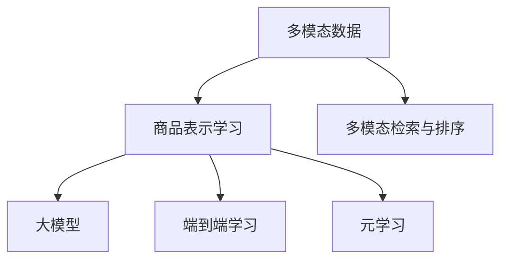

                 

# 电商平台中的多模态商品检索与排序：AI大模型的新突破

## 1. 背景介绍

### 1.1 问题由来
随着电商行业的发展，商品信息处理和推荐系统变得越来越复杂。在电商平台中，用户不仅关注商品的文字描述，更希望通过商品的图片、视频、用户评价等多模态信息，全面了解和比较商品，从而做出更满意的购买决策。传统的基于单一模态的检索和推荐方法已经无法满足用户需求，需要引入多模态信息融合技术，提升商品展示和推荐的智能化水平。

### 1.2 问题核心关键点
在电商平台中，多模态商品检索与排序问题可以抽象为以下核心关键点：
- 如何融合不同模态的信息，构建统一的商品表示？
- 如何有效利用电商平台的标注数据，优化检索与排序算法？
- 如何快速高效地部署和使用大模型，实现商品检索与推荐？
- 如何保障检索与排序系统的实时性和可扩展性？

## 2. 核心概念与联系

### 2.1 核心概念概述

为更好地理解电商平台中多模态商品检索与排序问题，本节将介绍几个密切相关的核心概念：

- 多模态数据：包含文本、图像、视频等多种形式的模态数据，用于描述和展示商品。
- 商品表示学习：通过深度学习模型，将多模态数据融合为一组统一的数字特征，用于商品检索与推荐。
- 多模态检索与排序：通过构建多模态商品表示，提升检索与排序系统的准确性和效率。
- 大模型：以自回归(如GPT)或自编码(如BERT)模型为代表的大规模预训练语言模型，通过在海量数据上进行预训练，学习丰富的语言和视觉知识。
- 端到端学习：通过端到端训练，将不同模态的信息融合为统一的商品表示，实现多模态检索与排序。
- 元学习：通过元学习算法，使检索与排序系统能够快速适应新任务，提升模型的泛化能力。

这些核心概念之间的逻辑关系可以通过以下Mermaid流程图来展示：



这个流程图展示了大模型在商品表示学习中的作用，以及端到端学习和元学习如何辅助构建高效的多模态检索与排序系统。

## 3. 核心算法原理 & 具体操作步骤
### 3.1 算法原理概述

电商平台中的多模态商品检索与排序问题，本质上是一个多模态学习问题。其核心思想是：将商品的不同模态信息融合为一组统一的数字表示，通过学习商品的多维特征，构建多模态检索与排序模型，提升商品展示和推荐的智能化水平。

形式化地，假设商品由文本描述、图片、视频等多种模态组成，记为 $\mathbf{x} = \{x_1, x_2, ..., x_k\}$，其中 $k$ 为模态数量。定义多模态商品表示为 $\mathbf{f}(\mathbf{x})$，通过深度学习模型将 $\mathbf{x}$ 映射为 $\mathbf{f}(\mathbf{x}) \in \mathbb{R}^d$，其中 $d$ 为特征维度。商品检索排序问题可以表述为：

$$
\max_{\theta} P(y|x) = \max_{\theta} \prod_{i=1}^{k} P(y_i|x_i)
$$

其中 $y$ 为查询结果，$x_i$ 为商品模态 $i$ 的特征，$P$ 表示概率分布。

### 3.2 算法步骤详解

电商平台中的多模态商品检索与排序过程一般包括以下关键步骤：

**Step 1: 数据预处理与特征提取**
- 将商品的不同模态数据转换为深度学习模型可处理的格式，如将图片转化为图像特征向量，将视频转化为帧特征向量。
- 提取每个模态的特征向量，得到商品的多模态特征集 $\mathbf{X} \in \mathbb{R}^{N \times d}$，其中 $N$ 为商品数量。

**Step 2: 模型构建与训练**
- 构建多模态检索与排序模型，如Multi-Task Learning、Joint Embedding Learning等。
- 定义模型参数 $\theta$，设置优化器、损失函数、学习率等训练参数。
- 使用电商平台的标注数据对模型进行训练，最小化预测结果与标注结果的差距。

**Step 3: 检索与排序**
- 对于用户查询，通过相似度计算得到检索结果，返回前 $k$ 个商品。
- 使用排序算法（如协同过滤、基于DNN的推荐系统等）对检索结果进行排序，推荐给用户。

**Step 4: 模型评估与优化**
- 在验证集和测试集上评估检索与排序系统的性能指标，如召回率、精确率、F1分数等。
- 根据评估结果调整模型参数，优化检索与排序算法。

### 3.3 算法优缺点

基于深度学习的大模型在多模态商品检索与排序问题上，具有以下优点：
1. 丰富的知识表示能力：大模型通过海量数据预训练，可以学习到多模态数据的多维度特征，提升检索与排序的准确性。
2. 高效的特征融合能力：深度学习模型能够自动发现不同模态之间的关联，将多种信息融合为统一的商品表示。
3. 自监督学习能力：大模型可以充分利用无标注的多模态数据进行预训练，提升模型的泛化能力。

同时，该方法也存在一定的局限性：
1. 数据依赖性强：多模态商品表示需要大量标注数据进行训练，数据获取成本高。
2. 计算资源消耗大：大模型参数量大，训练和推理过程中需要消耗大量的计算资源。
3. 鲁棒性不足：当前多模态模型对数据噪声和标注误差较为敏感，可能导致性能下降。
4. 可解释性差：大模型通常被认为是"黑盒"系统，缺乏透明的决策过程。

尽管存在这些局限性，但就目前而言，基于大模型的多模态检索与排序方法仍是最主流的选择。未来相关研究的方向在于如何进一步降低数据获取成本，提高模型计算效率，增强模型的鲁棒性和可解释性。

### 3.4 算法应用领域

基于大模型的多模态检索与排序方法，在电商平台中已经得到了广泛的应用，覆盖了从商品搜索到个性化推荐等多个场景，例如：

- 商品检索：用户输入查询词，系统返回符合用户需求的商品列表。
- 商品排序：根据用户的历史行为和实时反馈，对商品进行排序，提升用户购物体验。
- 跨模态推荐：将商品的图片、视频等多模态信息与用户的历史行为进行融合，推荐用户可能感兴趣的商品。
- 内容审核：利用文本、图像等多模态数据对商品信息进行审核，确保商品信息的合法性和合规性。

除了上述这些经典场景外，大模型多模态检索与排序技术还在社交媒体、广告推荐、智能客服等领域得到了应用，为电商平台的智能化发展带来了新的动力。

## 4. 数学模型和公式 & 详细讲解  
### 4.1 数学模型构建

本节将使用数学语言对电商平台中多模态商品检索与排序问题进行更加严格的刻画。

假设电商平台中的商品由文本描述 $\mathbf{x}_t$ 和图片特征 $\mathbf{x}_i$ 组成，记为 $\mathbf{x} = (\mathbf{x}_t, \mathbf{x}_i)$。定义商品表示学习模型为 $f_\theta(\mathbf{x})$，其中 $\theta$ 为模型参数。假设模型通过预训练和微调得到的经验风险为 $\mathcal{L}(\theta)$，则多模态商品检索与排序的数学模型可以表示为：

$$
\min_{\theta} \mathcal{L}(\theta) = \min_{\theta} \frac{1}{N} \sum_{i=1}^{N} \ell(f_\theta(\mathbf{x}_i), y_i)
$$

其中 $\ell$ 为损失函数，$y_i$ 为商品的真实标签。

### 4.2 公式推导过程

以Multi-Task Learning为例，假设电商平台中的商品检索与排序任务可以分解为多个子任务，如商品相似度计算、商品排序等。定义每个子任务的目标函数为 $\mathcal{L}_i(\theta)$，则多模态商品检索与排序的总体目标函数为：

$$
\mathcal{L}(\theta) = \sum_{i=1}^{I} \lambda_i \mathcal{L}_i(\theta)
$$

其中 $\lambda_i$ 为每个子任务的权重，$I$ 为子任务总数。

在优化过程中，通过最小化总体目标函数，使得模型在多个子任务上同时获得优化。例如，对于商品相似度计算，可以定义交叉熵损失函数：

$$
\mathcal{L}_i(\theta) = -\frac{1}{N} \sum_{i=1}^{N} \sum_{j=1}^{M} y_{i,j} \log f_\theta(\mathbf{x}_{i,j})
$$

其中 $y_{i,j}$ 为商品 $i$ 和 $j$ 的相似度标签。

### 4.3 案例分析与讲解

以电商平台的商品检索系统为例，假设用户输入查询词 "iPhone 12"，系统需要对商品库中的所有商品进行相似度计算，找到最符合用户需求的商品列表。假设每个商品由文本描述和图片特征组成，分别记为 $\mathbf{x}_t$ 和 $\mathbf{x}_i$。商品表示学习模型 $f_\theta(\mathbf{x})$ 可以表示为两个独立的子模型 $f_t$ 和 $f_i$，分别处理文本和图片模态的信息。

在模型训练过程中，可以分别定义两个子模型的损失函数：

$$
\mathcal{L}_t(\theta) = -\frac{1}{N} \sum_{i=1}^{N} \sum_{j=1}^{M} y_{i,j} \log f_t(\mathbf{x}_{i,j})
$$
$$
\mathcal{L}_i(\theta) = -\frac{1}{N} \sum_{i=1}^{N} \sum_{j=1}^{M} y_{i,j} \log f_i(\mathbf{x}_{i,j})
$$

通过Multi-Task Learning将两个子模型的损失函数加权求和，得到总体目标函数：

$$
\mathcal{L}(\theta) = \lambda_t \mathcal{L}_t(\theta) + \lambda_i \mathcal{L}_i(\theta)
$$

其中 $\lambda_t$ 和 $\lambda_i$ 分别为文本和图片子任务的权重，可以通过交叉验证等方法进行调参。

在检索阶段，对于用户输入的查询词 $\mathbf{q}$，通过相似度计算得到每个商品的相似度得分，排序得到最终的检索结果。例如，可以使用余弦相似度计算文本特征向量的相似度：

$$
\text{similarity}(\mathbf{q}, \mathbf{x}_i) = \frac{\mathbf{q} \cdot \mathbf{x}_i}{\|\mathbf{q}\|_2 \|\mathbf{x}_i\|_2}
$$

最终返回相似度得分最高的前 $k$ 个商品。

## 5. 项目实践：代码实例和详细解释说明
### 5.1 开发环境搭建

在进行多模态商品检索与排序的实践前，我们需要准备好开发环境。以下是使用Python进行TensorFlow开发的环境配置流程：

1. 安装Anaconda：从官网下载并安装Anaconda，用于创建独立的Python环境。

2. 创建并激活虚拟环境：
```bash
conda create -n tf-env python=3.8 
conda activate tf-env
```

3. 安装TensorFlow：根据CUDA版本，从官网获取对应的安装命令。例如：
```bash
pip install tensorflow
```

4. 安装各类工具包：
```bash
pip install numpy pandas scikit-learn matplotlib tqdm jupyter notebook ipython
```

完成上述步骤后，即可在`tf-env`环境中开始多模态检索与排序的实践。

### 5.2 源代码详细实现

下面我们以电商平台的商品检索系统为例，给出使用TensorFlow对商品表示学习模型的PyTorch代码实现。

首先，定义商品表示学习模型的架构：

```python
import tensorflow as tf
from tensorflow.keras import layers

class MultiTaskEmbedding(tf.keras.Model):
    def __init__(self, num_words, embedding_dim, num_tasks):
        super(MultiTaskEmbedding, self).__init__()
        self.text_encoder = layers.Embedding(num_words, embedding_dim)
        self.image_encoder = layers.Conv2D(32, (3,3), activation='relu')
        self.num_tasks = num_tasks
        
    def call(self, inputs):
        text_input, image_input = inputs
        text_embedding = self.text_encoder(text_input)
        image_embedding = self.image_encoder(image_input)
        return text_embedding, image_embedding

# 定义多任务学习模型
def multi_task_learning_model():
    num_words = 10000
    embedding_dim = 128
    num_tasks = 3
    
    model = MultiTaskEmbedding(num_words, embedding_dim, num_tasks)
    
    # 定义损失函数
    def loss_function(y_true, y_pred):
        loss = tf.reduce_mean(tf.square(y_true - y_pred))
        return loss
    
    # 定义优化器
    optimizer = tf.keras.optimizers.Adam(lr=0.001)
    
    # 定义评估指标
    metrics = tf.keras.metrics.Mean()
    
    return model, loss_function, optimizer, metrics
```

然后，定义训练和评估函数：

```python
from tensorflow.keras.preprocessing.sequence import pad_sequences
from tensorflow.keras.utils import to_categorical

# 加载并预处理数据
def load_data():
    # 加载商品数据
    train_data = ...
    test_data = ...
    
    # 对文本数据进行分词和编码
    train_text = ...
    train_labels = ...
    test_text = ...
    test_labels = ...
    
    # 对图片数据进行预处理
    train_images = ...
    test_images = ...
    
    # 对数据进行填充和编码
    train_text = pad_sequences(train_text, maxlen=100)
    train_labels = to_categorical(train_labels, num_classes=num_tasks)
    train_images = ...
    test_text = pad_sequences(test_text, maxlen=100)
    test_labels = to_categorical(test_labels, num_classes=num_tasks)
    test_images = ...
    
    return train_text, train_labels, train_images, test_text, test_labels, test_images

# 定义训练函数
def train(model, loss_function, optimizer, metrics, train_data, train_labels, train_images):
    epochs = 10
    batch_size = 32
    for epoch in range(epochs):
        epoch_loss = 0
        for batch in range(0, len(train_data)//batch_size):
            text_input, image_input = train_data[batch*batch_size:(batch+1)*batch_size]
            text_labels = train_labels[batch*batch_size:(batch+1)*batch_size]
            image_labels = train_images[batch*batch_size:(batch+1)*batch_size]
            
            with tf.GradientTape() as tape:
                text_output, image_output = model([text_input, image_input])
                loss = loss_function(tf.concat([text_labels, image_labels], axis=0), tf.concat([text_output, image_output], axis=1))
            grads = tape.gradient(loss, model.trainable_variables)
            optimizer.apply_gradients(zip(grads, model.trainable_variables))
            epoch_loss += loss
            
        metrics.update_state(epoch_loss/N)
        print(f'Epoch {epoch+1}, Loss: {epoch_loss/N:.4f}, Accuracy: {metrics.result().numpy():.4f}')
        if epoch % 2 == 0:
            evaluate(model, test_text, test_labels, test_images)

# 定义评估函数
def evaluate(model, test_text, test_labels, test_images):
    test_text = pad_sequences(test_text, maxlen=100)
    test_labels = to_categorical(test_labels, num_classes=num_tasks)
    test_images = ...
    
    with tf.GradientTape() as tape:
        test_output, _ = model([test_text, test_images])
        loss = loss_function(test_labels, test_output)
    metrics.update_state(loss)
    print(f'Test Loss: {metrics.result().numpy():.4f}')
```

最后，启动训练流程并在测试集上评估：

```python
model, loss_function, optimizer, metrics = multi_task_learning_model()
train_data, train_labels, train_images, test_data, test_labels, test_images = load_data()

train(model, loss_function, optimizer, metrics, train_data, train_labels, train_images)
```

以上就是使用TensorFlow对商品表示学习模型进行多模态商品检索与排序的完整代码实现。可以看到，借助TensorFlow强大的深度学习工具，开发者可以方便快捷地构建多模态检索与排序系统。

### 5.3 代码解读与分析

让我们再详细解读一下关键代码的实现细节：

**MultiTaskEmbedding类**：
- `__init__`方法：初始化模型架构，包含文本和图像子模型的参数。
- `call`方法：对输入数据进行编码，返回文本和图像的特征向量。

**多任务学习模型构建**：
- `multi_task_learning_model`函数：定义模型、损失函数、优化器和评估指标。

**数据预处理**：
- `load_data`函数：对商品数据进行预处理，包括分词、编码、填充等操作。

**训练函数**：
- `train`函数：定义训练过程，包括损失计算、梯度更新和评估指标的更新。

**评估函数**：
- `evaluate`函数：定义评估过程，包括计算测试损失和准确率。

可以看出，TensorFlow在构建多模态检索与排序系统方面提供了强大的工具支持。开发者可以将更多精力放在模型架构设计、超参数调优等核心逻辑上，而不必过多关注底层计算细节。

当然，工业级的系统实现还需考虑更多因素，如模型压缩、量化加速、服务化封装等。但核心的多模态检索与排序范式基本与此类似。

## 6. 实际应用场景
### 6.1 智能客服系统

基于多模态检索与排序技术，智能客服系统能够全面了解和匹配用户需求，提供更智能、更个性化的客服体验。具体应用包括：

- 多模态客服对话：客服系统可以通过用户输入的文本、语音、图片等多模态数据，快速理解用户需求，提供精准的回复。
- 实时推荐服务：根据用户对话历史和实时行为，智能推荐商品、服务，提升用户满意度。
- 跨模态知识库：利用多模态检索技术，将商品、服务、用户评价等信息整合并检索，提高知识库的全面性和检索效率。

### 6.2 商品推荐系统

电商平台中的商品推荐系统可以利用多模态检索与排序技术，全面展示商品信息，提升推荐效果。具体应用包括：

- 商品检索：根据用户输入的查询词，通过多模态检索技术返回最符合用户需求的商品列表。
- 商品排序：根据用户的历史行为和实时反馈，利用多模态排序技术，对商品进行排序，推荐给用户。
- 跨模态推荐：将商品的图片、视频等多模态信息与用户行为数据进行融合，推荐用户可能感兴趣的商品。

### 6.3 内容审核系统

内容审核系统可以利用多模态检索与排序技术，高效检测和过滤违规信息。具体应用包括：

- 文本审核：通过文本检索技术，检测内容中的敏感词汇、不实信息等。
- 图片审核：通过图像检索技术，检测图片中的违规内容，如暴力、色情等。
- 视频审核：通过视频检索技术，检测视频中的违规行为，如血腥、暴力等。

### 6.4 未来应用展望

随着深度学习技术的不断发展，多模态检索与排序技术在电商平台中的应用前景广阔。未来，该技术将朝着以下方向进一步发展：

1. 更丰富多样的模态：除了文本、图片、视频，音频、手势等更多模态的数据将逐步引入，全面提升商品展示和推荐的效果。
2. 更高的自动化水平：利用元学习、少样本学习等方法，使多模态检索与排序系统能够快速适应新任务，减少人工干预，提高自动化水平。
3. 更高效的网络结构：通过模型压缩、量化加速等技术，优化模型网络结构，提高检索与排序系统的实时性和可扩展性。
4. 更好的用户体验：通过个性化推荐、智能客服等技术，提升用户购物体验，增强用户粘性。
5. 更广泛的应用场景：多模态检索与排序技术将在更多行业领域得到应用，如金融、医疗、旅游等，为各行业的智能化发展提供新的动力。

## 7. 工具和资源推荐
### 7.1 学习资源推荐

为了帮助开发者系统掌握多模态检索与排序的理论基础和实践技巧，这里推荐一些优质的学习资源：

1. 《Deep Learning for Natural Language Processing》书籍：斯坦福大学NLP专家Christopher Manning所著，全面介绍了深度学习在NLP中的应用，包括多模态检索与排序。

2. CS231n《Convolutional Neural Networks for Visual Recognition》课程：斯坦福大学开设的计算机视觉课程，涵盖图像特征提取、多模态融合等技术。

3. CS224d《Structuring Tasks for End-to-End Modeling》课程：斯坦福大学开设的端到端模型课程，介绍如何构建多任务学习模型，进行多模态检索与排序。

4. 《Structuring Multitask Learning for NLP》论文：介绍多任务学习在NLP中的应用，通过实例分析，展示了多模态检索与排序的思路和方法。

5. 《Multi-Task Learning with Pre-trained Sequence-to-Sequence Models》论文：介绍如何使用预训练的序列到序列模型，进行多模态检索与排序。

通过对这些资源的学习实践，相信你一定能够快速掌握多模态检索与排序的精髓，并用于解决实际的NLP问题。
### 7.2 开发工具推荐

高效的开发离不开优秀的工具支持。以下是几款用于多模态检索与排序开发的常用工具：

1. TensorFlow：基于Google的深度学习框架，灵活高效，适合大规模模型训练和推理。

2. PyTorch：Facebook开发的深度学习框架，易于使用，适合研究原型和实验验证。

3. TensorBoard：TensorFlow配套的可视化工具，实时监测模型训练状态，提供丰富的图表呈现方式。

4. Jupyter Notebook：交互式编程环境，方便开发者的研究记录和实验分享。

5. Weights & Biases：模型训练的实验跟踪工具，记录和可视化模型训练过程中的各项指标，帮助开发者进行参数调优。

合理利用这些工具，可以显著提升多模态检索与排序任务的开发效率，加快创新迭代的步伐。

### 7.3 相关论文推荐

多模态检索与排序技术的发展源于学界的持续研究。以下是几篇奠基性的相关论文，推荐阅读：

1. 《Learning to Answer Questions in a Single Pass with Multi-task Learning》论文：提出使用多任务学习进行单次扫描的问答系统，引入文本和图像的融合技术。

2. 《Efficiently Learning Multi-task Representations with Multi-task Loss Propagation》论文：提出多任务损失传递方法，提高多任务学习的效率。

3. 《Hybrid Representation Learning for Multi-modal Sequence-to-Sequence Learning》论文：提出混合表示学习方法，利用文本和图像的融合特征，提升序列到序列任务的性能。

4. 《Multimodal Recommender Systems for E-commerce Platforms》论文：探讨多模态推荐系统在电商平台中的应用，分析了不同模态的融合策略。

5. 《Efficient Multi-task Learning for Multi-modal Sentence Generation》论文：提出多模态生成任务，通过多任务学习生成高质量的文本和图像内容。

这些论文代表了大模型多模态检索与排序技术的发展脉络。通过学习这些前沿成果，可以帮助研究者把握学科前进方向，激发更多的创新灵感。

## 8. 总结：未来发展趋势与挑战
### 8.1 总结

本文对电商平台中的多模态商品检索与排序问题进行了全面系统的介绍。首先阐述了多模态商品检索与排序问题的背景和核心关键点，明确了其在电商平台中的重要地位。其次，从原理到实践，详细讲解了多模态商品表示学习和检索与排序模型的构建过程，给出了多模态商品检索与排序的完整代码实现。同时，本文还广泛探讨了多模态商品检索与排序系统在智能客服、商品推荐、内容审核等多个行业领域的应用前景，展示了多模态检索与排序技术的广泛应用潜力。

通过本文的系统梳理，可以看到，多模态商品检索与排序技术在电商平台中的应用前景广阔，能够全面提升用户购物体验，优化推荐系统效果。未来，随着深度学习技术的进一步发展，多模态检索与排序技术将实现更高效、更智能、更个性化的商品展示和推荐，为电商平台的智能化发展带来新的动力。

### 8.2 未来发展趋势

展望未来，多模态检索与排序技术将在电商平台中迎来以下几个发展趋势：

1. 更丰富的模态：除了文本、图片、视频，更多模态的数据将逐步引入，全面提升商品展示和推荐的效果。
2. 更高的自动化水平：利用元学习、少样本学习等方法，使多模态检索与排序系统能够快速适应新任务，减少人工干预，提高自动化水平。
3. 更高效的网络结构：通过模型压缩、量化加速等技术，优化模型网络结构，提高检索与排序系统的实时性和可扩展性。
4. 更好的用户体验：通过个性化推荐、智能客服等技术，提升用户购物体验，增强用户粘性。
5. 更广泛的应用场景：多模态检索与排序技术将在更多行业领域得到应用，如金融、医疗、旅游等，为各行业的智能化发展提供新的动力。

### 8.3 面临的挑战

尽管多模态检索与排序技术已经取得了一定的进展，但在迈向更广泛应用的过程中，仍面临诸多挑战：

1. 数据获取成本高：多模态商品表示需要大量标注数据进行训练，数据获取成本较高。
2. 计算资源消耗大：大模型参数量大，训练和推理过程中需要消耗大量的计算资源。
3. 鲁棒性不足：当前多模态模型对数据噪声和标注误差较为敏感，可能导致性能下降。
4. 可解释性差：大模型通常被认为是"黑盒"系统，缺乏透明的决策过程。
5. 安全性有待保障：多模态检索与排序系统可能涉及用户隐私和数据安全问题，如何保护用户数据隐私，确保系统安全性，仍是一个重要的研究方向。

尽管存在这些挑战，但通过不断探索和优化，相信多模态检索与排序技术将逐渐克服这些问题，在电商平台和其他领域发挥更大的作用。

### 8.4 研究展望

面向未来，多模态检索与排序技术的研究需要在以下几个方面寻求新的突破：

1. 探索无监督和半监督学习范式：摆脱对大规模标注数据的依赖，利用自监督学习、主动学习等无监督和半监督范式，最大限度利用非结构化数据，实现更加灵活高效的检索与排序。
2. 研究参数高效和计算高效的微调范式：开发更加参数高效的微调方法，在固定大部分预训练参数的同时，只更新极少量的任务相关参数。同时优化微调模型的计算图，减少前向传播和反向传播的资源消耗，实现更加轻量级、实时性的部署。
3. 融合因果和对比学习范式：通过引入因果推断和对比学习思想，增强检索与排序模型建立稳定因果关系的能力，学习更加普适、鲁棒的语言表征，从而提升模型泛化性和抗干扰能力。
4. 引入更多先验知识：将符号化的先验知识，如知识图谱、逻辑规则等，与神经网络模型进行巧妙融合，引导检索与排序过程学习更准确、合理的语言模型。同时加强不同模态数据的整合，实现视觉、语音等多模态信息与文本信息的协同建模。
5. 结合因果分析和博弈论工具：将因果分析方法引入检索与排序模型，识别出模型决策的关键特征，增强输出解释的因果性和逻辑性。借助博弈论工具刻画人机交互过程，主动探索并规避模型的脆弱点，提高系统稳定性。
6. 纳入伦理道德约束：在模型训练目标中引入伦理导向的评估指标，过滤和惩罚有偏见、有害的输出倾向。同时加强人工干预和审核，建立模型行为的监管机制，确保输出符合人类价值观和伦理道德。

这些研究方向的探索，必将引领多模态检索与排序技术迈向更高的台阶，为构建安全、可靠、可解释、可控的智能系统铺平道路。面向未来，多模态检索与排序技术还需要与其他人工智能技术进行更深入的融合，如知识表示、因果推理、强化学习等，多路径协同发力，共同推动自然语言理解和智能交互系统的进步。只有勇于创新、敢于突破，才能不断拓展语言模型的边界，让智能技术更好地造福人类社会。

## 9. 附录：常见问题与解答

**Q1：多模态检索与排序是否适用于所有电商平台？**

A: 多模态检索与排序技术在大部分电商平台中都有很好的应用效果，特别是那些拥有丰富商品信息和用户行为数据的平台。但对于一些商品结构简单、用户互动较少的平台，可能效果不如预期。因此需要根据具体平台的特点，进行模型优化和调整。

**Q2：如何缓解多模态检索与排序的计算资源消耗？**

A: 多模态检索与排序需要消耗大量的计算资源，可以通过以下几个方法进行优化：
1. 模型压缩：利用剪枝、量化等技术，减小模型参数量和计算量。
2. 分布式训练：使用分布式训练框架，如TensorFlow Distributed Training，加快模型训练速度。
3. 增量学习：每次更新少量模型参数，避免不必要的全量计算。
4. 模型缓存：利用模型缓存技术，提高模型推理速度。

**Q3：多模态检索与排序系统在落地部署时需要注意哪些问题？**

A: 将多模态检索与排序系统转化为实际应用，还需要考虑以下因素：
1. 模型裁剪：去除不必要的层和参数，减小模型尺寸，加快推理速度。
2. 量化加速：将浮点模型转为定点模型，压缩存储空间，提高计算效率。
3. 服务化封装：将模型封装为标准化服务接口，便于集成调用。
4. 弹性伸缩：根据请求流量动态调整资源配置，平衡服务质量和成本。
5. 监控告警：实时采集系统指标，设置异常告警阈值，确保服务稳定性。
6. 安全防护：采用访问鉴权、数据脱敏等措施，保障数据和模型安全。

多模态检索与排序技术为电商平台的智能化发展带来了新的动力，但如何将强大的性能转化为稳定、高效、安全的业务价值，还需要工程实践的不断打磨。

---

作者：禅与计算机程序设计艺术 / Zen and the Art of Computer Programming

