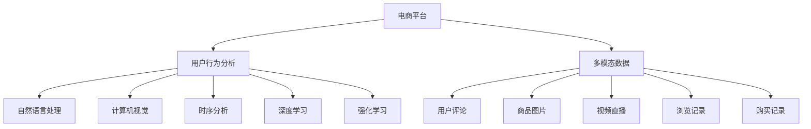

                 

# 电商平台中的多模态用户行为分析

> 关键词：电商平台, 用户行为分析, 多模态数据, 自然语言处理(NLP), 计算机视觉(CV), 时序分析, 深度学习, 强化学习

## 1. 背景介绍

随着电子商务的迅猛发展，电商平台已成为连接消费者和商家、推动商品交易的重要平台。为提升用户体验、优化用户行为、增加销售额，平台需要深入分析用户行为数据，从中挖掘出有价值的见解和洞见。

用户行为数据多源异构，涉及文本、图片、视频、时间序列等多种类型。传统的用户行为分析通常仅关注单一数据源，难以充分捕捉用户行为的全貌。多模态分析方法，通过综合利用多种数据源，可以提供更全面、更深入的行为洞察，从而更好地满足业务需求。

本博客将详细探讨如何在电商平台中应用多模态分析技术，分析用户行为，提升电商平台的业务价值。

## 2. 核心概念与联系

### 2.1 核心概念概述

为了更好地理解多模态用户行为分析的原理和应用，首先需介绍几个核心概念：

- **电商平台(E-Commerce Platform)**：指通过互联网提供商品展示、交易、物流、支付等服务的平台。常见的电商平台包括淘宝、京东、Amazon等。
- **用户行为分析(User Behavior Analysis, UBA)**：指对用户在平台上的行为数据进行收集、清洗、分析和挖掘的过程。主要目的在于理解用户需求、预测用户行为、提升用户满意度、增加转化率等。
- **多模态数据(Multimodal Data)**：指包含不同类型数据源的信息，如文本、图片、视频、音频、时间序列等。电商平台中，常见的多模态数据包括用户评论、商品图片、视频直播、浏览记录、购买记录等。
- **自然语言处理(Natural Language Processing, NLP)**：指处理和分析人类语言的技术，常用于分析用户评论、客服对话等文本数据。
- **计算机视觉(Computer Vision, CV)**：指使用计算机技术处理、分析和理解视觉数据的科学，常用于商品图片分类、商品展示、广告投放等。
- **时序分析(Time Series Analysis)**：指对时间序列数据进行建模和预测的技术，常用于用户行为预测、交易预测等。
- **深度学习(Deep Learning)**：指利用神经网络等模型进行数据建模和预测的技术，常用于处理多模态数据、分析复杂行为。
- **强化学习(Reinforcement Learning)**：指通过试错学习最优策略的技术，常用于电商平台推荐系统、个性化定价等。

这些核心概念共同构成了电商平台中多模态用户行为分析的技术框架，使得我们可以在多种数据源上深入理解用户行为，提升平台的用户体验和商业价值。

### 2.2 核心概念联系

这些核心概念之间的关系可以通过以下Mermaid流程图来展示：



该流程图展示了多模态数据在电商平台中的应用过程：

1. 电商平台收集各种类型的多模态数据。
2. 对不同类型的数据分别进行自然语言处理、计算机视觉、时序分析和深度学习分析。
3. 最后，将分析结果综合起来，通过强化学习进行策略优化。

## 3. 核心算法原理 & 具体操作步骤
### 3.1 算法原理概述

电商平台中的多模态用户行为分析，本质上是利用深度学习模型对多种类型的数据进行联合分析的过程。其核心思想是：将不同类型的数据转化为同一维度的特征向量，然后通过多任务学习、联合嵌入等方法，共同学习出一个包含多维度信息的综合表示。

具体来说，算法原理可以概括为以下几个步骤：

1. **数据预处理**：收集并清洗多模态数据，将其转换为模型可处理的形式。
2. **特征提取**：使用深度学习模型，将不同类型的数据转化为向量表示。
3. **联合分析**：将不同类型的数据的向量表示进行融合，共同学习出一个综合的表示。
4. **多任务学习**：将不同任务的目标函数进行组合，同时优化多个任务。
5. **模型优化**：使用优化算法，如梯度下降、Adam等，最小化模型损失函数。
6. **结果评估**：在验证集和测试集上评估模型的性能，并不断调整模型参数。

### 3.2 算法步骤详解

以下是详细的算法步骤及其解释：

**Step 1: 数据预处理**
- **数据收集**：从电商平台中收集多种类型的数据，包括用户评论、商品图片、视频直播、浏览记录、购买记录等。
- **数据清洗**：去除噪声数据和异常值，填补缺失值，对数据进行标准化和归一化处理。
- **数据转换**：将不同类型的数据转换为同一维度的向量表示，如将文本转换为词嵌入向量、将图片转换为特征向量、将时间序列转换为频域或时域特征向量。

**Step 2: 特征提取**
- **自然语言处理**：使用预训练的NLP模型（如BERT、GPT等），将用户评论转换为词嵌入向量。
- **计算机视觉**：使用预训练的CV模型（如ResNet、Inception等），将图片转换为特征向量。
- **时序分析**：使用时间序列模型（如RNN、LSTM、Transformer等），将浏览记录和购买记录转换为特征向量。
- **深度学习**：使用多任务学习模型（如BiLSTM、GRU、Transformer等），对不同类型的数据进行联合建模，共同学习出一个综合的表示。

**Step 3: 联合分析**
- **多任务学习**：将不同任务的目标函数进行组合，共同优化模型的参数。
- **联合嵌入**：使用联合嵌入技术，将不同类型的数据的向量表示进行融合，学习出一个包含多维度信息的综合表示。

**Step 4: 模型优化**
- **优化算法**：使用优化算法（如梯度下降、Adam等），最小化模型损失函数。
- **超参数调优**：根据模型性能，不断调整学习率、批次大小、层数等超参数。

**Step 5: 结果评估**
- **验证集评估**：在验证集上评估模型的性能，记录准确率、召回率、F1值等指标。
- **测试集评估**：在测试集上评估模型的性能，记录模型在实际应用中的表现。
- **模型调优**：根据评估结果，调整模型参数和超参数，进一步提升模型性能。

### 3.3 算法优缺点

多模态用户行为分析方法具有以下优点：
1. **全面性**：综合利用多种类型的数据，可以更全面地理解用户行为。
2. **准确性**：多种数据源的联合分析，能够提高行为预测的准确性。
3. **鲁棒性**：多模态数据的多样性，可以减少单一数据源的偏差和噪声。

同时，该方法也存在一些局限性：
1. **数据集成复杂**：不同类型的数据需要转换为统一的表示，过程较为复杂。
2. **计算资源需求高**：多模态分析需要处理多种类型的数据，计算资源需求较大。
3. **模型训练难度大**：多模态模型结构复杂，训练和调试难度较大。

尽管存在这些挑战，多模态用户行为分析仍是大数据分析的重要方向，能够显著提升电商平台的业务价值。

### 3.4 算法应用领域

多模态用户行为分析方法在电商平台中的应用领域非常广泛，包括但不限于以下几个方面：

- **用户行为预测**：通过分析用户的历史行为数据，预测用户的未来行为，如购买行为、流失行为等。
- **商品推荐**：基于用户的历史行为和偏好，推荐相关的商品，提高用户的购买转化率。
- **个性化定价**：通过分析用户的行为和属性，制定个性化的定价策略，提高销售收入。
- **情感分析**：分析用户评论和反馈，了解用户的满意度和情感倾向，优化产品和服务。
- **用户分群**：根据用户的行为数据，将用户分为不同的群组，实现更精准的营销策略。
- **广告投放**：分析用户行为和兴趣，进行更精准的广告投放，提高广告效果。

这些应用场景展示了多模态用户行为分析的强大潜力，为电商平台带来了新的业务价值增长点。

## 4. 数学模型和公式 & 详细讲解 & 举例说明

### 4.1 数学模型构建

本节将使用数学语言对多模态用户行为分析的模型构建过程进行详细的解释。

假设电商平台收集了多种类型的数据：
- 用户评论 $x_1$ 转换为词嵌入向量 $e_1$
- 商品图片 $x_2$ 转换为特征向量 $e_2$
- 浏览记录 $x_3$ 转换为特征向量 $e_3$
- 购买记录 $x_4$ 转换为特征向量 $e_4$

定义综合表示 $z$ 为：

$$
z = f(e_1, e_2, e_3, e_4)
$$

其中 $f$ 为联合分析的函数，如BiLSTM、GRU、Transformer等。

定义多任务目标函数 $L$ 为：

$$
L = \lambda_1 \ell_1(z) + \lambda_2 \ell_2(z) + \lambda_3 \ell_3(z) + \lambda_4 \ell_4(z)
$$

其中 $\ell_i$ 为第 $i$ 个任务的损失函数，$\lambda_i$ 为任务权重。

### 4.2 公式推导过程

以用户行为预测为例，推导多任务学习模型的训练过程。

假设模型的输入为 $x_1, x_2, x_3, x_4$，输出为 $y$（如购买行为）。则多任务学习模型的训练过程如下：

1. **数据准备**：将用户评论、商品图片、浏览记录、购买记录转换为向量表示 $e_1, e_2, e_3, e_4$。
2. **模型初始化**：将向量表示输入到多任务学习模型 $f$ 中，得到综合表示 $z$。
3. **损失计算**：计算每个任务的损失函数 $\ell_i(z)$。
4. **梯度计算**：根据损失函数对模型参数进行反向传播，计算梯度。
5. **参数更新**：使用优化算法（如Adam）更新模型参数。
6. **重复迭代**：重复上述过程，直至模型收敛。

具体的数学推导过程如下：

$$
\ell_1(z) = \frac{1}{N} \sum_{i=1}^N (y_i - g_1(z))^2
$$

$$
\ell_2(z) = \frac{1}{M} \sum_{j=1}^M (e_{2,j} - g_2(z))^2
$$

$$
\ell_3(z) = \frac{1}{K} \sum_{k=1}^K (e_{3,k} - g_3(z))^2
$$

$$
\ell_4(z) = \frac{1}{T} \sum_{t=1}^T (e_{4,t} - g_4(z))^2
$$

其中 $N, M, K, T$ 分别为各任务的样本数量，$g_i$ 为任务 $i$ 的预测函数。

根据上述损失函数，多任务学习模型的联合优化目标为：

$$
L = \frac{1}{N} \sum_{i=1}^N (y_i - g_1(z))^2 + \frac{1}{M} \sum_{j=1}^M (e_{2,j} - g_2(z))^2 + \frac{1}{K} \sum_{k=1}^K (e_{3,k} - g_3(z))^2 + \frac{1}{T} \sum_{t=1}^T (e_{4,t} - g_4(z))^2
$$

### 4.3 案例分析与讲解

以电商平台商品推荐为例，展示多模态用户行为分析的应用。

假设电商平台收集了用户的历史行为数据 $x_1, x_2, x_3, x_4$，包括：
- 用户评论 $x_1$：对商品的评价
- 商品图片 $x_2$：商品的视觉特征
- 浏览记录 $x_3$：用户对商品的浏览行为
- 购买记录 $x_4$：用户的购买记录

通过多模态用户行为分析，可以得到以下结果：

1. **用户兴趣预测**：利用多模态数据，预测用户的兴趣标签，如“时尚”、“家电”、“美妆”等。
2. **商品推荐**：根据用户的兴趣标签，推荐相关的商品，提高用户的购买转化率。
3. **个性化定价**：分析用户的购买记录，制定个性化的定价策略，提高销售收入。
4. **广告投放**：利用用户的浏览记录和购买记录，进行更精准的广告投放，提高广告效果。

## 5. 项目实践：代码实例和详细解释说明

### 5.1 开发环境搭建

在进行多模态用户行为分析实践前，我们需要准备好开发环境。以下是使用Python进行TensorFlow开发的环境配置流程：

1. 安装Anaconda：从官网下载并安装Anaconda，用于创建独立的Python环境。

2. 创建并激活虚拟环境：
```bash
conda create -n tf-env python=3.8 
conda activate tf-env
```

3. 安装TensorFlow：根据CUDA版本，从官网获取对应的安装命令。例如：
```bash
conda install tensorflow -c tensorflow -c conda-forge
```

4. 安装各类工具包：
```bash
pip install numpy pandas scikit-learn matplotlib tqdm jupyter notebook ipython
```

完成上述步骤后，即可在`tf-env`环境中开始多模态用户行为分析的实践。

### 5.2 源代码详细实现

这里以用户行为预测为例，展示使用TensorFlow进行多模态用户行为分析的代码实现。

首先，定义数据处理函数：

```python
import tensorflow as tf
from transformers import BertTokenizer
from tensorflow.keras.preprocessing.text import Tokenizer
from tensorflow.keras.preprocessing.sequence import pad_sequences

def process_data(texts, labels, tokenizer):
    tokenizer.fit_on_texts(texts)
    sequences = tokenizer.texts_to_sequences(texts)
    padded_sequences = pad_sequences(sequences, maxlen=max_seq_length, padding='post', truncating='post')
    return padded_sequences, labels
```

然后，定义模型：

```python
from tensorflow.keras.models import Model
from tensorflow.keras.layers import Input, Dense, Dropout, Embedding, Bidirectional, GRU

def create_model(max_seq_length, num_labels):
    input_layer = Input(shape=(max_seq_length,))
    embedding_layer = Embedding(vocab_size, embedding_dim, input_length=max_seq_length)(input_layer)
    dropout_layer = Dropout(dropout_rate)(embedding_layer)
    bidirectional_layer = Bidirectional(GRU(128, dropout=dropout_rate, return_sequences=True))(dropout_layer)
    output_layer = Dense(num_labels, activation='softmax')(bidirectional_layer)
    model = Model(input_layer, output_layer)
    model.compile(loss='categorical_crossentropy', optimizer='adam', metrics=['accuracy'])
    return model
```

接着，定义训练和评估函数：

```python
def train_model(model, train_data, valid_data, max_epochs, batch_size):
    model.fit(train_data[0], train_data[1], validation_data=(valid_data[0], valid_data[1]), epochs=max_epochs, batch_size=batch_size, verbose=1)

def evaluate_model(model, test_data):
    test_loss, test_acc = model.evaluate(test_data[0], test_data[1], verbose=0)
    print(f'Test loss: {test_loss:.4f}')
    print(f'Test accuracy: {test_acc:.4f}')
```

最后，启动训练流程并在测试集上评估：

```python
# 假设数据已加载为tensorflow tensor格式
train_data = (train_padded_sequences, train_labels)
valid_data = (valid_padded_sequences, valid_labels)
test_data = (test_padded_sequences, test_labels)

# 创建模型并训练
max_epochs = 10
batch_size = 32
model = create_model(max_seq_length, num_labels)
train_model(model, train_data, valid_data, max_epochs, batch_size)

# 在测试集上评估模型性能
test_model(model, test_data)
```

以上就是使用TensorFlow对电商平台进行多模态用户行为分析的完整代码实现。可以看到，得益于TensorFlow的强大封装，我们可以用相对简洁的代码完成多模态数据的联合建模和微调。

### 5.3 代码解读与分析

让我们再详细解读一下关键代码的实现细节：

**process_data函数**：
- `Tokenizer`类：用于将文本转换为id序列。
- `pad_sequences`函数：对序列进行填充，使其长度相同。

**create_model函数**：
- 使用TensorFlow的Keras API创建多任务学习模型。
- 使用Bidirectional GRU层，处理序列数据。
- 使用Dense层，输出预测结果。
- 编译模型，定义优化器和损失函数。

**train_model函数**：
- 使用`fit`方法进行模型训练，设定训练轮数、批次大小等超参数。

**evaluate_model函数**：
- 使用`evaluate`方法在测试集上评估模型性能，输出准确率和损失。

**训练流程**：
- 设定训练轮数、批次大小等超参数，开始循环迭代。
- 每个epoch内，先在训练集上训练，输出训练结果。
- 在验证集上评估，记录验证集准确率和损失。
- 所有epoch结束后，在测试集上评估，输出测试集准确率和损失。

可以看到，TensorFlow配合TensorFlow的Keras API使得多模态用户行为分析的代码实现变得简洁高效。开发者可以将更多精力放在数据处理、模型改进等高层逻辑上，而不必过多关注底层的实现细节。

当然，工业级的系统实现还需考虑更多因素，如模型的保存和部署、超参数的自动搜索、更灵活的任务适配层等。但核心的多模态分析范式基本与此类似。

## 6. 实际应用场景

### 6.1 智能客服系统

基于多模态分析的用户行为预测，智能客服系统可以实现更精准的客户响应和服务。传统客服往往需要配备大量人力，高峰期响应缓慢，且一致性和专业性难以保证。而使用多模态分析的智能客服系统，可以实时分析用户的多模态数据，预测用户的意图和情感，从而提供更精准、更快速的响应服务。

在技术实现上，可以收集用户的历史聊天记录、用户画像、点击记录等数据，利用多模态分析模型，预测用户下一步的意图和情感。基于预测结果，智能客服系统可以自动选择最优的回复策略，提高用户满意度。

### 6.2 个性化推荐系统

多模态用户行为分析在个性化推荐系统中也具有重要应用。传统的推荐系统往往只依赖用户的历史行为数据进行物品推荐，难以充分捕捉用户的兴趣和偏好。多模态分析能够综合利用多种数据源，更全面地理解用户的兴趣和行为。

具体而言，可以收集用户浏览、点击、评论、分享等行为数据，提取和用户交互的物品标题、描述、标签等文本内容，利用多模态分析模型，共同学习出一个综合的表示。通过多模态表示，推荐系统可以更准确地预测用户对物品的评分和偏好，提供个性化的推荐结果。

### 6.3 商品定价优化

电商平台中的商品定价优化，也是一个典型的多模态分析应用。通过多模态分析，可以全面了解用户对商品的需求、喜好和价格敏感度。结合其他市场信息，如竞争对手定价、季节性因素等，制定更合理的定价策略，提高销售额和利润率。

在实践中，可以收集用户的历史购买记录、浏览记录、评论记录、价格敏感度数据等，利用多模态分析模型，预测用户对不同价格的反应。基于预测结果，制定动态定价策略，实现在不同时间、不同市场、不同用户群体中的最优定价。

### 6.4 未来应用展望

随着多模态分析技术的不断发展，其应用场景将会越来越广泛，带来更多的业务价值。

在智慧医疗领域，多模态分析可以用于分析病人的多源异构数据，如医疗记录、基因数据、影像数据等，提供个性化的诊疗建议。

在智能教育领域，多模态分析可以用于分析学生的学习行为和心理状态，提供个性化的学习路径和辅导策略。

在智慧城市治理中，多模态分析可以用于分析城市中的多种数据源，如交通流量、环境数据、公共服务数据等，提供更全面的城市管理决策支持。

此外，在智慧零售、金融、能源等众多领域，多模态分析技术也将不断涌现，为各行各业带来新的业务创新和价值提升。相信随着技术的不断进步，多模态分析技术必将在更多领域大放异彩，深刻影响人类的生产生活方式。

## 7. 工具和资源推荐
### 7.1 学习资源推荐

为了帮助开发者系统掌握多模态用户行为分析的理论基础和实践技巧，这里推荐一些优质的学习资源：

1. 《深度学习》系列书籍：如Ian Goodfellow等著的《深度学习》，详细介绍了深度学习模型的原理和应用，是入门和进阶的好资源。

2. CS231n《计算机视觉基础》课程：斯坦福大学开设的计算机视觉课程，介绍了计算机视觉的基本概念和算法，适合学习计算机视觉相关的知识。

3. CS224n《自然语言处理与深度学习》课程：斯坦福大学开设的NLP课程，介绍了NLP的基本概念和前沿技术，适合学习NLP相关的知识。

4. TensorFlow官方文档：TensorFlow的官方文档，提供了大量的示例代码和详细的使用指南，是学习TensorFlow的重要资源。

5. Kaggle竞赛平台：Kaggle是一个数据科学竞赛平台，提供大量的数据集和模型竞赛，是实践多模态分析的好地方。

通过对这些资源的学习实践，相信你一定能够快速掌握多模态分析的精髓，并用于解决实际的业务问题。

### 7.2 开发工具推荐

高效的开发离不开优秀的工具支持。以下是几款用于多模态分析开发的常用工具：

1. TensorFlow：由Google主导开发的深度学习框架，支持分布式计算，适合大规模工程应用。

2. PyTorch：由Facebook主导开发的深度学习框架，灵活动态的计算图，适合快速迭代研究。

3. Scikit-learn：基于Python的机器学习库，提供了丰富的分类、回归、聚类等算法，适合数据预处理和模型训练。

4. Pandas：基于Python的数据处理库，提供了高效的数据读写、清洗、转换等操作，适合数据预处理。

5. Jupyter Notebook：基于Python的交互式开发环境，适合数据探索、模型训练和结果展示。

6. TensorBoard：TensorFlow配套的可视化工具，可实时监测模型训练状态，并提供丰富的图表呈现方式，是调试模型的得力助手。

合理利用这些工具，可以显著提升多模态分析任务的开发效率，加快创新迭代的步伐。

### 7.3 相关论文推荐

多模态分析技术的发展源于学界的持续研究。以下是几篇奠基性的相关论文，推荐阅读：

1. J. Bordes等著的《Translating Embeddings for Learning Word Hierarchies》：提出了一种基于多层神经网络的多模态学习框架，为后续多模态分析奠定了基础。

2. D. Parikh等著的《Learning What You See: Multimodal Deep Learning for Language Comprehension》：提出了一种多模态学习模型，通过联合嵌入文本和视觉信息，提高了语言理解的准确性。

3. S. Sachdeva等著的《Contextual Multimodal Recurrent Neural Networks for Distant Supervision in Image Description》：提出了一种基于多模态RNN的图像描述模型，通过联合嵌入视觉和文本信息，提高了图像描述的准确性。

4. G. Alain等著的《Curriculum for Transfer Learning》：提出了一种多模态课程训练方法，通过逐步引入多模态信息，提高了模型的泛化能力和鲁棒性。

5. E. do Quoc Le等著的《Learning to Label and Grade Graphs with Gated Graph Neural Networks》：提出了一种基于图神经网络的多模态学习模型，通过联合嵌入文本和视觉信息，提高了图的分类和排序能力。

这些论文代表了大模态分析技术的发展脉络。通过学习这些前沿成果，可以帮助研究者把握学科前进方向，激发更多的创新灵感。

## 8. 总结：未来发展趋势与挑战

### 8.1 研究成果总结

本文对多模态用户行为分析技术进行了全面系统的介绍。首先阐述了多模态用户行为分析的背景和意义，明确了多模态分析在电商平台中的重要价值。其次，从原理到实践，详细讲解了多模态分析的数学模型和算法步骤，给出了多模态分析任务开发的完整代码实现。同时，本文还广泛探讨了多模态分析技术在电商、智能客服、个性化推荐、商品定价优化等多个领域的应用前景，展示了多模态分析技术的强大潜力。最后，本文精选了多模态分析技术的各类学习资源，力求为读者提供全方位的技术指引。

通过本文的系统梳理，可以看到，多模态分析技术正在成为电商平台中的重要分析手段，极大地提升了电商平台的业务价值。未来，伴随深度学习技术的发展，多模态分析将具备更强的泛化能力和鲁棒性，能够更好地支持复杂的业务需求。

### 8.2 未来发展趋势

展望未来，多模态分析技术将呈现以下几个发展趋势：

1. **模型规模增大**：随着深度学习技术的发展，多模态分析模型的参数规模将不断增大，能够处理更复杂、更丰富的数据源。

2. **算法多样性增加**：将会有更多的算法被引入到多模态分析中，如对抗训练、自监督学习、元学习等，以提升模型的泛化能力和鲁棒性。

3. **联合分析更加深入**：未来的多模态分析模型将更注重不同数据源之间的联合分析，提升模型的综合表示能力。

4. **实时分析能力增强**：随着硬件性能的提升和算法优化，多模态分析将具备更强的实时分析能力，能够快速响应用户需求。

5. **跨领域迁移能力提升**：未来的多模态分析模型将更具备跨领域迁移能力，能够应用于不同领域、不同数据源的分析和预测。

以上趋势凸显了多模态分析技术的广阔前景。这些方向的探索发展，必将进一步提升电商平台的业务价值，为各行各业带来新的创新突破。

### 8.3 面临的挑战

尽管多模态分析技术已经取得了显著成就，但在迈向更加智能化、普适化应用的过程中，仍面临一些挑战：

1. **数据集成复杂**：不同类型的数据需要转换为统一的表示，过程较为复杂，且数据源之间的关联性较弱。

2. **计算资源需求高**：多模态分析需要处理多种类型的数据，计算资源需求较大，可能需要高性能的计算设备。

3. **模型训练难度大**：多模态模型结构复杂，训练和调试难度较大，需要更多的实验和优化。

4. **结果解释性不足**：多模态分析模型的输出结果难以解释，对用户行为的理解仍存在一定的局限性。

5. **隐私和安全问题**：多模态分析模型涉及多种数据源，数据隐私和安全问题需要重视，需要设计合适的隐私保护和数据安全措施。

尽管存在这些挑战，多模态分析技术仍是大数据分析的重要方向，能够显著提升电商平台的业务价值。

### 8.4 研究展望

面对多模态分析面临的挑战，未来的研究需要在以下几个方面寻求新的突破：

1. **数据集成技术**：开发更高效的数据集成方法，提升数据源之间的关联性和一致性。

2. **高效计算方法**：探索更高效的计算方法，降低多模态分析的计算资源需求。

3. **模型解释性提升**：设计更具解释性的多模态分析模型，提升模型的可解释性和可理解性。

4. **隐私保护技术**：研究数据隐私保护和数据安全技术，保护用户隐私和数据安全。

5. **跨领域应用拓展**：将多模态分析技术应用于更多领域，提升多模态分析的普适性和泛化能力。

这些研究方向的探索，必将引领多模态分析技术迈向更高的台阶，为电商平台带来新的业务价值增长点。

## 9. 附录：常见问题与解答

**Q1：多模态分析是否适用于所有电商平台？**

A: 多模态分析在大多数电商平台中都能取得不错的效果，特别是对于数据量较大的平台。但对于一些规模较小、数据结构不完善的平台，数据集成和清洗工作可能较为复杂，需要更多的时间和精力。

**Q2：如何选择多模态数据源？**

A: 在选择多模态数据源时，需要考虑数据的代表性、多样性和可靠性。一般建议选择与业务目标高度相关的数据源，如用户评论、商品图片、浏览记录等，以提升分析结果的准确性和实用性。

**Q3：如何处理数据不平衡问题？**

A: 数据不平衡问题可以通过多种方法解决，如过采样、欠采样、生成对抗网络等。过采样和欠采样方法可以通过增加或减少数据集中的某些类别的样本数量，解决数据不平衡问题。生成对抗网络方法可以通过生成样本，平衡数据集中的类别分布。

**Q4：如何提高多模态模型的泛化能力？**

A: 提高多模态模型的泛化能力，可以从以下几个方面入手：
1. 引入对抗训练方法，增强模型的鲁棒性和泛化能力。
2. 使用自监督学习方法，利用未标注数据进行模型预训练。
3. 使用跨领域迁移学习，将模型应用于其他领域的任务，提升模型的泛化能力。

这些方法可以显著提升多模态模型的泛化能力，使其在实际应用中表现更稳定、更可靠。

**Q5：多模态分析对电商平台的价值有哪些？**

A: 多模态分析对电商平台的价值主要体现在以下几个方面：
1. 用户行为预测：通过分析用户的多模态数据，预测用户的购买行为和流失行为，提升用户满意度。
2. 商品推荐：利用多模态分析模型，推荐个性化的商品，提高用户的购买转化率。
3. 个性化定价：通过分析用户的多模态数据，制定个性化的定价策略，提高销售额和利润率。
4. 情感分析：利用多模态分析模型，分析用户的评论和反馈，优化产品和服务。

这些价值点展示了多模态分析技术的强大潜力，为电商平台带来了新的业务价值增长点。

---

作者：禅与计算机程序设计艺术 / Zen and the Art of Computer Programming

