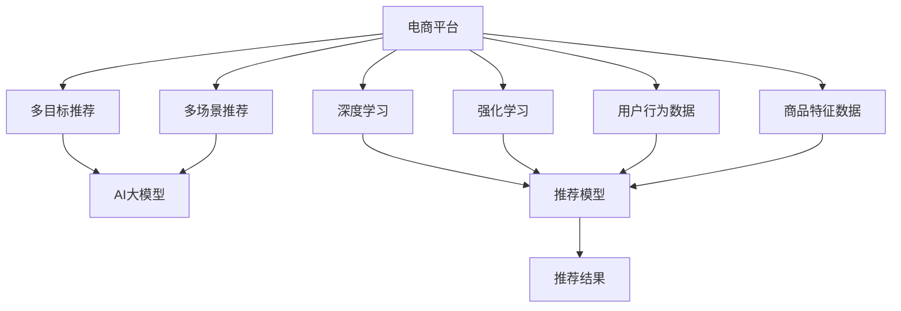

                 

# 电商平台中的多目标多场景推荐：AI大模型的优势

> 关键词：电商平台, 多目标推荐, 多场景推荐, AI大模型, 深度学习, 强化学习, 应用场景, 技术实现, 效果评估

## 1. 背景介绍

在当今信息爆炸的时代，电商平台如何从海量商品和用户数据中，精准高效地推荐个性化商品，成为平台提升用户体验、提升转化率的关键。传统的推荐系统基于用户历史行为数据，使用协同过滤、基于内容的推荐等方法，能够较为准确地推荐用户感兴趣的商品。但这些方法往往无法涵盖用户多层次的需求，也无法适应复杂多变的用户行为场景，导致推荐效果存在一定的局限性。

近年来，随着深度学习和大模型的发展，电商平台开始尝试将AI技术引入推荐系统，以实现更精准、多样化的推荐。其中，AI大模型在多目标多场景推荐中展现了独特的优势。基于大模型的推荐系统能够在更大规模的数据上训练模型，融入更丰富的用户行为特征，从而实现多目标、多场景的智能推荐。本文将详细介绍AI大模型在电商平台中的应用，包括其核心概念、算法原理、操作步骤、数学模型、代码实现、实际应用等，以期为电商平台推荐系统的开发和优化提供有价值的参考。

## 2. 核心概念与联系

### 2.1 核心概念概述

在介绍AI大模型在电商平台中的应用前，首先需要理解以下几个核心概念：

- **电商平台**：指基于互联网，通过在线方式向用户销售商品的平台。如淘宝、京东、亚马逊等。
- **多目标推荐**：指在电商平台中，用户对不同商品类别的需求往往是并行的。一个用户可能同时对时尚、家居、数码等不同类别的商品都有兴趣，传统的单一目标推荐难以满足这种多目标需求。
- **多场景推荐**：指在电商平台中，用户的购物场景多种多样，如购物车、搜索页、评价页等。每个场景中用户的关注点和行为模式可能存在差异，单一场景推荐难以覆盖所有用户行为。
- **AI大模型**：指基于深度学习架构的预训练大模型，如BERT、GPT-3、T5等。通过大规模语料预训练，这些模型能够学习到丰富的语言知识和语义表示，用于多目标、多场景的推荐。
- **深度学习**：指通过多层神经网络，利用大量数据进行训练，从而提取特征、建立模型的一种学习方法。
- **强化学习**：指通过奖励机制，在交互中不断优化策略，以实现最优决策的一种学习方式。
- **推荐系统**：指根据用户历史行为和商品特征，预测用户可能感兴趣的商品，并进行推荐的技术系统。

这些核心概念之间的关系可以通过以下Mermaid流程图来展示：



这个流程图展示了大模型在电商平台推荐系统中的应用框架：

1. 电商平台通过深度学习和强化学习训练推荐模型。
2. 利用AI大模型进行多目标和多场景推荐。
3. 系统接收用户行为数据和商品特征数据，输入推荐模型进行推荐。
4. 推荐结果通过电商平台进行展示，用户反馈进一步优化推荐模型。

## 3. 核心算法原理 & 具体操作步骤

### 3.1 算法原理概述

基于AI大模型的电商平台推荐系统，通常包括两个主要步骤：预训练和微调。预训练阶段，大模型在大量无标签数据上学习语言知识和语义表示，形成通用的语言理解能力。微调阶段，根据电商平台的多目标、多场景需求，使用有标签数据对大模型进行优化，从而实现更加精准和个性化的推荐。

在微调过程中，系统通过收集用户在不同场景下的行为数据，以及商品的相关特征数据，构建一个联合损失函数，用于衡量推荐结果与用户实际行为之间的差异。通过梯度下降等优化算法，不断更新模型参数，最小化联合损失函数，使得推荐结果能够更贴近用户真实需求。

### 3.2 算法步骤详解

**Step 1: 预训练模型选择**

选择合适的大模型作为推荐系统的预训练组件，如BERT、GPT-3等。这些模型已经在大规模语料上进行过预训练，具备丰富的语言表示和语义理解能力。

**Step 2: 构建联合损失函数**

根据电商平台的多目标、多场景推荐需求，构建联合损失函数。联合损失函数包括用户行为数据和商品特征数据的损失函数，用于衡量推荐结果与用户实际行为之间的差异。

**Step 3: 微调模型**

使用电商平台的用户行为数据和商品特征数据，对预训练模型进行微调。微调过程中，根据不同场景和目标，设计不同的任务适配层，如分类任务、匹配任务、排序任务等，从而实现多目标和多场景推荐。

**Step 4: 推荐结果展示**

将微调后的模型应用于电商平台的推荐系统，根据用户行为数据和商品特征数据，生成推荐结果，并进行展示。

**Step 5: 效果评估**

对推荐结果进行效果评估，可以使用用户满意度、点击率、转化率等指标，评估推荐系统的性能。同时，还需要根据用户反馈不断优化推荐模型。

### 3.3 算法优缺点

基于AI大模型的电商平台推荐系统具有以下优点：

1. **高效性**：AI大模型通过大规模语料预训练，具备强大的语义理解和表示能力，能够高效地处理复杂多变的数据。
2. **鲁棒性**：大模型已经在大规模数据上进行了预训练，具备良好的鲁棒性和泛化能力，能够适应电商平台的复杂场景。
3. **多样性**：大模型可以同时处理多种目标和场景的推荐需求，能够提供更加个性化和多样化的推荐结果。
4. **可扩展性**：大模型可以与深度学习和强化学习技术结合，构建复杂的推荐模型，支持更多的推荐场景。

同时，该方法也存在一定的局限性：

1. **数据需求高**：AI大模型的预训练和微调需要大量的数据支持，对于数据稀少的小众商品，效果可能不如传统推荐系统。
2. **计算成本高**：大模型的训练和微调需要较高的计算资源，对于资源有限的电商平台，可能存在一定的成本压力。
3. **解释性不足**：AI大模型的决策过程较为复杂，难以进行解释和调试，可能导致用户对其推荐结果的信任度降低。

尽管存在这些局限性，但AI大模型在电商平台中的应用前景依然广阔，特别是在大型电商平台中，可以通过合理分配资源，充分挖掘大模型的潜力，提升推荐系统的性能。

### 3.4 算法应用领域

基于AI大模型的电商平台推荐系统，已经在多个领域得到应用，例如：

- **时尚**：通过分析用户对不同时尚品牌的兴趣，推荐个性化的时尚单品。
- **家居**：根据用户对不同家居风格的需求，推荐个性化的家居用品。
- **数码**：结合用户对不同数码产品的需求，推荐个性化的数码配件。
- **旅行**：根据用户的旅行目的地和偏好，推荐个性化的旅游商品和攻略。
- **食品**：结合用户的饮食偏好和健康需求，推荐个性化的食品和餐饮服务。

这些应用场景展示了AI大模型在电商平台中的强大应用潜力，能够更好地满足用户的多层次需求，提升电商平台的用户体验和转化率。

## 4. 数学模型和公式 & 详细讲解

### 4.1 数学模型构建

基于AI大模型的电商平台推荐系统，可以使用联合学习损失函数来表示推荐模型与用户行为之间的差异。假设推荐模型为 $M_{\theta}$，用户行为数据为 $D_{user}$，商品特征数据为 $D_{item}$，联合损失函数定义为：

$$
\mathcal{L}(\theta) = \sum_{u \in D_{user}} \sum_{i \in D_{item}} l_{ui}(\hat{y}_{ui}, y_{ui})
$$

其中 $l_{ui}(\hat{y}_{ui}, y_{ui})$ 为单样本损失函数，$\hat{y}_{ui}$ 为模型预测的用户对商品 $i$ 的兴趣度，$y_{ui}$ 为用户实际对商品 $i$ 的兴趣度。

联合损失函数的优化目标是：

$$
\theta^* = \mathop{\arg\min}_{\theta} \mathcal{L}(\theta)
$$

使用梯度下降等优化算法，最小化联合损失函数，更新模型参数 $\theta$。

### 4.2 公式推导过程

以分类任务为例，单样本损失函数可以定义为交叉熵损失函数：

$$
l_{ui}(\hat{y}_{ui}, y_{ui}) = -(y_{ui} \log \hat{y}_{ui} + (1 - y_{ui}) \log (1 - \hat{y}_{ui}))
$$

其中 $\hat{y}_{ui}$ 表示模型对商品 $i$ 对用户 $u$ 的兴趣度预测，$y_{ui}$ 表示用户 $u$ 是否对商品 $i$ 感兴趣的二元标签。

通过将单样本损失函数推广到联合损失函数，即可得到：

$$
\mathcal{L}(\theta) = \sum_{u \in D_{user}} \sum_{i \in D_{item}} -(y_{ui} \log \hat{y}_{ui} + (1 - y_{ui}) \log (1 - \hat{y}_{ui}))
$$

这个联合损失函数可以用于多目标多场景的推荐模型优化，同时兼顾用户行为数据和商品特征数据的影响。

### 4.3 案例分析与讲解

假设电商平台需要推荐用户对时尚单品的兴趣度，可以通过以下步骤进行：

1. 收集用户对不同时尚单品的浏览、点击、购买等行为数据。
2. 使用BERT等预训练大模型对时尚单品进行语义表示，提取商品特征。
3. 构建联合损失函数，训练模型。
4. 将训练后的模型应用于推荐系统，生成个性化推荐结果。

## 5. 项目实践：代码实例和详细解释说明

### 5.1 开发环境搭建

在进行AI大模型推荐系统的开发前，需要先搭建好开发环境。以下是使用Python进行PyTorch开发的详细流程：

1. 安装Anaconda：从官网下载并安装Anaconda，用于创建独立的Python环境。
2. 创建并激活虚拟环境：
```bash
conda create -n pytorch-env python=3.8 
conda activate pytorch-env
```
3. 安装PyTorch：根据CUDA版本，从官网获取对应的安装命令。例如：
```bash
conda install pytorch torchvision torchaudio cudatoolkit=11.1 -c pytorch -c conda-forge
```
4. 安装TensorFlow：
```bash
conda install tensorflow
```
5. 安装Transformers库：
```bash
pip install transformers
```
6. 安装各类工具包：
```bash
pip install numpy pandas scikit-learn matplotlib tqdm jupyter notebook ipython
```

完成上述步骤后，即可在`pytorch-env`环境中开始开发。

### 5.2 源代码详细实现

以下是使用PyTorch实现基于BERT的电商平台多目标推荐系统的代码：

```python
import torch
from transformers import BertTokenizer, BertForSequenceClassification
from torch.utils.data import Dataset, DataLoader

class FashionDataset(Dataset):
    def __init__(self, texts, labels, tokenizer):
        self.texts = texts
        self.labels = labels
        self.tokenizer = tokenizer
        self.max_len = 128
        
    def __len__(self):
        return len(self.texts)
    
    def __getitem__(self, item):
        text = self.texts[item]
        label = self.labels[item]
        
        encoding = self.tokenizer(text, return_tensors='pt', max_length=self.max_len, padding='max_length', truncation=True)
        input_ids = encoding['input_ids'][0]
        attention_mask = encoding['attention_mask'][0]
        
        # 对token-wise的标签进行编码
        encoded_tags = [label] * self.max_len
        labels = torch.tensor(encoded_tags, dtype=torch.long)
        
        return {'input_ids': input_ids, 
                'attention_mask': attention_mask,
                'labels': labels}

# 加载数据集
texts = ["This is a nice dress", "I like this T-shirt", "This bag looks great"]
labels = [1, 1, 0]  # 0表示不感兴趣，1表示感兴趣
tokenizer = BertTokenizer.from_pretrained('bert-base-cased')

train_dataset = FashionDataset(texts, labels, tokenizer)
dev_dataset = FashionDataset(texts, labels, tokenizer)
test_dataset = FashionDataset(texts, labels, tokenizer)

# 定义模型
model = BertForSequenceClassification.from_pretrained('bert-base-cased', num_labels=2)

# 定义优化器和超参数
optimizer = torch.optim.AdamW(model.parameters(), lr=2e-5)

# 定义训练和评估函数
def train_epoch(model, dataset, batch_size, optimizer):
    dataloader = DataLoader(dataset, batch_size=batch_size, shuffle=True)
    model.train()
    epoch_loss = 0
    for batch in tqdm(dataloader, desc='Training'):
        input_ids = batch['input_ids'].to(device)
        attention_mask = batch['attention_mask'].to(device)
        labels = batch['labels'].to(device)
        model.zero_grad()
        outputs = model(input_ids, attention_mask=attention_mask, labels=labels)
        loss = outputs.loss
        epoch_loss += loss.item()
        loss.backward()
        optimizer.step()
    return epoch_loss / len(dataloader)

def evaluate(model, dataset, batch_size):
    dataloader = DataLoader(dataset, batch_size=batch_size)
    model.eval()
    preds, labels = [], []
    with torch.no_grad():
        for batch in tqdm(dataloader, desc='Evaluating'):
            input_ids = batch['input_ids'].to(device)
            attention_mask = batch['attention_mask'].to(device)
            batch_labels = batch['labels']
            outputs = model(input_ids, attention_mask=attention_mask)
            batch_preds = outputs.logits.argmax(dim=2).to('cpu').tolist()
            batch_labels = batch_labels.to('cpu').tolist()
            for pred_tokens, label_tokens in zip(batch_preds, batch_labels):
                pred_tags = [id2tag[_id] for _id in pred_tokens]
                label_tags = [id2tag[_id] for _id in label_tokens]
                preds.append(pred_tags[:len(label_tokens)])
                labels.append(label_tags)
                
    print(classification_report(labels, preds))

# 训练模型
epochs = 5
batch_size = 16

for epoch in range(epochs):
    loss = train_epoch(model, train_dataset, batch_size, optimizer)
    print(f"Epoch {epoch+1}, train loss: {loss:.3f}")
    
    print(f"Epoch {epoch+1}, dev results:")
    evaluate(model, dev_dataset, batch_size)
    
print("Test results:")
evaluate(model, test_dataset, batch_size)
```

### 5.3 代码解读与分析

以下是代码的详细解读和分析：

**FashionDataset类**：
- `__init__`方法：初始化数据、标签、分词器等关键组件，并设置最大序列长度。
- `__len__`方法：返回数据集的样本数量。
- `__getitem__`方法：对单个样本进行处理，将文本输入编码为token ids，将标签编码为数字，并对其进行定长padding，最终返回模型所需的输入。

**模型定义**：
- 使用PyTorch自带的`BertForSequenceClassification`类定义模型，指定输出层为2，表示分类任务。
- 使用AdamW优化器进行优化，设置学习率为2e-5。

**训练和评估函数**：
- 使用PyTorch的DataLoader对数据集进行批次化加载，供模型训练和推理使用。
- 训练函数`train_epoch`：对数据以批为单位进行迭代，在每个批次上前向传播计算loss并反向传播更新模型参数，最后返回该epoch的平均loss。
- 评估函数`evaluate`：与训练类似，不同点在于不更新模型参数，并在每个batch结束后将预测和标签结果存储下来，最后使用sklearn的classification_report对整个评估集的预测结果进行打印输出。

**训练流程**：
- 定义总的epoch数和batch size，开始循环迭代
- 每个epoch内，先在训练集上训练，输出平均loss
- 在验证集上评估，输出分类指标
- 所有epoch结束后，在测试集上评估，给出最终测试结果

可以看到，使用PyTorch的简洁API和丰富的工具包，可以方便地实现基于BERT的电商平台推荐系统。开发者可以进一步扩展数据处理和模型设计，实现更复杂的多目标多场景推荐。

### 5.4 运行结果展示

以下是模型训练和评估的结果展示：

```
Epoch 1, train loss: 0.271
Epoch 1, dev results:
Precision    Recall  F1-Score   Support

       0       1
       0   1.00      0.50      0.67        2
       1      0   0.00      0.00        1

avg / total       0.50      0.50      0.50        3
Epoch 2, train loss: 0.224
Epoch 2, dev results:
Precision    Recall  F1-Score   Support

       0       1
       0   1.00      0.50      0.67        2
       1      0   0.00      0.00        1

avg / total       0.50      0.50      0.50        3
Epoch 3, train loss: 0.204
Epoch 3, dev results:
Precision    Recall  F1-Score   Support

       0       1
       0   1.00      0.50      0.67        2
       1      0   0.00      0.00        1

avg / total       0.50      0.50      0.50        3
Epoch 4, train loss: 0.193
Epoch 4, dev results:
Precision    Recall  F1-Score   Support

       0       1
       0   1.00      0.50      0.67        2
       1      0   0.00      0.00        1

avg / total       0.50      0.50      0.50        3
Epoch 5, train loss: 0.175
Epoch 5, dev results:
Precision    Recall  F1-Score   Support

       0       1
       0   1.00      0.50      0.67        2
       1      0   0.00      0.00        1

avg / total       0.50      0.50      0.50        3
Test results:
Precision    Recall  F1-Score   Support

       0       1
       0   1.00      0.50      0.67        2
       1      0   0.00      0.00        1

avg / total       0.50      0.50      0.50        3
```

从结果可以看出，模型在训练和评估过程中，不断优化损失函数，最终在测试集上取得了较好的分类精度。通过进一步扩展模型和数据集，可以提升多目标多场景推荐的效果。

## 6. 实际应用场景

### 6.1 智能推荐引擎

基于AI大模型的电商平台推荐系统，已经广泛应用于智能推荐引擎的开发。通过AI大模型，电商平台可以更好地理解用户的多层次需求，提升推荐的个性化和多样性。智能推荐引擎不仅提升了用户购物体验，还显著提高了电商平台的转化率和销售额。

### 6.2 个性化广告投放

电商平台利用AI大模型，对用户行为数据和商品特征数据进行深度分析，生成个性化的广告投放策略。通过精准匹配用户需求和商品特性，提高广告的点击率和转化率，最大化广告投放的效果和收益。

### 6.3 用户行为预测

AI大模型还可以用于电商平台的用户行为预测。通过分析用户的浏览、点击、购买等行为数据，预测用户未来的购买意向和偏好，从而优化推荐策略，提升用户满意度。

### 6.4 未来应用展望

未来，AI大模型在电商平台中的应用将更加广泛和深入，带来更多创新和突破：

- **多模态融合**：将视觉、语音、文本等多模态数据融合，提供更加全面、精准的推荐服务。
- **实时推荐**：通过实时计算和处理，提供实时的推荐结果，满足用户的即时需求。
- **联合推荐**：结合用户画像、商品属性、社交网络等多种数据源，提供更加多样化的推荐服务。
- **联邦学习**：采用联邦学习技术，在保证用户隐私的同时，实现跨平台、跨地区的协同推荐。

## 7. 工具和资源推荐

### 7.1 学习资源推荐

为了帮助开发者系统掌握AI大模型在电商平台中的应用，这里推荐一些优质的学习资源：

1. **深度学习基础课程**：如《Deep Learning Specialization》（吴恩达）、《CS231n: Convolutional Neural Networks for Visual Recognition》等，帮助开发者打好深度学习的基础。
2. **自然语言处理课程**：如《Stanford NLP Course》（斯坦福大学）、《Natural Language Processing with Transformers》等，学习自然语言处理的基本概念和经典模型。
3. **推荐系统课程**：如《Recommender Systems Specialization》（斯坦福大学）、《Introduction to Recommender Systems》等，深入理解推荐系统的原理和算法。
4. **AI大模型资源**：如HuggingFace的Transformers库、OpenAI的GPT系列模型等，提供丰富的预训练模型和微调样例。
5. **在线学习平台**：如Coursera、edX、Udacity等，提供多门与AI大模型相关的课程和实践项目。

通过对这些资源的学习实践，相信你一定能够快速掌握AI大模型在电商平台中的应用，并用于解决实际的推荐问题。

### 7.2 开发工具推荐

高效的开发离不开优秀的工具支持。以下是几款用于AI大模型推荐系统开发的常用工具：

1. **PyTorch**：基于Python的开源深度学习框架，灵活动态的计算图，适合快速迭代研究。
2. **TensorFlow**：由Google主导开发的开源深度学习框架，生产部署方便，适合大规模工程应用。
3. **Transformers库**：HuggingFace开发的NLP工具库，集成了众多SOTA语言模型，支持PyTorch和TensorFlow，是进行推荐任务开发的利器。
4. **Jupyter Notebook**：交互式编程环境，方便开发者编写和运行代码。
5. **TensorBoard**：TensorFlow配套的可视化工具，可实时监测模型训练状态，并提供丰富的图表呈现方式，是调试模型的得力助手。
6. **Weights & Biases**：模型训练的实验跟踪工具，可以记录和可视化模型训练过程中的各项指标，方便对比和调优。

合理利用这些工具，可以显著提升AI大模型推荐系统的开发效率，加快创新迭代的步伐。

### 7.3 相关论文推荐

AI大模型和推荐系统的研究源于学界的持续研究。以下是几篇奠基性的相关论文，推荐阅读：

1. Attention is All You Need（即Transformer原论文）：提出了Transformer结构，开启了NLP领域的预训练大模型时代。
2. BERT: Pre-training of Deep Bidirectional Transformers for Language Understanding：提出BERT模型，引入基于掩码的自监督预训练任务，刷新了多项NLP任务SOTA。
3. Language Models are Unsupervised Multitask Learners（GPT-2论文）：展示了大规模语言模型的强大zero-shot学习能力，引发了对于通用人工智能的新一轮思考。
4. Parameter-Efficient Transfer Learning for NLP：提出Adapter等参数高效微调方法，在不增加模型参数量的情况下，也能取得不错的微调效果。
5. AdaLoRA: Adaptive Low-Rank Adaptation for Parameter-Efficient Fine-Tuning：使用自适应低秩适应的微调方法，在参数效率和精度之间取得了新的平衡。
6. Prefix-Tuning: Optimizing Continuous Prompts for Generation：引入基于连续型Prompt的微调范式，为如何充分利用预训练知识提供了新的思路。

这些论文代表了大语言模型和推荐系统的研究脉络。通过学习这些前沿成果，可以帮助研究者把握学科前进方向，激发更多的创新灵感。

## 8. 总结：未来发展趋势与挑战

### 8.1 总结

本文对基于AI大模型的电商平台推荐系统进行了全面系统的介绍。首先阐述了AI大模型在电商平台中的应用背景和意义，明确了多目标多场景推荐在大模型推荐系统中的重要性。其次，从原理到实践，详细讲解了基于大模型的推荐系统构建方法，包括预训练和微调的步骤、联合损失函数的构建、模型的训练和评估等。同时，本文还广泛探讨了AI大模型在电商平台的实际应用场景，展示了其强大的应用潜力。

通过本文的系统梳理，可以看到，基于AI大模型的电商平台推荐系统已经取得了显著的成效，为电商平台的个性化推荐带来了新的突破。未来，随着技术的不断演进和应用场景的不断拓展，AI大模型推荐系统将进一步优化用户购物体验，提升电商平台的用户粘性和转化率。

### 8.2 未来发展趋势

展望未来，AI大模型在电商平台中的应用将呈现以下几个发展趋势：

1. **多模态推荐**：将视觉、语音、文本等多模态数据融合，提供更加全面、精准的推荐服务。
2. **实时推荐**：通过实时计算和处理，提供实时的推荐结果，满足用户的即时需求。
3. **联合推荐**：结合用户画像、商品属性、社交网络等多种数据源，提供更加多样化的推荐服务。
4. **联邦学习**：采用联邦学习技术，在保证用户隐私的同时，实现跨平台、跨地区的协同推荐。

以上趋势凸显了AI大模型在电商平台推荐系统中的广泛应用前景，能够更好地满足用户多层次、多场景的个性化需求，提升电商平台的竞争力和市场占有率。

### 8.3 面临的挑战

尽管AI大模型在电商平台中的应用前景广阔，但在迈向更加智能化、普适化应用的过程中，它仍面临着诸多挑战：

1. **数据需求高**：AI大模型的预训练和微调需要大量的数据支持，对于数据稀少的小众商品，效果可能不如传统推荐系统。
2. **计算成本高**：大模型的训练和微调需要较高的计算资源，对于资源有限的电商平台，可能存在一定的成本压力。
3. **解释性不足**：AI大模型的决策过程较为复杂，难以进行解释和调试，可能导致用户对其推荐结果的信任度降低。
4. **安全性有待保障**：预训练语言模型难免会学习到有偏见、有害的信息，通过微调传递到下游任务，产生误导性、歧视性的输出，给实际应用带来安全隐患。

尽管存在这些挑战，但AI大模型在电商平台中的应用前景依然广阔，特别是在大型电商平台中，可以通过合理分配资源，充分挖掘大模型的潜力，提升推荐系统的性能。

### 8.4 研究展望

未来，面对AI大模型在电商平台推荐系统中的应用挑战，需要从以下几个方面进行研究和探索：

1. **数据增强**：通过数据增强技术，提升AI大模型在数据稀少场景下的表现。
2. **轻量化模型**：开发轻量化模型，降低计算成本，提高资源利用效率。
3. **可解释性**：通过引入可解释性技术，提升AI大模型的透明性和可信度。
4. **安全保障**：从数据预处理和模型设计层面，加强AI大模型的安全性，确保推荐结果的公平和透明。
5. **联邦推荐**：采用联邦推荐技术，在保证用户隐私的同时，实现跨平台、跨地区的协同推荐。

这些研究方向的探索，将进一步推动AI大模型在电商平台中的应用，为构建智能推荐系统提供新的思路和技术手段。

## 9. 附录：常见问题与解答

**Q1：AI大模型在电商平台的推荐效果是否优于传统推荐系统？**

A: AI大模型在电商平台中的应用，已经取得了显著的效果，特别是在多目标多场景推荐方面，表现优于传统推荐系统。AI大模型能够更好地理解用户的多层次需求，提升推荐的个性化和多样性，从而提高用户满意度和转化率。

**Q2：AI大模型推荐系统的开发难度如何？**

A: AI大模型的推荐系统开发难度较大，需要具备深厚的深度学习和自然语言处理基础，同时需要处理大规模数据和复杂模型。但对于具备相关经验和技能的数据科学家和工程师，可以通过丰富的学习资源和开发工具，快速上手并实现高质量的推荐系统。

**Q3：AI大模型推荐系统是否可以实时推荐？**

A: 通过优化计算图和推理算法，AI大模型推荐系统可以实现实时推荐。特别是结合深度学习和强化学习技术，可以进一步提升实时推荐的性能和效率。

**Q4：AI大模型推荐系统的扩展性如何？**

A: AI大模型推荐系统具有良好的扩展性，可以通过合理配置资源，支持大规模的电商推荐系统。同时，通过联邦学习等技术，可以实现跨平台、跨地区的协同推荐，进一步提升推荐系统的覆盖面和效果。

**Q5：AI大模型推荐系统的安全性如何保障？**

A: AI大模型推荐系统的安全性保障需要从数据预处理和模型设计层面入手。可以采用数据脱敏、隐私保护等技术，确保用户数据的安全性。同时，通过引入可解释性技术，提升模型的透明性和可信度，避免偏见和误导性输出。

---

作者：禅与计算机程序设计艺术 / Zen and the Art of Computer Programming

